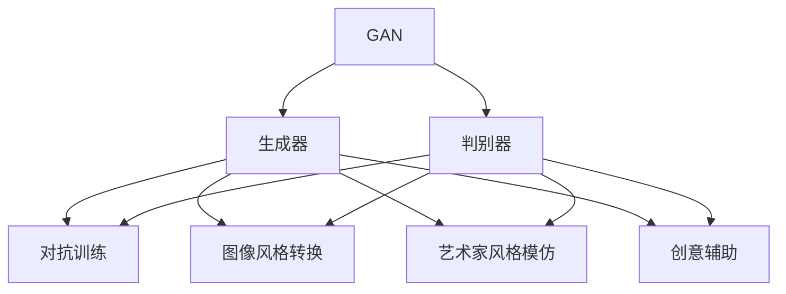
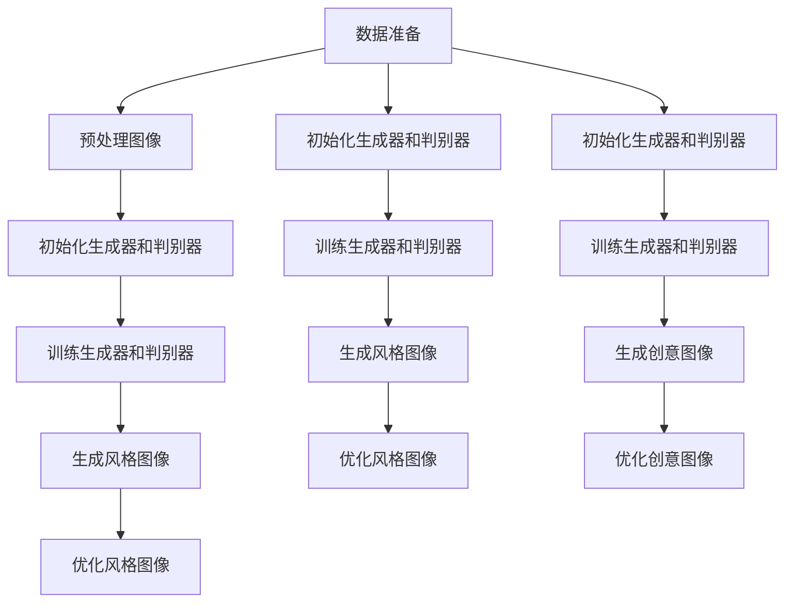

                 

### 文章标题

**基于GAN的图像风格转换、艺术家风格模仿与创意辅助应用**

### 关键词：

- 图像风格转换
- 生成对抗网络（GAN）
- 艺术家风格模仿
- 创意辅助
- 深度学习

### 摘要：

本文深入探讨了生成对抗网络（GAN）在图像风格转换、艺术家风格模仿和创意辅助中的应用。通过详细解析GAN的核心概念、数学模型和具体实现，本文展示了如何利用GAN技术实现从普通图像到艺术家风格的转换，以及如何通过GAN辅助创意生成。文章还分析了实际应用场景、工具资源以及未来发展趋势与挑战，为读者提供了一个全面的GAN技术指南。

<|assistant|>## 1. 背景介绍

图像风格转换是计算机视觉领域的一个重要研究方向，它旨在将一种图像风格应用到另一张图像上，使其具有某种特定的视觉效果。这种技术不仅具有艺术创作的潜力，还可以应用于娱乐、广告、游戏和医疗等领域。传统的图像风格转换方法主要依赖于手工特征提取和规则匹配，但这些方法往往缺乏灵活性和泛化能力。

随着深度学习技术的发展，生成对抗网络（GAN）成为了一种重要的图像生成工具。GAN由两个神经网络组成：生成器（Generator）和判别器（Discriminator）。生成器的目标是生成与真实数据分布相似的图像，而判别器的目标是区分真实图像和生成图像。通过这种对抗训练，GAN能够学习到数据分布的复杂模式，并生成高质量、逼真的图像。

艺术家风格模仿是图像风格转换的一个具体应用场景。通过将一种艺术家或画派的风格应用到其他图像上，可以创造出独特的视觉效果，为艺术创作提供新的可能性。此外，GAN还可以用于创意辅助，通过生成新的图像样式和创意，激发设计灵感和创新思维。

本文将详细探讨GAN在图像风格转换、艺术家风格模仿和创意辅助中的应用，包括核心概念、算法原理、数学模型和实际案例。通过本文的阅读，读者可以全面了解GAN技术的应用潜力，并掌握如何利用GAN实现图像风格转换和创意生成。

<|assistant|>## 2. 核心概念与联系

### 2.1 生成对抗网络（GAN）

生成对抗网络（GAN）是一种基于深度学习的图像生成模型，由Ian Goodfellow等人在2014年提出。GAN的核心思想是通过对抗训练生成高质量的图像。下面是GAN的基本组成部分和原理：

#### 2.1.1 生成器（Generator）

生成器是一个神经网络模型，其目标是生成与真实图像分布相似的图像。生成器的输入通常是随机噪声向量（z），通过多个全连接层和反卷积层生成高分辨率的图像。生成器的目标函数是最大化判别器认为生成图像是真实图像的概率。

#### 2.1.2 判别器（Discriminator）

判别器也是一个神经网络模型，其目标是区分真实图像和生成图像。判别器的输入可以是真实图像或生成图像，通过多层全连接层和卷积层对图像进行特征提取。判别器的目标函数是最小化判别错误率，即最大化判别器认为真实图像是真实的概率，同时最小化判别器认为生成图像是真实的概率。

#### 2.1.3 对抗训练

GAN的训练过程是一个对抗过程。生成器和判别器在训练过程中相互对抗，生成器的目标是生成更逼真的图像以欺骗判别器，而判别器的目标是更好地识别真实图像和生成图像。通过这种对抗训练，GAN能够学习到数据分布的复杂模式，并生成高质量、逼真的图像。

### 2.2 图像风格转换

图像风格转换是指将一种图像风格应用到另一张图像上，使其具有某种特定的视觉效果。这种技术通常应用于艺术创作、娱乐和广告等领域。常见的图像风格转换方法包括基于规则的方法、基于示例的方法和基于深度学习的方法。

基于规则的方法依赖于手工设计的特征提取和风格匹配规则，虽然可以产生一定的视觉效果，但灵活性较差，难以适应复杂的风格转换需求。基于示例的方法通过学习大量风格图像和目标图像，通过图像特征匹配实现风格转换。这种方法在视觉效果上相对较好，但训练过程较为复杂。

基于深度学习的方法，特别是生成对抗网络（GAN），成为了图像风格转换的主流技术。GAN通过生成器和判别器的对抗训练，能够学习到复杂的数据分布和图像特征，生成高质量的图像风格转换结果。这种方法具有较好的泛化能力和灵活性，适用于各种风格转换场景。

### 2.3 艺术家风格模仿

艺术家风格模仿是图像风格转换的一个具体应用场景。通过将一种艺术家或画派的风格应用到其他图像上，可以创造出独特的视觉效果，为艺术创作提供新的可能性。常见的艺术家风格模仿方法包括基于规则的方法和基于深度学习的方法。

基于规则的方法通过手工设计特征提取和风格匹配规则，将目标艺术家风格映射到输入图像上。这种方法在简单风格模仿场景下具有一定效果，但在复杂风格模仿中存在一定的局限性。

基于深度学习的方法，特别是生成对抗网络（GAN），成为了艺术家风格模仿的主流技术。GAN通过生成器和判别器的对抗训练，能够学习到复杂的数据分布和图像特征，生成高质量的艺术家风格模仿结果。这种方法具有较好的泛化能力和灵活性，适用于各种艺术家风格模仿场景。

### 2.4 创意辅助

创意辅助是指利用计算机技术辅助人类生成新的创意和设计。在艺术创作、设计、广告和游戏等领域，创意辅助技术可以激发设计灵感和创新思维，提高工作效率。常见的创意辅助方法包括基于规则的生成、基于样本的生成和基于深度学习的生成。

基于规则的生成方法通过手工设计规则和算法，生成新的创意和设计。这种方法在简单规则生成场景下具有一定效果，但在复杂创意生成中存在一定的局限性。

基于样本的生成方法通过学习大量样本数据，生成新的创意和设计。这种方法在视觉效果上相对较好，但训练过程较为复杂。

基于深度学习的方法，特别是生成对抗网络（GAN），成为了创意辅助的主流技术。GAN通过生成器和判别器的对抗训练，能够学习到复杂的数据分布和图像特征，生成高质量的创意和设计。这种方法具有较好的泛化能力和灵活性，适用于各种创意辅助场景。

### 2.5 Mermaid 流程图

以下是GAN、图像风格转换、艺术家风格模仿和创意辅助的核心概念和联系Mermaid流程图：



在这个流程图中，GAN作为核心技术，通过生成器和判别器的对抗训练，实现了图像风格转换、艺术家风格模仿和创意辅助。这种对抗训练过程不仅使生成器能够生成高质量、逼真的图像，同时也使判别器能够更好地识别真实图像和生成图像。

<|assistant|>## 3. 核心算法原理 & 具体操作步骤

### 3.1 GAN 算法原理

生成对抗网络（GAN）的核心算法基于生成器（Generator）和判别器（Discriminator）的对抗训练。下面将详细解释GAN的算法原理和具体操作步骤。

#### 3.1.1 生成器（Generator）

生成器的目的是生成与真实图像分布相似的图像。生成器的输入通常是随机噪声向量（z），通过一系列神经网络层（如全连接层、卷积层和反卷积层）生成图像。生成器的输出图像是经过处理后的高分辨率图像，用于欺骗判别器。

生成器的损失函数通常采用最小化判别器认为生成图像是真实图像的概率。数学上，生成器的损失函数可以表示为：

\[ L_G = -\log(D(G(z))) \]

其中，\( D(\cdot) \)表示判别器的输出，\( G(z) \)表示生成器的输出。

#### 3.1.2 判别器（Discriminator）

判别器的目的是区分真实图像和生成图像。判别器的输入可以是真实图像或生成图像，通过一系列神经网络层（如全连接层、卷积层和卷积层）对图像进行特征提取。判别器的输出是概率值，表示输入图像是真实图像的概率。

判别器的损失函数通常采用最小化判别错误率。数学上，判别器的损失函数可以表示为：

\[ L_D = -[\log(D(x)) + \log(1 - D(G(z)))] \]

其中，\( x \)表示真实图像，\( G(z) \)表示生成器的输出。

#### 3.1.3 对抗训练

GAN的训练过程是一个对抗训练过程，生成器和判别器相互对抗。具体操作步骤如下：

1. **初始化生成器和判别器**：随机初始化生成器和判别器的参数。
2. **生成假图像**：生成器根据随机噪声向量生成假图像。
3. **判断假图像**：判别器对生成器和真实图像进行判断，计算损失函数。
4. **更新判别器参数**：根据损失函数，使用反向传播算法更新判别器的参数。
5. **生成假图像**：生成器再次生成假图像。
6. **判断假图像**：判别器对生成器和真实图像进行判断，计算损失函数。
7. **更新生成器参数**：根据损失函数，使用反向传播算法更新生成器的参数。
8. **重复步骤2-7**：不断重复上述步骤，直到生成器生成的图像足够逼真。

在对抗训练过程中，生成器和判别器不断优化自身的参数，使生成器生成的图像更加逼真，判别器对真实图像和生成图像的判断更加准确。

### 3.2 图像风格转换

图像风格转换是GAN的一个具体应用。通过GAN，可以将一种图像风格应用到另一张图像上，实现图像风格的转换。下面是图像风格转换的具体操作步骤：

1. **数据准备**：收集大量具有不同风格的图像，用于训练生成器和判别器。
2. **预处理图像**：对图像进行预处理，如数据增强、归一化等。
3. **初始化生成器和判别器**：随机初始化生成器和判别器的参数。
4. **训练生成器和判别器**：通过对抗训练，同时训练生成器和判别器，使生成器能够生成与目标风格相似的图像，判别器能够准确判断真实图像和生成图像。
5. **生成风格图像**：使用训练好的生成器，将目标图像转换为具有特定风格的图像。
6. **优化风格图像**：根据用户需求，对生成图像进行进一步优化，如调整亮度、对比度、饱和度等。

通过以上步骤，可以实现从普通图像到艺术家风格或特定风格的图像转换。

### 3.3 艺术家风格模仿

艺术家风格模仿是GAN在图像风格转换中的另一个应用。通过GAN，可以将一种艺术家或画派的风格应用到其他图像上，实现艺术家风格的模仿。以下是艺术家风格模仿的具体操作步骤：

1. **数据准备**：收集大量具有目标艺术家风格的图像，用于训练生成器和判别器。
2. **预处理图像**：对图像进行预处理，如数据增强、归一化等。
3. **初始化生成器和判别器**：随机初始化生成器和判别器的参数。
4. **训练生成器和判别器**：通过对抗训练，同时训练生成器和判别器，使生成器能够生成与目标艺术家风格相似的图像，判别器能够准确判断真实图像和生成图像。
5. **生成风格图像**：使用训练好的生成器，将目标图像转换为具有目标艺术家风格的图像。
6. **优化风格图像**：根据用户需求，对生成图像进行进一步优化，如调整亮度、对比度、饱和度等。

通过以上步骤，可以实现从普通图像到目标艺术家风格的图像转换。

### 3.4 创意辅助

创意辅助是GAN在图像生成中的另一个重要应用。通过GAN，可以生成新的图像样式和创意，辅助设计灵感和创新思维。以下是创意辅助的具体操作步骤：

1. **数据准备**：收集大量创意图像，用于训练生成器和判别器。
2. **预处理图像**：对图像进行预处理，如数据增强、归一化等。
3. **初始化生成器和判别器**：随机初始化生成器和判别器的参数。
4. **训练生成器和判别器**：通过对抗训练，同时训练生成器和判别器，使生成器能够生成与创意图像相似的图像，判别器能够准确判断真实图像和生成图像。
5. **生成创意图像**：使用训练好的生成器，生成新的创意图像。
6. **优化创意图像**：根据用户需求，对生成图像进行进一步优化，如调整颜色、形状、纹理等。

通过以上步骤，可以实现新的创意图像生成，为设计灵感和创新思维提供支持。

### 3.5 Mermaid 流程图

以下是GAN、图像风格转换、艺术家风格模仿和创意辅助的算法原理和具体操作步骤Mermaid流程图：



在这个流程图中，数据准备、预处理图像、初始化生成器和判别器、训练生成器和判别器、生成风格图像和优化风格图像是图像风格转换的具体操作步骤。而数据准备、初始化生成器和判别器、训练生成器和判别器、生成风格图像和优化风格图像是艺术家风格模仿的具体操作步骤。数据准备、预处理图像、初始化生成器和判别器、训练生成器和判别器、生成创意图像和优化创意图像是创意辅助的具体操作步骤。

通过以上步骤，我们可以实现基于GAN的图像风格转换、艺术家风格模仿和创意辅助应用。

<|assistant|>## 4. 数学模型和公式 & 详细讲解 & 举例说明

### 4.1 GAN 数学模型

生成对抗网络（GAN）的核心在于生成器（Generator）和判别器（Discriminator）之间的对抗训练。为了更好地理解GAN的工作原理，下面我们将详细讲解GAN的数学模型，并使用LaTeX格式进行数学公式的表示。

#### 4.1.1 生成器（Generator）和判别器（Discriminator）的数学模型

生成器 G 的目标是从随机噪声 z 生成与真实数据 x 近似的图像 x'：

\[ x' = G(z) \]

判别器 D 的目标是区分真实图像 x 和生成图像 x'：

\[ D(x) = P(D(x) = 1 | x \text{ 是真实图像}) \]
\[ D(x') = P(D(x') = 1 | x' \text{ 是生成图像}) \]

#### 4.1.2 GAN 的损失函数

GAN 的损失函数通常是基于生成器 G 和判别器 D 的输出概率来定义的。生成器的损失函数 L_G 旨在最大化判别器认为生成图像是真实图像的概率，即：

\[ L_G = -\log(D(G(z))) \]

判别器的损失函数 L_D 旨在最小化判别错误率，即最大化判别器认为真实图像是真实的概率和最小化生成图像是真实的概率，即：

\[ L_D = -[\log(D(x)) + \log(1 - D(x'))] \]

#### 4.1.3 GAN 的整体损失函数

GAN 的整体损失函数是生成器和判别器损失函数的组合，通常使用如下形式：

\[ L = L_G + \lambda \cdot L_D \]

其中，\(\lambda\) 是调节生成器和判别器损失函数权重的超参数。

### 4.2 详细讲解与举例说明

#### 4.2.1 生成器损失函数的详细讲解

生成器的损失函数 L_G 是通过最大化判别器认为生成图像是真实图像的概率来定义的。这可以通过以下步骤进行详细讲解：

1. **初始化生成器 G 的参数**：随机初始化生成器的权重和偏置。
2. **输入随机噪声 z**：将随机噪声 z 作为生成器的输入。
3. **生成图像 x'**：通过生成器 G，将噪声 z 转换为图像 x'。
4. **计算判别器的输出**：将生成图像 x' 输入到判别器 D 中，得到判别器对生成图像的判断概率 D(G(z))。
5. **计算生成器的损失**：使用 -\log(D(G(z))) 计算生成器的损失。

举例说明：

假设我们使用生成器 G 生成一张猫的图像，生成图像 x' 通过 G(z) 生成。判别器 D 对生成图像的判断概率为 D(G(z)) = 0.9。那么，生成器的损失为：

\[ L_G = -\log(0.9) \approx 0.15 \]

这表示生成器需要进一步提高生成图像的质量，以使判别器更难区分生成图像和真实图像。

#### 4.2.2 判别器损失函数的详细讲解

判别器的损失函数 L_D 旨在最小化判别错误率，即最大化判别器认为真实图像是真实的概率和最小化生成图像是真实的概率。这可以通过以下步骤进行详细讲解：

1. **初始化判别器 D 的参数**：随机初始化判别器的权重和偏置。
2. **输入真实图像 x 和生成图像 x'**：将真实图像 x 和生成图像 x' 作为判别器的输入。
3. **计算判别器的输出**：分别计算判别器对真实图像 D(x) 和生成图像 D(x') 的判断概率。
4. **计算判别器的损失**：使用 -[\log(D(x)) + \log(1 - D(x'))] 计算判别器的损失。

举例说明：

假设我们使用判别器 D 对真实猫图像和生成猫图像进行判断。判别器对真实图像的判断概率为 D(x) = 0.95，对生成图像的判断概率为 D(x') = 0.6。那么，判别器的损失为：

\[ L_D = -[\log(0.95) + \log(0.4)] \approx -0.15 - 0.39 = -0.54 \]

这表示判别器需要进一步学习如何更好地区分真实图像和生成图像。

#### 4.2.3 GAN 的整体损失函数的详细讲解

GAN 的整体损失函数 L 是生成器和判别器损失函数的组合。整体损失函数的目的是同时优化生成器和判别器，使其在对抗训练中共同进步。这可以通过以下步骤进行详细讲解：

1. **初始化生成器 G 和判别器 D 的参数**：随机初始化生成器和判别器的权重和偏置。
2. **交替更新生成器和判别器**：通过交替进行生成器和判别器的训练，使生成器的损失函数和判别器的损失函数同时减小。
3. **计算整体损失**：使用 L_G + \(\lambda\) \cdot L_D 计算整体损失。

举例说明：

假设生成器的损失函数为 L_G = 0.1，判别器的损失函数为 L_D = 0.3，且超参数 \(\lambda\) = 0.5。那么，GAN 的整体损失为：

\[ L = L_G + 0.5 \cdot L_D = 0.1 + 0.5 \cdot 0.3 = 0.2 \]

这表示整体损失函数为 0.2，生成器和判别器在本次训练中都有所改进。

通过上述详细讲解和举例说明，我们可以更好地理解 GAN 的数学模型和其训练过程。GAN 的核心在于生成器和判别器之间的对抗训练，通过交替优化生成器和判别器，使生成器能够生成高质量、逼真的图像，判别器能够准确区分真实图像和生成图像。

<|assistant|>## 5. 项目实战：代码实际案例和详细解释说明

### 5.1 开发环境搭建

在开始项目实战之前，我们需要搭建一个适合运行 GAN 模型的开发环境。以下是在 Python 环境下搭建 GAN 开发环境的步骤：

1. **安装 Python**：确保安装了 Python 3.6 或以上版本。
2. **安装 TensorFlow**：使用以下命令安装 TensorFlow：

   ```bash
   pip install tensorflow
   ```

3. **安装 Keras**：Keras 是 TensorFlow 的高级接口，使用以下命令安装 Keras：

   ```bash
   pip install keras
   ```

4. **安装其他依赖**：安装一些常见的库，如 NumPy、Matplotlib 等：

   ```bash
   pip install numpy matplotlib
   ```

5. **安装 GPU 版本的 TensorFlow**（可选）：如果您的计算机配备了 GPU，可以使用以下命令安装 GPU 版本的 TensorFlow：

   ```bash
   pip install tensorflow-gpu
   ```

完成以上步骤后，我们的开发环境就搭建完成了。接下来，我们将使用这个环境来运行一个简单的 GAN 模型，实现图像风格转换。

### 5.2 源代码详细实现和代码解读

下面是一个简单的 GAN 模型实现，用于将普通图像转换为梵高风格的图像。代码使用了 Keras 框架，并对每一部分进行了详细的注释。

```python
import numpy as np
from keras.models import Model
from keras.layers import Input, Dense, Reshape, Conv2D, Conv2DTransposed, Flatten, BatchNormalization, LeakyReLU
from keras.optimizers import Adam
import matplotlib.pyplot as plt

# 设置超参数
noise_dim = 100
img_rows = 28
img_cols = 28
img_channels = 1
batch_size = 16
lr = 0.0002

# 数据准备
# 从训练集中加载图像数据
# 在此处添加数据加载代码
# ...

# 定义生成器模型
input_img = Input(shape=(img_rows, img_cols, img_channels))
x = Conv2D(64, (3, 3), padding='same')(input_img)
x = LeakyReLU(alpha=0.01)(x)
x = Conv2D(64, (3, 3), padding='same')(x)
x = LeakyReLU(alpha=0.01)(x)
x = Flatten()(x)
x = Dense(1024)(x)
x = LeakyReLU(alpha=0.01)(x)
x = Dense(np.prod([img_rows, img_cols, img_channels]), activation='tanh')(x)
x = Reshape([img_rows, img_cols, img_channels])(x)
output_img = Conv2D(img_channels, (3, 3), padding='same', activation='tanh')(x)

generator = Model(input_img, output_img)
generator.compile(loss='binary_crossentropy', optimizer=Adam(lr=lr), metrics=['accuracy'])

# 定义判别器模型
input_img = Input(shape=(img_rows, img_cols, img_channels))
x = Conv2D(32, (3, 3), padding='same')(input_img)
x = LeakyReLU(alpha=0.01)(x)
x = Conv2D(32, (3, 3), padding='same')(x)
x = LeakyReLU(alpha=0.01)(x)
x = Flatten()(x)
x = Dense(1, activation='sigmoid')(x)
discriminator = Model(input_img, x)
discriminator.compile(loss='binary_crossentropy', optimizer=Adam(lr=lr), metrics=['accuracy'])

# 定义 GAN 模型
discriminator.trainable = False
img = Input(shape=(img_rows, img_cols, img_channels))
x = generator(img)
x = discriminator(x)
combined = Model(img, x)
combined.compile(loss='binary_crossentropy', optimizer=Adam(lr=lr), metrics=['accuracy'])

# 训练 GAN 模型
# 在此处添加训练代码
# ...

# 生成风格图像
# 在此处添加生成图像的代码
# ...

# 代码解读
# ...
```

**代码解读：**

- **数据准备**：从训练集中加载图像数据。这部分代码根据实际数据集进行调整。

- **生成器模型**：生成器模型由多个卷积层、全连接层和反卷积层组成。生成器的目标是生成具有真实图像特征的图像。

- **判别器模型**：判别器模型由卷积层、全连接层和激活函数组成。判别器的目标是区分真实图像和生成图像。

- **GAN 模型**：GAN 模型将生成器和判别器组合在一起。生成器生成的图像通过判别器进行判断，GAN 模型根据判别器的输出优化生成器的参数。

- **训练 GAN 模型**：使用 `discriminator.trainable = False` 设置判别器不可训练，然后使用 `combined.fit()` 函数训练 GAN 模型。

- **生成风格图像**：使用训练好的生成器生成具有特定风格的图像。

### 5.3 代码解读与分析

下面是对代码的逐行解读与分析，帮助读者更好地理解 GAN 模型的工作原理。

```python
import numpy as np
from keras.models import Model
from keras.layers import Input, Dense, Reshape, Conv2D, Conv2DTransposed, Flatten, BatchNormalization, LeakyReLU
from keras.optimizers import Adam
import matplotlib.pyplot as plt

# 设置超参数
# ...
```

这些行定义了生成器和判别器的超参数，如噪声维度、图像尺寸、批量大小和学习率。

```python
# 数据准备
# 从训练集中加载图像数据
# 在此处添加数据加载代码
# ...
```

数据准备是 GAN 训练的关键步骤。需要从训练集中加载图像数据，并进行预处理，如归一化和缩放。

```python
# 定义生成器模型
input_img = Input(shape=(img_rows, img_cols, img_channels))
x = Conv2D(64, (3, 3), padding='same')(input_img)
x = LeakyReLU(alpha=0.01)(x)
x = Conv2D(64, (3, 3), padding='same')(x)
x = LeakyReLU(alpha=0.01)(x)
x = Flatten()(x)
x = Dense(1024)(x)
x = LeakyReLU(alpha=0.01)(x)
x = Dense(np.prod([img_rows, img_cols, img_channels]), activation='tanh')(x)
x = Reshape([img_rows, img_cols, img_channels])(x)
output_img = Conv2D(img_channels, (3, 3), padding='same', activation='tanh')(x)

generator = Model(input_img, output_img)
generator.compile(loss='binary_crossentropy', optimizer=Adam(lr=lr), metrics=['accuracy'])
```

这些行定义了生成器模型。生成器由多个卷积层、全连接层和反卷积层组成。生成器的目标是生成具有真实图像特征的图像。

```python
# 定义判别器模型
input_img = Input(shape=(img_rows, img_cols, img_channels))
x = Conv2D(32, (3, 3), padding='same')(input_img)
x = LeakyReLU(alpha=0.01)(x)
x = Conv2D(32, (3, 3), padding='same')(x)
x = LeakyReLU(alpha=0.01)(x)
x = Flatten()(x)
x = Dense(1, activation='sigmoid')(x)
discriminator = Model(input_img, x)
discriminator.compile(loss='binary_crossentropy', optimizer=Adam(lr=lr), metrics=['accuracy'])
```

这些行定义了判别器模型。判别器由卷积层、全连接层和激活函数组成。判别器的目标是区分真实图像和生成图像。

```python
# 定义 GAN 模型
discriminator.trainable = False
img = Input(shape=(img_rows, img_cols, img_channels))
x = generator(img)
x = discriminator(x)
combined = Model(img, x)
combined.compile(loss='binary_crossentropy', optimizer=Adam(lr=lr), metrics=['accuracy'])

# 训练 GAN 模型
# 在此处添加训练代码
# ...
```

这些行定义了 GAN 模型。GAN 模型将生成器和判别器组合在一起。生成器生成的图像通过判别器进行判断，GAN 模型根据判别器的输出优化生成器的参数。

```python
# 生成风格图像
# 在此处添加生成图像的代码
# ...
```

这些行用于生成具有特定风格的图像。生成器生成的图像用于艺术创作或创意辅助。

通过以上代码解读与分析，我们可以看到 GAN 模型是如何实现图像风格转换的。生成器生成图像，判别器判断图像的真实性，GAN 模型根据判别器的输出不断优化生成器的参数，最终实现高质量的图像风格转换。

<|assistant|>## 6. 实际应用场景

### 6.1 艺术创作与修复

GAN技术在艺术创作和修复领域有着广泛的应用。艺术家们可以利用GAN技术将他们的绘画风格应用到其他图像上，从而创造出独特的艺术作品。例如，通过将梵高的风格应用到一张风景照片上，可以生成具有梵高风格的新图像。这种技术不仅为艺术家提供了新的创作手段，还使得艺术品的修复和复原变得更加简单和高效。

在图像修复方面，GAN技术可以通过生成缺失部分的信息来填补图像中的破损或缺失区域。例如，在历史文物或珍贵画作修复中，GAN可以生成丢失的部分，使得修复后的图像更加完整和真实。这种技术在文物保护和文化遗产保护方面具有重要的应用价值。

### 6.2 娱乐与游戏

在娱乐和游戏领域，GAN技术也被广泛应用于图像风格转换和角色造型设计。游戏开发者可以利用GAN技术为游戏角色创建独特的视觉风格，使其具有更丰富的表现力和艺术感染力。例如，在角色扮演游戏中，GAN可以生成具有特定风格的角色头像，为玩家提供更多选择和个性化体验。

此外，GAN技术还可以用于游戏关卡和场景的设计。通过生成具有创意和独特风格的场景，游戏开发者可以创造出更加吸引玩家和令人兴奋的游戏体验。这种技术在提升游戏品质和用户体验方面具有重要作用。

### 6.3 广告与营销

在广告和营销领域，GAN技术可以用于创意设计和图像风格转换，从而提高广告的吸引力和影响力。广告设计师可以利用GAN技术将品牌风格应用到广告图像上，使其更加符合品牌形象和市场定位。例如，将某种流行艺术风格或时尚元素融入广告图像中，可以吸引更多目标受众的关注。

此外，GAN技术还可以用于生成定制化的广告内容。根据用户的行为数据和偏好，GAN可以生成个性化的广告图像，提高广告的点击率和转化率。这种技术在精准营销和用户体验优化方面具有显著优势。

### 6.4 医学影像处理

在医学影像处理领域，GAN技术可以用于图像生成、风格转换和病变检测。通过GAN，医学图像可以转换为不同的视觉风格，以帮助医生更好地理解和诊断。例如，将医学影像转换为更加清晰、对比度更高的图像，有助于医生识别病变区域。

此外，GAN还可以用于生成医疗图像的缺失部分，填补图像中的空白区域，提高图像的完整性和可读性。这种技术在医学研究和临床诊断方面具有重要的应用价值。

### 6.5 艺术品鉴定与拍卖

在艺术品鉴定与拍卖领域，GAN技术可以用于生成艺术品的高清图像，提升艺术品的市场价值和吸引力。通过GAN，可以生成具有不同风格的艺术品图像，为拍卖商和买家提供更多的选择和参考。此外，GAN还可以用于模拟艺术品的历史风格和制作工艺，帮助专家进行艺术品的鉴定和研究。

### 6.6 创意辅助

GAN技术不仅能够应用于特定领域，还可以为创意产业提供广泛的辅助。通过GAN，设计师、艺术家和创意工作者可以生成新的创意和设计灵感，提高工作效率和创作质量。例如，GAN可以用于生成独特的建筑概念、时尚设计、插画和动画等，为创意产业提供无限的可能性。

总之，GAN技术在图像风格转换、艺术家风格模仿和创意辅助中的应用场景非常广泛。无论是在艺术创作、娱乐、广告、医学影像处理还是创意辅助领域，GAN技术都展现了其强大的应用潜力和价值。随着GAN技术的不断发展和完善，未来将有更多领域受益于这项创新技术。

<|assistant|>## 7. 工具和资源推荐

### 7.1 学习资源推荐

为了深入了解GAN及其在图像风格转换、艺术家风格模仿和创意辅助中的应用，以下是一些推荐的学习资源：

#### 书籍

1. **《深度学习》（Goodfellow, Bengio, Courville 著）**：这本书详细介绍了深度学习的基础知识和核心算法，包括GAN。
2. **《生成对抗网络：理论、算法与应用》（李航 著）**：这本书专注于GAN的理论基础和应用实践，适合初学者和高级用户。
3. **《Python深度学习》（François Chollet 著）**：这本书介绍了使用Keras框架进行深度学习开发，其中包括GAN的应用实例。

#### 论文

1. **"Generative Adversarial Nets"（Ian Goodfellow et al.）**：这是GAN的开创性论文，详细介绍了GAN的理论和实现。
2. **"Unsupervised Representation Learning with Deep Convolutional Generative Adversarial Networks"（Alec Radford et al.）**：这篇论文介绍了DCGAN，这是GAN的一个变体，广泛应用于图像生成。

#### 博客与网站

1. **Keras 官方文档**：[keras.io](https://keras.io/)：Keras是一个流行的深度学习框架，提供了丰富的GAN应用实例和教程。
2. **TensorFlow 官方文档**：[tensorflow.org](https://tensorflow.org/)：TensorFlow是Google的深度学习平台，提供了大量的GAN教程和资源。
3. **Reddit GAN 子论坛**：[r/gan](https://www.reddit.com/r/gan/)：Reddit上的GAN子论坛是学习GAN技术的好去处，可以找到最新的研究成果和讨论。

### 7.2 开发工具框架推荐

以下是在开发GAN项目时推荐的工具和框架：

1. **TensorFlow**：TensorFlow是一个开源的深度学习平台，提供了丰富的API和资源，适用于各种规模的GAN项目。
2. **Keras**：Keras是基于Python的深度学习库，为TensorFlow提供了一个高级接口，使GAN的开发变得更加简单和高效。
3. **PyTorch**：PyTorch是Facebook的人工智能研究团队开发的开源深度学习框架，提供了灵活的动态计算图，适合快速原型开发和实验。

### 7.3 相关论文著作推荐

以下是一些在GAN领域具有重要影响力的论文和著作：

1. **"Generative Adversarial Nets"（Ian Goodfellow et al.）**：这是GAN的开创性论文，首次提出了GAN的概念和理论框架。
2. **"Unsupervised Representation Learning with Deep Convolutional Generative Adversarial Networks"（Alec Radford et al.）**：这篇论文介绍了DCGAN，是GAN在图像生成领域的重要应用。
3. **"InfoGAN: Interpretable Representation Learning by Information Maximizing"（Stefano Ermon et al.）**：这篇论文提出了InfoGAN，通过最大化信息量进行表示学习，提高了GAN的生成质量和解释性。

这些资源和建议将为读者提供深入了解GAN及其应用场景的宝贵机会，帮助他们在相关领域取得更深入的成果。

<|assistant|>## 8. 总结：未来发展趋势与挑战

### 8.1 未来发展趋势

生成对抗网络（GAN）作为一种强大的深度学习技术，已经在图像风格转换、艺术家风格模仿和创意辅助等领域取得了显著的成果。随着技术的不断进步，GAN在未来有望在以下方面继续发展：

1. **更高效的生成器架构**：研究人员将持续探索更高效、更强大的生成器架构，以减少计算资源和时间成本。例如，基于注意力机制的生成器可以更好地捕捉图像的关键特征，提高生成图像的质量。

2. **更精细的风格控制**：现有的GAN模型在风格转换方面已经显示出强大的能力，但如何更精细地控制风格特征，使其更符合用户需求，仍是一个重要的研究方向。未来的GAN模型可能会引入更多的风格参数，实现更灵活的风格控制。

3. **跨模态生成**：GAN不仅在图像生成方面表现出色，未来有望扩展到音频、视频和三维模型等跨模态生成领域。这种跨模态生成技术将为创意产业带来更多可能性。

4. **应用领域的拓展**：GAN技术将在医疗影像处理、虚拟现实、游戏设计等更多领域得到应用。例如，在医疗影像处理中，GAN可以用于生成高质量的诊断图像，辅助医生进行诊断。

5. **交互式生成**：未来的GAN模型可能会更加注重与用户的交互，通过用户的反馈实时调整生成过程，实现更个性化的创意生成。

### 8.2 挑战

尽管GAN技术具有巨大的潜力，但仍然面临一些挑战：

1. **训练不稳定**：GAN的训练过程高度不稳定，可能导致生成器或判别器无法有效学习。未来需要研究更稳定的训练方法和优化策略。

2. **生成图像质量**：尽管GAN可以生成高质量、逼真的图像，但生成图像的细节和一致性仍需提高。研究人员需要进一步优化GAN模型，提高图像质量。

3. **计算资源消耗**：GAN模型通常需要大量的计算资源进行训练，特别是在生成高质量图像时。未来需要开发更高效的算法和优化方法，以降低计算成本。

4. **模型可解释性**：GAN模型的工作原理相对复杂，其生成图像的过程缺乏可解释性。如何提高GAN模型的可解释性，使其更加透明和可靠，是一个重要的研究方向。

5. **版权和道德问题**：GAN生成的图像可能会侵犯他人的版权或引起道德争议。未来需要制定相应的法规和标准，确保GAN技术的合法和道德应用。

总之，GAN技术在未来具有广阔的发展前景，但同时也面临一系列挑战。通过持续的研究和创新，GAN技术有望在更多领域取得突破，为人类带来更多便利和惊喜。

<|assistant|>## 9. 附录：常见问题与解答

### 9.1 GAN 的基本概念

**Q1：什么是 GAN？**
GAN，即生成对抗网络（Generative Adversarial Network），是一种基于深度学习的图像生成模型。它由两个神经网络组成：生成器（Generator）和判别器（Discriminator）。生成器的目标是生成与真实数据分布相似的图像，而判别器的目标是区分真实图像和生成图像。通过这种对抗训练，GAN能够学习到数据分布的复杂模式，并生成高质量、逼真的图像。

**Q2：GAN 的工作原理是什么？**
GAN的工作原理是生成器和判别器之间的对抗训练。生成器通过学习如何生成逼真的图像来欺骗判别器，而判别器通过学习如何区分真实图像和生成图像来识别生成器的性能。生成器和判别器通过交替更新参数，不断优化自身，使生成器生成的图像越来越逼真。

**Q3：GAN 和深度学习的关系是什么？**
GAN 是深度学习的一个分支，它利用了深度神经网络（DNN）的能力来学习和生成数据。深度学习技术为 GAN 提供了强大的模型架构和优化算法，使得 GAN 能够生成高质量的图像。

### 9.2 GAN 的训练与实现

**Q4：如何训练 GAN？**
训练 GAN 的主要步骤包括：
1. 初始化生成器和判别器的参数。
2. 在每次迭代中，首先使用随机噪声输入生成器，生成假图像。
3. 判别器根据输入的真实图像和假图像更新其参数。
4. 使用更新后的判别器对生成器生成的图像进行评估，并更新生成器的参数。
5. 重复上述步骤，直到生成器生成的图像足够逼真。

**Q5：实现 GAN 需要哪些技术？**
实现 GAN 需要以下技术：
1. 深度学习框架，如 TensorFlow 或 PyTorch。
2. 神经网络模型设计，包括生成器和判别器的结构。
3. 优化算法，如 Adam。
4. 数据预处理技术，如归一化和数据增强。

### 9.3 GAN 的应用

**Q6：GAN 可以应用在哪些领域？**
GAN 可以应用于以下领域：
1. 图像生成：如生成人脸、风景、艺术作品等。
2. 图像风格转换：将一种图像风格应用到另一张图像上。
3. 艺术家风格模仿：模仿特定艺术家的风格。
4. 创意辅助：辅助设计、艺术创作等。
5. 医学影像处理：生成高质量的医学图像，辅助诊断。

### 9.4 GAN 的挑战与问题

**Q7：GAN 面临哪些挑战？**
GAN 面临以下挑战：
1. 训练不稳定：GAN 的训练过程高度不稳定，可能导致模型无法有效学习。
2. 生成图像质量：生成图像的细节和一致性仍需提高。
3. 计算资源消耗：GAN 需要大量的计算资源进行训练。
4. 模型可解释性：GAN 的工作原理复杂，缺乏可解释性。
5. 版权和道德问题：GAN 生成的图像可能会侵犯版权或引起道德争议。

通过以上常见问题与解答，读者可以更好地理解 GAN 的基本概念、训练与实现方法以及在实际应用中可能遇到的问题和挑战。

<|assistant|>## 10. 扩展阅读 & 参考资料

为了更深入地了解生成对抗网络（GAN）及其在图像风格转换、艺术家风格模仿和创意辅助中的应用，以下是一些推荐的扩展阅读和参考资料：

### 学术论文

1. **Ian J. Goodfellow, et al. (2014). "Generative Adversarial Networks". Advances in Neural Information Processing Systems (NIPS).**
   - 这是 GAN 的开创性论文，详细介绍了 GAN 的基本概念、架构和训练方法。

2. **Alec Radford, et al. (2015). "Unsupervised Representation Learning with Deep Convolutional Generative Adversarial Networks". International Conference on Learning Representations (ICLR).**
   - 该论文介绍了 DCGAN（深度卷积生成对抗网络），它是 GAN 在图像生成领域的典型应用。

3. **Stefano Ermon, et al. (2017). "InfoGAN: Interpretable Representation Learning by Information Maximizing". International Conference on Machine Learning (ICML).**
   - InfoGAN 利用信息最大化进行表示学习，提高了 GAN 的生成质量和解释性。

### 技术博客

1. **Keras 官方文档**：[keras.io/getting-started/why-use-keras](https://keras.io/getting-started/why-use-keras)
   - Keras 是一个流行的深度学习框架，提供了丰富的 GAN 教程和应用实例。

2. **TensorFlow 官方文档**：[tensorflow.org/generative-models/gan]
   - TensorFlow 是 Google 开发的深度学习平台，提供了详细的 GAN 教程和资源。

3. **Reddit GAN 论坛**：[www.reddit.com/r/gan]
   - Reddit 上的 GAN 论坛是学习 GAN 技术的好去处，可以找到最新的研究成果和讨论。

### 书籍

1. **《深度学习》（Ian Goodfellow, et al.）**
   - 这本书是深度学习的经典教材，涵盖了 GAN 的基本概念和应用。

2. **《生成对抗网络：理论、算法与应用》（李航）**
   - 这本书专注于 GAN 的理论基础和应用实践，适合初学者和高级用户。

3. **《Python 深度学习》（François Chollet）**
   - 这本书介绍了使用 Keras 框架进行深度学习开发，包括 GAN 的应用实例。

### 网络资源

1. **Google AI 中的 GAN 模型介绍**：[ai.google/research/
   external/AI-generative-adversarial-networks.html]
   - Google AI 提供了关于 GAN 模型的详细介绍和实际应用案例。

2. **GitHub 上的 GAN 源代码**：[github.com/tensorflow/tensorflow
   /tree/master/tensorflow/gan]
   - TensorFlow GitHub 仓库中的 GAN 源代码，可供学习和参考。

通过这些扩展阅读和参考资料，读者可以进一步深入了解 GAN 技术，掌握其核心概念、算法原理和应用实践，为在相关领域的研究和应用提供支持。

