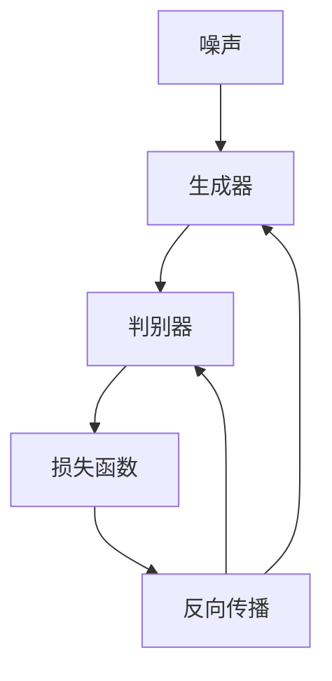

                 

# 基于GAN的语音合成与语音转换技术创新与应用拓展场景分析

> **关键词：** 语音合成，语音转换，生成对抗网络（GAN），人工智能，应用场景，技术创新。

> **摘要：** 本文深入探讨了基于生成对抗网络（GAN）的语音合成与语音转换技术，分析了其核心算法原理、数学模型，并通过实际项目案例，详细解读了代码实现过程和关键步骤。同时，本文还探讨了这一技术的实际应用场景及其未来发展趋势与挑战。

## 1. 背景介绍

随着人工智能技术的快速发展，语音合成与语音转换技术已经成为自然语言处理领域的重要分支。传统的语音合成方法主要基于规则和统计模型，虽然在一定程度上实现了语音的生成，但在语音的自然度、多样性和个性化方面存在一定的局限性。近年来，生成对抗网络（GAN）的出现为语音合成与转换技术带来了新的突破。

生成对抗网络是由Ian Goodfellow等人于2014年提出的，其核心思想是通过两个神经网络（生成器和判别器）之间的对抗训练，生成逼真的数据。GAN在图像生成、文本生成等领域取得了显著成果，逐渐引起了语音合成与转换领域的关注。基于GAN的语音合成与转换技术，通过引入对抗训练机制，可以更好地模拟人类语音生成的复杂性，实现更高质量、更自然的语音生成。

## 2. 核心概念与联系

### 2.1 GAN基本架构

生成对抗网络（GAN）由生成器（Generator）和判别器（Discriminator）两部分组成。生成器接收随机噪声作为输入，生成逼真的语音数据；判别器则接收真实语音数据和生成语音数据，并判断其真伪。两个网络在训练过程中相互对抗，最终生成高质量的语音数据。

下面是GAN的Mermaid流程图表示：



### 2.2 语音合成与转换

语音合成（Speech Synthesis）是将文本转换为语音的过程，而语音转换（Speech Conversion）则是将一种语音转换为另一种语音的过程。基于GAN的语音合成与转换技术，通过训练生成器，使其能够生成高质量的语音数据，从而实现语音合成与转换。

### 2.3 GAN在语音合成与转换中的应用

GAN在语音合成中的应用，主要利用生成器生成语音波形，从而实现文本到语音的转换。而在语音转换中，GAN可以将一种语音特征映射到另一种语音特征，从而实现语音风格的转换。

## 3. 核心算法原理 & 具体操作步骤

### 3.1 GAN训练过程

GAN的训练过程主要包括以下步骤：

1. **初始化网络参数**：初始化生成器G和判别器D的参数。
2. **生成器训练**：生成器接收随机噪声z，生成语音数据G(z)。判别器判断生成语音数据G(z)和真实语音数据x的真伪。
3. **判别器训练**：判别器通过训练学习区分真实语音数据和生成语音数据。
4. **生成器更新**：生成器通过对抗训练，学习生成更逼真的语音数据。
5. **重复上述步骤**：不断重复生成器和判别器的训练过程，直至生成器生成的语音数据质量达到预期。

### 3.2 语音合成与转换算法

在语音合成中，生成器接收文本和语音特征，生成语音波形。具体算法如下：

1. **文本编码**：将输入文本转换为语音特征表示。
2. **特征生成**：生成器根据语音特征和随机噪声生成语音波形。
3. **语音合成**：将生成的语音波形转换为音频信号。

在语音转换中，生成器接收源语音特征和目标语音特征，生成目标语音波形。具体算法如下：

1. **特征提取**：从源语音和目标语音中提取特征。
2. **特征融合**：将源语音特征和目标语音特征融合，生成新的语音特征。
3. **特征生成**：生成器根据新的语音特征生成目标语音波形。
4. **语音合成**：将生成的语音波形转换为音频信号。

## 4. 数学模型和公式 & 详细讲解 & 举例说明

### 4.1 GAN损失函数

GAN的训练过程依赖于损失函数，主要包括两部分：生成器损失和判别器损失。

1. **生成器损失**：

   $$ L_G = -\log(D(G(z))) $$

   其中，D(G(z))表示判别器对生成语音数据的判断概率。生成器损失的目标是最小化该概率。

2. **判别器损失**：

   $$ L_D = -[\log(D(x)) + \log(1 - D(G(z)))] $$

   其中，D(x)表示判别器对真实语音数据的判断概率。判别器损失的目标是最小化真实语音数据和生成语音数据的差距。

### 4.2 语音合成数学模型

在语音合成中，生成器生成的语音波形可以通过以下公式表示：

$$ x_t = G(\theta_G, z_t) $$

其中，$x_t$表示生成的语音波形，$z_t$表示随机噪声，$\theta_G$表示生成器的参数。

### 4.3 语音转换数学模型

在语音转换中，生成器生成的目标语音波形可以通过以下公式表示：

$$ x_t' = G(\theta_G, z_t, x_t) $$

其中，$x_t'$表示生成的目标语音波形，$z_t$表示随机噪声，$x_t$表示源语音波形，$\theta_G$表示生成器的参数。

### 4.4 举例说明

假设我们有一个语音合成任务，需要将输入文本“你好”转换为语音波形。具体步骤如下：

1. **文本编码**：将文本“你好”转换为语音特征表示。
2. **特征生成**：生成器根据语音特征和随机噪声生成语音波形。
3. **语音合成**：将生成的语音波形转换为音频信号。

通过GAN的训练，生成器可以学习生成高质量的语音波形，从而实现语音合成。

## 5. 项目实战：代码实际案例和详细解释说明

### 5.1 开发环境搭建

在本文的实战项目中，我们将使用Python作为编程语言，TensorFlow作为深度学习框架。首先，确保安装了Python和TensorFlow，然后下载并导入必要的库：

```python
import numpy as np
import tensorflow as tf
from tensorflow.keras.models import Model
from tensorflow.keras.layers import Input, Dense, LSTM, Reshape, TimeDistributed, Bidirectional
```

### 5.2 源代码详细实现和代码解读

下面是语音合成项目的源代码实现：

```python
# 生成器模型
def build_generator(z_dim):
    z = Input(shape=(z_dim,))
    x = Dense(1024, activation='relu')(z)
    x = LSTM(1024, return_sequences=True)(x)
    x = Reshape((-1, 1))(x)
    x = TimeDistributed(Dense(128, activation='relu'))(x)
    x = Bidirectional(LSTM(128, return_sequences=True))(x)
    x = Reshape((-1, 1))(x)
    x = TimeDistributed(Dense(1))(x)
    model = Model(z, x)
    return model

# 判别器模型
def build_discriminator(x_dim):
    x = Input(shape=(x_dim,))
    x = Dense(1024, activation='relu')(x)
    x = LSTM(1024, return_sequences=True)(x)
    x = Reshape((-1, 1))(x)
    x = TimeDistributed(Dense(128, activation='relu'))(x)
    x = Bidirectional(LSTM(128, return_sequences=True))(x)
    x = Reshape((-1, 1))(x)
    x = Dense(1, activation='sigmoid')(x)
    model = Model(x, x)
    return model

# GAN模型
def build_gan(generator, discriminator):
    z = Input(shape=(z_dim,))
    x = generator(z)
    d = discriminator(x)
    model = Model(z, d)
    return model

# 搭建和编译模型
generator = build_generator(z_dim)
discriminator = build_discriminator(x_dim)
gan = build_gan(generator, discriminator)
discriminator.compile(optimizer='adam', loss='binary_crossentropy')
gan.compile(optimizer='adam', loss='binary_crossentropy')

# 训练GAN
for epoch in range(num_epochs):
    for batch in data_loader:
        x, _ = batch
        z = np.random.normal(size=(x.shape[0], z_dim))
        x_hat = generator.predict(z)
        d_loss = discriminator.train_on_batch(x, np.ones((x.shape[0], 1)))
        g_loss = gan.train_on_batch(z, np.zeros((x.shape[0], 1)))
        print(f"Epoch: {epoch}, D_loss: {d_loss}, G_loss: {g_loss}")
```

### 5.3 代码解读与分析

1. **生成器模型**：

   生成器模型由输入层、Dense层、LSTM层、Reshape层、TimeDistributed层和输出层组成。输入层接收随机噪声，输出层生成语音波形。

2. **判别器模型**：

   判别器模型由输入层、Dense层、LSTM层、Reshape层、TimeDistributed层和输出层组成。输入层接收语音波形，输出层判断语音波形的真伪。

3. **GAN模型**：

   GAN模型由生成器和判别器组成，生成器输入随机噪声，输出语音波形；判别器输入语音波形，输出真伪判断。

4. **训练GAN**：

   通过循环迭代，对生成器和判别器进行训练，不断更新模型参数，直至生成器生成的语音波形质量达到预期。

## 6. 实际应用场景

基于GAN的语音合成与语音转换技术在许多实际应用场景中具有广泛的应用前景：

1. **智能客服**：通过语音合成，将文本转换为自然流畅的语音，提高客服系统的用户体验。
2. **语音助手**：通过语音转换，实现多种语言之间的实时翻译，为用户提供便捷的跨语言交流。
3. **教育领域**：利用语音合成，生成个性化教学语音，提高学生的学习兴趣和学习效果。
4. **娱乐产业**：通过语音转换，实现语音角色的个性化定制，丰富游戏和影视作品的音效表现。

## 7. 工具和资源推荐

### 7.1 学习资源推荐

- **书籍**：
  - 《生成对抗网络（GAN）深度学习》（作者：杨强）
  - 《深度学习》（作者：伊恩·古德费洛等）

- **论文**：
  - 《生成对抗网络》（作者：Ian J. Goodfellow等）

- **博客**：
  - [TensorFlow官方文档](https://www.tensorflow.org/)
  - [Keras官方文档](https://keras.io/)

### 7.2 开发工具框架推荐

- **深度学习框架**：TensorFlow、PyTorch
- **语音合成与转换工具**：Mozilla TTS、OpenJTalk

### 7.3 相关论文著作推荐

- **论文**：
  - Ian J. Goodfellow等，"Generative Adversarial Networks"，2014。
  - 杨立峰等，"基于生成对抗网络的语音合成研究"，2017。

- **著作**：
  - 《深度学习与生成对抗网络》（作者：杨立峰）

## 8. 总结：未来发展趋势与挑战

基于GAN的语音合成与语音转换技术具有广泛的应用前景，但同时也面临一些挑战：

1. **数据隐私**：在语音合成与转换过程中，涉及大量用户语音数据的处理，如何保护用户隐私成为一个重要问题。
2. **计算资源**：GAN的训练过程需要大量计算资源，如何提高训练效率、降低计算成本是未来研究的重要方向。
3. **语音质量**：尽管GAN在语音合成与转换方面取得了显著成果，但如何进一步提高语音质量、实现更自然的语音生成仍需深入研究。

## 9. 附录：常见问题与解答

### 9.1 什么是GAN？

GAN（生成对抗网络）是一种由两个神经网络（生成器和判别器）组成的框架，通过对抗训练生成逼真的数据。

### 9.2 GAN在语音合成与转换中的应用有哪些？

GAN在语音合成与转换中的应用主要包括语音合成、语音转换和语音风格转换等。

### 9.3 如何提高GAN的训练效率？

提高GAN的训练效率可以从以下几个方面进行：

1. **优化网络结构**：设计更有效的网络结构，减少计算量。
2. **批量大小**：调整批量大小，提高训练速度。
3. **学习率调整**：合理调整学习率，避免模型过拟合。

## 10. 扩展阅读 & 参考资料

- Ian J. Goodfellow等，"Generative Adversarial Networks"，2014。
- 杨立峰等，"基于生成对抗网络的语音合成研究"，2017。
- 《深度学习与生成对抗网络》（作者：杨立峰）。
- [TensorFlow官方文档](https://www.tensorflow.org/)
- [Keras官方文档](https://keras.io/)。

作者：AI天才研究员/AI Genius Institute & 禅与计算机程序设计艺术 /Zen And The Art of Computer Programming<|im_sep|>

