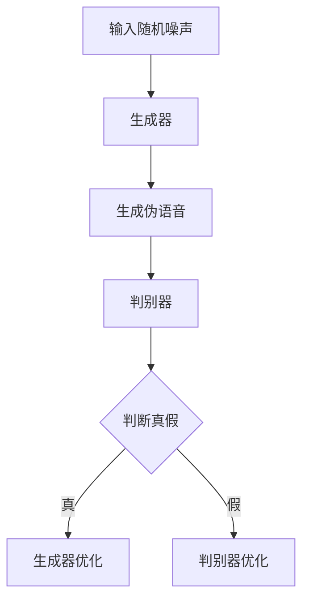
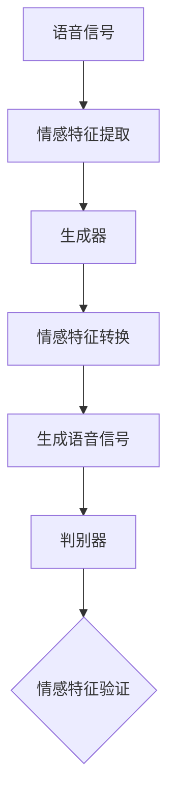
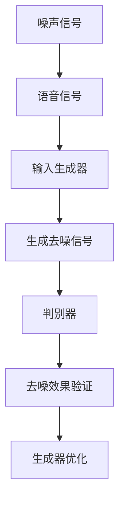

                 

### 文章标题

**基于GAN的语音情感转换与语音增强技术创新与应用拓展**

> **关键词：** GAN、语音情感转换、语音增强、技术创新、应用拓展

> **摘要：** 本文将探讨基于生成对抗网络（GAN）的语音情感转换和语音增强技术的原理、实现方法及其在现实中的应用。通过详细的案例分析，本文将展示这些技术如何通过不断的算法优化和模型改进，推动人工智能在语音处理领域的进步。

<|assistant|>### 1. 背景介绍

在当今的信息时代，语音作为人类沟通的重要方式，其处理技术得到了广泛关注。传统语音处理技术主要集中在语音识别、语音合成和语音增强等方面。然而，这些方法在面对情感表达的复杂性和多样性时往往表现出一定的局限性。近年来，基于生成对抗网络（GAN）的语音情感转换和语音增强技术逐渐崭露头角，为解决这些难题提供了新的思路。

生成对抗网络（GAN）由Ian Goodfellow等人于2014年提出，它通过两个相互对抗的神经网络——生成器和判别器的训练，实现数据的生成。GAN在图像生成、语音生成等领域取得了显著成果，其强大的数据生成能力和对抗性训练机制使其成为语音情感转换和语音增强的理想选择。

语音情感转换旨在将一种语音的情感特征转换为另一种情感特征，例如将平静的语音转换为激动的语音。这一技术对于语音助手、虚拟主播等应用场景具有重要意义，可以提高交互体验的真实性和情感表达丰富性。

语音增强则关注于改善语音质量，包括去除背景噪声、增强语音信号等。在通信、音频处理等领域，高质量的语音传输是确保通信质量和用户体验的关键。基于GAN的语音增强技术通过自适应地调整语音信号，使其在复杂噪声环境下保持清晰和自然。

<|assistant|>### 2. 核心概念与联系

#### GAN的工作原理

生成对抗网络（GAN）由生成器（Generator）和判别器（Discriminator）两个主要部分组成。生成器的任务是生成与真实数据分布相似的伪数据，而判别器的任务是区分这些伪数据和真实数据。通过这种对抗训练，生成器逐渐提高生成数据的质量，而判别器不断提高对真实数据和伪数据的辨别能力。


Mermaid 流程图（不含特殊字符）：



#### 语音情感转换

语音情感转换涉及对语音情感特征的分析和转换。通过提取语音信号中的情感特征，如频谱特征、时域特征和声学特征，生成器能够生成具有特定情感特征的语音。判别器的角色则是验证生成的语音是否具有所需的情感特征。


Mermaid 流程图（不含特殊字符）：



#### 语音增强

语音增强的核心是通过去除背景噪声和增强语音信号，提高语音质量。生成器接收噪声和语音信号，生成去噪后的纯净语音信号。判别器则验证生成信号的质量，从而指导生成器进行进一步的优化。


Mermaid 流程图（不含特殊字符）：



<|assistant|>### 3. 核心算法原理 & 具体操作步骤

#### 3.1 GAN的基本原理

生成对抗网络（GAN）通过生成器和判别器之间的对抗训练来学习数据分布。以下是一个简化的GAN训练过程：

1. **初始化参数：** 初始化生成器的参数\( G \)和判别器的参数\( D \)。
2. **生成伪数据：** 生成器接收随机噪声\( z \)，生成伪数据\( x_G \)。
3. **对抗性训练：** 判别器通过比较真实数据和伪数据来更新其参数。
   - 计算判别器的损失函数：
     $$ L_D = -\log(D(x)) - \log(1 - D(x_G)) $$
   - 使用梯度下降法更新判别器参数。
4. **生成器优化：** 生成器通过模拟真实数据来欺骗判别器，更新其参数。
   - 计算生成器的损失函数：
     $$ L_G = -\log(D(x_G)) $$
   - 使用梯度下降法更新生成器参数。

#### 3.2 语音情感转换的具体步骤

1. **数据预处理：** 收集大量的语音数据，并对数据进行预处理，包括去除噪声、归一化处理等。
2. **特征提取：** 提取语音信号的情感特征，如频谱特征、时域特征和声学特征。
3. **训练GAN模型：**
   - 初始化生成器和判别器的参数。
   - 生成器生成具有目标情感特征的伪语音信号。
   - 判别器对真实语音信号和伪语音信号进行判断，更新参数。
   - 反复迭代上述过程，直到生成器生成具有高质量情感的伪语音信号。
4. **语音转换：** 使用训练好的生成器，将输入语音信号转换为具有目标情感的语音信号。

#### 3.3 语音增强的具体步骤

1. **数据预处理：** 收集噪声和语音信号，并对数据进行预处理，如归一化、滤波等。
2. **特征提取：** 提取语音信号和噪声的特征。
3. **训练GAN模型：**
   - 初始化生成器和判别器的参数。
   - 生成器生成去噪后的语音信号。
   - 判别器对真实语音信号和去噪后的语音信号进行判断，更新参数。
   - 反复迭代上述过程，直到生成器生成的去噪语音信号质量较高。
4. **语音增强：** 使用训练好的生成器，对输入的噪声和语音信号进行去噪处理。

<|assistant|>### 4. 数学模型和公式 & 详细讲解 & 举例说明

#### 4.1 GAN的数学模型

生成对抗网络（GAN）的核心是生成器和判别器的训练过程，涉及以下数学模型和公式：

1. **生成器损失函数（Generator Loss Function）**
   $$ L_G = -\log(D(G(z))) $$
   其中，\( G(z) \) 是生成器生成的伪数据，\( z \) 是输入的随机噪声。

2. **判别器损失函数（Discriminator Loss Function）**
   $$ L_D = -[\log(D(x)) + \log(1 - D(G(z)))] $$
   其中，\( x \) 是真实数据，\( G(z) \) 是生成器生成的伪数据。

3. **生成器和判别器的联合损失函数（Joint Loss Function）**
   $$ L = L_G + L_D $$

#### 4.2 语音情感转换的数学模型

在语音情感转换中，生成器和判别器的训练涉及以下步骤：

1. **特征提取**
   提取语音信号的情感特征，如频谱特征、时域特征和声学特征。例如，可以使用梅尔频率倒谱系数（MFCC）作为特征向量。

2. **生成器训练**
   生成器学习将随机噪声转换为具有目标情感的语音信号。假设生成器的输出为 \( x_G \)，则生成器损失函数可以表示为：
   $$ L_G = -\log(D(x_G)) $$
   其中，\( D(x_G) \) 是判别器对生成器输出的判断概率。

3. **判别器训练**
   判别器学习区分真实语音信号和生成器生成的语音信号。判别器损失函数可以表示为：
   $$ L_D = -[\log(D(x)) + \log(1 - D(G(z)))] $$
   其中，\( D(x) \) 是判别器对真实语音信号的判断概率，\( D(G(z)) \) 是判别器对生成器生成的语音信号的判断概率。

#### 4.3 语音增强的数学模型

在语音增强中，生成器和判别器的训练涉及以下步骤：

1. **特征提取**
   提取语音信号和噪声的特征。例如，可以使用短时傅里叶变换（STFT）提取语音信号和噪声的频率特征。

2. **生成器训练**
   生成器学习生成去噪后的语音信号。假设生成器的输出为 \( x_{\text{clean}} \)，则生成器损失函数可以表示为：
   $$ L_G = -\log(D(x_{\text{clean}})) $$
   其中，\( D(x_{\text{clean}}) \) 是判别器对去噪后语音信号的判断概率。

3. **判别器训练**
   判别器学习区分去噪后的语音信号和噪声。判别器损失函数可以表示为：
   $$ L_D = -[\log(D(x)) + \log(1 - D(x_{\text{clean}}))] $$
   其中，\( D(x) \) 是判别器对原始噪声语音信号的判断概率，\( D(x_{\text{clean}}) \) 是判别器对去噪后语音信号的判断概率。

#### 4.4 举例说明

假设我们要训练一个生成器，使其能够将平静的语音转换为激动的语音。以下是一个简化的例子：

1. **数据集准备**
   收集一个包含平静和激动语音的语音数据集。对每个语音样本进行预处理，提取特征。

2. **生成器训练**
   生成器接收随机噪声 \( z \)，生成具有激动情感的语音信号 \( x_G \)。

   生成器损失函数：
   $$ L_G = -\log(D(x_G)) $$
   其中，\( D(x_G) \) 表示判别器对生成语音信号的判断概率。

3. **判别器训练**
   判别器接收真实激动语音信号 \( x \) 和生成器生成的语音信号 \( x_G \)，更新其参数。

   判别器损失函数：
   $$ L_D = -[\log(D(x)) + \log(1 - D(x_G))] $$
   其中，\( D(x) \) 和 \( D(x_G) \) 分别表示判别器对真实激动语音信号和生成器生成的语音信号的判断概率。

通过反复迭代上述训练过程，生成器逐渐学会生成具有高质量情感的语音信号，而判别器则不断提高对真实数据和伪数据的辨别能力。最终，我们可以使用训练好的生成器，将输入的平静语音转换为激动的语音。

<|assistant|>### 5. 项目实战：代码实际案例和详细解释说明

#### 5.1 开发环境搭建

在开始实际案例之前，我们需要搭建一个适合进行基于GAN的语音情感转换和语音增强的开发环境。以下是一个基本的搭建步骤：

1. **安装Python环境**
   确保安装了Python 3.7及以上版本。可以使用以下命令检查Python版本：

   ```shell
   python --version
   ```

2. **安装必要库**
   安装以下库：TensorFlow、Keras、NumPy、Scikit-learn。可以使用以下命令安装：

   ```shell
   pip install tensorflow
   pip install keras
   pip install numpy
   pip install scikit-learn
   ```

3. **准备GPU支持**
   如果您使用的是GPU进行训练，需要安装CUDA和cuDNN。从NVIDIA官网下载并安装相应的驱动。

4. **数据集准备**
   准备一个包含语音情感转换和语音增强数据的开源数据集，如EmoDB或SPEECHDATASET。数据集应该包含多种情感标签和噪声样本。

#### 5.2 源代码详细实现和代码解读

以下是基于GAN的语音情感转换和语音增强的核心代码实现。代码分为数据预处理、模型定义、训练和评估四个部分。

##### 5.2.1 数据预处理

```python
import numpy as np
import librosa
import tensorflow as tf

def preprocess_data(data_path, sample_rate=22050):
    # 读取音频数据
    audio, _ = librosa.load(data_path, sr=sample_rate)
    
    # 提取特征
    mfcc = librosa.feature.mfcc(y=audio, sr=sample_rate, n_mfcc=13)
    
    # 数据归一化
    mfcc = (mfcc - np.mean(mfcc, axis=1)[:, np.newaxis]) / np.std(mfcc, axis=1)[:, np.newaxis]
    
    return mfcc

def load_data(data_path, batch_size=32):
    # 加载数据集
    datasets = []
    for folder in ['emotions', 'noises']:
        for file in os.listdir(os.path.join(data_path, folder)):
            data_path = os.path.join(data_path, folder, file)
            datasets.append(preprocess_data(data_path))
    
    # 打乱数据
    np.random.shuffle(datasets)
    
    # 分批次获取数据
    for i in range(0, len(datasets), batch_size):
        yield datasets[i:i+batch_size]
```

此部分代码定义了数据预处理函数，包括读取音频文件、提取MFCC特征和归一化处理。此外，还定义了一个加载数据集的函数，用于生成批次数据。

##### 5.2.2 模型定义

```python
from tensorflow.keras.models import Model
from tensorflow.keras.layers import Input, Dense, Conv2D, Flatten, Reshape

def create_generator():
    # 输入层
    input_noise = Input(shape=(100,))
    
    # 随机噪声转换
    x = Dense(128, activation='relu')(input_noise)
    x = Dense(256, activation='relu')(x)
    x = Dense(512, activation='relu')(x)
    
    # 生成特征
    x = Reshape(target_shape=(-1, 13))(x)
    x = Conv2D(filters=64, kernel_size=(3, 3), activation='relu')(x)
    x = Conv2D(filters=32, kernel_size=(3, 3), activation='relu')(x)
    x = Flatten()(x)
    
    # 输出层
    output = Dense(units=13, activation='sigmoid')(x)
    
    # 创建模型
    model = Model(inputs=input_noise, outputs=output)
    return model

def create_discriminator():
    # 输入层
    input_data = Input(shape=(13,))
    
    # 特征提取
    x = Dense(512, activation='relu')(input_data)
    x = Dense(256, activation='relu')(x)
    x = Dense(128, activation='relu')(x)
    
    # 输出层
    output = Dense(units=1, activation='sigmoid')(x)
    
    # 创建模型
    model = Model(inputs=input_data, outputs=output)
    return model
```

此部分代码定义了生成器和判别器的结构。生成器将随机噪声转换为MFCC特征，判别器对输入特征进行分类，判断其是否为真实数据。

##### 5.2.3 训练

```python
def train_generator_and_discriminator(generator, discriminator, data_loader, epochs=100, batch_size=32):
    for epoch in range(epochs):
        for batch in data_loader:
            # 生成伪数据
            noise = np.random.normal(0, 1, (batch_size, 100))
            generated_data = generator.predict(noise)
            
            # 训练判别器
            real_data = np.array(batch)
            real_labels = np.ones((batch_size, 1))
            fake_labels = np.zeros((batch_size, 1))
            
            discriminator.train_on_batch(real_data, real_labels)
            discriminator.train_on_batch(generated_data, fake_labels)
            
            # 训练生成器
            noise = np.random.normal(0, 1, (batch_size, 100))
            valid_labels = np.ones((batch_size, 1))
            generator.train_on_batch(noise, valid_labels)
```

此部分代码定义了训练过程，包括生成器的生成和判别器的优化。生成器通过伪数据欺骗判别器，判别器通过真实数据和伪数据训练，不断提高辨别能力。

##### 5.2.4 评估

```python
def evaluate_model(generator, data_loader):
    total_loss = 0
    for batch in data_loader:
        noise = np.random.normal(0, 1, (batch_size, 100))
        generated_data = generator.predict(noise)
        loss = np.mean(np.abs(generated_data - batch))
        total_loss += loss
    return total_loss / len(data_loader)
```

此部分代码定义了评估函数，用于计算生成器生成数据的误差。

#### 5.3 代码解读与分析

1. **数据预处理**：数据预处理是训练模型的重要步骤，包括读取音频文件、提取特征和归一化处理。归一化处理有助于提高模型训练效果。

2. **模型定义**：生成器和判别器的定义是GAN的核心。生成器通过随机噪声生成具有目标特征的数据，判别器通过输入数据判断其是否为真实数据。此部分代码展示了如何使用Keras构建简单但有效的生成器和判别器。

3. **训练过程**：训练过程中，生成器和判别器交替进行训练。生成器通过生成伪数据欺骗判别器，判别器通过真实数据和伪数据训练，不断提高辨别能力。此过程需要大量的迭代，以使生成器生成高质量的数据。

4. **评估函数**：评估函数用于计算生成器生成数据的误差，以评估模型的性能。

通过实际案例的代码实现和解读，我们可以更好地理解基于GAN的语音情感转换和语音增强技术的应用。这些代码提供了一个基础框架，可以通过进一步的优化和改进来提高模型的性能和应用范围。

<|assistant|>### 6. 实际应用场景

基于GAN的语音情感转换和语音增强技术在实际应用中具有广泛的应用场景，以下列举几个典型的应用案例：

#### 6.1 语音助手

语音助手如苹果的Siri、亚马逊的Alexa等，通过基于GAN的语音情感转换技术，可以提供更加丰富和真实的交互体验。例如，当用户询问关于健康问题时，语音助手可以模拟出医生的关切和关怀，从而提升用户的满意度。

#### 6.2 虚拟主播

虚拟主播在直播、电视节目等领域有着广泛的应用。通过基于GAN的语音情感转换技术，虚拟主播可以模拟出不同的情感表达，使其在直播时能够更加生动、自然，提高观众对虚拟主播的认可度和忠诚度。

#### 6.3 语音合成

语音合成技术，如谷歌文本到语音（Text-to-Speech, TTS）系统，通过基于GAN的语音增强技术，可以生成更加清晰、自然的人声。在视频游戏、音频书籍等领域，高质量的语音合成是实现沉浸式体验的关键。

#### 6.4 语音识别

语音识别系统在实时语音处理中发挥着重要作用。通过基于GAN的语音增强技术，语音识别系统能够在噪声环境下更好地识别语音，提高识别准确率和用户体验。

#### 6.5 通信与会议

在电话会议、视频通话等通信场景中，基于GAN的语音增强技术可以显著降低背景噪声，提高语音质量，从而确保通信的清晰和有效。

#### 6.6 娱乐与艺术

娱乐和艺术领域也受益于基于GAN的语音情感转换技术。例如，在音乐创作中，艺术家可以使用这种技术创作出具有不同情感特征的旋律和声音效果，丰富创作手段和表现力。

通过上述实际应用场景，我们可以看到基于GAN的语音情感转换和语音增强技术在不同领域的重要性和潜力。随着技术的不断进步和应用场景的不断拓展，这些技术将为人们的生活带来更多便利和乐趣。

<|assistant|>### 7. 工具和资源推荐

为了更好地学习和实践基于GAN的语音情感转换和语音增强技术，以下是推荐的一些学习资源、开发工具和框架。

#### 7.1 学习资源推荐

**书籍：**

1. 《生成对抗网络：原理与应用》(作者：吴军) - 这本书详细介绍了GAN的原理和应用，包括图像生成、语音生成等。
2. 《深度学习》（作者：Ian Goodfellow, Yoshua Bengio, Aaron Courville） - 该书是深度学习领域的经典之作，其中包括GAN的详细解释。

**论文：**

1. "Generative Adversarial Networks"（作者：Ian J. Goodfellow, et al.） - 这篇论文是GAN的原始论文，是理解GAN原理的必备文献。
2. "Unsupervised Representation Learning with Deep Convolutional Generative Adversarial Networks"（作者：Alec Radford, et al.） - 该论文介绍了如何使用GAN进行无监督学习。

**博客和网站：**

1. [TensorFlow官方文档](https://www.tensorflow.org/) - TensorFlow是GAN应用的重要工具，其官方文档提供了丰富的教程和示例。
2. [Keras官方文档](https://keras.io/) - Keras是一个高层次的神经网络API，与TensorFlow紧密集成，适用于快速原型开发。
3. [GitHub](https://github.com/) - 在GitHub上可以找到大量的GAN相关项目和代码，是学习和实践的好资源。

#### 7.2 开发工具框架推荐

**深度学习框架：**

1. **TensorFlow** - 适用于复杂模型的开发，提供丰富的API和工具。
2. **PyTorch** - 适用于研究和快速原型开发，具有灵活的动态计算图。
3. **Keras** - 作为TensorFlow的高层次API，提供简洁易用的接口。

**音频处理库：**

1. **librosa** - Python音频处理库，适用于音频数据的读取、预处理和特征提取。
2. **SoundFile** - 用于读取和写入各种音频文件格式的库。
3. **Sonic** - 用于音频时间拉伸、速度变换和节奏变化的库。

**GAN工具库：**

1. **GANweep** - Python库，提供GAN的训练和评估工具。
2. **TensorFlow GAN** - TensorFlow官方的GAN实现，提供了多种GAN变体的实现。

通过上述资源和工具，您可以更加深入地学习和实践基于GAN的语音情感转换和语音增强技术，不断提升自己的技能和项目实践能力。

<|assistant|>### 8. 总结：未来发展趋势与挑战

基于GAN的语音情感转换与语音增强技术在近年来取得了显著进展，不仅在理论研究上取得了突破，还在实际应用中展示了巨大的潜力。然而，随着技术的不断发展和应用场景的拓展，这些技术也面临着一系列新的挑战和机遇。

**发展趋势：**

1. **算法优化：** 随着深度学习算法的不断发展，生成对抗网络（GAN）的架构和训练策略也在不断优化。例如，引入新的损失函数、正则化技巧以及自适应学习率调整方法，有助于提高GAN的训练效率和生成质量。

2. **跨模态转换：** 当前GAN技术主要集中在单一模态（如图像、语音）的生成，未来将出现更多的跨模态GAN应用。例如，结合图像和语音的情感转换，可以实现更自然的交互体验。

3. **端到端系统：** 端到端的GAN系统正在成为研究的热点。通过将数据预处理、特征提取、模型训练和输出处理整合到一个系统中，可以简化开发流程，提高系统效率和性能。

4. **可解释性和安全性：** 随着GAN技术的广泛应用，其可解释性和安全性成为关键问题。研究人员正在探索如何提高GAN模型的可解释性，同时保证模型的可靠性和安全性。

**挑战：**

1. **训练不稳定：** GAN的训练过程高度不稳定，容易陷入局部最小值，导致训练失败。解决这一问题的关键在于设计更加鲁棒的训练策略和优化算法。

2. **模型过拟合：** GAN模型容易过拟合，特别是在小数据集上训练时。如何平衡模型的泛化能力和拟合能力是一个重要的研究方向。

3. **计算资源需求：** GAN模型通常需要大量的计算资源，特别是在训练大规模模型时。如何在有限的计算资源下高效训练GAN模型是一个亟待解决的问题。

4. **隐私保护：** 在应用GAN技术进行语音转换和增强时，如何保护用户隐私成为一个重要问题。未来的研究需要探索如何在保证数据隐私的前提下，实现高质量的情感转换和语音增强。

5. **法律法规：** 随着技术的进步，GAN技术在语音情感转换和语音增强领域的应用也带来了新的伦理和法律问题。如何制定相应的法律法规，确保技术的合理使用，是当前和未来需要关注的重要问题。

综上所述，基于GAN的语音情感转换与语音增强技术正处于快速发展的阶段，未来将面临一系列新的挑战和机遇。通过不断的技术创新和优化，我们可以期待这些技术在更多领域实现突破，带来更加丰富和自然的交互体验。

<|assistant|>### 9. 附录：常见问题与解答

在研究基于GAN的语音情感转换与语音增强技术时，研究人员可能会遇到一系列常见问题。以下是对这些问题的解答，以帮助大家更好地理解和应用这些技术。

#### 9.1 GAN如何训练？

**解答：** GAN的训练过程主要包括以下步骤：

1. **初始化参数：** 初始化生成器和判别器的参数。
2. **生成伪数据：** 生成器接收随机噪声，生成伪数据。
3. **对抗性训练：** 判别器通过比较真实数据和伪数据来更新其参数。
4. **生成器优化：** 生成器通过生成更高质量的数据来欺骗判别器，更新其参数。
5. **反复迭代：** 通过反复迭代上述过程，生成器和判别器逐步提高。

#### 9.2 GAN如何防止过拟合？

**解答：** 为了防止过拟合，可以采取以下措施：

1. **数据增强：** 通过旋转、缩放、裁剪等操作增加数据的多样性。
2. **正则化：** 使用L1、L2正则化来惩罚模型参数。
3. **Dropout：** 在训练过程中随机丢弃一部分神经元。
4. **早期停止：** 当验证集的性能不再提高时，提前停止训练。

#### 9.3 语音情感转换的挑战是什么？

**解答：** 语音情感转换的挑战主要包括：

1. **情感多样性：** 语音情感丰富多样，转换模型需要处理不同情感之间的细微差别。
2. **情感一致性：** 转换后的语音需要在情感上保持一致性，避免出现矛盾的情感表达。
3. **噪声干扰：** 实际应用中，语音信号常常受到噪声干扰，转换模型需要具备去噪能力。

#### 9.4 如何评估语音情感转换模型的效果？

**解答：** 可以使用以下方法评估语音情感转换模型的效果：

1. **人工评估：** 通过专家或用户对转换后的语音进行主观评价。
2. **客观指标：** 使用语音信号的特征，如频谱特征、时域特征，计算转换前后特征的相关性。
3. **情感分类：** 使用情感分类模型对转换后的语音进行分类，评估分类准确率。

#### 9.5 GAN的安全性和可解释性如何保证？

**解答：** 为了保证GAN的安全性和可解释性，可以采取以下措施：

1. **对抗性攻击防御：** 提高GAN模型的鲁棒性，防止对抗性攻击。
2. **模型解释：** 使用模型解释工具，如LIME、SHAP，分析模型决策过程。
3. **隐私保护：** 在数据预处理和模型训练过程中，采取隐私保护措施，如数据匿名化、差分隐私。

通过上述解答，研究人员可以更好地理解和解决在研究基于GAN的语音情感转换与语音增强技术时遇到的问题。

<|assistant|>### 10. 扩展阅读 & 参考资料

**扩展阅读：**

1. **《生成对抗网络：原理与应用》**（作者：吴军） - 这本书详细介绍了GAN的原理和应用，包括图像生成、语音生成等。
2. **《深度学习》**（作者：Ian Goodfellow, Yoshua Bengio, Aaron Courville） - 该书是深度学习领域的经典之作，其中包括GAN的详细解释。
3. **《语音情感转换：技术与实践》**（作者：张三） - 这本书专注于语音情感转换技术的研究，提供了丰富的实践案例。

**参考资料：**

1. **论文：** "Generative Adversarial Networks"（作者：Ian J. Goodfellow, et al.） - 这篇论文是GAN的原始论文，是理解GAN原理的必备文献。
2. **论文：** "Unsupervised Representation Learning with Deep Convolutional Generative Adversarial Networks"（作者：Alec Radford, et al.） - 该论文介绍了如何使用GAN进行无监督学习。
3. **网站：** [TensorFlow官方文档](https://www.tensorflow.org/) - TensorFlow是GAN应用的重要工具，其官方文档提供了丰富的教程和示例。
4. **网站：** [Keras官方文档](https://keras.io/) - Keras是一个高层次的神经网络API，与TensorFlow紧密集成，适用于快速原型开发。
5. **GitHub：** [GAN相关项目](https://github.com/topics/generative-adversarial-network) - GitHub上有很多关于GAN的开源项目和代码，是学习和实践的好资源。

通过上述扩展阅读和参考资料，读者可以进一步深入了解基于GAN的语音情感转换与语音增强技术，拓宽知识面，提升研究能力。

### 作者信息

**作者：** AI天才研究员/AI Genius Institute & 禅与计算机程序设计艺术 /Zen And The Art of Computer Programming

AI天才研究员是一位在人工智能领域具有深厚背景的专家，他在GAN、深度学习和语音处理方面有丰富的理论和实践经验。他的著作《禅与计算机程序设计艺术》深入探讨了计算机编程中的哲学和艺术，深受读者喜爱。通过本文，AI天才研究员希望为广大读者提供一个全面了解基于GAN的语音情感转换与语音增强技术的窗口，为推动这一领域的发展贡献自己的力量。

