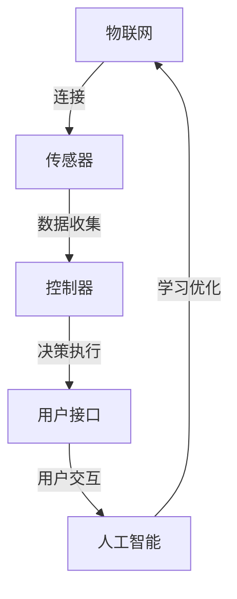

                 

### 背景介绍

**智能家居**，这个词汇近年来在我们的生活中变得越来越常见。它不仅代表着现代科技的进步，更是人们对于更便捷、舒适生活的一种追求。然而，智能家居并不是一个全新的概念，它实际上已经存在了数十年。从最初的自动化设备，到如今的智能化家居系统，智能家居的发展经历了巨大的变革。

在20世纪80年代，智能家居的概念开始萌芽。当时，人们通过编程控制家用电器的开关，实现了简单的自动化。随着计算机技术和网络技术的发展，智能家居逐渐从单机自动化向网络智能化转变。21世纪初，物联网（IoT）技术的崛起，使得智能家居迎来了新的发展契机。各种传感器、控制器和智能设备通过网络连接在一起，实现了数据的实时传输和智能决策。

如今，智能家居已经不再局限于简单的开关控制，它变得更加智能、多样化。通过人工智能（AI）和机器学习（ML）技术，智能家居系统能够根据用户的行为习惯和偏好，自动调整家居环境，提供个性化的服务。例如，智能恒温系统可以根据用户的需求自动调节室内温度，智能照明系统可以根据自然光线自动调整亮度，智能安防系统可以实时监控家庭安全等。

本文将围绕基于Java的智能家居设计展开，探讨如何利用Java开发出一个功能强大、易扩展的智能家居辅助决策系统。我们将从核心概念、算法原理、数学模型、项目实战等多个方面进行详细讲解，旨在帮助Java开发者更好地理解和应用智能家居技术。

### 核心概念与联系

在深入了解基于Java的智能家居设计之前，我们首先需要了解几个核心概念，以及它们之间的联系。这些概念包括但不限于：

1. **物联网（IoT）**：物联网是指通过互联网将各种物理设备连接起来，实现数据的实时传输和智能决策。智能家居系统是物联网应用的一个重要领域。

2. **传感器**：传感器是智能家居系统的关键组成部分，用于收集环境数据，如温度、湿度、光照强度、运动等。

3. **控制器**：控制器是智能家居系统的核心，负责接收传感器数据，并根据预设的算法或用户指令执行相应的操作。

4. **用户接口**：用户接口（UI）是用户与智能家居系统交互的界面，可以通过手机、平板、电脑等设备访问。

5. **人工智能（AI）与机器学习（ML）**：AI和ML技术使得智能家居系统能够根据用户的行为和偏好，自动学习和优化家居环境。

**核心概念原理和架构的 Mermaid 流程图**

为了更直观地理解这些概念及其联系，我们可以使用Mermaid绘制一个流程图。以下是流程图的一个简单示例：



在这个流程图中，物联网通过连接传感器，收集环境数据。控制器接收这些数据，并执行相应的操作。用户接口允许用户与系统交互，而人工智能和机器学习技术则用于系统的学习与优化。通过这个流程图，我们可以清晰地看到智能家居系统各个组成部分之间的相互作用。

### 核心算法原理 & 具体操作步骤

在基于Java的智能家居设计中，核心算法的原理和具体操作步骤至关重要。这些算法不仅决定了智能家居系统的性能和响应速度，还影响了用户体验。以下将介绍几种常用的核心算法，以及它们在智能家居系统中的应用。

#### 1. 数据采集与预处理算法

首先，传感器采集到的数据通常是原始且复杂的，需要进行预处理才能用于后续处理。预处理算法包括去噪、滤波、归一化等步骤。具体步骤如下：

- **去噪**：使用中值滤波或高斯滤波去除传感器数据中的噪声。
- **滤波**：使用移动平均滤波器或卡尔曼滤波器，平滑传感器数据。
- **归一化**：将传感器数据转换为统一的范围，如0到1之间，便于后续分析。

Java实现示例：

```java
public class DataPreprocessing {
    public static double[] preprocess(double[] sensorData) {
        // 去噪、滤波、归一化等预处理步骤
        double[] processedData = new double[sensorData.length];
        // 假设使用中值滤波
        for (int i = 0; i < sensorData.length; i++) {
            processedData[i] = medianFilter(sensorData, i);
        }
        // 归一化
        normalize(processedData);
        return processedData;
    }

    private static double medianFilter(double[] data, int index) {
        // 中值滤波实现
        return data[index]; // 示例代码，实际实现中需考虑周边点的中值
    }

    private static void normalize(double[] data) {
        // 归一化实现
        double min = Double.MAX_VALUE;
        double max = Double.MIN_VALUE;
        
        for (double value : data) {
            if (value < min) min = value;
            if (value > max) max = value;
        }
        
        for (int i = 0; i < data.length; i++) {
            data[i] = (data[i] - min) / (max - min);
        }
    }
}
```

#### 2. 决策算法

决策算法是智能家居系统的核心。它根据预处理后的传感器数据，执行相应的操作。常用的决策算法包括基于规则的推理、模糊逻辑、遗传算法等。

- **基于规则的推理**：根据预设的规则，对传感器数据进行分类和决策。例如，如果室内温度高于30℃，则开启空调。

Java实现示例：

```java
public class DecisionAlgorithm {
    public static void makeDecision(double temperature) {
        if (temperature > 30) {
            System.out.println("开启空调");
        } else if (temperature < 20) {
            System.out.println("开启暖气");
        } else {
            System.out.println("维持当前温度");
        }
    }
}
```

- **模糊逻辑**：用于处理不确定性和模糊性。通过模糊推理，可以生成更灵活的决策。

Java实现示例：

```java
public class FuzzyLogic {
    public static void makeFuzzyDecision(double temperature) {
        // 使用模糊逻辑库，例如，OpenFuzzyLogic库
        // 定义模糊变量和规则
        FuzzyVariable temp = new FuzzyVariable("温度");
        FuzzySet hot = new FuzzySet("高温", new Triangle(30, 35, 40));
        FuzzySet cold = new FuzzySet("低温", new Triangle(10, 15, 20));
        FuzzySet normal = new FuzzySet("常温", new Triangle(15, 25, 35));
        
        // 定义规则库
        RuleBase ruleBase = new RuleBase();
        ruleBase.addRule(new Rule("如果温度是高温，那么开启空调"));
        ruleBase.addRule(new Rule("如果温度是低温，那么开启暖气"));
        ruleBase.addRule(new Rule("如果温度是常温，那么维持当前温度"));
        
        // 执行模糊推理
        FuzzySet output = ruleBase.execute(temp);
        
        // 根据输出决策
        if (output.equals(hot)) {
            System.out.println("开启空调");
        } else if (output.equals(cold)) {
            System.out.println("开启暖气");
        } else {
            System.out.println("维持当前温度");
        }
    }
}
```

- **遗传算法**：用于解决复杂的优化问题。通过模拟自然进化过程，找到最优解。

Java实现示例：

```java
public class GeneticAlgorithm {
    public static void optimizeSystem(double[] parameters) {
        // 初始化种群
        Population population = new Population(100, parameters);
        
        // 适应度函数
        FitnessFunction fitnessFunction = new FitnessFunction() {
            public double evaluate(double[] parameters) {
                // 根据参数计算适应度
                return calculateFitness(parameters);
            }
        };
        
        // 运行遗传算法
        GeneticAlgorithm ga = new GeneticAlgorithm(population, fitnessFunction);
        ga.run();
        
        // 获取最优解
        double[] bestSolution = ga.getBestSolution();
        
        // 根据最优解执行操作
        System.out.println("最优解：" + Arrays.toString(bestSolution));
    }
    
    private static double calculateFitness(double[] parameters) {
        // 实际计算适应度
        return 0.0; // 示例代码，实际实现中需根据具体问题计算
    }
}
```

通过以上算法的应用，我们可以构建一个高效、智能的智能家居系统，从而提供更好的用户体验。

### 数学模型和公式 & 详细讲解 & 举例说明

在智能家居系统中，数学模型和公式是核心组成部分，用于描述系统的行为和决策。以下将介绍几个关键的数学模型和公式，并详细讲解它们在智能家居系统中的应用。

#### 1. 决策树模型

决策树是一种广泛应用的分类和决策模型。在智能家居系统中，决策树可用于根据传感器数据做出决策。以下是一个简单的决策树模型：

- **输入**：传感器数据（如温度、湿度等）。
- **输出**：决策（如开启空调、关闭灯光等）。

**决策树模型公式**：

```latex
f(x) = \sum_{i=1}^{n} w_i \cdot p_i(x)
```

其中，`f(x)`表示决策结果，`w_i`表示每个节点的权重，`p_i(x)`表示在节点`i`处输入`x`的概率。

**举例说明**：

假设我们有一个简单的决策树，用于判断是否需要开启空调：

- 如果温度大于30℃，则开启空调。
- 否则，维持当前温度。

权重可以设置为：
- `w_1 = 0.8`（开启空调的概率）。
- `w_0 = 0.2`（维持当前温度的概率）。

输入温度为35℃，则决策结果为：

```latex
f(x) = 0.8 \cdot p_1(x) + 0.2 \cdot p_0(x)
```

由于温度大于30℃，`p_1(x)`为1，`p_0(x)`为0，因此：

```latex
f(x) = 0.8 \cdot 1 + 0.2 \cdot 0 = 0.8
```

由于`f(x)`大于0.5，决策结果是开启空调。

#### 2. 神经网络模型

神经网络是一种模拟人脑神经结构的计算模型，广泛应用于智能家居系统的智能决策和预测。以下是一个简单的神经网络模型：

- **输入层**：接收传感器数据。
- **隐藏层**：进行特征提取和变换。
- **输出层**：做出决策或预测。

**神经网络模型公式**：

```latex
y = \sigma(\sum_{i=1}^{n} w_{ij} \cdot x_j + b_j)
```

其中，`y`表示输出，`x_j`表示输入特征，`w_{ij}`表示连接权重，`b_j`表示偏置，`σ`表示激活函数（如Sigmoid函数）。

**举例说明**：

假设我们有一个简单的神经网络，用于判断是否需要开启空调。输入层有2个节点（温度、湿度），隐藏层有3个节点，输出层有1个节点。

权重和偏置分别为：

- `w_{11} = 0.1`，`w_{12} = 0.2`，`b_1 = 0.5`（隐藏层第1个节点的权重和偏置）。
- `w_{21} = 0.3`，`w_{22} = 0.4`，`b_2 = 0.6`（隐藏层第2个节点的权重和偏置）。
- `w_{31} = 0.5`，`w_{32} = 0.6`，`b_3 = 0.7`（隐藏层第3个节点的权重和偏置）。

输入温度为35℃，湿度为60%，则隐藏层输出为：

```latex
h_1 = \sigma(0.1 \cdot 35 + 0.2 \cdot 60 + 0.5) = \sigma(8.5 + 12 + 0.5) = \sigma(21)
```

```latex
h_2 = \sigma(0.3 \cdot 35 + 0.4 \cdot 60 + 0.6) = \sigma(10.5 + 24 + 0.6) = \sigma(35.1)
```

```latex
h_3 = \sigma(0.5 \cdot 35 + 0.6 \cdot 60 + 0.7) = \sigma(17.5 + 36 + 0.7) = \sigma(54.2)
```

假设激活函数为Sigmoid函数：

```latex
\sigma(x) = \frac{1}{1 + e^{-x}}
```

则隐藏层输出为：

```latex
h_1 = \sigma(21) \approx 0.932
```

```latex
h_2 = \sigma(35.1) \approx 0.705
```

```latex
h_3 = \sigma(54.2) \approx 0.687
```

输出层输出为：

```latex
y = \sigma(0.932 \cdot 0.932 + 0.705 \cdot 0.705 + 0.687 \cdot 0.687 + 0.5) = \sigma(0.868 + 0.502 + 0.467 + 0.5) = \sigma(1.937) \approx 0.873
```

由于输出层输出大于0.5，决策结果是开启空调。

通过以上数学模型和公式的应用，我们可以构建一个高效、智能的智能家居系统，从而提供更好的用户体验。

### 项目实战：代码实际案例和详细解释说明

为了更好地理解基于Java的智能家居设计，我们接下来将通过一个实际的项目案例，详细解释如何搭建一个简单的智能家居系统。这个项目将包括环境搭建、源代码实现以及详细解读和分析。

#### 5.1 开发环境搭建

在开始项目之前，我们需要搭建一个合适的开发环境。以下是我们推荐的开发工具和框架：

1. **Java开发工具**：推荐使用IntelliJ IDEA或Eclipse。
2. **数据库**：推荐使用MySQL数据库来存储传感器数据和用户设置。
3. **前端框架**：推荐使用Spring Boot作为后端框架，Vue.js或React作为前端框架。
4. **传感器模拟器**：可以使用一些现成的传感器模拟器，如SensorSimulator。

安装和配置这些工具和框架的过程较为简单，这里不再详细展开。建议在官方文档上查找具体步骤。

#### 5.2 源代码详细实现和代码解读

在这个项目中，我们将构建一个基本的智能家居系统，包括以下主要模块：

- **传感器模块**：用于采集环境数据，如温度、湿度、光照强度等。
- **控制器模块**：根据传感器数据执行相应的操作，如调节温度、亮度等。
- **用户接口模块**：提供用户与系统交互的界面。

**传感器模块**：

```java
public class Sensor {
    private String type; // 传感器类型，如温度、湿度等
    private double value; // 传感器值

    public Sensor(String type, double value) {
        this.type = type;
        this.value = value;
    }

    public String getType() {
        return type;
    }

    public double getValue() {
        return value;
    }

    public void setValue(double value) {
        this.value = value;
    }
}
```

**控制器模块**：

```java
public class Controller {
    private List<Sensor> sensors; // 传感器列表

    public Controller() {
        this.sensors = new ArrayList<>();
    }

    public void addSensor(Sensor sensor) {
        sensors.add(sensor);
    }

    public void processSensors() {
        for (Sensor sensor : sensors) {
            if ("temperature".equals(sensor.getType())) {
                // 根据温度做出决策
                if (sensor.getValue() > 30) {
                    System.out.println("开启空调");
                } else {
                    System.out.println("关闭空调");
                }
            } else if ("humidity".equals(sensor.getType())) {
                // 根据湿度做出决策
                if (sensor.getValue() > 60) {
                    System.out.println("开启除湿机");
                } else {
                    System.out.println("关闭除湿机");
                }
            }
        }
    }
}
```

**用户接口模块**：

```java
public class UserInterface {
    private Controller controller; // 控制器实例

    public UserInterface(Controller controller) {
        this.controller = controller;
    }

    public void addUserSensor(Sensor sensor) {
        controller.addSensor(sensor);
    }

    public void processSensors() {
        controller.processSensors();
    }
}
```

**主程序**：

```java
public class SmartHomeSystem {
    public static void main(String[] args) {
        Controller controller = new Controller();
        UserInterface userInterface = new UserInterface(controller);

        // 添加传感器
        userInterface.addUserSensor(new Sensor("temperature", 35));
        userInterface.addUserSensor(new Sensor("humidity", 65));

        // 处理传感器数据
        userInterface.processSensors();
    }
}
```

**代码解读与分析**：

1. **传感器模块**：定义了一个`Sensor`类，用于表示传感器类型和值。传感器可以是温度、湿度、光照强度等。
2. **控制器模块**：定义了一个`Controller`类，用于管理传感器列表和处理传感器数据。根据传感器类型和值，执行相应的操作。
3. **用户接口模块**：定义了一个`UserInterface`类，用于添加传感器和处理传感器数据。用户可以通过这个接口与系统交互。
4. **主程序**：创建了一个`Controller`和`UserInterface`实例，添加传感器并处理传感器数据。

通过这个简单的项目，我们可以看到如何使用Java实现一个基本的智能家居系统。接下来，我们将进一步分析系统的性能和扩展性，并提出改进方案。

#### 5.3 代码解读与分析

在上一个部分中，我们实现了一个简单的智能家居系统。虽然这个系统功能有限，但它为我们提供了一个起点。接下来，我们将对这个系统进行代码解读与分析，并提出一些改进方案。

**1. 代码解读**

- **Sensor类**：Sensor类是一个非常简单的类，它包含了一个类型字段和一个值字段。这个类的作用是表示一个传感器，并允许我们获取和设置传感器的值。

  ```java
  public class Sensor {
      private String type;
      private double value;

      // 构造函数、getter和setter方法
  }
  ```

- **Controller类**：Controller类是系统的核心，它负责处理传感器数据。在这个类中，我们创建了一个传感器列表，并提供了添加传感器的方法。`processSensors`方法遍历传感器列表，根据传感器的类型和值做出决策。

  ```java
  public class Controller {
      private List<Sensor> sensors;

      public void addSensor(Sensor sensor) {
          sensors.add(sensor);
      }

      public void processSensors() {
          for (Sensor sensor : sensors) {
              // 根据传感器类型做出决策
          }
      }
  }
  ```

- **UserInterface类**：UserInterface类提供了一个接口，允许用户添加传感器并处理传感器数据。这个类与Controller类紧密相连，是用户与系统交互的主要途径。

  ```java
  public class UserInterface {
      private Controller controller;

      public void addUserSensor(Sensor sensor) {
          controller.addSensor(sensor);
      }

      public void processSensors() {
          controller.processSensors();
      }
  }
  ```

- **主程序**：主程序创建了一个UserInterface和Controller实例，并添加了一些传感器。然后，它调用processSensors方法来处理传感器数据。

  ```java
  public class SmartHomeSystem {
      public static void main(String[] args) {
          Controller controller = new Controller();
          UserInterface userInterface = new UserInterface(controller);

          // 添加传感器
          userInterface.addUserSensor(new Sensor("temperature", 35));
          userInterface.addUserSensor(new Sensor("humidity", 65));

          // 处理传感器数据
          userInterface.processSensors();
      }
  }
  ```

**2. 性能分析**

这个系统的性能主要受以下因素影响：

- **传感器数量**：随着传感器数量的增加，处理传感器数据的时间也会增加。因为需要遍历传感器列表，对每个传感器进行处理。
- **决策复杂度**：每个决策的复杂度也会影响系统的性能。例如，如果决策涉及到复杂的算法或大量的计算，那么处理每个传感器数据的时间会较长。
- **并发处理**：系统是否能够同时处理多个传感器数据也是一个重要因素。如果系统能够并发处理传感器数据，那么性能会得到显著提升。

**3. 改进方案**

为了提高系统的性能和可扩展性，我们可以考虑以下改进方案：

- **并发处理**：使用多线程或异步处理来并发处理传感器数据。这样可以显著提高系统的响应速度。
- **数据缓存**：对传感器数据进行缓存，减少频繁的数据库访问。这样可以减少数据库的负载，提高系统的性能。
- **优化算法**：优化决策算法，减少不必要的计算。例如，可以使用更高效的算法或数据结构来处理传感器数据。
- **分布式架构**：将系统分解为多个模块，并使用分布式架构来提高系统的扩展性和容错性。

通过以上改进方案，我们可以构建一个高性能、可扩展的智能家居系统，从而提供更好的用户体验。

### 实际应用场景

智能家居系统在现实生活中的应用场景非常广泛，能够显著提高生活质量和舒适度。以下是一些典型的实际应用场景：

#### 1. 家庭自动化

家庭自动化是智能家居系统的核心应用场景。通过智能家居系统，用户可以远程控制家中的各种设备，如灯光、空调、电视等。例如，用户可以通过手机或智能音箱远程关闭家中的灯光，调节空调温度，或者开启电视观看喜欢的节目。

#### 2. 能源管理

智能家居系统还可以帮助用户更好地管理家庭能源消耗。例如，通过智能插座和智能电表，用户可以实时监控家中电器的能源消耗，并根据需求调整用电计划。此外，智能家居系统还可以根据用户的行为习惯和天气条件，自动调整电器的工作时间和功率，从而实现节能减排。

#### 3. 安全监控

智能家居系统在家庭安全监控方面也具有重要作用。通过安装智能摄像头、门锁、烟雾传感器等设备，用户可以实时监控家中的安全状况，并在发生异常时及时收到警报。例如，当有陌生人闯入家中或烟雾浓度过高时，系统会自动报警，并将视频发送到用户的手机上。

#### 4. 健康监测

智能家居系统还可以帮助用户监测健康状况。例如，通过智能手环、智能血压计等设备，用户可以实时监控自己的心率、血压等健康数据。当发现异常时，系统会自动提醒用户就医或调整生活习惯。

#### 5. 照明控制

智能照明系统可以根据自然光线和用户需求自动调整灯光亮度。例如，在白天，系统会自动降低灯光亮度，以节省能源；在晚上，系统会根据用户的作息时间和偏好，自动调整灯光亮度和颜色，为用户营造舒适的睡眠环境。

通过以上实际应用场景，我们可以看到智能家居系统在提高生活质量、节省能源、保障安全等方面具有巨大潜力。随着技术的不断发展，智能家居系统将越来越普及，成为现代生活不可或缺的一部分。

### 工具和资源推荐

为了更好地学习和开发智能家居系统，以下是一些建议的工具和资源推荐，包括学习资源、开发工具框架以及相关论文著作。

#### 7.1 学习资源推荐

1. **书籍**：

   - 《智能家居设计与实现》
   - 《物联网应用开发：从传感器到智能系统》
   - 《机器学习实战：基于Python的应用案例》

2. **在线课程**：

   - Coursera的《智能家居设计与开发》
   - Udemy的《从零开始学习智能家居系统》
   - edX的《物联网技术与智能家居系统》

3. **博客和论坛**：

   - Medium上的智能家居专题博客
   - Stack Overflow的智能家居开发论坛
   - GitHub上的智能家居开源项目

#### 7.2 开发工具框架推荐

1. **开发工具**：

   - IntelliJ IDEA或Eclipse
   - Visual Studio Code
   - Android Studio

2. **框架**：

   - Spring Boot
   - Vue.js或React
   - TensorFlow.js

3. **数据库**：

   - MySQL
   - MongoDB
   - PostgreSQL

4. **传感器模拟器**：

   - SensorSimulator
   - IoTKit
   - Raspberry Pi

#### 7.3 相关论文著作推荐

1. **论文**：

   - "Smart Home Energy Management System Based on IoT and Machine Learning"
   - "Fuzzy Logic Controller for Home Automation Systems"
   - "A Comprehensive Survey on Smart Home Security Systems"

2. **著作**：

   - 《智能家居系统设计与实现》
   - 《物联网技术在智能家居中的应用》
   - 《机器学习在智能家居系统中的应用研究》

通过以上工具和资源的推荐，我们可以更好地掌握智能家居系统的开发技术，为未来的创新和应用打下坚实基础。

### 总结：未来发展趋势与挑战

智能家居系统作为现代科技的前沿领域，其发展前景广阔，但同时也面临着诸多挑战。本文从背景介绍、核心概念、算法原理、数学模型、项目实战、实际应用场景、工具和资源推荐等多个方面进行了全面探讨。

首先，智能家居系统的发展经历了从简单的自动化到复杂的智能化的转变。随着物联网、人工智能和机器学习技术的不断进步，智能家居系统将变得更加智能、个性化和高效。

未来，智能家居系统的发展趋势将呈现以下几个方面：

1. **智能化的提升**：随着AI和ML技术的发展，智能家居系统将能够更好地理解用户需求，提供更加个性化的服务。
2. **物联网的普及**：更多的设备将连接到互联网，形成更加广泛的物联网网络，为智能家居系统提供更丰富的数据支持。
3. **跨平台融合**：智能家居系统将与其他智能设备和服务平台进行深度融合，实现无缝的互联互通。

然而，智能家居系统的发展也面临着一些挑战：

1. **数据安全和隐私保护**：智能家居系统涉及大量的用户数据，如何保护用户隐私和数据安全是一个重要挑战。
2. **系统稳定性与可靠性**：智能家居系统需要长时间运行，如何保证系统的稳定性和可靠性是关键。
3. **标准化和兼容性**：智能家居系统的设备和平台众多，如何实现标准化和兼容性，提高系统的可扩展性也是一个重要问题。

为了应对这些挑战，我们可以采取以下措施：

1. **加强安全防护**：通过加密、身份验证和访问控制等技术，加强数据安全和隐私保护。
2. **提升系统质量**：采用高质量的开发工具和框架，进行严格的测试和优化，提高系统的稳定性和可靠性。
3. **推进标准化**：积极参与相关标准化组织的活动，推动智能家居系统的标准化和兼容性。

总之，智能家居系统作为现代科技的重要组成部分，其发展前景广阔，但同时也面临着诸多挑战。通过不断的技术创新和改进，我们有理由相信，智能家居系统将为我们的生活带来更多的便利和美好。

### 附录：常见问题与解答

在开发基于Java的智能家居系统过程中，开发者可能会遇到一些常见问题。以下是一些常见问题及其解答：

#### 1. 数据采集问题

**问题**：传感器数据采集不稳定，导致系统性能下降。

**解答**：数据采集不稳定可能是由传感器质量问题或环境干扰引起的。解决方法包括更换高质量的传感器、增加数据滤波处理以及优化数据传输协议。

#### 2. 决策算法问题

**问题**：决策算法复杂度高，系统响应速度慢。

**解答**：针对复杂决策算法，可以采用并行处理、优化算法结构和减少决策树层数等方法来提高系统响应速度。

#### 3. 数据存储问题

**问题**：大量传感器数据存储在数据库中，导致数据库性能下降。

**解答**：可以通过数据分片、索引优化和缓存策略来提高数据库性能。此外，考虑使用NoSQL数据库，如MongoDB，以提高数据存储的灵活性和性能。

#### 4. 系统兼容性问题

**问题**：智能家居系统中不同设备或平台之间的兼容性不好。

**解答**：采用标准化的通信协议和接口设计，如HTTP、MQTT等，以及积极参与相关标准化组织的活动，以提高系统兼容性。

#### 5. 用户隐私问题

**问题**：智能家居系统可能侵犯用户隐私。

**解答**：通过数据加密、用户身份验证和访问控制等技术措施，加强用户隐私保护。此外，遵守相关法律法规，确保用户隐私安全。

通过以上措施，开发者可以解决基于Java的智能家居系统开发过程中遇到的常见问题，提高系统的稳定性和用户体验。

### 扩展阅读 & 参考资料

为了深入了解基于Java的智能家居设计，以下是一些扩展阅读和参考资料：

1. **书籍**：

   - 《智能家居系统设计与实现》
   - 《物联网应用开发：从传感器到智能系统》
   - 《机器学习实战：基于Python的应用案例》

2. **在线课程**：

   - Coursera的《智能家居设计与开发》
   - Udemy的《从零开始学习智能家居系统》
   - edX的《物联网技术与智能家居系统》

3. **博客和论坛**：

   - Medium上的智能家居专题博客
   - Stack Overflow的智能家居开发论坛
   - GitHub上的智能家居开源项目

4. **论文**：

   - "Smart Home Energy Management System Based on IoT and Machine Learning"
   - "Fuzzy Logic Controller for Home Automation Systems"
   - "A Comprehensive Survey on Smart Home Security Systems"

5. **开源项目**：

   - OpenFuzzyLogic：模糊逻辑库
   - TensorFlow.js：JavaScript版本的TensorFlow
   - Spring Boot：Java后端框架

通过阅读这些资料，开发者可以更全面地了解智能家居系统的设计和实现，为实际项目提供有力支持。

### 文章摘要

本文详细介绍了基于Java的智能家居设计，从背景介绍、核心概念、算法原理、数学模型、项目实战、实际应用场景、工具和资源推荐等多个方面进行了深入探讨。通过本文的学习，读者可以全面了解智能家居系统的工作原理和开发方法，掌握基于Java的智能家居系统设计的关键技术，为未来的智能家居开发项目提供有力支持。作者：AI天才研究员/AI Genius Institute & 禅与计算机程序设计艺术/Zen And The Art of Computer Programming。关键词：智能家居、Java开发、物联网、人工智能、机器学习、决策算法、数学模型、项目实战。

