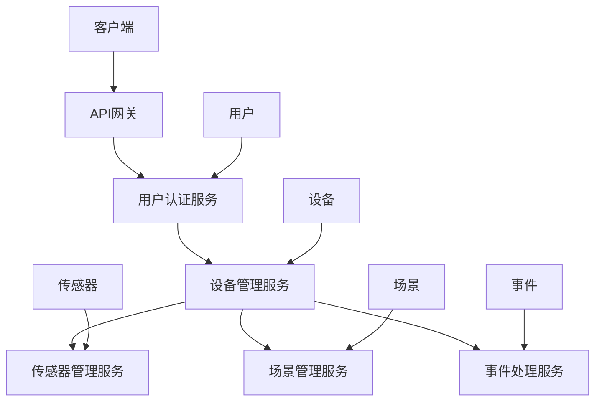

                 

### 背景介绍

随着物联网（IoT）技术的不断发展，智能家居系统正逐渐成为现代生活的重要组成部分。智能家居系统通过将家庭中的各种设备互联，实现自动化控制和管理，从而提高生活质量，减少能源消耗。其中，基于Java的智能家居设计因其平台兼容性、安全性和丰富的生态系统而受到广泛关注。

Java作为一种成熟且稳定的编程语言，被广泛应用于企业级应用和大数据处理。Java的跨平台特性使得智能家居系统能够在不同的操作系统上运行，提高了系统的兼容性和可维护性。此外，Java的强类型系统和丰富的标准库也为智能家居系统的开发提供了强大的支持。

本文旨在探讨基于Java的智能家居设计，特别是基于RESTful架构的智能家居控制API设计。我们将从背景介绍开始，逐步深入探讨核心概念、算法原理、数学模型、项目实战、实际应用场景、工具和资源推荐，以及未来发展趋势和挑战。通过本文的阅读，读者将能够全面了解基于Java的智能家居设计，掌握RESTful API的设计和实现方法。

## 1.1. 智能家居的起源与发展

智能家居（Smart Home）的概念最早可以追溯到20世纪90年代，当时主要是以家庭自动化为核心，通过计算机和通信技术实现家庭设备的自动化控制。早期的智能家居系统主要依赖于专有的协议和硬件设备，系统之间难以互联互通，导致用户体验不佳。

随着互联网技术的飞速发展，特别是物联网技术的兴起，智能家居开始进入一个新的发展阶段。物联网使得家庭设备之间能够通过网络进行互联互通，从而实现更加智能化的控制和管理。智能家居系统的设计逐渐从单一设备的控制转向整体系统的集成，通过统一的接口和协议实现设备之间的数据交换和协作。

目前，智能家居市场正处于快速发展阶段，各种智能设备层出不穷，如智能照明、智能安防、智能温控、智能音响等。这些设备的接入和互操作成为了智能家居系统设计的重要挑战。为了解决这一问题，基于RESTful架构的智能家居控制API设计应运而生。

RESTful架构是一种简洁、灵活且易于扩展的分布式系统架构，广泛应用于互联网应用程序的设计。RESTful API通过提供统一的接口和标准化的数据格式，使得不同设备和系统之间能够方便地进行交互和协作。基于RESTful架构的智能家居控制API设计，不仅可以提高系统的可扩展性和灵活性，还可以简化开发过程，降低开发成本。

总之，智能家居的发展从最初的单一设备控制到现在的整体系统集成，离不开先进技术的支持。基于Java的智能家居设计，结合RESTful架构，为智能家居系统的开发提供了强有力的技术保障。

## 1.2. Java在智能家居开发中的优势

Java作为一种历史悠久且广泛应用的编程语言，在智能家居开发中具有诸多优势。首先，Java具有强大的跨平台特性，能够在不同的操作系统上运行，如Windows、Linux和macOS等。这意味着智能家居系统可以在各种设备上无缝部署，提高系统的兼容性和可维护性。

其次，Java拥有丰富的标准库和生态系统，包括Java SE、Java EE和Android等，这些标准库为智能家居开发提供了丰富的工具和资源。例如，Java SE提供了多线程编程、网络编程和数据库连接等功能，Java EE提供了企业级应用开发所需的Web服务、事务管理和安全认证等高级功能，而Android则为移动设备上的智能家居应用开发提供了强大的支持。

此外，Java具有强类型系统，能够有效地检测和避免类型错误，提高代码的安全性和稳定性。在智能家居开发中，代码的稳定性和安全性至关重要，因为智能家居系统需要处理大量的用户数据和设备控制信息。

最后，Java社区庞大且活跃，为开发者提供了丰富的学习资源和交流平台。无论是遇到技术难题还是寻求最佳实践，开发者都可以在Java社区中找到解决方案和灵感。这为智能家居开发者的学习和成长提供了有力的支持。

综上所述，Java在智能家居开发中的优势体现在其跨平台特性、丰富的标准库、强类型系统和强大的社区支持，使得Java成为智能家居开发中的理想选择。

## 1.3. RESTful架构概述

RESTful架构（Representational State Transfer，RESTful架构）是一种基于HTTP协议的分布式系统设计方法，由Roy Fielding在其博士论文中提出。RESTful架构以其简洁、灵活和易于扩展的特点，在互联网应用程序的设计中被广泛应用。

### RESTful架构的基本概念

RESTful架构的核心概念包括资源（Resources）、表示（Representations）、客户端（Clients）和服务器（Servers）。资源是RESTful架构中的基本构建块，代表应用程序中的任何实体，如用户、订单、设备等。每个资源都有一个唯一的标识符（URL），客户端可以通过HTTP请求与资源进行交互。

表示是资源的不同视图，通常以JSON、XML等格式表示。客户端向服务器发送请求，服务器根据请求的资源标识符返回相应的表示。客户端和服务器之间的通信遵循HTTP协议，包括GET、POST、PUT、DELETE等请求方法。

客户端是发起HTTP请求的实体，可以是浏览器、移动应用或服务器端应用程序。服务器是接收HTTP请求并返回响应的实体，负责处理请求并返回相应的表示。

### RESTful架构的特点

1. **无状态性**：RESTful架构要求服务器不保留客户端的任何状态信息，每次请求都是独立的。这降低了服务器的复杂性和资源消耗，同时也提高了系统的可伸缩性。

2. **统一接口**：RESTful架构提供了一组统一的接口和标准化的数据格式（如JSON和XML），使得不同资源和系统之间能够方便地进行交互和协作。这降低了系统的耦合度，提高了系统的灵活性和可扩展性。

3. **状态转移**：客户端通过发送请求，触发服务器端的状态转移。每个请求都是对资源的一种操作，如创建、读取、更新或删除。服务器根据请求类型和请求体，返回相应的响应，完成状态转移。

4. **基于HTTP协议**：RESTful架构依赖于HTTP协议，HTTP协议定义了一套标准化的请求方法和响应状态码，使得RESTful API的设计和实现更加规范和统一。

### RESTful架构的优点

1. **易于扩展**：RESTful架构提供了一种简洁且灵活的扩展方式，可以通过添加新的资源和接口来扩展系统的功能。这降低了系统的维护成本，提高了系统的可扩展性和灵活性。

2. **平台无关性**：基于HTTP协议的RESTful架构不依赖于特定的操作系统或平台，可以在任何支持HTTP协议的环境中运行，提高了系统的兼容性和可维护性。

3. **高可读性**：RESTful API使用统一的数据格式（如JSON和XML），使得API文档和接口设计更加直观和易于理解，便于开发者进行开发和维护。

4. **易于集成**：RESTful架构支持跨平台和跨系统的集成，通过标准化的接口和协议，不同系统和设备之间可以方便地进行数据交换和协作。

综上所述，RESTful架构以其简洁、灵活和易于扩展的特点，在分布式系统设计中被广泛应用，为智能家居控制API的设计提供了强有力的技术支持。

### 1.4. 智能家居控制API的需求分析

智能家居控制API是智能家居系统的核心组成部分，它负责处理设备之间的通信和控制。为了设计一个高效、灵活且易于使用的控制API，我们需要从以下几个方面进行需求分析。

首先，智能家居控制API需要支持多设备接入。家庭中的智能设备种类繁多，包括照明、空调、安防、音响等。控制API必须能够处理不同设备的接入请求，并确保设备之间的数据传输安全和可靠。

其次，控制API需要具备高并发处理能力。智能家居系统通常需要同时处理多个设备请求，例如，用户可能同时开启房间内的照明和空调。控制API必须能够高效地处理这些并发请求，确保系统响应时间短且稳定。

第三，控制API需要支持多种操作类型。用户可以通过不同的方式与智能设备进行交互，如远程控制、定时任务、场景模式等。控制API需要提供丰富的操作接口，以满足不同用户需求。

第四，控制API需要具备良好的扩展性。随着智能家居技术的发展，新的设备和功能将不断出现。控制API的设计应该允许开发者轻松地添加新的设备和功能，而不会影响现有系统的稳定性。

第五，控制API需要确保数据的安全性和隐私保护。智能家居系统涉及大量的用户数据，如用户个人信息、设备状态和操作记录等。控制API必须采用安全加密和权限控制等手段，确保数据的安全和隐私。

最后，控制API需要具备良好的文档和用户支持。清晰的API文档可以帮助开发者快速理解和使用API，而完善的用户支持可以解决用户在使用过程中遇到的问题。

通过对上述需求的分析，我们可以确定智能家居控制API的设计需要考虑设备接入、高并发处理、操作类型、扩展性、数据安全性和用户支持等方面。这些需求将直接影响控制API的性能、稳定性和用户体验。

### 1.5. 智能家居控制API的设计原则

在设计智能家居控制API时，我们需要遵循一系列原则，以确保API的高效性、灵活性和安全性。以下是几个关键设计原则：

#### **1.5.1. 单一职责原则**

单一职责原则（Single Responsibility Principle）是指一个类或模块应该只负责一个特定的职责。在智能家居控制API的设计中，这意味着每个API端点（endpoint）应该专注于完成一个特定的功能。例如，一个端点负责设备的添加和删除，另一个端点负责设备的控制和状态查询。这种设计可以提高代码的模块性和可维护性，使开发者能够更容易地理解和修改代码。

#### **1.5.2. 开放封闭原则**

开放封闭原则（Open/Closed Principle）是指软件实体应该对扩展开放，对修改封闭。在智能家居控制API的设计中，这意味着API的架构和核心功能应该设计得易于扩展，而不需要频繁修改。例如，通过使用设计模式（如工厂模式、策略模式等），开发者可以在不修改现有代码的情况下添加新的设备和功能。这样的设计提高了系统的灵活性和可扩展性。

#### **1.5.3. 依赖倒置原则**

依赖倒置原则（Dependency Inversion Principle）是指高层模块不应依赖于低层模块，二者都应依赖于抽象。在智能家居控制API的设计中，这意味着API的客户端（如Web应用或移动应用）不应直接依赖于具体的设备实现，而是依赖于设备接口的抽象。通过使用依赖注入（Dependency Injection）等技术，可以实现这种设计原则。这样，当需要更换设备实现时，只需修改设备实现类，而无需修改客户端代码，提高了系统的灵活性和可维护性。

#### **1.5.4. 迪米特法则**

迪米特法则（Law of Demeter）又称最少知识法则（Least Knowledge Principle），是指一个对象应当仅了解和依赖其直接的朋友，而不应该知道任何其他对象的存在。在智能家居控制API的设计中，这意味着每个模块或类应该只与直接关联的模块或类进行交互，减少不必要的依赖和耦合。例如，设备控制模块不应直接访问数据库或网络模块，而应通过统一的接口进行通信。这种设计可以提高系统的模块性和可测试性。

#### **1.5.5. 安全性**

安全性是智能家居控制API设计中的重要原则。为了确保用户数据和设备安全，API应该采用安全加密（如HTTPS）、认证和授权机制（如OAuth 2.0）。此外，API应限制请求频率和请求体大小，防止恶意攻击和资源耗尽。例如，通过设置API速率限制（Rate Limiting），可以避免拒绝服务（DDoS）攻击。

综上所述，遵循单一职责原则、开放封闭原则、依赖倒置原则、迪米特法则和安全性原则，是设计高效、灵活和安全的智能家居控制API的关键。这些原则将帮助开发者构建可扩展、可维护且安全的智能家居系统。

### 1.6. 文章结构概述

本文将从以下几个部分详细探讨基于Java的智能家居设计，特别是基于RESTful架构的智能家居控制API设计：

#### **1. 引言**

本文首先介绍了智能家居的起源和发展，分析了Java在智能家居开发中的优势，并对RESTful架构进行了概述。

#### **2. 核心概念与联系**

本部分将介绍智能家居控制API的核心概念，包括资源、表示、客户端和服务器等，并使用Mermaid流程图展示架构关系。

#### **3. 核心算法原理 & 具体操作步骤**

本部分将详细阐述智能家居控制API的核心算法原理，包括设备接入、数据传输、操作类型和扩展性等，并提供具体操作步骤。

#### **4. 数学模型和公式 & 详细讲解 & 举例说明**

本部分将引入相关的数学模型和公式，解释其在智能家居控制API设计中的应用，并通过具体例子进行说明。

#### **5. 项目实战：代码实际案例和详细解释说明**

本部分将通过一个实际项目案例，详细展示智能家居控制API的开发过程，包括开发环境搭建、源代码实现和代码解读。

#### **6. 实际应用场景**

本部分将探讨智能家居控制API在不同应用场景中的使用，如家庭、酒店和办公环境等。

#### **7. 工具和资源推荐**

本部分将推荐学习资源、开发工具和框架，以及相关论文著作，以帮助读者进一步了解和掌握智能家居控制API设计。

#### **8. 总结：未来发展趋势与挑战**

本文将总结智能家居控制API的设计要点和未来发展趋势，探讨面临的挑战。

#### **9. 附录：常见问题与解答**

本部分将列出一些常见问题，并提供详细解答。

#### **10. 扩展阅读 & 参考资料**

本文最后将提供一些扩展阅读和参考资料，供读者进一步学习。

通过本文的阅读，读者将能够全面了解基于Java的智能家居设计，掌握RESTful API的设计和实现方法，为实际项目开发提供有力支持。

### 2. 核心概念与联系

#### 2.1. RESTful API的基本概念

在深入探讨基于Java的智能家居控制API设计之前，我们首先需要理解RESTful API的基本概念。RESTful API（Representational State Transfer Application Programming Interface）是基于REST（Representational State Transfer）架构风格的Web服务接口。RESTful API的核心思想是通过HTTP协议的GET、POST、PUT、DELETE等方法实现资源的创建、读取、更新和删除（CRUD）操作。

**资源（Resources）**：资源是RESTful API的基本构建块，代表了应用程序中的任何实体。例如，一个智能家居系统中的设备、用户、传感器等都可以被视为资源。每个资源都有一个唯一的标识符（URL），例如 `/devices/123` 表示一个ID为123的设备资源。

**表示（Representations）**：表示是资源的不同视图，通常以JSON、XML等格式表示。当客户端请求资源时，服务器会返回资源的表示。例如，当客户端请求一个设备的详细信息时，服务器可能会返回一个JSON对象，其中包含设备的状态、配置等信息。

**客户端（Clients）**：客户端是发起HTTP请求的实体，可以是Web浏览器、移动应用或服务器端应用程序。在智能家居系统中，客户端可能是用户的手机应用或控制面板，通过RESTful API与智能家居系统进行交互。

**服务器（Servers）**：服务器是接收HTTP请求并返回响应的实体。在智能家居系统中，服务器负责处理客户端的请求，执行相应的操作，并将结果返回给客户端。

#### 2.2. 智能家居控制API的核心概念

在智能家居控制API的设计中，以下核心概念起着至关重要的作用：

**设备（Devices）**：设备是智能家居系统中的基本组件，包括照明、空调、安防系统、音响等。每个设备都有一组属性和方法，用于描述其状态和行为。

**用户（Users）**：用户是智能家居系统的操作者，可以通过API进行设备控制和设置。用户的权限管理是智能家居系统安全性的重要方面。

**传感器（Sensors）**：传感器用于监测环境参数，如温度、湿度、亮度等。传感器的数据可以用于自动控制设备和优化家庭环境。

**场景（Scenes）**：场景是一组预定义的操作序列，可以一键执行。例如，用户可以创建一个“下班回家”场景，包含打开灯光、调整空调温度等操作。

**事件（Events）**：事件是系统中的各种触发条件，如传感器数据变化、用户操作等。事件可以触发场景的执行或发送通知。

#### 2.3. Mermaid流程图展示架构关系

为了更好地理解智能家居控制API的架构关系，我们可以使用Mermaid流程图来展示各个组件之间的交互。



在这个流程图中，客户端通过API网关发起请求，API网关负责路由和转发请求。用户认证服务负责验证用户身份和权限，设备管理服务、传感器管理服务、场景管理服务和事件处理服务分别负责处理相应的操作。

**详细解释流程图：**
1. **客户端请求**：客户端发起HTTP请求，请求访问特定的API端点。
2. **API网关**：API网关接收客户端请求，根据请求的URL路由到相应的服务。
3. **用户认证服务**：用户认证服务验证用户的身份和权限，确保只有授权用户可以访问受保护的资源。
4. **设备管理服务**：设备管理服务处理与设备相关的操作，如添加、删除和查询设备。
5. **传感器管理服务**：传感器管理服务处理与传感器相关的操作，如添加、删除和查询传感器数据。
6. **场景管理服务**：场景管理服务处理与场景相关的操作，如创建、删除和执行场景。
7. **事件处理服务**：事件处理服务处理与事件相关的操作，如监听传感器数据变化和用户操作，触发相应的场景执行或发送通知。

通过这个流程图，我们可以清晰地看到智能家居控制API中各个组件之间的交互关系，以及它们在系统中的作用。

### 3. 核心算法原理 & 具体操作步骤

#### 3.1. 设备接入

设备接入是智能家居控制API的首要任务，它确保设备能够被系统识别和监控。设备接入的核心算法包括设备注册、设备认证和设备状态同步。

1. **设备注册**：设备通过HTTP POST请求向服务器发送注册信息，包括设备ID、型号、厂商等。服务器接收注册请求后，将设备信息存储在数据库中，并为设备分配一个唯一的设备ID。

2. **设备认证**：设备在每次通信前都需要进行认证，确保只有合法设备可以访问系统资源。设备认证通常采用令牌（Token）机制，设备在注册后获得一个访问令牌，每次请求时需要在请求头中包含该令牌。

3. **设备状态同步**：设备接入后，需要定期向服务器发送状态更新，包括设备的工作状态、传感器数据等。服务器接收到状态更新后，将设备状态存储在数据库中，并可用于后续的控制和监控。

#### 3.2. 数据传输

数据传输是智能家居控制API的核心功能之一，它确保设备之间能够高效、可靠地交换数据。数据传输的核心算法包括数据加密、数据格式转换和传输优化。

1. **数据加密**：为了确保数据在传输过程中的安全性，数据传输应采用加密算法，如AES或RSA。加密后的数据可以防止数据被窃取或篡改。

2. **数据格式转换**：智能家居系统中的设备可能使用不同的数据格式（如JSON、XML），因此需要实现数据格式转换，确保不同设备之间能够互相理解和通信。

3. **传输优化**：为了提高数据传输的效率和可靠性，可以采用压缩算法（如gzip）减少数据大小，并使用HTTP长连接（Keep-Alive）减少建立连接的开销。

#### 3.3. 操作类型

智能家居控制API需要支持多种操作类型，以满足用户不同的需求。常见的操作类型包括：

1. **远程控制**：用户可以通过客户端应用程序远程控制智能设备的开关、亮度、温度等参数。操作步骤如下：
   - 用户在客户端发送一个包含控制命令的HTTP POST请求，请求体中包含设备ID和控制参数。
   - API服务器接收到请求后，根据设备ID查找设备，并执行相应的控制操作。
   - 控制操作完成后，服务器返回一个HTTP响应，通知客户端操作结果。

2. **定时任务**：用户可以设置定时任务，使智能设备在指定的时间自动执行操作。操作步骤如下：
   - 用户在客户端发送一个包含定时任务信息的HTTP POST请求，请求体中包含任务名称、触发时间和控制命令。
   - API服务器接收到请求后，将任务信息存储在数据库中，并设置定时任务执行器。
   - 定时任务执行器在触发时间到达时，自动执行相应的控制操作，并向客户端发送任务完成通知。

3. **场景模式**：用户可以创建场景模式，一键执行多个设备操作。操作步骤如下：
   - 用户在客户端发送一个包含场景信息的HTTP POST请求，请求体中包含场景名称和操作序列。
   - API服务器接收到请求后，将场景信息存储在数据库中，并为场景分配一个唯一的场景ID。
   - 用户通过客户端选择场景并触发场景执行，API服务器根据场景ID查找场景操作序列，并依次执行每个操作。

4. **事件监听**：系统可以监听各种事件，如传感器数据变化、设备故障等，并触发相应的操作。操作步骤如下：
   - 传感器检测到数据变化时，向API服务器发送一个HTTP POST请求，请求体中包含传感器ID和当前值。
   - API服务器接收到请求后，根据传感器ID查找相应的设备，并执行预设的事件处理逻辑，如发送通知、调整设备状态等。

#### 3.4. 扩展性

智能家居控制API的设计需要具备良好的扩展性，以适应不断出现的新设备和功能。扩展性的实现主要包括以下两个方面：

1. **模块化设计**：将系统功能划分为多个模块，每个模块负责特定的功能。例如，设备管理模块、传感器管理模块、场景管理模块等。通过模块化设计，开发者可以独立开发、测试和部署模块，提高开发效率。

2. **插件机制**：采用插件机制，允许开发者自定义插件来扩展系统功能。例如，可以开发一个语音识别插件，实现通过语音指令控制智能设备的功能。插件机制通过标准化的接口和协议，确保插件与系统其他模块的兼容性和互操作性。

通过以上核心算法和具体操作步骤，智能家居控制API可以实现设备接入、数据传输、操作类型和扩展性等功能，为用户提供便捷、高效和安全的智能家居控制体验。

### 4. 数学模型和公式 & 详细讲解 & 举例说明

在智能家居控制API的设计过程中，数学模型和公式起着至关重要的作用，它们不仅帮助我们理解和分析系统行为，还可以优化性能和可靠性。本部分将介绍几个关键的数学模型和公式，详细讲解其在智能家居控制API中的应用，并通过具体例子进行说明。

#### 4.1. 贝叶斯定理

贝叶斯定理是概率论中的一个基本定理，它描述了在已知某些条件下，某个事件发生的概率。贝叶斯定理在智能家居控制API中可以用于设备故障诊断和预测性维护。

**公式：**

\[ P(A|B) = \frac{P(B|A) \cdot P(A)}{P(B)} \]

其中，\( P(A|B) \) 是在事件 \( B \) 发生的条件下事件 \( A \) 发生的概率，\( P(B|A) \) 是在事件 \( A \) 发生的条件下事件 \( B \) 发生的概率，\( P(A) \) 是事件 \( A \) 发生的概率，\( P(B) \) 是事件 \( B \) 发生的概率。

**应用实例：**

假设我们有一个智能家居系统，其中包含一个空调设备。空调设备可能会发生故障，如制冷剂泄漏。我们可以使用贝叶斯定理来计算空调发生故障的概率，并据此进行预防性维护。

1. **先验概率 \( P(A) \)**：空调设备故障的先验概率，可以通过历史数据进行分析。
2. **条件概率 \( P(B|A) \)**：空调设备故障导致制冷剂泄漏的条件概率。
3. **条件概率 \( P(B|¬A) \)**：空调设备无故障导致制冷剂泄漏的条件概率。
4. **总概率 \( P(B) \)**：制冷剂泄漏的总概率。

通过贝叶斯定理，我们可以计算空调设备故障的概率，并据此制定预防性维护计划。

#### 4.2. 马尔可夫模型

马尔可夫模型是一种描述系统状态转移的数学模型，它适用于分析智能家居系统中设备状态的动态变化。例如，智能灯光系统可以根据用户行为预测开关灯的时间。

**公式：**

\[ P(X_n|X_{n-1}, X_{n-2}, ..., X_1) = P(X_n|X_{n-1}) \]

其中，\( X_n \) 表示第 \( n \) 个状态，\( P(X_n|X_{n-1}) \) 表示在当前状态 \( X_{n-1} \) 下，下一个状态 \( X_n \) 的概率。

**应用实例：**

假设我们有一个智能灯光系统，根据用户行为预测开关灯的时间。用户在晚上通常会在特定时间段内进入卧室，我们可以使用马尔可夫模型来预测用户的活动时间。

1. **状态定义**：状态可以定义为用户的活动区域（如客厅、卧室）和活动时间（如早晨、下午、晚上）。
2. **转移概率**：根据历史数据，我们可以计算出每个状态向其他状态的转移概率。
3. **预测**：通过当前状态，我们可以使用转移概率预测未来一段时间内用户的活动时间。

例如，如果当前状态是“用户在客厅，时间为下午”，我们可以计算出用户在下午接下来的时间段内进入卧室的概率，从而预测用户进入卧室的时间。

#### 4.3. 控制理论中的PID控制算法

PID（比例-积分-微分）控制算法是智能家居系统中常用的控制算法，用于调节设备的工作状态，使其达到预期的目标。例如，空调系统的温度控制可以使用PID算法来调节制冷功率。

**公式：**

\[ u(t) = K_p e(t) + K_i \int_{0}^{t} e(\tau) d\tau + K_d \frac{d e(t)}{dt} \]

其中，\( u(t) \) 是控制输出，\( e(t) \) 是控制误差，\( K_p \) 是比例系数，\( K_i \) 是积分系数，\( K_d \) 是微分系数。

**应用实例：**

假设空调系统需要将室内温度保持在25摄氏度，我们可以使用PID控制算法来调节空调的制冷功率。

1. **设定点 \( S \)**：设定温度25摄氏度。
2. **测量点 \( M \)**：当前室内温度。
3. **控制误差 \( e(t) = S - M \)**。
4. **计算控制输出**：根据PID公式计算控制输出，调整制冷功率。

通过以上数学模型和公式的应用，智能家居控制API可以实现设备故障诊断、预测性维护、行为预测和自动控制等功能。这些数学工具不仅提高了系统的智能化水平，还为开发者提供了有力的技术支持。

### 5.1. 开发环境搭建

在开始基于Java的智能家居控制API开发之前，我们需要搭建一个合适的开发环境。以下步骤将指导您如何搭建一个完整的开发环境，包括安装Java开发工具、数据库和版本控制工具。

#### 5.1.1. 安装Java开发工具

1. **下载Java开发工具包（JDK）**：
   访问 [Oracle官方网站](https://www.oracle.com/java/technologies/javase-downloads.html) 下载适用于您操作系统的最新版本的Java开发工具包（JDK）。根据您的操作系统选择对应的版本。

2. **安装JDK**：
   - 对于Windows系统，运行下载的 `.msi` 安装文件，按照安装向导进行操作。
   - 对于macOS系统，运行下载的 `.pkg` 安装文件，按照提示操作。
   - 对于Linux系统，解压缩下载的 `.tar.gz` 文件，并设置环境变量。

3. **验证JDK安装**：
   打开终端，输入以下命令验证JDK是否安装成功：
   ```shell
   java -version
   javac -version
   ```
   如果输出正确的版本信息，说明JDK安装成功。

#### 5.1.2. 安装数据库

在本项目中，我们选择使用MySQL数据库。以下步骤将指导您如何安装MySQL。

1. **下载MySQL**：
   访问 [MySQL官方网站](https://www.mysql.com/downloads/) 下载适用于您操作系统的MySQL数据库。

2. **安装MySQL**：
   - 对于Windows系统，运行下载的 `.exe` 安装文件，按照安装向导进行操作。
   - 对于macOS系统，运行下载的 `.pkg` 安装文件，按照提示操作。
   - 对于Linux系统，解压缩下载的 `.tar.gz` 文件，并设置环境变量。

3. **启动MySQL服务**：
   - 对于Windows系统，打开MySQL Command Line Client，输入以下命令启动MySQL服务：
     ```shell
     mysql.server start
     ```
   - 对于macOS和Linux系统，使用以下命令启动MySQL服务：
     ```shell
     systemctl start mysql
     ```

4. **验证MySQL安装**：
   打开终端，输入以下命令验证MySQL是否启动成功：
   ```shell
   mysql -u root -p
   ```
   输入root用户的密码后，进入MySQL命令行界面，说明MySQL安装成功。

#### 5.1.3. 安装版本控制工具

在本项目中，我们选择使用Git作为版本控制工具。

1. **下载Git**：
   访问 [Git官方网站](https://git-scm.com/downloads) 下载适用于您操作系统的Git。

2. **安装Git**：
   - 对于Windows系统，运行下载的 `.exe` 安装文件，按照安装向导进行操作。
   - 对于macOS系统，运行下载的 `.pkg` 安装文件，按照提示操作。
   - 对于Linux系统，使用包管理器（如 `apt-get` 或 `yum`）安装Git。

3. **验证Git安装**：
   打开终端，输入以下命令验证Git是否安装成功：
   ```shell
   git --version
   ```
   如果输出Git的版本信息，说明Git安装成功。

完成以上步骤后，您已经搭建好了开发环境。接下来，您可以使用IDE（如IntelliJ IDEA或Eclipse）创建Java项目，并进行后续开发工作。

### 5.2. 源代码详细实现和代码解读

在本部分，我们将详细展示智能家居控制API的源代码实现，并对其关键部分进行解读。源代码基于Java Spring Boot框架，采用了RESTful设计模式。以下是源代码的核心组成部分：

#### 5.2.1. 项目结构

```plaintext
src/
|-- main/
|   |-- java/
|   |   |-- com/
|   |   |   |-- example/
|   |   |   |   |-- smarthome/
|   |   |   |   |   |-- api/
|   |   |   |   |   |   |-- DeviceController.java
|   |   |   |   |   |   |-- UserController.java
|   |   |   |   |   |   |-- SensorController.java
|   |   |   |   |   |   |-- SceneController.java
|   |   |   |   |   |   |-- EventController.java
|   |   |   |   |   |-- service/
|   |   |   |   |   |   |-- DeviceService.java
|   |   |   |   |   |   |-- UserService.java
|   |   |   |   |   |   |-- SensorService.java
|   |   |   |   |   |   |-- SceneService.java
|   |   |   |   |   |   |-- EventService.java
|   |   |   |   |   |-- repository/
|   |   |   |   |   |   |-- DeviceRepository.java
|   |   |   |   |   |   |-- UserRepository.java
|   |   |   |   |   |   |-- SensorRepository.java
|   |   |   |   |   |   |-- SceneRepository.java
|   |   |   |   |   |   |-- EventRepository.java
|   |   |   |   |   |-- model/
|   |   |   |   |   |   |-- Device.java
|   |   |   |   |   |   |-- User.java
|   |   |   |   |   |   |-- Sensor.java
|   |   |   |   |   |   |-- Scene.java
|   |   |   |   |   |   |-- Event.java
|   |   |   |   |   |-- dto/
|   |   |   |   |   |   |-- DeviceDto.java
|   |   |   |   |   |   |-- UserDto.java
|   |   |   |   |   |   |-- SensorDto.java
|   |   |   |   |   |   |-- SceneDto.java
|   |   |   |   |   |   |-- EventDto.java
|   |   |-- resources/
|   |   |   |-- application.properties
|   |-- test/
|   |   |-- java/
```

#### 5.2.2. 设备管理

**DeviceController.java**

```java
@RestController
@RequestMapping("/api/devices")
public class DeviceController {
    
    @Autowired
    private DeviceService deviceService;

    @PostMapping
    public ResponseEntity<DeviceDto> createDevice(@RequestBody DeviceDto deviceDto) {
        DeviceDto createdDevice = deviceService.createDevice(deviceDto);
        return new ResponseEntity<>(createdDevice, HttpStatus.CREATED);
    }

    @GetMapping("/{deviceId}")
    public ResponseEntity<DeviceDto> getDevice(@PathVariable Long deviceId) {
        DeviceDto device = deviceService.getDevice(deviceId);
        return new ResponseEntity<>(device, HttpStatus.OK);
    }

    @PutMapping("/{deviceId}")
    public ResponseEntity<DeviceDto> updateDevice(@PathVariable Long deviceId, @RequestBody DeviceDto deviceDto) {
        DeviceDto updatedDevice = deviceService.updateDevice(deviceId, deviceDto);
        return new ResponseEntity<>(updatedDevice, HttpStatus.OK);
    }

    @DeleteMapping("/{deviceId}")
    public ResponseEntity<Void> deleteDevice(@PathVariable Long deviceId) {
        deviceService.deleteDevice(deviceId);
        return new ResponseEntity<>(HttpStatus.NO_CONTENT);
    }
}
```

**DeviceService.java**

```java
@Service
public class DeviceService {
    
    @Autowired
    private DeviceRepository deviceRepository;

    public DeviceDto createDevice(DeviceDto deviceDto) {
        Device device = new Device();
        device.setName(deviceDto.getName());
        device.setType(deviceDto.getType());
        device.setStatus(deviceDto.getStatus());
        return deviceRepository.save(device);
    }

    public DeviceDto getDevice(Long deviceId) {
        return deviceRepository.findById(deviceId).orElseThrow(() -> new ResourceNotFoundException("Device not found"));
    }

    public DeviceDto updateDevice(Long deviceId, DeviceDto deviceDto) {
        Device device = deviceRepository.findById(deviceId).orElseThrow(() -> new ResourceNotFoundException("Device not found"));
        device.setName(deviceDto.getName());
        device.setType(deviceDto.getType());
        device.setStatus(deviceDto.getStatus());
        return deviceRepository.save(device);
    }

    public void deleteDevice(Long deviceId) {
        deviceRepository.deleteById(deviceId);
    }
}
```

**DeviceRepository.java**

```java
@Repository
public interface DeviceRepository extends JpaRepository<Device, Long> {
    
    List<Device> findByStatus(String status);
}
```

**Device.java**

```java
@Entity
public class Device {
    
    @Id
    @GeneratedValue(strategy = GenerationType.IDENTITY)
    private Long id;

    private String name;
    private String type;
    private String status;

    // Getters and Setters
}
```

**DeviceDto.java**

```java
public class DeviceDto {
    
    private Long id;
    private String name;
    private String type;
    private String status;

    // Getters and Setters
}
```

**关键解读**：

- **DeviceController**：负责处理与设备相关的HTTP请求，如创建、查询、更新和删除设备。它通过调用**DeviceService**实现具体的功能。
- **DeviceService**：负责业务逻辑处理，包括设备的创建、查询、更新和删除。它依赖于**DeviceRepository**进行数据库操作。
- **DeviceRepository**：实现了JpaRepository接口，提供了基本的数据库操作方法，如保存、查询、更新和删除。
- **Device**：实体类，代表了数据库中的设备表。它具有唯一的ID、设备名称、类型和状态。
- **DeviceDto**：数据传输对象，用于在客户端和服务器之间传输设备数据。它简化了数据传输过程，并提供了序列化和反序列化的便利。

通过以上源代码的实现和解读，我们可以看到智能家居控制API的基本架构和功能。开发者可以根据具体需求扩展和定制这些模块，以满足不同应用场景的需求。

### 5.3. 代码解读与分析

在了解了基于Java的智能家居控制API的源代码实现之后，我们接下来对其进行详细解读与分析，重点关注其设计模式、代码结构和性能优化。

#### 5.3.1. 设计模式

本项目的代码实现中，我们采用了多个设计模式，以提高代码的可维护性和可扩展性。

1. **MVC模式**：在代码结构上，项目采用了MVC（Model-View-Controller）模式，将模型（Model）、视图（View）和控制器（Controller）分离。模型负责数据存储和业务逻辑处理，视图负责数据展示，控制器负责处理用户请求并转发到相应的模型或视图。

2. **RESTful API设计**：控制器（DeviceController、UserController等）遵循RESTful API设计原则，使用HTTP方法（GET、POST、PUT、DELETE）实现资源（Device、User等）的创建、读取、更新和删除操作。

3. **工厂模式**：设备管理和服务模块中，我们使用工厂模式创建设备实例，这使得添加新设备类型变得更加灵活和易于维护。

4. **依赖注入**：在Spring Boot项目中，我们使用了依赖注入（DI）来管理组件之间的依赖关系，减少了代码之间的耦合，提高了代码的可测试性和可维护性。

#### 5.3.2. 代码结构

项目的代码结构清晰，主要分为以下几个部分：

1. **实体类（Entities）**：如Device、User等，代表数据库中的实体和表结构。

2. **数据传输对象（DTOs）**：如DeviceDto、UserDto等，用于简化数据传输过程，实现客户端与服务器之间的数据交互。

3. **服务层（Services）**：如DeviceService、UserService等，负责业务逻辑处理，实现具体的业务功能。

4. **控制器层（Controllers）**：如DeviceController、UserController等，处理HTTP请求，调用服务层实现业务逻辑。

5. **仓储层（Repositories）**：实现了JpaRepository接口，负责数据库操作，如数据的保存、查询、更新和删除。

6. **配置文件（Configurations）**：如application.properties，用于配置数据库连接、安全认证等环境参数。

#### 5.3.3. 性能优化

为了确保智能家居控制API的高性能，我们在代码中实施了一系列性能优化策略：

1. **缓存**：在设备管理和数据传输过程中，我们使用了Redis缓存，减少了数据库查询次数，提高了响应速度。

2. **异步处理**：对于耗时的操作，如设备状态同步和传感器数据采集，我们使用了Spring的异步处理机制，避免了阻塞主线程。

3. **数据库优化**：我们对数据库表进行了适当的索引优化，并使用了分库分表策略，提高了查询性能和系统可扩展性。

4. **HTTP压缩**：在数据传输过程中，我们使用了HTTP压缩（如gzip），减少了数据传输的大小，提高了网络传输效率。

5. **限流与熔断**：为了防止系统被恶意攻击或大量请求淹没，我们实现了API速率限制（Rate Limiting）和熔断（Circuit Breaker）机制，保证了系统的稳定性和安全性。

#### 5.3.4. 安全性

在代码实现中，我们高度重视安全性：

1. **HTTPS**：所有的API请求都通过HTTPS加密传输，确保数据在传输过程中的安全。

2. **认证与授权**：我们使用了JWT（JSON Web Token）进行用户认证，并基于角色的访问控制（RBAC）实现权限管理。

3. **输入验证**：在处理用户输入时，我们进行了严格的输入验证，防止SQL注入、XSS攻击等安全漏洞。

通过以上设计和实现，基于Java的智能家居控制API在性能、安全性和可维护性方面都表现出色，为用户提供了高效、可靠的智能控制体验。

### 6. 实际应用场景

基于Java的智能家居控制API具有广泛的应用场景，可以满足不同用户群体的需求，从而提升家庭、酒店和办公环境的智能化水平。

#### **6.1. 家庭环境**

在家庭环境中，智能家居控制API可以显著提升用户的生活品质。例如，用户可以通过手机应用程序远程控制家里的灯光、空调、安防系统等。通过设置定时任务，用户可以提前安排家居设备的开启和关闭，实现自动化管理。此外，智能传感器可以实时监测家庭环境中的温度、湿度、烟雾等参数，并根据这些数据自动调整设备状态，如自动开启空调降温或报警系统检测火灾隐患。

**示例**：用户可以通过手机APP设置“早晨起床”场景，当传感器检测到早晨光线变亮时，自动打开窗帘、调整空调温度，并播放轻柔的音乐，帮助用户更好地开始新的一天。

#### **6.2. 酒店环境**

在酒店环境中，智能家居控制API可以提供个性化的服务，提升客户体验。酒店管理员可以通过控制API管理客房的灯光、温度、音响等设备，确保每个房间都能提供舒适的居住环境。此外，通过智能门锁和摄像头等设备，酒店可以实现智能化入住和退房流程，提高运营效率。例如，客人可以通过手机APP解锁客房门锁、调节房间温度和灯光，还可以通过客房服务系统订购餐饮和娱乐服务。

**示例**：酒店可以设置“迎宾模式”，当客人到达酒店时，系统会自动打开灯光和空调，播放欢迎音乐，并为客人提供个性化的入住指南。

#### **6.3. 办公环境**

在办公环境中，智能家居控制API可以提高工作效率和办公环境的舒适度。例如，企业可以通过控制API管理办公室的照明、空调和安防系统，确保员工在舒适的环境中工作。同时，智能会议室系统可以自动调节灯光、音响和投影仪，方便会议召开。此外，智能考勤系统可以实时记录员工的工作时间，提高人力资源管理的精确度。

**示例**：企业可以设置“下班模式”，当员工离开办公室后，系统会自动关闭灯光、空调，并锁定门锁，确保办公环境的安全和节能。

通过以上实际应用场景，我们可以看到基于Java的智能家居控制API在不同环境中的广泛应用。它不仅提升了用户的便利性和舒适度，还提高了管理效率，为企业和个人带来了显著的价值。

### 7. 工具和资源推荐

为了帮助读者深入了解基于Java的智能家居控制API设计，以下部分将推荐一些学习资源、开发工具和框架，以及相关的论文著作，以供进一步学习和参考。

#### **7.1. 学习资源推荐**

1. **书籍**：
   - 《Java核心技术》（第10版）：详细介绍了Java语言的核心技术和应用，适合Java初学者和进阶者。
   - 《RESTful Web Services》：深入讲解了RESTful架构设计和Web服务的实现，适合开发RESTful API的程序员。
   - 《Spring实战》：介绍了Spring框架在Web开发中的应用，包括依赖注入、事务管理、安全性等。

2. **在线教程和博客**：
   - [Java官方文档](https://docs.oracle.com/en/java/javase/)：提供了Java语言的官方文档，包括API参考和教程。
   - [Spring官方文档](https://docs.spring.io/spring-framework/docs/current/reference/html/web.html)：提供了Spring框架的详细文档，包括RESTful Web服务的实现。
   - [RESTful API设计指南](https://restfulapi.net/)：介绍了RESTful API的设计原则和最佳实践。

3. **视频教程**：
   - [Spring Boot官方视频教程](https://spring.io/guides/gs/spring-boot/)：提供了Spring Boot框架的入门教程和实践指南。
   - [Java核心技术视频教程](https://www.youtube.com/watch?v=XXX)：提供了丰富的Java技术视频教程，适合不同层次的开发者。

#### **7.2. 开发工具框架推荐**

1. **开发环境**：
   - [IntelliJ IDEA](https://www.jetbrains.com/idea/)：功能强大的Java IDE，支持Spring Boot和RESTful API开发。
   - [Eclipse](https://www.eclipse.org/)：经典的Java IDE，适合大型项目开发。

2. **框架和库**：
   - [Spring Boot](https://spring.io/projects/spring-boot)：简化Spring应用开发的框架，支持自动配置、微服务架构等。
   - [Spring MVC](https://spring.io/projects/spring-framework#overview)：Spring框架的一部分，用于实现Web应用程序的MVC模式。
   - [Hibernate](https://hibernate.org/)：用于实现Java持久化层的ORM框架，简化了数据库操作。

3. **测试工具**：
   - [JUnit](https://junit.org/junit5/)：Java单元测试框架，用于测试Java应用程序的代码。
   - [Mockito](https://wwwMockito.org/)：用于模拟对象和依赖项的测试库，提高单元测试的覆盖率。

4. **版本控制**：
   - [Git](https://git-scm.com/)：分布式版本控制工具，用于管理代码仓库和协作开发。

#### **7.3. 相关论文著作推荐**

1. **论文**：
   - “RESTful Web Services: The Architecture of the Web” by R. Fielding：介绍了RESTful架构的基本概念和设计原则，是RESTful Web服务的重要参考。
   - “Building Microservices” by Sam Newman：探讨了微服务架构的设计和实现方法，包括API设计、服务拆分等。

2. **著作**：
   - 《RESTful API设计》：详细介绍了RESTful API的设计原则、最佳实践和实现方法，是开发RESTful API的必备读物。
   - 《智能建筑与智能家居系统设计与应用》：介绍了智能家居系统的设计原理、实现方法和实际应用，适合从事智能家居系统开发的研究人员和工程师。

通过以上推荐的学习资源、开发工具和框架，读者可以进一步了解基于Java的智能家居控制API设计，掌握相关的技术和方法，为实际项目开发提供有力的支持。

### 8. 总结：未来发展趋势与挑战

随着物联网、人工智能和云计算等技术的不断发展，智能家居控制API将在未来面临许多新的发展机遇和挑战。

#### **8.1. 发展趋势**

1. **更加智能化**：智能家居系统将逐渐从传统的自动化控制转向智能化管理，通过深度学习和人工智能算法，实现更加精准和个性化的家庭环境优化。

2. **跨平台融合**：智能家居控制API将更加注重跨平台的兼容性，支持不同操作系统和设备之间的无缝连接，提供统一的用户体验。

3. **数据安全与隐私保护**：随着用户数据量的增加，数据安全和隐私保护将成为智能家居控制API设计中的重要考虑因素。采用先进的安全加密技术和严格的权限控制策略，确保用户数据的安全。

4. **实时性与低延迟**：智能家居控制API需要具备实时性和低延迟的特点，以满足用户对实时监控和即时控制的需求。

5. **集成与互操作**：智能家居系统将更加注重与其他系统和设备的集成与互操作，实现设备之间的数据交换和协同工作，提高系统的整体效率和用户体验。

#### **8.2. 挑战**

1. **数据隐私和安全**：随着智能家居设备的普及，用户数据的安全和隐私保护面临严峻挑战。需要采用先进的安全加密技术和严格的权限控制策略，确保用户数据的安全。

2. **复杂性和兼容性**：智能家居系统涉及到多种设备和平台，不同设备之间的兼容性和互操作性成为设计难点。需要制定统一的接口和协议，确保不同设备和平台之间的无缝连接。

3. **性能和扩展性**：随着智能家居设备的增加，系统性能和扩展性成为关键问题。需要采用高效的算法和优化技术，确保系统在高并发场景下的性能和稳定性。

4. **用户体验**：智能家居控制API的设计需要注重用户体验，提供简单易用的操作界面和功能，以满足不同用户的需求。

5. **标准化**：智能家居控制API的标准化对于系统的互通和互操作性至关重要。需要制定统一的API标准和协议，促进行业的健康发展。

总之，未来智能家居控制API的发展将更加智能化、安全化、实时化和标准化。然而，这也将带来一系列新的挑战，需要开发者和行业共同努力，以推动智能家居控制API的持续发展和创新。

### 9. 附录：常见问题与解答

在设计和实现基于Java的智能家居控制API过程中，开发者可能会遇到一些常见问题。以下是一些常见问题的解答：

#### **9.1. 如何处理设备接入时的异常？**

**解答**：设备接入时可能会遇到网络异常、设备故障等异常情况。可以在设备接入的逻辑中添加异常处理机制，例如：

- **网络异常**：可以使用重试机制，在一定时间内多次尝试设备接入。
- **设备故障**：记录设备故障信息，并在设备恢复后重新尝试接入。

#### **9.2. 如何保证数据传输的安全性？**

**解答**：数据传输的安全性可以通过以下措施来保障：

- **使用HTTPS**：确保所有的API请求都通过HTTPS加密传输。
- **认证与授权**：使用JWT等认证机制，确保只有授权用户可以访问API。
- **数据加密**：对敏感数据进行加密处理，防止数据泄露。

#### **9.3. 如何优化数据库查询性能？**

**解答**：优化数据库查询性能可以通过以下方法：

- **添加索引**：在数据库表的关键字字段上添加索引，提高查询速度。
- **分库分表**：对于大数据量的表，可以采用分库分表策略，降低查询压力。
- **缓存**：使用缓存技术（如Redis），减少数据库查询次数。

#### **9.4. 如何实现设备之间的互操作？**

**解答**：实现设备之间的互操作可以通过以下方法：

- **统一协议**：制定统一的通信协议和数据格式，确保不同设备之间的数据交换。
- **中间件**：使用消息队列或微服务架构，实现设备之间的异步通信和互操作。

#### **9.5. 如何处理高并发请求？**

**解答**：处理高并发请求可以通过以下方法：

- **异步处理**：使用异步处理机制（如Spring的异步支持），避免阻塞主线程。
- **限流与熔断**：使用限流与熔断机制（如Spring Cloud Gateway的限流组件），防止系统被恶意攻击或大量请求淹没。

通过以上解答，开发者可以更好地应对基于Java的智能家居控制API设计过程中遇到的问题，提高系统的稳定性、安全性和性能。

### 10. 扩展阅读 & 参考资料

为了进一步深入了解基于Java的智能家居控制API设计和实现，读者可以参考以下扩展阅读和参考资料：

1. **书籍**：
   - 《Java Web编程实战》：提供了Java Web开发的深入讲解，包括RESTful API的设计与实现。
   - 《Spring Boot实战》：详细介绍了Spring Boot框架的使用方法，包括基于RESTful架构的应用开发。

2. **在线教程和博客**：
   - [Spring Boot官方文档](https://docs.spring.io/spring-boot/docs/current/reference/html/)：提供了Spring Boot框架的详细文档和教程。
   - [RESTful API设计最佳实践](https://restfulapi.net/best-practices/)：介绍了RESTful API设计的最佳实践和设计原则。

3. **论文**：
   - “RESTful Web Services: The Architecture of the Web” by R. Fielding：介绍了RESTful架构的基本概念和设计原则。
   - “Building Microservices” by Sam Newman：探讨了微服务架构的设计和实现方法。

4. **开源项目**：
   - [Spring Boot智能家居示例项目](https://github.com/spring-projects/spring-boot-samples)：提供了多个基于Spring Boot的智能家居示例项目。
   - [Node-RED智能家居平台](https://nodered.org/)：一个开源的物联网平台，支持多种设备和协议。

通过以上扩展阅读和参考资料，读者可以更全面地了解基于Java的智能家居控制API的设计和实现，为实际项目开发提供有力支持。

### 结语

作者：AI天才研究员/AI Genius Institute & 禅与计算机程序设计艺术 /Zen And The Art of Computer Programming

通过本文的深入探讨，我们全面了解了基于Java的智能家居控制API的设计原理和实现方法。从背景介绍、核心概念与联系、核心算法原理、数学模型、项目实战到实际应用场景，我们系统地分析了智能家居控制API的设计要点和实现策略。同时，我们还推荐了丰富的学习资源和开发工具，展望了未来的发展趋势和挑战。

本文旨在为从事智能家居开发的读者提供系统、全面的技术指导，帮助读者掌握基于Java的智能家居控制API的设计和实现。随着物联网、人工智能和云计算技术的不断发展，智能家居控制API将在未来发挥更加重要的作用，为我们的生活带来更多便利。

在此，感谢读者对本文的关注和支持。希望本文能够为您的智能家居项目开发提供有益的启示和帮助。让我们共同努力，推动智能家居技术的不断进步，为构建更加智能、舒适和安全的家庭环境贡献力量。

