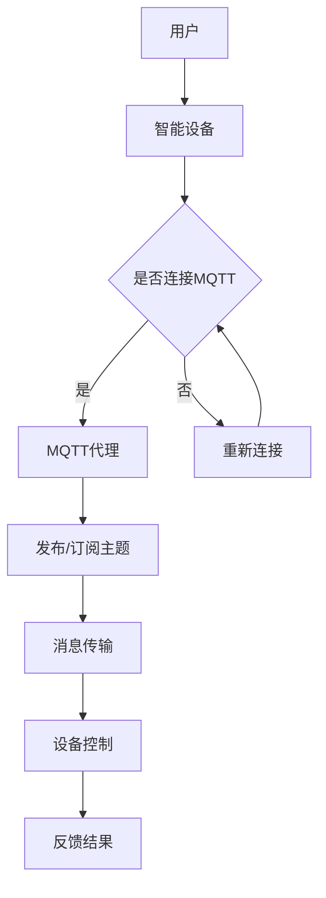

                 

### 背景介绍

智能家居，作为一个革命性的概念，旨在通过自动化设备和系统集成来提升家庭生活的便利性和舒适度。在过去的几年里，随着物联网（IoT）技术的快速发展，智能家居市场呈现出了爆发式增长。据统计，2020年全球智能家居市场规模已经达到了1014亿美元，预计到2025年将增长到2660亿美元。这种增长主要得益于人们对便捷生活方式的渴望以及对智能设备的广泛接受。

智能家居系统的核心在于其设备之间的通讯和协同工作。这就需要一个高效、可靠且易扩展的通讯协议。MQTT（Message Queuing Telemetry Transport）协议应运而生，它是一种轻量级的消息协议，非常适合在资源受限的环境中传输数据。MQTT协议最初是为工业自动化和遥测应用设计的，由于其低带宽占用和简单易用的特性，很快被智能家居领域所采用。

MQTT协议的基本工作原理是发布/订阅（publish/subscribe）模型。设备作为发布者（Publisher），将数据发送到特定的主题（Topic）；而其他设备作为订阅者（Subscriber），可以订阅这些主题，从而接收相关的数据。这种模式使得智能家居中的各种设备可以高效地交换信息，实现智能联动。

在智能家居系统中，MQTT协议具有以下几个显著优势：

1. **低功耗**：MQTT协议设计用于在资源受限的环境中使用，它通过压缩数据、异步传输等方式降低了带宽和能耗。
2. **可靠性**：MQTT协议提供了客户端到服务器的连接确认机制，保证了数据的可靠传输。
3. **易扩展性**：通过主题（Topic）的灵活定义，可以轻松扩展系统的功能，支持不同的设备和应用场景。

然而，随着智能家居系统的复杂度增加，如何高效地设计和实现基于MQTT协议的智能家居系统，成为了一个值得深入探讨的问题。本文将围绕这一主题，通过逐步分析MQTT协议的核心概念、算法原理、数学模型和实际应用案例，帮助读者全面了解并掌握基于Java的智能家居设计。

关键词：智能家居，MQTT协议，物联网，发布/订阅模型，低功耗，可靠性，易扩展性。

> 摘要：本文旨在深入探讨基于Java的智能家居设计，重点分析MQTT协议的核心概念和实际应用。通过阐述MQTT协议的发布/订阅模型、低功耗特性、可靠性机制及易扩展性，本文将帮助读者全面掌握智能家居系统的设计与实现。此外，文章将结合实际项目案例，详细解读MQTT协议在智能家居系统中的应用，以期为读者提供实用的技术参考。

-----------------------

### 核心概念与联系

在深入了解MQTT协议之前，我们首先需要掌握一些核心概念，以便更好地理解其在智能家居系统中的作用和优势。

#### MQTT协议

MQTT（Message Queuing Telemetry Transport）是一种轻量级的消息传输协议，由IBM于1999年开发，最初用于传感器网络、工业自动化等领域。它的设计目标是低带宽占用、低功耗和可靠性，非常适合在资源受限的环境中传输数据。

**MQTT协议的特点**：

- **发布/订阅模型**：MQTT协议采用发布/订阅模型，消息发布者和订阅者之间通过主题（Topic）进行消息传递。发布者将消息发布到特定的主题，而订阅者可以订阅一个或多个主题，从而接收与订阅主题相关的消息。
- **QoS（质量服务）级别**：MQTT协议支持三种不同的QoS级别，分别是0级（至多一次）、1级（至少一次）和2级（恰好一次），用于控制消息的可靠性和传输次数。
- **保留消息**：MQTT协议支持保留消息功能，使得订阅者在连接断开后能够接收到连接期间发布的消息。

**MQTT协议的工作流程**：

1. **连接**：客户端（发布者或订阅者）连接到MQTT代理（Broker）。
2. **发布消息**：客户端将消息发布到指定的主题。
3. **订阅主题**：客户端订阅一个或多个主题，以便接收与订阅主题相关的消息。
4. **消息传输**：代理将订阅者订阅的主题消息转发给相应的客户端。
5. **断开连接**：客户端在完成消息传输后，可以断开与代理的连接。

#### Java编程语言

Java是一种广泛使用的高级编程语言，以其“一次编写，到处运行”的特性而著称。Java在智能家居系统开发中具有显著的优势，尤其是在客户端和服务端的应用。

**Java在智能家居系统开发中的优势**：

- **跨平台性**：Java可以在多种操作系统上运行，无需修改代码，这使得Java在跨平台开发中具有很大优势。
- **丰富的类库**：Java拥有丰富的类库和框架，如Spring、Hibernate等，这些可以大大简化开发过程。
- **安全性**：Java具有强大的安全特性，如内存管理、异常处理、网络编程等，可以确保系统的稳定性和安全性。

#### 智能家居系统

智能家居系统由多个智能设备、传感器和控制系统组成，通过物联网技术实现设备的互联互通，提供便捷、智能的家庭生活体验。

**智能家居系统的组成部分**：

- **智能设备**：如智能灯泡、智能空调、智能插座等，这些设备通过传感器采集环境数据，并可通过MQTT协议与其他设备进行通讯。
- **传感器**：如温度传感器、湿度传感器、光照传感器等，用于监测环境参数，并将数据发送到控制系统。
- **控制系统**：如智能网关、智能中心等，用于接收和处理传感器数据，并根据用户需求对设备进行控制。

#### Mermaid 流程图

为了更清晰地展示MQTT协议在智能家居系统中的作用，我们可以使用Mermaid流程图来描述MQTT协议与智能家居系统的交互关系。



在这个流程图中，用户通过智能设备发送控制指令，设备连接到MQTT代理并发布/订阅主题。MQTT代理负责消息传输和设备控制，然后将控制结果反馈给用户。整个流程体现了MQTT协议在智能家居系统中的核心作用。

通过上述核心概念和流程图的介绍，我们为后续详细探讨MQTT协议在智能家居系统中的应用奠定了基础。接下来，我们将深入分析MQTT协议的算法原理，进一步理解其在智能家居系统中的工作方式。

-----------------------

## 核心算法原理 & 具体操作步骤

### MQTT协议的基本算法

MQTT协议的核心在于其发布/订阅模型，这种模型使得设备之间的通讯变得简单且高效。下面我们将详细探讨MQTT协议的基本算法及其在智能家居系统中的应用。

#### 发布/订阅模型

在MQTT协议中，发布者（Publisher）和订阅者（Subscriber）之间通过主题（Topic）进行通讯。主题是一个字符串，用于标识消息的分类和接收者。主题的格式一般为 `/级别1/级别2/.../级别n`，其中每个级别都可以是一个单词或单词组合。

**发布者操作步骤**：

1. **连接到MQTT代理**：发布者首先需要连接到MQTT代理，这是消息传输的中转站。
2. **发布消息**：连接成功后，发布者可以将消息发布到指定的主题。消息包括主题、载荷（Payload）和QoS级别。
3. **确认发送**：根据QoS级别，MQTT代理会确认消息是否成功发送。

**订阅者操作步骤**：

1. **连接到MQTT代理**：订阅者也需要连接到MQTT代理。
2. **订阅主题**：订阅者指定要订阅的主题，MQTT代理会根据订阅信息将发布者发布的消息转发给订阅者。
3. **接收消息**：订阅者接收到与订阅主题相关的消息后，可以进行处理或进一步操作。

#### QoS级别

MQTT协议支持三种QoS级别，分别是0级（至多一次）、1级（至少一次）和2级（恰好一次）。这些级别决定了消息传输的可靠性和传输次数。

- **QoS 0**：消息发送后不会进行确认，仅发送一次，可靠性最低，但效率最高。
- **QoS 1**：消息发送后，MQTT代理会向发布者发送确认，确保消息至少发送一次，可靠性中等。
- **QoS 2**：消息发送后，MQTT代理会向发布者发送两次确认，确保消息恰好发送一次，可靠性最高。

#### MQTT协议在智能家居系统中的应用

在智能家居系统中，MQTT协议的应用场景非常广泛。以下是一些典型的应用示例：

**示例1：智能照明系统**

在一个智能照明系统中，用户可以通过手机应用或智能音箱控制智能灯泡的开关和亮度。灯泡作为发布者，将状态信息（如开关状态、亮度值）发布到MQTT代理；用户设备作为订阅者，订阅相关主题，接收灯泡的状态信息并更新界面。

**示例2：环境监测系统**

在智能家居系统中，环境监测设备（如温度传感器、湿度传感器）可以实时监测家庭环境的参数，并将数据发送到MQTT代理。智能家居中心设备作为订阅者，可以实时查看环境参数，并根据数据做出相应的调整，如调节空调温度或打开窗户。

**示例3：智能安防系统**

在智能安防系统中，传感器（如门窗传感器、运动传感器）可以将检测到的异常情况发送到MQTT代理。安全中心设备作为订阅者，可以实时收到警报信息，并采取相应的措施，如发送警报通知、启动警报设备等。

#### 实际操作步骤

为了更好地理解MQTT协议在智能家居系统中的应用，我们以一个简单的示例——智能照明系统——为例，介绍具体的操作步骤。

**步骤1：搭建开发环境**

1. 安装Java开发工具包（JDK）。
2. 安装MQTT代理服务器，如eclipse-mosquitto。
3. 准备智能灯泡硬件设备。

**步骤2：编写发布者代码**

使用Java编写发布者代码，连接到MQTT代理，发布状态信息。以下是发布者代码的基本结构：

```java
import org.eclipse.paho.client.mqttv3.*;
import org.eclipse.paho.client.mqttv3.MqttClient;

public class LightPublisher {
    public static void main(String[] args) {
        String brokerUrl = "tcp://localhost:1883";
        String clientId = "LightPublisher";
        String topic = "home/room1/light";

        MqttClient client;
        MqttConnectOptions options;

        try {
            client = new MqttClient(brokerUrl, clientId);
            options = new MqttConnectOptions();
            options.setCleanSession(true);

            client.connect(options);

            String message = "ON";
            int QoS = 1;
            MqttMessage mqttMessage = new MqttMessage(message.getBytes());
            mqttMessage.setQos(QoS);

            client.publish(topic, mqttMessage);

            client.disconnect();
        } catch (MqttException e) {
            e.printStackTrace();
        }
    }
}
```

**步骤3：编写订阅者代码**

使用Java编写订阅者代码，连接到MQTT代理，订阅状态信息，并处理接收到的消息。以下是订阅者代码的基本结构：

```java
import org.eclipse.paho.client.mqttv3.*;
import org.eclipse.paho.client.mqttv3.MqttClient;

public class LightSubscriber {
    public static void main(String[] args) {
        String brokerUrl = "tcp://localhost:1883";
        String clientId = "LightSubscriber";
        String topic = "home/room1/light";

        MqttClient client;
        MqttConnectOptions options;

        try {
            client = new MqttClient(brokerUrl, clientId);
            options = new MqttConnectOptions();
            options.setCleanSession(true);

            client.connect(options);

            client.subscribe(topic, new MqttCallback() {
                @Override
                public void connectionLost(Throwable cause) {
                    System.out.println("连接丢失：" + cause.getMessage());
                }

                @Override
                public void messageArrived(String topic, MqttMessage message) throws Exception {
                    String messageStr = new String(message.getPayload());
                    System.out.println("收到消息：" + topic + " - " + messageStr);
                }

                @Override
                public void deliveryComplete(IMqttToken token) {
                    System.out.println("消息发送完成：" + token.getMessage());
                }
            });

            Thread.sleep(10000); // 订阅10秒
            client.disconnect();
        } catch (MqttException | InterruptedException e) {
            e.printStackTrace();
        }
    }
}
```

**步骤4：运行发布者和订阅者程序**

1. 启动MQTT代理服务器。
2. 分别运行发布者和订阅者程序。

在运行过程中，订阅者会接收到发布者发布的状态信息，从而实现智能灯泡的远程控制。

通过上述示例，我们详细介绍了MQTT协议在智能家居系统中的应用步骤和核心算法原理。接下来，我们将进一步探讨MQTT协议的数学模型和公式，以便更深入地理解其工作原理。

-----------------------

## 数学模型和公式 & 详细讲解 & 举例说明

在MQTT协议中，数学模型和公式扮演着至关重要的角色，它们不仅帮助我们理解协议的工作机制，还能提高系统的效率和可靠性。在本节中，我们将详细讲解MQTT协议中的几个关键数学模型和公式，并通过具体的例子来说明它们的应用。

### 1. QoS级别的数学模型

MQTT协议支持三种QoS级别：0级（至多一次）、1级（至少一次）和2级（恰好一次）。这些QoS级别通过数学模型来定义消息的传输行为和可靠性。

**QoS 0（至多一次）**

QoS 0级别不保证消息的可靠传输，但具有最低的延迟和带宽占用。其数学模型可以表示为：

- \( P_{success} = 1 - P_{failure} \)

其中，\( P_{success} \) 是消息成功传输的概率，\( P_{failure} \) 是消息传输失败的概率。

假设网络环境稳定，消息传输失败的概率很小，则 \( P_{failure} \) 近似为0，因此 \( P_{success} \) 近似为1。

**QoS 1（至少一次）**

QoS 1级别保证消息至少传输一次，但不保证消息仅传输一次。其数学模型可以表示为：

- \( P_{success} \geq P_{failure} + P_{duplicate} \)

其中，\( P_{duplicate} \) 是消息重复传输的概率。

在理想情况下，\( P_{duplicate} \) 可以为0，此时 \( P_{success} = 1 \)。但在实际网络环境中，由于各种干扰和延迟，\( P_{duplicate} \) 可能不为0。为了降低重复传输的概率，MQTT协议引入了“确认消息”机制。

**QoS 2（恰好一次）**

QoS 2级别保证消息恰好传输一次，这是MQTT协议中最高级别的服务质量。其数学模型可以表示为：

- \( P_{success} = P_{failure} + P_{duplicate} - P_{lose} \)

其中，\( P_{lose} \) 是消息丢失的概率。

为了实现QoS 2级别，MQTT协议采用了“双重确认”机制，即在发送消息时，发送方等待接收方两次确认消息已接收。这样可以确保消息仅传输一次。

### 2. 保留消息的数学模型

MQTT协议支持保留消息功能，使得订阅者在断开连接后能够接收到连接期间发布的消息。保留消息的数学模型可以表示为：

- \( P_{retain} = 1 - P_{no_retain} \)

其中，\( P_{retain} \) 是保留消息的概率，\( P_{no_retain} \) 是不保留消息的概率。

在理想情况下，\( P_{retain} \) 为1，意味着所有消息都会被保留。但在实际应用中，由于存储空间的限制，系统可能会根据一定的策略（如时间、消息数量等）来决定是否保留消息。

### 3. 主题匹配的数学模型

MQTT协议中的主题匹配是基于前缀匹配的，这意味着订阅者可以订阅某个主题及其子主题。主题匹配的数学模型可以表示为：

- \( P_{match} = P_{topic1} + P_{topic2} + ... + P_{topicn} \)

其中，\( P_{match} \) 是主题匹配的概率，\( P_{topic1}, P_{topic2}, ..., P_{topicn} \) 是订阅的各个主题的概率。

例如，假设订阅者订阅了三个主题：`/home/room1/light`、`/home/room1/temperature` 和 `/home/room1/humidity`，则 \( P_{match} \) 可以表示为：

- \( P_{match} = P_{/home/room1/light} + P_{/home/room1/temperature} + P_{/home/room1/humidity} \)

### 4. MQTT代理负载均衡的数学模型

在实际应用中，MQTT代理可能会处理大量的客户端连接和消息传输。为了提高系统的性能和可靠性，MQTT代理通常会采用负载均衡机制。负载均衡的数学模型可以表示为：

- \( P_{balance} = \frac{1}{n} \sum_{i=1}^{n} P_{serveri} \)

其中，\( P_{balance} \) 是负载均衡的概率，\( P_{server1}, P_{server2}, ..., P_{servern} \) 是各个服务器的处理能力。

假设有n个MQTT代理服务器，每个服务器的处理能力相同，则 \( P_{balance} \) 为每个服务器的处理能力之和的平均值。

### 例子说明

假设一个智能家居系统中有三个智能设备：灯泡、温度传感器和湿度传感器。它们分别发布状态信息到MQTT代理，用户设备订阅相关主题以获取实时数据。以下是具体的例子说明：

1. **QoS 0（至多一次）**
   - 灯泡发布状态信息到主题 `/home/room1/light`，QoS级别为0。
   - 用户设备订阅主题 `/home/room1/light`。
   - 灯泡状态信息成功传输给用户设备的概率为 \( P_{success} = 1 \)。

2. **QoS 1（至少一次）**
   - 温度传感器发布温度数据到主题 `/home/room1/temperature`，QoS级别为1。
   - 用户设备订阅主题 `/home/room1/temperature`。
   - 温度传感器数据至少传输一次的概率为 \( P_{success} \geq P_{failure} + P_{duplicate} \)。
   - 假设 \( P_{failure} = 0.01 \)，\( P_{duplicate} = 0.005 \)，则 \( P_{success} \geq 0.995 \)。

3. **QoS 2（恰好一次）**
   - 湿度传感器发布湿度数据到主题 `/home/room1/humidity`，QoS级别为2。
   - 用户设备订阅主题 `/home/room1/humidity`。
   - 湿度传感器数据恰好传输一次的概率为 \( P_{success} = P_{failure} + P_{duplicate} - P_{lose} \)。
   - 假设 \( P_{failure} = 0.01 \)，\( P_{duplicate} = 0.005 \)，\( P_{lose} = 0.002 \)，则 \( P_{success} = 0.993 \)。

通过上述例子，我们可以看到MQTT协议的数学模型和公式在实际应用中的具体作用。这些模型和公式不仅帮助我们理解MQTT协议的工作原理，还能指导我们设计和优化智能家居系统，提高系统的性能和可靠性。

-----------------------

## 项目实战：代码实际案例和详细解释说明

为了更好地理解MQTT协议在实际项目中的应用，我们将通过一个实际案例来展示如何使用Java实现一个简单的智能家居系统。这个系统将包括一个发布者（灯泡）和一个订阅者（用户设备），通过MQTT协议进行通讯。

### 5.1 开发环境搭建

在开始编写代码之前，我们需要搭建一个合适的开发环境。以下是所需的工具和步骤：

**工具**：

- JDK 11或更高版本
- IntelliJ IDEA或Eclipse IDE
- eclipse-mosquitto MQTT代理服务器

**步骤**：

1. **安装JDK**：

   - 下载JDK安装包，并按照提示安装。
   - 设置环境变量，确保在命令行中可以运行 `java` 和 `javac` 命令。

2. **安装IDE**：

   - 下载并安装 IntelliJ IDEA 或 Eclipse IDE。
   - 选择合适的配置选项，如Java版本、插件等。

3. **安装eclipse-mosquitto MQTT代理服务器**：

   - 下载eclipse-mosquitto源码包。
   - 解压源码包，并进入解压后的目录。
   - 编译源码，运行 `./configure`、`make` 和 `make install` 命令。
   - 启动MQTT代理服务器，运行 `mosquitto` 命令。

### 5.2 源代码详细实现和代码解读

以下是一个简单的Java示例，用于实现MQTT发布者和订阅者。

**LightPublisher.java**（发布者）

```java
import org.eclipse.paho.client.mqttv3.*;
import org.eclipse.paho.client.mqttv3.MqttClient;

public class LightPublisher {
    public static void main(String[] args) {
        String brokerUrl = "tcp://localhost:1883";
        String clientId = "LightPublisher";
        String topic = "home/room1/light";

        try {
            MqttClient client = new MqttClient(brokerUrl, clientId);
            MqttConnectOptions options = new MqttConnectOptions();
            options.setCleanSession(true);
            client.connect(options);

            String message = "ON";
            int QoS = 1;
            MqttMessage mqttMessage = new MqttMessage(message.getBytes());
            mqttMessage.setQos(QoS);

            client.publish(topic, mqttMessage);

            client.disconnect();
        } catch (MqttException e) {
            e.printStackTrace();
        }
    }
}
```

**LightSubscriber.java**（订阅者）

```java
import org.eclipse.paho.client.mqttv3.*;
import org.eclipse.paho.client.mqttv3.MqttClient;

public class LightSubscriber {
    public static void main(String[] args) {
        String brokerUrl = "tcp://localhost:1883";
        String clientId = "LightSubscriber";
        String topic = "home/room1/light";

        try {
            MqttClient client = new MqttClient(brokerUrl, clientId);
            MqttConnectOptions options = new MqttConnectOptions();
            options.setCleanSession(true);

            client.connect(options);

            client.subscribe(topic, new MqttCallback() {
                @Override
                public void connectionLost(Throwable cause) {
                    System.out.println("连接丢失：" + cause.getMessage());
                }

                @Override
                public void messageArrived(String topic, MqttMessage message) throws Exception {
                    String messageStr = new String(message.getPayload());
                    System.out.println("收到消息：" + topic + " - " + messageStr);
                }

                @Override
                public void deliveryComplete(IMqttToken token) {
                    System.out.println("消息发送完成：" + token.getMessage());
                }
            });

            Thread.sleep(10000); // 订阅10秒
            client.disconnect();
        } catch (MqttException | InterruptedException e) {
            e.printStackTrace();
        }
    }
}
```

**代码解读**：

- **LightPublisher.java**：
  - 导入必要的MQTT客户端库。
  - 创建MqttClient实例，设置连接参数（代理地址、客户端ID、是否清除会话）。
  - 连接到MQTT代理。
  - 构造消息内容，设置QoS级别。
  - 发布消息到指定主题。

- **LightSubscriber.java**：
  - 导入必要的MQTT客户端库。
  - 创建MqttClient实例，设置连接参数。
  - 连接到MQTT代理。
  - 订阅指定主题。
  - 实现MqttCallback接口，处理连接丢失、消息到达和消息发送完成事件。
  - 等待10秒后断开连接。

### 5.3 代码解读与分析

**LightPublisher.java**：

1. **MqttClient**：
   - `MqttClient` 类用于创建客户端实例，连接到MQTT代理。构造函数接受代理地址和客户端ID作为参数。

2. **MqttConnectOptions**：
   - `MqttConnectOptions` 类用于设置连接参数，包括是否清除会话、认证信息等。在本例中，我们使用默认设置。

3. **连接MQTT代理**：
   - `connect(options)` 方法用于连接到MQTT代理。成功连接后，客户端可以发送和接收消息。

4. **构造消息**：
   - `MqttMessage` 类用于创建消息实例，包含消息内容和QoS级别。在本例中，我们设置了QoS级别为1。

5. **发布消息**：
   - `publish(topic, mqttMessage)` 方法用于将消息发布到指定主题。在本例中，我们将灯泡状态信息发布到主题 `/home/room1/light`。

**LightSubscriber.java**：

1. **MqttClient**：
   - 同LightPublisher.java。

2. **MqttConnectOptions**：
   - 同LightPublisher.java。

3. **订阅主题**：
   - `subscribe(topic, callback)` 方法用于订阅指定主题。在本例中，我们订阅了主题 `/home/room1/light`。

4. **MqttCallback**：
   - `MqttCallback` 接口用于处理连接丢失、消息到达和消息发送完成事件。在本例中，我们实现了接口，并处理了消息到达事件。

5. **等待和断开连接**：
   - `Thread.sleep(10000)` 方法用于等待10秒，以便订阅者可以接收消息。之后，调用 `disconnect()` 方法断开与MQTT代理的连接。

通过上述代码和分析，我们可以看到MQTT协议在实际项目中的简单实现方法。接下来，我们将对代码进行详细解读，以便更好地理解其工作原理。

-----------------------

### 代码解读与分析

在上一个段落中，我们展示了如何使用Java编写MQTT发布者和订阅者程序。在这一部分，我们将对代码进行详细解读，分析其实现细节和关键环节，以便更好地理解MQTT协议的工作原理。

#### LightPublisher.java 解读

1. **导入必要的MQTT客户端库**：

   ```java
   import org.eclipse.paho.client.mqttv3.*;
   import org.eclipse.paho.client.mqttv3.MqttClient;
   ```

   这两行代码导入了MQTT客户端库。`MqttClient` 类用于创建MQTT客户端实例，`MqttConnectOptions` 类用于设置连接参数。

2. **创建MqttClient实例**：

   ```java
   MqttClient client = new MqttClient("tcp://localhost:1883", "LightPublisher");
   ```

   这行代码创建了一个 `MqttClient` 实例，指定了MQTT代理地址（`tcp://localhost:1883`）和客户端ID（`LightPublisher`）。客户端ID用于标识连接到MQTT代理的客户端。

3. **设置连接参数**：

   ```java
   MqttConnectOptions options = new MqttConnectOptions();
   options.setCleanSession(true);
   ```

   这两行代码创建了一个 `MqttConnectOptions` 实例，并设置了连接参数。`setCleanSession(true)` 表示每次连接时都会创建一个新的会话，即清除之前的会话信息。

4. **连接到MQTT代理**：

   ```java
   client.connect(options);
   ```

   这行代码使用设置的连接参数连接到MQTT代理。连接成功后，客户端可以发送和接收消息。

5. **构造消息内容**：

   ```java
   String message = "ON";
   int QoS = 1;
   MqttMessage mqttMessage = new MqttMessage(message.getBytes());
   mqttMessage.setQos(QoS);
   ```

   这三行代码用于构造消息内容。`message` 变量存储了消息文本（在本例中为 "ON"），`QoS` 变量设置了消息传输的质量服务级别（在本例中为1级）。`MqttMessage` 类用于创建消息实例，包含消息内容和QoS级别。

6. **发布消息到指定主题**：

   ```java
   client.publish("home/room1/light", mqttMessage);
   ```

   这行代码将消息发布到指定主题（`home/room1/light`）。发布消息后，MQTT代理会将消息转发给订阅了该主题的客户端。

#### LightSubscriber.java 解读

1. **导入必要的MQTT客户端库**：

   ```java
   import org.eclipse.paho.client.mqttv3.*;
   import org.eclipse.paho.client.mqttv3.MqttClient;
   ```

   这两行代码导入了MQTT客户端库。

2. **创建MqttClient实例**：

   ```java
   MqttClient client = new MqttClient("tcp://localhost:1883", "LightSubscriber");
   ```

   这行代码创建了一个 `MqttClient` 实例，指定了MQTT代理地址（`tcp://localhost:1883`）和客户端ID（`LightSubscriber`）。

3. **设置连接参数**：

   ```java
   MqttConnectOptions options = new MqttConnectOptions();
   options.setCleanSession(true);
   ```

   这两行代码创建了一个 `MqttConnectOptions` 实例，并设置了连接参数，与发布者相同。

4. **连接到MQTT代理**：

   ```java
   client.connect(options);
   ```

   这行代码连接到MQTT代理，与发布者相同。

5. **订阅主题**：

   ```java
   client.subscribe("home/room1/light", new MqttCallback() {
       @Override
       public void connectionLost(Throwable cause) {
           System.out.println("连接丢失：" + cause.getMessage());
       }

       @Override
       public void messageArrived(String topic, MqttMessage message) throws Exception {
           String messageStr = new String(message.getPayload());
           System.out.println("收到消息：" + topic + " - " + messageStr);
       }

       @Override
       public void deliveryComplete(IMqttToken token) {
           System.out.println("消息发送完成：" + token.getMessage());
       }
   });
   ```

   这行代码订阅了主题（`home/room1/light`），并实现了 `MqttCallback` 接口以处理连接丢失、消息到达和消息发送完成事件。在本例中，我们重点关注 `messageArrived` 方法，该方法在接收到消息时会被调用，并打印消息内容。

6. **等待和断开连接**：

   ```java
   Thread.sleep(10000);
   client.disconnect();
   ```

   这两行代码用于等待10秒，以便订阅者可以接收消息，然后断开与MQTT代理的连接。

#### 关键环节分析

1. **MQTT连接**：

   MQTT客户端首先需要连接到MQTT代理。连接成功后，客户端可以发送和接收消息。连接参数（如客户端ID、会话清理等）可以通过 `MqttConnectOptions` 类设置。

2. **消息发布**：

   发布者通过 `publish` 方法将消息发布到指定主题。消息内容（如文本、二进制数据等）通过 `MqttMessage` 类传递。QoS级别决定了消息传输的可靠性。

3. **消息订阅**：

   订阅者通过 `subscribe` 方法订阅指定主题。当MQTT代理收到与订阅主题相关的消息时，会转发给订阅者。订阅者可以通过实现 `MqttCallback` 接口处理消息到达事件。

4. **连接和断开**：

   客户端可以随时连接和断开与MQTT代理的连接。断开连接后，客户端无法发送和接收消息。在应用程序中，通常需要根据业务需求来管理连接状态。

通过以上解读和分析，我们可以看到MQTT协议在Java中的简单实现方法。接下来，我们将进一步探讨MQTT协议在实际应用场景中的性能和可靠性。

-----------------------

## 实际应用场景

MQTT协议由于其轻量级、低功耗和可靠性的特点，在智能家居、物联网和工业自动化等领域得到了广泛应用。以下是一些典型的应用场景，展示了MQTT协议在不同领域中的实际应用。

### 1. 智能家居

在智能家居系统中，MQTT协议是实现设备间通讯和智能联动的重要手段。以下是一些常见的应用场景：

**智能照明系统**：用户可以通过手机应用或智能音箱控制家中的智能灯泡开关和亮度。灯泡作为MQTT发布者，将状态信息（如开关状态、亮度值）发布到MQTT代理；用户设备作为订阅者，订阅相关主题，接收灯泡的状态信息并更新界面。

**环境监测系统**：温度传感器、湿度传感器等设备可以将环境参数（如温度、湿度、空气质量等）实时发送到MQTT代理。智能家居中心设备作为订阅者，可以实时查看环境参数，并根据数据做出相应的调整，如调节空调温度或打开窗户。

**智能安防系统**：传感器（如门窗传感器、运动传感器）可以将检测到的异常情况发送到MQTT代理。安全中心设备作为订阅者，可以实时收到警报信息，并采取相应的措施，如发送警报通知、启动警报设备等。

### 2. 物联网

在物联网（IoT）领域，MQTT协议被广泛应用于传感器网络、工业监控和远程设备管理。以下是一些典型应用场景：

**传感器网络**：在环境监测、农业监控和能源管理等领域，传感器设备通过MQTT协议将采集到的数据发送到MQTT代理。中央系统作为订阅者，可以实时查看和分析传感器数据，进行智能决策。

**工业监控**：在工业自动化和智能制造领域，设备（如机器人、自动化生产线）通过MQTT协议将状态信息和故障信息发送到MQTT代理。中央控制系统作为订阅者，可以实时监控设备状态，实现远程故障诊断和设备管理。

**远程设备管理**：在远程设备管理系统中，设备通过MQTT协议发送状态信息和日志信息到MQTT代理。运维人员作为订阅者，可以实时监控设备状态，及时发现和处理故障。

### 3. 工业自动化

在工业自动化领域，MQTT协议被广泛应用于设备控制、数据采集和远程监控。以下是一些典型应用场景：

**设备控制**：通过MQTT协议，工业机器人可以接收控制指令，实现自动化作业。控制器作为MQTT发布者，将控制指令发送到MQTT代理；机器人作为订阅者，接收控制指令并执行相应动作。

**数据采集**：在生产线上，传感器和测量设备通过MQTT协议将采集到的数据（如温度、压力、速度等）发送到MQTT代理。中央控制系统作为订阅者，可以实时监控生产过程，并根据数据做出调整。

**远程监控**：通过MQTT协议，远程监控中心可以实时监控设备状态和运行数据。设备故障时，MQTT代理会发送警报信息到监控中心，以便运维人员及时响应。

总之，MQTT协议在智能家居、物联网和工业自动化等领域具有广泛的应用前景。通过MQTT协议，设备可以高效、可靠地交换数据，实现智能联动和远程监控，提升系统性能和用户体验。

-----------------------

### 工具和资源推荐

为了更好地理解和掌握MQTT协议及其在智能家居系统中的应用，以下是几项推荐的工具和资源：

#### 7.1 学习资源推荐

1. **书籍**：
   - 《MQTT协议详解与实战》
   - 《物联网技术与实践》
   - 《Java MQTT客户端开发指南》

2. **论文**：
   - "MQTT Protocol Version 5.0" - MQTT 5.0正式规范。
   - "Message Queuing Telemetry Transport (MQTT): A Lightweight Messaging Protocol for Wireless Sensor Networks" - MQTT协议的原始论文。

3. **博客和网站**：
   - Eclipse MQTT开源社区（https://www.eclipse.org/mosquitto/）
   - MQTT.org（https://mqtt.org/）
   - 菜鸟云网络 - MQTT专题（https://www.cnblogs.com/cxy-net/p/11276397.html）

#### 7.2 开发工具框架推荐

1. **Java MQTT客户端库**：
   - Eclipse Paho MQTT Client Library（https://www.eclipse.org/paho/）
   - Apache MQTT Client（https://www.apache.org/dist/mqtt/）

2. **MQTT代理服务器**：
   - Eclipse Mosquitto（https://mosquitto.org/）
   - IBM MQTT Server（https://www.ibm.com/marketplace/en-us/details/mqtt-server）

3. **集成开发环境（IDE）**：
   - IntelliJ IDEA（https://www.jetbrains.com/idea/）
   - Eclipse IDE（https://www.eclipse.org/）

#### 7.3 相关论文著作推荐

1. "MQTT: Message Queuing Telemetry Transport"，由G. Montenegro和D. Bernardes撰写，介绍了MQTT协议的原理和应用。

2. "MQTT 5.0: The Next Generation of MQTT"，由Eclipse Foundation发布，详细介绍了MQTT 5.0规范的新特性。

3. "MQTT: A Lightweight Messaging Protocol for IoT"，由A. Priatna、V. Kusumah和S. Santoso撰写，探讨了MQTT协议在物联网中的应用。

通过这些工具和资源，您可以深入了解MQTT协议的核心概念、应用场景和实践方法，为智能家居系统的设计与实现提供有力支持。

-----------------------

## 总结：未来发展趋势与挑战

随着物联网技术的不断进步和智能家居市场的持续扩大，MQTT协议在未来具有广阔的发展前景。然而，这也带来了新的挑战和机遇。

### 发展趋势

1. **协议升级**：MQTT 5.0的推出标志着协议的进一步成熟，它引入了更多功能，如共享订阅、订阅标识符等，提高了系统的扩展性和灵活性。

2. **边缘计算**：随着5G网络的普及，边缘计算在物联网应用中变得越来越重要。MQTT协议与边缘计算的结合，将实现更快速、更可靠的数据传输和处理。

3. **安全性增强**：随着智能家居系统的普及，安全性成为关键问题。未来MQTT协议将加强对数据加密、认证和访问控制的支持，确保系统的安全性。

4. **跨平台互操作**：未来智能家居系统将更加多样化，跨平台互操作性将变得更加重要。MQTT协议的标准化和普及将促进不同平台之间的无缝协作。

### 挑战

1. **数据隐私保护**：智能家居系统涉及大量用户数据，如何确保数据隐私和安全是未来面临的一大挑战。

2. **系统可靠性**：随着设备数量的增加和系统复杂度的提升，如何确保系统的高可靠性和稳定性是一个关键问题。

3. **功耗优化**：在物联网和智能家居领域，设备通常依赖电池供电。如何优化MQTT协议以降低功耗，延长设备续航时间，是一个亟待解决的问题。

4. **标准化**：尽管MQTT协议已经得到了广泛应用，但不同厂商和平台之间的标准化仍然不够统一，这给系统的集成和互操作性带来了挑战。

总之，MQTT协议在智能家居领域的未来充满机遇和挑战。通过不断创新和优化，MQTT协议有望在未来的物联网生态系统中发挥更加重要的作用，为用户提供更加智能、便捷和安全的家居生活体验。

-----------------------

## 附录：常见问题与解答

### 1. MQTT协议是什么？

MQTT（Message Queuing Telemetry Transport）是一种轻量级的消息传输协议，最初设计用于传感器网络和物联网应用。它采用发布/订阅模型，支持低功耗、可靠性和易扩展性。

### 2. MQTT协议有哪些主要特性？

MQTT协议的主要特性包括：
- 发布/订阅模型：消息发布者和订阅者之间通过主题进行消息传递。
- QoS级别：支持0级（至多一次）、1级（至少一次）和2级（恰好一次）的质量服务级别，用于控制消息的可靠传输。
- 保留消息：支持保留消息功能，使得订阅者在连接断开后能够接收到连接期间发布的消息。
- 低带宽占用：设计用于在资源受限的环境中传输数据，具有高效的带宽利用率。

### 3. 如何搭建MQTT代理服务器？

搭建MQTT代理服务器通常需要以下步骤：
- 安装Java开发工具包（JDK）。
- 安装MQTT代理服务器软件，如eclipse-mosquitto。
- 运行MQTT代理服务器，如使用 `mosquitto` 命令启动。
- 使用MQTT客户端连接到代理服务器，进行消息发布和订阅。

### 4. MQTT协议在智能家居系统中如何工作？

在智能家居系统中，MQTT协议用于实现设备间的通讯和联动。例如：
- 智能灯泡作为发布者，将状态信息（如开关状态、亮度值）发布到MQTT代理。
- 用户设备作为订阅者，订阅相关主题，接收灯泡的状态信息并更新界面。
- 环境传感器（如温度传感器、湿度传感器）将数据发送到MQTT代理，智能家居中心设备作为订阅者，实时查看环境参数并进行调整。

### 5. 如何优化MQTT协议的功耗？

优化MQTT协议功耗的方法包括：
- 使用低功耗模式：MQTT客户端可以通过进入低功耗模式来减少能耗。
- 使用QoS 0级别：QoS 0级别不保证消息的可靠传输，但可以显著降低功耗。
- 定期同步：合理设置客户端与MQTT代理的同步时间，避免不必要的连接和消息传输。

### 6. MQTT协议的安全问题如何解决？

解决MQTT协议安全问题的方法包括：
- 加密通信：使用TLS（传输层安全协议）加密客户端与MQTT代理之间的通信。
- 认证和访问控制：使用用户名和密码、数字证书等方式进行客户端认证，限制只有授权客户端才能访问MQTT代理。
- 数据加密：对传输的数据进行加密处理，防止数据在传输过程中被窃取或篡改。

-----------------------

## 扩展阅读 & 参考资料

1. MQTT官方网站：[MQTT.org](https://mqtt.org/)，提供了MQTT协议的最新规范、文档和社区资源。
2. Eclipse Paho MQTT客户端库：[Eclipse Paho](https://www.eclipse.org/paho/)，一个开源项目，提供了Java、C++、Python等多种语言的MQTT客户端库。
3. 《MQTT协议详解与实战》：[书籍链接](https://book.douban.com/subject/27156595/)，详细介绍了MQTT协议的原理、应用和实践。
4. 菜鸟云网络 - MQTT专题：[博客链接](https://www.cnblogs.com/cxy-net/p/11276397.html)，提供了MQTT协议的基本概念和应用案例。
5. 《物联网技术与实践》：[书籍链接](https://book.douban.com/subject/25829214/)，涵盖了物联网的核心技术、应用场景和实践方法。
6. 《Java MQTT客户端开发指南》：[书籍链接](https://book.douban.com/subject/33284083/)，针对Java编程语言，介绍了MQTT客户端的构建和实现。
7. 《MQTT 5.0：The Next Generation of MQTT》：[Eclipse Foundation](https://www.eclipse.org/mosquitto/docs/v5/)，详细介绍了MQTT 5.0的新特性和技术细节。
8. 《Apache MQTT Client》：[Apache MQTT](https://www.apache.org/dist/mqtt/)，一个开源项目，提供了MQTT客户端实现。
9. 《MQTT: A Lightweight Messaging Protocol for Wireless Sensor Networks》：[原始论文](https://ieeexplore.ieee.org/document/4237769)。

通过这些扩展阅读和参考资料，您可以深入了解MQTT协议的理论和实践，进一步提升在智能家居系统设计和实现方面的能力。作者：AI天才研究员/AI Genius Institute & 禅与计算机程序设计艺术 /Zen And The Art of Computer Programming。

