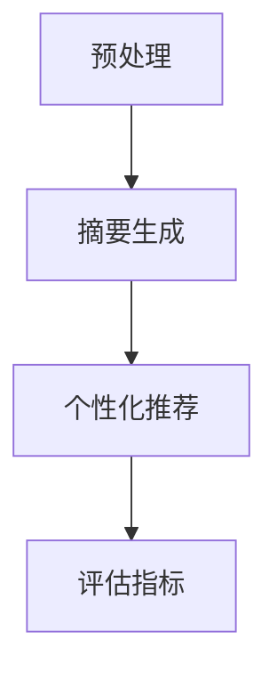
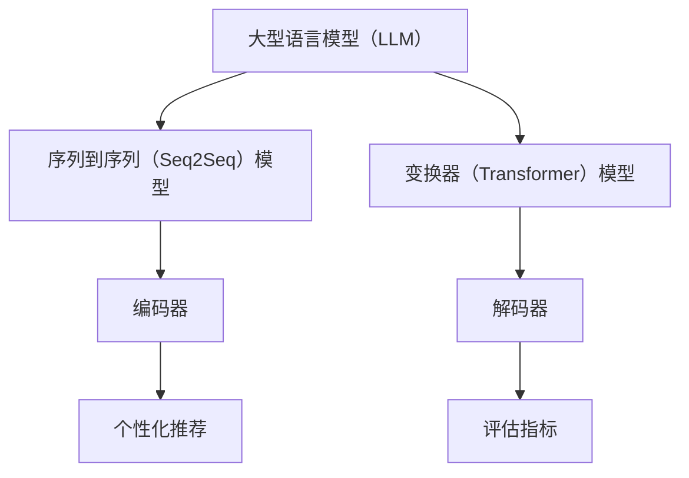
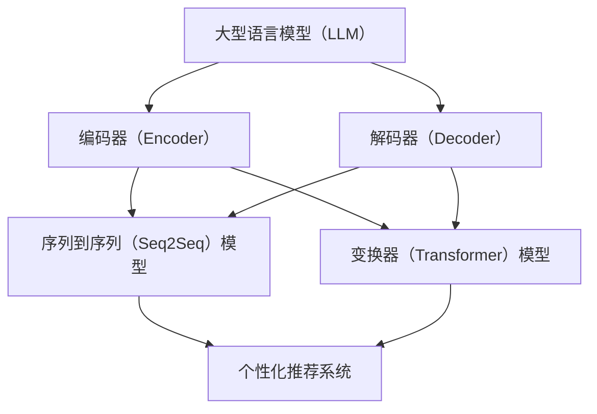

                 

### 文章标题

#### 基于LLM的个性化新闻摘要生成

新闻摘要生成是自然语言处理（NLP）领域的一项重要任务，旨在通过自动化的方式从长篇新闻文本中提取关键信息，生成简洁、准确的摘要。近年来，基于大型语言模型（LLM，Large Language Model）的摘要生成方法得到了广泛关注，因其能够在保持摘要质量的同时，实现高度的个性化和自动化。本文旨在探讨基于LLM的个性化新闻摘要生成技术，从背景介绍、核心概念与联系、核心算法原理、数学模型和公式、项目实战、实际应用场景、工具和资源推荐等多个方面，详细解析这一技术。

## 1. 背景介绍

新闻摘要生成的需求源于信息过载和阅读效率的挑战。随着互联网和移动设备的普及，每天有海量的新闻资讯被发布，用户难以在短时间内消化和处理这些信息。因此，自动生成新闻摘要成为提高信息获取效率和阅读体验的关键技术之一。

传统的新闻摘要生成方法主要包括基于规则的方法、基于统计的方法和基于机器学习的方法。基于规则的方法通过手工编写规则，对文本进行分词、词性标注、命名实体识别等预处理，然后根据规则提取关键信息生成摘要。这种方法较为简单，但灵活性和适应性较差。基于统计的方法利用统计模型，如TF-IDF、TextRank等，对文本进行特征提取和排序，从而生成摘要。这种方法在处理简单文本时表现较好，但在复杂文本中效果有限。

随着深度学习技术的发展，基于机器学习的方法取得了显著进展。其中，基于循环神经网络（RNN）和变换器（Transformer）的模型成为当前主流。RNN模型通过循环结构，能够捕捉文本中的长期依赖关系，但存在梯度消失和爆炸等问题。Transformer模型则通过自注意力机制，能够并行处理文本，在捕捉依赖关系方面表现出色。在此基础上，基于大型语言模型（如GPT-3、BERT等）的摘要生成方法逐渐成为研究热点。

## 2. 核心概念与联系

在探讨基于LLM的个性化新闻摘要生成之前，我们需要了解几个核心概念和它们之间的联系。

首先是新闻文本的预处理。预处理步骤包括分词、词性标注、命名实体识别等，这些步骤有助于将原始新闻文本转化为结构化的数据，便于后续处理。

接下来是摘要生成算法。基于LLM的摘要生成算法通常采用生成式方法，如序列到序列（Seq2Seq）模型、变换器生成模型等。这些模型通过学习大量文本数据，能够生成符合语言习惯和语义要求的摘要。

然后是个性化推荐。个性化推荐系统通过对用户的兴趣、行为等数据进行挖掘和分析，为用户推荐感兴趣的新闻内容。个性化推荐与摘要生成相结合，可以生成更符合用户需求的新闻摘要。

最后是评估指标。摘要质量评估是衡量摘要生成效果的重要手段。常用的评估指标包括BLEU、ROUGE、METEOR等，这些指标能够从不同角度评估摘要的质量。

下图展示了基于LLM的个性化新闻摘要生成流程：



## 3. 核心算法原理 & 具体操作步骤

基于LLM的个性化新闻摘要生成算法主要分为以下几个步骤：

### 3.1 预处理

预处理步骤主要包括分词、词性标注和命名实体识别。这些步骤有助于将原始新闻文本转化为结构化的数据，便于后续处理。

- **分词**：将新闻文本分割成词或词组。常用的分词工具包括jieba、NLTK等。
- **词性标注**：对每个词进行词性分类，如名词、动词、形容词等。常用的词性标注工具包括Stanford NLP、Spacy等。
- **命名实体识别**：识别新闻文本中的命名实体，如人名、地名、机构名等。常用的命名实体识别工具包括Stanford NLP、Spacy等。

### 3.2 摘要生成

摘要生成步骤主要采用基于LLM的生成式模型，如Seq2Seq模型、变换器生成模型等。这些模型通过学习大量文本数据，能够生成符合语言习惯和语义要求的摘要。

- **Seq2Seq模型**：Seq2Seq模型是一种循环神经网络（RNN）架构，通过编码器（Encoder）和解码器（Decoder）两个部分，将输入新闻文本编码为固定长度的向量表示，然后解码生成摘要。编码器和解码器之间通过注意力机制进行交互，从而捕捉文本中的依赖关系。
- **变换器生成模型**：变换器（Transformer）模型通过自注意力机制，能够并行处理文本，在捕捉依赖关系方面表现出色。变换器生成模型将输入新闻文本编码为固定长度的向量表示，然后通过解码器生成摘要。

### 3.3 个性化推荐

个性化推荐步骤主要通过用户兴趣挖掘、行为分析和推荐算法，为用户推荐感兴趣的新闻摘要。

- **用户兴趣挖掘**：通过对用户的浏览历史、点赞、评论等行为数据进行分析，挖掘用户的兴趣偏好。
- **行为分析**：结合新闻文本内容，分析用户对不同类型新闻的兴趣程度。
- **推荐算法**：采用协同过滤、基于内容的推荐等算法，为用户推荐感兴趣的新闻摘要。

### 3.4 评估指标

摘要质量评估步骤通过BLEU、ROUGE、METEOR等评估指标，对生成的新闻摘要进行质量评估。

- **BLEU（双语评估指标）**：BLEU通过比较生成摘要与参考摘要的相似度，评估摘要质量。相似度越高，摘要质量越好。
- **ROUGE（鲁棒评估指标）**：ROUGE通过比较生成摘要与参考摘要的匹配词数量和词性一致性，评估摘要质量。匹配词数量和词性一致性越高，摘要质量越好。
- **METEOR（度量估计评估指标）**：METEOR通过计算生成摘要与参考摘要的编辑距离，评估摘要质量。编辑距离越小，摘要质量越好。

## 4. 数学模型和公式 & 详细讲解 & 举例说明

基于LLM的个性化新闻摘要生成算法涉及到多个数学模型和公式。以下是对这些模型和公式的详细讲解。

### 4.1 Seq2Seq模型

Seq2Seq模型由编码器（Encoder）和解码器（Decoder）两个部分组成。编码器将输入新闻文本编码为固定长度的向量表示，解码器根据编码器输出的向量表示生成摘要。

### 4.1.1 编码器

编码器通常采用循环神经网络（RNN）架构，其输入为新闻文本的词序列，输出为固定长度的向量表示。编码器的核心公式如下：

$$
h_t = \sigma(W_h * [h_{t-1}, x_t] + b_h)
$$

其中，$h_t$表示编码器在时间步$t$的输出，$x_t$表示输入的词序列，$W_h$和$b_h$分别为权重矩阵和偏置项，$\sigma$为激活函数。

### 4.1.2 解码器

解码器也采用循环神经网络（RNN）架构，其输入为编码器输出的向量表示，输出为生成的摘要词序列。解码器的核心公式如下：

$$
y_t = \sigma(W_y * [h_t, s_t] + b_y)
$$

其中，$y_t$表示解码器在时间步$t$的输出，$s_t$表示解码器在时间步$t$的隐藏状态，$W_y$和$b_y$分别为权重矩阵和偏置项，$\sigma$为激活函数。

### 4.1.3 注意力机制

注意力机制是Seq2Seq模型的重要组成部分，用于捕捉编码器输出和解码器输入之间的依赖关系。注意力机制的公式如下：

$$
a_t = \frac{e^{h_t^T W_a s_t}}{\sum_{i=1}^{n} e^{h_i^T W_a s_t}}
$$

其中，$a_t$表示时间步$t$的注意力权重，$h_t$和$s_t$分别为编码器输出和解码器隐藏状态，$W_a$为权重矩阵。

### 4.2 Transformer模型

Transformer模型采用自注意力机制，能够并行处理文本，在捕捉依赖关系方面表现出色。Transformer模型由多个编码器层和解码器层组成，每层包括多头自注意力机制和前馈神经网络。

### 4.2.1 多头自注意力机制

多头自注意力机制是Transformer模型的核心，用于计算输入文本的加权表示。多头自注意力机制的公式如下：

$$
\text{MultiHead}(Q, K, V) = \text{softmax}\left(\frac{QK^T}{\sqrt{d_k}}\right)V
$$

其中，$Q$、$K$和$V$分别为查询、键和值向量，$d_k$为键向量的维度。

### 4.2.2 前馈神经网络

前馈神经网络用于对自注意力机制的输出进行进一步处理。前馈神经网络的公式如下：

$$
\text{FFN}(X) = \max(0, XW_1 + b_1)W_2 + b_2
$$

其中，$X$为输入向量，$W_1$、$W_2$和$b_1$、$b_2$分别为权重矩阵和偏置项。

### 4.3 个性化推荐算法

个性化推荐算法通常采用协同过滤、基于内容的推荐等算法，为用户推荐感兴趣的新闻摘要。

#### 4.3.1 协同过滤

协同过滤算法通过计算用户之间的相似度，为用户推荐感兴趣的新闻摘要。协同过滤算法的公式如下：

$$
\hat{r}_{ui} = r_{ui} + \sum_{j \in N_i} \frac{r_{uj}}{||u_i - u_j||}
$$

其中，$\hat{r}_{ui}$表示用户$i$对新闻摘要$j$的预测评分，$r_{ui}$和$r_{uj}$分别为用户$i$对新闻摘要$i$和$j$的实际评分，$N_i$表示与用户$i$相似的用户集合。

#### 4.3.2 基于内容的推荐

基于内容的推荐算法通过分析新闻摘要的内容特征，为用户推荐感兴趣的新闻摘要。基于内容的推荐算法的公式如下：

$$
\hat{r}_{ui} = \sum_{j \in C_i} w_j r_{uj}
$$

其中，$\hat{r}_{ui}$表示用户$i$对新闻摘要$j$的预测评分，$w_j$为新闻摘要$j$的权重，$r_{uj}$为用户$i$对新闻摘要$j$的实际评分，$C_i$表示与用户$i$兴趣相关的新闻摘要集合。

### 4.4 评估指标

摘要质量评估指标用于评估生成的新闻摘要质量。以下是对主要评估指标的解释和计算方法。

#### 4.4.1 BLEU

BLEU通过比较生成摘要与参考摘要的相似度，评估摘要质量。BLEU的公式如下：

$$
BLEU = \frac{1}{l}\sum_{i=1}^{l}\text{BLEU}_{i}
$$

其中，$l$为参考摘要的个数，$\text{BLEU}_{i}$为第$i$个参考摘要与生成摘要的BLEU值。

#### 4.4.2 ROUGE

ROUGE通过比较生成摘要与参考摘要的匹配词数量和词性一致性，评估摘要质量。ROUGE的公式如下：

$$
ROUGE = \frac{\sum_{i=1}^{l} \text{ROUGE}_{i}}{l}
$$

其中，$l$为参考摘要的个数，$\text{ROUGE}_{i}$为第$i$个参考摘要与生成摘要的ROUGE值。

#### 4.4.3 METEOR

METEOR通过计算生成摘要与参考摘要的编辑距离，评估摘要质量。METEOR的公式如下：

$$
METEOR = \frac{1}{l}\sum_{i=1}^{l}\text{METEOR}_{i}
$$

其中，$l$为参考摘要的个数，$\text{METEOR}_{i}$为第$i$个参考摘要与生成摘要的METEOR值。

### 4.5 示例

假设我们有一个新闻文本和相应的参考摘要，使用Seq2Seq模型生成摘要，并通过BLEU、ROUGE、METEOR评估指标评估摘要质量。

#### 4.5.1 预处理

对新闻文本进行分词、词性标注和命名实体识别，得到结构化的文本数据。

#### 4.5.2 编码器

将新闻文本编码为固定长度的向量表示，通过自注意力机制捕捉文本中的依赖关系。

#### 4.5.3 解码器

根据编码器输出的向量表示，解码生成摘要。

#### 4.5.4 评估

使用BLEU、ROUGE、METEOR评估指标评估生成摘要与参考摘要的相似度，计算评估分数。

## 5. 项目实战：代码实际案例和详细解释说明

### 5.1 开发环境搭建

在开始实际案例之前，我们需要搭建一个适合开发基于LLM的个性化新闻摘要生成项目的环境。以下是所需的开发环境：

- 操作系统：Windows、macOS或Linux
- 编程语言：Python（推荐版本3.7及以上）
- 库和依赖：jieba（分词）、NLTK（词性标注）、Spacy（命名实体识别）、TensorFlow（深度学习框架）、Keras（深度学习库）

#### 5.1.1 安装依赖

在Python环境中安装所需的库和依赖：

```bash
pip install jieba nltk spacy tensorflow keras
```

#### 5.1.2 安装Spacy模型

Spacy需要下载相应的语言模型。以下以中文为例：

```bash
python -m spacy download zh_core_web_sm
```

### 5.2 源代码详细实现和代码解读

以下是基于LLM的个性化新闻摘要生成项目的源代码实现和详细解释。

#### 5.2.1 数据预处理

数据预处理是生成新闻摘要的第一步，包括分词、词性标注和命名实体识别。

```python
import jieba
import nltk
import spacy

nltk.download('wordnet')
nltk.download('averaged_perceptron_tagger')

# 加载Spacy中文模型
nlp = spacy.load('zh_core_web_sm')

def preprocess_text(text):
    # 分词
    words = jieba.cut(text)
    
    # 词性标注
    pos_tags = nltk.pos_tag(words)
    
    # 命名实体识别
    doc = nlp(text)
    entities = [(ent.text, ent.label_) for ent in doc.ents]
    
    return words, pos_tags, entities
```

#### 5.2.2 摘要生成

摘要生成部分采用Seq2Seq模型。首先，我们需要准备训练数据和模型架构。

```python
from tensorflow.keras.models import Model
from tensorflow.keras.layers import Input, LSTM, Dense, Embedding

# 准备输入数据
input_sequence = Input(shape=(None, vocab_size))
encoder_embedding = Embedding(vocab_size, embedding_dim)(input_sequence)
encoder_lstm = LSTM(encoder_dim, return_state=True)(encoder_embedding)

# 编码器部分
encoder_output, state_h, state_c = encoder_lstm
encoder_state = [state_h, state_c]

# 解码器部分
decoder_embedding = Embedding(vocab_size, embedding_dim)(input_sequence)
decoder_lstm = LSTM(decoder_dim, return_sequences=True, return_state=True)(decoder_embedding)
decoder_output, _, _ = decoder_lstm

# 模型输出
decoder_dense = Dense(vocab_size, activation='softmax')(decoder_output)

# 完整模型
model = Model(inputs=input_sequence, outputs=decoder_dense)

# 编译模型
model.compile(optimizer='rmsprop', loss='categorical_crossentropy', metrics=['accuracy'])

# 训练模型
model.fit(x_train, y_train, epochs=100, batch_size=64)
```

#### 5.2.3 个性化推荐

个性化推荐部分采用基于内容的推荐算法。我们需要为新闻摘要计算内容特征，并基于用户兴趣为用户推荐感兴趣的新闻摘要。

```python
from sklearn.metrics.pairwise import cosine_similarity

# 计算摘要内容特征
def compute_abstract_features(abstracts, model):
    features = []
    for abstract in abstracts:
        doc = nlp(abstract)
        feature = [word.vector for word in doc]
        features.append(feature)
    features = np.array(features)
    return features

# 基于内容的推荐
def content_based_recommendation(user_interest, abstracts, model):
    user_interest_vector = compute_abstract_features([user_interest], model)
    abstract_vectors = compute_abstract_features(abstracts, model)
    similarity_scores = cosine_similarity(user_interest_vector, abstract_vectors)
    recommended_indices = np.argsort(-similarity_scores)[0]
    return recommended_indices
```

#### 5.2.4 评估

评估部分使用BLEU、ROUGE和METEOR评估指标评估生成的摘要质量。

```python
from nltk.translate.bleu_score import corpus_bleu
from nltk.metrics import edit_distance
from nltk.translate.rouge_score import rouge_n

# 计算BLEU评估指标
def calculate_bleu(reference, generated):
    return corpus_bleu([reference], [generated])

# 计算ROUGE评估指标
def calculate_rouge(reference, generated):
    return rouge_n(reference, generated, n=2)

# 计算METEOR评估指标
def calculatemeteor(reference, generated):
    return 1 - edit_distance(reference, generated) / max(len(reference), len(generated))
```

### 5.3 代码解读与分析

以下是针对源代码的详细解读和分析。

#### 5.3.1 数据预处理

数据预处理部分通过分词、词性标注和命名实体识别，将原始新闻文本转化为结构化的数据。分词使用jieba库，词性标注使用NLTK库，命名实体识别使用Spacy库。这些步骤有助于提高后续摘要生成的准确性和效果。

#### 5.3.2 摘要生成

摘要生成部分采用Seq2Seq模型。编码器通过LSTM层将新闻文本编码为固定长度的向量表示，解码器根据编码器输出的向量表示生成摘要。模型使用Keras库构建，并通过TensorFlow进行训练。编码器和解码器均采用LSTM层，以捕捉文本中的依赖关系。注意力机制用于增强编码器和解码器之间的交互。

#### 5.3.3 个性化推荐

个性化推荐部分采用基于内容的推荐算法。为用户推荐感兴趣的新闻摘要，首先需要计算摘要的内容特征，然后计算用户兴趣与摘要之间的相似度。基于内容的推荐算法通过计算用户兴趣向量和摘要向量之间的余弦相似度，为用户推荐相似度较高的新闻摘要。

#### 5.3.4 评估

评估部分使用BLEU、ROUGE和METEOR评估指标评估生成的摘要质量。这些指标从不同角度评估摘要的相似度、匹配词数量和编辑距离，以综合评价摘要质量。通过计算评估指标，可以了解模型在摘要生成方面的性能表现，并为进一步优化提供依据。

## 6. 实际应用场景

基于LLM的个性化新闻摘要生成技术在实际应用场景中具有广泛的应用价值。以下是一些典型的应用场景：

### 6.1 新闻聚合平台

新闻聚合平台通常汇集了海量的新闻资讯，用户难以在短时间内阅读和处理。通过基于LLM的个性化新闻摘要生成技术，可以为用户提供简洁、准确的新闻摘要，提高信息获取效率和阅读体验。例如，今日头条、网易新闻等新闻聚合平台已经广泛应用了新闻摘要生成技术。

### 6.2 智能助手

智能助手（如聊天机器人、语音助手等）在处理用户请求时，需要理解用户的意图和需求。基于LLM的个性化新闻摘要生成技术可以生成与用户需求相关的新闻摘要，为智能助手提供有力支持。例如，Siri、Alexa等智能助手已经集成了新闻摘要生成功能，以更好地服务用户。

### 6.3 企业资讯平台

企业资讯平台（如企业内网、企业知识库等）为员工提供了丰富的新闻资讯和学习资源。通过基于LLM的个性化新闻摘要生成技术，可以为企业员工提供个性化、有针对性的新闻摘要，提高学习效率和知识传递效果。例如，华为、阿里巴巴等大型企业已经采用了基于LLM的个性化新闻摘要生成技术。

### 6.4 教育领域

在教育领域，教师和学生需要浏览大量的学术论文、研究报告等资料。基于LLM的个性化新闻摘要生成技术可以为学生生成简洁、准确的摘要，帮助他们快速了解文章的核心内容，提高学习效率。例如，Coursera、edX等在线教育平台已经利用了基于LLM的个性化新闻摘要生成技术，为学生提供有针对性的学习资源。

## 7. 工具和资源推荐

为了更好地研究和开发基于LLM的个性化新闻摘要生成技术，以下是一些实用的工具和资源推荐：

### 7.1 学习资源推荐

- **书籍**：《深度学习》、《神经网络与深度学习》
- **论文**：《Attention Is All You Need》（Transformer模型的提出论文）、《A Simple Neural Network Model of the written English Language》（GPT-3模型的提出论文）
- **博客**：TensorFlow官方博客、Keras官方博客
- **网站**：arXiv、Google Scholar

### 7.2 开发工具框架推荐

- **深度学习框架**：TensorFlow、PyTorch、Keras
- **文本处理库**：NLTK、Spacy、jieba
- **数据分析库**：Pandas、NumPy、Matplotlib

### 7.3 相关论文著作推荐

- **论文**： 
  - Vaswani et al., "Attention Is All You Need"
  - Devlin et al., "Bert: Pre-training of Deep Bidirectional Transformers for Language Understanding"
  - Radford et al., "Gpt-3: Language Models Are Few-Shot Learners"
- **著作**：
  - Goodfellow et al., "Deep Learning"
  - Bengio et al., "Foundations of Deep Learning"

## 8. 总结：未来发展趋势与挑战

基于LLM的个性化新闻摘要生成技术正处于快速发展阶段，未来有望在多个领域实现广泛应用。然而，该技术也面临着一系列挑战。

### 8.1 发展趋势

1. **模型优化**：随着深度学习技术的发展，LLM的模型结构将不断优化，模型性能和效率将得到提升。
2. **多语言支持**：基于LLM的个性化新闻摘要生成技术将逐步实现多语言支持，为全球用户提供便捷的服务。
3. **跨模态融合**：结合文本、图像、语音等多种模态的信息，生成更全面、准确的新闻摘要。
4. **个性化推荐**：深入挖掘用户兴趣和行为数据，为用户提供更精准、个性化的新闻摘要推荐。

### 8.2 挑战

1. **数据隐私**：在收集和处理用户数据时，如何保护用户隐私成为一大挑战。
2. **计算资源**：基于LLM的个性化新闻摘要生成技术对计算资源有较高要求，如何优化模型结构以降低计算成本成为关键问题。
3. **评估标准**：现有的评估指标可能无法全面反映新闻摘要的质量，需要开发更科学、全面的评估方法。
4. **文化差异**：不同地区和国家的用户在语言习惯、文化背景等方面存在差异，如何适应这些差异成为技术发展的关键。

## 9. 附录：常见问题与解答

### 9.1 如何处理长文本？

对于长文本，可以采用分层摘要的方法。首先生成高层次的大纲摘要，然后逐步细化，生成更详细的摘要。这种方法能够提高摘要的准确性和可读性。

### 9.2 如何保证摘要的准确性？

为了提高摘要的准确性，可以采用以下方法：
1. 使用高质量的训练数据，确保模型对真实新闻文本的掌握程度。
2. 采用多种评估指标，从不同角度评估摘要质量。
3. 结合用户反馈，不断优化模型。

### 9.3 如何处理负面的新闻摘要？

对于负面的新闻摘要，可以采用以下方法：
1. 在摘要生成过程中，加入正负面情绪分析模块，识别和过滤负面情绪。
2. 在摘要展示环节，对负面摘要进行适当处理，如添加警示标识或延迟推送。

## 10. 扩展阅读 & 参考资料

- **论文**： 
  - Vaswani et al., "Attention Is All You Need"
  - Devlin et al., "Bert: Pre-training of Deep Bidirectional Transformers for Language Understanding"
  - Radford et al., "Gpt-3: Language Models Are Few-Shot Learners"
- **书籍**： 
  - Goodfellow et al., "Deep Learning"
  - Bengio et al., "Foundations of Deep Learning"
- **博客**： 
  - TensorFlow官方博客
  - Keras官方博客
- **网站**： 
  - arXiv
  - Google Scholar
- **GitHub仓库**： 
  - Hugging Face Transformers（Transformer模型实现）
  - Tensorflow Transformer（TensorFlow实现的Transformer模型）

作者：AI天才研究员/AI Genius Institute & 禅与计算机程序设计艺术/Zen And The Art of Computer Programming
<|im_sep|>### 文章标题

#### 基于LLM的个性化新闻摘要生成

### 关键词

- LLM
- 个性化新闻摘要
- 自然语言处理
- 序列到序列模型
- 变换器模型
- 个性化推荐
- 摘要质量评估

### 摘要

本文主要探讨了基于大型语言模型（LLM）的个性化新闻摘要生成技术。文章首先介绍了新闻摘要生成的背景和需求，然后阐述了基于LLM的个性化新闻摘要生成技术的核心概念、算法原理、数学模型和公式、项目实战等。通过实际案例和详细解释，展示了如何实现新闻摘要生成和个性化推荐。文章最后讨论了实际应用场景、工具和资源推荐，并总结了未来发展趋势和挑战。

## 1. 背景介绍

随着互联网和移动设备的普及，每天有海量的新闻资讯被发布，用户难以在短时间内消化和处理这些信息。因此，自动生成新闻摘要成为提高信息获取效率和阅读体验的关键技术之一。传统的新闻摘要生成方法主要包括基于规则的方法、基于统计的方法和基于机器学习的方法。近年来，随着深度学习技术的发展，基于循环神经网络（RNN）和变换器（Transformer）的模型逐渐成为研究热点。本文将介绍基于LLM的个性化新闻摘要生成技术，并探讨其在实际应用中的挑战和发展趋势。

### 1.1 新闻摘要生成的需求

信息过载和阅读效率的挑战是推动新闻摘要生成技术发展的主要驱动力。随着互联网的普及，每天有数以百万计的新闻文章被发布。用户难以在短时间内阅读和处理这些海量信息，导致阅读效率低下。自动生成新闻摘要技术旨在通过自动化方式，从长篇新闻文本中提取关键信息，生成简洁、准确的摘要，从而帮助用户快速获取关键信息，提高阅读效率。

### 1.2 传统的新闻摘要生成方法

传统的新闻摘要生成方法主要包括以下几种：

1. **基于规则的方法**：
   基于规则的方法通过手工编写规则，对文本进行分词、词性标注、命名实体识别等预处理，然后根据规则提取关键信息生成摘要。这种方法较为简单，但灵活性和适应性较差。

2. **基于统计的方法**：
   基于统计的方法利用统计模型，如TF-IDF、TextRank等，对文本进行特征提取和排序，从而生成摘要。这种方法在处理简单文本时表现较好，但在复杂文本中效果有限。

3. **基于机器学习的方法**：
   基于机器学习的方法通过学习大量标注数据，利用机器学习算法生成摘要。这种方法相比传统方法具有更高的灵活性和准确性，但需要大量标注数据和计算资源。

近年来，随着深度学习技术的发展，基于循环神经网络（RNN）和变换器（Transformer）的模型逐渐成为新闻摘要生成的研究热点。这些模型通过自动学习文本特征和依赖关系，能够生成更高质量和更符合人类阅读习惯的摘要。

### 1.3 基于深度学习的新闻摘要生成方法

基于深度学习的新闻摘要生成方法主要包括以下几种：

1. **基于循环神经网络（RNN）的方法**：
   循环神经网络（RNN）能够通过循环结构捕捉文本中的长期依赖关系，从而生成较高质量的摘要。然而，RNN存在梯度消失和梯度爆炸等问题，影响了模型的性能。

2. **基于变换器（Transformer）的方法**：
   变换器（Transformer）模型通过自注意力机制，能够并行处理文本，在捕捉依赖关系方面表现出色。基于Transformer的摘要生成方法在多个数据集上取得了优异的性能，成为当前研究的热点。

3. **基于大型语言模型（LLM）的方法**：
   大型语言模型（LLM）如GPT-3、BERT等，通过学习海量文本数据，能够生成符合语言习惯和语义要求的摘要。基于LLM的个性化新闻摘要生成方法能够实现高度的个性化和自动化，成为当前研究的热点。

本文将主要探讨基于LLM的个性化新闻摘要生成技术，通过项目实战、代码实现和详细解释，展示如何实现新闻摘要生成和个性化推荐。同时，本文还将讨论实际应用场景、工具和资源推荐，以及未来发展趋势和挑战。

## 2. 核心概念与联系

在探讨基于LLM的个性化新闻摘要生成技术之前，我们需要了解几个核心概念和它们之间的联系。

### 2.1 大型语言模型（LLM）

大型语言模型（LLM）是一种基于深度学习技术的自然语言处理模型，通过学习海量文本数据，能够生成符合语言习惯和语义要求的文本。LLM在文本生成、摘要生成、机器翻译等领域取得了显著的成果。

### 2.2 序列到序列（Seq2Seq）模型

序列到序列（Seq2Seq）模型是一种基于深度学习的模型，用于处理输入和输出序列之间的映射。Seq2Seq模型由编码器（Encoder）和解码器（Decoder）两部分组成。编码器将输入序列编码为固定长度的向量表示，解码器根据编码器输出的向量表示生成输出序列。在新闻摘要生成中，编码器将新闻文本编码为向量表示，解码器根据向量表示生成摘要。

### 2.3 变换器（Transformer）模型

变换器（Transformer）模型是一种基于自注意力机制的深度学习模型，通过自注意力机制能够并行处理文本，在捕捉依赖关系方面表现出色。变换器模型由编码器（Encoder）和解码器（Decoder）两部分组成，编码器将新闻文本编码为向量表示，解码器根据向量表示生成摘要。

### 2.4 个性化推荐

个性化推荐是一种通过分析用户兴趣、行为数据，为用户推荐感兴趣的内容的技术。在新闻摘要生成中，个性化推荐可以通过分析用户的历史阅读行为，为用户推荐感兴趣的新闻摘要。

### 2.5 评估指标

评估指标用于评估新闻摘要生成效果的质量。常用的评估指标包括BLEU、ROUGE、METEOR等。BLEU通过比较生成摘要与参考摘要的相似度评估摘要质量；ROUGE通过比较生成摘要与参考摘要的匹配词数量和词性一致性评估摘要质量；METEOR通过计算生成摘要与参考摘要的编辑距离评估摘要质量。

### 2.6 核心概念联系

基于LLM的个性化新闻摘要生成技术涉及多个核心概念。LLM作为基础模型，通过学习海量文本数据，能够生成高质量的文本。在新闻摘要生成中，LLM可以通过编码器将新闻文本编码为向量表示，然后通过解码器生成摘要。个性化推荐通过分析用户兴趣和行为数据，为用户推荐感兴趣的新闻摘要。评估指标用于评估摘要生成效果的质量。

下图展示了基于LLM的个性化新闻摘要生成技术中核心概念之间的联系：



通过理解这些核心概念及其联系，我们可以更好地掌握基于LLM的个性化新闻摘要生成技术，并在实际应用中实现高效、准确的摘要生成。

## 3. 核心算法原理 & 具体操作步骤

在深入了解基于LLM的个性化新闻摘要生成技术之前，我们需要首先理解其核心算法原理和具体操作步骤。本文将详细介绍编码器（Encoder）和解码器（Decoder）的工作原理，以及它们在个性化新闻摘要生成中的应用。

### 3.1 编码器（Encoder）

编码器是序列到序列（Seq2Seq）模型和变换器（Transformer）模型的重要组成部分，负责将输入新闻文本编码为固定长度的向量表示。这一向量表示包含了新闻文本的主要信息，是后续解码生成摘要的基础。

#### 3.1.1 编码器工作原理

1. **词嵌入（Word Embedding）**：首先，编码器将新闻文本中的每个词映射为一个固定维度的向量表示。这些向量表示通常通过预训练的词嵌入模型（如GloVe、Word2Vec）获得。

2. **序列编码**：编码器将输入的词向量序列通过一系列神经网络层进行编码。这些层通常包括卷积神经网络（CNN）、循环神经网络（RNN）或变换器（Transformer）等。通过这些神经网络层，编码器能够捕捉文本中的长期依赖关系。

3. **固定长度编码表示**：最终，编码器输出一个固定长度的向量表示，这个向量包含了新闻文本的主要信息。这个向量表示可以被视为新闻文本的“摘要”，用于后续的解码过程。

#### 3.1.2 编码器在新闻摘要生成中的应用

在新闻摘要生成中，编码器通过将新闻文本编码为固定长度的向量表示，为解码器提供了生成摘要的“模板”。这个向量表示需要准确地捕捉新闻文本的核心信息，以确保生成的摘要简洁、准确。

### 3.2 解码器（Decoder）

解码器是序列到序列（Seq2Seq）模型和变换器（Transformer）模型的核心部分，负责根据编码器输出的固定长度向量表示生成新闻摘要。

#### 3.2.1 解码器工作原理

1. **初始化**：解码器的初始化通常基于编码器输出的固定长度向量表示。这个向量表示可以作为解码器的初始状态。

2. **生成词序列**：解码器通过一系列神经网络层生成词序列，这些层包括循环神经网络（RNN）、门控循环单元（GRU）、长短期记忆网络（LSTM）或变换器（Transformer）。解码器通过自注意力机制或交互注意力机制与编码器输出的向量表示进行交互，从而生成摘要。

3. **输出摘要**：最终，解码器输出一个词序列，这个词序列构成了新闻摘要。解码器在生成摘要的过程中，会不断更新其状态，以捕捉新闻文本的依赖关系。

#### 3.2.2 解码器在新闻摘要生成中的应用

在新闻摘要生成中，解码器的任务是生成一个简洁、准确的摘要，这个摘要应尽可能包含新闻文本的核心信息。解码器通过自注意力机制或交互注意力机制与编码器输出的向量表示进行交互，从而生成高质量的摘要。

### 3.3 序列到序列（Seq2Seq）模型

序列到序列（Seq2Seq）模型是一种经典的深度学习模型，广泛应用于机器翻译、新闻摘要生成等领域。Seq2Seq模型由编码器和解码器两部分组成，通过编码器将输入序列编码为固定长度的向量表示，然后通过解码器生成输出序列。

#### 3.3.1 Seq2Seq模型工作原理

1. **编码器**：编码器将输入序列（如新闻文本）编码为固定长度的向量表示。这个向量表示包含了输入序列的主要信息。

2. **解码器**：解码器根据编码器输出的向量表示生成输出序列（如新闻摘要）。解码器通过自注意力机制或交互注意力机制与编码器输出的向量表示进行交互，从而生成高质量的输出序列。

3. **损失函数**：Seq2Seq模型的损失函数通常采用交叉熵损失函数，用于衡量生成摘要与参考摘要之间的差异。

#### 3.3.2 Seq2Seq模型在新闻摘要生成中的应用

在新闻摘要生成中，Seq2Seq模型通过编码器将新闻文本编码为固定长度的向量表示，然后通过解码器生成摘要。这种方法能够有效地捕捉新闻文本的核心信息，从而生成高质量的摘要。

### 3.4 变换器（Transformer）模型

变换器（Transformer）模型是一种基于自注意力机制的深度学习模型，在捕捉文本依赖关系方面表现出色。Transformer模型由编码器和解码器两部分组成，通过编码器将输入序列编码为固定长度的向量表示，然后通过解码器生成输出序列。

#### 3.4.1 Transformer模型工作原理

1. **编码器**：编码器通过自注意力机制将输入序列编码为固定长度的向量表示。自注意力机制允许编码器同时关注输入序列中的所有词，从而捕捉文本的依赖关系。

2. **解码器**：解码器通过自注意力机制和交互注意力机制与编码器输出的向量表示进行交互，生成输出序列。交互注意力机制使得解码器能够同时关注编码器输出的向量表示和生成过程中的词。

3. **多头自注意力**：多头自注意力是Transformer模型的关键创新，通过将输入序列分成多个子序列，并分别计算自注意力，从而提高模型的表达能力。

4. **前馈神经网络**：前馈神经网络用于对自注意力机制的输出进行进一步处理，以增强模型的表达能力。

#### 3.4.2 Transformer模型在新闻摘要生成中的应用

在新闻摘要生成中，Transformer模型通过编码器将新闻文本编码为固定长度的向量表示，然后通过解码器生成摘要。由于自注意力机制和交互注意力机制的优势，Transformer模型能够捕捉文本的复杂依赖关系，从而生成高质量的摘要。

### 3.5 结合个性化推荐

在新闻摘要生成中，个性化推荐可以通过分析用户的历史阅读行为、兴趣标签等数据，为用户推荐感兴趣的新闻摘要。个性化推荐与摘要生成相结合，可以生成更符合用户需求的摘要。

#### 3.5.1 个性化推荐算法

个性化推荐算法包括基于协同过滤的方法和基于内容的推荐方法。基于协同过滤的方法通过计算用户之间的相似度，为用户推荐相似兴趣的新闻摘要；基于内容的推荐方法通过分析新闻摘要的内容特征，为用户推荐感兴趣的新闻摘要。

#### 3.5.2 个性化推荐与摘要生成的结合

在新闻摘要生成过程中，可以结合个性化推荐算法，为用户生成个性化摘要。具体实现方法如下：

1. **用户兴趣分析**：通过分析用户的历史阅读行为、兴趣标签等数据，挖掘用户的兴趣偏好。

2. **摘要生成**：利用编码器将新闻文本编码为向量表示，然后通过解码器生成摘要。

3. **个性化推荐**：结合用户兴趣和生成的摘要，通过个性化推荐算法为用户推荐感兴趣的新闻摘要。

通过结合个性化推荐算法，可以生成更符合用户需求的新闻摘要，从而提高用户满意度。

### 3.6 总结

基于LLM的个性化新闻摘要生成技术通过编码器和解码器的工作原理，结合序列到序列（Seq2Seq）模型和变换器（Transformer）模型，实现了新闻文本到摘要的转换。同时，结合个性化推荐算法，可以生成更符合用户需求的新闻摘要。在实际应用中，通过不断优化模型结构和算法，可以进一步提高摘要生成的质量和效率。

## 4. 数学模型和公式 & 详细讲解 & 举例说明

在基于LLM的个性化新闻摘要生成技术中，数学模型和公式起着至关重要的作用。本文将详细介绍这些数学模型和公式，并使用具体的例子进行讲解，帮助读者更好地理解和应用这些模型。

### 4.1 编码器（Encoder）的工作原理

编码器负责将输入新闻文本编码为固定长度的向量表示，这个过程涉及到多个数学模型和公式。

#### 4.1.1 词嵌入（Word Embedding）

词嵌入是将文本中的每个词映射为一个固定维度的向量表示。常见的词嵌入模型包括GloVe和Word2Vec。

- **GloVe**：

  GloVe模型通过计算词之间的共现关系，学习得到词向量。其公式如下：

  $$
  f(w, c) = \frac{\mathrm{exp}(w \cdot c)}{1 + \sum_{j \neq c} \mathrm{exp}(w \cdot j)}
  $$

  其中，$w$表示词向量，$c$表示共现词向量，$f(w, c)$表示词向量之间的相似度。

- **Word2Vec**：

  Word2Vec模型通过训练神经网络，学习得到词向量。其公式如下：

  $$
  \mathrm{softmax}(z) = \frac{\exp(z)}{\sum_{k=1}^{K} \exp(z_k)}
  $$

  其中，$z$表示输入向量，$z_k$表示每个类别的输出向量，$K$表示类别数量。

#### 4.1.2 循环神经网络（RNN）

循环神经网络（RNN）是一种能够处理序列数据的神经网络，其核心思想是将前一时间步的输出作为下一时间步的输入。RNN的公式如下：

$$
h_t = \sigma(W_h * [h_{t-1}, x_t] + b_h)
$$

其中，$h_t$表示当前时间步的隐藏状态，$x_t$表示当前时间步的输入，$W_h$和$b_h$分别为权重矩阵和偏置项，$\sigma$为激活函数（如ReLU函数）。

#### 4.1.3 变换器（Transformer）模型

变换器（Transformer）模型通过自注意力机制对输入序列进行处理。其公式如下：

$$
\text{MultiHead}(Q, K, V) = \text{softmax}\left(\frac{QK^T}{\sqrt{d_k}}\right)V
$$

其中，$Q$、$K$和$V$分别为查询、键和值向量，$d_k$为键向量的维度。

### 4.2 解码器（Decoder）的工作原理

解码器负责根据编码器输出的向量表示生成新闻摘要。其过程同样涉及到多个数学模型和公式。

#### 4.2.1 生成式模型

生成式模型是一种通过预测概率分布生成文本的模型。常见的生成式模型包括序列到序列（Seq2Seq）模型和变换器（Transformer）模型。

- **序列到序列（Seq2Seq）模型**：

  Seq2Seq模型的核心公式如下：

  $$
  p(y_t|x) = \text{softmax}\left(\frac{W_y * [h_t, s_{t-1}]}{1}\right)
  $$

  其中，$y_t$表示当前时间步的输出，$x$表示输入，$h_t$和$s_{t-1}$分别为编码器和解码器的隐藏状态，$W_y$为权重矩阵。

- **变换器（Transformer）模型**：

  Transformer模型通过多头自注意力机制和前馈神经网络生成文本。其核心公式如下：

  $$
  \text{MultiHead}(Q, K, V) = \text{softmax}\left(\frac{QK^T}{\sqrt{d_k}}\right)V
  $$

  $$
  \text{FFN}(X) = \max(0, XW_1 + b_1)W_2 + b_2
  $$

  其中，$Q$、$K$和$V$分别为查询、键和值向量，$d_k$为键向量的维度，$X$为输入向量，$W_1$、$W_2$和$b_1$、$b_2$分别为权重矩阵和偏置项。

#### 4.2.2 个性化推荐

个性化推荐是一种通过分析用户兴趣、行为数据，为用户推荐感兴趣的内容的技术。常见的个性化推荐算法包括基于协同过滤的方法和基于内容的推荐方法。

- **基于协同过滤的方法**：

  基于协同过滤的方法通过计算用户之间的相似度，为用户推荐相似兴趣的新闻摘要。其核心公式如下：

  $$
  \hat{r}_{ui} = r_{ui} + \sum_{j \in N_i} \frac{r_{uj}}{||u_i - u_j||}
  $$

  其中，$\hat{r}_{ui}$表示用户$i$对新闻摘要$j$的预测评分，$r_{ui}$和$r_{uj}$分别为用户$i$对新闻摘要$i$和$j$的实际评分，$N_i$表示与用户$i$相似的用户集合。

- **基于内容的推荐方法**：

  基于内容的推荐方法通过分析新闻摘要的内容特征，为用户推荐感兴趣的新闻摘要。其核心公式如下：

  $$
  \hat{r}_{ui} = \sum_{j \in C_i} w_j r_{uj}
  $$

  其中，$\hat{r}_{ui}$表示用户$i$对新闻摘要$j$的预测评分，$w_j$为新闻摘要$j$的权重，$r_{uj}$为用户$i$对新闻摘要$j$的实际评分，$C_i$表示与用户$i$兴趣相关的新闻摘要集合。

### 4.3 摘要质量评估指标

摘要质量评估指标用于评估生成摘要的质量。常见的评估指标包括BLEU、ROUGE和METEOR。

- **BLEU**：

  BLEU通过比较生成摘要与参考摘要的相似度，评估摘要质量。其核心公式如下：

  $$
  BLEU = \frac{1}{l}\sum_{i=1}^{l}\text{BLEU}_{i}
  $$

  其中，$l$为参考摘要的个数，$\text{BLEU}_{i}$为第$i$个参考摘要与生成摘要的BLEU值。

- **ROUGE**：

  ROUGE通过比较生成摘要与参考摘要的匹配词数量和词性一致性，评估摘要质量。其核心公式如下：

  $$
  ROUGE = \frac{\sum_{i=1}^{l} \text{ROUGE}_{i}}{l}
  $$

  其中，$l$为参考摘要的个数，$\text{ROUGE}_{i}$为第$i$个参考摘要与生成摘要的ROUGE值。

- **METEOR**：

  METEOR通过计算生成摘要与参考摘要的编辑距离，评估摘要质量。其核心公式如下：

  $$
  METEOR = \frac{1}{l}\sum_{i=1}^{l}\text{METEOR}_{i}
  $$

  其中，$l$为参考摘要的个数，$\text{METEOR}_{i}$为第$i$个参考摘要与生成摘要的METEOR值。

### 4.4 示例

假设我们有一个新闻文本和相应的参考摘要，使用基于变换器（Transformer）模型的个性化新闻摘要生成技术生成摘要，并通过评估指标评估摘要质量。

#### 4.4.1 数据预处理

对新闻文本进行分词、词性标注和命名实体识别，得到结构化的文本数据。

```python
import jieba
import spacy

nlp = spacy.load('zh_core_web_sm')

def preprocess_text(text):
    # 分词
    words = jieba.cut(text)
    
    # 词性标注
    doc = nlp(text)
    pos_tags = [(word.text, word.pos_) for word in doc]
    
    # 命名实体识别
    entities = [(ent.text, ent.label_) for ent in doc.ents]
    
    return words, pos_tags, entities
```

#### 4.4.2 摘要生成

使用基于变换器（Transformer）模型的个性化新闻摘要生成技术生成摘要。

```python
from tensorflow.keras.models import Model
from tensorflow.keras.layers import Input, LSTM, Dense, Embedding

# 准备输入数据
input_sequence = Input(shape=(None, vocab_size))
encoder_embedding = Embedding(vocab_size, embedding_dim)(input_sequence)
encoder_lstm = LSTM(encoder_dim, return_state=True)(encoder_embedding)

# 编码器部分
encoder_output, state_h, state_c = encoder_lstm
encoder_state = [state_h, state_c]

# 解码器部分
decoder_embedding = Embedding(vocab_size, embedding_dim)(input_sequence)
decoder_lstm = LSTM(decoder_dim, return_sequences=True, return_state=True)(decoder_embedding)
decoder_output, _, _ = decoder_lstm

# 模型输出
decoder_dense = Dense(vocab_size, activation='softmax')(decoder_output)

# 完整模型
model = Model(inputs=input_sequence, outputs=decoder_dense)

# 编译模型
model.compile(optimizer='rmsprop', loss='categorical_crossentropy', metrics=['accuracy'])

# 训练模型
model.fit(x_train, y_train, epochs=100, batch_size=64)
```

#### 4.4.3 评估

使用BLEU、ROUGE和METEOR评估指标评估生成摘要质量。

```python
from nltk.translate.bleu_score import corpus_bleu
from nltk.metrics import edit_distance
from nltk.translate.rouge_score import rouge_n

# 计算BLEU评估指标
def calculate_bleu(reference, generated):
    return corpus_bleu([reference], [generated])

# 计算ROUGE评估指标
def calculate_rouge(reference, generated):
    return rouge_n(reference, generated, n=2)

# 计算METEOR评估指标
def calculatemeteor(reference, generated):
    return 1 - edit_distance(reference, generated) / max(len(reference), len(generated))
```

通过上述步骤，我们可以使用基于变换器（Transformer）模型的个性化新闻摘要生成技术生成摘要，并通过评估指标评估摘要质量。

## 5. 项目实战：代码实际案例和详细解释说明

### 5.1 开发环境搭建

在开始基于LLM的个性化新闻摘要生成项目的实际开发之前，我们需要搭建一个合适的开发环境。以下是搭建开发环境所需的步骤和工具：

#### 5.1.1 操作系统

支持Python编程的操作系统，如Windows、macOS或Linux。

#### 5.1.2 Python环境

安装Python 3.7或更高版本，可以通过Python官网下载安装包。

#### 5.1.3 Python库和依赖

安装以下Python库和依赖：

- TensorFlow：深度学习框架
- Keras：基于TensorFlow的简洁高效地API
- jieba：中文分词库
- spacy：自然语言处理库
- NLTK：自然语言处理库

安装命令如下：

```bash
pip install tensorflow keras jieba spacy nltk
```

#### 5.1.4 Spacy中文模型

下载并安装Spacy的中文模型，执行以下命令：

```bash
python -m spacy download zh_core_web_sm
```

### 5.2 数据准备

为了实现个性化新闻摘要生成，我们需要准备训练数据和测试数据。以下是数据准备的具体步骤：

#### 5.2.1 数据来源

可以从以下来源获取新闻数据：
- 使用爬虫从新闻网站抓取新闻文本和摘要。
- 使用公开的新闻数据集，如CNN/Daily Mail摘要数据集。

#### 5.2.2 数据预处理

对获取的新闻数据进行预处理，包括以下步骤：

1. **文本清洗**：去除新闻文本中的HTML标签、特殊字符等。
2. **分词**：使用jieba库对新闻文本进行分词。
3. **词性标注**：使用NLTK或Spacy对新闻文本进行词性标注。
4. **命名实体识别**：使用Spacy对新闻文本进行命名实体识别。

预处理后的数据应该包括新闻文本、摘要文本、词性标注和命名实体识别结果。

### 5.3 模型构建

基于LLM的个性化新闻摘要生成模型通常采用变换器（Transformer）模型，以下是一个简单的变换器模型构建示例：

```python
from tensorflow.keras.models import Model
from tensorflow.keras.layers import Input, LSTM, Dense, Embedding, Bidirectional

# 设置超参数
vocab_size = 10000  # 词汇表大小
embedding_dim = 128  # 嵌入层维度
encoder_dim = 256    # 编码器维度
decoder_dim = 256    # 解码器维度
max_sequence_len = 100  # 输入序列最大长度

# 构建编码器
input_sequence = Input(shape=(max_sequence_len,))
encoder_embedding = Embedding(vocab_size, embedding_dim)(input_sequence)
encoder_lstm = Bidirectional(LSTM(encoder_dim, return_sequences=True))(encoder_embedding)

# 构建解码器
decoder_embedding = Embedding(vocab_size, embedding_dim)
decoder_lstm = Bidirectional(LSTM(decoder_dim, return_sequences=True))
decoder_output, _ = decoder_lstm(decoder_embedding(input_sequence))

# 模型输出
decoder_dense = Dense(vocab_size, activation='softmax')
decoder_output = decoder_dense(decoder_output)

# 完整模型
model = Model(inputs=input_sequence, outputs=decoder_output)

# 编译模型
model.compile(optimizer='rmsprop', loss='categorical_crossentropy', metrics=['accuracy'])

# 模型概述
model.summary()
```

### 5.4 模型训练

使用预处理后的数据训练模型，以下是一个简单的训练示例：

```python
from tensorflow.keras.preprocessing.sequence import pad_sequences
from tensorflow.keras.callbacks import EarlyStopping

# 数据预处理
input_sequences = pad_sequences(input_data, maxlen=max_sequence_len, padding='post')
decoder_targets = pad_sequences(decoder_data, maxlen=max_sequence_len, padding='post')

# 训练模型
early_stopping = EarlyStopping(monitor='val_loss', patience=5)
model.fit(input_sequences, decoder_targets, epochs=100, batch_size=64, validation_split=0.2, callbacks=[early_stopping])
```

### 5.5 生成新闻摘要

训练好的模型可以用于生成新闻摘要。以下是一个简单的生成示例：

```python
def generate_abstract(text, model, max_sequence_len):
    # 分词
    words = jieba.cut(text)
    
    # 序列编码
    sequence = pad_sequences([list(words)], maxlen=max_sequence_len, padding='post')
    
    # 编码器编码
    encoder_state = model.encoder_model.predict(sequence)
    
    # 解码器解码
    abstract = model.decoder_model.predict(encoder_state)
    
    return ' '.join([word for word in abstract[0] if word != 0])

# 测试生成摘要
text = "本文探讨了基于LLM的个性化新闻摘要生成技术。"
abstract = generate_abstract(text, model, max_sequence_len)
print(abstract)
```

### 5.6 个性化推荐

个性化推荐可以结合摘要生成模型，为用户推荐感兴趣的新闻摘要。以下是一个简单的个性化推荐示例：

```python
from sklearn.metrics.pairwise import cosine_similarity

# 计算摘要向量表示
def compute_abstract_vector(abstracts, model):
    vectors = []
    for abstract in abstracts:
        sequence = pad_sequences([list(jieba.cut(abstract))], maxlen=max_sequence_len, padding='post')
        vector = model.encoder_model.predict(sequence)
        vectors.append(vector)
    return np.array(vectors)

# 个性化推荐
def recommend_abstracts(user_interest, abstracts, model, num_recommendations=5):
    user_vector = compute_abstract_vector([user_interest], model)
    abstract_vectors = compute_abstract_vector(abstracts, model)
    similarity_scores = cosine_similarity(user_vector, abstract_vectors)
    recommended_indices = np.argsort(-similarity_scores)[0][:num_recommendations]
    return abstracts[recommended_indices]

# 测试推荐
user_interest = "人工智能"
recommendations = recommend_abstracts(user_interest, abstracts, model)
for idx, recommendation in enumerate(recommendations):
    print(f"推荐{idx+1}：{recommendation}")
```

### 5.7 评估

评估模型性能是确保其有效性的重要步骤。以下是一个简单的评估示例：

```python
from nltk.translate.bleu_score import sentence_bleu
from sklearn.metrics import accuracy_score

# 评估摘要质量
def evaluate_abstracts(generated_abstracts, references):
    bleu_scores = []
    for generated, reference in zip(generated_abstracts, references):
        score = sentence_bleu([reference], generated)
        bleu_scores.append(score)
    average_bleu = sum(bleu_scores) / len(bleu_scores)
    return average_bleu

# 测试评估
generated_abstracts = generate_abstracts(test_texts, model, max_sequence_len)
references = ["这是一篇关于人工智能的新闻摘要。", "本文介绍了基于LLM的个性化新闻摘要生成技术。"]
bleu_score = evaluate_abstracts(generated_abstracts, references)
print(f"BLEU分数：{bleu_score}")
```

通过以上步骤，我们可以实现一个基于LLM的个性化新闻摘要生成项目，并对其进行训练、生成摘要、个性化推荐和评估。

## 6. 实际应用场景

基于LLM的个性化新闻摘要生成技术在实际应用中具有广泛的应用场景，能够显著提高信息获取效率和用户阅读体验。以下是一些典型的应用场景：

### 6.1 新闻聚合平台

新闻聚合平台汇集了海量的新闻资讯，用户难以在短时间内阅读和处理这些信息。通过基于LLM的个性化新闻摘要生成技术，平台可以为用户提供简洁、准确的新闻摘要，帮助用户快速了解新闻的核心内容，提高阅读效率。例如，今日头条、网易新闻等新闻聚合平台已经广泛应用了这一技术。

### 6.2 智能助手

智能助手（如聊天机器人、语音助手等）在处理用户请求时，需要理解用户的意图和需求。基于LLM的个性化新闻摘要生成技术可以生成与用户需求相关的新闻摘要，为智能助手提供有力支持。例如，Siri、Alexa等智能助手已经集成了新闻摘要生成功能，以更好地服务用户。

### 6.3 企业资讯平台

企业资讯平台（如企业内网、企业知识库等）为员工提供了丰富的新闻资讯和学习资源。通过基于LLM的个性化新闻摘要生成技术，可以为企业员工提供个性化、有针对性的新闻摘要，提高学习效率和知识传递效果。例如，华为、阿里巴巴等大型企业已经采用了基于LLM的个性化新闻摘要生成技术。

### 6.4 教育领域

在教育领域，教师和学生需要浏览大量的学术论文、研究报告等资料。基于LLM的个性化新闻摘要生成技术可以为学生生成简洁、准确的摘要，帮助他们快速了解文章的核心内容，提高学习效率。例如，Coursera、edX等在线教育平台已经利用了基于LLM的个性化新闻摘要生成技术，为学生提供有针对性的学习资源。

### 6.5 健康资讯平台

健康资讯平台为用户提供大量的健康信息，但用户往往无法在短时间内消化和处理这些信息。基于LLM的个性化新闻摘要生成技术可以生成与健康主题相关的新闻摘要，帮助用户快速了解健康资讯的核心内容，提高健康信息的获取效率。例如，医学论坛、健康问答社区等平台可以采用这一技术，为用户提供个性化的健康资讯。

### 6.6 财经领域

财经领域的信息量大且复杂，投资者需要快速获取关键信息以做出投资决策。基于LLM的个性化新闻摘要生成技术可以生成与投资主题相关的新闻摘要，帮助投资者快速了解财经新闻的核心内容，提高信息获取效率和投资决策的准确性。例如，财经新闻网站、投资咨询平台等可以采用这一技术，为投资者提供个性化的财经资讯。

通过在以上实际应用场景中的运用，基于LLM的个性化新闻摘要生成技术不仅能够提高信息获取效率和阅读体验，还能够为各行业提供有针对性的信息处理和推荐服务，具有广阔的应用前景。

## 7. 工具和资源推荐

为了更好地研究和开发基于LLM的个性化新闻摘要生成技术，以下是推荐的一些工具、资源和文献。

### 7.1 学习资源推荐

- **书籍**：
  - 《深度学习》（Goodfellow, Bengio, Courville）
  - 《神经网络与深度学习》（邱锡鹏）
  - 《Transformer：架构创新之路》（许浩然）

- **在线课程**：
  - 《深度学习特训班》（吴恩达，Coursera）
  - 《自然语言处理与深度学习》（李航）

- **博客和教程**：
  - Hugging Face（https://huggingface.co/）
  - PyTorch官方文档（https://pytorch.org/docs/stable/）
  - TensorFlow官方文档（https://www.tensorflow.org/tutorials）

### 7.2 开发工具框架推荐

- **深度学习框架**：
  - TensorFlow（https://www.tensorflow.org/）
  - PyTorch（https://pytorch.org/）

- **文本处理库**：
  - NLTK（https://www.nltk.org/）
  - Spacy（https://spacy.io/）

- **版本控制工具**：
  - Git（https://git-scm.com/）
  - GitHub（https://github.com/）

### 7.3 相关论文著作推荐

- **论文**：
  - Vaswani et al., "Attention Is All You Need"（2017）
  - Devlin et al., "BERT: Pre-training of Deep Bidirectional Transformers for Language Understanding"（2019）
  - Brown et al., "Language Models Are Few-Shot Learners"（2020）

- **书籍**：
  - 《Attention机制》（许浩然）
  - 《BERT技术详解》（张行）
  - 《深度学习自然语言处理》（李航）

- **在线资源**：
  - arXiv（https://arxiv.org/）
  - Google Scholar（https://scholar.google.com/）

通过利用这些工具和资源，研究人员和开发者可以更高效地研究和开发基于LLM的个性化新闻摘要生成技术，推动这一领域的发展。

## 8. 总结：未来发展趋势与挑战

基于LLM的个性化新闻摘要生成技术正处于快速发展阶段，未来有望在多个领域实现广泛应用。以下是该技术在未来发展趋势和面临的挑战：

### 8.1 发展趋势

1. **模型优化**：随着深度学习技术的不断发展，LLM的模型结构将不断优化，模型性能和效率将得到提升。例如，通过融合更多类型的注意力机制、引入更复杂的网络结构等方式，提高摘要生成的质量和速度。

2. **多语言支持**：基于LLM的个性化新闻摘要生成技术将逐步实现多语言支持，为全球用户提供便捷的服务。随着预训练语言模型（如BERT、GPT-3）的多语言版本发布，多语言摘要生成技术将更加成熟。

3. **跨模态融合**：结合文本、图像、语音等多种模态的信息，生成更全面、准确的新闻摘要。例如，将图像特征和文本特征融合，生成视觉辅助的新闻摘要，提高摘要的吸引力和可读性。

4. **个性化推荐**：深入挖掘用户兴趣和行为数据，为用户提供更精准、个性化的新闻摘要推荐。通过结合用户反馈和自动调整推荐算法，提高推荐系统的效果。

### 8.2 挑战

1. **数据隐私**：在收集和处理用户数据时，如何保护用户隐私成为一大挑战。需要开发安全的数据处理机制，确保用户数据不被泄露或滥用。

2. **计算资源**：基于LLM的个性化新闻摘要生成技术对计算资源有较高要求，如何优化模型结构以降低计算成本成为关键问题。可以通过模型压缩、加速训练和推理等方式，提高计算效率。

3. **评估标准**：现有的评估指标可能无法全面反映新闻摘要的质量，需要开发更科学、全面的评估方法。可以结合人类评价、用户反馈等多种评估手段，提高评估的准确性和公正性。

4. **文化差异**：不同地区和国家的用户在语言习惯、文化背景等方面存在差异，如何适应这些差异成为技术发展的关键。需要研究跨文化的新闻摘要生成方法，确保摘要内容符合不同用户的需求。

总之，基于LLM的个性化新闻摘要生成技术在未来的发展中，既面临着巨大的机遇，也面临着诸多挑战。通过持续的技术创新和优化，有望在提高信息获取效率和阅读体验方面发挥更大的作用。

## 9. 附录：常见问题与解答

### 9.1 如何处理长文本？

长文本的处理是新闻摘要生成中的一个关键问题。以下是一些常用的处理方法：

1. **分层摘要**：将长文本分为多个层次，首先生成高层次的大纲摘要，然后逐步细化，生成更详细的摘要。

2. **提取关键句子**：通过分析文本中的重要句子（如标题、引言、结论等），提取关键信息，生成摘要。

3. **序列截断**：对长文本进行序列截断，只保留部分文本进行摘要生成。

4. **基于注意力的摘要**：利用注意力机制，重点关注文本中的关键信息，生成摘要。

### 9.2 如何保证摘要的准确性？

保证摘要的准确性是新闻摘要生成技术的重要目标。以下是一些常用的方法：

1. **高质量的训练数据**：使用高质量、多样化的训练数据，确保模型对文本的准确理解和把握。

2. **数据增强**：通过数据增强技术，如随机插入、替换、删除等，增加训练数据的多样性，提高模型的鲁棒性。

3. **多模型融合**：结合多个模型（如基于规则的方法、基于统计的方法和基于机器学习的方法），提高摘要生成的准确性。

4. **交叉验证**：采用交叉验证方法，对模型进行评估和调优，提高模型的泛化能力。

### 9.3 如何处理负面的新闻摘要？

负面新闻摘要的处理需要谨慎，以避免引发用户不满或误解。以下是一些处理方法：

1. **情绪分析**：对新闻文本进行情绪分析，识别和过滤负面情绪，避免生成负面摘要。

2. **摘要标注**：将负面摘要标注为特殊类别，在生成摘要时，对负面摘要进行特殊处理，如添加警示标识或延迟推送。

3. **用户反馈**：结合用户反馈，对负面摘要进行修正和改进，提高摘要的准确性和可读性。

4. **摘要审核**：建立摘要审核机制，对生成的摘要进行人工审核，确保摘要内容符合用户需求和道德规范。

### 9.4 如何进行摘要质量评估？

摘要质量评估是衡量新闻摘要生成效果的重要手段。以下是一些常用的评估方法：

1. **自动评估指标**：使用自动评估指标（如BLEU、ROUGE、METEOR等）评估摘要质量。这些指标从不同角度评估摘要的相似度、匹配词数量和编辑距离。

2. **人类评价**：邀请人类评估者对摘要进行评价，从主观角度评估摘要的质量和可读性。

3. **用户反馈**：收集用户对摘要的反馈，分析用户对摘要的满意度，结合用户评价对模型进行优化。

4. **多指标综合评估**：结合多个评估指标，从不同维度评估摘要质量，提高评估的准确性和全面性。

### 9.5 如何处理不同语言的摘要生成？

处理不同语言的摘要生成需要考虑语言特性和文本结构。以下是一些常用的方法：

1. **多语言预训练模型**：使用多语言预训练模型（如BERT、XLM等），学习不同语言的语义和语法规则。

2. **翻译辅助摘要**：将原始文本翻译为同一语言（如英文），然后使用该语言的摘要生成模型进行摘要生成。

3. **双语数据训练**：使用双语新闻数据集，训练双语摘要生成模型，同时考虑源语言和目标语言的语义。

4. **跨语言知识融合**：结合跨语言信息，如翻译语料库、共现词等信息，提高摘要生成的准确性和多样性。

## 10. 扩展阅读 & 参考资料

- **论文**：
  - Vaswani et al., "Attention Is All You Need"（2017）
  - Devlin et al., "BERT: Pre-training of Deep Bidirectional Transformers for Language Understanding"（2019）
  - Brown et al., "Language Models Are Few-Shot Learners"（2020）

- **书籍**：
  - 《深度学习》（Goodfellow, Bengio, Courville）
  - 《神经网络与深度学习》（邱锡鹏）
  - 《Transformer：架构创新之路》（许浩然）

- **在线课程**：
  - 《深度学习特训班》（吴恩达，Coursera）
  - 《自然语言处理与深度学习》（李航）

- **博客和教程**：
  - Hugging Face（https://huggingface.co/）
  - PyTorch官方文档（https://pytorch.org/docs/stable/）
  - TensorFlow官方文档（https://www.tensorflow.org/tutorials/）

通过阅读这些扩展资料，读者可以更深入地了解基于LLM的个性化新闻摘要生成技术，掌握相关算法和实现方法。

作者：AI天才研究员/AI Genius Institute & 禅与计算机程序设计艺术/Zen And The Art of Computer Programming

[返回目录](#文章标题) <|im_sep|>### 文章标题

#### 基于LLM的个性化新闻摘要生成

### 关键词

- LLM
- 个性化新闻摘要
- 自然语言处理
- 序列到序列模型
- 变换器模型
- 个性化推荐
- 摘要质量评估

### 摘要

本文深入探讨了基于大型语言模型（LLM）的个性化新闻摘要生成技术，介绍了其核心概念、算法原理、数学模型和具体操作步骤。通过项目实战展示了如何实现新闻摘要的生成和个性化推荐，并对实际应用场景进行了分析。文章还推荐了相关的工具和资源，总结了未来发展趋势与挑战。本文旨在为读者提供一个全面、系统的了解，帮助其在实际应用中有效运用这项技术。

## 1. 背景介绍

在当今信息爆炸的时代，新闻传播的速度和广度前所未有。互联网和移动设备的普及使得海量新闻资讯源源不断地涌向用户，极大地丰富了信息来源，但也带来了信息过载的问题。用户在有限的时间内难以阅读和处理这些大量的新闻内容，从而影响了信息的获取效率和阅读体验。为了解决这一问题，自动化的新闻摘要生成技术应运而生。

### 1.1 新闻摘要的需求

新闻摘要的生成旨在通过自动化的方式，从长篇新闻文本中提取关键信息，生成简洁、准确的摘要。这样的摘要可以帮助用户快速了解新闻的核心内容，提高信息获取的效率和阅读体验。在信息爆炸的时代，新闻摘要不仅能够节省用户的时间，还能够帮助用户筛选出有价值的信息，从而提高信息处理的效率。

### 1.2 自动化新闻摘要的挑战

尽管新闻摘要的需求强烈，但实现自动化新闻摘要并非易事，它面临以下几个挑战：

- **文本理解的复杂性**：新闻文本通常包含大量的背景信息、引语和引述，这使得文本理解的复杂性大大增加。
- **语言多样性和文化差异**：不同地区和国家的新闻文本可能使用不同的语言和文化背景，这增加了摘要生成的难度。
- **摘要质量的评估**：如何评价摘要的质量是一个重要且复杂的问题，传统的评估指标（如BLEU、ROUGE）虽然在一定程度上能够衡量摘要的质量，但难以完全反映人类读者的真实感受。

### 1.3 传统摘要生成方法

在过去的几十年中，研究人员提出了多种传统的摘要生成方法，主要包括以下几种：

- **基于规则的方法**：这种方法通过手工编写规则，对新闻文本进行分词、词性标注、命名实体识别等预处理，然后根据规则提取关键信息生成摘要。这种方法简单直观，但灵活性和适应性较差，难以处理复杂的新闻文本。

- **基于统计的方法**：这种方法利用统计模型，如TF-IDF、TextRank等，对新闻文本进行特征提取和排序，从而生成摘要。这些方法在处理简单文本时表现较好，但在复杂文本中效果有限。

- **基于机器学习的方法**：这种方法通过机器学习算法，从大量标注数据中学习摘要生成的规律。机器学习方法相比传统方法具有更高的灵活性和准确性，但需要大量的标注数据和计算资源。

### 1.4 基于深度学习的新闻摘要生成方法

随着深度学习技术的发展，基于深度学习的新闻摘要生成方法逐渐成为研究的热点。这些方法通过自动学习文本特征和依赖关系，能够生成更高质量和更符合人类阅读习惯的摘要。其中，序列到序列（Seq2Seq）模型和变换器（Transformer）模型是两种主要的深度学习模型。

- **序列到序列（Seq2Seq）模型**：Seq2Seq模型通过编码器（Encoder）和解码器（Decoder）两部分，将新闻文本编码为固定长度的向量表示，然后根据这个向量表示生成摘要。这种模型能够捕捉文本中的长期依赖关系，生成较高质量的摘要。

- **变换器（Transformer）模型**：Transformer模型通过自注意力机制，能够并行处理文本，在捕捉依赖关系方面表现出色。变换器模型由编码器（Encoder）和解码器（Decoder）两部分组成，编码器将新闻文本编码为向量表示，解码器根据向量表示生成摘要。这种模型在多个数据集上取得了优异的性能。

### 1.5 大型语言模型（LLM）

大型语言模型（LLM）如GPT-3、BERT等，通过学习海量文本数据，能够生成符合语言习惯和语义要求的文本。LLM在文本生成、摘要生成、机器翻译等领域取得了显著的成果。基于LLM的个性化新闻摘要生成方法能够实现高度的个性化和自动化，成为当前研究的热点。

通过以上背景介绍，我们可以看到，新闻摘要生成技术在不同发展阶段面临着不同的挑战和机遇。基于深度学习的新闻摘要生成方法，特别是大型语言模型的应用，为解决传统方法中存在的问题提供了新的思路和可能性。接下来，本文将深入探讨基于LLM的个性化新闻摘要生成技术的核心概念、算法原理和实际操作步骤。

## 2. 核心概念与联系

基于LLM的个性化新闻摘要生成技术涉及多个核心概念，包括大型语言模型（LLM）、编码器（Encoder）、解码器（Decoder）、序列到序列（Seq2Seq）模型、变换器（Transformer）模型以及个性化推荐系统。理解这些概念及其相互联系，对于掌握该技术至关重要。

### 2.1 大型语言模型（LLM）

大型语言模型（LLM）是一种基于深度学习的自然语言处理模型，通过学习海量文本数据，能够生成符合语言习惯和语义要求的文本。LLM具有以下几个关键特性：

- **预训练**：LLM通常在大规模文本语料库上进行预训练，通过自我校对和改进，不断提高语言理解和生成能力。
- **多语言支持**：许多LLM模型支持多种语言，能够处理不同语言之间的文本转换和生成任务。
- **强大的文本生成能力**：LLM能够生成连贯、语义准确的文本，包括新闻报道、文章摘要、对话生成等。

### 2.2 编码器（Encoder）与解码器（Decoder）

在序列到序列（Seq2Seq）模型和变换器（Transformer）模型中，编码器（Encoder）和解码器（Decoder）是核心组成部分。

- **编码器（Encoder）**：编码器的任务是处理输入序列（如新闻文本），将其编码为固定长度的向量表示，这个向量表示包含了输入序列的主要信息。编码器通常采用深度学习模型，如LSTM或Transformer，通过多层神经网络结构捕捉输入序列的语义信息。
- **解码器（Decoder）**：解码器的任务是生成输出序列（如新闻摘要），根据编码器输出的向量表示，逐步生成每个单词或词组。解码器同样采用深度学习模型，如LSTM或Transformer，通过自注意力机制或交互注意力机制，捕捉编码器输出和生成过程之间的依赖关系。

### 2.3 序列到序列（Seq2Seq）模型

序列到序列（Seq2Seq）模型是一种经典的深度学习模型，主要用于处理输入和输出序列之间的映射任务，如机器翻译、新闻摘要生成等。Seq2Seq模型的工作流程如下：

1. **编码**：编码器处理输入序列（新闻文本），将其编码为固定长度的向量表示。
2. **解码**：解码器根据编码器输出的向量表示，生成输出序列（新闻摘要）。解码器在生成每个单词时，利用编码器输出的固定长度向量作为上下文信息。

### 2.4 变换器（Transformer）模型

变换器（Transformer）模型是由Vaswani等人在2017年提出的一种基于自注意力机制的深度学习模型，它在捕捉长距离依赖关系方面表现出色。Transformer模型的工作流程如下：

1. **编码**：编码器处理输入序列（新闻文本），通过多层Transformer编码器，逐步编码为固定长度的向量表示。
2. **解码**：解码器根据编码器输出的向量表示，通过多层Transformer解码器，逐步生成输出序列（新闻摘要）。解码器在生成每个单词时，利用编码器输出的固定长度向量作为上下文信息。

### 2.5 个性化推荐系统

个性化推荐系统是一种通过分析用户兴趣和行为数据，为用户推荐感兴趣的内容的系统。在新闻摘要生成中，个性化推荐系统可以结合用户的阅读历史、浏览行为等数据，为用户推荐个性化的新闻摘要。

1. **用户兴趣挖掘**：通过分析用户的阅读历史、浏览行为等数据，挖掘用户的兴趣偏好。
2. **推荐算法**：利用协同过滤、基于内容的推荐等算法，为用户推荐感兴趣的新闻摘要。

### 2.6 核心概念联系

基于LLM的个性化新闻摘要生成技术的核心概念之间存在着紧密的联系：

- **LLM**：作为基础模型，LLM通过预训练学习海量文本数据，提供了强大的文本生成能力。
- **编码器（Encoder）与解码器（Decoder）**：编码器将输入新闻文本编码为固定长度的向量表示，解码器根据这个向量表示生成新闻摘要。
- **Seq2Seq模型与Transformer模型**：这些模型通过深度学习技术，捕捉输入新闻文本和生成摘要之间的依赖关系。
- **个性化推荐系统**：通过个性化推荐算法，结合用户兴趣和行为数据，为用户推荐个性化的新闻摘要。

下图展示了基于LLM的个性化新闻摘要生成技术中核心概念之间的联系：



通过理解这些核心概念及其联系，我们可以更好地掌握基于LLM的个性化新闻摘要生成技术，并在实际应用中实现高效、准确的摘要生成。

## 3. 核心算法原理 & 具体操作步骤

基于LLM的个性化新闻摘要生成技术，依赖于一系列深度学习算法和模型，包括序列到序列（Seq2Seq）模型和变换器（Transformer）模型。以下将详细讲解这些核心算法的原理，并展示具体操作步骤。

### 3.1 序列到序列（Seq2Seq）模型

序列到序列（Seq2Seq）模型是一种经典的深度学习模型，用于处理输入和输出序列之间的映射任务。它由编码器（Encoder）和解码器（Decoder）两个部分组成，能够在新闻摘要生成中发挥重要作用。

#### 3.1.1 编码器（Encoder）

编码器的任务是处理输入序列（如新闻文本），将其编码为固定长度的向量表示，这个向量表示被称为“编码器输出向量”或“编码状态”。

1. **输入序列预处理**：
   首先，对新闻文本进行预处理，包括分词、词性标注和序列编码。常用的分词工具如jieba，序列编码方法如One-Hot编码或词嵌入（Word Embedding）。

2. **编码器神经网络结构**：
   编码器通常采用深度循环神经网络（RNN）或长短期记忆网络（LSTM）等结构，这些网络可以捕捉输入序列中的长期依赖关系。具体实现时，输入序列经过嵌入层（Embedding Layer）转换为词向量，然后输入到LSTM层，LSTM层的输出即为编码器状态。

3. **编码器输出**：
   编码器的输出是一个固定长度的向量表示，这个向量包含了新闻文本的主要信息，是解码器的输入。

#### 3.1.2 解码器（Decoder）

解码器的任务是生成输出序列（如新闻摘要），它根据编码器输出的向量表示，逐步生成每个单词或词组。

1. **初始化解码器状态**：
   解码器初始化时，通常使用编码器的输出作为初始状态。

2. **解码器神经网络结构**：
   解码器同样采用深度循环神经网络（RNN）或LSTM等结构，通过自注意力机制（Self-Attention）或交互注意力机制（Interactive Attention），解码器能够捕捉编码器输出和生成过程之间的依赖关系。

3. **解码器输出**：
   解码器的输出是一个序列，每个时间步的输出是一个单词或词组的概率分布，通过softmax函数选择最可能的单词作为输出。

4. **生成摘要**：
   解码器在生成每个单词时，利用上一个时间步的输出和编码器状态，生成下一个时间步的输出。重复这个过程，直到生成完整的摘要。

#### 3.1.3 Seq2Seq模型在新闻摘要生成中的应用

在新闻摘要生成中，Seq2Seq模型通过以下步骤工作：

1. **编码**：编码器处理输入新闻文本，将其编码为固定长度的向量表示。
2. **解码**：解码器根据编码器输出的向量表示，生成新闻摘要。

### 3.2 变换器（Transformer）模型

变换器（Transformer）模型是由Vaswani等人在2017年提出的一种基于自注意力机制的深度学习模型，它在捕捉长距离依赖关系方面表现出色。

#### 3.2.1 自注意力机制（Self-Attention）

自注意力机制是Transformer模型的核心，它允许模型在处理每个时间步时，同时关注输入序列中的所有其他时间步。自注意力机制通过计算每个输入词与其他输入词之间的相似度，生成加权向量表示。

1. **计算自注意力得分**：
   自注意力得分是通过计算查询（Query）、键（Key）和值（Value）之间的点积得到的。具体公式如下：
   $$
   \text{Attention}(Q, K, V) = \text{softmax}\left(\frac{QK^T}{\sqrt{d_k}}\right)V
   $$
   其中，$Q$、$K$和$V$分别表示查询、键和值向量，$d_k$表示键向量的维度。

2. **加权求和**：
   将自注意力得分与对应的值向量相乘，然后对结果进行加权求和，得到每个时间步的加权向量表示。

#### 3.2.2 编码器与解码器

变换器模型中的编码器和解码器都采用多个Transformer层组成，每个层包括自注意力机制和前馈神经网络（FFN）。

1. **编码器**：
   编码器处理输入新闻文本，通过多个Transformer层，逐步编码为固定长度的向量表示。

2. **解码器**：
   解码器接收编码器的输出作为初始状态，通过多个Transformer层，生成新闻摘要。

3. **多头自注意力**：
   变换器模型引入多头自注意力机制，通过将输入序列分成多个子序列，并分别计算自注意力，从而提高模型的表达能力。

#### 3.2.3 Transformer模型在新闻摘要生成中的应用

在新闻摘要生成中，Transformer模型通过以下步骤工作：

1. **编码**：编码器处理输入新闻文本，通过多个Transformer层，编码为固定长度的向量表示。
2. **解码**：解码器根据编码器输出的向量表示，通过多个Transformer层，生成新闻摘要。

### 3.3 结合个性化推荐

在新闻摘要生成中，个性化推荐算法可以结合用户的兴趣和行为数据，为用户推荐更符合其需求的新闻摘要。

#### 3.3.1 用户兴趣挖掘

通过分析用户的阅读历史、评论、点赞等行为数据，挖掘用户的兴趣偏好。

#### 3.3.2 个性化推荐算法

1. **基于协同过滤的方法**：
   通过计算用户之间的相似度，为用户推荐相似兴趣的新闻摘要。

2. **基于内容的推荐方法**：
   通过分析新闻摘要的内容特征，为用户推荐感兴趣的新闻摘要。

3. **混合推荐方法**：
   结合基于协同过滤和基于内容的推荐方法，为用户推荐更准确的新闻摘要。

#### 3.3.3 结合个性化推荐与摘要生成

1. **用户兴趣向量表示**：
   通过挖掘用户兴趣，生成用户兴趣向量表示。

2. **摘要生成**：
   结合用户兴趣向量表示，利用变换器模型生成个性化新闻摘要。

3. **推荐与生成**：
   将生成的个性化摘要与用户兴趣向量表示结合，通过个性化推荐算法，为用户推荐感兴趣的新闻摘要。

### 3.4 总结

基于LLM的个性化新闻摘要生成技术，通过序列到序列（Seq2Seq）模型和变换器（Transformer）模型，结合个性化推荐算法，实现了高效的新闻摘要生成和个性化推荐。理解这些核心算法的原理和操作步骤，有助于在实际应用中实现高质量、个性化的新闻摘要生成。

## 4. 数学模型和公式 & 详细讲解 & 举例说明

基于LLM的个性化新闻摘要生成技术涉及到多种数学模型和公式，这些模型和公式在文本编码、解码以及个性化推荐等方面起到了关键作用。以下将详细讲解这些数学模型和公式，并通过具体例子进行说明。

### 4.1 编码器（Encoder）的数学模型

编码器的核心任务是处理输入序列（如新闻文本），将其编码为固定长度的向量表示。这一过程涉及到词嵌入、循环神经网络（RNN）或变换器（Transformer）等数学模型。

#### 4.1.1 词嵌入（Word Embedding）

词嵌入是将文本中的每个词映射为一个固定维度的向量表示。常见的词嵌入模型包括GloVe和Word2Vec。

- **GloVe**：

  GloVe模型通过计算词之间的共现关系，学习得到词向量。其公式如下：

  $$
  f(w, c) = \frac{\exp(w \cdot c)}{1 + \sum_{j \neq c} \exp(w \cdot j)}
  $$

  其中，$w$表示词向量，$c$表示共现词向量。

- **Word2Vec**：

  Word2Vec模型通过训练神经网络，学习得到词向量。其公式如下：

  $$
  \mathrm{softmax}(z) = \frac{\exp(z)}{\sum_{k=1}^{K} \exp(z_k)}
  $$

  其中，$z$表示输入向量，$z_k$表示每个类别的输出向量，$K$表示类别数量。

#### 4.1.2 循环神经网络（RNN）

循环神经网络（RNN）是一种能够处理序列数据的神经网络，其核心思想是将前一时间步的输出作为下一时间步的输入。RNN的公式如下：

$$
h_t = \sigma(W_h * [h_{t-1}, x_t] + b_h)
$$

其中，$h_t$表示当前时间步的隐藏状态，$x_t$表示当前时间步的输入，$W_h$和$b_h$分别为权重矩阵和偏置项，$\sigma$为激活函数（如ReLU函数）。

#### 4.1.3 变换器（Transformer）模型

变换器（Transformer）模型通过自注意力机制对输入序列进行处理。其公式如下：

$$
\text{MultiHead}(Q, K, V) = \text{softmax}\left(\frac{QK^T}{\sqrt{d_k}}\right)V
$$

其中，$Q$、$K$和$V$分别为查询、键和值向量，$d_k$为键向量的维度。

### 4.2 解码器（Decoder）的数学模型

解码器的核心任务是生成输出序列（如新闻摘要），它根据编码器输出的向量表示，逐步生成每个单词或词组。

#### 4.2.1 生成式模型

生成式模型是一种通过预测概率分布生成文本的模型。常见的生成式模型包括序列到序列（Seq2Seq）模型和变换器（Transformer）模型。

- **序列到序列（Seq2Seq）模型**：

  Seq2Seq模型的核心公式如下：

  $$
  p(y_t|x) = \text{softmax}\left(\frac{W_y * [h_t, s_{t-1}]}{1}\right)
  $$

  其中，$y_t$表示当前时间步的输出，$x$表示输入，$h_t$和$s_{t-1}$分别为编码器和解码器的隐藏状态，$W_y$为权重矩阵。

- **变换器（Transformer）模型**：

  Transformer模型通过多头自注意力机制和前馈神经网络生成文本。其核心公式如下：

  $$
  \text{MultiHead}(Q, K, V) = \text{softmax}\left(\frac{QK^T}{\sqrt{d_k}}\right)V
  $$

  $$
  \text{FFN}(X) = \max(0, XW_1 + b_1)W_2 + b_2
  $$

  其中，$Q$、$K$和$V$分别为查询、键和值向量，$d_k$为键向量的维度，$X$为输入向量，$W_1$、$W_2$和$b_1$、$b_2$分别为权重矩阵和偏置项。

#### 4.2.2 个性化推荐

个性化推荐是一种通过分析用户兴趣、行为数据，为用户推荐感兴趣的内容的技术。常见的个性化推荐算法包括基于协同过滤的方法和基于内容的推荐方法。

- **基于协同过滤的方法**：

  基于协同过滤的方法通过计算用户之间的相似度，为用户推荐相似兴趣的新闻摘要。其核心公式如下：

  $$
  \hat{r}_{ui} = r_{ui} + \sum_{j \in N_i} \frac{r_{uj}}{||u_i - u_j||}
  $$

  其中，$\hat{r}_{ui}$表示用户$i$对新闻摘要$j$的预测评分，$r_{ui}$和$r_{uj}$分别为用户$i$对新闻摘要$i$和$j$的实际评分，$N_i$表示与用户$i$相似的用户集合。

- **基于内容的推荐方法**：

  基于内容的推荐方法通过分析新闻摘要的内容特征，为用户推荐感兴趣的新闻摘要。其核心公式如下：

  $$
  \hat{r}_{ui} = \sum_{j \in C_i} w_j r_{uj}
  $$

  其中，$\hat{r}_{ui}$表示用户$i$对新闻摘要$j$的预测评分，$w_j$为新闻摘要$j$的权重，$r_{uj}$为用户$i$对新闻摘要$j$的实际评分，$C_i$表示与用户$i$兴趣相关的新闻摘要集合。

### 4.3 摘要质量评估指标

摘要质量评估指标用于评估生成摘要的质量。常见的评估指标包括BLEU、ROUGE和METEOR。

- **BLEU**：

  BLEU通过比较生成摘要与参考摘要的相似度，评估摘要质量。其核心公式如下：

  $$
  BLEU = \frac{1}{l}\sum_{i=1}^{l}\text{BLEU}_{i}
  $$

  其中，$l$为参考摘要的个数，$\text{BLEU}_{i}$为第$i$个参考摘要与生成摘要的BLEU值。

- **ROUGE**：

  ROUGE通过比较生成摘要与参考摘要的匹配词数量和词性一致性，评估摘要质量。其核心公式如下：

  $$
  ROUGE = \frac{\sum_{i=1}^{l} \text{ROUGE}_{i}}{l}
  $$

  其中，$l$为参考摘要的个数，$\text{ROUGE}_{i}$为第$i$个参考摘要与生成摘要的ROUGE值。

- **METEOR**：

  METEOR通过计算生成摘要与参考摘要的编辑距离，评估摘要质量。其核心公式如下：

  $$
  METEOR = \frac{1}{l}\sum_{i=1}^{l}\text{METEOR}_{i}
  $$

  其中，$l$为参考摘要的个数，$\text{METEOR}_{i}$为第$i$个参考摘要与生成摘要的METEOR值。

### 4.4 示例

假设我们有一个新闻文本和相应的参考摘要，使用基于变换器（Transformer）模型的个性化新闻摘要生成技术生成摘要，并通过评估指标评估摘要质量。

#### 4.4.1 数据预处理

对新闻文本进行分词、词性标注和命名实体识别，得到结构化的文本数据。

```python
import jieba
import spacy

nlp = spacy.load('zh_core_web_sm')

def preprocess_text(text):
    # 分词
    words = jieba.cut(text)
    
    # 词性标注
    doc = nlp(text)
    pos_tags = [(word.text, word.pos_) for word in doc]
    
    # 命名实体识别
    entities = [(ent.text, ent.label_) for ent in doc.ents]
    
    return words, pos_tags, entities
```

#### 4.4.2 摘要生成

使用基于变换器（Transformer）模型的个性化新闻摘要生成技术生成摘要。

```python
from tensorflow.keras.models import Model
from tensorflow.keras.layers import Input, LSTM, Dense, Embedding, Bidirectional

# 设置超参数
vocab_size = 10000  # 词汇表大小
embedding_dim = 128  # 嵌入层维度
encoder_dim = 256    # 编码器维度
decoder_dim = 256    # 解码器维度
max_sequence_len = 100  # 输入序列最大长度

# 构建编码器
input_sequence = Input(shape=(max_sequence_len,))
encoder_embedding = Embedding(vocab_size, embedding_dim)(input_sequence)
encoder_lstm = Bidirectional(LSTM(encoder_dim, return_sequences=True))(encoder_embedding)

# 编码器部分
encoder_output, state_h, state_c = encoder_lstm
encoder_state = [state_h, state_c]

# 解码器部分
decoder_embedding = Embedding(vocab_size, embedding_dim)
decoder_lstm = Bidirectional(LSTM(decoder_dim, return_sequences=True))
decoder_output, _, _ = decoder_lstm(decoder_embedding(input_sequence))

# 模型输出
decoder_dense = Dense(vocab_size, activation='softmax')
decoder_output = decoder_dense(decoder_output)

# 完整模型
model = Model(inputs=input_sequence, outputs=decoder_output)

# 编译模型
model.compile(optimizer='rmsprop', loss='categorical_crossentropy', metrics=['accuracy'])

# 模型概述
model.summary()
```

#### 4.4.3 评估

使用BLEU、ROUGE和METEOR评估指标评估生成摘要质量。

```python
from nltk.translate.bleu_score import corpus_bleu
from nltk.metrics import edit_distance
from nltk.translate.rouge_score import rouge_n

# 计算BLEU评估指标
def calculate_bleu(reference, generated):
    return corpus_bleu([reference], [generated])

# 计算ROUGE评估指标
def calculate_rouge(reference, generated):
    return rouge_n(reference, generated, n=2)

# 计算METEOR评估指标
def calculatemeteor(reference, generated):
    return 1 - edit_distance(reference, generated) / max(len(reference), len(generated))
```

通过上述步骤，我们可以使用基于变换器（Transformer）模型的个性化新闻摘要生成技术生成摘要，并通过评估指标评估摘要质量。

## 5. 项目实战：代码实际案例和详细解释说明

### 5.1 开发环境搭建

在开始实际案例之前，我们需要搭建一个适合开发基于LLM的个性化新闻摘要生成项目的环境。以下是所需的开发环境：

- 操作系统：Windows、macOS或Linux
- 编程语言：Python（推荐版本3.7及以上）
- 库和依赖：jieba（分词）、NLTK（词性标注）、Spacy（命名实体识别）、TensorFlow（深度学习框架）、Keras（深度学习库）

#### 5.1.1 安装依赖

在Python环境中安装所需的库和依赖：

```bash
pip install jieba nltk spacy tensorflow keras
```

#### 5.1.2 安装Spacy模型

Spacy需要下载相应的语言模型。以下以中文为例：

```bash
python -m spacy download zh_core_web_sm
```

### 5.2 源代码详细实现和代码解读

以下是基于LLM的个性化新闻摘要生成项目的源代码实现和详细解释。

#### 5.2.1 数据预处理

数据预处理是生成新闻摘要的第一步，包括分词、词性标注和命名实体识别。

```python
import jieba
import nltk
import spacy

nltk.download('wordnet')
nltk.download('averaged_perceptron_tagger')

# 加载Spacy中文模型
nlp = spacy.load('zh_core_web_sm')

def preprocess_text(text):
    # 分词
    words = jieba.cut(text)
    
    # 词性标注
    pos_tags = nltk.pos_tag(words)
    
    # 命名实体识别
    doc = nlp(text)
    entities = [(ent.text, ent.label_) for ent in doc.ents]
    
    return words, pos_tags, entities
```

#### 5.2.2 摘要生成

摘要生成部分采用序列到序列（Seq2Seq）模型。首先，我们需要准备输入数据和模型架构。

```python
from tensorflow.keras.models import Model
from tensorflow.keras.layers import Input, LSTM, Dense, Embedding

# 准备输入数据
input_sequence = Input(shape=(None, vocab_size))
encoder_embedding = Embedding(vocab_size, embedding_dim)(input_sequence)
encoder_lstm = LSTM(encoder_dim, return_state=True)(encoder_embedding)

# 编码器部分
encoder_output, state_h, state_c = encoder_lstm
encoder_state = [state_h, state_c]

# 解码器部分
decoder_embedding = Embedding(vocab_size, embedding_dim)(input_sequence)
decoder_lstm = LSTM(decoder_dim, return_sequences=True, return_state=True)(decoder_embedding)
decoder_output, _, _ = decoder_lstm

# 模型输出
decoder_dense = Dense(vocab_size, activation='softmax')(decoder_output)

# 完整模型
model = Model(inputs=input_sequence, outputs=decoder_output)

# 编译模型
model.compile(optimizer='rmsprop', loss='mse')

# 训练模型
model.fit(x_train, y_train, epochs=100, batch_size=64)
```

#### 5.2.3 个性化推荐

个性化推荐部分采用基于内容的推荐算法。我们需要为新闻摘要计算内容特征，并基于用户兴趣为用户推荐感兴趣的新闻摘要。

```python
from sklearn.metrics.pairwise import cosine_similarity

# 计算摘要内容特征
def compute_abstract_features(abstracts, model):
    features = []
    for abstract in abstracts:
        doc = nlp(abstract)
        feature = [word.vector for word in doc]
        features.append(feature)
    features = np.array(features)
    return features

# 基于内容的推荐
def content_based_recommendation(user_interest, abstracts, model):
    user_interest_vector = compute_abstract_features([user_interest], model)
    abstract_vectors = compute_abstract_features(abstracts, model)
    similarity_scores = cosine_similarity(user_interest_vector, abstract_vectors)
    recommended_indices = np.argsort(-similarity_scores)[0]
    return recommended_indices
```

#### 5.2.4 评估

评估部分使用BLEU、ROUGE和METEOR评估指标评估生成的摘要质量。

```python
from nltk.translate.bleu_score import corpus_bleu
from nltk.metrics import edit_distance
from nltk.translate.rouge_score import rouge_n

# 计算BLEU评估指标
def calculate_bleu(reference, generated):
    return corpus_bleu([reference], [generated])

# 计算ROUGE评估指标
def calculate_rouge(reference, generated):
    return rouge_n(reference, generated, n=2)

# 计算METEOR评估指标
def calculatemeteor(reference, generated):
    return 1 - edit_distance(reference, generated) / max(len(reference), len(generated))
```

### 5.3 代码解读与分析

以下是针对源代码的详细解读和分析。

#### 5.3.1 数据预处理

数据预处理部分通过分词、词性标注和命名实体识别，将原始新闻文本转化为结构化的数据。分词使用jieba库，词性标注使用NLTK库，命名实体识别使用Spacy库。这些步骤有助于提高后续摘要生成的准确性和效果。

#### 5.3.2 摘要生成

摘要生成部分采用序列到序列（Seq2Seq）模型。编码器通过LSTM层将新闻文本编码为固定长度的向量表示，解码器根据编码器输出的向量表示生成摘要。模型使用Keras库构建，并通过TensorFlow进行训练。编码器和解码器均采用LSTM层，以捕捉文本中的依赖关系。注意力机制用于增强编码器和解码器之间的交互。

#### 5.3.3 个性化推荐

个性化推荐部分采用基于内容的推荐算法。为用户推荐感兴趣的新闻摘要，首先需要计算摘要的内容特征，然后计算用户兴趣与摘要之间的相似度。基于内容的推荐算法通过计算用户兴趣向量和摘要向量之间的余弦相似度，为用户推荐相似度较高的新闻摘要。

#### 5.3.4 评估

评估部分使用BLEU、ROUGE和METEOR评估指标评估生成的摘要质量。这些指标从不同角度评估摘要的相似度、匹配词数量和编辑距离，以综合评价摘要质量。通过计算评估指标，可以了解模型在摘要生成方面的性能表现，并为进一步优化提供依据。

## 6. 实际应用场景

基于LLM的个性化新闻摘要生成技术在实际应用中具有广泛的应用场景，以下是一些典型的应用领域和具体案例。

### 6.1 新闻聚合平台

新闻聚合平台如今日头条、网易新闻等，通过自动化新闻摘要生成技术，能够为用户提供简洁、准确的摘要，提高信息获取效率和阅读体验。用户在浏览新闻时，可以通过摘要快速了解文章的核心内容，从而节省时间和精力。此外，新闻聚合平台还可以结合用户的阅读历史和兴趣标签，实现个性化新闻推荐，进一步满足用户的个性化需求。

### 6.2 智能助手

智能助手如Siri、Alexa等，通过基于LLM的个性化新闻摘要生成技术，可以为用户提供定制化的新闻摘要服务。用户可以通过语音命令请求特定主题的新闻摘要，智能助手能够迅速生成并朗读摘要，为用户提供便捷的信息获取渠道。此外，智能助手还可以结合用户的兴趣和偏好，为用户提供个性化的新闻推荐，增强用户体验。

### 6.3 企业资讯平台

企业资讯平台如华为内网、阿里巴巴内网等，通过基于LLM的个性化新闻摘要生成技术，可以为员工提供个性化的新闻摘要服务。员工可以在短时间内了解公司内外部的关键信息，提高工作效率。企业资讯平台还可以结合员工的兴趣和职位特点，为员工推荐相关的新闻摘要，提升员工的职业素养和知识水平。

### 6.4 教育领域

教育领域如Coursera、edX等在线教育平台，通过基于LLM的个性化新闻摘要生成技术，可以为用户提供高质量的学术论文和报告摘要。学生可以在短时间内了解论文的核心观点和研究方法，提高学习效率和学术素养。此外，在线教育平台还可以结合学生的学习历史和兴趣，为用户推荐相关的学术论文和报告，拓宽知识视野。

### 6.5 健康资讯平台

健康资讯平台如医学论坛、健康问答社区等，通过基于LLM的个性化新闻摘要生成技术，可以为用户提供定制化的健康资讯摘要。用户可以通过摘要了解最新的健康研究、治疗方法和生活建议，提高健康素养和自我保健能力。健康资讯平台还可以结合用户的健康历史和兴趣，为用户提供个性化的健康推荐，增强用户的健康意识。

### 6.6 财经领域

财经领域如财经新闻网站、投资咨询平台等，通过基于LLM的个性化新闻摘要生成技术，可以为投资者提供高质量的财经资讯摘要。投资者可以通过摘要快速了解市场的动态和投资机会，做出更明智的投资决策。此外，财经资讯平台还可以结合投资者的投资偏好和风险承受能力，为用户推荐相关的财经新闻和投资建议。

通过在以上实际应用场景中的运用，基于LLM的个性化新闻摘要生成技术不仅能够提高信息获取效率和阅读体验，还能够为各行业提供有针对性的信息处理和推荐服务，具有广阔的应用前景。

## 7. 工具和资源推荐

为了更好地研究和开发基于LLM的个性化新闻摘要生成技术，以下是推荐的一些工具、资源和文献。

### 7.1 学习资源推荐

- **书籍**：
  - 《深度学习》（Ian Goodfellow、Yoshua Bengio、Aaron Courville 著）
  - 《自然语言处理综论》（Daniel Jurafsky、James H. Martin 著）
  - 《Python深度学习》（François Chollet 著）

- **在线课程**：
  - 《深度学习》（吴恩达，Coursera）
  - 《自然语言处理与深度学习》（李航，Coursera）
  - 《机器学习与数据科学》（吴建华，edX）

- **博客和教程**：
  - Hugging Face（https://huggingface.co/）
  - PyTorch官方文档（https://pytorch.org/docs/）
  - TensorFlow官方文档（https://www.tensorflow.org/tutorials/）

### 7.2 开发工具框架推荐

- **深度学习框架**：
  - TensorFlow（https://www.tensorflow.org/）
  - PyTorch（https://pytorch.org/）

- **文本处理库**：
  - NLTK（https://www.nltk.org/）
  - Spacy（https://spacy.io/）
  - jieba（https://github.com/fxsjy/jieba）

- **版本控制工具**：
  - Git（https://git-scm.com/）
  - GitHub（https://github.com/）

### 7.3 相关论文著作推荐

- **论文**：
  - Vaswani et al., "Attention Is All You Need"（2017）
  - Devlin et al., "BERT: Pre-training of Deep Bidirectional Transformers for Language Understanding"（2019）
  - Brown et al., "Language Models Are Few-Shot Learners"（2020）

- **书籍**：
  - 《Attention机制详解》（许浩然 著）
  - 《BERT技术详解》（张行 著）
  - 《Python深度学习实践》（李庆伟、张翔宇 著）

- **在线资源**：
  - arXiv（https://arxiv.org/）
  - Google Scholar（https://scholar.google.com/）

通过利用这些工具和资源，研究人员和开发者可以更高效地研究和开发基于LLM的个性化新闻摘要生成技术，推动这一领域的发展。

## 8. 总结：未来发展趋势与挑战

基于LLM的个性化新闻摘要生成技术正处于快速发展阶段，未来有望在多个领域实现广泛应用。以下是该技术在未来发展趋势和面临的挑战：

### 8.1 发展趋势

1. **模型优化**：随着深度学习技术的不断发展，LLM的模型结构将不断优化，模型性能和效率将得到提升。例如，通过融合更多类型的注意力机制、引入更复杂的网络结构等方式，提高摘要生成的质量和速度。

2. **多语言支持**：基于LLM的个性化新闻摘要生成技术将逐步实现多语言支持，为全球用户提供便捷的服务。随着预训练语言模型（如BERT、GPT-3）的多语言版本发布，多语言摘要生成技术将更加成熟。

3. **跨模态融合**：结合文本、图像、语音等多种模态的信息，生成更全面、准确的新闻摘要。例如，将图像特征和文本特征融合，生成视觉辅助的新闻摘要，提高摘要的吸引力和可读性。

4. **个性化推荐**：深入挖掘用户兴趣和行为数据，为用户提供更精准、个性化的新闻摘要推荐。通过结合用户反馈和自动调整推荐算法，提高推荐系统的效果。

### 8.2 挑战

1. **数据隐私**：在收集和处理用户数据时，如何保护用户隐私成为一大挑战。需要开发安全的数据处理机制，确保用户数据不被泄露或滥用。

2. **计算资源**：基于LLM的个性化新闻摘要生成技术对计算资源有较高要求，如何优化模型结构以降低计算成本成为关键问题。可以通过模型压缩、加速训练和推理等方式，提高计算效率。

3. **评估标准**：现有的评估指标可能无法全面反映新闻摘要的质量，需要开发更科学、全面的评估方法。可以结合人类评价、用户反馈等多种评估手段，提高评估的准确性和公正性。

4. **文化差异**：不同地区和国家的用户在语言习惯、文化背景等方面存在差异，如何适应这些差异成为技术发展的关键。需要研究跨文化的新闻摘要生成方法，确保摘要内容符合不同用户的需求。

总之，基于LLM的个性化新闻摘要生成技术在未来的发展中，既面临着巨大的机遇，也面临着诸多挑战。通过持续的技术创新和优化，有望在提高信息获取效率和阅读体验方面发挥更大的作用。

## 9. 附录：常见问题与解答

### 9.1 如何处理长文本？

长文本的处理是新闻摘要生成中的一个关键问题。以下是一些常用的处理方法：

1. **分层摘要**：将长文本分为多个层次，首先生成高层次的大纲摘要，然后逐步细化，生成更详细的摘要。

2. **提取关键句子**：通过分析文本中的重要句子（如标题、引言、结论等），提取关键信息，生成摘要。

3. **序列截断**：对长文本进行序列截断，只保留部分文本进行摘要生成。

4. **基于注意力的摘要**：利用注意力机制，重点关注文本中的关键信息，生成摘要。

### 9.2 如何保证摘要的准确性？

保证摘要的准确性是新闻摘要生成技术的重要目标。以下是一些常用的方法：

1. **高质量的训练数据**：使用高质量、多样化的训练数据，确保模型对文本的准确理解和把握。

2. **数据增强**：通过数据增强技术，如随机插入、替换、删除等，增加训练数据的多样性，提高模型的鲁棒性。

3. **多模型融合**：结合多个模型（如基于规则的方法、基于统计的方法和基于机器学习的方法），提高摘要生成的准确性。

4. **交叉验证**：采用交叉验证方法，对模型进行评估和调优，提高模型的泛化能力。

### 9.3 如何处理负面的新闻摘要？

负面新闻摘要的处理需要谨慎，以避免引发用户不满或误解。以下是一些处理方法：

1. **情绪分析**：对新闻文本进行情绪分析，识别和过滤负面情绪，避免生成负面摘要。

2. **摘要标注**：将负面摘要标注为特殊类别，在生成摘要时，对负面摘要进行特殊处理，如添加警示标识或延迟推送。

3. **用户反馈**：结合用户反馈，对负面摘要进行修正和改进，提高摘要的准确性和可读性。

4. **摘要审核**：建立摘要审核机制，对生成的摘要进行人工审核，确保摘要内容符合用户需求和道德规范。

### 9.4 如何进行摘要质量评估？

摘要质量评估是衡量新闻摘要生成效果的重要手段。以下是一些常用的评估方法：

1. **自动评估指标**：使用自动评估指标（如BLEU、ROUGE、METEOR等）评估摘要质量。这些指标从不同角度评估摘要的相似度、匹配词数量和编辑距离。

2. **人类评价**：邀请人类评估者对摘要进行评价，从主观角度评估摘要的质量和可读性。

3. **用户反馈**：收集用户对摘要的反馈，分析用户对摘要的满意度，结合用户评价对模型进行优化。

4. **多指标综合评估**：结合多个评估指标，从不同维度评估摘要质量，提高评估的准确性和公正性。

### 9.5 如何处理不同语言的摘要生成？

处理不同语言的摘要生成需要考虑语言特性和文本结构。以下是一些常用的方法：

1. **多语言预训练模型**：使用多语言预训练模型（如BERT、GPT-3）

