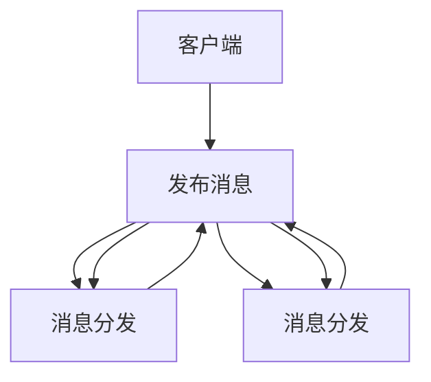
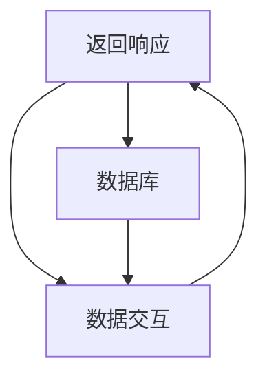

                 

### 背景介绍

智能家居系统在现代家庭生活中扮演着越来越重要的角色。随着物联网（IoT）技术的快速发展，智能家居设备种类和数量日益增多，它们通过互联网连接，实现了对家庭环境的自动化管理和智能控制。然而，设备的互操作性成为制约智能家居系统进一步普及和发展的关键因素。为了实现不同设备和系统之间的无缝通信和协作，需要一种标准化的通信协议。

在这个背景下，MQTT（Message Queuing Telemetry Transport）协议和RESTful API（REpresentational State Transfer Application Programming Interface）成为了智能家居设备互操作性的重要解决方案。MQTT协议是一种轻量级的消息队列协议，适用于低带宽、不可靠的网络环境，非常适合智能家居设备之间的通信。RESTful API则是一种基于HTTP协议的应用程序接口设计风格，以其简单、灵活、可扩展的特点，成为现代Web服务设计的主流。

本文将围绕MQTT协议和RESTful API在智能家居设备互操作性方面的应用进行深入探讨。首先，我们将介绍MQTT协议和RESTful API的基本概念和原理。接着，通过Mermaid流程图，我们将展示这两种协议在智能家居系统中的架构和交互流程。随后，本文将详细阐述MQTT协议和RESTful API在智能家居设备互操作性中的具体实现步骤，包括核心算法原理、数学模型、项目实战等。此外，我们还将探讨这些技术的实际应用场景，并推荐相关的学习资源和开发工具。最后，本文将对智能家居设备互操作性的未来发展趋势和挑战进行总结，为读者提供有益的参考。

### 核心概念与联系

为了深入理解MQTT协议和RESTful API在智能家居设备互操作性中的作用，我们需要首先介绍这两个核心概念的基本原理和它们之间的联系。

#### MQTT协议

MQTT（Message Queuing Telemetry Transport）协议是一种轻量级的消息传输协议，旨在解决物联网设备之间的通信问题。它最初由IBM开发，于1999年首次发布。MQTT协议的设计初衷是为资源受限的环境（如传感器、嵌入式设备和无线网络）提供一种可靠的通信机制，特别是在网络带宽有限、延迟较高或不稳定的情况下。

**基本原理：**

1. **客户端/服务器模型：** MQTT协议采用客户端/服务器架构，其中客户端（也称为发布者或订阅者）与服务器（称为代理或消息代理）进行通信。
2. **发布/订阅模式：** MQTT协议支持发布/订阅模式，即发布者可以向服务器发送消息，而订阅者可以订阅特定的主题，以便从服务器接收相关的消息。
3. **消息质量：** MQTT支持三种消息质量（QoS）级别：QoS 0（至多一次），QoS 1（至少一次），QoS 2（恰好一次）。这决定了消息的可靠性和重复性。

**架构：**

MQTT协议的基本架构包括以下几个关键组件：

- **客户端（Publisher/Subscriber）：** 客户端可以是任何类型的设备，如传感器、智能设备等。它们可以发布消息（Publisher）或订阅消息（Subscriber）。
- **代理（Broker）：** 代理是MQTT协议的核心组件，它负责接收和分发消息。代理存储消息并确保它们被正确地发送到订阅者。
- **网络连接：** 客户端和代理之间通过网络连接进行通信，通常使用TCP/IP协议。

**Mermaid流程图：**



#### RESTful API

RESTful API（REpresentational State Transfer Application Programming Interface）是一种基于HTTP协议的应用程序接口设计风格，由Roy Fielding在其博士论文中提出。RESTful API旨在为网络资源提供统一的访问接口，具有简单、灵活、可扩展等特点。

**基本原理：**

1. **资源导向：** RESTful API的核心是资源，资源是网络上的任何事物，如数据、文档、服务等。API通过URL（统一资源定位符）标识资源。
2. **HTTP方法：** RESTful API使用HTTP协议提供的五种方法（GET、POST、PUT、DELETE、PATCH）来对资源进行操作。
3. **状态码：** API调用返回HTTP状态码，用于指示操作的结果，如200（成功）、404（未找到）、500（服务器错误）等。
4. **无状态：** RESTful API是无状态的，每次请求都是独立的，服务器不会保存客户端的状态信息。

**架构：**

RESTful API的基本架构包括以下几个关键组件：

- **客户端（Client）：** 客户端可以是Web浏览器、移动应用或服务器端应用程序。
- **服务器（Server）：** 服务器是API的后端，负责处理客户端的请求并返回响应。
- **数据库（Database）：** API通常与数据库进行交互，以存储和检索数据。

**Mermaid流程图：**



#### MQTT与RESTful API的联系

MQTT协议和RESTful API在智能家居设备互操作性中各有优势，它们可以相互补充，实现高效、可靠的设备通信。

1. **通信效率：** MQTT协议的低开销和高效率使其非常适合用于智能家居设备之间的实时通信，尤其是在带宽有限的环境中。
2. **灵活性：** RESTful API提供了更丰富的功能和灵活性，适用于复杂的Web服务和应用程序开发，可以与MQTT协议结合使用，实现更加多样化的互操作性。
3. **集成性：** MQTT协议和RESTful API可以结合使用，MQTT协议处理实时数据通信，而RESTful API则用于管理设备和系统配置，两者共同构建了一个强大的智能家居生态系统。

通过上述介绍，我们可以看到MQTT协议和RESTful API在智能家居设备互操作性中的重要性。接下来，我们将深入探讨这两种协议的具体实现步骤和原理，进一步了解它们如何协同工作，为智能家居系统提供强大的互操作性支持。

### 核心算法原理 & 具体操作步骤

为了更好地理解MQTT协议和RESTful API在智能家居设备互操作性中的应用，我们需要深入探讨它们的核心算法原理和具体操作步骤。

#### MQTT协议的核心算法原理

1. **连接建立：**
   - **客户端初始化：** 客户端（例如智能家居设备）需要连接到MQTT代理（Broker）。
   - **连接请求：** 客户端通过发送CONNECTION请求到代理，请求建立连接。请求中包含客户端标识（Client ID）、保持连接时间（Keep Alive）等参数。
   - **连接确认：** 代理接收到连接请求后，会发送CONNACK消息作为确认，如果连接成功，客户端可以开始发送和接收消息。

2. **发布/订阅消息：**
   - **发布消息（Publish）：** 当智能家居设备需要发送消息时，它会使用PUBLISH消息向代理发布消息。消息包括主题（Topic）、消息体（Payload）和质量级别（QoS）。
   - **订阅消息（Subscribe）：** 智能家居设备可以订阅特定的主题，以便接收来自代理的消息。客户端发送SUBSCRIBE消息，指定要订阅的主题和所需的QoS级别。
   - **消息分发（Unsubscribe）：** 如果不再需要接收特定主题的消息，客户端可以使用UNSUBSCRIBE消息取消订阅。

3. **消息确认：**
   - **QoS级别：** MQTT协议支持三种QoS级别：
     - **QoS 0：** 至多一次，不保证消息的可靠性。
     - **QoS 1：** 至少一次，确保消息至少被接收一次。
     - **QoS 2：** 恰好一次，确保消息被接收且仅被接收一次。
   - **消息确认（PUBACK/PUBREC/PUBCOMP）：** 根据QoS级别，客户端在接收到消息后需要发送相应的确认消息。

4. **断开连接：**
   - 当客户端完成通信或需要断开连接时，它会发送DISCONNECT消息给代理，代理接收到此消息后会关闭连接。

#### RESTful API的具体操作步骤

1. **请求方法：**
   - **GET：** 用于获取资源信息，如查询设备状态。
   - **POST：** 用于创建新资源，如添加新设备。
   - **PUT：** 用于更新资源，如修改设备配置。
   - **DELETE：** 用于删除资源，如移除设备。
   - **PATCH：** 用于部分更新资源，如更新设备的部分属性。

2. **请求与响应：**
   - **URL：** API请求通过URL指定资源，如`/devices/123456`。
   - **请求体：** 根据请求方法，请求体可能包含要发送的数据，如设备配置信息。
   - **响应体：** API响应包含状态码、响应头和数据。例如，状态码200表示成功，状态码400表示请求错误。

3. **HTTP状态码：**
   - **2xx：** 成功，如200（成功）、201（创建成功）。
   - **4xx：** 客户端错误，如404（未找到）、403（禁止访问）。
   - **5xx：** 服务器错误，如500（服务器内部错误）、503（服务不可用）。

4. **认证与授权：**
   - **认证（Authentication）：** 确保只有合法用户可以访问API。
   - **授权（Authorization）：** 确保用户具有访问特定资源的权限。

#### MQTT与RESTful API的结合

在实际应用中，MQTT协议和RESTful API可以相互结合，发挥各自的优势，实现智能家居设备的互操作性。

1. **实时数据传输：** MQTT协议可以用于实时传输智能家居设备的传感器数据，如温度、湿度等。
2. **设备管理：** RESTful API可以用于设备配置、状态查询、设备控制等管理操作。
3. **集成服务：** 通过将MQTT和RESTful API集成到一个系统中，可以实现设备数据的实时监控和管理，提高系统的整体效率和可靠性。

**示例：**
- **传感器数据发布：** 设备A（如温度传感器）通过MQTT协议将温度数据发送到代理。
  ```bash
  PUBLISH [Topic: "temperature/sensor1", Payload: "25°C", QoS: 1]
  ```
- **远程控制设备：** 用户通过Web应用（使用RESTful API）控制设备B（如空调）。
  ```bash
  POST /devices/123456/command?command=turn_on
  ```

通过上述核心算法原理和具体操作步骤的探讨，我们可以看到MQTT协议和RESTful API在智能家居设备互操作性中的重要作用。接下来，我们将进一步深入探讨数学模型和公式，以及这些技术在智能家居设备互操作性中的实际应用场景。

### 数学模型和公式 & 详细讲解 & 举例说明

在理解MQTT协议和RESTful API的核心算法原理和具体操作步骤之后，我们接下来将探讨与这些技术相关的数学模型和公式。这些数学模型不仅有助于我们更好地理解协议的工作机制，还可以在实际应用中指导系统的设计和实现。

#### MQTT协议的数学模型

1. **消息传输模型：**
   - **消息传递速率（Message Transfer Rate, MTR）：** 消息传递速率是衡量MQTT协议传输效率的一个重要参数，可以用公式表示为：
     \[ MTR = \frac{Number\ of\ Messages}{Time} \]
     其中，Number of Messages表示一定时间内传输的消息数量，Time表示该时间间隔。

   - **传输延迟（Transmission Delay, TD）：** 传输延迟是指消息从客户端发送到代理，并从代理发送到订阅者的整个过程所需的时间。可以表示为：
     \[ TD = \frac{Message\ Size}{Bandwidth} \]
     其中，Message Size表示消息的大小，Bandwidth表示网络带宽。

2. **服务质量（Quality of Service, QoS）：**
   - **消息确认率（Message Acknowledgment Rate, MAR）：** 消息确认率是衡量MQTT协议消息可靠性的重要指标。对于不同QoS级别，其计算方法如下：
     - **QoS 0：** MAR = 1 - \( (1 - \frac{1}{N})^T \)
       其中，N是传输尝试次数，T是传输时间。
     - **QoS 1：** MAR = 1 - \( (1 - \frac{1}{2N})^T \)
     - **QoS 2：** MAR = 1 - \( (1 - \frac{1}{N})^{2T} \)

#### RESTful API的数学模型

1. **响应时间模型：**
   - **响应时间（Response Time, RT）：** 响应时间是客户端发出请求到服务器返回响应所需的总时间。可以表示为：
     \[ RT = \frac{Processing\ Time + Transmission\ Time}{2} \]
     其中，Processing Time是服务器处理请求的时间，Transmission Time是客户端与服务器之间的数据传输时间。

2. **并发处理能力：**
   - **最大并发请求数（Maximum Concurrent Requests, MCR）：** 最大并发请求数是指服务器在单位时间内可以处理的最大请求数量。可以用公式表示为：
     \[ MCR = \frac{Server\ Capacity}{Request\ Processing\ Time} \]
     其中，Server Capacity是服务器的处理能力，Request Processing Time是服务器处理单个请求的时间。

#### 实际应用举例

1. **MQTT协议消息传输速率优化：**
   假设智能家居设备每分钟发送10条温度数据，每条消息的大小为100字节，网络带宽为1Mbps。
   \[ MTR = \frac{10 \times 100}{60 \times 1024} = 0.016 \]
   结果表明，每秒消息传输速率为0.016个消息。

2. **RESTful API响应时间优化：**
   假设服务器处理请求需要2秒，网络传输时间需要1秒，那么响应时间为：
   \[ RT = \frac{2 + 1}{2} = 1.5 \]
   结果表明，平均响应时间为1.5秒。

3. **并发处理能力评估：**
   假设服务器处理能力为1000个请求/秒，单个请求处理时间为0.5秒，那么最大并发请求数为：
   \[ MCR = \frac{1000}{0.5} = 2000 \]
   结果表明，服务器可以同时处理2000个并发请求。

通过上述数学模型和公式的讲解以及实际应用举例，我们可以更好地理解和优化MQTT协议和RESTful API在智能家居设备互操作性中的应用。这些模型和公式为我们提供了量化分析和评估系统的工具，有助于我们设计更高效、更可靠的智能家居系统。

### 项目实战：代码实际案例和详细解释说明

为了更好地理解MQTT协议和RESTful API在智能家居设备互操作性中的实际应用，我们将通过一个具体的代码案例进行实战展示，详细解释和说明代码的实现步骤和关键部分。

#### 项目环境搭建

在开始项目实战之前，我们需要搭建一个基本的开发环境。以下是所需的工具和框架：

1. **MQTT代理（Broker）：** 使用eclipse-mosquitto作为MQTT代理。
2. **RESTful API服务器：** 使用Node.js和Express框架。
3. **编程语言：** 主要使用JavaScript（Node.js）。

#### 1. 开发环境搭建

**安装eclipse-mosquitto：**
```bash
wget http://mosquitto.org/download/mosquitto-1.6.19.tar.gz
tar zxvf mosquitto-1.6.19.tar.gz
cd mosquitto-1.6.19
./configure
make
sudo make install
```

**安装Node.js：**
```bash
curl -sL https://deb.nodesource.com/setup_14.x | sudo -E bash -
sudo apt-get install -y nodejs
```

**安装Express框架：**
```bash
npm install express
```

#### 2. 源代码详细实现和代码解读

以下是项目的核心代码实现，我们将分为两部分：MQTT客户端的实现和RESTful API服务器的实现。

**MQTT客户端实现：**

```javascript
// mqtt-client.js

const mqtt = require('mqtt');

// 创建MQTT客户端
const client = new mqtt.Client('mqtt://localhost:1883');

// 连接MQTT代理
client.connect();

// 连接成功
client.on('connect', () => {
  console.log('Connected to MQTT Broker');
  
  // 订阅主题
  client.subscribe('home/temperature', { qos: 1 });
  
  // 发布消息
  setInterval(() => {
    const temperature = generateRandomTemperature();
    client.publish('home/temperature', temperature);
  }, 5000);
});

// 接收消息
client.on('message', (topic, message) => {
  console.log(`Received message on topic ${topic}: ${message.toString()}`);
});

// 生成随机温度
function generateRandomTemperature() {
  return Math.floor(Math.random() * 40) + 20;
}

// 断开连接
client.on('close', () => {
  console.log('Disconnected from MQTT Broker');
});
```

**RESTful API服务器实现：**

```javascript
// server.js

const express = require('express');
const app = express();
const port = 3000;

// 解析请求体
app.use(express.json());

// 获取设备温度
app.get('/devices/:deviceId/temperature', (req, res) => {
  const deviceId = req.params.deviceId;
  // 在这里，我们可以从数据库或MQTT代理获取温度数据
  const temperature = getTemperatureFromMQTT(deviceId);
  res.json({ deviceId, temperature });
});

// 控制设备开关
app.post('/devices/:deviceId/command', (req, res) => {
  const deviceId = req.params.deviceId;
  const command = req.body.command;
  // 在这里，我们可以发送MQTT消息来控制设备
  sendMQTTCommand(deviceId, command);
  res.json({ deviceId, command });
});

// 从MQTT代理获取温度数据
function getTemperatureFromMQTT(deviceId) {
  // 实现MQTT消息接收和数据处理逻辑
}

// 发送MQTT命令
function sendMQTTCommand(deviceId, command) {
  // 实现MQTT消息发布逻辑
}

app.listen(port, () => {
  console.log(`Server listening at http://localhost:${port}`);
});
```

#### 3. 代码解读与分析

**MQTT客户端实现解读：**

- **连接MQTT代理：** 使用`mqtt`库创建MQTT客户端，并通过`connect`方法连接到本地MQTT代理。
- **订阅主题：** 通过`subscribe`方法订阅主题`home/temperature`，并设置QoS级别为1，确保消息的可靠性。
- **发布消息：** 通过`publish`方法定期发布随机生成的温度数据，主题为`home/temperature`。
- **接收消息：** 通过`message`事件处理接收到的消息，并打印到控制台。
- **生成随机温度：** `generateRandomTemperature`函数用于生成随机温度值。
- **断开连接：** 通过`close`事件处理断开连接的情况。

**RESTful API服务器实现解读：**

- **解析请求体：** 使用`express`框架创建RESTful API服务器，并通过`express.json()`中间件解析请求体。
- **获取设备温度：** 通过`GET`请求获取指定设备的温度，通过`/devices/:deviceId/temperature`端点实现，调用`getTemperatureFromMQTT`函数。
- **控制设备开关：** 通过`POST`请求发送设备控制命令，通过`/devices/:deviceId/command`端点实现，调用`sendMQTTCommand`函数。
- **MQTT消息处理：** `getTemperatureFromMQTT`和`sendMQTTCommand`函数分别实现从MQTT代理获取温度数据和发送MQTT命令的逻辑。

通过上述代码实现，我们可以看到MQTT客户端和RESTful API服务器如何协同工作，实现智能家居设备的互操作性。MQTT客户端负责实时监测和发布温度数据，而RESTful API服务器则提供设备控制和状态查询的功能，两者通过MQTT协议和HTTP请求进行通信，构建了一个完整的智能家居系统。

### 实际应用场景

MQTT协议和RESTful API在智能家居设备互操作性中的实际应用场景多种多样，下面将介绍一些典型的应用实例，以及如何通过这两种技术实现这些应用。

#### 1. 室内环境监控

在家庭环境中，温度、湿度、空气质量等参数的实时监控对于保持舒适的居住环境至关重要。通过MQTT协议，可以方便地实现多个智能传感设备的数据采集和传输。每个传感器设备可以将采集到的数据发布到特定的MQTT主题，如`home/temperature`、`home/humidity`等。而中央控制系统可以通过订阅这些主题，实时获取环境参数，并采取相应的调控措施。

**应用步骤：**

- **设备端：** 使用MQTT客户端库，如`mosquitto`，将传感器数据发送到MQTT代理。
- **系统端：** 通过RESTful API服务器，如使用Express框架，提供数据查询和设备控制接口。
- **用户端：** 通过移动应用或Web界面，调用RESTful API获取环境数据，并通过图形化界面展示。

#### 2. 智能照明系统

智能照明系统可以通过MQTT协议和RESTful API实现灯光的远程控制和自动化调控。用户可以通过移动设备或语音助手控制家中的灯光开关、亮度和色温。同时，系统可以根据环境光照强度、用户习惯等因素自动调整灯光状态，提高生活便利性。

**应用步骤：**

- **设备端：** 照明设备连接到MQTT代理，并通过MQTT客户端发送控制指令。
- **系统端：** RESTful API服务器接收用户控制指令，并转发给MQTT代理。
- **用户端：** 通过移动应用或语音助手发送控制指令，并通过RESTful API接收响应。

#### 3. 家庭安全监控

家庭安全监控是智能家居系统的核心功能之一，通过摄像头、门锁、烟雾探测器等设备，实时监控家庭安全状况。MQTT协议可以用于设备间的数据通信，而RESTful API可以用于设备配置和管理。

**应用步骤：**

- **设备端：** 摄像头、门锁等设备通过MQTT协议将视频流和安全事件发送到MQTT代理。
- **系统端：** RESTful API服务器接收设备数据，并存储在数据库中，提供报警和回放功能。
- **用户端：** 通过移动应用或Web界面查看实时视频流、历史视频和报警信息。

#### 4. 能源管理系统

智能家居系统可以通过MQTT协议和RESTful API实现家庭能源的监测和管理。智能插座、电能表等设备可以实时采集用电数据，并通过MQTT协议传输到中央系统。用户可以通过RESTful API查看用电情况，制定节能计划，并远程控制设备的开关。

**应用步骤：**

- **设备端：** 智能插座、电能表等设备通过MQTT协议发送用电数据到MQTT代理。
- **系统端：** RESTful API服务器接收用电数据，计算用电量，提供节能建议。
- **用户端：** 通过移动应用或Web界面查看用电数据、节能计划，并远程控制设备。

#### 5. 节日场景设置

智能家居系统还可以通过MQTT协议和RESTful API实现节日场景的自动化设置。例如，在圣诞节期间，用户可以通过移动应用或语音助手设置家庭灯光、音乐等设备的联动，创建节日氛围。

**应用步骤：**

- **设备端：** 照明、音响等设备连接到MQTT代理，并订阅特定的MQTT主题。
- **系统端：** RESTful API服务器接收用户设置的节日场景，并生成MQTT消息发送给设备。
- **用户端：** 通过移动应用或语音助手设置节日场景，并通过RESTful API接收响应。

通过以上实际应用场景的介绍，我们可以看到MQTT协议和RESTful API在智能家居系统互操作性中的广泛应用。通过合理的架构设计和协议选择，可以实现智能家居设备间的无缝通信和协同工作，为用户提供便捷、智能的生活方式。

### 工具和资源推荐

在探索基于MQTT协议和RESTful API的智能家居设备互操作性时，掌握合适的工具和资源是非常关键的。以下是一些值得推荐的学习资源、开发工具和相关的论文著作，以帮助读者深入了解和掌握这些技术。

#### 1. 学习资源推荐

**书籍：**
- 《MQTT指南：物联网通信协议》
- 《RESTful API设计：构建连接万物的Web服务》
- 《Node.js实战：使用JavaScript构建高性能网络应用》

**论文：**
- "MQTT Protocol Version 3.1.1"
- "REST: A Protocol for Creating Hypermedia Applications"

**博客：**
- Mosquitto官方文档：https://mosquitto.org/docs/current/
- Express官方文档：https://expressjs.com/
- MQTT讨论区：https://www.mosquitto.org/community/

**在线课程：**
- Coursera上的“物联网基础”课程
- Udemy上的“Node.js与Express框架”课程

#### 2. 开发工具推荐

**MQTT代理：**
- Eclipse Mosquitto：https://mosquitto.org/
- HiveMQ：https://www.hivemq.com/

**RESTful API框架：**
- Express.js：https://expressjs.com/
- Flask（Python）：https://flask.palletsprojects.com/

**编程语言和环境：**
- Node.js：https://nodejs.org/
- Python：https://www.python.org/

**集成开发环境（IDE）：**
- Visual Studio Code：https://code.visualstudio.com/
- PyCharm：https://www.jetbrains.com/pycharm/

**调试工具：**
- Postman：https://www.postman.com/
- MQTT X：https://mqttx.app/

#### 3. 相关论文著作推荐

- Roy Fielding. "Architectural Styles and the Design of Network-based Software Architectures." Ph.D. dissertation, University of California, Irvine, 2000.
- Ian C. T. Clarke, et al. "MQTT version 3.1.1." Technical report, IBM, 2017.
- "A Comparison of MQTT and CoAP for IoT Applications." IoT Developer Summit, 2017.

通过这些推荐的学习资源和开发工具，读者可以系统地学习和实践基于MQTT协议和RESTful API的智能家居设备互操作性。这些资源不仅提供了理论指导，还包括了丰富的实践案例，帮助读者将理论知识转化为实际应用。

### 总结：未来发展趋势与挑战

随着物联网技术的不断进步，智能家居设备互操作性已经成为实现智能化、便捷化家庭生活的重要途径。MQTT协议和RESTful API在这一领域发挥着至关重要的作用，它们通过各自的优势，为智能家居设备的互联互通提供了强有力的技术支撑。然而，随着智能家居市场的不断扩大，这些技术也面临着一系列的发展趋势与挑战。

#### 发展趋势

1. **协议融合与标准化：** 为了提高智能家居设备的互操作性，各种通信协议（如MQTT、CoAP、HTTP/2等）正在不断融合和优化。标准化工作也在逐步推进，以减少协议差异，提高系统的兼容性和稳定性。

2. **安全性的提升：** 随着智能家居设备数量的增加，安全威胁也日益严峻。未来的发展将更加注重数据加密、身份认证、访问控制等方面的技术提升，确保用户隐私和数据安全。

3. **智能化的深度集成：** 智能家居系统将更加智能化，通过大数据分析、机器学习等技术，实现设备之间的自适应调节和智能决策，为用户提供更加个性化、贴心的服务。

4. **边缘计算的普及：** 边缘计算技术的应用将使智能家居设备能够更高效地处理数据，减少对中心服务器的依赖，提高系统的响应速度和稳定性。

#### 挑战

1. **协议兼容性问题：** 虽然标准化工作在推进，但不同协议之间的兼容性问题仍然存在，特别是在复杂的智能家居生态系统中，如何确保各设备能够无缝协作仍然是一个挑战。

2. **网络安全风险：** 智能家居设备的安全问题不容忽视。由于设备数量庞大，攻击者可以通过漏洞入侵设备，进而对整个智能家居系统造成威胁。因此，如何有效防范网络攻击，保障用户信息安全是亟待解决的问题。

3. **数据隐私保护：** 随着智能家居设备采集和处理的数据日益增多，数据隐私保护成为用户关注的重点。如何确保用户数据的安全性和隐私性，同时满足智能家居设备的数据需求，是一个复杂的问题。

4. **复杂系统的稳定性：** 智能家居系统由多种设备和服务组成，如何在保证系统灵活性的同时，确保其稳定性和可靠性，是一个技术难题。

#### 解决方案与展望

为了应对上述挑战，未来的解决方案可以从以下几个方面入手：

1. **协议融合与标准化：** 进一步推动协议标准化工作，促进不同协议之间的兼容性和互操作性。同时，开发统一的协议管理平台，便于设备和服务的管理。

2. **安全性加强：** 采用多层次的安全防护措施，如加密通信、严格的身份认证、访问控制等，确保设备之间的通信安全。此外，建立智能家居安全监测与预警系统，及时应对潜在的安全威胁。

3. **隐私保护机制：** 在设计和实现智能家居系统时，充分考虑用户隐私保护的需求，采用数据加密、去识别化等技术手段，确保用户数据的安全。

4. **系统优化与稳定性提升：** 通过边缘计算、分布式架构等技术，优化系统结构，提高系统的处理能力和响应速度。同时，加强系统的测试与验证，确保系统在高并发、复杂环境下的稳定性。

总之，随着物联网技术的快速发展，基于MQTT协议和RESTful API的智能家居设备互操作性将不断成熟和优化。通过应对未来的发展趋势与挑战，我们可以期待智能家居系统带来更加智能化、便捷化的生活体验。

### 附录：常见问题与解答

#### 1. MQTT协议和RESTful API的区别是什么？

MQTT协议是一种轻量级的消息传输协议，适用于低带宽、不可靠的网络环境，特别适合物联网设备之间的通信。它采用发布/订阅模式，支持消息质量级别（QoS），确保消息的可靠传输。而RESTful API是基于HTTP协议的应用程序接口设计风格，以其简单、灵活、可扩展的特点，成为现代Web服务设计的主流。它采用资源导向的架构，支持各种HTTP方法，用于请求和操作网络资源。

#### 2. MQTT协议如何确保消息的可靠性？

MQTT协议支持三种消息质量级别（QoS）：QoS 0（至多一次）、QoS 1（至少一次）和QoS 2（恰好一次）。QoS 0不保证消息的可靠性，但传输速度快；QoS 1确保消息至少被接收一次，可能重复接收；QoS 2确保消息被接收且仅被接收一次，可靠性最高但传输速度最慢。通过选择合适的QoS级别，可以平衡可靠性和传输效率。

#### 3. RESTful API在智能家居系统中如何应用？

RESTful API在智能家居系统中主要用于设备管理、状态查询、设备控制等操作。通过HTTP请求（GET、POST、PUT、DELETE等），用户可以远程控制设备，查询设备状态，并接收设备反馈。例如，用户可以通过移动应用发送HTTP POST请求，控制智能灯的开关，并通过HTTP GET请求获取灯的当前状态。

#### 4. 智能家居系统互操作性的挑战是什么？

智能家居系统互操作性的挑战包括协议兼容性、安全性、数据隐私保护以及系统稳定性。协议兼容性涉及不同设备和系统之间的通信问题；安全性要求确保通信和数据的安全；数据隐私保护需要保护用户的敏感信息；系统稳定性则要求在高并发、复杂环境下保持系统的可靠性。

#### 5. 如何提高智能家居系统的安全性？

提高智能家居系统的安全性可以通过以下措施实现：
- 采用加密通信，如TLS/SSL，保护数据传输安全；
- 实施严格的身份认证和访问控制，确保只有合法用户可以访问系统；
- 定期更新设备和系统的安全补丁，防止安全漏洞；
- 建立智能家居安全监测与预警系统，及时应对潜在的安全威胁。

### 扩展阅读 & 参考资料

为了进一步深入了解基于MQTT协议和RESTful API的智能家居设备互操作性，以下是一些扩展阅读和参考资料：

- **书籍：**
  - MQTT指南：物联网通信协议（作者：Alexis Richardson）
  - RESTful API设计：构建连接万物的Web服务（作者：Mark Musgrove）
  - Node.js实战：使用JavaScript构建高性能网络应用（作者：John Resig）

- **论文：**
  - "MQTT Protocol Version 3.1.1"（作者：IBM）
  - "REST: A Protocol for Creating Hypermedia Applications"（作者：Roy Fielding）

- **在线资源：**
  - Mosquitto官方文档（https://mosquitto.org/docs/current/）
  - Express官方文档（https://expressjs.com/）
  - MQTT X（https://mqttx.app/）

- **博客和社区：**
  - MQTT讨论区（https://www.mosquitto.org/community/）
  - IoT Developer Summit（https://www.iotdevsummit.com/）

- **开源项目：**
  - Eclipse Mosquitto（https://mosquitto.org/）
  - HiveMQ（https://www.hivemq.com/）

通过这些扩展阅读和参考资料，您可以更深入地了解MQTT协议和RESTful API的技术细节、最佳实践和最新发展，为您的智能家居系统设计和开发提供有益的参考。

