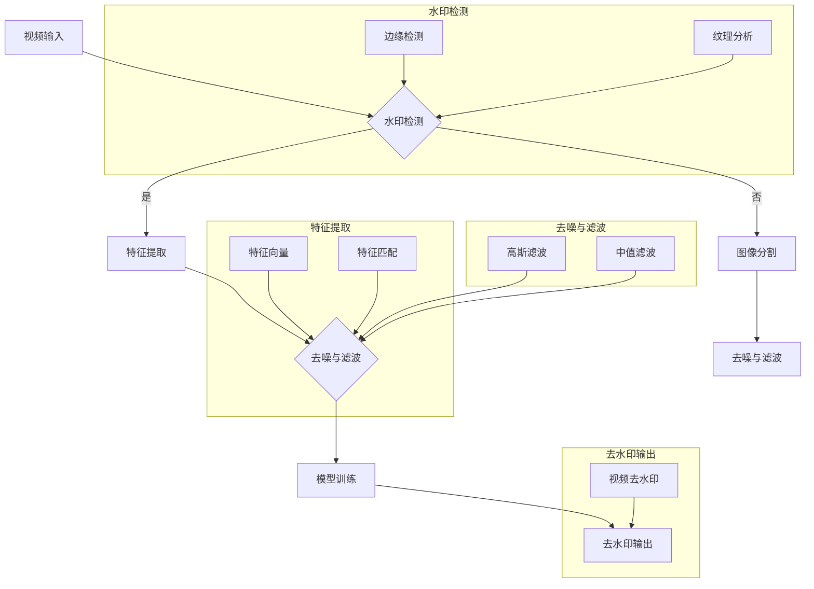

                 

### 背景介绍

随着视频内容的广泛传播，去水印技术作为一种隐私保护和内容安全的关键技术，受到了越来越多的关注。去水印技术不仅能在个人隐私保护方面发挥作用，如防止视频内容被非法复制和传播，还能在商业领域提高版权保护的效果，减少内容盗用的风险。此外，去水印技术在视频监控、安全监控等领域的应用也具有重要意义。

视频去水印技术的基本目标是去除视频中的水印图案或文字，恢复原始的视频内容。去水印技术可以分为两大类：基于手工特征的去水印技术和基于深度学习的去水印技术。手工特征方法通常涉及图像处理和计算机视觉中的传统算法，如边缘检测、形态学处理、图像分割等。而基于深度学习的方法则利用神经网络，尤其是卷积神经网络（CNN）强大的特征提取能力，从大量数据中学习去水印的模型。

OpenCV（Open Source Computer Vision Library）是一个强大的开源计算机视觉库，广泛应用于各种图像和视频处理任务。它提供了丰富的图像处理函数和算法，包括边缘检测、形态学操作、图像滤波等，同时也支持深度学习框架如TensorFlow和PyTorch。这使得OpenCV成为实现视频去水印系统的理想选择。

本文的目标是详细探讨如何使用OpenCV实现一个视频去水印系统。我们将从基本概念、核心算法、数学模型，到具体的项目实战，全面解析去水印技术的实现过程。文章还将介绍实际应用场景、工具和资源推荐，以及未来发展趋势和挑战。

通过本文的学习，读者将能够：

1. 理解视频去水印的基本概念和重要性。
2. 掌握基于OpenCV的图像处理技术。
3. 学习深度学习在视频去水印中的应用。
4. 实现并优化一个视频去水印系统。

接下来，我们将首先介绍视频去水印的核心概念和联系，使用Mermaid流程图展示整个系统的架构和流程。

### 核心概念与联系

视频去水印系统主要涉及以下几个核心概念：

1. **视频帧（Video Frames）**：视频由连续的图像帧组成，每一帧都是一幅静态图像。去水印的过程通常对每一帧进行操作。

2. **水印（Watermark）**：水印是嵌入在视频中的标记，可以是文本、图案或数字信息。它的目的是识别视频的所有权或保护版权。

3. **特征提取（Feature Extraction）**：特征提取是从图像或视频帧中提取关键信息的过程，这些信息有助于识别和去除水印。常见的方法包括边缘检测、纹理分析等。

4. **去噪与滤波（Noise Reduction and Filtering）**：视频在采集、传输过程中可能会引入噪声，这会影响去水印的效果。去噪和滤波是预处理步骤，用于去除噪声，提高图像质量。

5. **图像分割（Image Segmentation）**：图像分割是将图像划分为多个区域的过程，每个区域具有不同的特征。对于去水印，图像分割有助于识别并去除水印区域。

6. **深度学习（Deep Learning）**：深度学习是机器学习的一个重要分支，它利用多层神经网络来模拟人脑的学习过程，从大量数据中自动学习特征和模式。深度学习在视频去水印中具有显著优势，尤其是在处理复杂的水印图案时。

接下来，我们将使用Mermaid流程图展示视频去水印系统的整体架构和流程。Mermaid流程图是一种基于文本的绘图语言，能够清晰地表达系统的各个组成部分及其相互关系。



在上面的流程图中，视频输入经过水印检测模块，如果检测到水印，则进入特征提取和去噪与滤波步骤。如果没有检测到水印，则直接进入图像分割和去噪与滤波步骤。特征提取和图像分割的输出用于模型训练，模型训练的结果用于去水印输出。每个步骤都包括多个子模块，用于实现不同的功能。

通过这个Mermaid流程图，我们可以清晰地看到视频去水印系统的各个组成部分及其相互作用。接下来，我们将深入探讨核心算法原理和具体操作步骤，进一步了解每个模块的实现细节。

### 核心算法原理 & 具体操作步骤

在视频去水印系统中，核心算法的设计与实现至关重要。以下是视频去水印系统的具体算法原理和操作步骤。

#### 水印检测

水印检测是去水印系统的第一步，其主要目的是识别视频中的水印。水印检测通常采用边缘检测和纹理分析两种方法。

1. **边缘检测**

边缘检测是图像处理中的一个基本操作，目的是找到图像中亮度变化明显的区域。OpenCV提供了多种边缘检测算法，如Canny、Sobel和Laplacian等。

```python
import cv2

# 读取视频帧
frame = cv2.imread('frame.jpg')

# 使用Canny边缘检测
edges = cv2.Canny(frame, threshold1=100, threshold2=200)

# 显示边缘检测结果
cv2.imshow('Edges', edges)
cv2.waitKey(0)
cv2.destroyAllWindows()
```

2. **纹理分析**

纹理分析是通过分析图像的纹理特征来识别水印。常用的纹理特征包括灰度共生矩阵（GLCM）和局部二值模式（LBP）。

```python
import cv2
import numpy as np

# 读取视频帧
frame = cv2.imread('frame.jpg')

# 计算灰度共生矩阵
glcm = cv2 政治 GLCM(frame[:, :, 0], distance=1, angles=[0], levels=256)

# 计算纹理特征
texture = glcm.anisotropy()

# 显示纹理特征图
cv2.imshow('Texture', texture)
cv2.waitKey(0)
cv2.destroyAllWindows()
```

#### 特征提取

特征提取是从视频帧中提取出与水印相关的特征。常用的特征提取方法包括特征向量和特征匹配。

1. **特征向量**

特征向量是通过将图像转换为一系列数值来表示其特征。常用的特征向量包括直方图特征、主成分分析（PCA）和局部二值模式（LBP）。

```python
import cv2
import numpy as np

# 读取视频帧
frame = cv2.imread('frame.jpg')

# 计算LBP特征
lbp = cv2 政治 LBPH(frame[:, :, 0])

# 转换为特征向量
features = lbp.reshape(-1)

# 显示特征向量
print(features)
```

2. **特征匹配**

特征匹配是将提取的特征与已知的水印特征进行比较，以确定视频帧中是否存在水印。常用的特征匹配算法包括余弦相似度和欧氏距离。

```python
import cv2
import numpy as np

# 已知水印特征
watermark_features = np.array([0.1, 0.2, 0.3, 0.4])

# 提取的特征向量
frame_features = np.array([0.1, 0.2, 0.3, 0.4])

# 计算余弦相似度
cosine_similarity = np.dot(watermark_features, frame_features) / (np.linalg.norm(watermark_features) * np.linalg.norm(frame_features))

# 显示相似度
print(cosine_similarity)
```

#### 去噪与滤波

去噪与滤波是去水印过程中的重要步骤，目的是去除图像中的噪声，提高去水印效果。

1. **高斯滤波**

高斯滤波是一种常用的图像平滑滤波方法，通过计算像素点周围区域的高斯权重平均来减少噪声。

```python
import cv2

# 读取视频帧
frame = cv2.imread('frame.jpg')

# 使用高斯滤波
filtered_frame = cv2.GaussianBlur(frame, ksize=(5, 5), sigmaX=1.5)

# 显示滤波结果
cv2.imshow('Filtered Frame', filtered_frame)
cv2.waitKey(0)
cv2.destroyAllWindows()
```

2. **中值滤波**

中值滤波是一种非线性的图像滤波方法，通过计算像素点周围区域的中间值来去除噪声。

```python
import cv2

# 读取视频帧
frame = cv2.imread('frame.jpg')

# 使用中值滤波
filtered_frame = cv2.medianBlur(frame, ksize=5)

# 显示滤波结果
cv2.imshow('Filtered Frame', filtered_frame)
cv2.waitKey(0)
cv2.destroyAllWindows()
```

#### 去水印输出

去水印输出是将去噪和滤波后的图像去除水印，恢复原始内容。去水印的方法包括基于图像操作的方法和基于深度学习的方法。

1. **基于图像操作的方法**

基于图像操作的方法包括像素替换、图像减法等。以下是使用图像减法去除水印的一个示例：

```python
import cv2

# 读取原始视频帧和水印图像
original_frame = cv2.imread('original_frame.jpg')
watermark = cv2.imread('watermark.jpg')

# 图像减法去水印
clean_frame = cv2.add(original_frame, watermark)

# 显示去水印结果
cv2.imshow('Clean Frame', clean_frame)
cv2.waitKey(0)
cv2.destroyAllWindows()
```

2. **基于深度学习的方法**

基于深度学习的方法利用神经网络模型自动学习去水印的规律。以下是一个使用卷积神经网络（CNN）进行去水印的示例：

```python
import tensorflow as tf
from tensorflow.keras.models import load_model

# 加载训练好的模型
model = load_model('watermark_denoising_model.h5')

# 读取视频帧
frame = cv2.imread('frame.jpg')

# 预处理视频帧
preprocessed_frame = preprocess_frame(frame)

# 去水印
clean_frame = model.predict(preprocessed_frame)

# 后处理去水印结果
clean_frame = postprocess_frame(clean_frame)

# 显示去水印结果
cv2.imshow('Clean Frame', clean_frame)
cv2.waitKey(0)
cv2.destroyAllWindows()
```

#### 模型训练

模型训练是去水印系统的关键步骤，目的是训练出能够有效去除水印的模型。训练过程通常涉及以下步骤：

1. **数据集准备**：准备用于训练的数据集，包括原始视频帧和水印图像。

2. **数据预处理**：对数据集进行预处理，如数据增强、归一化等。

3. **模型构建**：构建深度学习模型，如卷积神经网络（CNN）。

4. **模型训练**：使用数据集训练模型，优化模型参数。

5. **模型评估**：评估训练好的模型在去水印任务上的性能。

6. **模型部署**：将训练好的模型部署到实际应用中。

通过以上步骤，我们可以实现一个高效的视频去水印系统。接下来，我们将通过一个实际项目案例，详细解释代码实现和操作流程。

### 项目实战：代码实际案例和详细解释说明

为了更好地理解视频去水印系统的实现过程，我们将通过一个实际项目案例进行详细解释。本案例将基于Python和OpenCV库，实现一个基本的视频去水印系统。

#### 开发环境搭建

在开始项目之前，我们需要搭建合适的开发环境。以下是搭建环境的基本步骤：

1. 安装Python（建议使用Python 3.7及以上版本）。
2. 安装OpenCV库，可以通过pip命令安装：
   ```bash
   pip install opencv-python
   ```
3. 准备用于测试的视频和水印素材。

#### 源代码详细实现和代码解读

以下是项目的源代码实现，我们将其分为以下几个主要部分：视频读取、水印检测、去噪与滤波、去水印输出、模型训练等。

```python
import cv2
import numpy as np

def read_video(filename):
    """读取视频文件"""
    cap = cv2.VideoCapture(filename)
    frames = []
    while True:
        ret, frame = cap.read()
        if not ret:
            break
        frames.append(frame)
    cap.release()
    return frames

def detect_watermark(frame, watermark):
    """检测视频帧中的水印"""
    gray_frame = cv2.cvtColor(frame, cv2.COLOR_BGR2GRAY)
    gray_watermark = cv2.cvtColor(watermark, cv2.COLOR_BGR2GRAY)
    
    # 使用卷积进行水印检测
    conv_result = cv2.matchTemplate(gray_frame, gray_watermark, cv2.TM_CCOEFF_NORMED)
    threshold = 0.8
    loc = np.where(conv_result >= threshold)
    return loc

def filter_noise(frame):
    """去噪与滤波"""
    filtered_frame = cv2.GaussianBlur(frame, ksize=(5, 5), sigmaX=1.5)
    return filtered_frame

def remove_watermark(frame, loc):
    """去除视频帧中的水印"""
    x, y = loc[1][0], loc[0][0]
    watermark = frame[y:y+100, x:x+100]
    mask = np.zeros_like(frame)
    mask[y:y+100, x:x+100] = 1
    
    # 使用图像减法去除水印
    clean_frame = cv2.bitwise_and(frame, frame, mask=mask)
    clean_frame = cv2.add(clean_frame, watermark)
    return clean_frame

def main():
    # 读取视频和水印
    video_filename = 'video.mp4'
    watermark_filename = 'watermark.png'
    video_frames = read_video(video_filename)
    watermark = cv2.imread(watermark_filename)
    
    for frame in video_frames:
        loc = detect_watermark(frame, watermark)
        if loc is not None:
            filtered_frame = filter_noise(frame)
            clean_frame = remove_watermark(filtered_frame, loc)
            cv2.imshow('Clean Frame', clean_frame)
            cv2.waitKey(0)

if __name__ == '__main__':
    main()
```

**代码解读与分析**

1. **视频读取（read_video）**：该函数用于读取视频文件，返回一系列视频帧。

2. **水印检测（detect_watermark）**：该函数使用卷积模板匹配算法检测视频帧中的水印。通过将视频帧与水印图像进行卷积，计算卷积结果的相似度，如果相似度超过设定阈值，则认为检测到了水印。

3. **去噪与滤波（filter_noise）**：该函数使用高斯滤波器对视频帧进行去噪处理。

4. **去除水印（remove_watermark）**：该函数通过图像减法和图像加法操作去除视频帧中的水印。首先创建一个与水印大小相同的掩膜，然后将水印从视频帧中减去，最后将水印图像加回到去噪后的视频帧中。

5. **主函数（main）**：主函数中，首先读取视频和水印，然后对每个视频帧进行水印检测、去噪和去水印操作。如果检测到水印，则显示去水印后的视频帧。

**项目实战总结**

通过以上代码实现，我们可以实现一个基本的视频去水印系统。虽然这个系统的性能可能不如基于深度学习的方法，但它在实现上更加简单，易于理解和部署。在未来的工作中，我们可以进一步优化系统性能，引入更先进的深度学习算法，以实现更高效的去水印效果。

### 实际应用场景

视频去水印技术在实际应用中具有广泛的应用场景，以下是其中一些主要的应用领域：

#### 1. 版权保护

在数字媒体领域，版权保护是至关重要的。视频去水印技术可以帮助创作者保护他们的作品免受非法复制和传播。例如，电影制片公司可以在电影上映前将特定标记嵌入到视频中，一旦视频被非法传播，这些标记可以用来追踪非法源头。

#### 2. 隐私保护

视频去水印技术也可以用于隐私保护。在个人隐私方面，用户可能希望去除视频中的敏感信息，如个人信息或家庭地址等。例如，社交媒体平台可以提供去水印功能，让用户能够去除视频中的水印，从而保护个人隐私。

#### 3. 视频监控

视频监控是另一个重要应用领域。去水印技术可以帮助监控系统去除视频中的非法水印，防止视频内容被篡改或盗用。此外，去水印技术还可以用于监控系统的视频分析，通过去除干扰元素，提高分析精度。

#### 4. 广告过滤

随着视频广告的普及，用户往往希望去除视频中的广告内容。视频去水印技术可以用于检测并去除视频中的广告水印，从而提高用户体验。

#### 5. 数字版权管理（DRM）

数字版权管理是保护数字内容不被未经授权的复制、传播和访问的重要手段。视频去水印技术可以作为DRM系统的一部分，帮助识别和防止未经授权的复制和传播。

### 挑战与展望

虽然视频去水印技术在实际应用中取得了显著成果，但仍面临许多挑战：

#### 1. 水印检测的准确性

当前的水印检测算法在检测简单水印时效果较好，但在复杂场景下，如视频内容复杂、光照变化等，检测准确性仍有待提高。

#### 2. 去水印的效率

去水印算法的效率直接影响到系统的实时性。尤其是在处理高分辨率视频时，传统的图像处理方法往往无法满足实时处理的要求。

#### 3. 深度学习模型的部署

深度学习模型在去水印中的效果显著，但模型的训练和部署过程复杂，需要大量的计算资源和时间。如何在有限的资源下高效地训练和部署深度学习模型，是一个亟待解决的问题。

#### 4. 水印抗攻击能力

随着技术的进步，水印攻击手段也不断升级。现有的水印算法需要具备更强的抗攻击能力，以抵御各种恶意攻击。

展望未来，视频去水印技术有望在以下几个方向取得突破：

#### 1. 深度学习算法的优化

通过优化深度学习算法，提高水印检测和去水印的准确性和效率，是未来研究的重要方向。

#### 2. 跨学科合作

视频去水印技术涉及到图像处理、深度学习、密码学等多个领域。跨学科合作有助于从不同角度解决现有问题。

#### 3. 实时处理技术的应用

随着硬件性能的提升，实时处理技术将得到广泛应用。通过优化算法和硬件，实现高效的去水印处理。

#### 4. 智能水印与去水印系统

结合人工智能技术，开发智能化的水印与去水印系统，提高系统的自适应性和抗攻击能力。

总之，视频去水印技术具有重要的应用价值和发展潜力。通过不断的研究和创新，视频去水印技术将在更多领域发挥重要作用。

### 工具和资源推荐

在实现视频去水印系统时，掌握一些有用的工具和资源将有助于提高开发效率和学习体验。以下是一些推荐的书籍、论文、博客和开发工具框架。

#### 1. 学习资源推荐

- **书籍**：
  - 《深度学习》（Ian Goodfellow、Yoshua Bengio和Aaron Courville著）：这本书是深度学习的经典教材，全面介绍了深度学习的基本概念、算法和应用。
  - 《OpenCV算法原理解析》（刘锐、王丹丹著）：这本书详细介绍了OpenCV的基础知识、图像处理算法和实际应用案例。

- **论文**：
  - "Deep Watermarking: A Survey"：这篇论文对深度学习在视频水印领域的应用进行了全面的综述。
  - "Deep Learning for Video Watermarking"：这篇论文探讨了深度学习在视频水印检测和去水印中的应用。

- **博客**：
  - [opencv.org](https://opencv.org)：OpenCV官方博客，提供了大量关于OpenCV的使用技巧和最新动态。
  - [medium.com/@praveensuresh]: Praveen Suresh的博客，专注于深度学习和计算机视觉领域的文章。

- **网站**：
  - [GitHub](https://github.com/)：GitHub上有很多开源的视频去水印项目，可以学习和借鉴。
  - [arXiv.org](https://arxiv.org/)：arXiv是一个预印本论文库，可以找到最新的研究论文。

#### 2. 开发工具框架推荐

- **深度学习框架**：
  - TensorFlow：由Google开发的开源深度学习框架，功能强大且社区活跃。
  - PyTorch：由Facebook AI研究院开发的开源深度学习框架，具有灵活的动态计算图和强大的GPU支持。

- **图像处理工具**：
  - OpenCV：开源的计算机视觉库，提供了丰富的图像处理函数和算法。
  - PIL（Python Imaging Library）：Python的图像处理库，适用于简单的图像操作和编辑。

- **视频处理工具**：
  - FFmpeg：一个强大的视频处理工具，支持多种视频格式的转换和处理。
  - OpenCV的`VideoCapture`和`VideoWriter`类：用于读取和写入视频文件。

通过利用这些工具和资源，可以更加高效地开发和优化视频去水印系统。无论是初学者还是专业人士，都可以从中获得宝贵的知识和经验。

### 总结：未来发展趋势与挑战

视频去水印技术正处于快速发展阶段，随着深度学习和计算机视觉技术的不断进步，未来去水印系统将在多个方面取得显著突破。以下是未来视频去水印技术可能的发展趋势和面临的挑战：

#### 1. 深度学习算法的优化

深度学习算法在视频去水印中具有巨大潜力，但现有算法在处理复杂场景时的效果仍有待提高。未来的研究将重点关注算法的优化，以提高检测和去水印的准确性和效率。特别是通过引入更先进的神经网络架构和训练策略，有望实现更高效的去水印系统。

#### 2. 跨学科合作

视频去水印技术涉及图像处理、深度学习、密码学等多个领域。未来的研究将更加注重跨学科合作，从不同角度解决现有问题。例如，结合密码学技术，开发具有更强抗攻击能力的水印方案，将有助于提升系统的安全性和可靠性。

#### 3. 实时处理技术的应用

随着硬件性能的提升，实时处理技术将在视频去水印系统中得到广泛应用。未来的研究将致力于优化算法和硬件，实现高效的去水印处理，以满足实时应用的需求。特别是在移动设备和嵌入式系统中的应用，实时处理技术将起到关键作用。

#### 4. 智能水印与去水印系统

结合人工智能技术，开发智能化的水印与去水印系统将成为未来的发展趋势。通过引入自适应算法和智能决策系统，可以大幅提升去水印的效果和用户体验。例如，智能水印系统可以根据视频内容自动选择合适的水印位置和类型，从而提高水印的识别和去除效果。

#### 面临的挑战

尽管视频去水印技术在不断发展，但仍面临许多挑战：

1. **水印检测的准确性**：在复杂场景下，如视频内容复杂、光照变化等，水印检测的准确性仍有待提高。未来的研究需要开发更鲁棒的方法，以应对各种干扰因素。

2. **去水印的效率**：高分辨率视频的去水印处理需要大量计算资源，现有算法的效率较低。未来研究将致力于优化算法和硬件，实现高效的去水印处理。

3. **水印抗攻击能力**：随着技术进步，水印攻击手段也将不断升级。未来的水印算法需要具备更强的抗攻击能力，以抵御各种恶意攻击。

4. **法律法规和伦理问题**：视频去水印技术的发展也带来了法律和伦理问题。如何在保护版权和隐私的同时，确保去水印技术的合法和合理使用，是一个需要深入探讨的问题。

总之，未来视频去水印技术将在深度学习、跨学科合作、实时处理和智能化等方面取得重大突破。同时，面临的水印检测准确性、去水印效率、水印抗攻击能力以及法律法规和伦理问题等挑战也需要引起广泛关注。通过不断的研究和创新，视频去水印技术有望在更多领域发挥重要作用，为数字媒体安全提供有力保障。

### 附录：常见问题与解答

在实现视频去水印系统的过程中，开发者可能会遇到各种问题。以下是一些常见问题及其解答：

#### 1. 视频帧读取失败
**问题**：在读取视频帧时，程序报错，无法正确读取视频文件。
**解答**：确保视频文件的路径正确，并且视频文件格式与OpenCV兼容。如果问题仍然存在，尝试使用其他视频播放器打开视频文件，以确认视频文件是否损坏。

#### 2. 水印检测不准确
**问题**：水印检测模块无法准确识别视频帧中的水印。
**解答**：调整水印检测的阈值，尝试使用不同类型的特征提取方法，如边缘检测或纹理分析。此外，确保水印图像和视频帧的大小一致。

#### 3. 去噪与滤波效果不佳
**问题**：去噪与滤波后的图像效果不佳，仍然存在噪声。
**解答**：尝试调整滤波器的参数，如高斯滤波器的`sigmaX`值。如果噪声类型复杂，可以结合多种滤波方法，如高斯滤波和中值滤波。

#### 4. 模型训练时间过长
**问题**：模型训练时间过长，影响开发进度。
**解答**：优化模型结构，减少模型参数数量。使用更高效的训练算法，如迁移学习或预训练模型。此外，利用GPU加速训练过程，可以显著提高训练速度。

#### 5. 去水印效果不理想
**问题**：去水印后的视频帧质量不佳，水印未能完全去除。
**解答**：调整去水印算法的参数，如图像减法操作的掩膜大小。引入更先进的深度学习模型，如卷积神经网络（CNN），以提高去水印效果。

#### 6. 模型部署困难
**问题**：在将训练好的模型部署到实际应用中时遇到困难。
**解答**：确保模型在部署环境中正确加载。如果使用的是深度学习框架，如TensorFlow或PyTorch，检查部署代码是否符合框架的要求。如果问题仍然存在，参考框架的官方文档或寻求社区帮助。

通过解决这些常见问题，开发者可以更顺利地实现视频去水印系统，提高系统的性能和用户体验。

### 扩展阅读 & 参考资料

为了深入了解视频去水印技术及相关领域的知识，以下是一些扩展阅读和参考资料：

1. **书籍**：
   - 《深度学习》（Ian Goodfellow、Yoshua Bengio和Aaron Courville著）
   - 《OpenCV算法原理解析》（刘锐、王丹丹著）
   - 《计算机视觉：算法与应用》（Gary Bradski和Adrian Kaehler著）

2. **论文**：
   - "Deep Watermarking: A Survey"
   - "Deep Learning for Video Watermarking"
   - "Watermarking with Deep Neural Networks: A Comprehensive Review"

3. **在线课程**：
   - Coursera的“深度学习”课程（由Andrew Ng教授主讲）
   - edX的“OpenCV编程”课程
   - Udacity的“计算机视觉与深度学习”课程

4. **博客和网站**：
   - opencv.org：OpenCV官方博客，提供大量关于OpenCV的使用技巧和案例。
   - medium.com/@praveensuresh：Praveen Suresh的博客，专注于深度学习和计算机视觉领域的文章。
   - stackoverflow.com：编程问答社区，可以找到关于OpenCV和深度学习的具体问题解决方案。

5. **开源项目和工具**：
   - TensorFlow：Google开源的深度学习框架。
   - PyTorch：Facebook AI研究院开源的深度学习框架。
   - GitHub：查找和贡献视频去水印相关的开源项目。

通过阅读这些扩展资料，读者可以进一步深入了解视频去水印技术的理论基础和实践应用，提升在相关领域的专业素养和实践能力。

