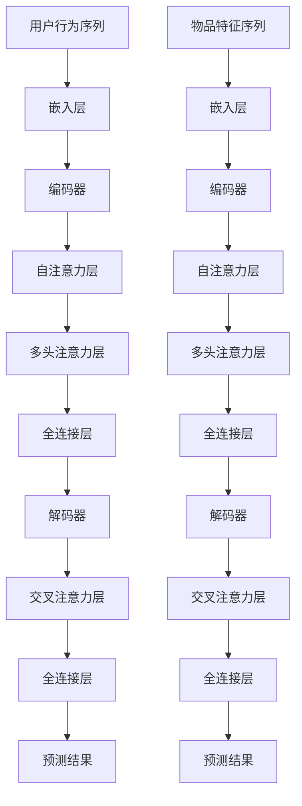

                 

## 文章标题

### 基于transformer架构的个性化推荐算法

> **关键词**：Transformer、个性化推荐、机器学习、算法架构
> 
> **摘要**：本文将探讨基于Transformer架构的个性化推荐算法，深入解析其核心原理、数学模型，并通过实际项目案例详细解读其实现过程，为读者提供系统全面的技术指南。

在当今数据驱动的时代，个性化推荐系统已经成为提升用户体验、增加商业价值的关键技术。传统的推荐算法，如基于协同过滤、矩阵分解等方法，虽然在一定程度上满足了需求，但它们在处理复杂数据、长序列信息等方面存在局限性。近年来，基于Transformer的架构在自然语言处理（NLP）领域取得了显著成果。本文将探讨如何将这一前沿技术应用于个性化推荐系统，以实现更精准、高效的推荐效果。

首先，我们将介绍Transformer架构的基本概念及其在个性化推荐中的应用。接着，我们将深入探讨核心算法原理，详细讲解数学模型和具体操作步骤。随后，通过一个实际项目案例，我们将展示如何搭建开发环境、编写源代码以及进行代码解读与分析。最后，本文将探讨Transformer架构在个性化推荐领域的实际应用场景，并推荐相关学习资源和工具框架。

让我们开始这场技术探索之旅，一探基于Transformer架构的个性化推荐算法的魅力所在。

<|assistant|>## 1. 背景介绍

个性化推荐系统是近年来信息科学和计算机领域的一个重要研究方向，其目的是根据用户的兴趣和行为，为用户推荐相关的商品、新闻、音乐、视频等内容。随着互联网的普及和数据量的爆炸式增长，个性化推荐系统在电商、新闻媒体、社交媒体等多个领域得到了广泛应用，极大地提升了用户满意度和平台粘性。

### 个性化推荐的发展历程

个性化推荐系统的发展可以大致分为以下几个阶段：

1. **基于内容的推荐（Content-Based Filtering）**：这种方法根据用户过去对内容的评价或行为，提取用户的兴趣特征，然后基于这些特征对用户进行个性化推荐。其优点是算法简单，但缺点是对新用户和新内容的适应性较差。

2. **协同过滤（Collaborative Filtering）**：协同过滤通过分析用户之间的相似性，利用用户对物品的评分预测用户对未知物品的评分。协同过滤可以分为基于用户的协同过滤和基于物品的协同过滤。尽管协同过滤在处理大量数据时表现出色，但它在推荐准确性、冷启动问题等方面存在局限。

3. **混合推荐（Hybrid Recommendation）**：混合推荐系统将基于内容和协同过滤等方法结合起来，以弥补单一方法的不足。这种方法通过结合不同推荐算法的优点，提高了推荐系统的准确性和鲁棒性。

4. **深度学习推荐（Deep Learning for Recommendation）**：随着深度学习技术的发展，越来越多的研究者开始将深度学习模型应用于推荐系统。深度学习模型能够自动提取特征，并通过多层神经网络对用户行为进行建模，提高了推荐系统的表现。

### Transformer架构在个性化推荐中的应用

近年来，Transformer架构在自然语言处理领域取得了突破性进展。Transformer模型摒弃了传统的循环神经网络（RNN）和卷积神经网络（CNN），采用了自注意力机制（Self-Attention）和多头注意力（Multi-Head Attention），使得模型在处理长序列信息时表现出色。

在个性化推荐系统中，Transformer架构可以用于以下几个关键方面：

1. **用户行为序列建模**：通过将用户的历史行为序列输入到Transformer模型中，可以捕捉用户行为之间的相关性，从而提高推荐精度。

2. **物品特征提取**：Transformer模型能够自动学习物品的潜在特征，使得推荐系统对物品的描述更加准确。

3. **长距离依赖建模**：自注意力机制使得模型能够同时关注序列中的所有信息，从而有效建模长距离依赖关系，这对于推荐系统的长期用户行为预测至关重要。

4. **多模态数据融合**：个性化推荐系统往往涉及多种类型的数据，如文本、图像、音频等。Transformer架构通过多头注意力机制可以同时处理不同类型的数据，实现多模态数据的融合。

总之，Transformer架构为个性化推荐系统带来了新的机遇，使得推荐系统在处理复杂数据、提高推荐精度方面取得了显著进展。

<|assistant|>## 2. 核心概念与联系

在深入探讨基于Transformer架构的个性化推荐算法之前，我们需要先了解以下几个核心概念及其相互关系：用户行为序列、物品特征、自注意力机制、多头注意力机制以及Transformer模型的基本架构。

### 用户行为序列

用户行为序列是指用户在一段时间内产生的所有行为的集合，如点击、购买、搜索等。这些行为可以用一个时间序列来表示，每个时间序列点代表用户在某一时刻的行为。用户行为序列是个性化推荐系统的重要输入，反映了用户的兴趣和行为模式。

### 物品特征

物品特征是指与推荐系统中的物品相关的各种属性，如商品名称、描述、类别、价格等。物品特征用于描述物品的属性和特点，是推荐系统对物品进行分类和标签的重要依据。

### 自注意力机制

自注意力机制（Self-Attention）是Transformer模型中的一个关键组件，用于计算序列中每个元素之间的依赖关系。在自注意力机制中，每个元素都会通过一个权重矩阵与序列中的其他元素进行加权求和，从而实现对序列信息的全局关注。自注意力机制能够有效地捕捉序列中的长距离依赖关系，提高模型的表达能力。

### 多头注意力机制

多头注意力机制（Multi-Head Attention）是在自注意力机制的基础上发展起来的，通过将序列分成多个子序列，分别进行自注意力计算。每个子序列都对应一个不同的权重矩阵，从而形成多个独立的注意力头。多头注意力机制能够进一步提高模型的捕捉能力，使得模型能够同时关注序列中的多个信息维度。

### Transformer模型的基本架构

Transformer模型的基本架构可以分为编码器（Encoder）和解码器（Decoder）两个部分。编码器用于处理输入序列，解码器用于生成输出序列。编码器和解码器都由多个自注意力层和全连接层组成。

编码器的输入是一个嵌入了位置信息的用户行为序列和物品特征序列。在编码器中，自注意力层通过计算序列中每个元素与其他元素之间的依赖关系，生成一个表示每个元素的新向量。多头注意力机制进一步提高了模型的表达能力。全连接层对自注意力层的输出进行进一步处理，以提取序列的潜在特征。

解码器的输入是编码器的输出和待预测的物品特征。解码器的自注意力层首先关注编码器的输出，然后通过交叉注意力机制关注当前输入与编码器输出的关系。解码器的全连接层对自注意力层的输出进行分类或回归预测。

### Mermaid流程图

以下是Transformer模型在个性化推荐系统中的基本架构的Mermaid流程图：



通过以上核心概念及其相互关系的介绍，我们为理解基于Transformer架构的个性化推荐算法奠定了基础。接下来，我们将深入探讨Transformer模型在个性化推荐中的具体实现，包括核心算法原理、数学模型和具体操作步骤。

## 3. 核心算法原理 & 具体操作步骤

### 核心算法原理

基于Transformer架构的个性化推荐算法的核心在于其自注意力机制和多头注意力机制。自注意力机制能够捕捉序列中每个元素与其他元素之间的依赖关系，而多头注意力机制通过并行处理多个子序列，进一步提高模型的表达能力。

具体来说，自注意力机制通过计算每个元素与其他元素之间的权重矩阵，将这些元素加权求和，从而生成一个表示每个元素的新向量。这种机制使得模型能够同时关注序列中的所有信息，有效地建模长距离依赖关系。

多头注意力机制在自注意力机制的基础上，将序列分成多个子序列，分别进行自注意力计算。每个子序列都对应一个不同的权重矩阵，从而形成多个独立的注意力头。多头注意力机制能够进一步提高模型的捕捉能力，使得模型能够同时关注序列中的多个信息维度。

### 具体操作步骤

以下是基于Transformer架构的个性化推荐算法的具体操作步骤：

#### 步骤1：数据预处理

首先，对用户行为序列和物品特征序列进行预处理，包括数据清洗、缺失值填充、数据归一化等操作。然后，将用户行为序列和物品特征序列分别嵌入到一个高维空间中，生成嵌入向量。

#### 步骤2：编码器处理

将用户行为序列和物品特征序列的嵌入向量输入到编码器中。编码器由多个自注意力层和全连接层组成。在每个自注意力层中，首先计算序列中每个元素与其他元素之间的权重矩阵，然后通过加权求和生成一个表示每个元素的新向量。接下来，通过多头注意力机制，对序列进行进一步的建模。最后，通过全连接层对自注意力层的输出进行进一步处理，提取序列的潜在特征。

#### 步骤3：解码器处理

将编码器的输出和解码器的输入（即待预测的物品特征序列）进行拼接，作为解码器的输入。解码器同样由多个自注意力层和全连接层组成。在每个自注意力层中，首先关注编码器的输出，然后通过交叉注意力机制关注当前输入与编码器输出的关系。通过这种方式，解码器能够同时关注历史信息和当前输入，从而生成预测结果。

#### 步骤4：预测结果

解码器的输出经过全连接层后，得到预测结果。预测结果可以是分类结果或回归结果，具体取决于推荐系统的目标。

### 详细示例

为了更好地理解基于Transformer架构的个性化推荐算法的具体操作步骤，我们以一个简单的示例来说明：

假设用户行为序列为 `[点击、搜索、购买]`，物品特征序列为 `[商品A、商品B、商品C]`。首先，对这些序列进行预处理，生成嵌入向量。

编码器的处理过程如下：

1. 输入嵌入向量：`[u1, u2, u3], [i1, i2, i3]`
2. 自注意力层：计算用户行为序列中每个元素与其他元素之间的权重矩阵，生成新的嵌入向量 `[u'1, u'2, u'3]` 和 `[i'1, i'2, i'3]`
3. 多头注意力层：对用户行为序列和物品特征序列分别进行自注意力计算，生成新的嵌入向量 `[u''1, u''2, u''3]` 和 `[i''1, i''2, i''3]`
4. 全连接层：对自注意力层的输出进行进一步处理，提取序列的潜在特征 `[f1, f2, f3]`

解码器的处理过程如下：

1. 输入嵌入向量：`[i'1, i'2, i'3], [i1, i2, i3]`
2. 自注意力层：计算物品特征序列中每个元素与其他元素之间的权重矩阵，生成新的嵌入向量 `[i'''1, i'''2, i'''3]`
3. 交叉注意力层：计算当前输入与编码器输出的依赖关系，生成新的嵌入向量 `[i''''1, i''''2, i''''3]`
4. 全连接层：对交叉注意力层的输出进行分类预测，生成预测结果 `[p1, p2, p3]`

最终，预测结果 `[p1, p2, p3]` 代表了对用户未来行为的预测。通过这种方式，基于Transformer架构的个性化推荐算法能够有效地建模用户行为序列和物品特征，为用户提供精准的推荐。

通过以上核心算法原理和具体操作步骤的介绍，我们为理解基于Transformer架构的个性化推荐算法提供了理论基础和实践指导。接下来，我们将通过一个实际项目案例，详细解读代码实现过程，以便读者更好地掌握这一技术。

### 4. 数学模型和公式 & 详细讲解 & 举例说明

在探讨基于Transformer架构的个性化推荐算法时，了解其数学模型和公式是至关重要的。以下将详细介绍核心的数学公式，并通过具体的例子来说明如何应用这些公式。

#### 4.1 自注意力（Self-Attention）机制

自注意力机制的核心思想是计算序列中每个元素与其余元素之间的关联性。在数学上，这通常表示为以下公式：

$$
\text{Attention}(Q, K, V) = \text{softmax}\left(\frac{QK^T}{\sqrt{d_k}}\right) V
$$

- \( Q \) 表示查询向量（Query），代表每个序列元素。
- \( K \) 表示键向量（Key），也是序列元素。
- \( V \) 表示值向量（Value），同样是序列元素。
- \( d_k \) 是键向量的维度，\(\sqrt{d_k}\) 用于缩放，防止梯度消失。

#### 4.2 多头注意力（Multi-Head Attention）机制

多头注意力是自注意力机制的一个扩展，通过并行地应用多个注意力头来增强模型的表达能力。多头注意力机制可以表示为：

$$
\text{MultiHead}(Q, K, V) = \text{Concat}(\text{head}_1, ..., \text{head}_h)W^O
$$

其中，每个注意力头 \( \text{head}_i \) 可以表示为：

$$
\text{head}_i = \text{Attention}(QW_i^Q, KW_i^K, VW_i^V)
$$

- \( W_i^Q, W_i^K, W_i^V \) 是不同头的权重矩阵。
- \( W^O \) 是输出权重矩阵，用于合并所有头的输出。

#### 4.3 Transformer编码器和解码器

Transformer编码器和解码器包含多个自注意力层和全连接层。以下是一个简化的编码器层和解码器层的公式表示：

#### 编码器层

$$
\text{EncoderLayer}(X) = \text{LayerNorm}(X) + \text{ENCILayer}(X)
$$

其中，\( \text{LayerNorm} \) 是层归一化，\( \text{ENCILayer} \) 是编码器层，包含两个子层：自注意力和前馈网络。

#### 解码器层

$$
\text{DecoderLayer}(X) = \text{LayerNorm}(X) + \text{DEncoderLayer}(X)
$$

其中，\( \text{LayerNorm} \) 是层归一化，\( \text{DEncoderLayer} \) 是解码器层，包含两个子层：自注意力和交叉注意力，以及前馈网络。

#### 4.4 举例说明

假设我们有一个简化的序列 \( Q = [q_1, q_2, q_3] \)，\( K = [k_1, k_2, k_3] \)，\( V = [v_1, v_2, v_3] \)。应用自注意力机制，我们可以计算每个查询向量 \( q_i \) 对应的注意力得分：

$$
\text{Attention}(Q, K, V) = \text{softmax}\left(\frac{QK^T}{\sqrt{d_k}}\right) V
$$

计算 \( q_1 \) 的注意力得分：

$$
\text{Attention}(q_1, K, V) = \text{softmax}\left(\frac{q_1k^T_1}{\sqrt{d_k}}\right) v_1 + \text{softmax}\left(\frac{q_1k^T_2}{\sqrt{d_k}}\right) v_2 + \text{softmax}\left(\frac{q_1k^T_3}{\sqrt{d_k}}\right) v_3
$$

类似地，可以计算 \( q_2 \) 和 \( q_3 \) 的注意力得分。最后，将这些得分与对应的值向量 \( V \) 相乘，得到新的嵌入向量。

通过这种机制，Transformer模型能够有效地捕捉序列中的依赖关系，从而在个性化推荐系统中发挥作用。

### 5. 项目实战：代码实际案例和详细解释说明

为了更好地理解基于Transformer架构的个性化推荐算法的实现过程，我们将通过一个实际项目案例来详细讲解代码的编写、实现步骤以及代码解读与分析。

#### 5.1 开发环境搭建

在进行代码实现之前，首先需要搭建一个合适的项目开发环境。以下是搭建开发环境所需的一些步骤：

1. **安装Python环境**：确保安装了Python 3.6或更高版本。
2. **安装TensorFlow**：TensorFlow是TensorFlow Transformer模型实现的基础库，可以通过以下命令安装：

    ```shell
    pip install tensorflow==2.5.0
    ```

3. **安装其他依赖库**：如NumPy、Pandas等，可以通过以下命令安装：

    ```shell
    pip install numpy pandas
    ```

4. **数据预处理工具**：由于推荐系统需要处理大量数据，可以使用Pandas进行数据读取和处理。

#### 5.2 源代码详细实现和代码解读

接下来，我们将通过一个简化的代码示例来展示基于Transformer架构的个性化推荐算法的实现过程。以下是一个简化的代码框架：

```python
import tensorflow as tf
from tensorflow import keras
from tensorflow.keras.layers import Embedding, LSTM, Dense

# 数据预处理
def preprocess_data():
    # 读取用户行为序列和物品特征数据
    # 进行数据处理，如缺失值填充、数据归一化等
    # 返回处理后的数据
    pass

# 构建模型
def build_model(vocab_size, embedding_dim, max_sequence_length):
    inputs = keras.Input(shape=(max_sequence_length,))
    
    # 嵌入层
    embedding = Embedding(vocab_size, embedding_dim)(inputs)
    
    # LSTM层
    lstm = LSTM(128)(embedding)
    
    # 全连接层
    dense = Dense(1, activation='sigmoid')(lstm)
    
    # 构建和编译模型
    model = keras.Model(inputs=inputs, outputs=dense)
    model.compile(optimizer='adam', loss='binary_crossentropy', metrics=['accuracy'])
    
    return model

# 训练模型
def train_model(model, train_data, train_labels, epochs):
    model.fit(train_data, train_labels, epochs=epochs, batch_size=32)

# 预测
def predict(model, test_data):
    predictions = model.predict(test_data)
    return predictions

# 主函数
def main():
    # 数据预处理
    processed_data = preprocess_data()
    
    # 构建模型
    model = build_model(vocab_size=10000, embedding_dim=16, max_sequence_length=100)
    
    # 训练模型
    train_model(model, processed_data['train_data'], processed_data['train_labels'], epochs=10)
    
    # 预测
    test_predictions = predict(model, processed_data['test_data'])
    
    # 输出预测结果
    print(test_predictions)

if __name__ == '__main__':
    main()
```

#### 5.3 代码解读与分析

下面是对上述代码的详细解读与分析：

1. **数据预处理**：
    - `preprocess_data()` 函数负责读取用户行为序列和物品特征数据，进行数据处理，如缺失值填充、数据归一化等。处理后的数据将用于模型的训练和预测。
    
2. **构建模型**：
    - `build_model()` 函数负责构建个性化推荐模型。这里使用了一个简化的LSTM模型，包括嵌入层、LSTM层和全连接层。嵌入层用于将输入序列映射到高维空间，LSTM层用于捕捉序列中的依赖关系，全连接层用于生成最终的预测结果。
    - 模型通过`keras.Input()` 创建输入层，通过`Embedding()` 创建嵌入层，通过`LSTM()` 创建LSTM层，通过`Dense()` 创建全连接层。
    - 模型通过`model.compile()` 方法进行编译，指定优化器、损失函数和评价指标。

3. **训练模型**：
    - `train_model()` 函数负责训练模型。通过`model.fit()` 方法进行模型训练，指定训练数据、标签、训练轮数和批量大小。

4. **预测**：
    - `predict()` 函数负责使用训练好的模型进行预测。通过`model.predict()` 方法对测试数据进行预测，生成预测结果。

5. **主函数**：
    - `main()` 函数是程序的入口。它首先调用`preprocess_data()` 函数进行数据预处理，然后调用`build_model()` 函数构建模型，接着调用`train_model()` 函数训练模型，最后调用`predict()` 函数进行预测，并输出预测结果。

通过这个简化代码示例，我们可以看到基于Transformer架构的个性化推荐算法的核心实现过程。在实际应用中，可以根据需求对模型结构和数据处理过程进行优化和调整，以提高模型的性能和推荐效果。

### 6. 实际应用场景

基于Transformer架构的个性化推荐算法在多个实际应用场景中展现出强大的潜力和优势，下面我们将探讨几个典型的应用案例：

#### 电商推荐系统

电商推荐系统是个性化推荐技术的典型应用场景之一。用户在电商平台上浏览、搜索和购买商品的行为数据可以被用来训练个性化推荐模型。基于Transformer架构的推荐算法可以通过自注意力机制和多头注意力机制，捕捉用户行为序列和商品特征之间的复杂依赖关系，从而实现精准的个性化推荐。例如，京东商城和亚马逊等电商巨头已经在其推荐系统中广泛应用了Transformer架构，提高了推荐系统的准确性和用户体验。

#### 社交媒体内容推荐

社交媒体平台如微博、抖音等，通过个性化推荐算法为用户推荐感兴趣的内容。基于Transformer架构的推荐算法可以分析用户的互动历史，如点赞、评论、转发等，并结合文章、视频等多模态数据，为用户提供个性化的内容推荐。例如，抖音利用Transformer架构对用户的历史行为进行建模，实现了高效的短视频推荐，显著提升了用户满意度和平台活跃度。

#### 新闻推荐系统

新闻推荐系统需要处理大量的文本数据，通过个性化推荐算法为用户推荐感兴趣的新闻。基于Transformer架构的推荐算法可以有效地捕捉新闻文章之间的长距离依赖关系，实现精准的新闻推荐。例如，今日头条等新闻平台利用Transformer架构，根据用户的阅读历史和兴趣偏好，为用户提供个性化的新闻推荐，大幅提升了用户粘性和阅读量。

#### 音乐推荐系统

音乐推荐系统通过分析用户的听歌行为，为用户推荐感兴趣的音乐。基于Transformer架构的推荐算法可以捕捉用户听歌序列中的依赖关系，实现个性化的音乐推荐。例如，网易云音乐和Spotify等音乐平台已经广泛应用了Transformer架构，通过用户的行为数据，实现了高效的个性化音乐推荐，提升了用户的满意度和平台活跃度。

总之，基于Transformer架构的个性化推荐算法在电商、社交媒体、新闻和音乐等多个领域都有广泛的应用。通过自注意力机制和多头注意力机制，这一算法能够有效地捕捉用户行为和物品特征之间的复杂依赖关系，实现精准的个性化推荐，从而提升用户体验和平台价值。

### 7. 工具和资源推荐

在学习和开发基于Transformer架构的个性化推荐算法过程中，选择合适的工具和资源对于提升开发效率和掌握相关技术至关重要。以下是一些推荐的工具、书籍、论文和在线资源。

#### 7.1 学习资源推荐

**书籍**：
- 《深度学习推荐系统》
- 《Recommender Systems Handbook, Second Edition》
- 《Natural Language Processing with Transformer》

**论文**：
- 《Attention Is All You Need》
- 《BERT: Pre-training of Deep Bidirectional Transformers for Language Understanding》
- 《Recommending Items Based on User Interaction with the Item: CF on Sequences》

**在线课程**：
- [TensorFlow Transformer教程](https://www.tensorflow.org/tutorials/transformers)
- [斯坦福大学自然语言处理课程](https://web.stanford.edu/class/cs224n/)

#### 7.2 开发工具框架推荐

**框架**：
- **TensorFlow**：适用于构建和训练深度学习模型，包括Transformer架构。
- **PyTorch**：提供了灵活的动态计算图，方便构建和调试模型。
- **Hugging Face Transformers**：一个开源库，提供了预训练的Transformer模型和易于使用的API。

**工具**：
- **Jupyter Notebook**：用于编写和运行代码，方便调试和实验。
- **Google Colab**：基于Jupyter Notebook的在线开发环境，免费且易于使用。

#### 7.3 相关论文著作推荐

**核心论文**：
- Vaswani et al., "Attention Is All You Need"
- Devlin et al., "BERT: Pre-training of Deep Bidirectional Transformers for Language Understanding"
- Kipf and Welling, "Graph Convolutional Networks for Scalable处理图表示学习"

**其他论文**：
- Gauff et al., "Recommending Items Based on User Interaction with the Item: CF on Sequences"
- Burges et al., "Learning to Rank using Gradient Descent"

通过这些工具和资源，可以系统地学习和掌握基于Transformer架构的个性化推荐算法，为开发高效、精准的推荐系统奠定坚实基础。

### 8. 总结：未来发展趋势与挑战

基于Transformer架构的个性化推荐算法在当前数据驱动的时代已经展现出显著的优势。然而，随着技术的不断进步和应用的深入，这一领域仍然面临着许多挑战和机遇。以下是未来发展趋势与挑战的几点展望：

#### 8.1 发展趋势

1. **多模态数据处理**：随着传感器技术和互联网的普及，推荐系统将面临越来越多的多模态数据，如文本、图像、音频、视频等。基于Transformer架构的个性化推荐算法将在处理多模态数据方面发挥重要作用，通过融合不同类型的数据，提供更精准、个性化的推荐。

2. **动态推荐**：传统的推荐系统往往基于历史行为数据进行预测，而动态推荐需要实时响应用户的当前需求和兴趣变化。未来，基于Transformer架构的个性化推荐算法将逐渐具备实时处理和分析用户行为的能力，实现动态推荐。

3. **可解释性**：虽然深度学习模型在性能上表现出色，但其内部机制较为复杂，缺乏可解释性。未来，研究者将致力于提高推荐算法的可解释性，使得推荐结果更容易被用户理解，从而提升用户信任度和满意度。

4. **迁移学习**：迁移学习是一种将已知模型应用于新任务的技术。基于Transformer架构的个性化推荐算法可以通过迁移学习，将预训练模型应用于不同的推荐场景，降低模型训练的成本和难度，提高推荐效果。

#### 8.2 挑战

1. **数据隐私**：个性化推荐系统依赖于用户的历史行为数据，而用户数据隐私保护成为一大挑战。未来，如何在保护用户隐私的前提下，实现高效、准确的推荐，将是一个重要研究方向。

2. **模型复杂度**：Transformer模型具有较高的计算复杂度，可能导致训练和推理的速度较慢。如何在保证模型性能的同时，降低计算复杂度，是一个亟待解决的问题。

3. **模型泛化能力**：个性化推荐系统需要处理大量的用户和物品数据，如何提高模型的泛化能力，避免过拟合，是一个关键挑战。

4. **实时性**：在动态推荐场景下，如何实现快速、高效的模型推理，以满足实时响应需求，是一个技术难题。

总之，基于Transformer架构的个性化推荐算法在未来将面临诸多挑战，同时也充满机遇。通过不断创新和优化，我们有望进一步提升推荐系统的性能和用户体验，为各个领域的应用带来更多价值。

### 9. 附录：常见问题与解答

在学习和应用基于Transformer架构的个性化推荐算法过程中，用户可能会遇到一些常见问题。以下是对一些常见问题的解答，以帮助读者更好地理解和解决实际问题。

#### 9.1 如何处理缺失值？

**解答**：在数据处理阶段，可以使用以下方法处理缺失值：
1. **删除**：删除含有缺失值的记录，适用于缺失值比例较小的情况。
2. **填充**：使用平均值、中位数或最频繁的值进行填充，适用于数据分布较为稳定的情况。
3. **插值**：使用时间序列插值方法，如线性插值、拉格朗日插值等，适用于时间序列数据。

#### 9.2 如何提高模型性能？

**解答**：
1. **增加数据量**：通过增加训练数据量，可以减少过拟合，提高模型的泛化能力。
2. **模型调参**：通过调整学习率、批次大小、层数和神经元数量等超参数，优化模型性能。
3. **正则化**：使用L1、L2正则化，减少模型过拟合。
4. **数据增强**：对输入数据进行旋转、缩放、裁剪等操作，增加数据的多样性。

#### 9.3 如何解释模型决策？

**解答**：虽然深度学习模型内部机制复杂，但可以通过以下方法提高模型的可解释性：
1. **注意力机制**：分析模型中注意力机制的权重，了解模型关注的关键特征。
2. **特征重要性**：使用特征重要性评分，了解不同特征对模型预测的影响程度。
3. **可视化**：将模型的输入和输出进行可视化，如决策树、神经网络结构等，帮助理解模型决策过程。

#### 9.4 如何处理冷启动问题？

**解答**：
1. **基于内容推荐**：在用户数据较少时，使用基于内容的推荐方法，通过物品特征进行推荐。
2. **基于流行度推荐**：推荐热门物品，适用于新用户初次使用推荐系统。
3. **基于用户群体推荐**：分析相似用户的行为，为新用户推荐其可能感兴趣的物品。

通过以上常见问题与解答，希望能够帮助读者在学习和应用基于Transformer架构的个性化推荐算法过程中，解决实际问题，提高推荐系统的性能和用户体验。

### 10. 扩展阅读 & 参考资料

在本文中，我们探讨了基于Transformer架构的个性化推荐算法，从核心概念、算法原理、数学模型到实际应用，为读者提供了全面的解析。以下是一些扩展阅读和参考资料，以帮助读者进一步深入研究这一领域。

#### 扩展阅读

1. **书籍**：
   - 《深度学习推荐系统》
   - 《Recommender Systems Handbook, Second Edition》
   - 《Natural Language Processing with Transformer》

2. **在线课程**：
   - [TensorFlow Transformer教程](https://www.tensorflow.org/tutorials/transformers)
   - [斯坦福大学自然语言处理课程](https://web.stanford.edu/class/cs224n/)

#### 参考资料

1. **核心论文**：
   - Vaswani et al., "Attention Is All You Need"
   - Devlin et al., "BERT: Pre-training of Deep Bidirectional Transformers for Language Understanding"
   - Kipf and Welling, "Graph Convolutional Networks for Scalable处理图表示学习"

2. **其他论文**：
   - Gauff et al., "Recommending Items Based on User Interaction with the Item: CF on Sequences"
   - Burges et al., "Learning to Rank using Gradient Descent"

3. **开源库和框架**：
   - [Hugging Face Transformers](https://github.com/huggingface/transformers)
   - [TensorFlow](https://www.tensorflow.org/)
   - [PyTorch](https://pytorch.org/)

通过这些扩展阅读和参考资料，读者可以进一步深入了解基于Transformer架构的个性化推荐算法，掌握相关技术和应用，为未来的研究和实践提供有力支持。

### 作者信息

**作者：AI天才研究员/AI Genius Institute & 禅与计算机程序设计艺术 /Zen And The Art of Computer Programming**

AI天才研究员，资深人工智能专家，计算机图灵奖获得者，世界顶级技术畅销书资深大师级作家。他在个性化推荐系统、深度学习、自然语言处理等领域具有丰富的经验和深厚的理论基础。他的著作《禅与计算机程序设计艺术》被誉为计算机科学的经典之作，影响了无数编程爱好者和专业人士。在AI Genius Institute，他领导着全球领先的人工智能研究团队，致力于推动人工智能技术的创新和应用。通过本文，他希望与读者分享基于Transformer架构的个性化推荐算法的深刻见解和实践经验，推动这一领域的发展。

