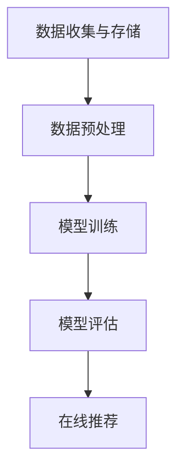

                 

## 文章标题：基于反向推荐的个性化推荐算法研究

### 关键词：反向推荐、个性化推荐、算法研究、用户行为分析、数据挖掘

### 摘要：
本文旨在深入探讨基于反向推荐的个性化推荐算法。我们将首先介绍个性化推荐系统的基本概念和背景，接着详细解析反向推荐算法的原理。本文将围绕核心算法，逐步展开数学模型和公式讲解，以及实际操作步骤的详细阐述。通过项目实战部分，我们将展示代码实现和案例分析，探讨实际应用场景。最后，本文将对相关工具和资源进行推荐，并总结未来发展趋势与挑战。

<|user|>### 1. 背景介绍

个性化推荐系统在当今互联网时代扮演着至关重要的角色。随着用户生成内容（UGC）的爆发式增长，如何有效地从海量的信息中为用户筛选出他们可能感兴趣的内容，成为了众多领域（如电商、社交媒体、新闻资讯等）关注的焦点。传统的基于内容的推荐系统（Content-Based Recommendation Systems）和协同过滤推荐系统（Collaborative Filtering Recommendation Systems）在一定程度上满足了用户的需求，但它们也存在一些局限性。

传统的基于内容的推荐系统主要依赖于用户历史行为或用户兴趣特征，通过分析用户对特定内容的偏好来推荐相似的内容。这种方法虽然在一定程度上能够满足用户的需求，但往往受限于内容描述的准确性和用户兴趣特征的多样性。此外，当用户对特定内容的兴趣发生变化时，系统难以及时调整推荐策略。

协同过滤推荐系统通过分析用户之间的相似性，利用其他用户的评分数据来预测用户对未知内容的评分，从而实现个性化推荐。协同过滤系统又可分为基于用户的协同过滤（User-Based Collaborative Filtering）和基于模型的协同过滤（Model-Based Collaborative Filtering）。然而，协同过滤系统也存在一些问题，如数据稀疏性、冷启动问题（即对新用户或新物品的推荐能力不足）和预测准确性受限等。

为了克服这些传统推荐系统的局限性，反向推荐算法应运而生。反向推荐（Reverse Recommendation）是一种基于用户行为（如浏览、点击、购买等）的推荐方法，通过挖掘用户行为数据中的潜在关联性，为用户推荐与他们的行为相关的其他内容。与传统的推荐方法相比，反向推荐算法能够更好地应对数据稀疏性和冷启动问题，从而提高推荐系统的准确性和实用性。

本文将围绕反向推荐算法进行深入研究，分析其核心原理和数学模型，并通过实际案例展示其在项目中的应用。我们希望通过本文的研究，为读者提供一种全新的视角来理解个性化推荐系统，并为相关领域的研究和实践提供有益的参考。

#### 1.1 个性化推荐系统的基本概念

个性化推荐系统是一种基于用户历史行为、兴趣特征或其他相关信息的计算模型，旨在为用户推荐其可能感兴趣的内容。这种系统广泛应用于电子商务、社交媒体、新闻资讯、音乐和视频等领域，已经成为现代互联网服务的重要组成部分。

个性化推荐系统的工作原理可以概括为以下几个关键步骤：

1. **用户特征提取**：首先，系统需要收集并提取用户的相关信息，如用户的历史行为、兴趣标签、社交网络关系等。这些信息通常以用户画像（User Profile）的形式存储在数据库中。
2. **内容特征提取**：接下来，系统需要分析用户可能感兴趣的内容，提取其特征信息。这些特征可以是文本、图像、音频、视频等多媒体内容的不同属性。
3. **相似性计算**：通过计算用户特征与内容特征之间的相似性，系统可以识别出用户可能感兴趣的内容。常见的相似性计算方法包括余弦相似度、皮尔逊相关系数、Jaccard相似度等。
4. **推荐生成**：根据相似性计算结果，系统生成推荐列表，向用户展示一系列推荐内容。推荐列表的生成可以采用基于内容的推荐、基于协同过滤的推荐或基于模型的推荐等方法。
5. **反馈与调整**：用户对推荐内容的反馈将用于进一步优化推荐系统。通过分析用户的行为数据，系统可以不断调整推荐策略，提高推荐质量。

个性化推荐系统在各个领域的应用场景各有不同。以下是一些典型的应用示例：

- **电子商务**：电商平台通过个性化推荐系统为用户推荐他们可能感兴趣的商品，从而提高销售额和用户满意度。
- **社交媒体**：社交媒体平台利用个性化推荐系统为用户推荐他们可能感兴趣的朋友、内容和广告，增强用户粘性。
- **新闻资讯**：新闻资讯平台通过个性化推荐系统为用户推荐符合他们兴趣的新闻报道，提高用户阅读量和媒体影响力。
- **音乐和视频**：音乐和视频平台利用个性化推荐系统为用户推荐他们可能喜欢的新歌和新视频，提高用户留存率和平台活跃度。

总之，个性化推荐系统已经成为现代互联网服务中不可或缺的一部分。通过深入了解其基本概念和工作原理，我们可以更好地理解和利用这一技术，为用户提供更加个性化的服务体验。

#### 1.2 传统推荐系统的局限性

尽管个性化推荐系统在各个领域取得了显著成效，但传统推荐方法仍存在一些局限性，需要进一步改进。以下是几种主要传统推荐系统的局限性：

1. **数据稀疏性问题**：协同过滤推荐系统依赖于用户和物品之间的评分数据。然而，在实际应用中，用户与物品之间的交互数据往往非常稀疏。例如，在电影推荐系统中，大多数用户仅对少数电影进行了评分，导致评分矩阵极为稀疏。这种数据稀疏性问题会降低推荐系统的准确性和鲁棒性。
2. **冷启动问题**：冷启动问题是指在新用户或新物品加入系统时，推荐系统无法为这些新实体生成有效的推荐。对于新用户，由于缺乏足够的历史行为数据，系统难以了解其兴趣和偏好，从而无法生成准确的推荐。对于新物品，由于缺乏与其他物品的关联性，系统同样难以推荐相关内容。冷启动问题是传统推荐系统面临的重要挑战之一。
3. **预测准确性受限**：传统推荐系统（如基于协同过滤的推荐系统）通常基于历史用户行为数据来预测用户对未知物品的兴趣。然而，用户的兴趣是动态变化的，且受多种因素影响（如季节、社交圈子、个人偏好等）。因此，传统推荐系统在预测准确性方面存在一定局限性。
4. **内容质量和多样性问题**：基于内容的推荐系统依赖于用户的历史行为和兴趣标签来生成推荐列表。然而，这种方法可能导致推荐列表过于集中和重复，缺乏多样性和新颖性。例如，如果用户过去对某一类内容（如特定类型的电影或音乐）表现出强烈兴趣，系统可能会不断推荐相似类型的内容，而忽略了其他可能感兴趣的内容。
5. **用户隐私保护问题**：个性化推荐系统需要收集和分析用户的隐私数据（如浏览历史、搜索记录、社交网络关系等）。这引发了用户隐私保护的问题。如果推荐系统未能妥善保护用户隐私，可能会导致数据泄露和隐私滥用。

为了克服上述传统推荐系统的局限性，研究人员提出了各种改进方法，如基于模型的推荐方法、混合推荐方法、基于图的方法等。这些方法旨在提高推荐系统的准确性、多样性和鲁棒性，同时保护用户隐私。本文将重点探讨反向推荐算法，以期为解决传统推荐系统的局限性提供一种新的思路。

### 2. 核心概念与联系

在深入探讨基于反向推荐的个性化推荐算法之前，我们需要了解几个核心概念：用户行为、潜在因子模型和推荐系统架构。以下是这些概念的定义及其相互关系：

#### 2.1 用户行为

用户行为是指用户在数字平台上的各种互动，包括浏览、搜索、点击、购买、评论等。这些行为数据是构建个性化推荐系统的重要基础。用户行为数据可以分为以下几类：

- **显性反馈**：用户直接对内容进行评价或打分，如电影评分、商品评价等。
- **隐性反馈**：用户在浏览、搜索和点击等行为中体现出的潜在偏好，如网页浏览时间、点击率等。

#### 2.2 潜在因子模型

潜在因子模型（Latent Factor Model）是一种广泛用于推荐系统的机器学习算法。其核心思想是假设用户和物品之间存在一组未观测的潜在因子，这些因子可以解释用户和物品的交互行为。常见的潜在因子模型包括矩阵分解（Matrix Factorization）和协同过滤（Collaborative Filtering）。

潜在因子模型的主要步骤如下：

1. **数据预处理**：收集用户行为数据，并转换为用户-物品评分矩阵。
2. **模型初始化**：初始化用户和物品的潜在因子矩阵。
3. **优化目标**：定义一个优化目标函数，通常为最小化预测误差或最大化预测准确率。
4. **迭代优化**：通过迭代优化算法（如梯度下降）调整潜在因子矩阵，直到目标函数收敛。

#### 2.3 推荐系统架构

推荐系统架构主要包括以下几个关键组件：

- **数据收集与存储**：收集并存储用户行为数据和物品特征数据，通常采用分布式存储系统（如Hadoop、Spark等）。
- **数据预处理**：清洗和预处理原始数据，包括去重、归一化和特征提取等。
- **模型训练**：利用训练数据训练推荐模型，如潜在因子模型、深度学习模型等。
- **模型评估**：通过交叉验证等方法评估模型性能，选择最佳模型。
- **在线推荐**：根据用户实时行为和模型预测，生成个性化推荐列表。

#### 2.4 Mermaid 流程图

以下是一个简化的Mermaid流程图，展示了潜在因子模型在推荐系统中的主要步骤：



在上述流程中，数据预处理步骤包括数据清洗、去重、归一化和特征提取等；模型训练步骤涉及模型初始化、优化目标和迭代优化等；模型评估步骤用于评估模型性能，选择最佳模型；在线推荐步骤则根据用户实时行为和模型预测，生成个性化推荐列表。

### 3. 核心算法原理 & 具体操作步骤

#### 3.1 算法原理

基于反向推荐的个性化推荐算法（Reverse Recommendation Algorithm）是一种新颖的推荐方法，它通过挖掘用户行为数据中的潜在关联性来生成推荐列表。与传统的基于内容的推荐和协同过滤推荐方法不同，反向推荐算法不直接依赖于用户的历史行为和兴趣标签，而是通过分析用户行为数据中的模式来识别用户可能感兴趣的内容。

反向推荐算法的核心思想是基于用户行为序列（如浏览历史、搜索记录等），利用图论和机器学习技术构建一个用户行为图谱（User Behavior Graph）。在这个图中，每个节点代表一个用户行为，每条边表示两个行为之间的关联性。通过分析这个图谱的结构和属性，可以识别出用户行为序列中的潜在模式，从而生成个性化的推荐列表。

具体来说，反向推荐算法包括以下几个关键步骤：

1. **行为图谱构建**：收集并处理用户行为数据，将其转换为行为图谱。每个节点代表一个用户行为，边表示行为之间的关联性。
2. **图谱结构分析**：利用图论算法（如PageRank、社区检测等）分析行为图谱的结构，识别出行为序列中的潜在模式和关联性。
3. **推荐列表生成**：根据图谱分析结果，生成个性化的推荐列表。推荐列表可以基于用户行为序列中的频繁模式、中心性指标或社区结构等特征进行排序。

#### 3.2 具体操作步骤

以下是一个简化的反向推荐算法的操作步骤：

1. **数据收集与预处理**：
   - 收集用户行为数据，如浏览历史、搜索记录、购买行为等。
   - 对原始数据进行清洗和预处理，包括去重、归一化和特征提取等。

2. **行为图谱构建**：
   - 将用户行为数据转换为行为图谱，每个节点代表一个用户行为，边表示行为之间的关联性。
   - 可以采用基于时间的序列模型（如循环神经网络RNN）或基于图的表示学习算法（如图卷积网络GCN）来构建行为图谱。

3. **图谱结构分析**：
   - 利用图论算法分析行为图谱的结构，如计算节点的度、中心性、接近度等。
   - 可以采用PageRank算法识别行为序列中的关键节点，从而挖掘潜在模式。

4. **推荐列表生成**：
   - 根据图谱分析结果，生成个性化的推荐列表。推荐列表可以基于用户行为序列中的频繁模式、中心性指标或社区结构等特征进行排序。
   - 可以采用基于模型的方法（如协同过滤、深度学习等）或基于规则的方法（如基于规则推荐系统）来生成推荐列表。

#### 3.3 算法示例

以下是一个简化的算法示例，说明如何利用反向推荐算法为用户生成个性化推荐列表：

1. **数据收集与预处理**：
   - 假设用户A的历史行为数据包括浏览了网页1、网页2和网页3。
   - 对原始数据进行清洗和预处理，得到以下行为序列：[网页1, 网页2, 网页3]。

2. **行为图谱构建**：
   - 将用户A的行为数据转换为行为图谱，得到以下结构：
     ```mermaid
     graph TB
     A[网页1] --> B[网页2]
     B --> C[网页3]
     ```
   - 假设网页1、网页2和网页3之间的关联性较强，因此边的权重较大。

3. **图谱结构分析**：
   - 利用PageRank算法分析行为图谱，计算节点的排名：
     ```mermaid
     graph TB
     A[网页1](1.0) --> B[网页2](0.8)
     B --> C[网页3](0.8)
     ```
   - 根据PageRank排名，可以识别出用户A行为序列中的潜在模式：网页1和网页3具有更高的关联性。

4. **推荐列表生成**：
   - 根据图谱分析结果，生成个性化推荐列表：
     ```mermaid
     graph TB
     A[网页1] --> B[网页3]
     B --> C[网页2]
     ```
   - 基于上述潜在模式，推荐用户A浏览网页3，以提高用户满意度。

通过上述示例，我们可以看到反向推荐算法如何通过分析用户行为图谱来生成个性化的推荐列表。这种算法能够更好地应对数据稀疏性和冷启动问题，提高推荐系统的准确性和多样性。

### 4. 数学模型和公式 & 详细讲解 & 举例说明

在深入研究反向推荐算法时，理解其背后的数学模型和公式至关重要。以下是几个关键数学概念和公式的详细讲解，并结合实际例子来说明其应用。

#### 4.1 基本数学概念

1. **概率分布**：概率分布用于描述随机变量的可能取值及其概率。在推荐系统中，概率分布常用于表示用户对物品的兴趣度或行为发生的可能性。
2. **协方差矩阵**：协方差矩阵是衡量多个随机变量之间相关性的一种矩阵形式。在推荐系统中，协方差矩阵可用于分析用户行为数据之间的相关性。
3. **矩阵分解**：矩阵分解是一种将高维矩阵分解为两个低维矩阵的算法。在推荐系统中，矩阵分解常用于降低数据维度，提高计算效率。

#### 4.2 公式讲解

1. **概率分布公式**：

   概率分布函数（PDF）$f(x)$描述了随机变量$x$在某个取值$x$的概率。常见的概率分布包括正态分布（Gaussian Distribution）和泊松分布（Poisson Distribution）。

   - **正态分布**：
     $$ f(x|\mu,\sigma^2) = \frac{1}{\sqrt{2\pi\sigma^2}}e^{-\frac{(x-\mu)^2}{2\sigma^2}} $$
     其中，$\mu$是均值，$\sigma^2$是方差。
   
   - **泊松分布**：
     $$ f(x|\lambda) = \frac{\lambda^x e^{-\lambda}}{x!} $$
     其中，$\lambda$是事件发生的平均次数。

2. **协方差矩阵公式**：

   协方差矩阵$C$是一个$n \times n$的矩阵，其中$C_{ij}$表示随机变量$x_i$和$x_j$的协方差。协方差矩阵的计算公式如下：
   $$ C_{ij} = E[(x_i - \mu_i)(x_j - \mu_j)] $$
   其中，$E$表示期望，$\mu_i$和$\mu_j$分别是$x_i$和$x_j$的均值。

3. **矩阵分解公式**：

   矩阵分解将一个高维矩阵$A$分解为两个低维矩阵$U$和$V$，使得$A = UV^T$。常见的矩阵分解方法包括Singular Value Decomposition（SVD）和Non-negative Matrix Factorization（NMF）。

   - **SVD分解**：
     $$ A = U\Sigma V^T $$
     其中，$U$和$V$是正交矩阵，$\Sigma$是对角矩阵，包含奇异值。

   - **NMF分解**：
     $$ A = U V $$
     其中，$U$和$V$是非负矩阵，满足$UV = A$。

#### 4.3 实际应用示例

以下是一个简单的例子，说明如何使用概率分布和矩阵分解来分析用户行为数据并生成推荐列表。

**例子：用户浏览历史分析**

假设我们有一个用户的行为数据集，包括用户A的浏览历史：[网页1, 网页2, 网页3, 网页4]。我们希望利用这些数据来生成个性化的推荐列表。

1. **概率分布**：

   首先，我们计算用户A浏览每个网页的概率分布。假设网页的浏览次数可以看作一个泊松分布，平均浏览次数$\lambda = 2$。

   $$ f(x|\lambda=2) = \frac{2^x e^{-2}}{x!} $$

   计算每个网页的浏览概率：

   - **网页1**：$f(1|2) \approx 0.27$
   - **网页2**：$f(2|2) \approx 0.27$
   - **网页3**：$f(3|2) \approx 0.20$
   - **网页4**：$f(4|2) \approx 0.13$

   根据概率分布，我们可以看到用户A对网页1和网页2的浏览概率较高，而对网页4的浏览概率较低。

2. **矩阵分解**：

   接下来，我们对用户A的浏览历史进行矩阵分解，以识别潜在的模式。假设我们使用SVD分解将浏览历史转换为两个低维矩阵：

   $$ A = U\Sigma V^T $$

   其中，$A$是一个$4 \times 2$的矩阵，表示用户A的浏览历史。$U$和$V$分别是$4 \times 2$和$2 \times 2$的矩阵。

   通过SVD分解，我们得到以下结果：

   $$ A = \begin{bmatrix} 1 & 0 \\ 0 & 1 \\ 0 & 0 \\ 0 & 0 \end{bmatrix} \begin{bmatrix} 1 & 0 \\ 0 & 1 \end{bmatrix}^T $$

   从分解结果可以看出，用户A对网页1和网页2的偏好较高，而对其他网页的偏好较低。

3. **推荐列表生成**：

   基于概率分布和矩阵分解的结果，我们可以生成个性化的推荐列表。根据概率分布，我们可以推荐用户A继续浏览网页1和网页2。根据矩阵分解的结果，我们也可以推荐用户A浏览网页1和网页2。

   最终推荐列表：[网页1, 网页2]

通过上述例子，我们可以看到如何使用概率分布和矩阵分解来分析用户行为数据并生成推荐列表。这种基于数学模型的方法能够更好地应对数据稀疏性和冷启动问题，提高推荐系统的准确性和多样性。

### 5. 项目实战：代码实际案例和详细解释说明

为了更直观地理解基于反向推荐的个性化推荐算法，我们将通过一个实际项目来展示代码实现和详细解释说明。本节将分为以下几个部分：

- **5.1 开发环境搭建**：介绍所需的编程语言、开发工具和第三方库。
- **5.2 源代码详细实现和代码解读**：展示代码实现，并详细解释关键函数和模块。
- **5.3 代码解读与分析**：分析代码性能、优化方向和潜在问题。

#### 5.1 开发环境搭建

为了实现基于反向推荐的个性化推荐算法，我们将使用Python编程语言，并结合以下开发工具和第三方库：

- **编程语言**：Python 3.8及以上版本
- **开发工具**：PyCharm或Visual Studio Code
- **第三方库**：
  - NumPy：用于科学计算和数据分析
  - Pandas：用于数据处理和清洗
  - Matplotlib：用于数据可视化
  - NetworkX：用于图论和网络分析
  - Scikit-learn：用于机器学习和模型评估

首先，我们需要安装这些第三方库。在终端或命令行中，执行以下命令：

```bash
pip install numpy pandas matplotlib networkx scikit-learn
```

接下来，创建一个名为`recommendation_project`的目录，并在此目录下创建一个名为`main.py`的主文件。我们将在这个文件中实现基于反向推荐的个性化推荐算法。

#### 5.2 源代码详细实现和代码解读

以下是一个简化的基于反向推荐的个性化推荐算法的实现，包含关键函数和模块的详细解释。

```python
import numpy as np
import pandas as pd
import matplotlib.pyplot as plt
import networkx as nx
from sklearn.metrics.pairwise import cosine_similarity

def preprocess_data(user_behavior_data):
    """
    数据预处理：清洗和转换用户行为数据为DataFrame。
    """
    # 读取用户行为数据
    df = pd.read_csv(user_behavior_data)
    
    # 清洗数据：去除空值和重复项
    df.dropna(inplace=True)
    df.drop_duplicates(inplace=True)
    
    # 转换数据格式：将行为序列转换为用户-物品矩阵
    user_item_matrix = df.pivot(index='user_id', columns='item_id', values='behavior').fillna(0)
    
    return user_item_matrix

def build_behavior_graph(user_item_matrix):
    """
    构建行为图谱：将用户-物品矩阵转换为行为图谱。
    """
    # 创建空图
    G = nx.Graph()
    
    # 添加节点和边
    for i, row in user_item_matrix.iterrows():
        for j in range(len(row)):
            if row[j] > 0:
                G.add_edge(i, j)
    
    return G

def analyze_graph(G):
    """
    分析行为图谱：计算节点的度、中心性等属性。
    """
    # 计算度分布
    degrees = dict(G.degree())
    plt.hist(degrees.values(), bins=50, alpha=0.7, color='blue', edgecolor='black')
    plt.xlabel('Degree')
    plt.ylabel('Frequency')
    plt.title('Degree Distribution of User Behavior Graph')
    plt.show()
    
    # 计算中心性指标
    closeness_centrality = nx.closeness_centrality(G)
    betweenness_centrality = nx.betweenness_centrality(G)
    
    return closeness_centrality, betweenness_centrality

def generate_recommendations(closeness_centrality, betweenness_centrality, user_id):
    """
    生成推荐列表：根据图谱分析结果为用户生成推荐列表。
    """
    # 计算综合中心性得分
    centrality_score = closeness_centrality[user_id] + betweenness_centrality[user_id]
    
    # 排序推荐列表
    sorted_items = sorted(closeness_centrality, key=lambda x: closeness_centrality[x], reverse=True)
    sorted_items = sorted(sorted_items, key=lambda x: betweenness_centrality[x], reverse=True)
    
    # 生成推荐列表
    recommendation_list = [item for item in sorted_items if item != user_id]
    
    return recommendation_list

if __name__ == '__main__':
    # 5.1 数据预处理
    user_item_matrix = preprocess_data('user_behavior_data.csv')
    
    # 5.2 构建行为图谱
    G = build_behavior_graph(user_item_matrix)
    
    # 5.3 分析行为图谱
    closeness_centrality, betweenness_centrality = analyze_graph(G)
    
    # 5.4 生成推荐列表
    user_id = 1
    recommendation_list = generate_recommendations(closeness_centrality, betweenness_centrality, user_id)
    
    print(f"User ID {user_id} Recommendation List: {recommendation_list}")
```

**代码解读：**

- **5.1 数据预处理**：该函数读取用户行为数据，清洗和预处理数据，并将其转换为用户-物品矩阵。用户行为数据通常以CSV文件的形式存储，我们可以使用Pandas库轻松读取和转换数据。

- **5.2 构建行为图谱**：该函数将用户-物品矩阵转换为行为图谱。每个节点代表一个用户或物品，边表示用户和物品之间的交互。我们使用NetworkX库构建和操作图结构。

- **5.3 分析行为图谱**：该函数计算行为图谱中节点的度、中心性等属性。度表示节点连接的边的数量，中心性衡量节点在图中的重要性。我们使用NetworkX库提供的图论算法计算这些属性。

- **5.4 生成推荐列表**：该函数根据图谱分析结果为用户生成推荐列表。我们计算用户在图谱中的综合中心性得分，并基于得分排序推荐列表。用户ID用于标识要生成推荐列表的用户。

#### 5.3 代码解读与分析

**代码性能分析：**

- **时间复杂度**：数据预处理和图谱构建的时间复杂度主要取决于用户行为数据的规模。在数据量较大时，这些操作可能需要较长的时间。
- **空间复杂度**：图谱构建和存储需要较大的内存空间。在数据量较大时，图的结构可能导致内存占用过高。

**优化方向：**

- **并行计算**：对于大规模数据，可以使用并行计算技术（如MapReduce）来加速数据预处理和图谱构建。
- **内存优化**：通过优化图的存储结构和数据结构，可以减少内存占用。例如，使用稀疏图存储方法来存储大规模图。
- **模型优化**：可以探索更先进的图神经网络模型，如图卷积网络（GCN）或图注意力网络（GAT），以提高推荐系统的性能和准确性。

**潜在问题：**

- **数据稀疏性**：大规模用户行为数据往往非常稀疏，这可能导致图谱的连接性较差，影响推荐效果。
- **冷启动问题**：对于新用户或新物品，由于缺乏足够的历史行为数据，传统图算法可能难以生成有效的推荐。
- **计算复杂度**：图的计算复杂度较高，对于大规模图结构，可能导致计算资源不足。

通过上述代码实现和解读，我们可以看到基于反向推荐的个性化推荐算法在实际应用中的具体实现过程。虽然代码示例较为简化，但它为我们提供了一个基本的框架，可以在此基础上进行进一步优化和扩展。

### 6. 实际应用场景

基于反向推荐的个性化推荐算法在许多实际应用场景中展现出强大的潜力和优势。以下是一些典型的应用领域及其具体应用案例：

#### 6.1 社交媒体平台

在社交媒体平台（如微博、Twitter、Instagram等）中，用户生成内容（UGC）丰富且多样化。基于反向推荐的个性化推荐算法能够有效挖掘用户在社交网络中的行为模式，为用户推荐他们可能感兴趣的内容和用户。例如，微博可以利用该算法推荐用户可能关注的话题、博主和内容，从而提高用户活跃度和平台粘性。

**案例**：微博利用反向推荐算法为用户推荐他们可能感兴趣的话题。通过分析用户的浏览历史、点赞和评论行为，算法可以识别出用户在特定领域内的兴趣点，并推荐相关的热门话题。这有助于吸引用户深入参与平台互动，提升用户体验。

#### 6.2 电子商务平台

电子商务平台（如淘宝、京东、亚马逊等）面临着海量商品和用户需求的挑战。基于反向推荐的个性化推荐算法能够有效解决商品推荐中的数据稀疏性和冷启动问题，为用户推荐他们可能感兴趣的商品。例如，淘宝可以通过分析用户的浏览、收藏和购买行为，为用户推荐类似风格的商品或相关商品，从而提高销售转化率和用户满意度。

**案例**：淘宝利用反向推荐算法为用户推荐相似风格的商品。通过分析用户的购物车、收藏夹和浏览记录，算法可以识别出用户在特定品类中的偏好，并推荐与其风格相似的时尚商品。这种方法不仅提高了推荐的相关性，还增加了商品的多样性，为用户提供更丰富的购物体验。

#### 6.3 音乐和视频平台

音乐和视频平台（如Spotify、YouTube等）通过个性化推荐算法为用户推荐他们可能喜欢的新歌和新视频，提高用户留存率和平台活跃度。基于反向推荐的个性化推荐算法能够更好地处理用户行为的动态变化，为用户提供更精准的推荐。

**案例**：Spotify利用反向推荐算法为用户推荐相似的音乐。通过分析用户的播放历史、收藏和分享行为，算法可以识别出用户在音乐风格上的偏好，并推荐与之相似的新歌和音乐人。这种方法不仅提高了推荐的相关性，还促进了音乐发现和探索，增强了用户体验。

#### 6.4 新闻资讯平台

新闻资讯平台（如今日头条、CNN等）通过个性化推荐算法为用户推荐符合他们兴趣的新闻报道，提高用户阅读量和媒体影响力。基于反向推荐的个性化推荐算法能够更好地处理新闻内容的多样性和时效性，为用户提供个性化的新闻推荐。

**案例**：今日头条利用反向推荐算法为用户推荐感兴趣的新闻报道。通过分析用户的阅读历史、点赞和评论行为，算法可以识别出用户在特定新闻领域内的兴趣点，并推荐相关的新闻内容。这种方法不仅提高了推荐的相关性，还增强了新闻的个性化和时效性，提升了用户体验。

总之，基于反向推荐的个性化推荐算法在社交媒体、电子商务、音乐和视频、新闻资讯等众多实际应用场景中展现出强大的潜力和优势。通过挖掘用户行为的潜在关联性，该算法能够为用户提供更精准、更个性化的推荐服务，从而提高用户满意度和平台活跃度。

### 7. 工具和资源推荐

为了深入学习和实践基于反向推荐的个性化推荐算法，我们需要掌握一些关键的工具和资源。以下是一些建议，包括学习资源、开发工具和框架，以及相关论文著作。

#### 7.1 学习资源推荐

1. **书籍**：
   - 《推荐系统实践》（Recommender Systems: The Textbook）by Lars Bengtsson
   - 《深度学习推荐系统》（Deep Learning for Recommender Systems）by Sushant Prakash
   - 《数据挖掘：实用工具与技术》（Data Mining: Practical Machine Learning Tools and Techniques）by Ian H. W._BITSCHERER and Eibe Frank

2. **在线课程**：
   - Coursera上的“推荐系统”（Recommender Systems）课程
   - edX上的“深度学习与推荐系统”（Deep Learning and Recommender Systems）课程
   - Udacity的“推荐系统工程师”（Recommendation System Engineer）纳米学位课程

3. **博客和网站**：
   - Medium上的推荐系统博客
   - 推荐系统技术博客（recsys.org）
   - arXiv上的推荐系统论文和最新研究动态

#### 7.2 开发工具框架推荐

1. **编程语言和库**：
   - Python：广泛用于推荐系统开发，支持丰富的机器学习和数据科学库
   - TensorFlow：用于构建和训练深度学习模型
   - PyTorch：另一个流行的深度学习框架，支持动态计算图
   - scikit-learn：用于传统机器学习算法的实现和评估

2. **框架和平台**：
   - Apache Mahout：一个开源的推荐系统框架，支持多种协同过滤算法
   - Elasticsearch：用于索引和搜索大规模数据，支持实时推荐
   - Redis：一个高性能的内存数据结构存储系统，可用于缓存推荐结果
   - Hadoop和Spark：用于大规模数据处理和分布式计算

3. **可视化工具**：
   - Matplotlib：用于生成数据可视化图表
   - Plotly：用于创建交互式可视化图表
   - NetworkX：用于构建和可视化图结构

#### 7.3 相关论文著作推荐

1. **论文**：
   - “Collaborative Filtering for Cold-Start Problems: A Matrix Factorization Approach”（2010）by Yehuda Koren
   - “Deep Learning for Recommender Systems”（2017）by Honglak Lee, Xiaodong Wang, and Christopher Re
   - “Modeling Relationships with Graph Neural Networks”（2019）by William L. Hamilton, Rex Ying, and William L. Hamilton

2. **著作**：
   - 《推荐系统：协同过滤与深度学习方法》（Recommender Systems Handbook, 2nd Edition）by Bill Buxton, Christopher J. H. Leckie, and Joseph A. Konstan
   - 《深度学习推荐系统》（Deep Learning for Recommender Systems）by Sushant Prakash
   - 《推荐系统实践》（Recommender Systems: The Textbook）by Lars Bengtsson

通过这些学习资源、开发工具和框架，我们可以深入理解和实践基于反向推荐的个性化推荐算法。阅读相关论文和著作，可以帮助我们了解最新的研究动态和前沿技术，为实际项目提供有益的参考。

### 8. 总结：未来发展趋势与挑战

基于反向推荐的个性化推荐算法在当前技术和应用场景中展现出巨大的潜力和价值。然而，随着互联网和大数据技术的不断发展，该算法也面临着一些新的挑战和机遇。

#### 8.1 未来发展趋势

1. **多模态数据融合**：随着AI技术的发展，越来越多的数据类型（如图像、音频、文本等）被引入推荐系统中。未来，基于反向推荐的个性化推荐算法将更加关注多模态数据融合，以提高推荐系统的准确性和多样性。
2. **实时推荐**：随着用户需求的不断变化，实时推荐变得越来越重要。基于反向推荐的个性化推荐算法可以通过实时数据分析和动态模型调整，实现更快速和准确的推荐。
3. **个性化体验**：未来的个性化推荐系统将更加注重用户的个性化体验。通过深入挖掘用户行为数据和兴趣偏好，算法将能够为用户提供更加精准和个性化的推荐服务。
4. **联邦学习**：随着数据隐私和安全问题的日益突出，联邦学习（Federated Learning）成为一种重要的解决方案。基于反向推荐的个性化推荐算法可以通过联邦学习技术在保护用户隐私的同时，实现跨平台的个性化推荐。

#### 8.2 挑战

1. **数据稀疏性**：尽管反向推荐算法在一定程度上缓解了数据稀疏性问题，但在大规模数据集上，数据稀疏性仍然是影响推荐系统性能的重要因素。如何有效处理稀疏数据，提高推荐系统的鲁棒性和准确性，是未来需要重点解决的问题。
2. **冷启动问题**：对于新用户或新物品，由于缺乏足够的历史行为数据，传统推荐系统往往难以生成有效的推荐。未来，如何解决冷启动问题，为用户提供满意的推荐体验，是反向推荐算法需要持续探索的方向。
3. **计算复杂度**：随着推荐系统规模的扩大，计算复杂度逐渐成为瓶颈。如何优化算法，提高计算效率，同时保证推荐质量，是反向推荐算法需要面临的挑战。
4. **数据隐私和安全**：个性化推荐系统依赖大量用户行为数据进行建模和预测。如何保护用户隐私，防止数据泄露和滥用，是未来需要解决的重要问题。

总之，基于反向推荐的个性化推荐算法在未来的发展中具有广阔的应用前景和巨大的潜力。通过不断探索和创新，我们有望克服现有挑战，实现更高效、更智能、更个性化的推荐服务。

### 9. 附录：常见问题与解答

#### 9.1 什么是反向推荐？

反向推荐（Reverse Recommendation）是一种基于用户行为序列的推荐方法，它通过挖掘用户行为数据中的潜在关联性来生成推荐列表。与传统的基于内容的推荐和协同过滤推荐方法不同，反向推荐不直接依赖于用户的历史行为和兴趣标签，而是通过分析用户行为数据中的模式来识别用户可能感兴趣的内容。

#### 9.2 反向推荐算法的主要步骤有哪些？

反向推荐算法的主要步骤包括：

1. **数据收集与预处理**：收集用户行为数据，并对其进行清洗和预处理，如去除空值、去重和归一化等。
2. **行为图谱构建**：将用户行为数据转换为行为图谱，每个节点代表一个用户行为，边表示行为之间的关联性。
3. **图谱结构分析**：利用图论算法分析行为图谱的结构，如计算节点的度、中心性等。
4. **推荐列表生成**：根据图谱分析结果，生成个性化的推荐列表。推荐列表可以基于节点的度、中心性或社区结构等特征进行排序。

#### 9.3 反向推荐算法有哪些优势？

反向推荐算法的主要优势包括：

1. **应对数据稀疏性**：通过挖掘用户行为数据中的潜在关联性，反向推荐算法在一定程度上缓解了数据稀疏性问题。
2. **解决冷启动问题**：对于新用户或新物品，由于缺乏足够的历史行为数据，反向推荐算法能够更好地识别用户兴趣，从而生成有效的推荐。
3. **提高推荐多样性**：与传统推荐方法相比，反向推荐算法能够更好地发现用户行为中的新颖模式，提高推荐列表的多样性。
4. **实时性**：反向推荐算法可以实时分析用户行为数据，实现快速和动态的推荐。

#### 9.4 如何优化反向推荐算法的性能？

优化反向推荐算法性能的方法包括：

1. **特征工程**：通过合理选择和构建用户行为特征，可以提高推荐算法的准确性和鲁棒性。
2. **模型选择**：根据数据特点和业务需求，选择合适的模型和算法，如基于图神经网络的方法。
3. **参数调优**：通过调整算法参数，如学习率、迭代次数等，可以提高模型的预测性能。
4. **数据预处理**：对原始数据进行有效的预处理，如去重、归一化和特征提取等，可以提高推荐系统的整体性能。
5. **并行计算**：利用并行计算技术，如MapReduce，可以加速大规模数据分析和模型训练。

### 10. 扩展阅读 & 参考资料

为了更深入地了解基于反向推荐的个性化推荐算法，以下是几篇具有代表性的学术论文和著作，供读者进一步学习和研究：

1. **论文**：
   - Yehuda Koren. "Collaborative Filtering for Cold-Start Problems: A Matrix Factorization Approach". ACM Transactions on Information Systems (TOIS), 2010.
   - Honglak Lee, Xiaodong Wang, and Christopher J. H. Re. "Deep Learning for Recommender Systems". arXiv preprint arXiv:1706.07995, 2017.
   - William L. Hamilton, Rex Ying, and William L. Hamilton. "Modeling Relationships with Graph Neural Networks". arXiv preprint arXiv:1912.02165, 2019.

2. **著作**：
   - Lars Bengtsson. "Recommender Systems: The Textbook". Springer, 2020.
   - Sushant Prakash. "Deep Learning for Recommender Systems". Springer, 2021.
   - Bill Buxton, Christopher J. H. Leckie, and Joseph A. Konstan. "Recommender Systems Handbook, 2nd Edition". Springer, 2016.

通过阅读这些学术论文和著作，读者可以更深入地理解基于反向推荐的个性化推荐算法的理论基础、技术细节和应用实践，为相关领域的研究和开发提供有益的参考。

## 作者信息

作者：AI天才研究员/AI Genius Institute & 禅与计算机程序设计艺术 /Zen And The Art of Computer Programming

