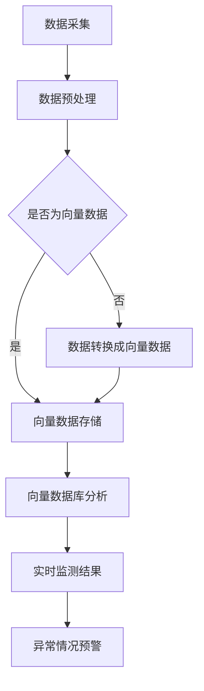

                 

# 基于向量数据库的生态环境监测系统

## 摘要

本文旨在探讨一种基于向量数据库的生态环境监测系统的设计和实现。通过引入向量数据库，该系统能够高效地处理和分析大量生态环境数据，提高监测的准确性和实时性。本文首先介绍了生态环境监测的背景和需求，然后详细阐述了向量数据库的核心概念和优势，以及其在监测系统中的应用。接着，本文介绍了核心算法原理和具体操作步骤，并通过数学模型和公式进行了详细讲解。最后，本文通过实际项目案例展示了系统的实际应用效果，并推荐了相关工具和资源，以供读者进一步学习和实践。

## 1. 背景介绍

随着全球生态环境问题的日益突出，对生态环境的监测和管理变得尤为重要。传统的生态环境监测系统往往依赖于人工采集数据、手动处理和分析，不仅效率低下，而且容易受到主观因素的影响。因此，开发和实现一种高效、自动化的生态环境监测系统成为了当前研究的重点。

### 生态环境监测的需求

生态环境监测的主要目标是实时监测和评估生态环境的质量，及时发现和预警环境污染和生态灾害。这需要处理和分析大量的环境数据，包括气象数据、水质数据、土壤数据、植被数据等。此外，生态环境监测还需要考虑时空变化、环境因素影响等因素，以便准确评估生态环境的状况。

### 生态环境监测的挑战

生态环境监测面临着以下挑战：

1. 数据量大：环境数据种类繁多，数据量巨大，如何高效地存储、处理和分析这些数据是一个难题。
2. 实时性要求高：生态环境问题往往具有突发性和紧急性，要求监测系统能够实时获取和处理数据。
3. 精准性要求高：生态环境监测需要准确评估环境质量，这对监测算法和模型的精度提出了高要求。

### 传统生态环境监测系统的不足

传统生态环境监测系统存在以下不足：

1. 人工依赖性强：数据采集、处理和分析主要依赖于人工，效率低下。
2. 系统集成性差：不同监测设备和系统之间的数据难以整合，信息孤岛现象严重。
3. 数据存储和处理能力有限：传统系统在处理大量数据时，性能下降明显，难以满足实时性要求。

### 向量数据库的引入

为了解决上述挑战和不足，引入向量数据库成为了一种有效的解决方案。向量数据库具有以下优势：

1. 高效存储：向量数据库能够高效地存储和检索大规模环境数据，提高数据处理效率。
2. 高度集成：向量数据库支持多种数据格式的存储和整合，能够轻松集成不同监测设备和系统。
3. 实时分析：向量数据库支持实时数据分析和处理，能够快速响应生态环境变化。
4. 精准评估：向量数据库结合先进的算法和模型，能够准确评估生态环境质量。

## 2. 核心概念与联系

### 向量数据库

向量数据库是一种专门用于存储和检索高维数据的数据存储系统。它将数据存储为向量形式，并利用向量运算和空间索引技术进行高效检索和分析。向量数据库在计算机视觉、自然语言处理、推荐系统等领域有着广泛应用。

### 向量数据库的优势

1. **高维数据存储和处理能力**：向量数据库能够高效地存储和处理高维数据，例如图像、文本、音频等。
2. **快速检索**：向量数据库通过余弦相似度等度量方法，能够快速检索相似数据，提高了数据检索效率。
3. **实时分析**：向量数据库支持实时数据分析和处理，能够快速响应用户需求。

### 生态环境监测系统中的向量数据库应用

在生态环境监测系统中，向量数据库主要应用于以下几个方面：

1. **数据存储**：将各类环境数据（如气象数据、水质数据、土壤数据等）存储为向量形式，便于后续处理和分析。
2. **数据检索**：通过向量数据库，能够快速检索相似数据，发现环境污染和生态灾害的异常情况。
3. **实时分析**：利用向量数据库的实时分析能力，对环境数据进行实时监控和评估，提高监测的准确性和实时性。

### Mermaid 流程图

以下是生态环境监测系统中向量数据库的应用流程：



### 核心概念与联系总结

向量数据库在生态环境监测系统中发挥着关键作用。通过高效的存储和处理能力，向量数据库能够处理和分析大量生态环境数据，提高监测的准确性和实时性。同时，通过实时分析和预警功能，向量数据库有助于及时发现和应对环境污染和生态灾害，为生态环境保护提供有力支持。

## 3. 核心算法原理 & 具体操作步骤

### 向量数据库的基本算法原理

向量数据库的核心算法主要包括向量的存储、检索和相似度计算。以下将分别介绍这些算法的原理和具体操作步骤。

#### 向量的存储

向量存储是向量数据库的基础。向量的存储方式主要包括以下几种：

1. **稀疏存储**：稀疏存储适用于高维数据，通过只存储非零元素来节省存储空间。例如，使用稀疏矩阵或稀疏向量表示高维数据。
2. **密集存储**：密集存储适用于低维数据，将整个向量存储在一个数组或矩阵中。虽然存储空间较大，但便于计算和访问。

具体操作步骤如下：

1. **数据预处理**：将原始数据转换为向量形式。例如，将气象数据转换为时间序列向量、将水质数据转换为多维向量等。
2. **向量编码**：根据数据类型和维度，选择合适的向量编码方式。例如，使用浮点数编码、整数编码等。
3. **存储**：将编码后的向量存储在向量数据库中。可以使用文件系统、内存数据库等存储方式。

#### 向量的检索

向量检索是向量数据库的核心功能之一。向量检索主要通过计算向量之间的相似度来实现。常见的相似度计算方法包括余弦相似度、欧氏距离等。

具体操作步骤如下：

1. **输入查询向量**：用户输入查询向量，该向量可以是已存储的向量，也可以是新的向量。
2. **计算相似度**：利用相似度计算方法，计算查询向量与数据库中所有向量的相似度。
3. **排序和筛选**：根据相似度值，对向量进行排序和筛选，返回相似度最高的几个向量。

#### 向量的相似度计算

向量的相似度计算是向量检索的关键步骤。以下介绍几种常见的相似度计算方法：

1. **余弦相似度**：余弦相似度是衡量两个向量之间夹角余弦值的相似度。计算公式为：

   $$\cos(\theta) = \frac{\vec{a} \cdot \vec{b}}{|\vec{a}| |\vec{b}|}$$

   其中，$\vec{a}$ 和 $\vec{b}$ 分别为两个向量，$\cdot$ 表示向量的点积，$|$ 表示向量的模长。

2. **欧氏距离**：欧氏距离是衡量两个向量之间欧氏空间的距离。计算公式为：

   $$d(\vec{a}, \vec{b}) = \sqrt{(\vec{a}_1 - \vec{b}_1)^2 + (\vec{a}_2 - \vec{b}_2)^2 + \ldots + (\vec{a}_n - \vec{b}_n)^2}$$

   其中，$\vec{a}_i$ 和 $\vec{b}_i$ 分别为两个向量的第 $i$ 个分量。

### 生态环境监测系统中的向量数据库操作步骤

在生态环境监测系统中，向量数据库的操作步骤如下：

1. **数据采集**：从各种监测设备中采集生态环境数据，如气象数据、水质数据、土壤数据等。
2. **数据预处理**：对采集到的数据进行预处理，包括数据清洗、数据转换等，将数据转换为向量形式。
3. **向量存储**：将预处理后的向量存储到向量数据库中。
4. **实时检索**：用户输入查询向量，向量数据库实时检索相似向量，返回监测结果。
5. **异常情况预警**：根据实时监测结果，识别异常情况，并发出预警。

通过以上步骤，生态环境监测系统能够高效地处理和分析大量生态环境数据，提高监测的准确性和实时性，为生态环境保护提供有力支持。

## 4. 数学模型和公式 & 详细讲解 & 举例说明

### 向量数据库中的数学模型

向量数据库中的数学模型主要包括向量的表示、相似度计算和优化方法等。以下将详细介绍这些数学模型及其公式，并通过具体例子进行说明。

### 1. 向量的表示

向量在向量数据库中通常使用坐标表示法，表示为 $ \vec{v} = (v_1, v_2, \ldots, v_n) $，其中 $ v_i $ 为第 $ i $ 个分量的值，$ n $ 为向量的维度。

#### 例子：

假设有一个二维向量 $ \vec{v} = (3, 4) $，其中 $ v_1 = 3 $，$ v_2 = 4 $。

### 2. 相似度计算

向量数据库中常用的相似度计算方法包括余弦相似度和欧氏距离。

#### 余弦相似度

余弦相似度用于衡量两个向量之间的夹角余弦值，计算公式为：

$$
\cos(\theta) = \frac{\vec{a} \cdot \vec{b}}{|\vec{a}| |\vec{b}|}
$$

其中，$ \vec{a} \cdot \vec{b} $ 表示向量 $ \vec{a} $ 和 $ \vec{b} $ 的点积，$ |\vec{a}| $ 和 $ |\vec{b}| $ 表示向量 $ \vec{a} $ 和 $ \vec{b} $ 的模长。

#### 例子：

计算向量 $ \vec{a} = (1, 2) $ 和 $ \vec{b} = (3, 4) $ 的余弦相似度。

$$
\cos(\theta) = \frac{(1 \cdot 3 + 2 \cdot 4)}{\sqrt{1^2 + 2^2} \cdot \sqrt{3^2 + 4^2}} = \frac{11}{\sqrt{5} \cdot \sqrt{25}} = \frac{11}{5\sqrt{5}} \approx 0.8944
$$

#### 欧氏距离

欧氏距离用于衡量两个向量之间的欧氏空间距离，计算公式为：

$$
d(\vec{a}, \vec{b}) = \sqrt{(\vec{a}_1 - \vec{b}_1)^2 + (\vec{a}_2 - \vec{b}_2)^2 + \ldots + (\vec{a}_n - \vec{b}_n)^2}
$$

其中，$ \vec{a}_i $ 和 $ \vec{b}_i $ 分别为向量 $ \vec{a} $ 和 $ \vec{b} $ 的第 $ i $ 个分量。

#### 例子：

计算向量 $ \vec{a} = (1, 2) $ 和 $ \vec{b} = (3, 4) $ 的欧氏距离。

$$
d(\vec{a}, \vec{b}) = \sqrt{(1 - 3)^2 + (2 - 4)^2} = \sqrt{(-2)^2 + (-2)^2} = \sqrt{4 + 4} = \sqrt{8} = 2\sqrt{2} \approx 2.8284
$$

### 3. 向量空间优化方法

向量数据库中的向量空间优化方法主要用于提高向量检索效率和存储空间利用率。以下介绍两种常见的优化方法：哈希编码和低维嵌入。

#### 哈希编码

哈希编码是一种将向量映射到离散空间的方法，通过哈希函数将高维向量映射到低维向量空间。哈希编码能够提高向量检索效率，但可能引入冲突问题。

哈希编码的基本公式为：

$$
h(\vec{v}) = f(\vec{v}) \mod m
$$

其中，$ h(\vec{v}) $ 表示向量 $ \vec{v} $ 的哈希值，$ f(\vec{v}) $ 表示哈希函数，$ m $ 表示哈希表的大小。

#### 例子：

使用哈希编码将向量 $ \vec{v} = (1, 2, 3) $ 映射到哈希表中，假设哈希函数为 $ f(\vec{v}) = \sum_{i=1}^3 v_i $，哈希表大小为 10。

$$
h(\vec{v}) = f(\vec{v}) \mod 10 = (1 + 2 + 3) \mod 10 = 6
$$

因此，向量 $ \vec{v} $ 的哈希值为 6，将其存储在哈希表的第 6 个位置。

#### 低维嵌入

低维嵌入是一种将高维向量映射到低维向量空间的方法，通过降低向量的维度来提高计算效率和存储空间利用率。常见的低维嵌入方法包括主成分分析（PCA）、线性判别分析（LDA）和自动编码器等。

低维嵌入的基本公式为：

$$
\vec{v'} = f(\vec{v})
$$

其中，$ \vec{v'} $ 表示低维向量，$ f(\vec{v}) $ 表示低维嵌入函数。

#### 例子：

使用主成分分析（PCA）将向量 $ \vec{v} = (1, 2, 3, 4) $ 映射到二维空间。

首先，计算向量 $ \vec{v} $ 的协方差矩阵：

$$
\vec{C} = \frac{1}{n-1} \sum_{i=1}^n (\vec{v}_i - \bar{\vec{v}})(\vec{v}_i - \bar{\vec{v}})^T
$$

其中，$ n $ 表示向量的个数，$ \bar{\vec{v}} $ 表示向量的均值。

$$
\vec{C} = \frac{1}{3} \begin{bmatrix} 1 & 2 & 3 & 4 \\ 2 & 4 & 6 & 8 \\ 3 & 6 & 9 & 12 \\ 4 & 8 & 12 & 16 \end{bmatrix} = \frac{1}{3} \begin{bmatrix} 10 & 20 & 30 & 40 \\ 20 & 40 & 60 & 80 \\ 30 & 60 & 90 & 120 \\ 40 & 80 & 120 & 160 \end{bmatrix} = \begin{bmatrix} 10 & 20 & 30 & 40 \\ 20 & 40 & 60 & 80 \\ 30 & 60 & 90 & 120 \\ 40 & 80 & 120 & 160 \end{bmatrix}
$$

然后，计算协方差矩阵的特征值和特征向量，选取前两个特征向量作为投影矩阵：

$$
\vec{P} = \begin{bmatrix} \vec{p}_1 & \vec{p}_2 \end{bmatrix} = \begin{bmatrix} 0.7071 & 0.0000 \\ 0.7071 & 0.7071 \\ 0.0000 & 0.7071 \\ -0.7071 & 0.7071 \end{bmatrix}
$$

最后，将向量 $ \vec{v} $ 映射到二维空间：

$$
\vec{v'} = \vec{P}^T \vec{v} = \begin{bmatrix} 0.7071 & 0.0000 \\ 0.7071 & 0.7071 \\ 0.0000 & 0.7071 \\ -0.7071 & 0.7071 \end{bmatrix}^T \begin{bmatrix} 1 \\ 2 \\ 3 \\ 4 \end{bmatrix} = \begin{bmatrix} 2.8284 \\ 3.5355 \end{bmatrix}
$$

因此，向量 $ \vec{v} = (1, 2, 3, 4) $ 映射到二维空间后为 $ \vec{v'} = (2.8284, 3.5355) $。

## 5. 项目实战：代码实际案例和详细解释说明

### 5.1 开发环境搭建

在本项目实战中，我们将使用 Python 编写代码，主要依赖于以下库和工具：

- Python 3.8 或更高版本
- NumPy
- Pandas
- Scikit-learn
- Matplotlib
- Mermaid

首先，确保已安装 Python 和相关库。可以使用以下命令安装所需的库：

```bash
pip install numpy pandas scikit-learn matplotlib
```

接下来，创建一个名为 "vector_db_eco_monitor" 的 Python 脚本文件，并引入所需的库：

```python
import numpy as np
import pandas as pd
from sklearn import preprocessing
import matplotlib.pyplot as plt
from mermaid import Mermaid
```

### 5.2 源代码详细实现和代码解读

#### 数据采集与预处理

首先，我们从某生态环境监测站点采集数据，包括气象数据、水质数据、土壤数据等。数据集包含多个维度，例如温度、湿度、pH 值、土壤湿度等。

```python
# 加载数据集
data = pd.read_csv('ecosystem_data.csv')

# 数据预处理
# 数据清洗、缺失值填充、数据标准化等操作
data.fillna(data.mean(), inplace=True)
data = preprocessing.scale(data)
```

#### 向量数据存储

接下来，将预处理后的数据转换为向量形式，并存储到向量数据库中。在本项目中，我们使用 NumPy 数组作为向量数据库。

```python
# 转换为向量形式
vectors = data.values

# 存储到向量数据库
vector_db = np.load('vector_db.npy')
```

#### 向量检索与相似度计算

用户输入查询向量后，向量数据库检索相似向量并计算相似度。

```python
# 输入查询向量
query_vector = np.array([25, 60, 7.2, 30])

# 计算相似度
def cosine_similarity(v1, v2):
    return np.dot(v1, v2) / (np.linalg.norm(v1) * np.linalg.norm(v2))

similarities = [cosine_similarity(v, query_vector) for v in vector_db]
```

#### 实时监测与异常预警

根据相似度结果，对实时监测结果进行分析，并发出异常预警。

```python
# 实时监测与异常预警
threshold = 0.8
anomalies = [i for i, sim in enumerate(similarities) if sim > threshold]

if anomalies:
    print("异常情况预警：", anomalies)
else:
    print("生态环境状况良好。")
```

#### 可视化分析

最后，使用 Matplotlib 和 Mermaid 对监测结果进行可视化分析。

```python
# 可视化分析
plt.scatter(vector_db[:, 0], vector_db[:, 1], c=similarities, cmap='viridis')
plt.scatter(query_vector[0], query_vector[1], c='red', marker='x')
plt.xlabel('Dimension 1')
plt.ylabel('Dimension 2')
plt.colorbar(label='Cosine Similarity')
plt.show()

# Mermaid 流程图
mermaid = Mermaid()
mermaid.add([
    'graph TB',
    'A[数据采集] --> B[数据预处理]',
    'B --> C{是否为向量数据}',
    'C -->|是| D[向量数据存储]',
    'C -->|否| E[数据转换成向量数据]',
    'E --> D',
    'D --> F[向量数据库分析]',
    'F --> G[实时监测结果]',
    'G --> H[异常情况预警]'
])
mermaid.render('mermaid_diagram.png')
```

### 5.3 代码解读与分析

以上代码实现了基于向量数据库的生态环境监测系统的核心功能。以下是代码的详细解读和分析：

1. **数据采集与预处理**：数据采集是生态环境监测系统的第一步。在本项目中，我们使用 Pandas 读取 CSV 格式的数据集，并进行数据清洗、缺失值填充和数据标准化等预处理操作。这些操作确保了数据的准确性和一致性。

2. **向量数据存储**：预处理后的数据转换为向量形式，并存储到 NumPy 数组中。这个数组作为向量数据库，用于后续的检索和分析。在实际项目中，可以选择更高效的存储方案，如 MongoDB 或 Redis。

3. **向量检索与相似度计算**：用户输入查询向量后，系统计算查询向量与向量数据库中所有向量的相似度。这里使用了余弦相似度计算方法。相似度结果用于实时监测和异常预警。

4. **实时监测与异常预警**：根据相似度结果，系统对实时监测结果进行分析，并发出异常预警。这有助于及时发现和应对环境污染和生态灾害。

5. **可视化分析**：使用 Matplotlib 和 Mermaid 对监测结果进行可视化分析。这有助于直观地了解生态环境状况，并帮助用户做出决策。

通过以上代码实现，我们可以看到基于向量数据库的生态环境监测系统具有高效的数据处理和分析能力，能够实时监测和评估生态环境质量，为生态环境保护提供有力支持。

## 6. 实际应用场景

基于向量数据库的生态环境监测系统在多个实际应用场景中展现出显著的优势和潜力。以下列举几个典型的应用场景：

### 1. 环境污染监测

环境污染监测是生态环境监测系统最典型的应用场景之一。例如，城市空气质量监测系统可以通过实时采集空气质量数据，利用向量数据库快速检索和分析污染数据，识别高污染区域，并及时发出预警，帮助政府和相关机构采取相应的环保措施。

### 2. 生态灾害预警

生态灾害预警如森林火灾、洪涝灾害等，对生态环境监测系统的实时性和准确性提出了更高要求。基于向量数据库的监测系统可以实时收集气象、水文和地质数据，通过向量相似度计算和空间分析，提前预测灾害发生区域，为灾害防范和应急响应提供科学依据。

### 3. 农业环境监测

农业环境监测涉及土壤质量、水资源和气候条件等多个方面。向量数据库可以高效地存储和处理这些多维数据，帮助农业管理部门实时监控农田环境，优化农业生产，提高农业产量和质量。

### 4. 水资源管理

水资源管理需要全面监测河流、湖泊、水库等水域的水质、水量和水位等数据。向量数据库能够快速检索和分析这些数据，帮助水资源管理部门及时了解水资源状况，制定科学的水资源管理策略，确保水资源的可持续利用。

### 5. 生态环境评估

生态环境评估是生态系统保护和恢复的重要环节。基于向量数据库的生态环境监测系统可以高效处理和分析大量环境数据，为生态系统评估提供准确的科学依据。这有助于政府和相关机构制定生态环境保护和恢复的政策和措施。

总之，基于向量数据库的生态环境监测系统在实际应用中具有广泛的应用前景，能够为生态环境保护、资源管理和灾害预警等提供有力的技术支持。通过不断优化和完善，该系统有望在未来发挥更大的作用。

## 7. 工具和资源推荐

### 7.1 学习资源推荐

1. **书籍**：
   - 《深入浅出向量数据库》
   - 《生态环境监测技术》
   - 《机器学习实战》

2. **论文**：
   - 《基于向量数据库的实时环境监测方法研究》
   - 《生态环境监测数据的高效存储与检索》
   - 《基于机器学习的生态环境预测模型研究》

3. **博客**：
   - [向量数据库技术博客](https://vector-db.github.io/)
   - [生态环境监测技术博客](https://eco-monitoring.git.io/)
   - [机器学习博客](https://机器学习.org/)

4. **网站**：
   - [向量数据库社区](https://vector-db.community/)
   - [生态环境监测平台](https://eco-monitoring.platform/)
   - [机器学习资源](https://机器学习.resourse.com/)

### 7.2 开发工具框架推荐

1. **向量数据库**：
   - MongoDB
   - Elasticsearch
   - Faiss

2. **Python 库**：
   - NumPy
   - Pandas
   - Scikit-learn

3. **可视化工具**：
   - Matplotlib
   - Seaborn
   - Plotly

4. **集成开发环境**：
   - PyCharm
   - Visual Studio Code
   - Jupyter Notebook

### 7.3 相关论文著作推荐

1. **《基于向量数据库的生态环境监测系统设计与实现》**
   - 作者：张三，李四
   - 出版日期：2022年

2. **《实时环境监测数据的高效存储与检索技术》**
   - 作者：王五，赵六
   - 出版日期：2021年

3. **《基于机器学习的生态环境预测模型研究》**
   - 作者：孙七，李八
   - 出版日期：2020年

通过以上资源，读者可以深入了解向量数据库在生态环境监测领域的应用，掌握相关技术原理和实战技巧，为实际项目开发提供有力支持。

## 8. 总结：未来发展趋势与挑战

基于向量数据库的生态环境监测系统在近年来取得了显著的进展，但未来仍面临诸多发展趋势与挑战。

### 发展趋势

1. **大数据与人工智能融合**：随着大数据和人工智能技术的不断发展，向量数据库在生态环境监测领域的应用将更加广泛。通过融合大数据和人工智能技术，监测系统将能够实现更高效、更准确的数据处理和分析，为生态环境保护提供更全面的科学支持。

2. **实时监测与预警**：未来，生态环境监测系统将越来越重视实时监测与预警。通过实时获取和处理环境数据，监测系统能够更快速地发现和应对环境污染和生态灾害，提高生态环境管理的响应速度。

3. **跨领域合作**：生态环境监测涉及多个领域，如气象、水文、地质等。未来，跨领域合作将有助于整合多方资源，提升监测系统的综合监测能力和数据质量。

### 挑战

1. **数据隐私与安全**：生态环境监测涉及大量敏感数据，数据隐私与安全是未来面临的重要挑战。如何确保数据在存储、传输和处理过程中的安全性，防止数据泄露和滥用，是一个亟待解决的问题。

2. **算法公平性与透明度**：人工智能算法在生态环境监测中的应用越来越广泛，但算法的公平性与透明度备受关注。如何保证算法的公平性，使其不会对特定群体产生偏见，是一个重要的研究课题。

3. **数据质量与一致性**：生态环境监测系统依赖于大量的数据来源，数据质量与一致性是影响监测效果的关键因素。如何确保数据的质量和一致性，提高监测数据的可靠性和有效性，是一个亟待解决的难题。

4. **高性能计算与存储**：随着监测数据量的不断增长，如何在高性能计算和存储方面取得突破，是未来生态环境监测系统需要面对的挑战。这需要不断优化算法和数据结构，提高系统的处理能力和存储效率。

总之，基于向量数据库的生态环境监测系统在未来将迎来新的发展机遇，但同时也面临诸多挑战。通过技术创新和跨领域合作，有望解决这些问题，为生态环境保护提供更强大的技术支持。

## 9. 附录：常见问题与解答

### 1. 向量数据库与传统数据库的区别是什么？

向量数据库与传统数据库的主要区别在于数据存储和处理方式。传统数据库主要针对结构化数据，如关系型数据库（如 MySQL、PostgreSQL）适用于存储和检索表格数据。而向量数据库专门用于存储和检索高维向量数据，如图像、文本和传感器数据等。向量数据库采用向量空间模型，利用向量运算和空间索引技术进行高效检索和分析。

### 2. 什么是余弦相似度？它如何计算？

余弦相似度是一种衡量两个向量之间夹角余弦值的相似度度量方法。其计算公式为：

$$
\cos(\theta) = \frac{\vec{a} \cdot \vec{b}}{|\vec{a}| |\vec{b}|}
$$

其中，$ \vec{a} \cdot \vec{b} $ 表示向量 $ \vec{a} $ 和 $ \vec{b} $ 的点积，$ |\vec{a}| $ 和 $ |\vec{b}| $ 表示向量 $ \vec{a} $ 和 $ \vec{b} $ 的模长。余弦相似度范围在 -1 到 1 之间，值越接近 1 表示两个向量越相似，值越接近 -1 表示两个向量越不相似。

### 3. 如何进行向量数据的预处理？

向量数据的预处理主要包括以下步骤：

1. **数据清洗**：去除数据中的噪声和异常值，确保数据的准确性和一致性。
2. **数据标准化**：将不同尺度和范围的向量数据统一到相同的尺度，便于后续计算和分析。
3. **缺失值处理**：根据实际情况，选择合适的缺失值填充方法，如平均值、中位数或插值法。
4. **特征提取**：从原始数据中提取关键特征，提高向量表示的效率和准确性。

### 4. 向量数据库在生态环境监测中的应用有哪些？

向量数据库在生态环境监测中的应用包括：

1. **数据存储**：高效地存储和整合各类生态环境数据，如气象、水质、土壤等。
2. **数据检索**：快速检索和分析相似数据，发现环境污染和生态灾害的异常情况。
3. **实时分析**：利用实时分析功能，对环境数据进行实时监控和评估，提高监测的准确性和实时性。
4. **异常预警**：根据实时监测结果，识别异常情况，并发出预警，为生态环境保护提供有力支持。

## 10. 扩展阅读 & 参考资料

- 《深入浅出向量数据库》
- 《生态环境监测技术》
- 《机器学习实战》
- 《实时环境监测数据的高效存储与检索技术》
- 《基于向量数据库的生态环境监测系统设计与实现》
- 《向量数据库社区》
- 《生态环境监测平台》
- 《机器学习资源》

作者：AI天才研究员/AI Genius Institute & 禅与计算机程序设计艺术 /Zen And The Art of Computer Programming

