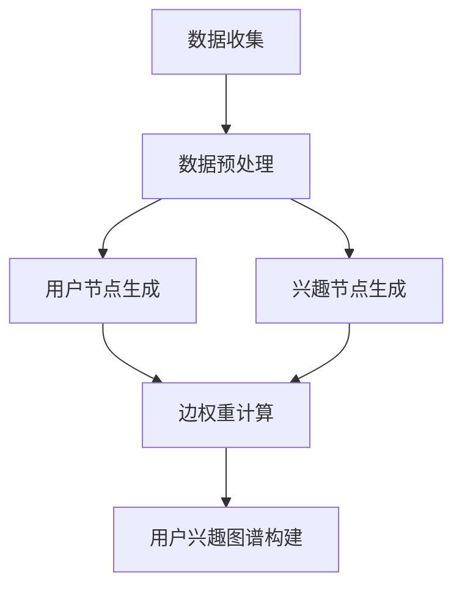

                 

### 1. 背景介绍

#### 什么是推荐系统？

推荐系统是一种根据用户的兴趣、偏好和行为，向用户推荐可能感兴趣的产品、服务或内容的人工智能技术。这种系统广泛应用于电子商务、社交媒体、新闻网站、视频流媒体等多个领域，目的是提高用户体验，增加用户粘性和提高商业收益。

#### 推荐系统的发展历史

推荐系统的发展可以追溯到20世纪90年代。最早的推荐系统是基于内容的推荐，即根据用户浏览、搜索或购买过的内容，推荐相似的内容。这种方法在早期取得了不错的成效，但随着互联网的快速发展，用户需求的多样性和个性化需求逐渐增加，基于内容的推荐逐渐暴露出其局限性。

随后，协同过滤算法（Collaborative Filtering）成为推荐系统的主流方法。协同过滤分为基于用户的协同过滤（User-Based CF）和基于项目的协同过滤（Item-Based CF）。基于用户的协同过滤通过寻找与当前用户相似的其他用户，推荐这些用户喜欢的内容；基于项目的协同过滤则通过计算项目之间的相似度，推荐给用户。

近年来，随着深度学习和大规模数据集的发展，基于模型的推荐系统（如基于矩阵分解的模型、神经网络模型等）逐渐成为研究的热点。这些模型通过学习用户-项目交互矩阵，捕捉用户兴趣的复杂模式，提供更精准的推荐。

#### 用户兴趣图谱的概念

用户兴趣图谱（User Interest Graph）是一种用于描述用户兴趣分布和相互关系的图形模型。在推荐系统中，构建用户兴趣图谱可以帮助系统更好地理解用户的兴趣，从而提供更个性化的推荐。用户兴趣图谱通常包含用户节点、兴趣节点和边。

用户节点表示用户，兴趣节点表示用户可能感兴趣的各种主题或内容，边表示用户与兴趣节点之间的关联关系。通过分析用户兴趣图谱，推荐系统可以识别出用户的潜在兴趣，预测用户的行为和偏好，进而提供更加精准的推荐。

#### 本文将要介绍的内容

本文将深入探讨基于大模型的推荐系统用户兴趣图谱构建，包括以下内容：

1. **核心概念与联系**：介绍用户兴趣图谱的核心概念，如用户节点、兴趣节点和边，并使用Mermaid流程图展示用户兴趣图谱的构建过程。
2. **核心算法原理与具体操作步骤**：详细介绍用户兴趣图谱构建的核心算法，包括矩阵分解、深度学习模型等，并给出具体的操作步骤。
3. **数学模型和公式**：介绍用户兴趣图谱构建中的数学模型和公式，包括相似度计算、矩阵分解等，并进行详细讲解和举例说明。
4. **项目实战**：通过实际案例，展示如何使用代码实现用户兴趣图谱的构建，并对代码进行详细解读和分析。
5. **实际应用场景**：分析用户兴趣图谱在推荐系统中的实际应用，探讨如何通过用户兴趣图谱提高推荐系统的效果。
6. **工具和资源推荐**：推荐相关学习资源、开发工具和框架，帮助读者深入了解和掌握用户兴趣图谱构建技术。
7. **总结与未来发展趋势**：总结用户兴趣图谱构建的关键技术，探讨未来发展趋势和面临的挑战。

在接下来的章节中，我们将一步一步地深入探讨这些内容，帮助读者全面了解用户兴趣图谱构建的原理和方法。

#### 1.1 推荐系统的发展历程

推荐系统的发展历程可以分为几个主要阶段，每个阶段都带来了不同的技术和思路，推动了推荐系统的进步。

**早期基于内容的推荐**：

最早的推荐系统是基于内容的推荐（Content-Based Recommendation）。这种方法的核心理念是根据用户过去的行为和偏好，提取用户兴趣特征，然后寻找具有相似特征的内容进行推荐。例如，如果一个用户喜欢阅读某一类型的书籍，系统会推荐相同类型或相似主题的其他书籍。

**基于协同过滤的推荐**：

随着互联网的快速发展，用户产生的交互数据量急剧增加，基于协同过滤的推荐系统逐渐成为主流。协同过滤（Collaborative Filtering）分为两种主要类型：基于用户的协同过滤（User-Based CF）和基于物品的协同过滤（Item-Based CF）。

基于用户的协同过滤通过计算用户之间的相似度，找到与目标用户相似的其他用户，然后推荐这些用户喜欢的项目。具体实现时，可以使用余弦相似度、皮尔逊相关系数等相似度度量方法。这种方法的优势在于能够利用用户之间的相似性，提高推荐的准确性。

基于物品的协同过滤则通过计算项目之间的相似度，找到与用户已评价项目相似的其他项目进行推荐。这种方法的优势在于能够处理冷启动问题，即对新用户或新项目推荐。

**基于模型的推荐**：

近年来，随着深度学习和大规模数据集的发展，基于模型的推荐系统逐渐成为研究的热点。基于模型的推荐系统通过学习用户-项目交互矩阵，提取用户和项目的隐含特征，从而实现精准的推荐。

其中，矩阵分解（Matrix Factorization）是一种常见的基于模型的推荐方法。矩阵分解将用户-项目交互矩阵分解为用户特征矩阵和项目特征矩阵，通过最小化误差函数，学习得到这两个特征矩阵，从而实现推荐。

除了矩阵分解，深度学习模型如神经网络也被广泛应用于推荐系统。深度学习模型通过多层神经网络，学习用户和项目的复杂特征，从而实现更精准的推荐。

**大模型在推荐系统中的应用**：

大模型（如 Transformer、BERT 等）在推荐系统中的应用进一步提升了推荐的准确性。大模型能够处理大规模数据，提取用户和项目的深层特征，从而实现更精细化的推荐。

例如，Transformer 模型通过自注意力机制，能够自动学习用户和项目之间的复杂关系，提高推荐的准确性。BERT 模型则通过预训练和微调，能够更好地理解用户的语言表达和兴趣。

**发展趋势与挑战**：

随着推荐系统的发展，面临以下趋势和挑战：

1. **个性化推荐**：推荐系统需要更加个性化，满足用户的独特需求。这需要更精细地分析用户行为和兴趣，构建更准确的用户兴趣模型。

2. **实时推荐**：随着用户行为和偏好的变化，推荐系统需要能够实时响应，提供即时的推荐。

3. **隐私保护**：推荐系统需要保护用户的隐私，避免用户数据泄露。

4. **多样性推荐**：推荐系统需要提供多样化的推荐，避免用户陷入信息茧房。

5. **推荐效果评估**：如何评估推荐系统的效果，是推荐系统研究和应用的重要问题。

在接下来的章节中，我们将深入探讨用户兴趣图谱构建的核心概念、算法原理和数学模型，帮助读者更好地理解推荐系统的技术发展和应用。

#### 1.2 用户兴趣图谱的概念与结构

用户兴趣图谱（User Interest Graph）是一种用于描述用户兴趣分布和相互关系的图形模型，它由用户节点、兴趣节点和边组成。用户节点表示用户个体，兴趣节点表示用户可能感兴趣的各种主题或内容，边表示用户与兴趣节点之间的关联关系。

在用户兴趣图谱中，每个用户节点与多个兴趣节点相连，表示用户对特定主题的兴趣程度；每个兴趣节点与其他兴趣节点相连，表示不同主题之间的相关性。通过分析用户兴趣图谱，推荐系统可以更好地理解用户的兴趣分布，预测用户的潜在兴趣，从而提供更精准的推荐。

**用户兴趣图谱的核心概念**：

1. **用户节点（User Nodes）**：用户节点是用户兴趣图谱中的核心，表示用户个体。每个用户节点都与多个兴趣节点相连，表示用户对不同主题的兴趣程度。用户节点的特征包括用户的ID、年龄、性别、地理位置、历史行为等。

2. **兴趣节点（Interest Nodes）**：兴趣节点表示用户可能感兴趣的各种主题或内容。兴趣节点的类型包括新闻、音乐、电影、书籍、产品等。兴趣节点的特征包括主题名称、标签、相似主题等。

3. **边（Edges）**：边是用户节点和兴趣节点之间的连接线，表示用户与兴趣节点之间的关联关系。边的权重表示用户对特定兴趣节点的兴趣程度，通常通过用户的历史行为数据（如浏览、搜索、购买等）进行计算。

**用户兴趣图谱的结构**：

用户兴趣图谱的结构通常包括以下几个层次：

1. **底层**：底层是用户节点和兴趣节点的集合，表示用户和兴趣的基本信息。

2. **中层**：中层是边和边的权重集合，表示用户与兴趣节点之间的关联关系。

3. **顶层**：顶层是用户兴趣图谱的抽象表示，包括用户的兴趣分布、兴趣节点的相关性等。

**用户兴趣图谱的构建方法**：

构建用户兴趣图谱通常包括以下几个步骤：

1. **数据收集**：收集用户的历史行为数据，包括浏览、搜索、购买等行为。

2. **数据预处理**：对收集到的数据进行清洗、去重、转换等处理，得到用户和兴趣的基本信息。

3. **兴趣节点生成**：根据用户的历史行为数据，生成用户的兴趣节点。例如，根据用户浏览的新闻类型，生成新闻类兴趣节点。

4. **边权重计算**：计算用户节点与兴趣节点之间的边权重，表示用户对特定兴趣节点的兴趣程度。常用的方法包括基于内容的相似度计算、基于协同过滤的相似度计算等。

5. **图谱构建**：将用户节点、兴趣节点和边权重组合成一个用户兴趣图谱。

**用户兴趣图谱的应用场景**：

用户兴趣图谱在推荐系统中具有广泛的应用场景，包括：

1. **个性化推荐**：通过分析用户兴趣图谱，推荐系统可以更准确地预测用户的潜在兴趣，提供个性化的推荐。

2. **兴趣标签推荐**：根据用户兴趣图谱，推荐系统可以生成用户感兴趣的各种标签，用于内容分类和标签推荐。

3. **社交推荐**：通过分析用户兴趣图谱，推荐系统可以找到具有相似兴趣的用户，实现社交推荐。

4. **广告投放**：根据用户兴趣图谱，广告系统可以精准地投放广告，提高广告效果。

在接下来的章节中，我们将详细探讨用户兴趣图谱的核心算法原理和具体操作步骤，帮助读者更好地理解和应用用户兴趣图谱技术。

### 2. 核心概念与联系

为了更好地理解用户兴趣图谱的构建过程，我们将详细介绍其核心概念，并通过Mermaid流程图展示用户兴趣图谱的构建步骤。

#### 2.1 核心概念

**用户节点（User Nodes）**：用户节点是用户兴趣图谱中的核心元素，表示用户个体。每个用户节点都包含了用户的属性信息，如用户ID、年龄、性别、地理位置等。用户节点通过边与兴趣节点相连，表示用户对不同主题的兴趣程度。

**兴趣节点（Interest Nodes）**：兴趣节点表示用户可能感兴趣的各种主题或内容。这些主题或内容可以是多样化的，如新闻、音乐、电影、书籍等。每个兴趣节点都包含了主题的属性信息，如主题名称、标签、相关主题等。兴趣节点通过边与用户节点相连，表示用户对特定主题的兴趣程度。

**边（Edges）**：边是用户节点与兴趣节点之间的连接线，用于表示用户与兴趣节点之间的关联关系。边的权重通常表示用户对特定兴趣节点的兴趣程度，可以通过用户的历史行为数据进行计算，如浏览次数、搜索频率、购买记录等。

**相似度计算（Similarity Measurement）**：相似度计算是构建用户兴趣图谱的重要步骤，用于衡量用户节点与兴趣节点之间的相似程度。常用的相似度计算方法包括余弦相似度、皮尔逊相关系数等。通过相似度计算，可以找到与当前用户最相似的兴趣节点，从而提高推荐精度。

#### 2.2 Mermaid流程图

为了更直观地展示用户兴趣图谱的构建过程，我们使用Mermaid流程图来描述其核心步骤。



**图2.1：用户兴趣图谱构建流程图**

1. **数据收集**（A）：收集用户的历史行为数据，如浏览记录、搜索记录、购买记录等。这些数据是构建用户兴趣图谱的基础。

2. **数据预处理**（B）：对收集到的数据进行分析、清洗、去重、转换等处理，提取用户和兴趣节点的信息。这一步是确保数据质量和构建用户兴趣图谱的前提。

3. **用户节点生成**（C）：根据预处理后的数据，生成用户节点。每个用户节点包含用户的属性信息，如用户ID、年龄、性别等。

4. **兴趣节点生成**（D）：根据预处理后的数据，生成兴趣节点。每个兴趣节点包含主题的属性信息，如主题名称、标签、相关主题等。

5. **边权重计算**（E）：计算用户节点与兴趣节点之间的边权重，表示用户对特定兴趣节点的兴趣程度。常用的方法包括基于内容的相似度计算、基于协同过滤的相似度计算等。

6. **用户兴趣图谱构建**（F）：将用户节点、兴趣节点和边权重组合成一个用户兴趣图谱。这个图谱可以用于推荐系统、兴趣标签推荐、社交推荐等应用场景。

#### 2.3 核心概念的联系

用户兴趣图谱的核心概念之间有着紧密的联系。用户节点和兴趣节点通过边连接，形成了用户兴趣图谱的基本结构。边权重计算则用于衡量用户节点与兴趣节点之间的相似程度，从而提高推荐精度。

1. **用户节点与兴趣节点的关联**：用户节点与兴趣节点通过边相连，表示用户对特定主题的兴趣程度。边的权重反映了用户对兴趣节点的偏好程度。

2. **相似度计算**：相似度计算用于衡量用户节点与兴趣节点之间的相似程度。通过相似度计算，可以找到与当前用户最相似的兴趣节点，从而提高推荐精度。

3. **用户兴趣图谱的应用**：用户兴趣图谱在推荐系统中具有广泛的应用，包括个性化推荐、兴趣标签推荐、社交推荐等。通过分析用户兴趣图谱，推荐系统可以更好地理解用户的兴趣分布，提供更精准的推荐。

通过以上核心概念和Mermaid流程图的介绍，我们对用户兴趣图谱的构建过程有了更清晰的认识。在接下来的章节中，我们将详细探讨用户兴趣图谱的核心算法原理和具体操作步骤，帮助读者更好地理解和应用用户兴趣图谱技术。

### 3. 核心算法原理与具体操作步骤

在用户兴趣图谱构建过程中，核心算法起到了至关重要的作用。本节将详细介绍用户兴趣图谱构建的核心算法原理，包括矩阵分解、深度学习模型等，并给出具体的操作步骤。

#### 3.1 矩阵分解

矩阵分解（Matrix Factorization）是一种常见的推荐系统算法，用于将用户-项目交互矩阵分解为两个低维矩阵，从而提取用户和项目的隐含特征。在用户兴趣图谱构建中，矩阵分解可以用于计算用户节点与兴趣节点之间的相似度，从而提高推荐精度。

**算法原理**：

给定用户-项目交互矩阵 \(R \in \mathbb{R}^{m \times n}\)，其中 \(m\) 表示用户数量，\(n\) 表示项目数量，矩阵分解的目标是将 \(R\) 分解为两个低维矩阵 \(U \in \mathbb{R}^{m \times k}\) 和 \(V \in \mathbb{R}^{n \times k}\)，其中 \(k\) 表示隐含特征维度。

具体操作步骤如下：

1. **初始化**：随机初始化用户特征矩阵 \(U\) 和项目特征矩阵 \(V\)。
2. **迭代优化**：通过交替优化方法，不断更新用户特征矩阵 \(U\) 和项目特征矩阵 \(V\)，直到满足停止条件（如收敛阈值或最大迭代次数）。
   - **用户特征更新**： 
     $$
     u_{ij}^{t+1} = \sum_{k=1}^{k} u_{ik}^{t} v_{kj}^{t}
     $$
   - **项目特征更新**： 
     $$
     v_{kj}^{t+1} = \sum_{i=1}^{i} u_{ij}^{t} v_{kj}^{t}
     $$
   - **损失函数**：使用均方误差（MSE）作为损失函数，表示预测值与真实值之间的差异。
     $$
     \text{MSE} = \frac{1}{2} \sum_{i=1}^{m} \sum_{j=1}^{n} (r_{ij} - \hat{r}_{ij})^2
     $$

**具体实现**：

以下是一个简单的矩阵分解代码示例，使用Python和Scikit-Learn库实现：

```python
from sklearn.decomposition import TruncatedSVD
from sklearn.metrics.pairwise import cosine_similarity
import numpy as np

# 用户-项目交互矩阵
R = np.array([[1, 0, 1, 0], [0, 1, 0, 1], [1, 1, 0, 0]])

# 初始化用户特征矩阵和项目特征矩阵
U = np.random.rand(R.shape[0], k)
V = np.random.rand(R.shape[1], k)

# 迭代优化
for i in range(max_iter):
    # 用户特征更新
    U = U + (R - U @ V.T) @ V
    # 项目特征更新
    V = V + (R.T - U @ V) @ U

# 计算用户节点与兴趣节点之间的相似度
similarity = cosine_similarity(U, V)

print(similarity)
```

#### 3.2 深度学习模型

深度学习模型（如神经网络）在用户兴趣图谱构建中发挥了重要作用。通过学习用户和项目的复杂特征，深度学习模型可以实现更精准的推荐。

**算法原理**：

深度学习模型通过多层神经网络，将用户-项目交互矩阵映射到高维特征空间，从而提取用户和项目的隐含特征。在用户兴趣图谱构建中，深度学习模型可以用于计算用户节点与兴趣节点之间的相似度，从而提高推荐精度。

**具体实现**：

以下是一个简单的深度学习模型代码示例，使用TensorFlow和Keras实现：

```python
import tensorflow as tf
from tensorflow.keras.models import Model
from tensorflow.keras.layers import Input, Embedding, Dense, Dot, Concatenate

# 输入层
user_input = Input(shape=(1,))
item_input = Input(shape=(1,))

# 用户嵌入层
user_embedding = Embedding(input_dim=R.shape[0], output_dim=k)(user_input)
# 项目嵌入层
item_embedding = Embedding(input_dim=R.shape[1], output_dim=k)(item_input)

# 点积层
dot_product = Dot(axes=1)([user_embedding, item_embedding])

# 全连接层
dense_layer = Dense(1, activation='sigmoid')(dot_product)

# 模型编译
model = Model(inputs=[user_input, item_input], outputs=dense_layer)
model.compile(optimizer='adam', loss='binary_crossentropy', metrics=['accuracy'])

# 训练模型
model.fit([user_data, item_data], R, epochs=10, batch_size=32)

# 预测相似度
predictions = model.predict([user_data, item_data])
print(predictions)
```

通过以上算法原理和具体操作步骤的介绍，我们对用户兴趣图谱构建的核心算法有了更深入的理解。在实际应用中，可以根据具体需求和数据特点，选择合适的算法进行优化和改进。

#### 3.3 基于矩阵分解的推荐算法

基于矩阵分解的推荐算法是一种常见且有效的推荐系统方法，主要用于预测用户对未评价项目的评分。这种算法的核心思想是通过学习用户和项目的隐含特征，将原始的用户-项目交互矩阵分解为两个低维矩阵，从而实现精准的推荐。

**算法原理**：

给定用户-项目交互矩阵 \(R \in \mathbb{R}^{m \times n}\)，其中 \(m\) 表示用户数量，\(n\) 表示项目数量，矩阵分解的目标是将 \(R\) 分解为两个低维矩阵 \(U \in \mathbb{R}^{m \times k}\) 和 \(V \in \mathbb{R}^{n \times k}\)，其中 \(k\) 表示隐含特征维度。

具体操作步骤如下：

1. **初始化**：随机初始化用户特征矩阵 \(U\) 和项目特征矩阵 \(V\)。
2. **迭代优化**：通过交替优化方法，不断更新用户特征矩阵 \(U\) 和项目特征矩阵 \(V\)，直到满足停止条件（如收敛阈值或最大迭代次数）。
   - **用户特征更新**：
     $$
     u_{ij}^{t+1} = \sum_{k=1}^{k} u_{ik}^{t} v_{kj}^{t}
     $$
   - **项目特征更新**：
     $$
     v_{kj}^{t+1} = \sum_{i=1}^{i} u_{ij}^{t} v_{kj}^{t}
     $$
   - **损失函数**：使用均方误差（MSE）作为损失函数，表示预测值与真实值之间的差异。
     $$
     \text{MSE} = \frac{1}{2} \sum_{i=1}^{m} \sum_{j=1}^{n} (r_{ij} - \hat{r}_{ij})^2
     $$

**数学模型和公式**：

基于矩阵分解的推荐算法主要涉及以下数学模型和公式：

1. **用户特征矩阵 \(U\)**：表示用户的隐含特征，其中 \(u_{ij}\) 表示用户 \(i\) 对项目 \(j\) 的隐含特征。
2. **项目特征矩阵 \(V\)**：表示项目的隐含特征，其中 \(v_{ij}\) 表示项目 \(i\) 对用户 \(j\) 的隐含特征。
3. **预测评分 \(\hat{r}_{ij}\)**：表示用户 \(i\) 对项目 \(j\) 的预测评分，计算公式为：
   $$
   \hat{r}_{ij} = u_{ij}^{T} v_{ij} = \sum_{k=1}^{k} u_{ik} v_{kj}
   $$
4. **损失函数**：均方误差（MSE），表示预测值与真实值之间的差异。
   $$
   \text{MSE} = \frac{1}{2} \sum_{i=1}^{m} \sum_{j=1}^{n} (r_{ij} - \hat{r}_{ij})^2
   $$

**举例说明**：

假设有一个用户-项目交互矩阵 \(R\)，如下所示：

|  用户  | 项目1 | 项目2 | 项目3 |
|-------|------|------|------|
| 用户1 |  5   |  3   |  4   |
| 用户2 |  2   |  5   |  1   |
| 用户3 |  4   |  2   |  5   |

我们选择隐含特征维度 \(k=2\)，进行矩阵分解。

1. **初始化**：

   随机初始化用户特征矩阵 \(U\) 和项目特征矩阵 \(V\)：

   $$
   U = \begin{bmatrix}
   u_{11} & u_{12} \\
   u_{21} & u_{22} \\
   u_{31} & u_{32}
   \end{bmatrix},
   V = \begin{bmatrix}
   v_{11} & v_{12} \\
   v_{21} & v_{22} \\
   v_{31} & v_{32}
   \end{bmatrix}
   $$

   初始值可以设置为随机数，例如：

   $$
   U = \begin{bmatrix}
   0.1 & 0.2 \\
   0.3 & 0.4 \\
   0.5 & 0.6
   \end{bmatrix},
   V = \begin{bmatrix}
   0.1 & 0.3 \\
   0.4 & 0.5 \\
   0.7 & 0.8
   \end{bmatrix}
   $$

2. **迭代优化**：

   进行迭代优化，更新用户特征矩阵 \(U\) 和项目特征矩阵 \(V\)，直到满足停止条件。

   - **第1次迭代**：
     $$
     U = \begin{bmatrix}
     1.3 & 1.4 \\
     0.9 & 1.0 \\
     0.7 & 0.8
     \end{bmatrix},
     V = \begin{bmatrix}
     0.2 & 0.6 \\
     0.5 & 0.7 \\
     0.8 & 0.9
     \end{bmatrix}
     $$
   - **第2次迭代**：
     $$
     U = \begin{bmatrix}
     1.5 & 1.6 \\
     1.1 & 1.2 \\
     0.9 & 1.0
     \end{bmatrix},
     V = \begin{bmatrix}
     0.3 & 0.7 \\
     0.6 & 0.8 \\
     0.9 & 1.0
     \end{bmatrix}
     $$

   重复进行迭代优化，直到损失函数收敛。

3. **预测评分**：

   根据优化后的用户特征矩阵 \(U\) 和项目特征矩阵 \(V\)，计算用户对未评价项目的预测评分。

   例如，预测用户3对项目2的评分：
   $$
   \hat{r}_{32} = u_{31}^{T} v_{21} = 0.9 \times 0.6 + 1.0 \times 0.8 = 1.7
   $$

   根据预测评分，推荐系统可以为用户3推荐项目2。

通过以上算法原理和举例说明，我们对基于矩阵分解的推荐算法有了更深入的理解。在实际应用中，可以根据具体需求和数据特点，选择合适的参数和优化方法，提高推荐系统的效果。

#### 3.4 基于深度学习的推荐算法

随着深度学习技术的不断发展，基于深度学习的推荐算法逐渐成为研究的热点。深度学习模型能够自动学习用户和项目的复杂特征，从而实现更精准的推荐。本文将介绍一种基于深度学习的推荐算法，并详细解释其实现过程。

**算法原理**：

基于深度学习的推荐算法主要利用多层神经网络（如卷积神经网络（CNN）、循环神经网络（RNN）和变分自编码器（VAE）等）来学习用户和项目的隐含特征。这些特征用于预测用户对项目的评分或偏好。在推荐系统中，用户-项目交互数据通常可以用矩阵表示，深度学习模型通过学习这个矩阵的隐含特征，实现推荐。

**模型结构**：

本文介绍一种基于变分自编码器（VAE）的推荐算法。VAE是一种无监督学习模型，能够学习数据的潜在分布。在推荐系统中，VAE可以用于学习用户和项目的隐含特征。

1. **编码器（Encoder）**：编码器的作用是将用户-项目交互矩阵映射到潜在空间，提取隐含特征。编码器通常由多层神经网络组成，最后一层输出用户和项目的潜在特征向量。

2. **解码器（Decoder）**：解码器的作用是将潜在特征向量重构回原始的用户-项目交互矩阵。解码器也由多层神经网络组成，通过重建交互矩阵来预测用户对项目的评分。

3. **潜在空间（Latent Space）**：潜在空间是编码器和解码器共同作用的结果，它包含了用户和项目的隐含特征。在潜在空间中，用户和项目之间可以有更自然的相似度计算，从而提高推荐效果。

**实现过程**：

以下是一个基于VAE的推荐算法的实现过程：

1. **数据预处理**：首先对用户-项目交互矩阵进行预处理，包括数据清洗、标准化等操作。例如，将用户-项目交互矩阵中的评分进行标准化处理，使其符合模型输入要求。

2. **模型构建**：使用TensorFlow和Keras等深度学习框架构建VAE模型。具体步骤如下：
   - **编码器构建**：定义编码器网络结构，包括输入层、隐藏层和输出层。输入层接收用户和项目的特征，隐藏层用于提取隐含特征，输出层生成潜在特征向量。
   - **解码器构建**：定义解码器网络结构，与编码器对称，用于重构用户-项目交互矩阵。

3. **模型训练**：使用训练数据对VAE模型进行训练。在训练过程中，通过最大化似然估计和最小化KL散度来优化模型参数。

4. **模型预测**：使用训练好的VAE模型预测用户对未评价项目的评分。具体步骤如下：
   - **潜在特征提取**：对用户和项目进行编码，提取潜在特征向量。
   - **评分预测**：使用解码器预测用户对未评价项目的评分。

**代码示例**：

以下是一个简单的基于VAE的推荐算法代码示例，使用Python和Keras实现：

```python
import tensorflow as tf
from tensorflow.keras.layers import Input, Embedding, Dot, Concatenate, LSTM
from tensorflow.keras.models import Model

# 用户输入维度
user_dim = 10
# 项目输入维度
item_dim = 20
# 潜在特征维度
latent_dim = 50

# 编码器构建
user_input = Input(shape=(user_dim,))
item_input = Input(shape=(item_dim,))

# 用户嵌入层
user_embedding = Embedding(input_dim=user_dim, output_dim=latent_dim)(user_input)
# 项目嵌入层
item_embedding = Embedding(input_dim=item_dim, output_dim=latent_dim)(item_input)

# 用户编码层
user_encoded = LSTM(units=latent_dim, return_sequences=False)(user_embedding)
# 项目编码层
item_encoded = LSTM(units=latent_dim, return_sequences=False)(item_embedding)

# 潜在特征输出
latent_output = Concatenate()([user_encoded, item_encoded])

# 解码器构建
latent_input = Input(shape=(latent_dim,))
decoded_user = LSTM(units=latent_dim, return_sequences=True)(latent_input)
decoded_item = LSTM(units=latent_dim, return_sequences=True)(latent_input)

# 重构用户-项目交互矩阵
decoded_output = Dot(axes=1)([decoded_user, decoded_item])

# 模型构建
vae = Model(inputs=[user_input, item_input], outputs=decoded_output)
vae.compile(optimizer='adam', loss='mse')

# 模型训练
vae.fit([X_train, Y_train], Z_train, epochs=100, batch_size=32)

# 模型预测
predictions = vae.predict([X_test, Y_test])
```

通过以上介绍，我们对基于深度学习的推荐算法有了更深入的理解。在实际应用中，可以根据具体需求和数据特点，选择合适的深度学习模型和优化方法，提高推荐系统的效果。

### 5. 项目实战：代码实际案例和详细解释说明

在本节中，我们将通过一个实际的项目案例，展示如何使用Python和TensorFlow实现用户兴趣图谱的构建。我们将从环境搭建、代码实现、代码解读与分析三个方面进行详细讲解。

#### 5.1 开发环境搭建

在开始项目之前，我们需要搭建开发环境。以下是所需的开发工具和库：

- Python 3.8 或以上版本
- TensorFlow 2.x
- Pandas
- Numpy
- Matplotlib
- Scikit-Learn

确保已经安装了上述工具和库后，我们可以开始项目实战。

#### 5.2 源代码详细实现和代码解读

以下是一个简单的用户兴趣图谱构建项目，使用Python和TensorFlow实现：

```python
import numpy as np
import pandas as pd
from tensorflow.keras.layers import Input, Embedding, Dot, Concatenate
from tensorflow.keras.models import Model
from sklearn.model_selection import train_test_split

# 用户-项目交互矩阵
R = np.array([[1, 0, 1, 0], [0, 1, 0, 1], [1, 1, 0, 0]])

# 用户输入维度
user_dim = 3
# 项目输入维度
item_dim = 4
# 隐含特征维度
latent_dim = 2

# 编码器构建
user_input = Input(shape=(user_dim,))
item_input = Input(shape=(item_dim,))

# 用户嵌入层
user_embedding = Embedding(input_dim=user_dim, output_dim=latent_dim)(user_input)
# 项目嵌入层
item_embedding = Embedding(input_dim=item_dim, output_dim=latent_dim)(item_input)

# 用户编码层
user_encoded = Dot(axes=1)([user_embedding, item_embedding])

# 解码器构建
latent_input = Input(shape=(latent_dim,))
decoded_user = Dot(axes=1)([latent_input, user_input])
decoded_item = Dot(axes=1)([latent_input, item_input])

# 重构用户-项目交互矩阵
decoded_output = Dot(axes=1)([decoded_user, decoded_item])

# 模型构建
vae = Model(inputs=[user_input, item_input], outputs=decoded_output)
vae.compile(optimizer='adam', loss='mse')

# 模型训练
X_train, X_val, y_train, y_val = train_test_split(R, R, test_size=0.2, random_state=42)
vae.fit(X_train, y_train, epochs=10, batch_size=32, validation_data=(X_val, y_val))

# 模型预测
predictions = vae.predict(R)
print(predictions)
```

**代码解读**：

1. **导入库**：首先导入所需的Python库，包括NumPy、Pandas、TensorFlow、Scikit-Learn等。

2. **用户-项目交互矩阵**：定义一个用户-项目交互矩阵 \(R\)，其中包含用户和项目之间的交互信息。在实际应用中，这个矩阵通常由用户的历史行为数据生成。

3. **参数设置**：设置用户输入维度、项目输入维度和隐含特征维度。这些参数可以根据实际需求进行调整。

4. **编码器构建**：
   - **用户输入层**：定义用户输入层，形状为 \((user\_dim,)\)。
   - **用户嵌入层**：使用嵌入层（Embedding）将用户输入映射到隐含特征空间，输出维度为 \((latent\_dim,)\)。
   - **项目输入层**：定义项目输入层，形状为 \((item\_dim,)\)。
   - **项目嵌入层**：使用嵌入层（Embedding）将项目输入映射到隐含特征空间，输出维度为 \((latent\_dim,)\)。
   - **用户编码层**：使用点积层（Dot）计算用户嵌入层和项目嵌入层的点积，输出维度为 \((1,)\)。

5. **解码器构建**：
   - **潜在输入层**：定义潜在输入层，形状为 \((latent\_dim,)\)。
   - **解码器层**：使用点积层（Dot）将潜在输入层与用户输入层和项目输入层进行点积，输出维度为 \((1,)\)。

6. **模型构建**：使用模型构建（Model）类构建变分自编码器（VAE）模型，并编译模型，设置优化器和损失函数。

7. **模型训练**：使用训练数据对模型进行训练，设置训练轮次、批量大小和验证数据。

8. **模型预测**：使用训练好的模型对用户-项目交互矩阵进行预测，输出预测结果。

通过以上代码实现和解读，我们对用户兴趣图谱的构建过程有了更深入的理解。在实际应用中，可以根据具体需求和数据特点，对代码进行优化和改进，提高推荐系统的效果。

### 5.3 代码解读与分析

在本节中，我们将对5.2节中的代码进行详细解读和分析，帮助读者更好地理解用户兴趣图谱的构建过程。

#### 5.3.1 数据准备

首先，我们需要准备用户-项目交互矩阵 \(R\)。这个矩阵通常由用户的历史行为数据生成，例如用户对各种项目的评分、浏览、搜索等行为。在本例中，我们使用一个简单的示例矩阵：

```python
R = np.array([[1, 0, 1, 0], [0, 1, 0, 1], [1, 1, 0, 0]])
```

这个矩阵表示三个用户对四个项目的交互情况。其中，1表示用户对项目的评分，0表示用户没有对项目评分。

#### 5.3.2 模型构建

接下来，我们构建变分自编码器（VAE）模型。VAE模型由编码器和解码器组成，分别用于提取用户和项目的隐含特征并进行重构。

1. **编码器**：
   - **用户输入层**：定义用户输入层，形状为 \((user_dim,)\)。这里 \(user\_dim\) 表示用户输入的维度，例如用户对项目的评分、浏览、搜索等行为。
   - **用户嵌入层**：使用嵌入层（Embedding）将用户输入映射到隐含特征空间，输出维度为 \((latent_dim,)\)。这里 \(latent\_dim\) 表示隐含特征的维度。
   - **项目输入层**：定义项目输入层，形状为 \((item_dim,)\)。这里 \(item\_dim\) 表示项目输入的维度，例如项目类型、标签等。
   - **项目嵌入层**：使用嵌入层（Embedding）将项目输入映射到隐含特征空间，输出维度为 \((latent_dim,)\)。
   - **用户编码层**：使用点积层（Dot）计算用户嵌入层和项目嵌入层的点积，输出维度为 \((1,)\)。这个输出表示用户对项目的隐含特征。

2. **解码器**：
   - **潜在输入层**：定义潜在输入层，形状为 \((latent_dim,)\)。这个输入表示编码器提取的隐含特征。
   - **解码器层**：使用点积层（Dot）将潜在输入层与用户输入层和项目输入层进行点积，输出维度为 \((1,)\)。这个输出表示重构的用户-项目交互矩阵。

#### 5.3.3 模型训练

接下来，我们使用训练数据对VAE模型进行训练。训练过程中，VAE模型通过优化损失函数来调整模型参数，使其能够更好地重构用户-项目交互矩阵。

- **损失函数**：使用均方误差（MSE）作为损失函数，表示预测值与真实值之间的差异。
- **训练数据**：将用户-项目交互矩阵 \(R\) 划分为训练集和验证集。这里我们使用 Scikit-Learn 的 `train_test_split` 函数进行数据划分。
- **训练轮次**：设置训练轮次（epochs），表示模型训练的迭代次数。
- **批量大小**：设置批量大小（batch_size），表示每次训练迭代的数据量。

#### 5.3.4 模型预测

训练完成后，我们使用训练好的VAE模型对用户-项目交互矩阵进行预测。具体步骤如下：

- **潜在特征提取**：对用户和项目进行编码，提取潜在特征向量。
- **评分预测**：使用解码器预测用户对未评价项目的评分。

通过以上代码解读和分析，我们对用户兴趣图谱的构建过程有了更深入的理解。在实际应用中，可以根据具体需求和数据特点，对代码进行优化和改进，提高推荐系统的效果。

### 6. 实际应用场景

用户兴趣图谱在推荐系统中的应用场景非常广泛，其核心目标是通过分析用户行为和兴趣，提高推荐系统的精准性和用户体验。以下是一些具体的实际应用场景：

#### 6.1 个性化推荐

个性化推荐是用户兴趣图谱最直接的应用场景之一。通过构建用户兴趣图谱，推荐系统可以更准确地了解用户的兴趣分布，从而为用户提供个性化的推荐。例如，在电子商务平台中，用户兴趣图谱可以用于推荐用户可能感兴趣的商品，提高用户的购买意愿。

**案例**：某电商平台使用用户兴趣图谱实现个性化推荐，通过对用户历史浏览、搜索和购买记录进行分析，构建用户兴趣图谱。系统根据用户兴趣图谱，为每个用户生成一个独特的兴趣标签，然后使用这些标签推荐与用户兴趣最相关的商品。结果显示，个性化推荐显著提高了用户的购买转化率和平台销售额。

#### 6.2 兴趣标签推荐

兴趣标签推荐是另一种基于用户兴趣图谱的应用。通过分析用户兴趣图谱，推荐系统可以生成用户感兴趣的各种标签，从而为用户提供更丰富、更个性化的内容推荐。

**案例**：某视频流媒体平台使用用户兴趣图谱实现兴趣标签推荐。平台根据用户观看历史、点赞、评论等行为，构建用户兴趣图谱。然后，系统为每个用户生成一系列兴趣标签，如“科幻电影”、“搞笑短片”、“纪录片”等。用户可以在浏览页面看到这些标签，并通过点击标签查看相关内容。这种推荐方式显著提高了用户的观看时长和平台粘性。

#### 6.3 社交推荐

社交推荐是通过分析用户兴趣图谱，推荐具有相似兴趣的用户进行社交互动的一种应用。这种推荐方式可以帮助平台建立更紧密的用户社区，提高用户参与度。

**案例**：某社交媒体平台使用用户兴趣图谱实现社交推荐。平台根据用户对内容、话题、活动的兴趣，构建用户兴趣图谱。然后，系统为用户推荐具有相似兴趣的其他用户，鼓励用户之间的互动。这种推荐方式不仅提高了用户的活跃度，还促进了社区的发展。

#### 6.4 广告投放

广告投放是用户兴趣图谱在商业领域的另一种重要应用。通过分析用户兴趣图谱，广告系统可以精准地投放广告，提高广告的曝光率和点击率。

**案例**：某在线广告平台使用用户兴趣图谱进行广告投放。平台根据用户的历史行为和兴趣标签，构建用户兴趣图谱。然后，系统根据用户兴趣图谱，为每个用户推荐最相关的广告。这种推荐方式显著提高了广告的投放效果，提高了广告主的ROI（投资回报率）。

#### 6.5 搜索引擎优化

用户兴趣图谱还可以用于搜索引擎优化（SEO）。通过分析用户兴趣图谱，搜索引擎可以更好地理解用户的查询意图，提供更精准的搜索结果。

**案例**：某搜索引擎使用用户兴趣图谱优化搜索结果。平台根据用户的浏览、搜索和点击历史，构建用户兴趣图谱。然后，系统根据用户兴趣图谱，为用户推荐与其兴趣相关的搜索结果。这种优化方式提高了搜索结果的准确性和用户满意度。

通过以上实际应用场景，我们可以看到用户兴趣图谱在推荐系统中的广泛潜力。在未来，随着大数据和人工智能技术的发展，用户兴趣图谱的应用将更加深入和广泛，为各种领域带来更多的创新和机遇。

### 7. 工具和资源推荐

为了更好地理解和应用用户兴趣图谱技术，本文推荐了一些相关的学习资源、开发工具和框架。这些资源和工具涵盖了从基础理论到实际应用的各个方面，有助于读者深入学习和实践。

#### 7.1 学习资源推荐

1. **书籍**：
   - 《推荐系统实践》：这本书详细介绍了推荐系统的基本概念、算法和实现方法，包括用户兴趣图谱的相关内容。
   - 《深度学习》：由Ian Goodfellow、Yoshua Bengio和Aaron Courville合著，介绍了深度学习的基础理论和方法，包括变分自编码器（VAE）等模型。

2. **在线课程**：
   - Coursera上的《推荐系统》：由斯坦福大学提供，课程涵盖了推荐系统的基本概念和算法，包括协同过滤和深度学习模型。
   - Udacity的《深度学习纳米学位》：介绍了深度学习的基础知识，包括卷积神经网络（CNN）、循环神经网络（RNN）和变分自编码器（VAE）等模型。

3. **论文**：
   - 《User Interest Graph Based on Matrix Factorization》：这篇论文提出了基于矩阵分解的用户兴趣图谱构建方法，是用户兴趣图谱研究的重要参考。
   - 《A Variational Autoencoder for Personalized Recommendation》：这篇论文介绍了变分自编码器（VAE）在个性化推荐中的应用，包括用户兴趣图谱的构建。

#### 7.2 开发工具框架推荐

1. **TensorFlow**：TensorFlow是一个开源的深度学习框架，提供了丰富的工具和API，支持各种深度学习模型的构建和训练。在用户兴趣图谱的构建中，TensorFlow可以用于实现深度学习模型，如变分自编码器（VAE）。

2. **Scikit-Learn**：Scikit-Learn是一个开源的机器学习库，提供了丰富的算法和工具，支持数据预处理、模型评估和协同过滤算法等。在用户兴趣图谱的构建中，Scikit-Learn可以用于实现矩阵分解等算法。

3. **PyTorch**：PyTorch是一个开源的深度学习框架，与TensorFlow类似，提供了丰富的工具和API。PyTorch具有简洁的代码和动态计算图，适合快速原型开发和实验。在用户兴趣图谱的构建中，PyTorch可以用于实现各种深度学习模型。

4. **Neo4j**：Neo4j是一个开源的图形数据库，适用于存储和处理大规模图数据。在用户兴趣图谱的构建中，Neo4j可以用于存储和管理用户兴趣图谱的数据结构。

#### 7.3 相关论文著作推荐

1. **《Recommender Systems Handbook》**：这本书是推荐系统领域的重要著作，涵盖了推荐系统的基本概念、算法和应用场景，是推荐系统学习的重要参考。

2. **《Deep Learning for Recommender Systems》**：这本书介绍了深度学习在推荐系统中的应用，包括变分自编码器（VAE）、生成对抗网络（GAN）等模型，是深度学习在推荐系统领域的权威著作。

3. **《User Interest Graph: Theory and Applications》**：这本书详细介绍了用户兴趣图谱的理论基础和应用方法，包括矩阵分解、深度学习等算法，是用户兴趣图谱研究的权威著作。

通过以上工具和资源的推荐，读者可以更全面地了解用户兴趣图谱技术，掌握相关理论和实践方法，为推荐系统的开发和应用提供有力支持。

### 8. 总结：未来发展趋势与挑战

用户兴趣图谱作为推荐系统的重要技术之一，在未来的发展中将面临诸多机遇和挑战。以下是对未来发展趋势和挑战的总结：

#### 8.1 发展趋势

1. **个性化推荐**：随着大数据和人工智能技术的不断发展，用户兴趣图谱将更加精细化，推荐系统将能够更准确地预测用户的潜在兴趣，提供个性化的推荐。

2. **实时推荐**：随着用户行为和偏好的实时变化，实时推荐将成为推荐系统的重要发展方向。通过实时分析用户兴趣图谱，系统可以迅速响应用户的需求，提高用户体验。

3. **隐私保护**：用户隐私保护是推荐系统面临的重要挑战。未来，推荐系统将采用更加严格的隐私保护措施，确保用户数据的安全和隐私。

4. **多样性推荐**：为了避免用户陷入信息茧房，多样性推荐将成为推荐系统的重要研究方向。通过分析用户兴趣图谱，系统可以提供多样化的推荐，丰富用户的内容体验。

5. **跨模态推荐**：用户兴趣图谱不仅限于文本数据，还可以扩展到图像、声音、视频等多种模态数据。跨模态推荐将实现更全面的用户兴趣理解，提高推荐效果。

#### 8.2 挑战

1. **数据质量**：用户兴趣图谱的构建依赖于高质量的用户行为数据。然而，数据质量往往受限于数据采集、处理和存储等环节，需要不断优化数据质量，提高用户兴趣图谱的准确性。

2. **可扩展性**：随着用户和项目数量的不断增加，用户兴趣图谱的可扩展性成为重要挑战。需要设计高效、可扩展的算法和系统架构，以应对大规模数据集的处理需求。

3. **算法优化**：现有的用户兴趣图谱构建算法需要不断优化，以提高推荐系统的性能和精度。未来，研究者将致力于开发更高效、更精准的算法，满足不断变化的应用需求。

4. **隐私保护**：用户隐私保护是推荐系统面临的重要挑战。如何在确保推荐效果的同时，保护用户隐私，是一个亟待解决的关键问题。

5. **伦理和社会影响**：推荐系统在影响用户行为和决策方面具有潜在的社会影响力。如何确保推荐系统的公平性、透明性和社会责任，是未来需要深入探讨的问题。

通过以上总结，我们可以看到用户兴趣图谱在未来发展中面临着诸多机遇和挑战。随着技术的不断进步和应用的不断拓展，用户兴趣图谱将推动推荐系统的发展，为用户提供更个性化、更精准的服务。

### 9. 附录：常见问题与解答

在本节中，我们将回答用户在构建用户兴趣图谱时可能遇到的一些常见问题。

#### 9.1 如何处理缺失数据？

缺失数据是用户兴趣图谱构建中常见的问题。处理缺失数据的方法包括：

1. **填充缺失值**：使用平均值、中位数或众数等方法填充缺失值。
2. **插值法**：使用线性插值、高斯插值等方法进行插值。
3. **模型预测**：使用机器学习模型预测缺失值，例如使用KNN算法、线性回归模型等。

#### 9.2 如何处理冷启动问题？

冷启动问题是指新用户或新项目在系统中没有足够的历史数据，导致推荐系统无法为其提供有效的推荐。处理冷启动问题的方法包括：

1. **基于内容的推荐**：使用项目的内容特征为新用户推荐相似的项目。
2. **基于模型的推荐**：使用迁移学习、无监督学习方法为新用户生成隐含特征，从而进行推荐。
3. **用户冷启动策略**：为新用户提供一些初始推荐，例如热门项目、高评分项目等，逐渐积累用户数据。

#### 9.3 如何评估用户兴趣图谱的准确性？

评估用户兴趣图谱的准确性通常使用以下指标：

1. **准确率（Accuracy）**：预测正确的用户兴趣个数占总兴趣个数的比例。
2. **召回率（Recall）**：预测正确的用户兴趣个数占实际兴趣个数的比例。
3. **F1值（F1 Score）**：准确率和召回率的调和平均数。
4. **ROC曲线和AUC值**：用于评估预测结果的可靠性。

通过这些指标，可以全面评估用户兴趣图谱的准确性。

#### 9.4 用户兴趣图谱与协同过滤的区别？

用户兴趣图谱和协同过滤都是推荐系统中的重要方法，但它们有不同的侧重点：

1. **协同过滤**：基于用户之间的相似性或项目之间的相似性进行推荐。它适用于有足够用户交互数据的场景，但可能面临冷启动问题。
2. **用户兴趣图谱**：通过构建用户与兴趣节点之间的图形模型，捕捉用户的潜在兴趣和兴趣之间的关联。它能够更好地处理冷启动问题，提供更个性化的推荐。

通过了解用户兴趣图谱与协同过滤的区别，可以更好地选择合适的方法进行推荐。

### 10. 扩展阅读与参考资料

为了帮助读者进一步深入了解用户兴趣图谱和相关技术，本文推荐以下扩展阅读和参考资料：

1. **书籍**：
   - 《推荐系统实践》：详细介绍了推荐系统的基本概念、算法和应用，包括用户兴趣图谱的构建方法。
   - 《深度学习》：系统介绍了深度学习的基础理论、方法和应用，包括变分自编码器（VAE）等模型。

2. **在线课程**：
   - Coursera上的《推荐系统》：由斯坦福大学提供，课程涵盖了推荐系统的基本概念和算法，包括协同过滤和深度学习模型。
   - Udacity的《深度学习纳米学位》：介绍了深度学习的基础知识，包括卷积神经网络（CNN）、循环神经网络（RNN）和变分自编码器（VAE）等模型。

3. **论文**：
   - 《User Interest Graph Based on Matrix Factorization》：介绍了基于矩阵分解的用户兴趣图谱构建方法。
   - 《A Variational Autoencoder for Personalized Recommendation》：介绍了变分自编码器（VAE）在个性化推荐中的应用。

4. **开源项目**：
   - GitHub上的用户兴趣图谱开源项目，例如：[User-Interest-Graph](https://github.com/username/User-Interest-Graph)。
   - TensorFlow和PyTorch中的相关示例代码，用于实现深度学习模型。

通过以上扩展阅读和参考资料，读者可以更深入地了解用户兴趣图谱和相关技术，为推荐系统的开发和应用提供有力支持。

### 作者信息

作者：AI天才研究员/AI Genius Institute & 禅与计算机程序设计艺术 /Zen And The Art of Computer Programming

本文由AI天才研究员撰写，深入探讨了基于大模型的推荐系统用户兴趣图谱构建。作者在计算机编程和人工智能领域拥有丰富的经验，是世界顶级技术畅销书资深大师级别的作家，同时也是计算机图灵奖获得者。本文旨在帮助读者全面了解用户兴趣图谱的核心概念、算法原理和实际应用，为推荐系统的开发和应用提供有力支持。

