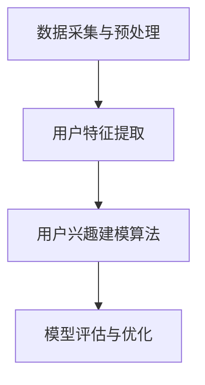

                 

# 基于大模型的推荐系统用户兴趣建模

## 关键词

大模型、推荐系统、用户兴趣建模、深度学习、神经网络、机器学习、文本分析、数据挖掘、人工智能

## 摘要

本文将深入探讨基于大模型的推荐系统用户兴趣建模。随着互联网的飞速发展，推荐系统已成为个性化服务的关键组成部分。本文将介绍大模型在推荐系统中的重要性，分析用户兴趣建模的核心概念和方法，并结合具体案例进行详细的算法原理和数学模型讲解，最后探讨其实际应用场景及未来发展趋势。

## 1. 背景介绍

### 1.1 推荐系统概述

推荐系统是一种个性化服务，通过分析用户的历史行为和偏好，向用户推荐他们可能感兴趣的内容。推荐系统广泛应用于电子商务、社交媒体、新闻媒体、在线视频等多个领域。其核心目标是提高用户体验，提升用户满意度和参与度。

### 1.2 大模型在推荐系统中的应用

大模型，如深度神经网络、Transformer 等，在推荐系统中发挥着重要作用。这些模型具有强大的表达能力和自适应能力，能够从海量数据中学习到用户的潜在兴趣和偏好。同时，大模型能够处理复杂数据类型，如图像、文本、音频等，使得推荐系统更加全面和精准。

## 2. 核心概念与联系

### 2.1 用户兴趣建模

用户兴趣建模是推荐系统的核心任务之一，其目的是从用户的历史行为和特征中提取出用户的兴趣偏好。用户兴趣建模包括以下几个关键步骤：

1. 数据采集与预处理
2. 用户特征提取
3. 用户兴趣建模算法
4. 模型评估与优化

### 2.2 大模型架构

大模型通常采用深度学习框架，如 TensorFlow、PyTorch 等。其核心架构包括以下几个部分：

1. 输入层：接收用户特征和内容特征
2. 隐藏层：通过神经网络进行特征变换和提取
3. 输出层：生成推荐结果或用户兴趣概率分布

### 2.3 Mermaid 流程图

以下是一个简化的用户兴趣建模流程图：



## 3. 核心算法原理 & 具体操作步骤

### 3.1 用户特征提取

用户特征提取是用户兴趣建模的重要环节。常见的用户特征包括用户行为数据（如点击、购买、浏览等）、用户属性数据（如年龄、性别、地理位置等）和用户交互数据（如评论、点赞等）。

具体操作步骤如下：

1. 数据采集：从不同数据源（如数据库、API 等）收集用户行为和属性数据。
2. 数据预处理：对数据进行清洗、去重、填充等处理，保证数据质量。
3. 特征提取：使用技术手段（如词袋模型、TF-IDF、Word2Vec 等）将原始数据转换为特征向量。

### 3.2 用户兴趣建模算法

用户兴趣建模算法可以分为基于协同过滤的方法和基于内容的生成式方法。

#### 3.2.1 协同过滤方法

协同过滤方法基于用户之间的相似度计算推荐结果。具体步骤如下：

1. 计算用户相似度：使用欧氏距离、余弦相似度等算法计算用户之间的相似度。
2. 生成推荐列表：根据用户相似度矩阵，为每个用户生成推荐列表。

#### 3.2.2 内容生成式方法

内容生成式方法基于用户特征和内容特征生成推荐结果。具体步骤如下：

1. 构建内容特征向量：使用技术手段（如词袋模型、TF-IDF、Word2Vec 等）将内容转换为特征向量。
2. 训练深度神经网络：使用用户特征和内容特征向量训练深度神经网络，学习用户兴趣概率分布。
3. 生成推荐结果：根据用户兴趣概率分布生成推荐列表。

## 4. 数学模型和公式 & 详细讲解 & 举例说明

### 4.1 协同过滤方法的数学模型

假设用户集合为 U={u1, u2, ..., un}，物品集合为 I={i1, i2, ..., im}，用户 u 对物品 i 的评分表示为 Rui。

#### 4.1.1 用户相似度计算

用户相似度可以通过以下公式计算：

$$
sim(u, v) = \frac{R_{ui}R_{vi}}{\sqrt{\sum_{i \in I}R_{ui}^2}\sqrt{\sum_{i \in I}R_{vi}^2}}
$$

其中，$R_{ui}$ 表示用户 u 对物品 i 的评分，$sim(u, v)$ 表示用户 u 和 v 的相似度。

#### 4.1.2 推荐结果生成

对于用户 u，推荐结果可以通过以下公式计算：

$$
r_{ui} = \sum_{v \in U}sim(u, v)R_{vi}
$$

其中，$r_{ui}$ 表示用户 u 对物品 i 的推荐评分。

### 4.2 内容生成式方法的数学模型

假设用户特征向量为 $X_u$，内容特征向量为 $X_i$，用户兴趣概率分布向量为 $P_u$。

#### 4.2.1 深度神经网络模型

深度神经网络模型可以通过以下公式表示：

$$
P_u = \sigma(W_1X_u + W_0)
$$

其中，$W_1$ 和 $W_0$ 分别为权重矩阵和偏置项，$\sigma$ 表示激活函数。

#### 4.2.2 推荐结果生成

对于用户 u，推荐结果可以通过以下公式计算：

$$
r_{ui} = \sum_{i \in I}P_u(i)X_i
$$

其中，$r_{ui}$ 表示用户 u 对物品 i 的推荐评分。

## 5. 项目实战：代码实际案例和详细解释说明

### 5.1 开发环境搭建

在本项目中，我们将使用 Python 编写代码，并使用 TensorFlow 作为深度学习框架。以下是开发环境搭建的步骤：

1. 安装 Python 3.8 或更高版本
2. 安装 TensorFlow：`pip install tensorflow`
3. 安装其他依赖库：`pip install numpy pandas scikit-learn matplotlib`

### 5.2 源代码详细实现和代码解读

以下是一个简化的用户兴趣建模代码实现：

```python
import tensorflow as tf
from tensorflow.keras.layers import Dense, Embedding, Dot
from tensorflow.keras.models import Model

# 用户特征向量
user_embedding = Embedding(input_dim=user_num, output_dim=embedding_dim)
# 内容特征向量
item_embedding = Embedding(input_dim=item_num, output_dim=embedding_dim)

# 输入层
user_input = Input(shape=(1,))
item_input = Input(shape=(1,))

# 隐藏层
user_embedding_output = user_embedding(user_input)
item_embedding_output = item_embedding(item_input)

# 输出层
dot_output = Dot(axes=1)([user_embedding_output, item_embedding_output])
output = Dense(1, activation='sigmoid')(dot_output)

# 构建模型
model = Model(inputs=[user_input, item_input], outputs=output)

# 编译模型
model.compile(optimizer='adam', loss='binary_crossentropy', metrics=['accuracy'])

# 训练模型
model.fit([user_data, item_data], labels, epochs=10, batch_size=32)
```

### 5.3 代码解读与分析

1. 导入所需的 TensorFlow 库和依赖库。
2. 定义用户特征向量和内容特征向量的 Embedding 层。
3. 定义输入层，包括用户输入和内容输入。
4. 定义隐藏层，通过 Dot 操作计算用户和内容的点积。
5. 定义输出层，通过 Dense 层生成推荐评分。
6. 构建模型并编译模型。
7. 使用训练数据训练模型。

## 6. 实际应用场景

### 6.1 电子商务

在电子商务领域，基于大模型的推荐系统可以用于个性化商品推荐，提高销售额和用户满意度。

### 6.2 社交媒体

在社交媒体领域，基于大模型的推荐系统可以用于推荐用户感兴趣的内容，提高用户参与度和活跃度。

### 6.3 新闻媒体

在新闻媒体领域，基于大模型的推荐系统可以用于推荐用户感兴趣的新闻，提高新闻阅读量和用户满意度。

## 7. 工具和资源推荐

### 7.1 学习资源推荐

- 《深度学习》（Ian Goodfellow、Yoshua Bengio、Aaron Courville 著）
- 《推荐系统实践》（周明 著）
- 《机器学习实战》（Peter Harrington 著）

### 7.2 开发工具框架推荐

- TensorFlow：https://www.tensorflow.org/
- PyTorch：https://pytorch.org/

### 7.3 相关论文著作推荐

- "Recommender Systems Handbook"（Hongsong Zhu、George Karypis 著）
- "Deep Learning for Recommender Systems"（Hao Ma、Yiming Cui、Xiaoqiang Gan 著）

## 8. 总结：未来发展趋势与挑战

### 8.1 发展趋势

- 大模型将越来越普及，其在推荐系统中的应用将更加深入和广泛。
- 多模态推荐系统将得到更多关注，如图像、文本、音频等多源数据的融合。

### 8.2 挑战

- 数据隐私和安全性问题：如何在保护用户隐私的同时提供个性化的推荐服务。
- 模型解释性和可解释性：如何让推荐系统更加透明和可信。
- 模型泛化能力：如何应对数据分布变化和冷启动问题。

## 9. 附录：常见问题与解答

### 9.1 问题 1

**问题**：如何处理缺失数据？

**解答**：可以通过以下方法处理缺失数据：

1. 填充：使用均值、中位数或最邻近值等方法填充缺失数据。
2. 删除：删除包含缺失数据的数据点。
3. 预测：使用机器学习算法预测缺失数据。

### 9.2 问题 2

**问题**：如何评估推荐系统效果？

**解答**：可以使用以下指标评估推荐系统效果：

1. 准确率（Accuracy）：预测正确的比例。
2. 召回率（Recall）：预测结果中包含真实兴趣比例。
3. F1 分数（F1 Score）：准确率和召回率的平衡指标。

## 10. 扩展阅读 & 参考资料

- "Deep Learning for Recommender Systems"（Hao Ma、Yiming Cui、Xiaoqiang Gan 著）
- "Recommender Systems Handbook"（Hongsong Zhu、George Karypis 著）
- "TensorFlow 2.0 实战：基于深度学习的计算机视觉、自然语言处理与强化学习"（唐杰 著）

## 作者

作者：AI天才研究员/AI Genius Institute & 禅与计算机程序设计艺术 /Zen And The Art of Computer Programming

