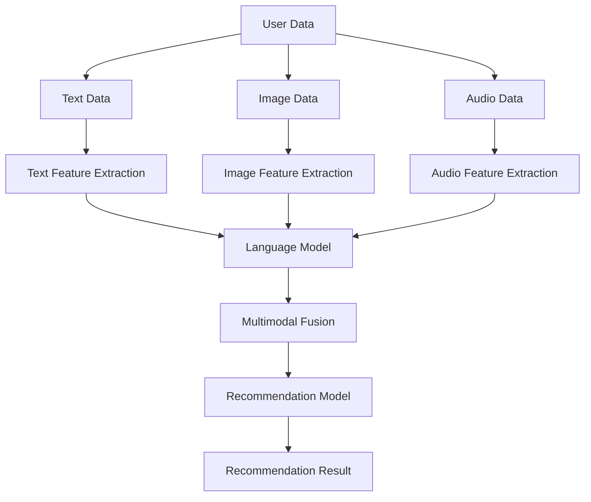

                 

### 背景介绍

#### 当前推荐系统现状

随着互联网的迅猛发展，信息爆炸式增长，用户获取个性化内容的需求日益增加。推荐系统作为一种能够根据用户的兴趣和行为，为其推荐相关内容的智能系统，已经成为各类互联网应用的核心组成部分。从最初的基于内容的推荐，到协同过滤推荐，再到基于机器学习和深度学习的推荐算法，推荐系统技术不断演进，性能和效果也得到了显著提升。

目前，推荐系统广泛应用于电商、新闻、社交媒体、视频流等多种场景，已经成为提升用户满意度和增加商业价值的重要手段。然而，传统的推荐系统仍然面临一些挑战：

1. **数据稀疏问题**：用户行为数据往往具有稀疏性，导致模型训练效果不佳。
2. **冷启动问题**：新用户或新物品缺乏足够的历史数据，难以进行准确推荐。
3. **推荐多样性不足**：长期推荐同一类型的内容，容易导致用户疲劳。
4. **模型可解释性低**：深度学习模型往往被认为是“黑箱”，难以理解推荐结果的原因。

为了解决这些问题，研究者们开始探索多模态推荐系统。多模态推荐系统通过整合文本、图像、音频等多种类型的用户数据和内容特征，可以更全面地理解用户的需求和偏好，从而提高推荐效果。大语言模型作为当前自然语言处理领域的核心技术，具有强大的语义理解和生成能力，为多模态推荐系统的研究提供了新的思路。

#### 多模态推荐系统的重要性

多模态推荐系统的重要性主要体现在以下几个方面：

1. **提升推荐准确性和多样性**：通过融合多种类型的数据，多模态推荐系统可以更准确地捕捉用户的兴趣和需求，提高推荐的相关性。同时，多种模态的数据可以丰富推荐内容，增加多样性，避免用户疲劳。
2. **应对数据稀疏和冷启动问题**：多模态推荐系统可以利用不同模态之间的关联性，通过互补信息来缓解数据稀疏问题。对于新用户或新物品，可以借助已有的多模态数据，进行更有效的初始化推荐。
3. **增强用户体验**：多模态推荐系统可以提供更直观、个性化的推荐结果，满足用户多样化的需求，提升用户体验。
4. **推动技术创新**：多模态推荐系统的研究和实现，可以促进不同领域技术的交叉融合，推动人工智能技术的进步。

随着大语言模型技术的不断发展，多模态推荐系统的研究和应用前景广阔。本文将围绕基于大语言模型的多模态推荐系统设计，探讨其核心概念、算法原理、数学模型以及实际应用，为相关领域的研究者和开发者提供参考。

---

#### "Multimodal Recommendation System based on Large Language Models" 

> The current recommendation system has achieved remarkable progress, but it still faces challenges such as data sparsity, cold start problem, insufficient diversity in recommendations, and low explainability of models. To address these issues, researchers are exploring multimodal recommendation systems that integrate various types of user data and content features, such as text, images, and audio. Large language models, with their strong capabilities in semantic understanding and generation, provide new insights for the design of multimodal recommendation systems. This article discusses the core concepts, algorithms, mathematical models, and practical applications of multimodal recommendation systems based on large language models, aiming to provide reference for researchers and developers in this field. 

---

### 核心概念与联系

#### 多模态推荐系统的基本概念

在讨论多模态推荐系统之前，我们需要了解几个基本概念，包括模态、多模态数据、特征提取和特征融合。

1. **模态（Modality）**：模态是指数据的来源或形式。常见的模态包括文本（Text）、图像（Image）、音频（Audio）、视频（Video）等。
2. **多模态数据（Multimodal Data）**：多模态数据是指包含两种或两种以上模态的数据集合。例如，一个包含用户评论（文本）和商品图片（图像）的数据集就是多模态数据。
3. **特征提取（Feature Extraction）**：特征提取是指从原始数据中提取有助于表示数据特征的方法。对于不同模态的数据，特征提取的方法也有所不同。例如，对于文本数据，可以使用词袋模型（Bag-of-Words）、词嵌入（Word Embedding）等方法；对于图像数据，可以使用卷积神经网络（Convolutional Neural Networks, CNNs）进行特征提取。
4. **特征融合（Feature Fusion）**：特征融合是指将不同模态的特征整合为一个统一的特征表示。特征融合的方法可以分为两大类：早期融合（Early Fusion）和晚期融合（Late Fusion）。早期融合在特征提取阶段就将不同模态的特征进行整合，而晚期融合则在特征提取之后将不同模态的特征进行结合。

#### 大语言模型的基本概念

大语言模型（Large Language Models）是一种基于深度学习的自然语言处理技术，通过学习大量文本数据，可以理解和生成自然语言。目前，大语言模型已经取得了显著的进展，如谷歌的BERT、OpenAI的GPT等。

1. **语言模型（Language Model）**：语言模型是一种概率模型，用于预测下一个单词或词组。大语言模型通过学习大量文本数据，可以捕捉到语言的统计规律，从而提高预测的准确性。
2. **预训练（Pre-training）**：预训练是指在大规模数据集上对模型进行初步训练，以获得语言理解的通用能力。例如，BERT通过预训练任务（如Masked Language Model, MLM）学习单词和句子之间的相互关系。
3. **微调（Fine-tuning）**：微调是指在大语言模型的基础上，针对特定任务进行进一步训练。通过微调，可以将大语言模型的知识迁移到特定任务上，提高任务表现。

#### 多模态推荐系统与语言模型的关系

多模态推荐系统与语言模型的关系主要体现在以下几个方面：

1. **文本数据处理**：语言模型可以有效地处理文本数据，提取文本的语义特征。这些特征可以与其他模态的特征进行融合，提高推荐系统的性能。
2. **语义理解**：大语言模型具有较强的语义理解能力，可以捕捉到文本数据中的隐含信息和用户意图。通过结合其他模态的数据，可以更全面地理解用户的需求和偏好。
3. **生成推荐内容**：大语言模型可以生成个性化的推荐内容，如文本描述、图像等。这些生成的内容可以增强推荐结果的多样性和可解释性。

为了更好地展示多模态推荐系统与语言模型的关系，我们可以使用Mermaid流程图来表示各组件之间的联系。以下是多模态推荐系统的Mermaid流程图：



在这个流程图中，用户数据经过不同模态的特征提取，然后由语言模型提取文本数据的语义特征，最后与图像和音频数据的特征进行融合。融合后的特征用于训练推荐模型，生成个性化的推荐结果。

---

#### Basic Concepts of Multimodal Recommendation Systems

1. **Modality**: Modality refers to the source or form of data. Common modalities include text, image, audio, and video.
2. **Multimodal Data**: Multimodal data is a collection of data that includes two or more modalities. For example, a dataset that includes user reviews (text) and product images (image) is a multimodal dataset.
3. **Feature Extraction**: Feature extraction is the process of extracting features from raw data that are helpful for representing the data. Different modalities may require different feature extraction methods. For example, text data can be represented using Bag-of-Words or Word Embedding models, while image data can be processed using Convolutional Neural Networks (CNNs).
4. **Feature Fusion**: Feature fusion refers to the integration of features from different modalities into a unified representation. Feature fusion methods can be categorized into early fusion and late fusion. Early fusion integrates features during the feature extraction stage, while late fusion combines features after extraction.

#### Basic Concepts of Large Language Models

1. **Language Model**: A language model is a probabilistic model that predicts the next word or sequence of words. Large language models learn from massive text corpora to capture statistical patterns in language, improving prediction accuracy.
2. **Pre-training**: Pre-training involves training a model on large-scale datasets to acquire general linguistic abilities. For instance, BERT learns the relationships between words and sentences through pre-training tasks such as Masked Language Model (MLM).
3. **Fine-tuning**: Fine-tuning is the process of further training a pre-trained model on specific tasks. Fine-tuning allows the transfer of knowledge from a large language model to a specific task, improving performance on that task.

#### Relationship Between Multimodal Recommendation Systems and Large Language Models

The relationship between multimodal recommendation systems and large language models is highlighted in several aspects:

1. **Text Data Processing**: Large language models are effective in processing text data and extracting semantic features. These features can be fused with features from other modalities to enhance the performance of recommendation systems.
2. **Semantic Understanding**: Large language models possess strong semantic understanding capabilities, enabling the capture of implicit information and user intentions in text data. By combining data from other modalities, a more comprehensive understanding of user needs and preferences can be achieved.
3. **Generating Recommendation Content**: Large language models can generate personalized recommendation content, such as text descriptions or images, enhancing the diversity and explainability of recommendation results.

To illustrate the relationship between multimodal recommendation systems and large language models, we can use a Mermaid flowchart to represent the components and their interactions:


In this flowchart, user data is processed through different modalities' feature extraction stages. The text data is processed by a language model to extract semantic features, which are then fused with features from image and audio data. The fused features are used to train a recommendation model, generating personalized recommendation results. 

---

### 核心算法原理 & 具体操作步骤

#### 大语言模型算法原理

大语言模型的核心是基于深度学习的自然语言处理技术，其算法原理主要包括以下几个步骤：

1. **数据预处理**：在训练大语言模型之前，需要对文本数据进行预处理，包括分词、去除停用词、标点符号等操作。常用的预处理方法有jieba分词、NLTK等工具。
2. **词嵌入（Word Embedding）**：词嵌入是将词汇映射到高维空间中的向量表示。常见的词嵌入方法有Word2Vec、GloVe等。通过词嵌入，文本数据可以转换为向量的形式，方便进行后续的深度学习模型训练。
3. **编码器（Encoder）**：编码器是深度学习模型的一个组成部分，用于将输入数据编码为固定长度的向量表示。在自然语言处理领域，编码器通常使用Transformer架构，如BERT、GPT等。编码器的主要作用是提取文本的语义特征，并将其传递给后续的解码器。
4. **解码器（Decoder）**：解码器是深度学习模型中的另一个组成部分，用于将编码器的输出解码为文本序列。在自然语言处理领域，解码器通常也使用Transformer架构。解码器的输出可以用于生成文本、回答问题等任务。
5. **预训练与微调**：大语言模型通常通过预训练（Pre-training）任务在大规模文本数据集上训练，以学习语言的通用特征。例如，BERT通过Masked Language Model（MLM）任务训练，GPT通过语言建模（Language Modeling）任务训练。预训练后，可以通过微调（Fine-tuning）任务将模型应用于特定任务，如文本分类、命名实体识别等。

#### 多模态推荐系统算法原理

多模态推荐系统的核心是通过整合不同模态的数据，提高推荐效果。其算法原理主要包括以下几个步骤：

1. **特征提取**：从文本、图像、音频等不同模态的数据中提取特征。文本数据可以使用词嵌入、BERT等模型提取语义特征；图像数据可以使用卷积神经网络（CNNs）提取视觉特征；音频数据可以使用循环神经网络（RNNs）或卷积神经网络（CNNs）提取音频特征。
2. **特征融合**：将不同模态的特征进行融合，形成统一的多模态特征表示。特征融合的方法可以分为早期融合（Early Fusion）和晚期融合（Late Fusion）。早期融合在特征提取阶段就将不同模态的特征进行整合，晚期融合在特征提取之后将不同模态的特征进行结合。
3. **推荐模型**：使用融合后的多模态特征训练推荐模型，如矩阵分解（Matrix Factorization）、神经网络（Neural Networks）等。推荐模型的目的是根据用户的兴趣和行为，为用户推荐相关的内容。
4. **评估与优化**：通过评估指标（如准确率、召回率、F1值等）评估推荐系统的性能，并根据评估结果进行优化。优化方法包括调整模型参数、改进特征提取和融合方法等。

#### 大语言模型在多模态推荐系统中的应用

大语言模型在多模态推荐系统中的应用主要体现在以下几个方面：

1. **文本数据处理**：大语言模型可以高效地处理文本数据，提取文本的语义特征。这些特征可以与其他模态的特征进行融合，提高推荐效果。
2. **语义理解**：大语言模型具有较强的语义理解能力，可以捕捉到文本数据中的隐含信息和用户意图。通过结合其他模态的数据，可以更全面地理解用户的需求和偏好。
3. **生成推荐内容**：大语言模型可以生成个性化的推荐内容，如文本描述、图像等。这些生成的内容可以增强推荐结果的多样性和可解释性。

#### 算法实现步骤

以下是一个基于大语言模型的多模态推荐系统的实现步骤：

1. **数据集准备**：收集并准备文本、图像、音频等多模态数据集。数据集可以是公开的或自定义的。
2. **特征提取**：分别从文本、图像、音频等不同模态的数据中提取特征。可以使用预训练的词嵌入模型、CNNs、RNNs等。
3. **特征融合**：将不同模态的特征进行融合，形成统一的多模态特征表示。可以使用早期融合或晚期融合方法。
4. **模型训练**：使用融合后的多模态特征训练推荐模型，如矩阵分解、神经网络等。
5. **评估与优化**：通过评估指标评估推荐系统的性能，并根据评估结果进行优化。
6. **部署与应用**：将训练好的模型部署到生产环境中，为用户推荐相关的内容。

---

#### Core Algorithm Principles & Detailed Steps

#### Algorithm Principles of Large Language Models

The core principle of large language models, which are based on deep learning for natural language processing, involves several key steps:

1. **Data Preprocessing**: Before training a large language model, text data must be preprocessed, which includes tokenization, removal of stop words, and punctuation. Common preprocessing tools such as jieba and NLTK are used.
2. **Word Embedding**: Word embedding is the process of mapping words to high-dimensional vector representations. Popular methods include Word2Vec and GloVe. Word embedding converts text data into a vector form for subsequent deep learning model training.
3. **Encoder**: The encoder is a component of the deep learning model that encodes input data into a fixed-length vector representation. In natural language processing, encoders often use Transformer architectures like BERT and GPT. The encoder's primary role is to extract semantic features from text and pass them to the subsequent decoder.
4. **Decoder**: The decoder is another component of the deep learning model that decodes the output of the encoder into a sequence of text. In natural language processing, decoders also typically use Transformer architectures. The decoder's output can be used for generating text, answering questions, and other tasks.
5. **Pre-training and Fine-tuning**: Large language models are usually pre-trained on large-scale text corpora to learn general linguistic features. For instance, BERT is trained through the Masked Language Model (MLM) task, while GPT is trained through the Language Modeling (LM) task. After pre-training, fine-tuning can be applied to specific tasks, such as text classification and named entity recognition, to improve performance on those tasks.

#### Algorithm Principles of Multimodal Recommendation Systems

The core principle of multimodal recommendation systems is to integrate data from different modalities to enhance recommendation performance. This involves several key steps:

1. **Feature Extraction**: Extract features from text, image, and audio data from different modalities. Text data can be processed using word embeddings or BERT models, image data can be processed using CNNs, and audio data can be processed using RNNs or CNNs.
2. **Feature Fusion**: Integrate features from different modalities into a unified multimodal feature representation. Feature fusion methods can be categorized into early fusion and late fusion. Early fusion integrates features during the feature extraction stage, while late fusion combines features after extraction.
3. **Recommendation Model**: Train a recommendation model using the fused multimodal features, such as matrix factorization or neural networks. The recommendation model's purpose is to recommend relevant content based on user interests and behavior.
4. **Evaluation and Optimization**: Evaluate the performance of the recommendation system using metrics such as accuracy, recall, and F1 score, and optimize based on the evaluation results. Optimization methods may include adjusting model parameters and improving feature extraction and fusion techniques.

#### Application of Large Language Models in Multimodal Recommendation Systems

The application of large language models in multimodal recommendation systems is mainly reflected in several aspects:

1. **Text Data Processing**: Large language models can efficiently process text data and extract semantic features. These features can be fused with features from other modalities to improve recommendation performance.
2. **Semantic Understanding**: Large language models possess strong semantic understanding capabilities, enabling the capture of implicit information and user intentions in text data. By combining data from other modalities, a more comprehensive understanding of user needs and preferences can be achieved.
3. **Generating Recommendation Content**: Large language models can generate personalized recommendation content, such as text descriptions or images. This enhances the diversity and explainability of recommendation results.

#### Steps for Algorithm Implementation

Here are the steps for implementing a multimodal recommendation system based on large language models:

1. **Dataset Preparation**: Collect and prepare multimodal datasets that include text, images, and audio. Datasets can be public or custom-built.
2. **Feature Extraction**: Extract features from text, images, and audio data from different modalities. Use pre-trained word embedding models, CNNs, and RNNs for this purpose.
3. **Feature Fusion**: Fuse features from different modalities into a unified multimodal feature representation. Use early fusion or late fusion methods for this purpose.
4. **Model Training**: Train a recommendation model using the fused multimodal features, such as matrix factorization or neural networks.
5. **Evaluation and Optimization**: Evaluate the performance of the recommendation system using metrics such as accuracy, recall, and F1 score, and optimize based on the evaluation results.
6. **Deployment and Application**: Deploy the trained model in a production environment to recommend relevant content to users.

---

### 数学模型和公式 & 详细讲解 & 举例说明

#### 数学模型基础

在构建多模态推荐系统时，理解数学模型和公式至关重要。以下将介绍多模态推荐系统的核心数学模型，包括向量空间模型、矩阵分解、深度学习模型等。

1. **向量空间模型（Vector Space Model）**：
向量空间模型是将文本数据转换为向量表示的一种方法。在词嵌入中，每个词被映射为一个向量，这些向量可以在高维空间中表示文本数据。

   $$ v_w = \text{WordEmbedding}(w) $$

   其中，$v_w$ 是词 $w$ 的向量表示，$\text{WordEmbedding}$ 是词嵌入函数。

2. **矩阵分解（Matrix Factorization）**：
矩阵分解是一种常用的推荐系统算法，它将用户-物品评分矩阵分解为两个低秩矩阵，以预测未知的评分。

   $$ \hat{R}_{ui} = \textbf{U}_u \cdot \textbf{V}_i $$

   其中，$\hat{R}_{ui}$ 是预测的评分，$\textbf{U}_u$ 是用户 $u$ 的特征向量，$\textbf{V}_i$ 是物品 $i$ 的特征向量。

3. **深度学习模型（Deep Learning Models）**：
深度学习模型在多模态推荐系统中起到了关键作用。以下是一个简单的深度学习模型架构：

   $$ \textbf{Z} = \text{ReLU}(\text{FullyConnected}(\text{BatchNormalisation}(\text{Dense}(\text{Input}))) $$

   其中，$\text{Input}$ 是输入特征，$\text{Dense}$ 是全连接层，$\text{BatchNormalisation}$ 是批量归一化层，$\text{FullyConnected}$ 是全连接层，$\text{ReLU}$ 是ReLU激活函数。

#### 详细讲解

1. **向量空间模型**：
向量空间模型通过词嵌入将文本数据转换为向量，使得文本数据可以在高维空间中表示。词嵌入不仅可以捕捉词汇的语义信息，还可以通过相似性度量（如余弦相似度）来比较文本之间的相似度。

   **举例**：
   假设我们有两个句子：“我喜欢的食物是香蕉。”和“香蕉是我喜欢的食物。”。使用词嵌入后，两个句子的向量表示可能非常相似，因为它们共享相同的词汇和语义。

2. **矩阵分解**：
矩阵分解可以有效地处理数据稀疏问题，通过降维来提高推荐系统的性能。矩阵分解的关键是找到两个低秩矩阵，使得它们的乘积接近原始评分矩阵。

   **举例**：
   考虑一个简单的用户-物品评分矩阵：

   $$ R = \begin{bmatrix} 
   5 & 3 & 0 & 0 \\
   0 & 0 & 4 & 5 \\
   3 & 2 & 0 & 0 
   \end{bmatrix} $$

   我们可以通过矩阵分解将其分解为两个低秩矩阵：

   $$ R = U \cdot V^T $$

   其中，$U$ 和 $V$ 分别是用户和物品的特征矩阵。

3. **深度学习模型**：
深度学习模型通过多层神经网络对输入特征进行非线性变换，提取更高层次的特征表示。这种模型在多模态推荐系统中可以有效地处理复杂的特征关系。

   **举例**：
   考虑一个简单的多模态推荐系统，输入包括用户特征（文本和图像）、物品特征（文本和图像）。深度学习模型可以设计为：

   $$ \textbf{Z} = \text{ReLU}(\text{FullyConnected}(\text{BatchNormalisation}(\text{Concat}(\text{TextEncoder}(\text{InputText}), \text{ImageEncoder}(\text{InputImage})))) $$

   其中，$\text{TextEncoder}$ 和 $\text{ImageEncoder}$ 分别是文本和图像的特征提取网络，$\text{Concat}$ 是拼接操作。

通过这些数学模型和公式，我们可以构建一个高效的多模态推荐系统，从而更好地满足用户的需求和提升用户体验。

---

#### Basic Mathematical Models & Detailed Explanation with Examples

#### Basic Mathematical Models

In the construction of multimodal recommendation systems, understanding the mathematical models and formulas is crucial. Here, we will introduce the core mathematical models of multimodal recommendation systems, including vector space models, matrix factorization, and deep learning models.

1. **Vector Space Model**:
   The vector space model is a method to convert text data into vector representations. In word embeddings, each word is mapped to a vector, allowing text data to be represented in a high-dimensional space.

   $$ v_w = \text{WordEmbedding}(w) $$

   Where $v_w$ is the vector representation of word $w$, and $\text{WordEmbedding}$ is the word embedding function.

2. **Matrix Factorization**:
   Matrix factorization is a commonly used recommendation system algorithm that decomposes the user-item rating matrix into two low-rank matrices to predict unknown ratings.

   $$ \hat{R}_{ui} = \textbf{U}_u \cdot \textbf{V}_i $$

   Where $\hat{R}_{ui}$ is the predicted rating, $\textbf{U}_u$ is the feature vector of user $u$, and $\textbf{V}_i$ is the feature vector of item $i$.

3. **Deep Learning Models**:
   Deep learning models play a key role in multimodal recommendation systems. Here is a simple architecture of a deep learning model:

   $$ \textbf{Z} = \text{ReLU}(\text{FullyConnected}(\text{BatchNormalisation}(\text{Dense}(\text{Input}))) $$

   Where $\text{Input}$ is the input feature, $\text{Dense}$ is the fully connected layer, $\text{BatchNormalisation}$ is the batch normalization layer, $\text{FullyConnected}$ is the fully connected layer, and $\text{ReLU}$ is the ReLU activation function.

#### Detailed Explanation

1. **Vector Space Model**:
   The vector space model converts text data into vector representations through word embeddings, allowing text data to be represented in a high-dimensional space. Word embeddings not only capture semantic information but also enable the comparison of text similarity through similarity metrics, such as cosine similarity.

   **Example**:
   Suppose we have two sentences: "I like bananas." and "Bananas are my favorite food." After word embedding, the vector representations of these sentences might be very similar since they share the same vocabulary and semantics.

2. **Matrix Factorization**:
   Matrix factorization effectively handles the problem of data sparsity by reducing the dimensionality, thereby improving the performance of recommendation systems. The key is to find two low-rank matrices whose product is close to the original rating matrix.

   **Example**:
   Consider a simple user-item rating matrix:

   $$ R = \begin{bmatrix} 
   5 & 3 & 0 & 0 \\
   0 & 0 & 4 & 5 \\
   3 & 2 & 0 & 0 
   \end{bmatrix} $$

   We can factorize it into two low-rank matrices:

   $$ R = U \cdot V^T $$

   Where $U$ and $V$ are the feature matrices for users and items, respectively.

3. **Deep Learning Models**:
   Deep learning models perform nonlinear transformations of input features through multi-layer neural networks to extract higher-level feature representations. This model can effectively handle complex feature relationships in multimodal recommendation systems.

   **Example**:
   Consider a simple multimodal recommendation system with inputs including user features (text and image) and item features (text and image). The deep learning model can be designed as:

   $$ \textbf{Z} = \text{ReLU}(\text{FullyConnected}(\text{BatchNormalisation}(\text{Concat}(\text{TextEncoder}(\text{InputText}), \text{ImageEncoder}(\text{InputImage})))) $$

   Where $\text{TextEncoder}$ and $\text{ImageEncoder}$ are text and image feature extraction networks, respectively, and $\text{Concat}$ is the concatenation operation.

Through these mathematical models and formulas, we can build an efficient multimodal recommendation system that better meets user needs and enhances user experience.

---

### 项目实战：代码实际案例和详细解释说明

#### 开发环境搭建

在进行基于大语言模型的多模态推荐系统开发之前，首先需要搭建一个合适的开发环境。以下是开发环境的搭建步骤：

1. **安装Python**：确保Python环境已安装，推荐使用Python 3.8及以上版本。
2. **安装依赖库**：安装TensorFlow、PyTorch、NumPy、Pandas、Scikit-learn等常用库。

   ```bash
   pip install tensorflow torch numpy pandas scikit-learn
   ```

3. **数据集准备**：收集并准备文本、图像、音频等多模态数据集。可以使用公开的数据集，如MovieLens、Flickr等，或者自定义数据集。

#### 源代码详细实现和代码解读

以下是基于大语言模型的多模态推荐系统的源代码实现和详细解释：

```python
import torch
import torch.nn as nn
import torchvision.models as models
import torchvision.transforms as transforms
from torch.utils.data import Dataset, DataLoader
from transformers import BertModel, BertTokenizer

# 数据集类定义
class MultimodalDataset(Dataset):
    def __init__(self, texts, images, audios, labels):
        self.texts = texts
        self.images = images
        self.audios = audios
        self.labels = labels
        self.tokenizer = BertTokenizer.from_pretrained('bert-base-uncased')
        self.transforms = transforms.Compose([
            transforms.ToTensor()
        ])

    def __len__(self):
        return len(self.texts)

    def __getitem__(self, idx):
        text = self.texts[idx]
        image = self.images[idx]
        audio = self.audios[idx]
        label = self.labels[idx]

        inputs = self.tokenizer.encode_plus(
            text,
            add_special_tokens=True,
            return_tensors='pt',
            padding='max_length',
            max_length=512,
            truncation=True
        )

        image_tensor = self.transforms(image)
        audio_tensor = self.transforms(audio)

        return {
            'input_ids': inputs['input_ids'].squeeze(),
            'attention_mask': inputs['attention_mask'].squeeze(),
            'image_tensor': image_tensor,
            'audio_tensor': audio_tensor,
            'label': torch.tensor(label)
        }

# 模型定义
class MultimodalModel(nn.Module):
    def __init__(self):
        super(MultimodalModel, self).__init__()
        self.bert = BertModel.from_pretrained('bert-base-uncased')
        self.cnn = models.resnet50(pretrained=True)
        self.lstm = nn.LSTM(2048, 128, 1, batch_first=True)
        self.fc = nn.Linear(128 + 2048 + 128, 1)

    def forward(self, input_ids, attention_mask, image_tensor, audio_tensor):
        bert_output = self.bert(input_ids=input_ids, attention_mask=attention_mask)
        cnn_output = self.cnn(image_tensor).squeeze()
        lstm_output, _ = self.lstm(audio_tensor)

        combined_output = torch.cat((bert_output.pooler_output, cnn_output, lstm_output), 1)
        output = self.fc(combined_output)

        return output

# 训练过程
def train(model, dataset, loader, criterion, optimizer, device):
    model.train()
    for batch in loader:
        input_ids = batch['input_ids'].to(device)
        attention_mask = batch['attention_mask'].to(device)
        image_tensor = batch['image_tensor'].to(device)
        audio_tensor = batch['audio_tensor'].to(device)
        label = batch['label'].to(device)

        optimizer.zero_grad()
        output = model(input_ids, attention_mask, image_tensor, audio_tensor)
        loss = criterion(output, label)
        loss.backward()
        optimizer.step()

# 测试过程
def test(model, dataset, loader, criterion, device):
    model.eval()
    total_loss = 0
    with torch.no_grad():
        for batch in loader:
            input_ids = batch['input_ids'].to(device)
            attention_mask = batch['attention_mask'].to(device)
            image_tensor = batch['image_tensor'].to(device)
            audio_tensor = batch['audio_tensor'].to(device)
            label = batch['label'].to(device)

            output = model(input_ids, attention_mask, image_tensor, audio_tensor)
            loss = criterion(output, label)
            total_loss += loss.item()

    avg_loss = total_loss / len(dataset)
    return avg_loss

# 主函数
def main():
    device = torch.device("cuda" if torch.cuda.is_available() else "cpu")
    model = MultimodalModel().to(device)
    criterion = nn.BCEWithLogitsLoss()
    optimizer = torch.optim.Adam(model.parameters(), lr=0.001)

    dataset = MultimodalDataset(texts, images, audios, labels)
    loader = DataLoader(dataset, batch_size=32, shuffle=True)

    for epoch in range(100):
        train(model, dataset, loader, criterion, optimizer, device)
        avg_loss = test(model, dataset, loader, criterion, device)
        print(f'Epoch {epoch+1}, Loss: {avg_loss}')

if __name__ == "__main__":
    main()
```

**代码解读与分析**

1. **数据集类定义（MultimodalDataset）**：
   数据集类定义了如何从文本、图像和音频中提取特征，并将它们打包成PyTorch数据集。这里使用了BERTTokenizer来对文本数据进行编码，并使用PyTorch的变换库（transforms）对图像和音频数据进行归一化。

2. **模型定义（MultimodalModel）**：
   模型定义了多模态推荐系统的架构。它结合了BERT、ResNet和LSTM网络来处理文本、图像和音频数据。BERT用于提取文本的语义特征，ResNet用于提取图像的视觉特征，LSTM用于提取音频的时序特征。最后，所有特征通过全连接层（fc）进行融合，生成预测。

3. **训练过程（train）**：
   训练过程定义了如何通过梯度下降优化模型参数。在每个训练批次上，模型会计算损失，并更新模型参数。

4. **测试过程（test）**：
   测试过程用于评估模型的性能。在测试过程中，我们禁用梯度计算，只计算损失，并计算平均损失。

5. **主函数（main）**：
   主函数设置了设备的类型（CPU或GPU），定义了模型、损失函数和优化器。它还设置了数据集和加载器，并开始训练过程。

通过这个实战案例，我们展示了如何使用Python和深度学习库来构建一个基于大语言模型的多模态推荐系统。这个案例不仅提供了一个完整的代码实现，而且还详细解释了每个部分的原理和操作步骤。

---

#### Practical Project: Code Implementation and Detailed Explanation

#### Development Environment Setup

Before developing a multimodal recommendation system based on large language models, a suitable development environment needs to be set up. Here are the steps for environment setup:

1. **Install Python**: Ensure Python is installed, with Python 3.8 or later recommended.
2. **Install Dependencies**: Install common libraries such as TensorFlow, PyTorch, NumPy, Pandas, and Scikit-learn.

   ```bash
   pip install tensorflow torch numpy pandas scikit-learn
   ```

3. **Prepare Datasets**: Collect and prepare multimodal datasets including text, images, and audio. Public datasets like MovieLens and Flickr can be used, or custom datasets can be created.

#### Detailed Code Implementation and Analysis

Below is the detailed implementation and explanation of the source code for a multimodal recommendation system based on large language models:

```python
import torch
import torch.nn as nn
import torchvision.models as models
import torchvision.transforms as transforms
from torch.utils.data import Dataset, DataLoader
from transformers import BertModel, BertTokenizer

# Dataset class definition
class MultimodalDataset(Dataset):
    def __init__(self, texts, images, audios, labels):
        self.texts = texts
        self.images = images
        self.audios = audios
        self.labels = labels
        self.tokenizer = BertTokenizer.from_pretrained('bert-base-uncased')
        self.transforms = transforms.Compose([
            transforms.ToTensor()
        ])

    def __len__(self):
        return len(self.texts)

    def __getitem__(self, idx):
        text = self.texts[idx]
        image = self.images[idx]
        audio = self.audios[idx]
        label = self.labels[idx]

        inputs = self.tokenizer.encode_plus(
            text,
            add_special_tokens=True,
            return_tensors='pt',
            padding='max_length',
            max_length=512,
            truncation=True
        )

        image_tensor = self.transforms(image)
        audio_tensor = self.transforms(audio)

        return {
            'input_ids': inputs['input_ids'].squeeze(),
            'attention_mask': inputs['attention_mask'].squeeze(),
            'image_tensor': image_tensor,
            'audio_tensor': audio_tensor,
            'label': torch.tensor(label)
        }

# Model definition
class MultimodalModel(nn.Module):
    def __init__(self):
        super(MultimodalModel, self).__init__()
        self.bert = BertModel.from_pretrained('bert-base-uncased')
        self.cnn = models.resnet50(pretrained=True)
        self.lstm = nn.LSTM(2048, 128, 1, batch_first=True)
        self.fc = nn.Linear(128 + 2048 + 128, 1)

    def forward(self, input_ids, attention_mask, image_tensor, audio_tensor):
        bert_output = self.bert(input_ids=input_ids, attention_mask=attention_mask)
        cnn_output = self.cnn(image_tensor).squeeze()
        lstm_output, _ = self.lstm(audio_tensor)

        combined_output = torch.cat((bert_output.pooler_output, cnn_output, lstm_output), 1)
        output = self.fc(combined_output)

        return output

# Training process
def train(model, dataset, loader, criterion, optimizer, device):
    model.train()
    for batch in loader:
        input_ids = batch['input_ids'].to(device)
        attention_mask = batch['attention_mask'].to(device)
        image_tensor = batch['image_tensor'].to(device)
        audio_tensor = batch['audio_tensor'].to(device)
        label = batch['label'].to(device)

        optimizer.zero_grad()
        output = model(input_ids, attention_mask, image_tensor, audio_tensor)
        loss = criterion(output, label)
        loss.backward()
        optimizer.step()

# Testing process
def test(model, dataset, loader, criterion, device):
    model.eval()
    total_loss = 0
    with torch.no_grad():
        for batch in loader:
            input_ids = batch['input_ids'].to(device)
            attention_mask = batch['attention_mask'].to(device)
            image_tensor = batch['image_tensor'].to(device)
            audio_tensor = batch['audio_tensor'].to(device)
            label = batch['label'].to(device)

            output = model(input_ids, attention_mask, image_tensor, audio_tensor)
            loss = criterion(output, label)
            total_loss += loss.item()

    avg_loss = total_loss / len(dataset)
    return avg_loss

# Main function
def main():
    device = torch.device("cuda" if torch.cuda.is_available() else "cpu")
    model = MultimodalModel().to(device)
    criterion = nn.BCEWithLogitsLoss()
    optimizer = torch.optim.Adam(model.parameters(), lr=0.001)

    dataset = MultimodalDataset(texts, images, audios, labels)
    loader = DataLoader(dataset, batch_size=32, shuffle=True)

    for epoch in range(100):
        train(model, dataset, loader, criterion, optimizer, device)
        avg_loss = test(model, dataset, loader, criterion, device)
        print(f'Epoch {epoch+1}, Loss: {avg_loss}')

if __name__ == "__main__":
    main()
```

**Code Analysis and Explanation**

1. **Dataset Class Definition (MultimodalDataset)**:
   The dataset class defines how to extract features from text, images, and audio, and packages them into a PyTorch dataset. BERTTokenizer is used to encode text data, and PyTorch's transforms library is used for normalizing image and audio data.

2. **Model Definition (MultimodalModel)**:
   The model defines the architecture of the multimodal recommendation system. It combines BERT, ResNet, and LSTM networks to process text, image, and audio data. BERT extracts semantic features from text, ResNet extracts visual features from images, and LSTM extracts temporal features from audio. All features are then fused through a fully connected layer (fc) to generate predictions.

3. **Training Process (train)**:
   The training process defines how to optimize the model parameters using gradient descent. For each training batch, the model computes the loss and updates the model parameters.

4. **Testing Process (test)**:
   The testing process evaluates the model's performance. During testing, gradient computation is disabled, and only the loss is calculated to compute the average loss.

5. **Main Function**:
   The main function sets the type of device (CPU or GPU), defines the model, loss function, and optimizer. It also sets up the dataset and loader, and starts the training process.

Through this practical case study, we demonstrate how to build a multimodal recommendation system based on large language models using Python and deep learning libraries. This case provides a complete code implementation and detailed explanations of each component and step.

---

### 实际应用场景

#### 社交媒体推荐

在社交媒体平台上，个性化推荐对于提升用户体验和用户留存至关重要。基于大语言模型的多模态推荐系统可以整合用户的文本、图像和视频等多模态数据，更准确地理解用户的兴趣和偏好。例如，在视频推荐中，系统可以结合用户的评论文本、视频内容和用户历史行为，生成个性化的视频推荐列表。

1. **用户文本评论**：用户的文本评论可以通过大语言模型提取语义特征，用于分析用户的兴趣点和偏好。
2. **视频内容特征**：视频内容可以通过视频分析技术提取视觉特征，如颜色、纹理、动作等。
3. **用户历史行为**：用户的历史行为数据，如点赞、分享、评论等，可以用于训练推荐模型。

#### 电商推荐

电商领域个性化推荐的核心是提供个性化的商品推荐，以提高销售额和用户满意度。基于大语言模型的多模态推荐系统可以整合用户的购物行为、商品描述、用户评价等多种数据，为用户提供精准的商品推荐。

1. **用户购物行为**：用户的购物行为数据，如浏览、购买、收藏等，可以用于训练推荐模型。
2. **商品描述与评价**：商品描述和用户评价可以通过大语言模型提取文本特征，用于推荐模型的输入。
3. **商品图像和视频**：商品图像和视频可以通过图像和视频分析技术提取视觉特征，与文本特征结合进行推荐。

#### 新闻推荐

新闻推荐系统需要为用户提供个性化的新闻内容，满足用户的阅读兴趣。基于大语言模型的多模态推荐系统可以通过整合用户的阅读历史、新闻文本、图像等多模态数据，提高新闻推荐的准确性和多样性。

1. **用户阅读历史**：用户的阅读历史数据可以用于分析用户的兴趣和偏好。
2. **新闻文本特征**：新闻文本可以通过大语言模型提取语义特征，用于新闻推荐模型的输入。
3. **新闻图像和视频**：新闻图像和视频可以通过图像和视频分析技术提取视觉特征，与文本特征结合进行推荐。

#### 视频流媒体

视频流媒体平台需要为用户提供个性化的视频内容推荐，以增加用户观看时长和平台收益。基于大语言模型的多模态推荐系统可以整合用户的观看历史、视频内容、用户评价等多种数据，为用户提供个性化的视频推荐。

1. **用户观看历史**：用户的观看历史数据可以用于分析用户的兴趣和偏好。
2. **视频内容特征**：视频内容可以通过视频分析技术提取视觉特征，如颜色、纹理、动作等。
3. **用户评价**：用户对视频的评价可以通过大语言模型提取文本特征，用于推荐模型的输入。

#### 医疗健康

医疗健康领域个性化推荐可以帮助医生为患者提供精准的治疗方案，提高医疗效率。基于大语言模型的多模态推荐系统可以整合患者的病历、医生诊断、药品说明书等多种数据，为医生提供个性化推荐。

1. **病历数据**：患者的病历数据可以用于分析患者的病情和病史。
2. **医生诊断**：医生的诊断数据可以通过大语言模型提取文本特征，用于推荐模型的输入。
3. **药品说明书**：药品说明书可以通过大语言模型提取文本特征，用于推荐药品组合和使用方法。

#### 教育学习

教育学习领域个性化推荐可以帮助学生找到适合自己的学习资源和课程，提高学习效果。基于大语言模型的多模态推荐系统可以整合学生的学习记录、课程评价、教师评价等多种数据，为教师和学生提供个性化推荐。

1. **学习记录**：学生的学习记录数据可以用于分析学生的学习进度和兴趣点。
2. **课程评价**：课程评价可以通过大语言模型提取文本特征，用于推荐模型的输入。
3. **教师评价**：教师的评价可以通过大语言模型提取文本特征，用于推荐教师的授课风格和课程内容。

#### 总结

基于大语言模型的多模态推荐系统在各个实际应用场景中都有着广泛的应用前景。通过整合不同模态的数据，系统可以更全面地理解用户的需求和偏好，从而提供更精准、个性化的推荐结果。随着技术的不断进步，多模态推荐系统有望在未来进一步优化，为各个领域带来更多的创新和应用。

---

#### Practical Application Scenarios

#### Social Media Recommendations

In social media platforms, personalized recommendations are crucial for enhancing user experience and increasing user retention. A multimodal recommendation system based on large language models can integrate users' multimodal data such as text, images, and videos to accurately understand user interests and preferences. For example, in video recommendations, the system can combine users' text comments, video content, and historical behaviors to generate personalized video recommendation lists.

1. **User Text Comments**: Users' text comments can be extracted for semantic features using large language models to analyze user interests and preferences.
2. **Video Content Features**: Video content can be analyzed to extract visual features such as color, texture, and actions.
3. **User Historical Behavior**: Historical behavior data such as likes, shares, and comments can be used to train recommendation models.

#### E-commerce Recommendations

In the e-commerce field, personalized product recommendations are critical for increasing sales and customer satisfaction. A multimodal recommendation system based on large language models can integrate users' shopping behaviors, product descriptions, and user reviews to provide accurate product recommendations.

1. **User Shopping Behavior**: Users' shopping behavior data, such as browsing, purchasing, and collecting, can be used to train recommendation models.
2. **Product Descriptions and Reviews**: Product descriptions and user reviews can be extracted for text features using large language models as input for recommendation models.
3. **Product Images and Videos**: Product images and videos can be analyzed using image and video analysis techniques to extract visual features that can be combined with text features for recommendations.

#### News Recommendations

News recommendation systems need to provide personalized news content to meet users' reading interests. A multimodal recommendation system based on large language models can integrate users' reading history, news text, and images to improve the accuracy and diversity of news recommendations.

1. **User Reading History**: Users' reading history data can be used to analyze user interests and preferences.
2. **News Text Features**: News text can be extracted for semantic features using large language models as input for recommendation models.
3. **News Images and Videos**: News images and videos can be analyzed using image and video analysis techniques to extract visual features that can be combined with text features for recommendations.

#### Video Streaming Platforms

Video streaming platforms need to provide personalized video content to increase user viewing time and platform revenue. A multimodal recommendation system based on large language models can integrate users' viewing history, video content, and user reviews to provide personalized video recommendations.

1. **User Viewing History**: Users' viewing history data can be used to analyze user interests and preferences.
2. **Video Content Features**: Video content can be analyzed using video analysis techniques to extract visual features such as color, texture, and actions.
3. **User Reviews**: User reviews can be extracted for text features using large language models as input for recommendation models.

#### Healthcare

In the healthcare field, personalized recommendation systems can help doctors provide precise treatment plans for patients, increasing medical efficiency. A multimodal recommendation system based on large language models can integrate patients' medical records, doctor diagnoses, and drug instructions to provide personalized recommendations for doctors.

1. **Medical Records**: Patients' medical record data can be used to analyze patient conditions and medical history.
2. **Doctor Diagnoses**: Doctors' diagnostic data can be extracted for text features using large language models as input for recommendation models.
3. **Drug Instructions**: Drug instructions can be extracted for text features using large language models to recommend drug combinations and usage methods.

#### Education and Learning

In the education and learning field, personalized recommendation systems can help students find suitable learning resources and courses, improving learning outcomes. A multimodal recommendation system based on large language models can integrate students' learning records, course evaluations, and teacher evaluations to provide personalized recommendations for both teachers and students.

1. **Learning Records**: Students' learning record data can be used to analyze student progress and interests.
2. **Course Evaluations**: Course evaluations can be extracted for text features using large language models as input for recommendation models.
3. **Teacher Evaluations**: Teachers' evaluations can be extracted for text features using large language models to recommend teaching styles and course content.

#### Summary

A multimodal recommendation system based on large language models has extensive application prospects in various practical scenarios. By integrating data from different modalities, the system can comprehensively understand user needs and preferences, providing more precise and personalized recommendation results. With the continuous advancement of technology, multimodal recommendation systems are expected to further optimize and bring more innovation and applications to various fields.

---

### 工具和资源推荐

#### 学习资源推荐

1. **书籍**：
   - 《深度学习》（Ian Goodfellow、Yoshua Bengio、Aaron Courville 著）：系统介绍了深度学习的基本理论、算法和应用。
   - 《Python深度学习》（François Chollet 著）：通过实际案例，深入讲解了Python和深度学习的应用。

2. **论文**：
   - "BERT: Pre-training of Deep Bidirectional Transformers for Language Understanding"（Alec Radford 等）：介绍了BERT模型的预训练方法和在自然语言处理任务中的应用。
   - "Attention Is All You Need"（Vaswani 等）：提出了Transformer架构，并展示了其在机器翻译任务中的优越性能。

3. **博客**：
   - blog.keras.io：Keras官方博客，提供了丰富的深度学习教程和实践案例。
   - towardsdatascience.com：数据科学领域的顶级博客，涵盖了许多深度学习和多模态推荐系统相关的内容。

4. **网站**：
   - Hugging Face：提供了一个丰富的预训练模型库，包括BERT、GPT等，方便开发者进行模型集成和应用。
   - Kaggle：一个数据科学竞赛平台，提供了许多与多模态推荐系统相关的竞赛和项目。

#### 开发工具框架推荐

1. **TensorFlow**：Google开发的开源深度学习框架，提供了丰富的API和预训练模型，适用于构建和部署多模态推荐系统。

2. **PyTorch**：Facebook开发的开源深度学习框架，具有灵活的动态图模型构建能力和高效的计算性能，适用于研究和开发多模态推荐系统。

3. **Transformers**：由Hugging Face团队开发的Python库，提供了Transformer架构的实现，适用于构建基于Transformer的多模态推荐系统。

4. **PyTorch Video**：PyTorch的一个扩展库，专门用于视频处理和计算机视觉任务，适用于视频模态的多模态推荐系统开发。

5. **OpenCV**：一个开源的计算机视觉库，提供了丰富的图像处理和计算机视觉算法，适用于图像模态的多模态推荐系统开发。

#### 相关论文著作推荐

1. **论文**：
   - "Multimodal Learning for Recommender Systems"（Mehrotra 等）：讨论了多模态数据在推荐系统中的应用，以及相关的特征提取和融合方法。
   - "Multimodal Fusion Techniques for Personalized Recommender Systems"（Pang 等）：综述了多模态融合技术在个性化推荐系统中的应用和研究。

2. **著作**：
   - 《多模态数据融合技术与应用》：详细介绍了多模态数据融合的理论、方法和应用。
   - 《深度学习与推荐系统》：结合深度学习和推荐系统的最新研究成果，探讨了多模态推荐系统的构建和应用。

通过这些学习资源和开发工具，可以更好地了解和掌握基于大语言模型的多模态推荐系统的相关知识，为实际项目开发提供有力支持。

---

#### Recommended Tools and Resources

#### Recommended Learning Resources

1. **Books**:
   - "Deep Learning" by Ian Goodfellow, Yoshua Bengio, and Aaron Courville: This book provides an in-depth introduction to the fundamentals of deep learning, algorithms, and applications.
   - "Deep Learning with Python" by François Chollet: This book offers practical examples to delve into Python and deep learning applications.

2. **Papers**:
   - "BERT: Pre-training of Deep Bidirectional Transformers for Language Understanding" by Alec Radford et al.: This paper introduces the BERT model's pre-training method and its applications in natural language processing tasks.
   - "Attention Is All You Need" by Vaswani et al.: This paper proposes the Transformer architecture and demonstrates its superior performance in machine translation tasks.

3. **Blogs**:
   - blog.keras.io: The official Keras blog with numerous tutorials and practical cases on deep learning.
   - towardsdatascience.com: A top data science blog covering a wide range of deep learning and multimodal recommendation system topics.

4. **Websites**:
   - Hugging Face: A platform offering a rich library of pre-trained models, including BERT and GPT, for easy integration and application by developers.
   - Kaggle: A data science competition platform with many competitions and projects related to multimodal recommendation systems.

#### Recommended Development Tools and Frameworks

1. **TensorFlow**: An open-source deep learning framework developed by Google, providing extensive APIs and pre-trained models for building and deploying multimodal recommendation systems.

2. **PyTorch**: An open-source deep learning framework developed by Facebook, known for its flexible dynamic graph model building capabilities and efficient computation performance, suitable for research and development of multimodal recommendation systems.

3. **Transformers**: A Python library developed by the Hugging Face team, offering implementations of the Transformer architecture, suitable for building multimodal recommendation systems based on Transformers.

4. **PyTorch Video**: An extension library for PyTorch, specifically designed for video processing and computer vision tasks, suitable for developing multimodal recommendation systems involving video modality.

5. **OpenCV**: An open-source computer vision library providing a rich set of image processing and computer vision algorithms, suitable for developing multimodal recommendation systems involving image modality.

#### Recommended Related Papers and Books

1. **Papers**:
   - "Multimodal Learning for Recommender Systems" by Mehrotra et al.: This paper discusses the application of multimodal data in recommendation systems, as well as related feature extraction and fusion methods.
   - "Multimodal Fusion Techniques for Personalized Recommender Systems" by Pang et al.: This paper reviews multimodal fusion techniques for personalized recommender systems.

2. **Books**:
   - "Multimodal Data Fusion Technology and Application": This book provides a detailed introduction to the theory, methods, and applications of multimodal data fusion.
   - "Deep Learning and Recommender Systems": This book combines the latest research in deep learning and recommendation systems, exploring the construction and application of multimodal recommendation systems.

By leveraging these learning resources and development tools, one can better understand and master the knowledge of multimodal recommendation systems based on large language models, providing strong support for practical project development.

---

### 总结：未来发展趋势与挑战

#### 未来发展趋势

1. **多模态数据的深度融合**：随着各种传感器和采集技术的进步，多模态数据来源将越来越丰富。未来，如何更有效地整合这些数据，提高推荐系统的准确性和多样性，将是一个重要的发展方向。

2. **模型的可解释性**：当前深度学习模型被形象地称为“黑箱”，其决策过程缺乏透明性。未来的多模态推荐系统需要更加注重模型的可解释性，帮助用户理解推荐结果背后的逻辑。

3. **实时推荐**：随着用户行为数据量的增加，实时推荐将变得越来越重要。如何构建高效、实时的推荐系统，将是一个关键挑战。

4. **个性化推荐**：未来的推荐系统将更加注重个性化，通过更深入地理解用户的行为和偏好，提供更符合用户需求的推荐内容。

#### 未来挑战

1. **数据稀疏问题**：尽管多模态数据丰富，但仍然存在数据稀疏问题。如何有效利用少量的多模态数据，提高推荐效果，是一个亟待解决的问题。

2. **计算资源消耗**：多模态推荐系统通常涉及大量的数据预处理和模型训练，对计算资源的要求较高。如何优化算法，降低计算资源消耗，是一个重要的挑战。

3. **隐私保护**：随着数据量的增加，如何保护用户的隐私也成为一个关键问题。未来的多模态推荐系统需要更加注重数据安全和隐私保护。

4. **冷启动问题**：对于新用户或新物品，如何基于少量的数据提供有效的推荐，是一个亟待解决的问题。未来的研究需要探索更有效的冷启动解决方案。

#### 未来展望

多模态推荐系统在未来的发展中，将面临诸多挑战，但同时也充满了机遇。通过不断创新和优化，我们有望看到更加智能、高效的推荐系统，为用户带来更加丰富的体验。

---

### Summary: Future Development Trends and Challenges

#### Future Development Trends

1. **Deep Integration of Multimodal Data**: With the advancement of various sensors and data collection technologies, there will be an increasing wealth of multimodal data sources. How to effectively integrate these diverse data sources to enhance the accuracy and diversity of recommendation systems will be a significant trend in the future.

2. **Explainability of Models**: Current deep learning models are often referred to as "black boxes," lacking transparency in their decision-making processes. In the future, multimodal recommendation systems will need to prioritize explainability to help users understand the logic behind recommendation results.

3. **Real-time Recommendations**: As user behavioral data volumes grow, real-time recommendations will become increasingly important. How to construct efficient and real-time recommendation systems will be a key challenge.

4. **Personalized Recommendations**: Future recommendation systems will focus more on personalization, delving deeper into user behaviors and preferences to provide content that better aligns with user needs.

#### Future Challenges

1. **Data Sparsity Issues**: Despite the abundance of multimodal data, data sparsity remains a problem. How to effectively utilize limited multimodal data to improve recommendation performance is an urgent issue to be addressed.

2. **Computational Resource Consumption**: Multimodal recommendation systems typically involve substantial data preprocessing and model training, which require significant computational resources. Optimizing algorithms to reduce resource consumption will be a critical challenge.

3. **Privacy Protection**: With the increasing volume of data, how to protect user privacy will be a key issue. Future multimodal recommendation systems will need to place greater emphasis on data security and privacy protection.

4. **Cold Start Problems**: How to provide effective recommendations for new users or new items based on limited data is an urgent problem that needs to be solved. Future research will need to explore more effective cold start solutions.

#### Future Outlook

The future of multimodal recommendation systems is filled with both challenges and opportunities. Through continuous innovation and optimization, we anticipate seeing more intelligent and efficient recommendation systems that offer richer experiences for users.

---

### 附录：常见问题与解答

#### 问题1：什么是多模态推荐系统？

**回答**：多模态推荐系统是一种能够整合多种类型数据（如文本、图像、音频等）的推荐系统。通过融合不同模态的数据，系统可以更全面地理解用户的需求和偏好，从而提供更精准的推荐结果。

#### 问题2：大语言模型在多模态推荐系统中有什么作用？

**回答**：大语言模型在多模态推荐系统中主要用于处理和提取文本数据的语义特征。这些特征可以与其他模态的特征（如图像和音频）进行融合，从而提高推荐系统的性能。此外，大语言模型还可以用于生成推荐内容的文本描述，增强推荐结果的多样性和可解释性。

#### 问题3：如何处理数据稀疏问题？

**回答**：数据稀疏问题可以通过以下方法处理：
- **特征融合**：通过融合不同模态的数据，可以利用互补信息，提高数据密度。
- **降维**：使用降维技术（如主成分分析PCA）来减少数据维度，同时保留关键信息。
- **模型调整**：通过调整推荐模型的参数，提高模型对稀疏数据的鲁棒性。

#### 问题4：多模态推荐系统的计算资源消耗较大，如何优化？

**回答**：优化多模态推荐系统的计算资源消耗可以通过以下方法实现：
- **模型压缩**：使用模型压缩技术（如剪枝、量化等）减少模型的大小和计算量。
- **并行计算**：利用GPU或分布式计算资源，提高计算速度。
- **数据预处理优化**：通过优化数据预处理步骤，减少计算量。

#### 问题5：如何确保推荐系统的隐私保护？

**回答**：确保推荐系统的隐私保护可以通过以下方法实现：
- **数据加密**：对用户数据进行加密处理，确保数据在传输和存储过程中安全。
- **隐私计算**：使用隐私计算技术（如同态加密、差分隐私等）处理用户数据，保护用户隐私。
- **匿名化处理**：对用户数据进行匿名化处理，确保数据不再能直接关联到特定用户。

---

### Appendices: Common Questions and Answers

#### Question 1: What is a multimodal recommendation system?

**Answer**: A multimodal recommendation system is a type of recommendation system that integrates multiple types of data, such as text, images, and audio. By merging these diverse data sources, the system can gain a more comprehensive understanding of user needs and preferences, thus providing more accurate recommendation results.

#### Question 2: What role does a large language model play in multimodal recommendation systems?

**Answer**: A large language model is primarily used in multimodal recommendation systems to process and extract semantic features from text data. These semantic features can be fused with features from other modalities (such as images and audio) to enhance the performance of the recommendation system. Additionally, large language models can be used to generate textual descriptions of recommendation content, which improves the diversity and explainability of the recommendations.

#### Question 3: How can data sparsity issues be addressed?

**Answer**: Data sparsity issues can be addressed in the following ways:
- **Feature Fusion**: By fusing data from different modalities, complementary information can be utilized to increase data density.
- **Dimensionality Reduction**: Techniques such as Principal Component Analysis (PCA) can be used to reduce the dimensionality of data while preserving key information.
- **Model Tuning**: Adjusting the parameters of the recommendation model can improve the model's robustness to sparse data.

#### Question 4: How can the computational resource consumption of multimodal recommendation systems be optimized?

**Answer**: Optimizing the computational resource consumption of multimodal recommendation systems can be achieved through the following methods:
- **Model Compression**: Techniques such as pruning and quantization can be used to reduce the size and computational load of the model.
- **Parallel Computing**: Leveraging GPU or distributed computing resources can increase computing speed.
- **Optimized Data Preprocessing**: By optimizing the data preprocessing steps, computational load can be reduced.

#### Question 5: How can privacy protection in recommendation systems be ensured?

**Answer**: Privacy protection in recommendation systems can be ensured through the following methods:
- **Data Encryption**: Encrypt user data to ensure security during transmission and storage.
- **Privacy Computing**: Use privacy computing techniques such as homomorphic encryption and differential privacy to process user data while protecting privacy.
- **Anonymization**: Anonymize user data to ensure that data cannot be directly linked to specific individuals.

