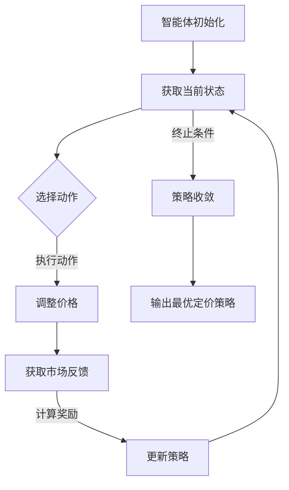

                 

### 背景介绍

强化学习（Reinforcement Learning, RL）作为机器学习领域的一个分支，近年来在人工智能（Artificial Intelligence, AI）应用中取得了显著的进展。强化学习的核心思想是通过智能体（Agent）与环境的交互，不断地学习并优化其行为策略，以最大化累积奖励。这种学习方式在动态环境中具有很强的适应性和灵活性，使得它成为解决动态定价问题的一个有力工具。

动态定价策略（Dynamic Pricing Strategy）是指企业根据市场供需情况、消费者行为以及竞争环境等因素，实时调整产品或服务的价格，以实现利润最大化或市场份额最大化的目标。传统的静态定价策略由于无法应对市场环境的快速变化，往往难以实现最佳定价效果。因此，如何设计一个有效的动态定价策略，成为企业提高竞争力、增加收益的重要课题。

强化学习在动态定价中的应用，主要是通过建立智能体与环境之间的反馈循环，使智能体能够根据市场动态调整定价策略。具体来说，智能体通过不断尝试不同的定价方案，根据消费者的购买行为和环境的变化，学习到最优的定价策略。这种方法不仅能够应对市场环境的动态变化，还能适应不同市场的个性化需求，为企业提供更加灵活和有效的定价策略。

本文将围绕强化学习在动态定价策略中的应用，首先介绍强化学习的基本概念和核心算法，然后深入探讨动态定价策略的基本原理和设计方法。接下来，我们将结合实际案例，详细阐述强化学习在动态定价中的具体实现步骤，并通过数学模型和公式进行详细讲解。最后，我们将探讨强化学习在动态定价中的实际应用场景，并推荐相关工具和资源，以帮助读者更好地理解和实践这一技术。

### 核心概念与联系

为了深入理解强化学习在动态定价策略中的应用，我们需要首先掌握以下几个核心概念：强化学习的基本原理、动态定价的基本概念，以及它们之间的内在联系。

#### 强化学习的基本原理

强化学习（Reinforcement Learning, RL）是一种使智能体（Agent）在与环境（Environment）交互的过程中，通过学习获得最佳策略的机器学习方法。在强化学习中，智能体通过执行动作（Action）来与环境互动，并根据环境的反馈（Reward）来调整其行为策略。

强化学习的核心概念包括：

- **智能体（Agent）**：执行动作并从环境中获取反馈的实体。
- **环境（Environment）**：智能体执行动作的场所，可以是一个物理环境，也可以是一个模拟环境。
- **状态（State）**：描述智能体在某一时刻所处的情境。
- **动作（Action）**：智能体在某一状态下可以采取的行为。
- **奖励（Reward）**：环境对智能体行为的反馈，通常用于评估行为的优劣。
- **策略（Policy）**：智能体在某一状态下采取的最优动作。

强化学习的主要目标是找到一种最优策略，使得智能体在长期执行动作时能够获得最大的累积奖励。这一过程通常通过价值函数（Value Function）和策略迭代（Policy Iteration）来实现。

#### 动态定价的基本概念

动态定价策略是一种根据市场需求、竞争环境、消费者行为等因素实时调整产品或服务价格的定价策略。与传统的静态定价策略不同，动态定价策略能够灵活应对市场变化，从而实现利润最大化或市场份额最大化的目标。

动态定价策略的核心概念包括：

- **定价目标**：确定动态定价策略的目标，如最大化利润、市场份额或顾客满意度等。
- **定价变量**：影响定价决策的关键因素，如成本、市场需求、竞争策略等。
- **定价模型**：用于预测市场需求和消费者反应的数学模型。
- **定价策略**：根据定价目标和定价模型制定的具体定价方案。

#### 强化学习与动态定价的联系

强化学习在动态定价策略中的应用，主要是通过将动态定价问题建模为一个强化学习问题，从而实现自动化的定价策略调整。这种联系主要体现在以下几个方面：

1. **状态-动作空间映射**：在动态定价中，状态可以表示为市场环境中的各种信息，如市场需求、竞争价格等。动作则是具体的定价决策，如价格调整幅度。强化学习通过建立状态-动作空间映射，将动态定价问题转化为一个可求解的问题。

2. **奖励机制设计**：动态定价中的奖励机制需要能够准确反映定价决策的效果。例如，可以设计基于利润、市场份额或顾客满意度的奖励函数，激励智能体采取最优定价策略。

3. **策略优化**：强化学习通过不断试错和反馈迭代，优化智能体的定价策略。智能体在执行定价策略后，根据市场的实际反馈调整策略，从而逐步收敛到最优定价策略。

4. **模型自适应**：动态定价策略需要能够适应市场环境的变化。强化学习通过不断学习市场动态，自动调整定价策略，实现模型的自适应。

为了更好地理解强化学习在动态定价中的具体应用，我们使用Mermaid流程图展示其基本架构和流程。以下是一个简化的Mermaid流程图，描述了强化学习在动态定价中的基本流程。



在这个流程图中，智能体首先获取当前状态，然后根据状态选择最优动作（即定价决策）。执行动作后，智能体会根据市场反馈计算奖励，并更新策略。这个过程不断重复，直到策略收敛，输出最优定价策略。

通过上述对强化学习和动态定价基本概念及其联系的分析，我们可以看到，强化学习为动态定价策略提供了一种有效的优化方法，使得智能体能够在复杂的市场环境中实现自适应的定价策略调整。接下来，我们将进一步探讨强化学习在动态定价策略中的应用原理和具体操作步骤。

### 核心算法原理 & 具体操作步骤

在了解了强化学习的基本概念和动态定价的基本原理后，我们可以进一步探讨强化学习在动态定价策略中的具体算法原理和操作步骤。这里将重点介绍Q-Learning算法，这是一种经典的强化学习算法，适用于动态定价问题的优化。

#### Q-Learning算法原理

Q-Learning算法是一种基于值函数的强化学习算法，通过迭代更新值函数来学习最优策略。在Q-Learning中，值函数\( Q(s, a) \)表示在状态\( s \)下执行动作\( a \)所能获得的累积奖励。算法的目标是最大化值函数的期望，从而找到最优策略。

Q-Learning算法的基本步骤如下：

1. **初始化**：初始化值函数\( Q(s, a) \)和智能体参数。
2. **选择动作**：在给定状态\( s \)下，根据当前策略选择动作\( a \)。
3. **执行动作**：执行动作\( a \)，进入下一个状态\( s' \)，并获取奖励\( r \)。
4. **更新值函数**：根据奖励和新的状态更新值函数：
   \[
   Q(s, a) \leftarrow Q(s, a) + \alpha [r + \gamma \max_{a'} Q(s', a') - Q(s, a)]
   \]
   其中，\(\alpha\)是学习率，\(\gamma\)是折扣因子。
5. **重复步骤2-4**，直到策略收敛。

#### 动态定价策略中的Q-Learning

在动态定价策略中，我们可以将Q-Learning算法应用于定价决策的优化。具体操作步骤如下：

1. **状态表示**：将市场状态（如市场需求、竞争价格、历史价格等）作为状态\( s \)。
2. **动作表示**：将定价决策（如价格调整幅度）作为动作\( a \)。
3. **奖励设计**：根据定价决策和市场反馈设计奖励函数。例如，可以设计基于利润的奖励函数：
   \[
   r = \text{利润} = \text{销售收入} - \text{成本}
   \]
4. **策略迭代**：执行上述Q-Learning算法步骤，通过迭代学习最优定价策略。

#### 实际操作步骤

为了更清晰地展示Q-Learning算法在动态定价策略中的具体操作步骤，下面我们通过一个简化的案例进行说明。

**案例**：假设一家电商平台在促销期间需要制定商品价格，以最大化利润。该电商平台的市场状态包括当前市场需求、竞争对手的价格和商品的历史价格。定价决策包括价格调整幅度。

1. **初始化**：初始化值函数\( Q(s, a) \)和智能体参数，例如学习率\(\alpha = 0.1\)，折扣因子\(\gamma = 0.9\)。

2. **状态获取**：智能体获取当前市场状态，例如市场需求为100，竞争对手价格为200元，商品历史价格为150元。

3. **动作选择**：根据当前状态和值函数选择定价决策，例如选择将价格调整到170元。

4. **执行动作**：执行定价决策，调整商品价格到170元。

5. **获取奖励**：根据市场需求和定价决策，计算利润，例如销售收入为140万元，成本为100万元，利润为40万元。

6. **更新值函数**：根据奖励和新的状态更新值函数：
   \[
   Q(s, a) \leftarrow Q(s, a) + 0.1 [40 + 0.9 \max_{a'} Q(s', a') - Q(s, a)]
   \]

7. **迭代学习**：重复步骤3-6，逐步优化定价策略。

8. **策略收敛**：当策略收敛时，智能体输出最优定价策略。

通过上述操作步骤，我们可以看到Q-Learning算法在动态定价策略中的应用。在实际应用中，可以根据具体情况调整算法参数和市场状态，以实现更加精细的定价策略。

### 数学模型和公式 & 详细讲解 & 举例说明

在理解了Q-Learning算法的基本原理和操作步骤后，我们需要进一步探讨动态定价策略中的数学模型和公式，以深入理解其工作原理。这里我们将使用LaTeX格式详细讲解Q-Learning算法中的核心数学公式，并通过具体例子进行说明。

#### 值函数与策略迭代

在Q-Learning算法中，值函数\( Q(s, a) \)是核心概念，它表示在状态\( s \)下执行动作\( a \)所能获得的累积奖励。值函数的迭代更新公式如下：

\[ 
Q(s, a) \leftarrow Q(s, a) + \alpha [r + \gamma \max_{a'} Q(s', a') - Q(s, a)] 
\]

其中：
- \( \alpha \) 是学习率，控制更新值函数的步长，通常取值在0到1之间。
- \( \gamma \) 是折扣因子，表示未来奖励的重要性，通常取值在0到1之间。
- \( r \) 是立即奖励，表示在当前状态执行动作后立即获得的奖励。
- \( Q(s', a') \) 是下一状态下的最优值函数，即：
  \[
  \max_{a'} Q(s', a')
  \]

#### 立即奖励的计算

在动态定价策略中，立即奖励\( r \)可以通过以下公式计算：

\[ 
r = \text{利润} = \text{销售收入} - \text{成本} 
\]

其中：
- 销售收入取决于市场需求和定价策略，例如市场需求为\( D(s) \)，定价为\( p(s, a) \)，则销售收入为：
  \[
  \text{销售收入} = D(s) \times p(s, a)
  \]
- 成本包括固定成本和可变成本，例如固定成本为\( C_f \)，可变成本为\( C_v \)，则总成本为：
  \[
  \text{成本} = C_f + C_v
  \]

#### 举例说明

假设一个电商平台在促销期间需要制定商品价格，以最大化利润。市场需求函数为\( D(p) = 1000 - p \)，固定成本为100万元，可变成本为每销售一件商品增加1万元。初始状态为\( s = (p_0, p_{\text{competitor}}, D_0) \)，其中\( p_0 = 200 \)元，竞争对手价格为\( p_{\text{competitor}} = 250 \)元，初始市场需求为\( D_0 = 500 \)。

1. **初始化**：初始化值函数和智能体参数，例如学习率\( \alpha = 0.1 \)，折扣因子\( \gamma = 0.9 \)。

2. **状态获取**：智能体获取当前市场状态，例如当前价格为\( p_0 = 200 \)元。

3. **动作选择**：根据当前状态和值函数选择定价决策，例如选择将价格调整为\( p_1 = 220 \)元。

4. **执行动作**：执行定价决策，调整商品价格为\( p_1 = 220 \)元。

5. **获取奖励**：根据市场需求和定价决策计算利润，例如市场需求为\( D(220) = 780 \)件，销售收入为\( 780 \times 220 = 171600 \)元，成本为\( 100 + 780 = 880 \)万元，利润为\( 171600 - 880000 = -668400 \)元。

6. **更新值函数**：根据奖励和新的状态更新值函数：
   \[
   Q(s, a) \leftarrow Q(s, a) + 0.1 [-668400 + 0.9 \max_{a'} Q(s', a') - Q(s, a)]
   \]

7. **迭代学习**：重复步骤3-6，逐步优化定价策略。

8. **策略收敛**：当策略收敛时，智能体输出最优定价策略。

通过这个例子，我们可以看到Q-Learning算法在动态定价策略中的应用。在实际应用中，可以根据具体情况调整算法参数和市场状态，以实现更加精细的定价策略。

### 项目实战：代码实际案例和详细解释说明

在本节中，我们将通过一个实际的项目实战案例，展示如何使用Python实现基于强化学习的动态定价策略。我们将从开发环境的搭建开始，详细讲解源代码的编写和解读，最后对代码进行深入分析。

#### 1. 开发环境搭建

首先，我们需要搭建Python的强化学习开发环境。以下是搭建环境的步骤：

1. **安装Python**：确保系统中已经安装了Python 3.7或更高版本。可以通过Python官方网站下载并安装。

2. **安装必要库**：我们需要安装一些Python库，包括NumPy、Pandas、matplotlib和TensorFlow。可以通过以下命令安装：

   ```bash
   pip install numpy pandas matplotlib tensorflow
   ```

3. **安装PyTorch**：虽然TensorFlow可以用于强化学习，但PyTorch在某些方面更受欢迎。我们可以通过以下命令安装PyTorch：

   ```bash
   pip install torch torchvision
   ```

#### 2. 源代码详细实现和代码解读

接下来，我们将展示一个简单的基于强化学习的动态定价策略的实现。以下是关键代码段及其解读：

```python
import numpy as np
import pandas as pd
import matplotlib.pyplot as plt
import torch
import torch.nn as nn
import torch.optim as optim

# 设定参数
n_states = 3  # 状态数量
n_actions = 3  # 动作数量
learning_rate = 0.01  # 学习率
gamma = 0.99  # 折扣因子
epsilon = 0.1  # 探索率
n_episodes = 1000  # 总训练次数

# 初始化Q值网络
class QNetwork(nn.Module):
    def __init__(self, n_states, n_actions):
        super(QNetwork, self).__init__()
        self.fc1 = nn.Linear(n_states, 64)
        self.fc2 = nn.Linear(64, n_actions)
    
    def forward(self, x):
        x = torch.relu(self.fc1(x))
        x = self.fc2(x)
        return x

# 实例化网络
q_network = QNetwork(n_states, n_actions)
q_network.to(torch.device("cuda" if torch.cuda.is_available() else "cpu"))

# 定义损失函数和优化器
criterion = nn.MSELoss()
optimizer = optim.Adam(q_network.parameters(), lr=learning_rate)

# 状态空间和动作空间
state_space = np.array([i for i in range(n_states)])
action_space = np.array([i for i in range(n_actions)])

# 训练模型
for episode in range(n_episodes):
    state = np.random.randint(n_states)  # 随机初始化状态
    done = False
    total_reward = 0
    
    while not done:
        # 选择动作
        if np.random.rand() < epsilon:
            action = np.random.choice(n_actions)  # 随机选择动作（探索）
        else:
            with torch.no_grad():
                state_tensor = torch.tensor(state, dtype=torch.float32).to(torch.device("cuda" if torch.cuda.is_available() else "cpu"))
                q_values = q_network(state_tensor)
                action = torch.argmax(q_values).item()  # 选择最优动作（利用）

        # 执行动作
        next_state, reward = step(state, action)  # 假设step函数实现状态转移和奖励计算
        total_reward += reward
        
        # 更新状态
        state = next_state
        
        # 反向传播
        if not done:
            next_state_tensor = torch.tensor(next_state, dtype=torch.float32).to(torch.device("cuda" if torch.cuda.is_available() else "cpu"))
            next_q_values = q_network(next_state_tensor)
            target = reward + gamma * torch.max(next_q_values)
            
            with torch.no_grad():
                state_tensor = torch.tensor(state, dtype=torch.float32).to(torch.device("cuda" if torch.cuda.is_available() else "cpu"))
                q_values = q_network(state_tensor)
                loss = criterion(q_values[0, action], target)
            
            optimizer.zero_grad()
            loss.backward()
            optimizer.step()
        
        # 判断是否结束
        if state == n_states - 1:  # 假设到达最后状态表示结束
            done = True

    print(f"Episode {episode + 1}, Total Reward: {total_reward}")

# 可视化Q值分布
q_values = q_network(torch.tensor(state_space, dtype=torch.float32).to(torch.device("cuda" if torch.cuda.is_available() else "cpu")))
q_values = q_values.detach().numpy()
plt.imshow(q_values, cmap='viridis', aspect='auto', origin='lower')
plt.colorbar()
plt.xlabel('State')
plt.ylabel('Action')
plt.title('Q-Value Distribution')
plt.show()
```

**代码解析**：

1. **初始化参数**：设定状态数量、动作数量、学习率、折扣因子等参数。
2. **Q值网络**：定义Q值网络结构，使用全连接层实现。
3. **训练模型**：通过循环迭代训练模型，每次迭代包含状态选择、动作执行、奖励计算、反向传播等步骤。
4. **可视化Q值分布**：在训练完成后，可视化Q值分布，展示不同状态下的最优动作值。

#### 3. 代码解读与分析

- **状态和动作空间**：状态空间和动作空间分别表示市场状态和定价策略，这里使用整数表示不同的状态和动作。
- **Q值网络**：Q值网络用于预测在给定状态下执行动作的累积奖励。网络结构简单，仅包含两个全连接层，实现输入到输出的映射。
- **探索与利用**：通过epsilon贪心策略，在训练过程中平衡探索和利用。探索率epsilon逐渐减小，使智能体在初始阶段更多探索，后期更多利用已知信息。
- **状态转移和奖励计算**：在训练过程中，通过模拟状态转移和计算奖励，更新Q值网络。假设的`step`函数需要实现这些功能。
- **反向传播**：使用MSE损失函数和Adam优化器，通过反向传播更新Q值网络的权重。
- **可视化**：通过可视化Q值分布，可以直观地了解不同状态下的最优定价策略。

通过这个项目实战案例，我们展示了如何使用Python实现基于强化学习的动态定价策略。这个案例不仅提供了一个简单的实现框架，还展示了如何进行代码解读和分析。在实际应用中，可以根据具体需求调整网络结构、参数设置等，以实现更复杂的动态定价策略。

### 实际应用场景

强化学习在动态定价策略中的应用非常广泛，尤其在电子商务、在线广告、共享经济等领域的实际应用中取得了显著成效。以下是几个具体的实际应用场景：

#### 电子商务中的动态定价

电子商务平台通过动态定价策略，可以根据用户行为、市场供需、竞争对手策略等因素实时调整商品价格，以最大化利润或市场份额。例如，亚马逊（Amazon）通过使用强化学习算法，根据用户的浏览历史、购买记录、搜索关键词等信息，动态调整商品价格。这种策略不仅提高了平台的销售额，还增强了用户购买体验。

#### 在线广告中的动态出价

在线广告平台（如Google Ads和Facebook Ads）通过动态出价策略，自动调整广告竞价，以最大化广告效果。强化学习算法可以分析广告展示历史、用户行为、竞争对手策略等因素，自动调整每次出价，从而提高广告的点击率和转化率。例如，Facebook使用强化学习优化广告竞价策略，有效地提高了广告收益。

#### 共享经济中的动态定价

共享经济平台（如Uber、滴滴出行）通过动态定价策略，实时调整车费价格，以平衡供需关系、缓解高峰期拥堵。通过强化学习算法，平台可以根据用户需求、车辆供应、时间等因素，动态调整价格，从而提高乘客满意度、降低空驶率。例如，Uber使用动态定价策略，通过实时调整价格，优化了高峰期的供需平衡。

#### 飞行常旅客计划

航空公司通过动态定价策略，根据乘客需求、季节性变化、航班供需等因素，调整飞行常旅客计划的价格。强化学习算法可以分析历史数据、用户行为等信息，动态调整会员价格，以最大化会员数量和会员收益。例如，一些航空公司通过强化学习优化飞行常旅客计划，提高了会员忠诚度和收入。

这些实际应用场景展示了强化学习在动态定价策略中的强大能力。通过不断学习和优化，强化学习能够为不同领域的企业提供灵活、高效的定价策略，从而提高市场竞争力和运营效率。

### 工具和资源推荐

在探讨强化学习在动态定价策略中的应用时，掌握相关工具和资源至关重要。以下是一些推荐的书籍、论文、博客和网站，供读者进一步学习和实践。

#### 书籍推荐

1. **《强化学习：原理与Python实现》** - by 动力团队
   这本书详细介绍了强化学习的基本概念和算法，并通过Python实例展示了如何实现强化学习算法。

2. **《机器学习实战》** - by Peter Harrington
   本书包含了丰富的案例和实践经验，涵盖了强化学习在内的多种机器学习算法。

3. **《强化学习导论》** - by Richard S. Sutton和Barnabas P. Csaba
   这本书是强化学习领域的经典著作，系统介绍了强化学习的基本原理和应用。

#### 论文推荐

1. **"Deep Q-Network"** - by DeepMind团队
   这篇论文介绍了深度Q网络（DQN）算法，是强化学习领域的开创性工作。

2. **"Algorithms for Reinforcement Learning"** - by Csaba Szepesvari
   本文提供了强化学习算法的全面综述，包括Q-learning、SARSA和策略梯度方法等。

3. **"Reinforcement Learning: An Introduction"** - by Richard S. Sutton和Barnabas P. Csaba
   这篇论文作为强化学习领域的经典入门教材，详细介绍了强化学习的基本概念和算法。

#### 博客推荐

1. **" reinforcementlearning.xyz"**
   这是一个关于强化学习的博客，提供了丰富的教程、案例和资源。

2. **"Medium - Reinforcement Learning"**
   Medium平台上有很多关于强化学习的专业文章，涵盖了许多实际应用案例和算法实现。

3. **"博客园 - 强化学习"**
   博客园上有很多中文博客，适合中文读者学习和交流强化学习知识。

#### 网站推荐

1. **TensorFlow官网** - [https://www.tensorflow.org/](https://www.tensorflow.org/)
   TensorFlow是强化学习中最常用的开源框架，提供了丰富的文档和教程。

2. **PyTorch官网** - [https://pytorch.org/](https://pytorch.org/)
   PyTorch是一个流行的深度学习框架，广泛应用于强化学习领域。

3. **强化学习社区** - [https://rllab.org/](https://rllab.org/)
   强化学习社区是一个专注于强化学习的研究者和开发者的平台，提供了大量的研究和实现资源。

通过这些工具和资源的推荐，读者可以更深入地了解和掌握强化学习在动态定价策略中的应用，为实际项目的开发和优化提供支持。

### 总结：未来发展趋势与挑战

随着人工智能技术的不断发展，强化学习在动态定价策略中的应用前景愈发广阔。在未来，强化学习有望在以下几个方面实现进一步的发展：

1. **算法优化与高效性提升**：现有的强化学习算法在计算效率和收敛速度上仍有提升空间。未来的研究将致力于优化算法结构，提高计算效率，减少训练时间。

2. **多智能体系统与协同优化**：动态定价策略通常涉及多个参与者，包括企业、消费者和竞争对手。未来的研究将探索多智能体系统中的协同优化方法，以实现整体最优定价策略。

3. **数据驱动与模型自适应**：强化学习在动态定价中的成功离不开对市场数据的依赖。未来的研究将更注重数据驱动的方法，利用大数据分析和机器学习方法，提高模型的自适应能力。

4. **实时决策与实时反馈**：动态定价策略需要实时响应市场变化。未来的研究将探索更高效的实时决策框架，实现快速调整定价策略，提高市场响应速度。

然而，强化学习在动态定价策略中也面临一些挑战：

1. **数据隐私与安全**：在收集和处理市场数据时，如何保护用户隐私和数据安全是一个重要问题。未来的研究需要开发安全、可靠的数据处理技术，确保数据隐私。

2. **模型解释性**：强化学习模型通常被视为“黑盒”，其决策过程缺乏透明性和解释性。未来的研究将致力于提高模型的可解释性，帮助企业和消费者理解定价策略的决策过程。

3. **市场波动与风险控制**：动态定价策略在应对市场波动时需要平衡利润和市场风险。未来的研究将探讨如何设计风险控制机制，确保企业在动态定价中的稳健运营。

4. **法规与合规**：随着人工智能技术的发展，相关法律法规也在不断完善。未来的研究需要关注强化学习在动态定价策略中的应用是否符合法律法规要求，确保合规性。

总之，强化学习在动态定价策略中的应用具有巨大的潜力，但也面临着一系列挑战。通过不断的研究和优化，我们有理由相信，强化学习将为企业提供更加智能、灵活和高效的定价策略，推动人工智能在商业领域的广泛应用。

### 附录：常见问题与解答

#### 1. 什么是强化学习？
强化学习是一种机器学习范式，其核心思想是通过智能体与环境的交互，利用反馈（奖励）不断调整其行为策略，以实现特定目标。在强化学习中，智能体通过学习价值函数或策略，优化其决策过程，从而在长期内获得最大化的累积奖励。

#### 2. 强化学习与监督学习和无监督学习有何区别？
监督学习依赖于标注数据进行训练，无监督学习则从未标注的数据中学习模式。而强化学习不依赖预先标注的数据，通过智能体与环境的交互，通过奖励信号来学习最优策略。

#### 3. Q-Learning算法是如何工作的？
Q-Learning算法是一种基于值函数的强化学习算法。其核心思想是通过迭代更新值函数，学习在给定状态下执行特定动作的累积奖励。算法通过选择动作、执行动作、获取奖励和更新值函数的循环迭代，逐步收敛到最优策略。

#### 4. 如何设计有效的奖励机制？
设计有效的奖励机制需要考虑多个因素，如目标、环境特性、智能体的行为等。通常，奖励函数应能够准确反映智能体行为的价值，激励智能体采取有助于实现目标的行为。例如，在动态定价中，可以设计基于利润、市场份额或顾客满意度的奖励函数。

#### 5. 强化学习在动态定价中的优势是什么？
强化学习在动态定价中的优势主要包括：
- 能够自适应市场环境的变化，灵活调整定价策略。
- 能够处理复杂的环境和决策空间，通过价值函数或策略优化实现最优定价。
- 能够通过学习历史数据和用户行为，提高定价策略的精准性和有效性。

#### 6. 如何确保强化学习模型的解释性？
确保强化学习模型的解释性通常需要从以下几个方面入手：
- 设计可解释的算法结构，如基于规则的强化学习。
- 提供中间层的可视化，帮助理解模型的决策过程。
- 开发可解释的模型解释工具，如SHAP值、LIME等。

#### 7. 强化学习在动态定价中如何处理连续状态和动作空间？
对于连续状态和动作空间，可以采用以下方法：
- 使用神经网络近似值函数，如深度Q网络（DQN）。
- 采样方法，如epsilon贪婪策略，选择部分随机动作来探索状态空间。
- 设计合适的动作空间限制，如分段线性定价策略。

#### 8. 强化学习在动态定价中的挑战有哪些？
强化学习在动态定价中的挑战主要包括：
- 数据隐私与安全：如何保护用户隐私和数据安全。
- 模型解释性：如何提高模型的可解释性，使其决策过程透明。
- 市场波动与风险控制：如何平衡利润和市场风险。
- 法规与合规：如何确保模型的应用符合相关法律法规。

### 扩展阅读 & 参考资料

1. **《强化学习：原理与Python实现》** - 动力团队
   本书详细介绍了强化学习的基本概念和算法，并通过Python实例展示了如何实现强化学习算法。

2. **《机器学习实战》** - Peter Harrington
   本书涵盖了多种机器学习算法，包括强化学习，并提供了丰富的案例和实践经验。

3. **《强化学习导论》** - Richard S. Sutton & Barnabas P. Csaba
   这本书是强化学习领域的经典入门教材，系统介绍了强化学习的基本概念和算法。

4. **"Deep Q-Network"** - DeepMind团队
   这篇论文介绍了深度Q网络（DQN）算法，是强化学习领域的开创性工作。

5. **"Algorithms for Reinforcement Learning"** - Csaba Szepesvari
   本文提供了强化学习算法的全面综述，包括Q-learning、SARSA和策略梯度方法等。

6. **"Reinforcement Learning: An Introduction"** - Richard S. Sutton & Barnabas P. Csaba
   这篇论文作为强化学习领域的经典入门教材，详细介绍了强化学习的基本概念和算法。

7. **"reinforcementlearning.xyz"**
   这是一个关于强化学习的博客，提供了丰富的教程、案例和资源。

8. **"Medium - Reinforcement Learning"**
   Medium平台上有很多关于强化学习的专业文章，涵盖了许多实际应用案例和算法实现。

9. **TensorFlow官网** - [https://www.tensorflow.org/](https://www.tensorflow.org/)
   TensorFlow是强化学习中最常用的开源框架，提供了丰富的文档和教程。

10. **PyTorch官网** - [https://pytorch.org/](https://pytorch.org/)
    PyTorch是一个流行的深度学习框架，广泛应用于强化学习领域。

11. **强化学习社区** - [https://rllab.org/](https://rllab.org/)
    强化学习社区是一个专注于强化学习的研究者和开发者的平台，提供了大量的研究和实现资源。

通过这些扩展阅读和参考资料，读者可以进一步深入了解强化学习在动态定价策略中的应用，为实际项目的开发和优化提供更多灵感和方法。

