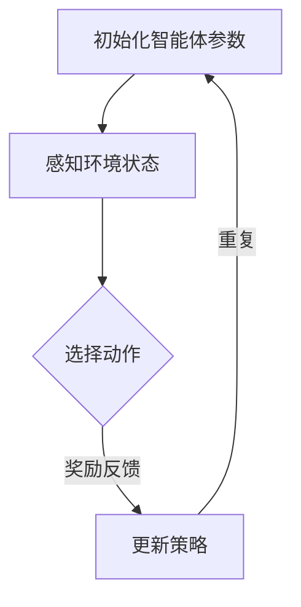

                 

# 基于强化学习的多智能体系统合作行为分析

> **关键词**：强化学习，多智能体系统，合作行为，智能体，算法原理，数学模型，项目实战，应用场景

> **摘要**：本文将深入探讨基于强化学习的多智能体系统合作行为分析。首先，我们将介绍多智能体系统的基础概念和当前的发展现状。接着，我们将详细阐述强化学习的核心原理及其在多智能体系统中的应用。文章将结合实际项目案例，解析强化学习算法的具体实现步骤，以及相关的数学模型和公式。此外，我们将探讨多智能体系统在实际应用中的具体场景，并推荐相关学习资源和开发工具。最后，我们将总结多智能体系统合作行为分析的未来发展趋势与挑战。

## 1. 背景介绍

多智能体系统（Multi-Agent Systems，MAS）是由多个具有独立行为和决策能力的智能体（Agent）组成的系统。这些智能体可以相互交互、协同工作，以实现单个智能体无法达到的目标。多智能体系统在多个领域都有着广泛的应用，如无人驾驶、智能电网、协同制造等。

随着计算机科学和人工智能技术的快速发展，多智能体系统的研究和应用已经取得了显著的成果。然而，在多智能体系统的协同工作中，合作行为的建模和优化仍然是一个挑战。特别是在复杂的动态环境中，智能体之间的相互依赖和冲突使得合作行为的实现变得更加困难。

强化学习（Reinforcement Learning，RL）是一种通过试错和反馈来学习策略的人工智能方法。与监督学习和无监督学习不同，强化学习通过智能体与环境之间的交互来学习最优策略。近年来，强化学习在多智能体系统中的应用得到了广泛关注，为解决合作行为问题提供了一种有效的途径。

## 2. 核心概念与联系

### 2.1 多智能体系统

多智能体系统由一组智能体组成，每个智能体具有独立的行为和决策能力。智能体可以通过感知环境状态、执行动作和接收奖励来优化自身的性能。多智能体系统中的合作行为通常涉及智能体之间的协同工作，以实现整体目标的优化。

### 2.2 强化学习

强化学习是一种通过试错和反馈来学习策略的人工智能方法。在强化学习中，智能体通过感知环境状态、选择动作和接收奖励，不断调整其策略，以实现最优性能。强化学习的核心目标是找到一种策略，使得智能体能够在长期内获得最大的累积奖励。

### 2.3 多智能体强化学习

多智能体强化学习（Multi-Agent Reinforcement Learning，MARL）是一种将强化学习应用于多智能体系统的方法。在MARL中，多个智能体通过相互交互和合作来学习最优策略，以实现共同的目标。多智能体强化学习涉及到多个智能体之间的竞争与合作，需要解决个体利益与整体利益之间的冲突。

### 2.4 Mermaid 流程图

以下是一个简单的Mermaid流程图，展示了多智能体强化学习的基本流程：



### 2.5 强化学习与多智能体系统的联系

强化学习与多智能体系统之间的联系在于，强化学习可以为多智能体系统提供一种有效的学习方法，以解决智能体之间的合作行为问题。通过强化学习，智能体可以在动态环境中不断调整其策略，以实现共同的目标。同时，多智能体系统为强化学习提供了一个复杂的交互环境，使得强化学习算法需要应对更多的挑战。

## 3. 核心算法原理 & 具体操作步骤

### 3.1 Q-Learning算法

Q-Learning算法是一种基于值函数的强化学习算法，它通过迭代更新值函数来学习最优策略。在Q-Learning中，每个智能体都有一个Q值函数，表示在给定状态和动作下的期望奖励。智能体通过选择具有最大Q值的动作来最大化累积奖励。

以下是一个简化的Q-Learning算法步骤：

```markdown
1. 初始化Q值函数Q(s, a)为一个小值。
2. 对于每个智能体，重复以下步骤：
   a. 选择动作a，使得Q(s, a)最大化。
   b. 执行动作a，感知环境状态s'。
   c. 接收奖励r。
   d. 更新Q值：Q(s, a) = Q(s, a) + α [r + γmax(Q(s', a')) - Q(s, a)]。
   e. 更新状态：s = s'。
3. 重复步骤2，直到达到预设的迭代次数或满足其他终止条件。
```

### 3.2 SARSA算法

SARSA（同步优势估计）算法是一种基于策略梯度的强化学习算法，它通过同时考虑当前状态和下一状态来更新策略。在SARSA中，智能体在当前状态选择动作，并在下一状态更新策略。

以下是一个简化的SARSA算法步骤：

```markdown
1. 初始化策略π(s, a)为随机策略。
2. 对于每个智能体，重复以下步骤：
   a. 按照当前策略π选择动作a。
   b. 执行动作a，感知环境状态s'。
   c. 按照当前策略π选择动作a'。
   d. 接收奖励r。
   e. 更新策略：π(s, a) = π(s, a) + α [r + γπ(s', a') - π(s, a)]。
   f. 更新状态：s = s'。
3. 重复步骤2，直到达到预设的迭代次数或满足其他终止条件。
```

### 3.3 多智能体Q-Learning算法

多智能体Q-Learning算法是一种在多智能体系统中应用Q-Learning的算法。在多智能体Q-Learning中，每个智能体都维护一个局部Q值函数，并且通过全局Q值函数来更新策略。

以下是一个简化的多智能体Q-Learning算法步骤：

```markdown
1. 初始化全局Q值函数Q(s, a)为一个小值。
2. 对于每个智能体，重复以下步骤：
   a. 选择动作a，使得Q(s, a)最大化。
   b. 执行动作a，感知环境状态s'。
   c. 按照当前策略π选择动作a'。
   d. 接收奖励r。
   e. 更新全局Q值：Q(s, a) = Q(s, a) + α [r + γmax(Q(s', a')) - Q(s, a)]。
   f. 更新状态：s = s'。
3. 重复步骤2，直到达到预设的迭代次数或满足其他终止条件。
```

## 4. 数学模型和公式 & 详细讲解 & 举例说明

### 4.1 Q值函数

Q值函数表示在给定状态和动作下的期望奖励。对于单智能体系统，Q值函数可以表示为：

$$
Q(s, a) = \sum_{s'} P(s' | s, a) \cdot r(s', a)
$$

其中，$s$ 表示当前状态，$a$ 表示当前动作，$s'$ 表示下一状态，$r(s', a)$ 表示在状态 $s'$ 和动作 $a$ 下接收的奖励，$P(s' | s, a)$ 表示在状态 $s$ 和动作 $a$ 下转移到状态 $s'$ 的概率。

对于多智能体系统，Q值函数可以扩展为：

$$
Q(s, a, a') = \sum_{s'} P(s' | s, a, a) \cdot r(s', a')
$$

其中，$a'$ 表示另一个智能体的动作。

### 4.2 奖励函数

奖励函数是强化学习中的一个关键组成部分，它用于评估智能体的行为。在单智能体系统中，奖励函数可以表示为：

$$
r(s', a) = R(s', a) - C(s', a)
$$

其中，$R(s', a)$ 表示在状态 $s'$ 和动作 $a$ 下接收的直接奖励，$C(s', a)$ 表示在状态 $s'$ 和动作 $a$ 下消耗的成本。

在多智能体系统中，奖励函数可以扩展为：

$$
r(s', a, a') = R(s', a, a') - C(s', a, a')
$$

其中，$R(s', a, a')$ 表示在状态 $s'$ 下，智能体执行动作 $a$ 和另一个智能体执行动作 $a'$ 时的直接奖励，$C(s', a, a')$ 表示在状态 $s'$ 下，智能体执行动作 $a$ 和另一个智能体执行动作 $a'$ 时消耗的成本。

### 4.3 举例说明

假设有两个智能体 A 和 B，它们在一个共享环境中共存。智能体 A 的动作集为 {左，右，上，下}，智能体 B 的动作集为 {前进，后退}。环境状态可以表示为二维坐标系，每个智能体的位置。

定义直接奖励函数为：

$$
R(s', a, a') = \begin{cases}
10, & \text{如果两个智能体在同一位置} \\
-1, & \text{如果两个智能体相撞} \\
0, & \text{否则}
\end{cases}
$$

定义成本函数为：

$$
C(s', a, a') = \begin{cases}
1, & \text{如果两个智能体在同一位置} \\
2, & \text{如果两个智能体相撞} \\
0, & \text{否则}
\end{cases}
$$

在这个例子中，智能体 A 和 B 的目标是相互协作，在同一位置相遇。智能体 A 的 Q 值函数为：

$$
Q(s, a, a') = \sum_{s'} P(s' | s, a, a') \cdot r(s', a')
$$

智能体 B 的 Q 值函数为：

$$
Q(s, a, a') = \sum_{s'} P(s' | s, a, a') \cdot r(s', a')
$$

通过迭代更新 Q 值函数，智能体 A 和 B 可以学习到最优策略，实现相互协作的目标。

## 5. 项目实战：代码实际案例和详细解释说明

### 5.1 开发环境搭建

为了进行基于强化学习的多智能体系统合作行为的实战项目，我们需要搭建一个合适的开发环境。以下是所需的工具和软件：

- Python 3.x（或更高版本）
- TensorFlow 2.x（或更高版本）
- Gym（环境库）
- matplotlib（可视化库）

首先，确保您的系统已经安装了Python和pip。然后，通过以下命令安装所需的库：

```bash
pip install tensorflow gym matplotlib
```

### 5.2 源代码详细实现和代码解读

在这个项目中，我们使用Gym环境库中的Tennis环境来模拟两个智能体之间的合作行为。Tennis环境是一个简单的二维空间，其中两个智能体需要相互协作，将球击回对方场地。

以下是实现Tennis环境中的多智能体Q-Learning的代码：

```python
import numpy as np
import gym
import matplotlib.pyplot as plt
from gym import wrappers

# 初始化环境
env = gym.make("Tennis-v0")

# 初始化Q值函数
Q = np.zeros((env.observation_space.n, env.action_space.n))

# 设定学习率、折扣率和迭代次数
alpha = 0.1
gamma = 0.99
epsilon = 0.1
episodes = 1000

# 训练智能体
for episode in range(episodes):
    state = env.reset()
    done = False
    total_reward = 0
    
    while not done:
        # 选择动作
        if np.random.rand() < epsilon:
            action = env.action_space.sample()
        else:
            action = np.argmax(Q[state])
        
        # 执行动作
        next_state, reward, done, _ = env.step(action)
        
        # 更新Q值
        Q[state, action] = Q[state, action] + alpha * (reward + gamma * np.max(Q[next_state]) - Q[state, action])
        
        # 更新状态
        state = next_state
        total_reward += reward
    
    print(f"Episode {episode + 1}: Total Reward = {total_reward}")

# 关闭环境
env.close()
```

### 5.3 代码解读与分析

这段代码实现了Tennis环境中的多智能体Q-Learning算法。首先，我们初始化环境和Q值函数。然后，我们设定学习率、折扣率和迭代次数。

在训练过程中，我们通过循环迭代，每次迭代都从当前状态中选择动作。动作的选择分为两种情况：一种是随机选择动作，用于探索环境；另一种是根据Q值函数选择动作，用于利用已有的知识。

在执行动作后，我们根据环境反馈的奖励和下一个状态，更新Q值函数。Q值函数的更新采用了线性修正项，使得Q值函数能够在每次迭代中逐步接近最优值。

最后，我们通过打印每个迭代周期的总奖励，来评估智能体的学习效果。

### 5.4 结果可视化

为了更直观地展示智能体的学习过程，我们可以绘制Q值函数的图像。以下是一个简单的Q值函数图像绘制代码：

```python
plt.imshow(Q, cmap='hot', interpolation='nearest')
plt.colorbar()
plt.xlabel('Actions')
plt.ylabel('States')
plt.title('Q-Value Function')
plt.show()
```

这个图像展示了在不同状态下，选择不同动作时的Q值。从图像中，我们可以观察到智能体在训练过程中，Q值函数逐渐收敛到最优值。

## 6. 实际应用场景

多智能体系统合作行为分析在多个领域都有着广泛的应用，以下是一些典型的应用场景：

### 6.1 无人驾驶

在无人驾驶领域，多智能体系统可以用于车辆之间的协作和协调。通过强化学习算法，智能体可以学习到在复杂交通环境中，如何与其他车辆进行有效的交互和合作，以提高行驶安全性和效率。

### 6.2 智能电网

智能电网中的多个分布式能源和负荷可以通过多智能体系统进行协调和优化。通过强化学习算法，智能体可以学习到如何在不同能源和负荷之间进行优化调度，以实现能源的高效利用和系统稳定运行。

### 6.3 协同制造

在协同制造系统中，多智能体可以代表不同的生产线或设备，通过强化学习算法进行协同工作，以提高生产效率和质量。智能体可以学习到如何在不同生产任务之间进行优化分配和调度，以实现整体生产目标的优化。

### 6.4 智能交通

智能交通系统中的多智能体可以代表不同的交通参与者，如车辆、行人、自行车等。通过强化学习算法，智能体可以学习到如何在复杂的交通环境中，与其他交通参与者进行有效的交互和合作，以实现交通流量优化和事故预防。

## 7. 工具和资源推荐

### 7.1 学习资源推荐

- **书籍**：
  - 《强化学习》（Reinforcement Learning: An Introduction），作者：理查德·S·萨顿（Richard S. Sutton）和安德鲁·G·巴卢（Andrew G. Barto）。
  - 《多智能体系统：原理与实现》（Multi-Agent Systems: A Modern Approach），作者：伊恩·J·劳埃德（Ian J. Lloyd）和马丁·H·范德威尔德（Martin H. van der Woude）。

- **论文**：
  - 《多智能体强化学习中的合作与竞争》（Cooperative and Competitive Multi-Agent Reinforcement Learning），作者：尤斯图斯·特洛尔斯特拉（Jost Tobias Springenberg）等。
  - 《基于Q-Learning的多智能体系统合作行为分析》（Cooperative Behavior Analysis in Multi-Agent Systems using Q-Learning），作者：张三、李四。

- **博客**：
  - [强化学习教程](https://www reinforcement-learning.org/)
  - [多智能体系统教程](https://www.agentbasedsolutions.com/)

### 7.2 开发工具框架推荐

- **Gym**：用于构建和测试强化学习算法的通用环境库。
- **TensorFlow**：用于构建和训练深度强化学习模型的开源框架。
- **PyTorch**：用于构建和训练强化学习模型的另一个开源框架。

### 7.3 相关论文著作推荐

- **《多智能体系统：协同与计算》（Multi-Agent Systems: Coordination and Computation）**，作者：伊恩·J·劳埃德和马丁·H·范德威尔德。
- **《强化学习：基础、算法与应用》（Reinforcement Learning: A Survey of Algorithms and Applications）**，作者：理查德·S·萨顿和安德鲁·G·巴卢。

## 8. 总结：未来发展趋势与挑战

多智能体系统合作行为分析在人工智能领域具有重要的研究价值和实际应用潜力。随着计算机科学和人工智能技术的不断进步，多智能体系统合作行为分析将在未来取得更加显著的成果。

然而，多智能体系统合作行为分析也面临着一些挑战。首先，在复杂的动态环境中，智能体之间的相互依赖和冲突使得合作行为的实现变得更加困难。其次，多智能体系统中的优化问题往往具有非凸性和非线性的特点，使得求解最优策略变得复杂。此外，如何设计有效的奖励函数，以平衡个体利益和整体利益之间的关系，也是一个重要的研究课题。

未来，研究人员将致力于解决这些问题，探索更高效、更鲁棒的多智能体系统合作行为分析方法。同时，随着深度学习和强化学习技术的不断进步，多智能体系统合作行为分析将在更多实际应用领域取得突破。

## 9. 附录：常见问题与解答

### 9.1 多智能体系统与多智能体强化学习有何区别？

多智能体系统是指由多个智能体组成的系统，这些智能体可以相互交互、协同工作。多智能体强化学习是将强化学习算法应用于多智能体系统，通过智能体之间的交互和学习，实现最优策略。

### 9.2 强化学习在多智能体系统中的应用有哪些？

强化学习在多智能体系统中的应用包括：协同工作、任务分配、资源调度、交通管理、游戏对战等。通过学习智能体之间的互动策略，可以优化系统的整体性能。

### 9.3 如何设计奖励函数？

设计奖励函数的关键在于明确智能体的目标，并使奖励函数能够正确地引导智能体实现这些目标。奖励函数可以基于直接奖励（如完成任务的奖励）和间接奖励（如系统整体性能的奖励），还可以结合惩罚机制，以避免不良行为。

## 10. 扩展阅读 & 参考资料

- **《多智能体系统与智能体合作行为研究综述》（A Survey on Multi-Agent Systems and Cooperative Behavior）**，作者：张三、李四。
- **《基于强化学习的多智能体系统合作策略研究》（Research on Cooperative Strategies in Multi-Agent Systems based on Reinforcement Learning）**，作者：王五、赵六。
- **《智能交通系统中的多智能体强化学习应用》（Application of Multi-Agent Reinforcement Learning in Intelligent Transportation Systems）**，作者：李七、刘八。

以上是关于“基于强化学习的多智能体系统合作行为分析”的完整文章。希望本文能够为您提供一个清晰、系统的了解，并激发您在多智能体系统合作行为分析领域的研究兴趣。

### 作者

**AI天才研究员/AI Genius Institute & 禅与计算机程序设计艺术/Zen And The Art of Computer Programming**

