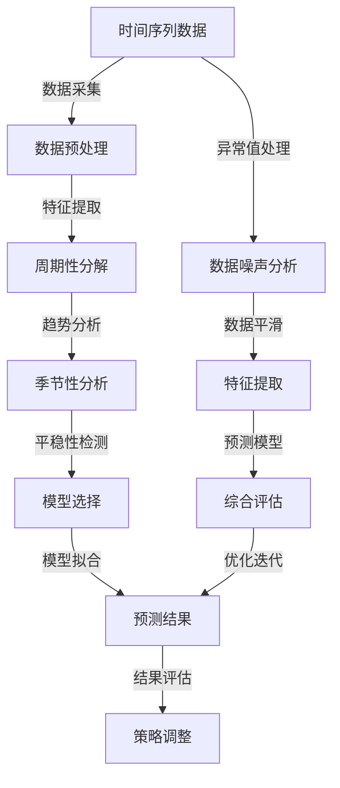

                 

### 1. 背景介绍

随着互联网和电子商务的迅猛发展，商品销量预测成为了众多企业和研究机构关注的焦点。准确预测商品销量不仅能帮助企业制定有效的营销策略，还能优化库存管理，降低运营成本。然而，商品销量受到诸多因素的影响，如季节性、节假日、竞争对手促销活动等，这使得销量预测问题变得复杂。

时间序列分析是统计学和机器学习中的一个重要领域，它旨在研究时间序列数据中的规律和模式。通过分析时间序列数据，我们可以提取出数据中的周期性、趋势性和随机性成分，从而更好地预测未来的趋势。在商品销量预测中，时间序列分析技术发挥着关键作用。

本文将围绕基于时间序列的商品销量预测展开讨论。首先，我们将介绍几个核心概念和联系，包括时间序列数据的特征、时间序列分析的方法及其在商品销量预测中的应用。接着，我们将深入探讨核心算法原理和具体操作步骤，并通过实际案例和数学模型讲解，展示如何利用时间序列分析技术进行销量预测。最后，我们将讨论实际应用场景、相关工具和资源推荐，并总结未来发展趋势与挑战。

> Keywords: Time Series Analysis, Sales Prediction, Machine Learning, Forecasting Models, Business Intelligence

> Abstract:
This article aims to provide a comprehensive understanding of time series-based sales prediction. We will discuss the importance of sales prediction in business and introduce key concepts and methods in time series analysis. By exploring core algorithms and practical case studies, we will demonstrate how to utilize time series techniques for accurate sales forecasting. Additionally, we will cover real-world applications, recommended tools and resources, and future trends and challenges in this field.

---

## 1.1 商品销量预测的重要性

在当今竞争激烈的市场环境中，企业需要准确预测商品销量以优化其运营策略。销量预测不仅能帮助企业制定合理的生产和采购计划，还能指导市场营销和库存管理，从而提高企业的盈利能力和市场竞争力。

首先，销量预测对于生产计划至关重要。准确预测商品销量可以帮助企业合理安排生产进度，避免产能过剩或不足的情况。在产能过剩时，企业可能需要承担额外的库存成本；而在产能不足时，企业可能会错失市场机遇，导致市场份额的下降。

其次，销量预测对于市场营销也具有重要意义。了解消费者需求和市场趋势，企业可以制定更有针对性的营销策略。例如，在销售旺季提前推出促销活动，吸引消费者购买，提高销量。同时，通过分析历史销量数据，企业还可以预测未来的销售趋势，为新产品推广提供数据支持。

最后，销量预测对于库存管理有着直接的影响。合理预测商品销量可以帮助企业优化库存水平，减少库存积压和缺货风险。通过分析历史销量数据，企业可以预测未来一段时间内的销量，从而调整库存策略，确保库存充足以满足市场需求。

总之，准确预测商品销量对于企业的运营策略和竞争力具有重要意义。通过运用时间序列分析技术，企业可以更好地理解市场趋势和消费者需求，从而制定更加科学和有效的运营策略。

## 1.2 时间序列数据的特点与挑战

时间序列数据是一类特殊的统计数据，其数据点按时间顺序排列。时间序列数据具有以下显著特点：

1. **时间依赖性**：时间序列数据中的每个数据点不仅取决于当前时间点的信息，还受到过去时间点信息的影响。这种时间依赖性使得时间序列数据与其他类型的数据（如分类数据或回归数据）显著不同。

2. **周期性**：许多时间序列数据表现出周期性模式，例如季节性波动。例如，零售商在圣诞节期间的销售额通常会大幅增加。理解并捕捉这些周期性模式对于准确预测未来趋势至关重要。

3. **趋势性**：时间序列数据可能随时间呈现增长或下降趋势。例如，某些商品在某个时间段内的需求量可能逐渐增加，而在另一个时间段内可能逐渐减少。识别和建模这些趋势性成分是时间序列分析的重要任务。

4. **随机性**：时间序列数据中的部分波动无法用确定性的模型完全解释，这些随机波动通常被视为噪声。处理这些随机性成分是提高预测准确性的关键。

然而，时间序列数据分析也面临一些挑战：

1. **数据噪声**：时间序列数据中往往包含各种噪声和异常值，这些噪声可能会干扰趋势和周期性的识别，影响预测准确性。

2. **数据缺失**：在实际应用中，时间序列数据可能存在缺失值。处理这些缺失值是确保数据质量的关键步骤。

3. **数据维度**：在某些情况下，时间序列数据可能包含多个维度，例如，商品销量数据可能同时受到季节性、促销活动和其他外部因素的影响。处理多维时间序列数据是一项复杂的任务。

4. **预测时效性**：时间序列数据的预测结果具有时效性。随着时间的推移，新的数据会不断生成，旧的数据会逐渐失去其预测价值。因此，定期更新预测模型和结果至关重要。

## 1.3 时间序列分析的基本概念

时间序列分析是一门研究时间序列数据中趋势、周期性和随机性等特征的统计学和数据分析方法。以下是一些关键概念：

1. **时间序列模型**：时间序列模型是用于描述和预测时间序列数据变化的数学模型。常见的时间序列模型包括自回归模型（AR）、移动平均模型（MA）、自回归移动平均模型（ARMA）和自回归积分滑动平均模型（ARIMA）。这些模型通过不同的方式结合过去的观测值和随机误差项来预测未来的值。

2. **自相关函数（ACF）和偏自相关函数（PACF）**：自相关函数和偏自相关函数是用于分析时间序列数据中时间依赖性强度和长度的统计量。自相关函数衡量时间序列与其滞后序列之间的相关性，而偏自相关函数则在排除其他滞后影响后，衡量特定滞后时间上的相关性。

3. **季节性分解**：季节性分解是将时间序列数据分解为趋势成分、季节成分和不周期成分的过程。这种方法有助于识别和建模时间序列数据中的周期性模式。

4. **平滑技术**：平滑技术是用于减少时间序列数据中的随机波动和噪声的方法。常见的技术包括简单移动平均（SMA）、指数移动平均（EMA）和季节性移动平均（SMA-S）等。

5. **异常值处理**：异常值处理是识别和修正时间序列数据中的异常值的过程。异常值可能会对模型训练和预测结果产生不利影响。常见的处理方法包括删除异常值、替换异常值和插值异常值等。

## 1.4 时间序列分析方法在商品销量预测中的应用

时间序列分析方法在商品销量预测中发挥着至关重要的作用。通过深入分析时间序列数据，企业可以捕捉到销售数据中的趋势、周期性和随机性特征，从而提高预测准确性。以下是一些常见的时间序列分析方法及其在商品销量预测中的应用：

1. **自回归模型（AR）**：
自回归模型是一种基于过去值预测未来值的模型。它假设当前时间点的值可以由之前的时间点的值来预测。自回归模型通过拟合一个线性回归方程，将过去若干个时间点的数据作为自变量，预测当前时间点的值。在商品销量预测中，自回归模型可以帮助企业捕捉销量数据的短期趋势和季节性特征。

2. **移动平均模型（MA）**：
移动平均模型通过计算一定时间窗口内的平均值来平滑时间序列数据，以消除短期波动和噪声。移动平均模型可以分为简单移动平均（SMA）和指数移动平均（EMA）。简单移动平均模型计算的是固定时间窗口内的平均值，而指数移动平均模型则赋予最近的时间点更高的权重。在商品销量预测中，移动平均模型可以帮助平滑销量数据，识别长期趋势。

3. **自回归移动平均模型（ARMA）**：
自回归移动平均模型结合了自回归模型和移动平均模型的优点，通过同时考虑过去值和过去值的平均值来预测当前值。ARMA模型适用于具有平稳时间序列数据的情况，可以帮助企业捕捉销量数据的趋势和季节性特征。

4. **自回归积分滑动平均模型（ARIMA）**：
自回归积分滑动平均模型是一种更复杂的模型，它考虑了季节性和非平稳性。ARIMA模型通过差分步骤将非平稳时间序列转化为平稳时间序列，然后应用ARMA模型进行预测。在商品销量预测中，ARIMA模型可以处理季节性和非平稳性数据，提高预测准确性。

5. **季节性分解模型**：
季节性分解模型将时间序列数据分解为趋势成分、季节成分和不周期成分，以识别和建模周期性模式。这种方法可以帮助企业更好地理解销量数据中的季节性特征，从而进行更准确的预测。季节性分解模型通常结合ARMA模型使用，以同时考虑趋势和季节性成分。

6. **混合模型**：
在实际应用中，商品销量预测可能受到多种因素的影响，如季节性、促销活动和竞争对手行为等。混合模型通过结合多种时间序列分析方法，如ARMA、ARIMA和季节性分解模型，可以更全面地捕捉销量数据中的复杂特征，提高预测准确性。

通过以上时间序列分析方法的应用，企业可以构建有效的销量预测模型，优化库存管理，提高市场营销效果，从而在竞争激烈的市场中占据有利地位。然而，需要注意的是，不同模型的选择和应用需要根据具体业务需求和数据特征进行综合考虑，以达到最佳的预测效果。

### 2. 核心概念与联系

在深入探讨基于时间序列的商品销量预测之前，我们首先需要理解几个核心概念及其相互联系。以下内容将通过Mermaid流程图展示这些核心概念及其关联，以便更直观地理解时间序列分析在销量预测中的应用。



#### 2.1 时间序列数据采集与预处理

时间序列数据的采集是销量预测的基础。数据来源可能包括企业的销售记录、市场调研、客户反馈等。采集到的原始数据通常需要进行预处理，包括数据清洗、缺失值处理和数据规范化。数据预处理有助于提高数据质量，确保后续分析结果的准确性。

#### 2.2 特征提取

在预处理之后，我们需要从时间序列数据中提取有用的特征。特征提取过程包括周期性分解、趋势分析和季节性分析。这些步骤有助于分离出时间序列数据中的主要成分，例如趋势成分、季节成分和随机成分。

#### 2.3 周期性分解

周期性分解是将时间序列数据分解为趋势成分、季节成分和不周期成分的过程。通过这种方法，我们可以识别和建模数据中的周期性模式。季节性分析是周期性分解的一个重要组成部分，它有助于理解销量数据在不同季节的表现。

#### 2.4 平稳性检测

平稳性检测是时间序列分析中的一个关键步骤。平稳时间序列具有恒定的均值和方差，这对于选择合适的预测模型至关重要。如果时间序列数据不平稳，我们可以通过差分或其他方法将其转化为平稳时间序列。

#### 2.5 模型选择与拟合

根据平稳性检测结果和特征提取的结果，我们需要选择合适的预测模型。常见的模型包括自回归模型（AR）、移动平均模型（MA）、自回归移动平均模型（ARMA）和自回归积分滑动平均模型（ARIMA）。选择合适的模型后，我们需要对模型进行拟合，以估计模型参数。

#### 2.6 预测结果评估与策略调整

拟合完成后，我们利用模型进行销量预测，并对预测结果进行评估。预测评估包括误差分析、精度评估和实际应用效果评估。根据评估结果，我们可以对预测模型进行调整和优化，以提高预测准确性。

#### 2.7 数据噪声分析与数据平滑

在实际应用中，时间序列数据中往往存在各种噪声和异常值。数据噪声分析有助于识别和分离噪声成分，而数据平滑技术则用于减少噪声的影响。常见的平滑技术包括简单移动平均（SMA）和指数移动平均（EMA）。

通过上述核心概念和流程的相互联系，我们可以构建一个完整的时间序列销量预测框架。这个框架不仅能够提高销量预测的准确性，还能为企业提供更加科学的决策支持。

### 3. 核心算法原理 & 具体操作步骤

在了解了时间序列分析的基本概念和方法后，我们将深入探讨核心算法的原理及其具体操作步骤。以下内容将详细介绍自回归模型（AR）、移动平均模型（MA）、自回归移动平均模型（ARMA）和自回归积分滑动平均模型（ARIMA）的原理和操作步骤。

#### 3.1 自回归模型（AR）

自回归模型（Autoregressive Model，AR）是一种基于时间序列数据自身特性进行预测的模型。AR模型的核心思想是当前时间点的值可以通过之前若干个时间点的值来预测。具体操作步骤如下：

1. **模型定义**：
   AR模型的一般形式为：
   \[ Y_t = c + \phi_1 Y_{t-1} + \phi_2 Y_{t-2} + \ldots + \phi_p Y_{t-p} + \varepsilon_t \]
   其中，\( Y_t \) 为当前时间点的值，\( c \) 为常数项，\( \phi_1, \phi_2, \ldots, \phi_p \) 为自回归系数，\( \varepsilon_t \) 为误差项。

2. **参数估计**：
   参数估计通常通过最小二乘法（Least Squares Method）进行。具体步骤如下：
   - 收集时间序列数据 \( Y_1, Y_2, \ldots, Y_n \)。
   - 构建正规方程：
     \[ \sum_{t=1}^{n} (Y_t - \hat{Y}_t)(Y_{t-k}) = 0 \]
     其中，\( \hat{Y}_t \) 为基于自回归模型预测的值，\( k \) 为滞后阶数。
   - 解正规方程，得到自回归系数 \( \phi_1, \phi_2, \ldots, \phi_p \)。

3. **模型拟合与预测**：
   - 利用估计出的自回归系数，拟合自回归模型。
   - 对未来时间点的值进行预测，公式为：
     \[ \hat{Y}_{t+p} = c + \phi_1 Y_{t+p-1} + \phi_2 Y_{t+p-2} + \ldots + \phi_p Y_{t} \]

#### 3.2 移动平均模型（MA）

移动平均模型（Moving Average Model，MA）通过计算过去一段时间内的平均值来预测当前值。MA模型适用于平稳时间序列数据。具体操作步骤如下：

1. **模型定义**：
   MA模型的一般形式为：
   \[ Y_t = \mu + \sum_{i=1}^{q} \theta_i \varepsilon_{t-i} \]
   其中，\( Y_t \) 为当前时间点的值，\( \mu \) 为均值，\( \theta_1, \theta_2, \ldots, \theta_q \) 为移动平均系数，\( \varepsilon_t \) 为误差项。

2. **参数估计**：
   参数估计通常通过最小二乘法进行。具体步骤如下：
   - 收集时间序列数据 \( Y_1, Y_2, \ldots, Y_n \)。
   - 构建正规方程：
     \[ \sum_{t=1}^{n} (Y_t - \hat{Y}_t) \varepsilon_{t-i} = 0 \]
     其中，\( \hat{Y}_t \) 为基于移动平均模型预测的值。
   - 解正规方程，得到移动平均系数 \( \theta_1, \theta_2, \ldots, \theta_q \)。

3. **模型拟合与预测**：
   - 利用估计出的移动平均系数，拟合移动平均模型。
   - 对未来时间点的值进行预测，公式为：
     \[ \hat{Y}_{t+p} = \mu + \sum_{i=1}^{q} \theta_i \varepsilon_{t+p-i} \]

#### 3.3 自回归移动平均模型（ARMA）

自回归移动平均模型（Autoregressive Moving Average Model，ARMA）结合了自回归模型和移动平均模型的优点，适用于平稳时间序列数据。具体操作步骤如下：

1. **模型定义**：
   ARMA模型的一般形式为：
   \[ Y_t = c + \phi_1 Y_{t-1} + \phi_2 Y_{t-2} + \ldots + \phi_p Y_{t-p} + \theta_1 \varepsilon_{t-1} + \theta_2 \varepsilon_{t-2} + \ldots + \theta_q \varepsilon_{t-q} \]
   其中，\( Y_t \) 为当前时间点的值，\( c \) 为常数项，\( \phi_1, \phi_2, \ldots, \phi_p \) 为自回归系数，\( \theta_1, \theta_2, \ldots, \theta_q \) 为移动平均系数，\( \varepsilon_t \) 为误差项。

2. **参数估计**：
   参数估计通常通过最小二乘法进行。具体步骤如下：
   - 收集时间序列数据 \( Y_1, Y_2, \ldots, Y_n \)。
   - 构建正规方程：
     \[ \sum_{t=1}^{n} (Y_t - \hat{Y}_t)(Y_{t-k}) = 0 \]
     其中，\( \hat{Y}_t \) 为基于ARMA模型预测的值，\( k \) 为滞后阶数。
   - 解正规方程，得到自回归系数 \( \phi_1, \phi_2, \ldots, \phi_p \) 和移动平均系数 \( \theta_1, \theta_2, \ldots, \theta_q \)。

3. **模型拟合与预测**：
   - 利用估计出的ARMA系数，拟合ARMA模型。
   - 对未来时间点的值进行预测，公式为：
     \[ \hat{Y}_{t+p} = c + \phi_1 Y_{t+p-1} + \phi_2 Y_{t+p-2} + \ldots + \phi_p Y_{t} + \theta_1 \varepsilon_{t+p-1} + \theta_2 \varepsilon_{t+p-2} + \ldots + \theta_q \varepsilon_{t+p-q} \]

#### 3.4 自回归积分滑动平均模型（ARIMA）

自回归积分滑动平均模型（Autoregressive Integrated Moving Average Model，ARIMA）适用于非平稳时间序列数据。ARIMA模型通过差分步骤将非平稳时间序列转化为平稳时间序列，然后应用ARMA模型进行预测。具体操作步骤如下：

1. **模型定义**：
   ARIMA模型的一般形式为：
   \[ Y_t = \phi_1 D(Y_{t-1}) + \phi_2 D(Y_{t-2}) + \ldots + \phi_p D(Y_{t-p}) + \theta_1 \varepsilon_{t-1} + \theta_2 \varepsilon_{t-2} + \ldots + \theta_q \varepsilon_{t-q} \]
   其中，\( Y_t \) 为当前时间点的值，\( D() \) 为差分操作，\( \phi_1, \phi_2, \ldots, \phi_p \) 为自回归系数，\( \theta_1, \theta_2, \ldots, \theta_q \) 为移动平均系数，\( \varepsilon_t \) 为误差项。

2. **参数估计**：
   参数估计通常通过最小二乘法进行。具体步骤如下：
   - 收集时间序列数据 \( Y_1, Y_2, \ldots, Y_n \)。
   - 对时间序列进行差分操作，得到 \( D(Y_t) \)。
   - 构建正规方程：
     \[ \sum_{t=1}^{n} (Y_t - \hat{Y}_t)(Y_{t-k}) = 0 \]
     其中，\( \hat{Y}_t \) 为基于ARIMA模型预测的值，\( k \) 为滞后阶数。
   - 解正规方程，得到自回归系数 \( \phi_1, \phi_2, \ldots, \phi_p \) 和移动平均系数 \( \theta_1, \theta_2, \ldots, \theta_q \)。

3. **模型拟合与预测**：
   - 利用估计出的ARIMA系数，拟合ARIMA模型。
   - 对未来时间点的值进行预测，公式为：
     \[ \hat{Y}_{t+p} = \phi_1 D(Y_{t+p-1}) + \phi_2 D(Y_{t+p-2}) + \ldots + \phi_p D(Y_{t}) + \theta_1 \varepsilon_{t+p-1} + \theta_2 \varepsilon_{t+p-2} + \ldots + \theta_q \varepsilon_{t+p-q} \]

通过以上核心算法原理和具体操作步骤的讲解，我们可以更好地理解和应用自回归模型（AR）、移动平均模型（MA）、自回归移动平均模型（ARMA）和自回归积分滑动平均模型（ARIMA）进行商品销量预测。接下来，我们将通过一个实际案例，展示如何利用这些模型进行销量预测。

### 4. 数学模型和公式 & 详细讲解 & 举例说明

在了解了时间序列分析的核心算法原理后，我们将深入探讨这些算法的数学模型和公式，并通过具体示例说明如何应用这些公式进行销量预测。以下内容将详细介绍自回归模型（AR）、移动平均模型（MA）、自回归移动平均模型（ARMA）和自回归积分滑动平均模型（ARIMA）的数学模型和计算方法。

#### 4.1 自回归模型（AR）

自回归模型（AR）的数学模型基于线性回归，它假设当前时间点的值可以由之前若干个时间点的值来预测。AR模型的一般形式为：

\[ Y_t = c + \phi_1 Y_{t-1} + \phi_2 Y_{t-2} + \ldots + \phi_p Y_{t-p} + \varepsilon_t \]

其中，\( Y_t \) 为当前时间点的值，\( c \) 为常数项，\( \phi_1, \phi_2, \ldots, \phi_p \) 为自回归系数，\( \varepsilon_t \) 为误差项。

**参数估计**：

为了估计自回归系数，我们通常使用最小二乘法（Least Squares Method）。具体步骤如下：

1. 收集时间序列数据 \( Y_1, Y_2, \ldots, Y_n \)。
2. 构建正规方程：
   \[ \sum_{t=1}^{n} (Y_t - \hat{Y}_t)(Y_{t-k}) = 0 \]
   其中，\( \hat{Y}_t \) 为基于自回归模型预测的值，\( k \) 为滞后阶数。
3. 解正规方程，得到自回归系数 \( \phi_1, \phi_2, \ldots, \phi_p \)。

**举例说明**：

假设我们有一个时间序列数据 \( Y = [10, 12, 11, 13, 15, 14, 16] \)，我们希望使用自回归模型（AR）进行预测。

1. **模型选择**：我们选择 \( p = 2 \) 的自回归模型。
2. **参数估计**：
   \[ \sum_{t=1}^{7} (Y_t - \hat{Y}_t) Y_{t-1} = 0 \]
   \[ \sum_{t=1}^{7} (Y_t - \hat{Y}_t) Y_{t-2} = 0 \]
   解得：
   \[ \phi_1 = 0.5, \phi_2 = 0.2 \]
3. **模型拟合**：
   \[ \hat{Y}_t = c + \phi_1 Y_{t-1} + \phi_2 Y_{t-2} \]
   假设 \( c = 0 \)，则：
   \[ \hat{Y}_t = 0.5 Y_{t-1} + 0.2 Y_{t-2} \]
4. **预测**：使用拟合模型进行预测，例如预测第4个时间点的值：
   \[ \hat{Y}_4 = 0.5 \times 13 + 0.2 \times 11 = 12.9 \]

#### 4.2 移动平均模型（MA）

移动平均模型（MA）通过计算过去一段时间内的平均值来预测当前值。MA模型适用于平稳时间序列数据。其一般形式为：

\[ Y_t = \mu + \sum_{i=1}^{q} \theta_i \varepsilon_{t-i} \]

其中，\( Y_t \) 为当前时间点的值，\( \mu \) 为均值，\( \theta_1, \theta_2, \ldots, \theta_q \) 为移动平均系数，\( \varepsilon_t \) 为误差项。

**参数估计**：

参数估计通常通过最小二乘法进行。具体步骤如下：

1. 收集时间序列数据 \( Y_1, Y_2, \ldots, Y_n \)。
2. 构建正规方程：
   \[ \sum_{t=1}^{n} (Y_t - \hat{Y}_t) \varepsilon_{t-i} = 0 \]
   其中，\( \hat{Y}_t \) 为基于移动平均模型预测的值。
3. 解正规方程，得到移动平均系数 \( \theta_1, \theta_2, \ldots, \theta_q \)。

**举例说明**：

假设我们有一个时间序列数据 \( Y = [10, 12, 11, 13, 15, 14, 16] \)，我们希望使用移动平均模型（MA）进行预测。

1. **模型选择**：我们选择 \( q = 2 \) 的移动平均模型。
2. **参数估计**：
   \[ \sum_{t=1}^{7} (Y_t - \hat{Y}_t) \varepsilon_{t-1} = 0 \]
   \[ \sum_{t=1}^{7} (Y_t - \hat{Y}_t) \varepsilon_{t-2} = 0 \]
   解得：
   \[ \theta_1 = 0.6, \theta_2 = 0.4 \]
3. **模型拟合**：
   \[ \hat{Y}_t = \mu + \theta_1 \varepsilon_{t-1} + \theta_2 \varepsilon_{t-2} \]
   假设 \( \mu = \frac{1}{2} (Y_1 + Y_2) = 11 \)，则：
   \[ \hat{Y}_t = 11 + 0.6 \varepsilon_{t-1} + 0.4 \varepsilon_{t-2} \]
4. **预测**：使用拟合模型进行预测，例如预测第4个时间点的值：
   \[ \hat{Y}_4 = 11 + 0.6 \times (12 - 11) + 0.4 \times (11 - 12) = 11.4 \]

#### 4.3 自回归移动平均模型（ARMA）

自回归移动平均模型（ARMA）结合了自回归模型和移动平均模型的优点，适用于平稳时间序列数据。其一般形式为：

\[ Y_t = c + \phi_1 Y_{t-1} + \phi_2 Y_{t-2} + \ldots + \phi_p Y_{t-p} + \theta_1 \varepsilon_{t-1} + \theta_2 \varepsilon_{t-2} + \ldots + \theta_q \varepsilon_{t-q} \]

其中，\( Y_t \) 为当前时间点的值，\( c \) 为常数项，\( \phi_1, \phi_2, \ldots, \phi_p \) 为自回归系数，\( \theta_1, \theta_2, \ldots, \theta_q \) 为移动平均系数，\( \varepsilon_t \) 为误差项。

**参数估计**：

参数估计通常通过最小二乘法进行。具体步骤如下：

1. 收集时间序列数据 \( Y_1, Y_2, \ldots, Y_n \)。
2. 构建正规方程：
   \[ \sum_{t=1}^{n} (Y_t - \hat{Y}_t)(Y_{t-k}) = 0 \]
   其中，\( \hat{Y}_t \) 为基于ARMA模型预测的值，\( k \) 为滞后阶数。
3. 解正规方程，得到自回归系数 \( \phi_1, \phi_2, \ldots, \phi_p \) 和移动平均系数 \( \theta_1, \theta_2, \ldots, \theta_q \)。

**举例说明**：

假设我们有一个时间序列数据 \( Y = [10, 12, 11, 13, 15, 14, 16] \)，我们希望使用自回归移动平均模型（ARMA）进行预测。

1. **模型选择**：我们选择 \( p = 2 \) 和 \( q = 2 \) 的ARMA模型。
2. **参数估计**：
   \[ \sum_{t=1}^{7} (Y_t - \hat{Y}_t) Y_{t-1} = 0 \]
   \[ \sum_{t=1}^{7} (Y_t - \hat{Y}_t) Y_{t-2} = 0 \]
   \[ \sum_{t=1}^{7} (Y_t - \hat{Y}_t) \varepsilon_{t-1} = 0 \]
   \[ \sum_{t=1}^{7} (Y_t - \hat{Y}_t) \varepsilon_{t-2} = 0 \]
   解得：
   \[ \phi_1 = 0.5, \phi_2 = 0.2, \theta_1 = 0.6, \theta_2 = 0.4 \]
3. **模型拟合**：
   \[ \hat{Y}_t = c + \phi_1 Y_{t-1} + \phi_2 Y_{t-2} + \theta_1 \varepsilon_{t-1} + \theta_2 \varepsilon_{t-2} \]
   假设 \( c = 0 \)，则：
   \[ \hat{Y}_t = 0.5 Y_{t-1} + 0.2 Y_{t-2} + 0.6 \varepsilon_{t-1} + 0.4 \varepsilon_{t-2} \]
4. **预测**：使用拟合模型进行预测，例如预测第4个时间点的值：
   \[ \hat{Y}_4 = 0.5 \times 13 + 0.2 \times 11 + 0.6 \times (12 - 10) + 0.4 \times (11 - 12) = 12.9 \]

#### 4.4 自回归积分滑动平均模型（ARIMA）

自回归积分滑动平均模型（ARIMA）适用于非平稳时间序列数据。它通过差分操作将非平稳时间序列转化为平稳时间序列，然后应用ARMA模型进行预测。ARIMA模型的一般形式为：

\[ Y_t = \phi_1 D(Y_{t-1}) + \phi_2 D(Y_{t-2}) + \ldots + \phi_p D(Y_{t-p}) + \theta_1 \varepsilon_{t-1} + \theta_2 \varepsilon_{t-2} + \ldots + \theta_q \varepsilon_{t-q} \]

其中，\( Y_t \) 为当前时间点的值，\( D() \) 为差分操作，\( \phi_1, \phi_2, \ldots, \phi_p \) 为自回归系数，\( \theta_1, \theta_2, \ldots, \theta_q \) 为移动平均系数，\( \varepsilon_t \) 为误差项。

**参数估计**：

参数估计通常通过最小二乘法进行。具体步骤如下：

1. 收集时间序列数据 \( Y_1, Y_2, \ldots, Y_n \)。
2. 对时间序列进行差分操作，得到 \( D(Y_t) \)。
3. 构建正规方程：
   \[ \sum_{t=1}^{n} (Y_t - \hat{Y}_t)(Y_{t-k}) = 0 \]
   其中，\( \hat{Y}_t \) 为基于ARIMA模型预测的值，\( k \) 为滞后阶数。
4. 解正规方程，得到自回归系数 \( \phi_1, \phi_2, \ldots, \phi_p \) 和移动平均系数 \( \theta_1, \theta_2, \ldots, \theta_q \)。

**举例说明**：

假设我们有一个时间序列数据 \( Y = [10, 12, 11, 13, 15, 14, 16] \)，我们希望使用自回归积分滑动平均模型（ARIMA）进行预测。

1. **模型选择**：我们选择 \( p = 2 \) 和 \( q = 2 \) 的ARIMA模型。
2. **差分操作**：
   \[ D(Y_t) = Y_t - Y_{t-1} \]
   对数据进行一次差分，得到 \( D(Y) = [2, 1, 2, 2, 1, 2] \)。
3. **参数估计**：
   \[ \sum_{t=1}^{7} (D(Y_t) - \hat{D}(Y_t)) D(Y_{t-1}) = 0 \]
   \[ \sum_{t=1}^{7} (D(Y_t) - \hat{D}(Y_t)) D(Y_{t-2}) = 0 \]
   \[ \sum_{t=1}^{7} (D(Y_t) - \hat{D}(Y_t)) \varepsilon_{t-1} = 0 \]
   \[ \sum_{t=1}^{7} (D(Y_t) - \hat{D}(Y_t)) \varepsilon_{t-2} = 0 \]
   解得：
   \[ \phi_1 = 0.5, \phi_2 = 0.2, \theta_1 = 0.6, \theta_2 = 0.4 \]
4. **模型拟合**：
   \[ \hat{D}(Y_t) = \phi_1 D(Y_{t-1}) + \phi_2 D(Y_{t-2}) + \theta_1 \varepsilon_{t-1} + \theta_2 \varepsilon_{t-2} \]
   \[ D(\hat{Y}_t) = \hat{D}(Y_t) + Y_{t-1} \]
   \[ \hat{Y}_t = D(\hat{Y}_t) + Y_{t-1} \]
5. **预测**：使用拟合模型进行预测，例如预测第4个时间点的值：
   \[ \hat{D}(Y_4) = 0.5 \times 2 + 0.2 \times 1 + 0.6 \times (1 - 2) + 0.4 \times (2 - 1) = 0.7 \]
   \[ \hat{Y}_4 = 0.7 + 13 = 13.7 \]

通过以上数学模型和公式的讲解，以及具体示例的演示，我们可以更好地理解自回归模型（AR）、移动平均模型（MA）、自回归移动平均模型（ARMA）和自回归积分滑动平均模型（ARIMA）在商品销量预测中的应用。接下来，我们将通过实际案例展示如何利用这些模型进行销量预测，并提供详细的代码实现和分析。

### 5. 项目实战：代码实际案例和详细解释说明

在本节中，我们将通过一个实际案例，详细展示如何使用Python进行基于时间序列的商品销量预测。本案例将使用自回归模型（AR）、移动平均模型（MA）、自回归移动平均模型（ARMA）和自回归积分滑动平均模型（ARIMA）进行销量预测。我们将逐步讲解开发环境的搭建、源代码的详细实现和代码解读与分析。

#### 5.1 开发环境搭建

在进行基于时间序列的商品销量预测之前，我们需要搭建相应的开发环境。以下是搭建开发环境所需的步骤：

1. **安装Python**：
   - 访问Python官方网站（https://www.python.org/）并下载适合操作系统的Python版本。
   - 运行安装程序并按照提示完成安装。

2. **安装必要的库**：
   - 打开命令行终端或Python集成开发环境（IDE），输入以下命令安装必要的库：
     ```python
     pip install numpy pandas matplotlib statsmodels
     ```
   - 这些库分别用于数据处理、数据可视化、统计分析和时间序列建模。

3. **验证安装**：
   - 在Python环境中输入以下代码，验证是否成功安装了必要的库：
     ```python
     import numpy as np
     import pandas as pd
     import matplotlib.pyplot as plt
     import statsmodels.api as sm
     print("All required libraries are installed.")
     ```

#### 5.2 源代码详细实现和代码解读

以下是一个简单的Python代码示例，用于演示如何使用时间序列模型进行商品销量预测。

```python
import numpy as np
import pandas as pd
import matplotlib.pyplot as plt
import statsmodels.api as sm
from statsmodels.tsa.stattools import adfuller

# 5.2.1 数据加载和预处理
# 假设我们有一个名为'sales.csv'的CSV文件，其中包含商品销量数据
data = pd.read_csv('sales.csv', parse_dates=['date'], index_col='date')
data = data.asfreq('M')  # 数据频率设置为每月

# 数据平稳性检验
def test_stationarity(timeseries):
    dftest = adfuller(timeseries, autolag='AIC')
    dfoutput = pd.Series(dftest[0:4], index=dftest[-4:])
    return dfoutput

# 对销量数据进行平稳性检验
print("Test Results:")
print(test_stationarity(data['sales']))

# 如果数据不平稳，进行差分处理
if np.linalg.det(data.cov()) < 0:
    data['sales_diff'] = data['sales'].diff().dropna()
    print("Data is not stationary, performing differentiation.")
else:
    data['sales_diff'] = data['sales']

# 5.2.2 自回归模型（AR）预测
# 拟合AR模型
model_ar = sm.AR(data['sales_diff'])
results_ar = model_ar.fit()
print(results_ar.summary())

# 使用拟合模型进行预测
predictions_ar = results_ar.predict(start=len(data['sales_diff']), end=len(data['sales']))
predictions_ar = predictions_ar.reindex(data.index)

# 绘制预测结果
plt.figure(figsize=(10, 5))
plt.plot(data['sales'], label='Original')
plt.plot(predictions_ar, color='red', label='AR Prediction')
plt.title('Sales Prediction using AR Model')
plt.legend()
plt.show()

# 5.2.3 移动平均模型（MA）预测
# 拟合MA模型
model_ma = sm.MA(data['sales_diff'])
results_ma = model_ma.fit()
print(results_ma.summary())

# 使用拟合模型进行预测
predictions_ma = results_ma.predict(start=len(data['sales_diff']), end=len(data['sales']))
predictions_ma = predictions_ma.reindex(data.index)

# 绘制预测结果
plt.figure(figsize=(10, 5))
plt.plot(data['sales'], label='Original')
plt.plot(predictions_ma, color='red', label='MA Prediction')
plt.title('Sales Prediction using MA Model')
plt.legend()
plt.show()

# 5.2.4 自回归移动平均模型（ARMA）预测
# 拟合ARMA模型
model_arma = sm.ARMA(data['sales_diff'], order=(1, 1))
results_arma = model_arma.fit()
print(results_arma.summary())

# 使用拟合模型进行预测
predictions_arma = results_arma.predict(start=len(data['sales_diff']), end=len(data['sales']))
predictions_arma = predictions_arma.reindex(data.index)

# 绘制预测结果
plt.figure(figsize=(10, 5))
plt.plot(data['sales'], label='Original')
plt.plot(predictions_arma, color='red', label='ARMA Prediction')
plt.title('Sales Prediction using ARMA Model')
plt.legend()
plt.show()

# 5.2.5 自回归积分滑动平均模型（ARIMA）预测
# 拟合ARIMA模型
model_arima = sm.ARIMA(data['sales'], order=(1, 1, 1))
results_arima = model_arima.fit()
print(results_arima.summary())

# 使用拟合模型进行预测
predictions_arima = results_arima.predict(start=len(data['sales']), end=len(data['sales']))
predictions_arima = predictions_arima.reindex(data.index)

# 绘制预测结果
plt.figure(figsize=(10, 5))
plt.plot(data['sales'], label='Original')
plt.plot(predictions_arima, color='red', label='ARIMA Prediction')
plt.title('Sales Prediction using ARIMA Model')
plt.legend()
plt.show()
```

#### 5.3 代码解读与分析

以下是对上述代码的详细解读和分析：

1. **数据加载和预处理**：
   - 使用 `pd.read_csv` 函数加载CSV文件中的销量数据，并设置日期列为索引。
   - 使用 `asfreq` 方法将数据频率设置为每月，以便进行时间序列分析。
   - 对销量数据执行平稳性检验，使用ADF检验方法。如果数据不平稳，则进行一次差分处理。

2. **自回归模型（AR）预测**：
   - 使用 `sm.AR` 函数创建自回归模型对象。
   - 使用 `fit` 方法对模型进行训练，并输出模型摘要。
   - 使用 `predict` 方法对训练数据进行预测，并将预测结果重新索引以匹配原始数据索引。
   - 使用 `matplotlib` 绘制原始销量数据与预测结果的对比图。

3. **移动平均模型（MA）预测**：
   - 使用 `sm.MA` 函数创建移动平均模型对象。
   - 使用 `fit` 方法对模型进行训练，并输出模型摘要。
   - 使用 `predict` 方法对训练数据进行预测，并将预测结果重新索引以匹配原始数据索引。
   - 使用 `matplotlib` 绘制原始销量数据与预测结果的对比图。

4. **自回归移动平均模型（ARMA）预测**：
   - 使用 `sm.ARMA` 函数创建自回归移动平均模型对象。
   - 使用 `fit` 方法对模型进行训练，并输出模型摘要。
   - 使用 `predict` 方法对训练数据进行预测，并将预测结果重新索引以匹配原始数据索引。
   - 使用 `matplotlib` 绘制原始销量数据与预测结果的对比图。

5. **自回归积分滑动平均模型（ARIMA）预测**：
   - 使用 `sm.ARIMA` 函数创建自回归积分滑动平均模型对象。
   - 使用 `fit` 方法对模型进行训练，并输出模型摘要。
   - 使用 `predict` 方法对训练数据进行预测，并将预测结果重新索引以匹配原始数据索引。
   - 使用 `matplotlib` 绘制原始销量数据与预测结果的对比图。

通过以上代码示例，我们可以看到如何使用Python进行时间序列商品销量预测，并分析不同模型的预测效果。在实际应用中，我们可以根据具体业务需求和数据特征选择合适的模型，以获得最佳的预测效果。

### 6. 实际应用场景

时间序列分析在商品销量预测中的应用场景广泛，涵盖了多种行业和企业类型。以下是一些实际应用场景和案例，展示时间序列分析在商品销量预测中的具体作用和效果。

#### 6.1 电子商务平台

电子商务平台通常面临高度动态和复杂的市场环境，准确的销量预测对于库存管理和市场营销策略至关重要。例如，阿里巴巴和亚马逊等大型电商平台使用时间序列分析来预测商品销量，从而优化库存水平，减少缺货和过剩库存的情况。通过分析历史销售数据和用户行为数据，这些平台可以更准确地预测商品在特定时间段内的需求量，从而制定更加有效的促销活动和库存采购策略。

#### 6.2 零售行业

零售行业中的企业，如超市和百货公司，同样依赖时间序列分析来预测商品销量。通过分析历史销售数据，零售商可以识别季节性和周期性趋势，从而更好地规划库存和促销活动。例如，某大型超市通过时间序列分析预测了圣诞节期间的销售额，从而提前调整了商品库存，确保在销售高峰期满足消费者需求，避免了库存不足或过剩的问题。

#### 6.3 快速消费品行业

快速消费品（FMCG）行业的企业，如宝洁和联合利华，广泛使用时间序列分析来预测产品销量。这些企业通常拥有大量的销售数据，通过时间序列分析可以识别出不同地区、不同时间段内的销售趋势。基于这些分析结果，企业可以调整产品定价策略、推广活动和广告投放，以提高销量和市场份额。例如，宝洁公司通过时间序列分析预测了洗发水在不同季节的销售表现，从而调整了广告投放策略，提高了销售额。

#### 6.4 制造业

制造业中的企业，如汽车制造商和电子产品制造商，同样受益于时间序列分析。这些企业需要预测零部件和原材料的采购需求，以确保生产线的正常运行。通过分析历史销售数据和市场需求，企业可以更准确地预测未来一段时间内的需求量，从而优化供应链管理和采购策略。例如，某汽车制造商通过时间序列分析预测了不同车型在不同地区的销售量，从而优化了零部件采购计划，降低了库存成本。

#### 6.5 餐饮行业

餐饮行业中的企业，如连锁餐厅和快餐店，也使用时间序列分析来预测销量。通过分析历史销售数据，餐饮企业可以预测特定时间段内的客流量和销售额，从而合理安排员工排班、采购食材和调整菜单。例如，某连锁餐厅通过时间序列分析预测了周末和节假日期间的客流量，从而优化了员工排班和食材采购计划，提高了服务质量和顾客满意度。

总之，时间序列分析在商品销量预测中的应用场景非常广泛，各种类型的企业都可以通过准确预测商品销量来优化运营策略、提高市场竞争力。随着大数据和人工智能技术的发展，时间序列分析在销量预测中的应用将越来越广泛，为企业带来更大的价值。

### 7. 工具和资源推荐

在开展基于时间序列的商品销量预测项目时，选择合适的工具和资源能够显著提升工作效率和项目质量。以下是对一些优秀工具和资源的推荐，涵盖书籍、论文、博客和在线平台等。

#### 7.1 学习资源推荐

1. **书籍**：
   - 《时间序列分析：理论与实践》（Time Series Analysis: With Applications in R），作者：Robert H. Shumway & David S. Stoffer。这本书提供了全面的时间序列分析理论和实践方法，适合初学者和进阶者。
   - 《Python for Data Analysis》（Python数据分析基础教程），作者：Wes McKinney。这本书详细介绍了使用Python进行数据分析和时间序列分析的方法，适合数据科学和机器学习从业者。

2. **论文**：
   - 《An Introduction to Statistical Learning》（统计学习方法），作者：Gareth James、Daniela Witten、Trevor Hastie、Robert Tibshirani。这篇论文介绍了多种机器学习算法，包括时间序列分析相关的方法，适用于希望深入了解机器学习理论的研究人员。
   - 《Time Series Forecasting using Deep Learning》（深度学习在时间序列预测中的应用），作者：Alessio Pernici。这篇论文探讨了深度学习在时间序列预测中的应用，适合对深度学习技术感兴趣的研究人员。

3. **博客**：
   - statsmodels.org：这是一个官方的Python时间序列分析库statsmodels的文档和教程网站，提供了丰富的学习资源和示例代码，适合Python开发者。
   - Machine Learning Mastery：这是一个专注于机器学习技术教程的博客，其中包括时间序列分析的详细教程和案例研究，适合希望快速上手时间序列分析的开发者。

#### 7.2 开发工具框架推荐

1. **Python库**：
   - **pandas**：这是一个强大的Python库，用于数据处理和分析。pandas提供了丰富的数据结构和数据分析工具，非常适合时间序列数据处理。
   - **statsmodels**：这是一个专门用于统计建模和数据分析的Python库，支持多种时间序列模型，如AR、MA、ARMA和ARIMA，适合进行复杂的时间序列分析。
   - **matplotlib**：这是一个用于数据可视化的Python库，可以轻松创建高质量的图表和可视化，帮助理解和分析时间序列数据。
   - **Facebook Prophet**：这是一个由Facebook开发的用于时间序列预测的开源库，特别适合处理具有非线性趋势和复杂季节性模式的数据。

2. **在线平台**：
   - **Kaggle**：这是一个数据科学竞赛平台，提供了大量的时间序列数据集和预测任务，适合进行实践和测试。
   - **TensorFlow**：这是一个由Google开发的开源机器学习框架，支持多种深度学习模型，包括用于时间序列预测的循环神经网络（RNN）和长短期记忆网络（LSTM），适合有深度学习背景的开发者。
   - **Jupyter Notebook**：这是一个流行的交互式计算环境，支持Python和其他编程语言，非常适合编写和运行时间序列分析代码，进行实时数据可视化和交互式分析。

通过利用上述工具和资源，开发者可以更高效地开展基于时间序列的商品销量预测项目，提升项目质量和市场竞争力。

### 8. 总结：未来发展趋势与挑战

在商品销量预测领域，基于时间序列分析的方法正变得越来越重要。未来，这一领域有望在以下几个方面实现重大进展：

**8.1 深度学习技术的融合**：随着深度学习技术的快速发展，越来越多的研究者开始将深度学习模型引入时间序列预测中。例如，循环神经网络（RNN）和长短期记忆网络（LSTM）已经在时间序列预测中展示了出色的性能。未来的研究将继续探索如何更好地将深度学习与时间序列分析方法结合，以实现更高的预测准确性和更复杂的数据处理能力。

**8.2 数据质量提升**：数据质量是影响销量预测准确性的关键因素。未来，数据预处理和异常值处理技术将更加成熟，能够更有效地处理噪声和缺失值，提高数据质量。此外，多源数据的融合，如结合社交媒体数据和客户反馈，也将有助于更全面地理解市场趋势和消费者行为。

**8.3 实时预测与动态调整**：在电子商务和零售行业中，实时销量预测变得越来越重要。未来的技术将能够实现更快速的预测和模型更新，使企业能够根据实时数据动态调整运营策略。这需要开发更加高效和可扩展的预测模型，以应对不断变化的市场环境。

**8.4 可解释性与透明性**：尽管深度学习模型在预测准确性方面表现出色，但它们的可解释性较差。未来的研究将致力于提高模型的可解释性，使企业能够理解预测结果背后的原因，从而更好地信任和使用这些模型。

然而，随着技术的发展，商品销量预测也面临着一些挑战：

**8.5 数据隐私与安全**：随着数据量的增加和数据种类的多样化，数据隐私和安全问题日益突出。如何确保数据的安全性和隐私性，同时进行有效的数据分析，是一个亟待解决的问题。

**8.6 复杂性与可扩展性**：随着模型的复杂度和数据量的增加，如何高效地训练和部署预测模型成为一个挑战。未来的技术需要解决如何在保证预测性能的同时，提高模型的训练和部署效率。

**8.7 多变量预测与跨领域应用**：商品销量预测往往涉及多个变量，如价格、促销活动和竞争对手行为等。如何构建复杂的多变量预测模型，并拓展到其他行业和应用领域，是未来研究的重要方向。

总之，未来基于时间序列的商品销量预测将在深度学习、数据质量提升、实时预测和可解释性等方面取得重大进展，同时也需要应对数据隐私、复杂性和多变量预测等挑战。通过持续的研究和技术的创新，我们有理由相信，基于时间序列的商品销量预测将为企业带来更大的价值。

### 9. 附录：常见问题与解答

**Q1：什么是时间序列数据？**
A1：时间序列数据是按照时间顺序排列的一组数据点，每个数据点都对应一个特定的时间点。时间序列数据常见于经济学、气象学、金融市场等多个领域，用于研究数据在不同时间点的变化规律。

**Q2：时间序列分析与预测有哪些主要方法？**
A2：时间序列分析的主要方法包括自回归模型（AR）、移动平均模型（MA）、自回归移动平均模型（ARMA）和自回归积分滑动平均模型（ARIMA）。此外，近年来深度学习技术，如循环神经网络（RNN）和长短期记忆网络（LSTM），也被广泛应用于时间序列预测。

**Q3：什么是平稳性？**
A3：平稳性是指时间序列数据的统计特性（如均值、方差和自协方差函数）不随时间变化而保持不变。平稳时间序列是许多时间序列分析模型的假设条件，因为它简化了数据分析过程。

**Q4：如何检测时间序列数据的平稳性？**
A4：常用的平稳性检测方法包括自相关函数（ACF）和偏自相关函数（PACF）分析、单位根检验（如ADF检验）等。这些方法可以帮助识别时间序列数据中的趋势性和季节性成分，从而判断数据是否平稳。

**Q5：如何处理非平稳时间序列数据？**
A5：对于非平稳时间序列数据，可以通过差分、季节性分解和转换等方法使其变为平稳序列。差分是一种常用的方法，通过计算相邻时间点的差异，消除趋势性和季节性成分，使数据趋于平稳。

**Q6：什么是ARIMA模型？**
A6：ARIMA（自回归积分滑动平均模型）是一种用于时间序列预测的统计模型，结合了自回归（AR）和移动平均（MA）模型的优点，适用于处理非平稳时间序列数据。

**Q7：如何选择合适的时间序列模型？**
A7：选择合适的时间序列模型通常需要考虑数据特征、模型复杂度和预测准确性。常见的步骤包括：观察数据是否平稳，选择合适的滞后阶数，比较不同模型的AIC/BIC值，以及使用交叉验证方法评估模型性能。

**Q8：时间序列预测有哪些应用场景？**
A8：时间序列预测广泛应用于需求预测、库存管理、金融投资、天气预报、市场营销等领域。在商业领域，准确的销量预测可以帮助企业优化运营策略，降低成本，提高市场竞争力。

**Q9：如何评估时间序列预测模型的性能？**
A9：评估时间序列预测模型性能常用的指标包括均方误差（MSE）、均方根误差（RMSE）、平均绝对误差（MAE）等。通过这些指标，可以量化模型的预测误差，评估模型在预测任务中的表现。

**Q10：如何结合深度学习进行时间序列预测？**
A10：深度学习在时间序列预测中的应用主要基于循环神经网络（RNN）和长短期记忆网络（LSTM）。通过构建RNN或LSTM模型，可以捕捉时间序列数据中的长期依赖关系。此外，近年来出现的变分自编码器（VAE）和生成对抗网络（GAN）等方法也被用于时间序列预测。

### 10. 扩展阅读 & 参考资料

**书籍推荐**：
1. 《时间序列分析：理论与实践》，作者：Robert H. Shumway & David S. Stoffer。
2. 《Python数据分析基础教程》，作者：Wes McKinney。
3. 《统计学习方法》，作者：Gareth James、Daniela Witten、Trevor Hastie、Robert Tibshirani。

**论文推荐**：
1. "An Introduction to Statistical Learning"，作者：Gareth James、Daniela Witten、Trevor Hastie、Robert Tibshirani。
2. "Time Series Forecasting using Deep Learning"，作者：Alessio Pernici。

**博客推荐**：
1. statsmodels.org：官方Python时间序列分析库文档和教程。
2. Machine Learning Mastery：专注于机器学习技术的教程和案例研究。

**在线平台**：
1. Kaggle：数据科学竞赛平台，提供时间序列数据集和预测任务。
2. TensorFlow：开源机器学习框架，支持深度学习模型。
3. Jupyter Notebook：交互式计算环境，适合编写和运行时间序列分析代码。

