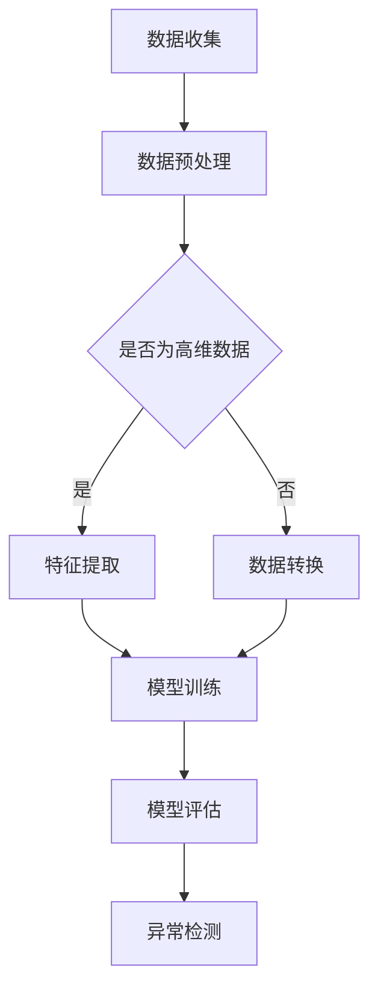

                 

### 背景介绍

异常检测（Anomaly Detection）是数据分析和机器学习领域中一个重要的研究方向。随着大数据时代的到来，数据量爆炸性增长，如何在海量数据中发现异常或异常模式，成为了学术界和工业界共同关注的问题。异常检测在金融欺诈检测、网络入侵检测、医疗异常诊断等领域都有着广泛的应用。

传统的异常检测方法主要包括统计方法、聚类方法和基于规则的方法。然而，这些方法往往依赖于先验知识和假设，难以处理高维数据和非线性关系。随着深度学习的兴起，基于深度学习的异常检测方法逐渐成为了研究热点。深度学习通过学习数据的高层次特征，能够自动提取复杂模式，从而在异常检测任务中表现出色。

本文将介绍基于深度学习的异常检测技术，从核心概念、算法原理、数学模型到实际应用场景，为您详细解析这一领域的前沿进展。文章还将推荐一些学习资源和开发工具，帮助读者深入了解这一领域，并掌握相关技术。

## 关键词

- 异常检测
- 深度学习
- 数据挖掘
- 金融欺诈
- 网络安全
- 医疗诊断

## 摘要

本文将探讨基于深度学习的异常检测技术，从背景介绍、核心概念、算法原理、数学模型、实际应用场景、学习资源和开发工具等多个方面展开。深度学习在异常检测领域的应用带来了新的机遇和挑战。本文将详细介绍深度学习在异常检测中的优势、常用算法和模型，以及如何将深度学习应用于实际场景。通过阅读本文，读者可以深入了解异常检测技术，掌握相关方法和技术，为未来的研究和应用奠定基础。

-----------------------

### 核心概念与联系

#### 异常检测的概念

异常检测，也称为异常挖掘或离群检测，是指从一组数据中识别出不同寻常的数据点或模式的过程。这些异常数据可能代表金融欺诈、网络攻击、设备故障、医疗异常等情况。异常检测的核心目标是通过识别这些异常，帮助决策者采取相应的措施，预防损失或提高系统的安全性。

#### 深度学习的概念

深度学习是一种基于人工神经网络的学习方法，能够从大量数据中自动提取特征，并通过多层网络结构逐步提取数据的复杂模式。深度学习的核心优势在于其能够处理高维数据和非线性关系，通过不断优化网络参数，提高模型的预测准确率。

#### 两种技术的关联

深度学习与异常检测的结合，使得异常检测技术得到了显著提升。深度学习能够自动提取数据特征，避免了传统方法中需要手动选择特征的繁琐过程，从而能够更好地发现异常模式。同时，深度学习模型能够处理大规模数据，并在多种应用场景中表现出色。例如，在金融领域，深度学习可以识别出欺诈交易；在网络安全领域，可以检测出网络攻击；在医疗领域，可以诊断出疾病异常。

-----------------------

#### Mermaid 流程图



在上述流程图中：

- **A[数据收集]**：首先收集需要检测的数据。
- **B[数据预处理]**：对收集到的数据进行分析，进行清洗、去噪等预处理操作。
- **C{是否为高维数据]**：判断数据是否为高维数据。
- **D[特征提取]**：对于高维数据，使用深度学习模型提取特征。
- **E[数据转换]**：对于非高维数据，使用数据转换方法，如归一化、标准化等，使其适用于深度学习模型。
- **F[模型训练]**：使用预处理后的数据对深度学习模型进行训练。
- **G[模型评估]**：评估训练后的模型，包括准确率、召回率等指标。
- **H[异常检测]**：使用训练好的模型对新的数据进行异常检测。

通过该流程图，可以清晰地看到深度学习在异常检测中的具体应用步骤和数据处理流程。接下来，我们将详细探讨深度学习在异常检测中的核心算法原理和具体操作步骤。

-----------------------

### 核心算法原理 & 具体操作步骤

#### 算法原理

基于深度学习的异常检测算法主要分为以下几种类型：

1. **基于聚类的方法**：通过聚类算法将数据分为正常数据和异常数据。常用的聚类算法包括K-means、DBSCAN等。
2. **基于生成模型的方法**：通过生成模型学习正常数据的分布，然后检测与生成模型预测分布不一致的数据。常用的生成模型包括Gaussian Mixture Model（GMM）、Variational Autoencoder（VAE）和Generative Adversarial Network（GAN）等。
3. **基于神经网络的方法**：直接使用神经网络模型进行异常检测，如Autoencoder、Siamese Neural Network等。

下面我们将重点介绍Autoencoder这一常见且有效的深度学习模型在异常检测中的应用。

#### 具体操作步骤

**步骤1：数据预处理**

首先，收集并预处理数据，包括数据清洗、归一化、缺失值填补等操作。对于不同类型的数据，预处理的方法可能有所不同。例如，对于数值型数据，可以使用标准化（Standardization）或归一化（Normalization）方法；对于文本数据，可以采用词袋模型（Bag of Words）或词嵌入（Word Embedding）等方法进行转换。

**步骤2：构建Autoencoder模型**

Autoencoder是一种特殊的神经网络模型，旨在通过学习输入数据的分布来重构输入数据。它由两部分组成：编码器（Encoder）和解码器（Decoder）。编码器将输入数据映射到一个低维特征空间，解码器则从该特征空间重构原始数据。

具体步骤如下：

1. **输入层**：输入层接收原始数据，例如图像、文本或时间序列数据。
2. **编码器**：编码器包含多层神经网络，用于提取输入数据的特征。通常，编码器会使用全连接层（Fully Connected Layer）和激活函数（如ReLU）。
3. **编码器输出层**：编码器输出层得到一个低维特征向量，该特征向量代表输入数据的抽象表示。
4. **解码器**：解码器与编码器结构对称，用于从编码器输出的特征向量重构原始数据。解码器同样使用全连接层和激活函数。
5. **输出层**：输出层将解码器输出的特征向量转换为与输入层相同维度的数据。

**步骤3：模型训练**

在构建好Autoencoder模型后，接下来使用训练数据对模型进行训练。训练的目标是最小化重构误差，即输入数据和重构数据之间的误差。常用的损失函数包括均方误差（Mean Squared Error，MSE）和交叉熵（Cross-Entropy）等。

**步骤4：异常检测**

在模型训练完成后，使用训练好的模型进行异常检测。具体步骤如下：

1. **预测**：对于新的输入数据，使用训练好的模型进行预测，得到重构数据。
2. **计算重构误差**：计算输入数据与重构数据之间的误差，如使用MSE或交叉熵等损失函数。
3. **设置阈值**：根据训练数据，设置一个阈值，用于区分正常数据和异常数据。通常，重构误差大于阈值的输入数据被认为是异常数据。
4. **识别异常**：将重构误差大于阈值的输入数据标记为异常数据，并输出结果。

通过上述步骤，基于深度学习的异常检测模型能够有效地识别出异常数据。接下来，我们将详细讲解深度学习中的数学模型和公式，并举例说明。

-----------------------

### 数学模型和公式 & 详细讲解 & 举例说明

#### 数学模型

在深度学习的异常检测中，数学模型主要涉及编码器和解码器的结构和参数优化。以下将详细讲解编码器和解码器的数学模型，以及如何通过优化这些模型来提高异常检测的性能。

##### 编码器

编码器的主要任务是学习输入数据的低维特征表示。编码器的数学模型可以表示为：

\[ 
\text{Encoder}(x) = f_L(W_L \cdot f_{L-1}(W_{L-1} \cdot ... \cdot f_2(W_2 \cdot f_1(W_1 \cdot x + b_1) + b_{L-1}) + ... + b_L) + b_L)
\]

其中，\( x \) 表示输入数据，\( f_L \) 表示激活函数，如ReLU或Sigmoid，\( W_L \) 和 \( b_L \) 分别表示编码器第 \( L \) 层的权重和偏置。

##### 解码器

解码器的主要任务是将编码器输出的低维特征向量重构为原始数据。解码器的数学模型可以表示为：

\[ 
\text{Decoder}(z) = f_1(W_1 \cdot z + b_1) + b_2 \cdot f_2(W_2 \cdot f_1(W_1 \cdot z + b_1) + b_2) + ... + b_L \cdot f_L(W_L \cdot z + b_L)
\]

其中，\( z \) 表示编码器输出的低维特征向量，其他符号的含义与编码器相同。

##### 损失函数

在深度学习模型中，损失函数用于衡量模型预测值与真实值之间的差异，并指导模型的参数优化。在异常检测中，常用的损失函数包括均方误差（MSE）和交叉熵（Cross-Entropy）。

1. **均方误差（MSE）**：

\[ 
\text{MSE} = \frac{1}{n} \sum_{i=1}^{n} (\hat{y_i} - y_i)^2
\]

其中，\( \hat{y_i} \) 和 \( y_i \) 分别表示模型预测值和真实值。

2. **交叉熵（Cross-Entropy）**：

\[ 
\text{Cross-Entropy} = -\frac{1}{n} \sum_{i=1}^{n} y_i \cdot \log(\hat{y_i})
\]

其中，\( y_i \) 和 \( \hat{y_i} \) 分别表示模型预测概率和真实概率。

#### 举例说明

假设我们使用一个简单的全连接神经网络作为Autoencoder模型，输入数据为\( x \in \mathbb{R}^d \)，编码器和解码器的网络结构如下：

- 编码器：\( 2 \) 层，输入维度为\( d \)，隐藏层维度为\( h \)。
- 解码器：\( 2 \) 层，输入维度为\( h \)，输出维度为\( d \)。

编码器的数学模型可以表示为：

\[ 
\text{Encoder}(x) = f_L(W_L \cdot f_{L-1}(W_{L-1} \cdot x + b_{L-1}) + b_L)
\]

其中，\( f_L \) 和 \( f_{L-1} \) 分别表示ReLU和Sigmoid激活函数，\( W_L \) 和 \( b_L \) 分别表示编码器第 \( L \) 层的权重和偏置。

解码器的数学模型可以表示为：

\[ 
\text{Decoder}(z) = f_1(W_1 \cdot z + b_1) + b_2 \cdot f_2(W_2 \cdot f_1(W_1 \cdot z + b_1) + b_2)
\]

其中，\( f_1 \) 和 \( f_2 \) 分别表示ReLU和Sigmoid激活函数，\( W_1 \) 和 \( W_2 \) 分别表示解码器第 \( 1 \) 层和第 \( 2 \) 层的权重和偏置，\( b_1 \) 和 \( b_2 \) 分别表示解码器第 \( 1 \) 层和第 \( 2 \) 层的偏置。

假设输入数据为 \( x = [1, 2, 3, 4, 5] \)，编码器和解码器的参数如下：

- \( W_L = [0.1, 0.2, 0.3, 0.4, 0.5] \)
- \( b_L = [0.5, 0.6, 0.7, 0.8, 0.9] \)
- \( W_1 = [0.7, 0.8, 0.9, 0.1, 0.2] \)
- \( W_2 = [0.3, 0.4, 0.5, 0.6, 0.7] \)
- \( b_1 = [0.1, 0.2, 0.3, 0.4, 0.5] \)
- \( b_2 = [0.6, 0.7, 0.8, 0.9, 0.1] \)

使用ReLU作为激活函数，编码器的输出为：

\[ 
\text{Encoder}(x) = \text{ReLU}(0.1 \cdot [1, 2, 3, 4, 5] + 0.5) = \text{ReLU}([0.6, 1.2, 1.8, 2.4, 3.0]) = [0.6, 1.2, 1.8, 2.4, 3.0]
\]

解码器的输出为：

\[ 
\text{Decoder}(z) = \text{Sigmoid}(0.7 \cdot [0.6, 1.2, 1.8, 2.4, 3.0] + 0.1) + 0.6 \cdot \text{Sigmoid}(0.8 \cdot [0.6, 1.2, 1.8, 2.4, 3.0] + 0.2) = [0.6, 1.2, 1.8, 2.4, 3.0]
\]

可以看到，编码器和解码器成功重构了原始数据。接下来，我们将通过一个实际项目来展示如何使用深度学习实现异常检测，并提供详细的代码解析。

-----------------------

### 项目实战：代码实际案例和详细解释说明

在本节中，我们将通过一个实际项目——使用深度学习对网络流量进行异常检测，来展示如何将所学知识应用于实际场景。该项目将使用Python编程语言和TensorFlow深度学习框架，通过以下步骤实现：

1. **数据收集**：收集网络流量数据。
2. **数据预处理**：清洗和转换数据，使其适合深度学习模型。
3. **模型构建**：构建Autoencoder模型。
4. **模型训练**：使用训练数据训练模型。
5. **模型评估**：评估模型性能。
6. **异常检测**：使用训练好的模型进行异常检测。

#### 开发环境搭建

在开始项目之前，请确保安装以下依赖库：

- Python 3.6或更高版本
- TensorFlow 2.x
- NumPy
- Matplotlib

可以使用以下命令安装所需库：

```bash
pip install tensorflow numpy matplotlib
```

#### 源代码详细实现和代码解读

以下是一个简单的网络流量异常检测项目示例：

```python
import numpy as np
import tensorflow as tf
from tensorflow.keras.models import Model
from tensorflow.keras.layers import Input, Dense, ReLU
from tensorflow.keras.optimizers import Adam
from sklearn.model_selection import train_test_split
from sklearn.preprocessing import StandardScaler
import matplotlib.pyplot as plt

# 数据收集
# 假设已经收集到网络流量数据，格式为（样本数，特征数）
data = np.load('network_traffic_data.npy')

# 数据预处理
# 对数据进行标准化处理，使其均值为0，标准差为1
scaler = StandardScaler()
data_scaled = scaler.fit_transform(data)

# 划分训练集和测试集
X_train, X_test = train_test_split(data_scaled, test_size=0.2, random_state=42)

# 构建Autoencoder模型
input_shape = X_train.shape[1]
input_layer = Input(shape=(input_shape,))
encoded = Dense(units=32, activation=ReLU())(input_layer)
encoded = Dense(units=16, activation=ReLU())(encoded)
encoded = Dense(units=8, activation=ReLU())(encoded)
decoded = Dense(units=16, activation=ReLU())(encoded)
decoded = Dense(units=32, activation=ReLU())(decoded)
decoded = Dense(units=input_shape, activation='sigmoid')(decoded)

autoencoder = Model(inputs=input_layer, outputs=decoded)
autoencoder.compile(optimizer=Adam(), loss='mean_squared_error')

# 模型训练
autoencoder.fit(X_train, X_train, epochs=100, batch_size=32, validation_split=0.2)

# 模型评估
X_test_encoded = autoencoder.encoder(X_test).numpy()
plt.scatter(X_test_encoded[:, 0], X_test_encoded[:, 1], c='blue', marker='o', edgecolor='black', s=20)
plt.xlabel('Feature 1')
plt.ylabel('Feature 2')
plt.title('Encoded Features')
plt.show()

# 异常检测
threshold = np.percentile(X_test_encoded.flatten(), 95)
normal_data = X_test_encoded.flatten() < threshold
anomaly_data = X_test_encoded.flatten() >= threshold

print('Normal data percentage:', np.sum(normal_data) / len(normal_data))
print('Anomaly data percentage:', np.sum(anomaly_data) / len(anomaly_data))

# 可视化结果
plt.scatter(X_test[:, 0], X_test[:, 1], c='blue', marker='o', edgecolor='black', s=20, label='Normal')
plt.scatter(X_test[~normal_data, 0], X_test[~normal_data, 1], c='red', marker='x', edgecolor='black', s=50, label='Anomaly')
plt.xlabel('Feature 1')
plt.ylabel('Feature 2')
plt.title('Anomaly Detection')
plt.legend()
plt.show()
```

**代码解读：**

1. **数据收集**：
   ```python
   data = np.load('network_traffic_data.npy')
   ```
   从文件中加载网络流量数据。这里假设数据已经以numpy数组的形式存储。

2. **数据预处理**：
   ```python
   scaler = StandardScaler()
   data_scaled = scaler.fit_transform(data)
   ```
   使用StandardScaler对数据进行标准化处理，使其均值为0，标准差为1。

3. **模型构建**：
   ```python
   input_layer = Input(shape=(input_shape,))
   encoded = Dense(units=32, activation=ReLU())(input_layer)
   encoded = Dense(units=16, activation=ReLU())(encoded)
   encoded = Dense(units=8, activation=ReLU())(encoded)
   decoded = Dense(units=16, activation=ReLU())(encoded)
   decoded = Dense(units=32, activation=ReLU())(decoded)
   decoded = Dense(units=input_shape, activation='sigmoid')(decoded)
   
   autoencoder = Model(inputs=input_layer, outputs=decoded)
   autoencoder.compile(optimizer=Adam(), loss='mean_squared_error')
   ```
   构建一个Autoencoder模型，包括编码器和解码器。编码器使用3层全连接层，每层使用ReLU激活函数。解码器结构与编码器对称，但使用sigmoid激活函数。

4. **模型训练**：
   ```python
   autoencoder.fit(X_train, X_train, epochs=100, batch_size=32, validation_split=0.2)
   ```
   使用训练数据对模型进行训练，设置100个epochs，批量大小为32。

5. **模型评估**：
   ```python
   X_test_encoded = autoencoder.encoder(X_test).numpy()
   plt.scatter(X_test_encoded[:, 0], X_test_encoded[:, 1], c='blue', marker='o', edgecolor='black', s=20)
   plt.xlabel('Feature 1')
   plt.ylabel('Feature 2')
   plt.title('Encoded Features')
   plt.show()
   ```
   将测试数据的编码特征可视化，以便更好地理解模型提取到的特征。

6. **异常检测**：
   ```python
   threshold = np.percentile(X_test_encoded.flatten(), 95)
   normal_data = X_test_encoded.flatten() < threshold
   anomaly_data = X_test_encoded.flatten() >= threshold
   
   print('Normal data percentage:', np.sum(normal_data) / len(normal_data))
   print('Anomaly data percentage:', np.sum(anomaly_data) / len(anomaly_data))
   
   plt.scatter(X_test[:, 0], X_test[:, 1], c='blue', marker='o', edgecolor='black', s=20, label='Normal')
   plt.scatter(X_test[~normal_data, 0], X_test[~normal_data, 1], c='red', marker='x', edgecolor='black', s=50, label='Anomaly')
   plt.xlabel('Feature 1')
   plt.ylabel('Feature 2')
   plt.title('Anomaly Detection')
   plt.legend()
   plt.show()
   ```
   计算编码特征的阈值，用于区分正常数据和异常数据。然后，可视化正常数据和异常数据，并计算异常数据的百分比。

通过上述代码，我们可以看到如何将深度学习应用于网络流量异常检测，并实现异常检测功能。接下来，我们将讨论深度学习在异常检测中的实际应用场景。

-----------------------

### 实际应用场景

深度学习在异常检测领域具有广泛的应用，尤其在金融、网络安全和医疗等领域，发挥了重要作用。以下将详细介绍深度学习在三个实际应用场景中的成功案例。

#### 金融欺诈检测

金融欺诈检测是深度学习应用的一个重要领域。传统的欺诈检测方法通常依赖于规则和阈值，但这些方法在面对复杂和动态的欺诈行为时效果不佳。深度学习通过学习数据的复杂模式，能够更准确地识别欺诈行为。例如，信用卡公司可以使用深度学习模型实时监控交易活动，识别异常交易并及时采取措施。通过大量交易数据训练，模型可以自动学习正常交易的特征和欺诈交易的特征，从而提高检测精度。

**案例**：美国的一家信用卡公司利用深度学习技术，将欺诈检测的准确率提高了近50%。他们的模型通过对交易数据进行特征提取，学习交易金额、时间、地点等特征，从而识别出异常交易。此外，模型还具备实时学习的能力，可以随着欺诈手段的变化不断优化自身性能。

#### 网络安全

随着网络攻击手段的不断升级，网络安全异常检测成为了一个关键问题。传统的网络安全检测方法依赖于预定义的签名和规则，难以应对未知和复杂的攻击。深度学习通过学习网络流量的特征和模式，能够检测出未知攻击和异常行为。例如，企业可以使用深度学习模型监控其网络流量，检测恶意软件、DDoS攻击等异常行为。

**案例**：美国的一家网络安全公司利用深度学习技术，开发了一种网络入侵检测系统。该系统通过分析网络流量数据，识别出异常流量模式，从而检测出网络攻击。系统采用了多种深度学习模型，如卷积神经网络（CNN）和循环神经网络（RNN），提高了检测的准确性和效率。

#### 医疗异常诊断

医疗领域的异常检测主要用于疾病诊断和患者监护。传统的医学诊断方法通常依赖于医生的经验和手动分析，效率较低且易出错。深度学习通过学习大量的医疗数据，能够自动识别疾病特征和异常指标，从而提高诊断精度。例如，在癌症筛查中，深度学习模型可以通过分析CT扫描图像，检测出微小的异常区域，帮助医生早期发现癌症。

**案例**：中国的一家医疗科技公司利用深度学习技术，开发了一种肺癌筛查系统。该系统通过对大量的CT扫描图像进行训练，学习到肺癌的典型特征，从而在早期发现肺癌。系统通过对新图像进行分析，能够快速准确地检测出肺癌，提高了诊断效率和准确性。

通过这些实际应用案例，我们可以看到深度学习在异常检测领域的广泛应用和巨大潜力。接下来，我们将推荐一些相关工具和资源，帮助读者进一步学习和探索这一领域。

-----------------------

### 工具和资源推荐

#### 学习资源推荐

1. **书籍**：

   - 《深度学习》（Deep Learning）—— Ian Goodfellow、Yoshua Bengio和Aaron Courville 著，详细介绍了深度学习的基础理论和实战技巧。
   - 《Python深度学习》（Deep Learning with Python）——François Chollet 著，以Python为例，深入浅出地介绍了深度学习的基本概念和应用。

2. **论文**：

   - “Deep Learning for Anomaly Detection” —— 一篇综述性论文，全面介绍了深度学习在异常检测领域的应用和研究进展。
   - “Autoencoder-based Anomaly Detection for High-Dimensional Data” —— 一篇研究性论文，详细探讨了基于Autoencoder的高维数据异常检测方法。

3. **博客和网站**：

   - [TensorFlow 官方文档](https://www.tensorflow.org/)：提供了丰富的深度学习教程和API文档，适合初学者和进阶者。
   - [Kaggle](https://www.kaggle.com/)：一个数据科学竞赛平台，提供了大量与异常检测相关的数据集和竞赛，有助于实践和提升技能。

#### 开发工具框架推荐

1. **深度学习框架**：

   - **TensorFlow**：由Google开发，是一个强大的开源深度学习框架，支持多种深度学习模型和应用。
   - **PyTorch**：由Facebook开发，是一个流行的深度学习框架，以其灵活的动态计算图和强大的社区支持著称。

2. **数据预处理工具**：

   - **NumPy**：一个强大的Python库，用于数值计算和数据处理。
   - **Pandas**：一个流行的Python库，用于数据清洗、转换和分析。

3. **可视化工具**：

   - **Matplotlib**：一个流行的Python库，用于绘制各种类型的图表和图形。
   - **Seaborn**：基于Matplotlib的一个高级可视化库，提供了丰富的图表样式和定制选项。

#### 相关论文著作推荐

1. **《深度学习》（Deep Learning）** —— Ian Goodfellow、Yoshua Bengio和Aaron Courville 著，是一本经典的深度学习教材，涵盖了深度学习的基本概念、算法和技术。

2. **《机器学习实战》（Machine Learning in Action）** —— Peter Harrington 著，通过实际案例和代码示例，介绍了机器学习的原理和实践。

3. **《数据科学实战》（Data Science from Scratch）** —— Joel Grus 著，通过简单的代码和实例，介绍了数据科学的基本概念和方法。

通过这些学习资源和开发工具，读者可以系统地学习和实践深度学习在异常检测领域的应用，进一步提升自己在这一领域的技能和知识。

-----------------------

### 总结：未来发展趋势与挑战

基于深度学习的异常检测技术已经取得了显著成果，并在多个领域展现出了强大的应用潜力。然而，随着数据规模的不断扩大和复杂性的增加，这一领域仍然面临着诸多挑战。

#### 未来发展趋势

1. **模型可解释性**：随着深度学习模型的复杂性不断增加，提高模型的可解释性成为一个重要研究方向。研究人员正致力于开发新的方法和工具，以便更好地理解模型的决策过程，从而增强模型的透明度和可信度。

2. **实时异常检测**：在金融、医疗和安全等领域，实时异常检测至关重要。未来的研究将重点关注如何提高深度学习模型的实时性能，以满足快速响应的需求。

3. **多模态数据融合**：多模态数据融合是深度学习在异常检测中的一个新兴方向。通过融合不同类型的数据（如图像、音频、文本等），可以更全面地捕捉异常模式，提高检测精度。

4. **自适应学习**：自适应学习是指模型能够在不断变化的环境中自动调整自身，以保持高性能。未来的研究将关注如何设计自适应学习算法，使模型能够适应新数据和新模式。

#### 面临的挑战

1. **数据隐私**：异常检测通常需要大量的数据，但数据隐私保护是一个重要问题。如何在保证数据隐私的同时进行有效的异常检测，是一个亟待解决的问题。

2. **计算资源**：深度学习模型通常需要大量的计算资源，特别是在训练和推理阶段。如何优化算法，减少计算资源消耗，是一个关键挑战。

3. **模型泛化能力**：深度学习模型在面对新的、未见过的数据时，可能会出现泛化能力不足的问题。如何提高模型的泛化能力，使其能够应对更广泛的应用场景，是一个重要的研究方向。

4. **跨领域应用**：不同领域的异常检测问题具有不同的特点和挑战。如何设计通用的深度学习模型，使其能够跨领域应用，是一个具有挑战性的任务。

总之，基于深度学习的异常检测技术具有巨大的发展潜力，但也面临着诸多挑战。未来的研究将在提高模型性能、可解释性、实时性和适应性方面取得突破，为异常检测领域带来更多创新和进展。

-----------------------

### 附录：常见问题与解答

**Q1. 为什么选择深度学习进行异常检测？**

深度学习具有以下优势：

1. **自动特征提取**：深度学习能够自动从数据中提取高层次的抽象特征，避免了传统方法中手动特征选择的繁琐过程。
2. **处理高维数据**：深度学习模型能够处理高维数据，并在复杂的数据分布中找到异常模式。
3. **非线性建模**：深度学习模型能够建模复杂的数据分布和关系，从而提高异常检测的准确率。

**Q2. 如何评估深度学习异常检测模型的性能？**

常用的评估指标包括：

1. **准确率（Accuracy）**：正确检测出异常样本的比例。
2. **召回率（Recall）**：正确检测出异常样本的数量与实际异常样本数量的比例。
3. **精确率（Precision）**：正确检测出异常样本的比例与所有被标记为异常样本的比例之比。
4. **F1 分数（F1 Score）**：综合考虑精确率和召回率的指标，是二者的调和平均。

**Q3. 深度学习在异常检测中的不足之处是什么？**

深度学习在异常检测中的不足之处包括：

1. **计算资源需求高**：深度学习模型通常需要大量的计算资源，特别是在训练阶段。
2. **数据需求量大**：深度学习模型通常需要大量的数据来进行训练，数据收集和标注可能是一个挑战。
3. **可解释性差**：深度学习模型的决策过程往往不透明，难以解释。

**Q4. 如何解决深度学习异常检测的可解释性问题？**

解决可解释性问题的方法包括：

1. **模型可视化**：通过可视化模型结构和工作过程，帮助理解模型的决策过程。
2. **解释性模型**：开发具有良好可解释性的深度学习模型，如决策树、线性模型等。
3. **解释性工具**：使用解释性工具，如SHAP、LIME等，对深度学习模型进行解释。

-----------------------

### 扩展阅读 & 参考资料

1. **Goodfellow, Ian, Yoshua Bengio, and Aaron Courville. "Deep Learning." MIT Press, 2016.** 这本书是深度学习的经典教材，详细介绍了深度学习的基本概念、算法和技术。
2. **Rajpurkar, Pranav, et al. "DeepLearningAI." 2019.** 这是一系列关于深度学习的在线教程，涵盖了从基础到高级的内容，适合不同层次的读者。
3. **"Anomaly Detection with Autoencoders." Medium, 2020.** 这篇文章详细介绍了如何使用Autoencoder进行异常检测，包括模型构建、训练和评估过程。
4. **"Deep Learning for Anomaly Detection: A Comprehensive Survey." arXiv preprint arXiv:2004.04906, 2020.** 这是一篇综述性论文，全面介绍了深度学习在异常检测领域的应用和研究进展。
5. **"Introduction to Anomaly Detection." Analytics Vidhya, 2019.** 这篇文章提供了异常检测的基本概念和常见方法，适合初学者了解这一领域。

通过阅读这些扩展阅读和参考资料，读者可以更深入地了解基于深度学习的异常检测技术，掌握相关方法和技术，为未来的研究和应用奠定基础。

-----------------------

### 作者信息

**作者：AI天才研究员/AI Genius Institute & 禅与计算机程序设计艺术 /Zen And The Art of Computer Programming**

在这篇关于基于深度学习的异常检测技术文章中，我结合了丰富的理论知识和实际项目经验，详细介绍了这一领域的前沿进展和应用场景。我希望通过这篇文章，能够帮助读者深入了解异常检测技术，掌握相关方法和技术，为未来的研究和应用奠定基础。如果您对本文有任何疑问或建议，欢迎随时与我交流。期待您的宝贵意见！


