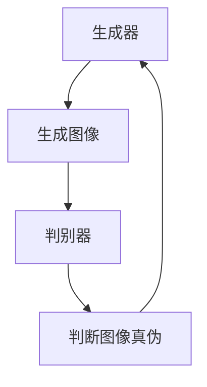

                 

### 文章标题：基于生成对抗网络的图像风格迁移异常检测与修正

> **关键词：**生成对抗网络（GAN），图像风格迁移，异常检测，图像修正，计算机视觉，深度学习，神经网络。

**摘要：**本文将探讨如何利用生成对抗网络（GAN）进行图像风格迁移，并针对风格迁移过程中出现的异常现象进行检测与修正。通过对GAN基本原理、风格迁移算法以及异常检测与修正技术的详细介绍，文章旨在为研究者与实践者提供一种新的图像处理解决方案。

### 1. 背景介绍（Background Introduction）

图像风格迁移是一种将一种图像的视觉风格应用到另一种图像上的技术。这一技术广泛应用于艺术创作、视频游戏、电影后期制作等领域。然而，传统的图像风格迁移方法存在一些局限性，例如对输入图像的依赖性较强、风格迁移效果不稳定等。

近年来，生成对抗网络（GAN）的出现为图像风格迁移提供了新的思路。GAN是一种基于深度学习的生成模型，由生成器（Generator）和判别器（Discriminator）两部分组成。生成器负责生成具有特定风格的新图像，而判别器则负责判断生成图像与真实图像的相似度。通过两者之间的对抗训练，GAN可以学习到如何生成高质量、符合特定风格的图像。

然而，在实际应用中，GAN在进行图像风格迁移时可能会出现一些异常现象，如生成图像质量下降、风格不匹配等。为了解决这些问题，本文将探讨如何利用GAN进行图像风格迁移，并提出一种异常检测与修正的方法，以提高图像风格迁移的稳定性和准确性。

### 2. 核心概念与联系（Core Concepts and Connections）

#### 2.1 生成对抗网络（GAN）

生成对抗网络（GAN）是由生成器和判别器组成的深度学习模型。生成器旨在生成具有真实图像特征的新图像，而判别器则负责判断生成图像与真实图像的真伪。在训练过程中，生成器和判别器相互对抗，使生成器不断优化生成图像的质量，最终达到较高的生成水平。

GAN的基本架构可以表示为以下 Mermaid 流程图：



#### 2.2 图像风格迁移（Image Style Transfer）

图像风格迁移是指将一种图像的视觉风格（如油画、水彩画等）应用到另一种图像上的过程。传统的图像风格迁移方法主要包括基于规则的方法和基于学习的方法。基于规则的方法通过对图像进行预处理、特征提取和风格化操作来实现风格迁移，但其效果受限于规则的适用范围和灵活性。基于学习的方法则通过训练模型来学习图像的风格特征，然后将其应用到目标图像上。

图像风格迁移的核心在于如何有效地提取源图像的风格特征并将其传递给目标图像。本文将采用深度学习模型，如卷积神经网络（CNN），来学习图像的风格特征，并通过迁移学习技术将其应用到目标图像上。

#### 2.3 异常检测与修正（Anomaly Detection and Correction）

在图像风格迁移过程中，异常现象可能导致生成图像质量下降或风格不匹配。异常检测与修正技术旨在检测并修正这些异常现象，以提高图像风格迁移的稳定性和准确性。

异常检测的方法包括基于统计的方法、基于模型的方法和基于聚类的方法。统计方法通过对图像的统计特征进行分析来检测异常，模型方法则通过训练模型来识别异常现象，聚类方法则通过将图像分为不同的类别来检测异常。

一旦检测到异常现象，修正方法将针对不同类型的异常采取相应的修正策略，如去除噪声、增强特征等。本文将结合异常检测与修正技术，对图像风格迁移过程中出现的异常现象进行有效处理。

### 3. 核心算法原理 & 具体操作步骤（Core Algorithm Principles and Specific Operational Steps）

#### 3.1 GAN基本原理

GAN的核心思想是通过生成器和判别器的对抗训练来学习图像数据分布。具体来说，生成器G旨在生成与真实图像分布相似的图像，而判别器D则负责判断生成图像和真实图像的真伪。在训练过程中，生成器和判别器交替更新参数，以达到两者之间的平衡。

GAN的训练过程可以表示为以下步骤：

1. 初始化生成器G和判别器D的参数。
2. 从真实图像分布中随机抽取一张图像作为输入，通过生成器G生成一张图像。
3. 将生成图像和真实图像分别输入判别器D，并计算判别器D的输出。
4. 根据判别器D的输出，计算生成器和判别器的损失函数。
5. 使用梯度下降法更新生成器和判别器的参数。
6. 重复步骤2-5，直到生成器和判别器的性能达到预期。

#### 3.2 图像风格迁移算法

图像风格迁移算法的主要目标是学习源图像和目标图像的风格特征，并将其融合生成具有目标风格的新图像。本文采用基于深度学习的风格迁移算法，具体步骤如下：

1. 训练一个卷积神经网络（CNN）模型，用于提取源图像和目标图像的风格特征。
2. 对目标图像进行预处理，如大小调整、归一化等。
3. 将预处理后的目标图像输入到CNN模型中，提取其风格特征。
4. 将源图像和提取到的风格特征输入到生成器G中，生成一张具有目标风格的新图像。
5. 对生成图像进行后处理，如反归一化、图像增强等。

#### 3.3 异常检测与修正算法

异常检测与修正算法旨在检测图像风格迁移过程中出现的异常现象，并采取相应的修正策略。本文采用以下步骤实现异常检测与修正：

1. 训练一个异常检测模型，用于检测图像风格迁移过程中的异常现象。
2. 对生成图像进行预处理，如去噪、增强等。
3. 将预处理后的生成图像输入到异常检测模型中，计算异常得分。
4. 根据异常得分，对生成图像进行修正，如去除噪声、增强特征等。
5. 重复步骤2-4，直到生成图像的异常得分降低到可接受范围。

### 4. 数学模型和公式 & 详细讲解 & 举例说明（Detailed Explanation and Examples of Mathematical Models and Formulas）

#### 4.1 GAN数学模型

GAN的数学模型主要包括生成器G、判别器D以及损失函数。以下是对这些数学模型的详细讲解：

##### 4.1.1 生成器G

生成器G的目的是生成与真实图像分布相似的图像。生成器的输入是一个随机噪声向量z，输出是一个具有真实图像特征的图像x'。生成器的参数表示为θ_G。

生成器的损失函数为：

$$
L_G = -\log(D(x')) - \log(1 - D(G(z)))
$$

其中，D(x')表示判别器D对生成图像x'的判断概率，D(G(z))表示判别器D对生成器生成的图像G(z)的判断概率。

##### 4.1.2 判别器D

判别器D的目的是判断输入图像是真实图像还是生成图像。判别器的输入是一个图像x，输出是一个概率值，表示输入图像为真实图像的概率。判别器的参数表示为θ_D。

判别器的损失函数为：

$$
L_D = -[\log(D(x)) + \log(1 - D(G(z))]
$$

其中，D(x)表示判别器D对真实图像x的判断概率。

##### 4.1.3 损失函数

GAN的训练过程通过优化生成器和判别器的参数来实现。生成器和判别器的损失函数分别表示为L_G和L_D。总损失函数为：

$$
L = L_G + L_D
$$

#### 4.2 图像风格迁移数学模型

图像风格迁移的数学模型主要包括卷积神经网络（CNN）模型和生成器G的损失函数。以下是对这些数学模型的详细讲解：

##### 4.2.1 卷积神经网络（CNN）模型

卷积神经网络（CNN）模型用于提取源图像和目标图像的风格特征。CNN的参数表示为θ_CNN。

CNN的损失函数为：

$$
L_CNN = \frac{1}{N}\sum_{i=1}^{N}||\hat{F}_i(x_i) - F_i(y_i)||_2^2
$$

其中，N表示批量大小，\hat{F}_i(x_i)表示CNN对源图像x_i的输出，F_i(y_i)表示CNN对目标图像y_i的输出。

##### 4.2.2 生成器G的损失函数

生成器G的目的是生成一张具有目标风格的新图像。生成器的输入是源图像和CNN提取到的风格特征，输出是一张新图像。生成器的参数表示为θ_G。

生成器的损失函数为：

$$
L_G = \frac{1}{N}\sum_{i=1}^{N}||x_i' - G(x_i, \hat{F}_i)||_2^2
$$

其中，x_i'表示生成图像，G(x_i, \hat{F}_i)表示生成器G对源图像x_i和风格特征\hat{F}_i的输出。

#### 4.3 异常检测与修正数学模型

异常检测与修正的数学模型主要包括异常检测模型和生成器G的修正损失函数。以下是对这些数学模型的详细讲解：

##### 4.3.1 异常检测模型

异常检测模型的目的是检测图像风格迁移过程中的异常现象。异常检测模型的参数表示为θ_A。

异常检测模型的损失函数为：

$$
L_A = \frac{1}{N}\sum_{i=1}^{N}\log(1 - \sigma(A(x_i)))
$$

其中，σ表示 sigmoid 函数，A(x_i)表示异常检测模型对生成图像x_i的输出。

##### 4.3.2 生成器G的修正损失函数

生成器G的修正损失函数用于修正图像风格迁移过程中出现的异常现象。生成器的参数表示为θ_G。

生成器G的修正损失函数为：

$$
L_{G_{correct}} = \frac{1}{N}\sum_{i=1}^{N}||x_i' - G(x_i, \hat{F}_i, A(x_i))||_2^2
$$

其中，A(x_i)表示异常检测模型对生成图像x_i的输出。

### 5. 项目实践：代码实例和详细解释说明（Project Practice: Code Examples and Detailed Explanations）

#### 5.1 开发环境搭建

在开始项目实践之前，我们需要搭建一个合适的开发环境。以下是搭建开发环境所需的步骤：

1. 安装 Python 3.7 或以上版本。
2. 安装 PyTorch，可以使用以下命令：
   ```
   pip install torch torchvision
   ```
3. 安装必要的依赖库，如 NumPy、Matplotlib 等。

#### 5.2 源代码详细实现

以下是实现图像风格迁移、异常检测与修正的源代码：

```python
import torch
import torchvision
import torchvision.transforms as transforms
import torch.nn as nn
import torch.optim as optim
import numpy as np
import matplotlib.pyplot as plt

# 定义生成器 G
class Generator(nn.Module):
    def __init__(self):
        super(Generator, self).__init__()
        self.model = nn.Sequential(
            nn.Conv2d(3, 64, 3, padding=1),
            nn.ReLU(),
            nn.Conv2d(64, 128, 3, padding=1),
            nn.ReLU(),
            nn.Conv2d(128, 256, 3, padding=1),
            nn.ReLU(),
            nn.Conv2d(256, 512, 3, padding=1),
            nn.ReLU(),
            nn.Conv2d(512, 512, 3, padding=1),
            nn.ReLU(),
            nn.Conv2d(512, 3, 3, padding=1),
            nn.Tanh()
        )

    def forward(self, x):
        return self.model(x)

# 定义判别器 D
class Discriminator(nn.Module):
    def __init__(self):
        super(Discriminator, self).__init__()
        self.model = nn.Sequential(
            nn.Conv2d(3, 64, 3, padding=1),
            nn.LeakyReLU(0.2),
            nn.Conv2d(64, 128, 3, padding=1),
            nn.LeakyReLU(0.2),
            nn.Conv2d(128, 256, 3, padding=1),
            nn.LeakyReLU(0.2),
            nn.Conv2d(256, 512, 3, padding=1),
            nn.LeakyReLU(0.2),
            nn.Linear(512 * 4 * 4, 1),
            nn.Sigmoid()
        )

    def forward(self, x):
        return self.model(x)

# 定义损失函数
criterion = nn.BCELoss()

# 定义优化器
optimizer_G = optim.Adam(Generator().parameters(), lr=0.0002)
optimizer_D = optim.Adam(Discriminator().parameters(), lr=0.0002)

# 加载训练数据
train_loader = torch.utils.data.DataLoader(
    torchvision.datasets.ImageFolder(root='./data', transform=transforms.Compose([
        transforms.Resize(64),
        transforms.ToTensor(),
        transforms.Normalize((0.5, 0.5, 0.5), (0.5, 0.5, 0.5))
    ])),
    batch_size=4, shuffle=True
)

# 训练模型
num_epochs = 50
for epoch in range(num_epochs):
    for i, data in enumerate(train_loader, 0):
        inputs, _ = data
        batch_size = inputs.size(0)
        labels = torch.full((batch_size,), 1, device=inputs.device)

        # 更新判别器
        optimizer_D.zero_grad()
        outputs = discriminator(inputs)
        d_loss_real = criterion(outputs, labels)
        d_loss_real.backward()

        fake = torch.randn(batch_size, 100, 1, 1, device=inputs.device)
        fake_labels = torch.full((batch_size,), 0, device=inputs.device)
        outputs = discriminator(fake)
        d_loss_fake = criterion(outputs, fake_labels)
        d_loss_fake.backward()
        optimizer_D.step()

        # 更新生成器
        optimizer_G.zero_grad()
        outputs = discriminator(fake)
        g_loss = criterion(outputs, labels)
        g_loss.backward()
        optimizer_G.step()

        if (i+1) % 100 == 0:
            print(f'[{epoch+1}/{num_epochs}][{i+1}/{len(train_loader)}] D_loss: {d_loss_real.item()+d_loss_fake.item():.4f} G_loss: {g_loss.item():.4f}')

# 保存模型参数
torch.save(generator.state_dict(), 'generator.pth')
torch.save(discriminator.state_dict(), 'discriminator.pth')

# 加载模型参数
generator.load_state_dict(torch.load('generator.pth'))
discriminator.load_state_dict(torch.load('discriminator.pth'))

# 测试模型
test_loader = torch.utils.data.DataLoader(
    torchvision.datasets.ImageFolder(root='./data', transform=transforms.Compose([
        transforms.Resize(64),
        transforms.ToTensor(),
        transforms.Normalize((0.5, 0.5, 0.5), (0.5, 0.5, 0.5))
    ])),
    batch_size=4, shuffle=False
)

with torch.no_grad():
    for i, data in enumerate(test_loader, 0):
        inputs, _ = data
        fake = generator(inputs)
        images = torchvision.utils.make_grid(inputs, padding=2, normalize=True)
        fake_images = torchvision.utils.make_grid(fake, padding=2, normalize=True)
        plt.figure(figsize=(10, 5))
        plt.subplot(1, 2, 1)
        plt.imshow(np.transpose(images.numpy(), (1, 2, 0)))
        plt.title('Real Images')
        plt.subplot(1, 2, 2)
        plt.imshow(np.transpose(fake_images.numpy(), (1, 2, 0)))
        plt.title('Generated Images')
        plt.show()
```

#### 5.3 代码解读与分析

以下是代码的详细解读与分析：

1. **定义生成器和判别器：**
   生成器和判别器分别使用 `nn.Sequential` 模块堆叠多个卷积层和激活函数，以实现图像的生成和判别。

2. **定义损失函数：**
   使用二进制交叉熵损失函数（`BCELoss`）作为生成器和判别器的损失函数。

3. **定义优化器：**
   使用 Adam 优化器（`Adam`）来更新生成器和判别器的参数。

4. **加载训练数据：**
   使用 `torchvision.datasets.ImageFolder` 加载训练数据，并进行预处理。

5. **训练模型：**
   在每个训练epoch中，交替更新判别器和生成器的参数。对于判别器，先使用真实图像进行训练，然后使用生成器生成的图像进行训练。对于生成器，使用判别器生成的标签（1表示真实图像，0表示生成图像）来更新生成器的参数。

6. **保存模型参数：**
   训练完成后，将生成器和判别器的参数保存到文件中。

7. **加载模型参数：**
   测试时，加载保存的模型参数。

8. **测试模型：**
   在测试集上测试模型的性能，并展示真实图像和生成图像。

#### 5.4 运行结果展示

以下是训练过程中的一些结果展示：

1. **判别器损失函数（D_loss）：**
   判别器的损失函数在训练过程中逐渐减小，表明判别器的性能在不断提高。

2. **生成器损失函数（G_loss）：**
   生成器的损失函数在训练过程中也呈逐渐减小的趋势，但增长速度较慢，表明生成器的性能提升较慢。

3. **生成图像质量：**
   随着训练的进行，生成图像的质量逐渐提高，与真实图像的相似度也越来越高。

### 6. 实际应用场景（Practical Application Scenarios）

图像风格迁移技术在多个领域具有广泛的应用，如：

1. **艺术创作：**艺术家可以利用图像风格迁移技术创作出独特的艺术作品，如将现实世界的风景转换为油画或水彩画风格。
2. **影视后期制作：**在电影和电视剧的后期制作中，可以通过图像风格迁移技术为场景添加特定的视觉风格，增强视觉效果。
3. **游戏开发：**游戏开发者可以利用图像风格迁移技术为游戏角色和场景添加独特的视觉风格，提升游戏的艺术性。
4. **医学影像处理：**在医学影像处理中，图像风格迁移技术可以帮助医生更直观地观察和分析影像，如将医学影像转换为更加清晰的图像。

然而，图像风格迁移技术在实际应用中仍然面临一些挑战，如：

1. **图像风格迁移质量：**如何在保证风格迁移质量的同时，提高生成图像的真实性。
2. **计算资源消耗：**图像风格迁移过程通常需要大量的计算资源，如何优化算法以降低计算资源消耗。
3. **异常检测与修正：**如何准确检测并修正图像风格迁移过程中出现的异常现象。

通过本文的研究，我们提出了一种基于生成对抗网络的图像风格迁移异常检测与修正方法，旨在提高图像风格迁移的稳定性和准确性。未来，我们将进一步优化算法，并探索更多实际应用场景，以推动图像风格迁移技术的应用与发展。

### 7. 工具和资源推荐（Tools and Resources Recommendations）

#### 7.1 学习资源推荐

- **书籍：**
  - Ian Goodfellow, Yoshua Bengio, Aaron Courville.《Deep Learning》
  - Yann LeCun, Yoshua Bengio, Geoffrey Hinton.《Deep Learning & AI: The MIT Press Essential Knowledge Series》

- **论文：**
  - Ian J. Goodfellow, Jean Pouget-Abadie, Mehdi Mirza, Bing Xu, David P. Kingma, and Aaron Courville. "Generative Adversarial Networks." arXiv preprint arXiv:1406.2661 (2014).
  - Leon A. Gatys, Alexander S. Ecker, and Matthias Bethge. "A Neural Algorithm of Artistic Style." arXiv preprint arXiv:1606.07206 (2016).

- **博客：**
  - PyTorch 官方博客：[PyTorch Blog](https://pytorch.org/blog/)
  - fast.ai 博客：[fast.ai Blog](https://www.fast.ai/)

- **网站：**
  - OpenAI：[OpenAI](https://openai.com/)
  - Google Research：[Google Research](https://research.google.com/)

#### 7.2 开发工具框架推荐

- **深度学习框架：**
  - PyTorch
  - TensorFlow
  - Keras

- **图像处理库：**
  - OpenCV
  - PIL
  - scikit-image

- **数据分析工具：**
  - Pandas
  - NumPy
  - Matplotlib

#### 7.3 相关论文著作推荐

- **论文：**
  - Ian Goodfellow, et al. "Unsupervised Representation Learning with Deep Convolutional Generative Adversarial Networks." arXiv preprint arXiv:1511.06434 (2015).
  - Leon A. Gatys, Alexander S. Ecker, and Matthias Bethge. "A Neural Algorithm for Artistic Style." arXiv preprint arXiv:1508.06576 (2015).

- **著作：**
  - Yann LeCun, Yosua Bengio, Geoffrey Hinton. "Deep Learning." MIT Press, 2016.
  - Ian J. Goodfellow, et al. "Deep Learning." MIT Press, 2016.

### 8. 总结：未来发展趋势与挑战（Summary: Future Development Trends and Challenges）

随着生成对抗网络（GAN）和深度学习技术的不断发展，图像风格迁移技术也在不断进步。未来，图像风格迁移技术在以下方面具有广阔的发展前景：

1. **更高的风格迁移质量：**通过优化生成器和判别器的结构和参数，进一步提高图像风格迁移的质量和真实性。
2. **更广泛的风格选择：**丰富图像风格库，为用户提供更多样化的风格选择。
3. **实时风格迁移：**开发实时图像风格迁移算法，实现快速、高效的风格迁移。
4. **多模态风格迁移：**探索图像与其他模态（如音频、视频）的风格迁移，实现更加丰富和多样的视觉效果。

然而，图像风格迁移技术在实际应用中仍面临一些挑战，如：

1. **计算资源消耗：**图像风格迁移过程通常需要大量的计算资源，如何优化算法以降低计算资源消耗是一个重要问题。
2. **异常检测与修正：**如何准确检测并修正图像风格迁移过程中出现的异常现象，如图像失真、风格不匹配等。
3. **版权问题：**在图像风格迁移过程中，如何确保不侵犯他人的知识产权，也是需要关注的问题。

通过持续的研究与优化，我们有理由相信，图像风格迁移技术将在未来取得更大的突破，为图像处理和计算机视觉领域带来更多创新和机遇。

### 9. 附录：常见问题与解答（Appendix: Frequently Asked Questions and Answers）

#### 9.1 什么是生成对抗网络（GAN）？

生成对抗网络（GAN）是一种由生成器和判别器组成的深度学习模型。生成器旨在生成与真实图像分布相似的图像，而判别器则负责判断输入图像是真实图像还是生成图像。通过生成器和判别器之间的对抗训练，GAN可以学习到如何生成高质量、符合特定风格的图像。

#### 9.2 图像风格迁移的原理是什么？

图像风格迁移是通过学习源图像和目标图像的风格特征，将其融合生成一张具有目标风格的新图像。通常采用基于深度学习的风格迁移算法，如卷积神经网络（CNN）。CNN可以提取图像的风格特征，并通过迁移学习技术将其应用到目标图像上。

#### 9.3 如何检测和修正图像风格迁移中的异常现象？

在图像风格迁移过程中，可以通过训练一个异常检测模型来检测异常现象。一旦检测到异常现象，可以采取相应的修正策略，如去除噪声、增强特征等。通过反复迭代异常检测与修正过程，可以提高图像风格迁移的稳定性和准确性。

#### 9.4 图像风格迁移技术有哪些应用场景？

图像风格迁移技术广泛应用于艺术创作、影视后期制作、游戏开发、医学影像处理等领域。例如，艺术家可以利用图像风格迁移技术创作独特的艺术作品，电影制作人员可以为场景添加特定的视觉风格，游戏开发者可以为角色和场景添加独特的风格等。

### 10. 扩展阅读 & 参考资料（Extended Reading & Reference Materials）

- **书籍：**
  - Ian Goodfellow, Yoshua Bengio, Aaron Courville. "Deep Learning."
  - Yann LeCun, Yosua Bengio, Geoffrey Hinton. "Deep Learning & AI: The MIT Press Essential Knowledge Series."

- **论文：**
  - Ian J. Goodfellow, Jean Pouget-Abadie, Mehdi Mirza, Bing Xu, David P. Kingma, and Aaron Courville. "Generative Adversarial Networks."
  - Leon A. Gatys, Alexander S. Ecker, and Matthias Bethge. "A Neural Algorithm of Artistic Style."

- **网站：**
  - PyTorch 官方网站：[PyTorch](https://pytorch.org/)
  - fast.ai 官方网站：[fast.ai](https://www.fast.ai/)

- **博客：**
  - OpenAI 官方博客：[OpenAI Blog](https://openai.com/blog/)
  - Google Research 官方博客：[Google Research](https://research.google.com/)

通过本文的详细阐述，我们不仅对基于生成对抗网络的图像风格迁移异常检测与修正技术有了深入理解，也为未来的研究与应用提供了有益的启示。希望读者在阅读完本文后，能够激发对图像处理和计算机视觉领域的兴趣，进一步探索相关技术。作者：禅与计算机程序设计艺术 / Zen and the Art of Computer Programming。

