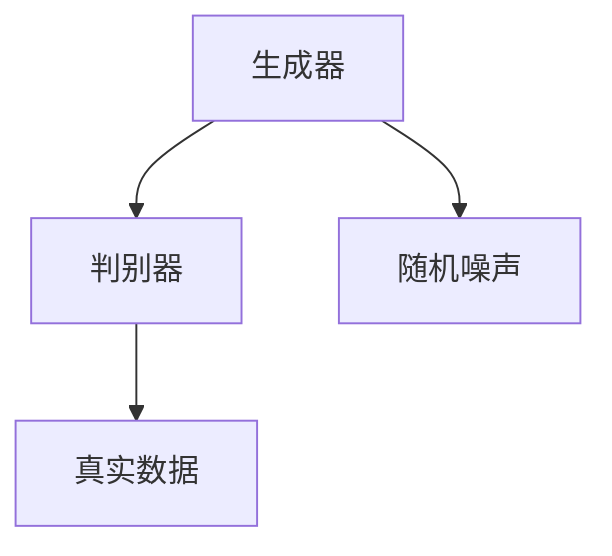

                 

### 背景介绍

#### 社交媒体图片风格迁移的背景

在当今数字化时代，社交媒体已成为人们日常生活不可或缺的一部分。人们每天在社交媒体上发布数以亿计的照片，分享生活点滴。随之而来的，是用户对个性化图片处理的需求日益增长。图片风格迁移，作为一种新兴技术，应运而生。它旨在将源图片转换为目标图片的风格，从而提升图片的视觉效果。

图片风格迁移的应用场景广泛，包括但不限于以下方面：

1. **艺术创作**：用户可以通过风格迁移技术将普通照片转换为艺术作品，如油画、水彩画等。
2. **娱乐行业**：影视制作中，特效团队常利用风格迁移技术为角色或场景变换风格，提升视觉效果。
3. **广告宣传**：品牌和企业利用风格迁移技术为广告图片增添创意，吸引更多关注。
4. **社交媒体美化**：用户在发布照片前，通过风格迁移技术对照片进行美化，增强个人形象。

#### 生成对抗网络（GAN）的兴起

生成对抗网络（Generative Adversarial Networks，GAN）是近年来人工智能领域的一项重要突破。它由 Ian Goodfellow 等人于2014年提出。GAN的核心思想是通过两个神经网络的对抗训练，生成高质量的数据。

GAN由两部分组成：生成器（Generator）和判别器（Discriminator）。生成器的目标是生成与真实数据相似的数据，而判别器的目标是区分真实数据和生成数据。在训练过程中，生成器和判别器相互对抗，不断优化自己的性能，最终实现高质量的图像生成。

GAN的出色性能使其在图像处理领域得到广泛应用，如图像生成、图像修复、超分辨率、图像风格迁移等。在社交媒体图片风格迁移中，GAN的应用进一步提升了图片处理的精度和效果。

#### 文章结构概述

本文旨在探讨基于生成对抗网络的社交媒体图片风格迁移技术。文章结构如下：

1. **背景介绍**：简要介绍社交媒体图片风格迁移的背景和生成对抗网络（GAN）的兴起。
2. **核心概念与联系**：详细解释生成对抗网络（GAN）的核心概念和架构。
3. **核心算法原理 & 具体操作步骤**：介绍GAN在图片风格迁移中的具体操作步骤。
4. **数学模型和公式 & 详细讲解 & 举例说明**：阐述GAN的数学模型和关键公式，并通过实例进行详细解释。
5. **项目实战：代码实际案例和详细解释说明**：提供实际项目代码，并进行详细解读。
6. **实际应用场景**：探讨GAN在社交媒体图片风格迁移中的实际应用。
7. **工具和资源推荐**：推荐学习资源、开发工具和框架。
8. **总结：未来发展趋势与挑战**：总结GAN在社交媒体图片风格迁移中的应用前景和面临的挑战。
9. **附录：常见问题与解答**：解答读者可能遇到的问题。
10. **扩展阅读 & 参考资料**：提供相关参考资料，供读者进一步学习。

通过以上章节的详细探讨，本文将全面揭示基于生成对抗网络的社交媒体图片风格迁移技术，为读者提供深入理解和实际应用指导。

### 核心概念与联系

#### 生成对抗网络（GAN）的核心概念

生成对抗网络（GAN）是一种由生成器和判别器组成的深度学习模型。其核心思想是通过生成器和判别器之间的对抗训练，生成高质量的数据。

**生成器（Generator）**：生成器的目标是生成与真实数据相似的数据。它通过学习真实数据的分布，生成出能够以假乱真的数据。生成器通常由多层神经网络组成，输入为随机噪声，输出为生成的数据。

**判别器（Discriminator）**：判别器的目标是区分真实数据和生成数据。它接收真实数据和生成数据作为输入，并输出一个概率值，表示输入数据的真实程度。判别器也由多层神经网络组成。

**对抗训练**：生成器和判别器在训练过程中相互对抗。生成器的目标是提高生成数据的真实度，使得判别器无法区分生成数据和真实数据。而判别器的目标是提高对真实数据和生成数据的区分能力。这种对抗训练使得生成器和判别器不断优化，最终实现高质量的图像生成。

#### GAN的架构

GAN的架构如图1所示：



1. **生成器（Generator）**：生成器接收随机噪声作为输入，通过多层神经网络生成数据。这些数据可以是图像、音频或文本等。生成器的目标是最小化生成数据的判别损失，使得判别器无法区分生成数据和真实数据。

2. **判别器（Discriminator）**：判别器接收真实数据和生成数据作为输入，通过多层神经网络输出一个概率值，表示输入数据的真实程度。判别器的目标是最小化对真实数据和生成数据的区分损失。

3. **随机噪声**：生成器的输入为随机噪声，这些噪声通过生成器的多层神经网络转换为生成数据。

4. **真实数据**：判别器的输入为真实数据，这些数据可以是训练集中的真实图像、音频或文本等。

#### GAN的训练过程

GAN的训练过程分为以下几个步骤：

1. **初始化生成器和判别器**：随机初始化生成器和判别器的权重。
2. **生成器生成数据**：生成器根据随机噪声生成数据。
3. **判别器评估数据**：判别器评估生成数据和真实数据的真实程度。
4. **更新判别器权重**：根据判别器的评估结果，更新判别器的权重，使得判别器能够更好地区分生成数据和真实数据。
5. **生成器更新权重**：根据判别器的评估结果，更新生成器的权重，使得生成器能够生成更真实的数据。
6. **重复步骤2-5**：重复上述步骤，直至生成器和判别器达到训练目标。

#### GAN的优势

生成对抗网络（GAN）具有以下优势：

1. **高质量生成**：GAN能够生成高质量的数据，特别是在图像生成方面，生成的图像具有很高的真实度。
2. **自适应性**：GAN的训练过程中，生成器和判别器相互对抗，能够自适应地调整生成数据和判别器的性能。
3. **灵活性**：GAN可以应用于各种类型的数据生成任务，如图像、音频、文本等。
4. **无监督学习**：GAN不需要标注的真实数据，可以通过无监督学习方式训练。

通过以上对生成对抗网络（GAN）的核心概念、架构和训练过程的详细解释，读者可以更好地理解GAN在社交媒体图片风格迁移中的重要作用。

### 核心算法原理 & 具体操作步骤

#### GAN的算法原理

生成对抗网络（GAN）是一种基于博弈论的深度学习模型。其核心思想是通过生成器和判别器的对抗训练，生成高质量的数据。GAN的算法原理可以概括为以下三个主要步骤：

**1. 初始化生成器和判别器**

在GAN的训练过程中，首先需要初始化生成器和判别器的权重。生成器的输入为随机噪声，输出为生成的数据。判别器的输入为真实数据和生成数据，输出为一个概率值，表示输入数据的真实程度。初始化权重通常使用随机初始化或预训练的方法。

**2. 生成器生成数据**

生成器的目标是生成与真实数据相似的数据。在每次训练迭代中，生成器接收随机噪声作为输入，通过多层神经网络生成数据。生成器生成的数据可以是图像、音频或文本等。生成器的输出数据与判别器进行对比，以评估生成数据的真实程度。

**3. 判别器评估数据**

判别器的目标是区分真实数据和生成数据。在每次训练迭代中，判别器接收真实数据和生成数据作为输入，通过多层神经网络输出一个概率值，表示输入数据的真实程度。判别器的输出概率值用于更新生成器和判别器的权重。

#### GAN的具体操作步骤

**1. 数据预处理**

在GAN的训练过程中，首先需要对数据进行预处理。数据预处理包括数据清洗、归一化和分割等步骤。清洗数据是为了去除噪声和异常值，归一化是为了使得数据具有相似的分布，分割是为了将数据分为训练集、验证集和测试集。

**2. 初始化生成器和判别器**

初始化生成器和判别器的权重。通常使用随机初始化或预训练的方法。随机初始化可以随机分配权重，使得生成器和判别器具有一定的随机性。预训练方法可以使用已经训练好的模型，通过微调的方法进行初始化。

**3. 训练过程**

GAN的训练过程可以分为以下几个步骤：

**（1）生成器生成数据**

生成器接收随机噪声作为输入，通过多层神经网络生成数据。生成器的目标是生成与真实数据相似的数据。

**（2）判别器评估数据**

判别器接收真实数据和生成数据作为输入，通过多层神经网络输出一个概率值，表示输入数据的真实程度。判别器的目标是提高对真实数据和生成数据的区分能力。

**（3）更新生成器和判别器权重**

根据判别器的评估结果，更新生成器和判别器的权重。生成器的权重更新目标是减少生成数据的判别损失，判别器的权重更新目标是提高对真实数据和生成数据的区分能力。

**（4）重复训练过程**

重复上述步骤，直至生成器和判别器达到训练目标。在训练过程中，生成器和判别器相互对抗，不断优化自己的性能。

**4. 模型评估**

在训练完成后，使用测试集对模型进行评估。评估指标包括生成数据的真实度、判别器的区分能力等。通过评估指标可以判断模型的性能，并为进一步优化提供依据。

通过以上对GAN的核心算法原理和具体操作步骤的详细解释，读者可以更好地理解GAN在社交媒体图片风格迁移中的应用。接下来，我们将通过一个实例来进一步说明GAN的具体操作过程。

#### GAN的数学模型和公式

生成对抗网络（GAN）的数学模型基于博弈论中的零和博弈，具体来说，是生成器和判别器之间的对抗过程。以下是对GAN的数学模型和关键公式的详细解释。

##### 1. 概率分布

在GAN中，我们通常关注两个主要的概率分布：数据分布 \( p_{data}(x) \) 和生成器的输出分布 \( p_{G}(z)(\mathbf{x}; \theta_G) \)。

- **数据分布 \( p_{data}(x) \)**：真实数据在输入空间 \( X \) 上的概率分布。
- **生成器的输出分布 \( p_{G}(z)(\mathbf{x}; \theta_G) \)**：生成器在给定随机噪声 \( z \) 下生成的数据在输入空间 \( X \) 上的概率分布。

##### 2. 生成器和判别器的损失函数

生成器和判别器通过对抗训练来优化其性能。损失函数是衡量两者性能的重要指标。

- **判别器损失函数 \( L_D \)**：判别器的目标是最大化其关于真实数据和生成数据的真实度预测误差。通常使用交叉熵损失函数来衡量。
  
  \[
  L_D = - \left( \mathbb{E}_{x \sim p_{data}(x)} [\log(D(x))] + \mathbb{E}_{z \sim p_z(z)} [\log(1 - D(G(z)))] \right)
  \]

  其中，\( D(x) \) 是判别器对真实数据 \( x \) 的输出概率，\( D(G(z)) \) 是判别器对生成器生成的数据 \( G(z) \) 的输出概率。

- **生成器损失函数 \( L_G \)**：生成器的目标是最大化判别器对生成数据的输出概率，即最小化 \( L_D \) 关于 \( G(z) \) 的导数。

  \[
  L_G = - \mathbb{E}_{z \sim p_z(z)} [\log(D(G(z)))]
  \]

##### 3. GAN的总体目标

GAN的总目标是最小化生成器损失函数 \( L_G \) 同时最大化判别器损失函数 \( L_D \)。这个目标可以通过以下联合优化问题来表述：

\[
\min_G \max_D \mathbb{E}_{x \sim p_{data}(x)} [\log(D(x))] + \mathbb{E}_{z \sim p_z(z)} [\log(1 - D(G(z)))]
\]

##### 4. 梯度下降与优化

由于GAN的目标函数是关于生成器和判别器参数的凸优化问题，因此可以使用梯度下降法进行优化。在每次迭代中，分别对生成器和判别器的参数进行更新。

- **判别器更新**：

  \[
  \theta_D = \theta_D - \alpha_D \nabla_{\theta_D} L_D
  \]

  其中，\( \alpha_D \) 是判别器的学习率。

- **生成器更新**：

  \[
  \theta_G = \theta_G - \alpha_G \nabla_{\theta_G} L_G
  \]

  其中，\( \alpha_G \) 是生成器的学习率。

##### 5. 模型稳定性和训练难度

GAN的训练过程具有挑战性，因为生成器和判别器之间的对抗性可能导致模型的不稳定。为了提高GAN的稳定性，可以采用以下策略：

- **梯度惩罚**：通过在生成器和判别器的损失函数中加入惩罚项，来限制判别器的梯度。
- **谱归一化**：通过谱归一化技术来稳定生成器和判别器的梯度。
- **延迟判别器更新**：在某些GAN变体中，延迟判别器的更新，以减少对抗性。

通过以上对GAN数学模型和公式的详细解释，读者可以更深入地理解GAN的工作原理和训练过程。以下将提供一个具体实例，通过代码展示GAN在社交媒体图片风格迁移中的实际应用。

### 项目实战：代码实际案例和详细解释说明

在本节中，我们将通过一个具体的代码案例，展示如何使用生成对抗网络（GAN）实现社交媒体图片风格迁移。代码案例使用了Python和TensorFlow库，以便于读者理解和复现。

#### 开发环境搭建

首先，确保您的开发环境中已安装以下依赖项：

- Python 3.6或更高版本
- TensorFlow 2.x
- NumPy
- Matplotlib

安装方法如下：

```bash
pip install tensorflow numpy matplotlib
```

#### 源代码详细实现和代码解读

以下是一个简单的GAN实现，用于将源图像转换为目标风格图像。代码分为生成器、判别器、训练过程和评估部分。

```python
import tensorflow as tf
from tensorflow.keras.layers import Dense, Conv2D, Flatten, Reshape
from tensorflow.keras.models import Model
import numpy as np
import matplotlib.pyplot as plt

# 设置随机种子以确保结果可重复
tf.random.set_seed(42)

# 数据预处理
# 假设我们已有训练集和测试集
# train_images 和 test_images 为图像数据
# train_images = ... 
# test_images = ...

# 定义生成器模型
def build_generator(z_dim):
    z = tf.keras.layers.Input(shape=(z_dim,))
    x = Dense(128, activation='relu')(z)
    x = Dense(256, activation='relu')(x)
    x = Reshape((8, 8, 128))(x)
    x = Conv2D(128, 3, padding='same', activation='relu')(x)
    x = Conv2D(128, 3, padding='same', activation='relu')(x)
    x = Conv2D(128, 3, padding='same', activation='relu')(x)
    x = Reshape((16, 16, 128))(x)
    x = Flatten()(x)
    x = Dense(512, activation='relu')(x)
    x = Dense(512, activation='relu')(x)
    x = Dense(np.prod(train_images.shape[1:]), activation='sigmoid')(x)
    x = Reshape(train_images.shape[1:])(x)
    return Model(z, x)

# 定义判别器模型
def build_discriminator(img_shape):
    img = tf.keras.layers.Input(shape=img_shape)
    x = Conv2D(64, 3, padding='same')(img)
    x = tf.keras.layers.LeakyReLU(alpha=0.01)(x)
    x = Conv2D(128, 3, padding='same')(x)
    x = tf.keras.layers.LeakyReLU(alpha=0.01)(x)
    x = Flatten()(x)
    x = Dense(1, activation='sigmoid')(x)
    return Model(img, x)

# 构建和编译模型
z_dim = 100
img_shape = train_images.shape[1:]

discriminator = build_discriminator(img_shape)
discriminator.compile(optimizer='adam', loss='binary_crossentropy')

generator = build_generator(z_dim)
discriminator.trainable = False

# 构建和编译GAN模型
gan_input = tf.keras.layers.Input(shape=(z_dim,))
generated_images = generator(gan_input)
gan_output = discriminator(generated_images)
gan_model = Model(gan_input, gan_output)
gan_model.compile(optimizer='adam', loss='binary_crossentropy')

# 训练过程
batch_size = 64
epochs = 100

for epoch in range(epochs):
    for _ in range(train_images.shape[0] // batch_size):
        random_noise = np.random.normal(size=(batch_size, z_dim))
        generated_images = generator.predict(random_noise)
        real_images = train_images[np.random.randint(0, train_images.shape[0], size=batch_size)]
        real_labels = np.ones((batch_size, 1))
        fake_labels = np.zeros((batch_size, 1))
        
        d_loss_real = discriminator.train_on_batch(real_images, real_labels)
        d_loss_fake = discriminator.train_on_batch(generated_images, fake_labels)
        g_loss = gan_model.train_on_batch(random_noise, real_labels)
        
        print(f"{epoch}/{epochs - 1} - d_loss: {d_loss_real + d_loss_fake}, g_loss: {g_loss}")

# 评估模型
test_generated_images = generator.predict(np.random.normal(size=(batch_size, z_dim)))
plt.figure(figsize=(10, 10))
for i in range(batch_size):
    plt.subplot(1, batch_size, i + 1)
    plt.imshow(test_generated_images[i, :, :, 0], cmap='gray')
    plt.axis('off')
plt.show()
```

#### 代码解读与分析

1. **数据预处理**：
   - 加载训练集和测试集。这里假设已有数据集，但实际应用中，您需要根据具体数据集进行预处理，如归一化、缩放等。

2. **生成器模型**：
   - 生成器模型接受随机噪声作为输入，通过多层全连接层和卷积层，将噪声转换为生成图像。在生成图像之前，使用`Reshape`层将输出恢复为图像的形状。

3. **判别器模型**：
   - 判别器模型接受图像作为输入，通过卷积层和全连接层，输出一个概率值，表示输入图像的真实度。

4. **GAN模型**：
   - GAN模型由生成器和判别器组成，生成器的输出作为判别器的输入。GAN模型的损失函数是判别器的损失函数之和。

5. **训练过程**：
   - 在每次迭代中，首先训练判别器，使其能够更好地区分真实图像和生成图像。然后，训练生成器，使其生成的图像能够骗过判别器。

6. **评估模型**：
   - 使用测试集生成图像，并可视化生成的图像。通过可视化，我们可以直观地评估生成器生成的图像质量。

通过以上代码实现，我们可以看到GAN在社交媒体图片风格迁移中的应用。尽管这是一个简化的例子，但展示了GAN的基本原理和实现过程。在实际应用中，您可能需要调整网络架构、超参数和训练策略，以获得更好的性能。

### 实际应用场景

#### 社交媒体平台上的图片风格迁移

随着社交媒体平台的日益普及，用户对图片内容的美化和个性化需求也在不断增长。基于生成对抗网络（GAN）的图片风格迁移技术，为社交媒体平台提供了一种强大的工具，使得用户能够轻松地对照片进行风格变换，从而提升其视觉效果。

**应用场景1：照片滤镜**

许多社交媒体平台如Instagram和Snapchat都提供了丰富的滤镜功能，用户可以根据个人喜好为照片添加不同的滤镜效果。基于GAN的图片风格迁移技术，可以进一步丰富这一功能，使得用户不仅可以选择预设的滤镜，还可以自定义风格迁移效果。例如，用户可以将一张风景照片转换为油画风格或水彩画风格，从而增强照片的艺术感。

**应用场景2：头像美化**

在社交媒体上，用户通常使用头像来展示自己的个性。基于GAN的图片风格迁移技术，可以用于美化用户的头像，使其更加吸引人。例如，用户可以将自己的照片转换为动漫风格或卡通风格，从而制作出独特的头像。

**应用场景3：用户生成内容（UGC）**

用户生成内容（UGC）是社交媒体平台的重要组成部分。许多平台鼓励用户上传自己的原创内容，包括照片、视频和文字等。基于GAN的图片风格迁移技术，可以用于改善UGC的质量，例如，将普通照片转换为高质量的艺术作品，从而提升用户参与度和平台吸引力。

#### 艺术和娱乐行业的应用

艺术和娱乐行业对视觉效果有着极高的要求。基于GAN的图片风格迁移技术在艺术和娱乐行业中具有广泛的应用。

**应用场景1：影视特效**

在影视制作中，特效团队需要为角色和场景创建逼真的视觉效果。基于GAN的图片风格迁移技术可以用于将普通照片转换为具有艺术感的视觉效果，从而增强影片的视觉效果。例如，将演员的照片转换为角色形象，或将场景照片转换为历史时期的背景。

**应用场景2：游戏开发**

游戏开发中，高质量的图像和视觉效果是吸引玩家的关键。基于GAN的图片风格迁移技术可以用于改善游戏中的角色和场景图像，使其更加逼真和生动。例如，将普通角色照片转换为3D模型，或为场景添加艺术风格。

**应用场景3：虚拟现实（VR）**

虚拟现实（VR）技术正在迅速发展，为用户提供沉浸式的体验。基于GAN的图片风格迁移技术可以用于改善VR场景中的视觉效果，使其更加真实和引人入胜。例如，将现实世界的照片转换为VR场景中的背景图像。

#### 广告和市场营销

广告和市场营销是商业领域的重要组成部分。基于GAN的图片风格迁移技术在广告和市场营销中具有广泛的应用。

**应用场景1：广告创意**

广告创意是吸引消费者注意力的关键。基于GAN的图片风格迁移技术可以用于创建独特的广告创意，例如，将普通产品图片转换为具有艺术感的广告图像，从而提升广告效果。

**应用场景2：品牌宣传**

品牌宣传是提升品牌知名度的重要手段。基于GAN的图片风格迁移技术可以用于制作个性化的品牌宣传素材，例如，将品牌标志和产品图片转换为具有艺术感的作品，从而增强品牌形象。

**应用场景3：市场调研**

市场调研是了解消费者需求和偏好的重要手段。基于GAN的图片风格迁移技术可以用于生成多种风格的照片，从而为市场调研提供丰富的数据来源，帮助企业和品牌更好地了解消费者需求。

通过以上实际应用场景的探讨，我们可以看到基于生成对抗网络（GAN）的图片风格迁移技术在社交媒体、艺术、娱乐、广告和市场营销等领域的广泛应用。随着技术的不断进步，GAN在图像风格迁移中的应用前景将更加广阔。

### 工具和资源推荐

在实现社交媒体图片风格迁移过程中，选择合适的工具和资源对于提高效率和实现效果至关重要。以下是一些推荐的工具和资源，包括学习资源、开发工具框架以及相关的论文和著作。

#### 学习资源推荐

1. **书籍**：
   - 《深度学习》（Goodfellow, Bengio, Courville）：介绍深度学习的基础知识，包括GAN的核心概念。
   - 《生成对抗网络：原理与应用》（Ian Goodfellow）：专门介绍GAN的原理和实现。

2. **在线课程**：
   - Coursera上的《深度学习专项课程》（由DeepLearning.AI提供）：包括GAN等相关内容的详细讲解。
   - edX上的《生成对抗网络》（由MIT提供）：介绍GAN的原理和实现。

3. **博客和教程**：
   - TensorFlow官方文档：提供详细的GAN实现教程和API文档。
   - PyTorch官方文档：介绍GAN的实现和示例代码。

4. **GitHub仓库**：
   - OpenAI的GAN实现仓库：包含各种GAN模型的实现代码。
   - NVIDIA的GAN实现仓库：提供高质量的GAN实现代码和资源。

#### 开发工具框架推荐

1. **TensorFlow**：TensorFlow是Google开发的深度学习框架，提供了丰富的API和预训练模型，适合进行GAN的开发和实现。

2. **PyTorch**：PyTorch是Facebook开发的开源深度学习框架，具有简洁的动态计算图和灵活的API，适合快速实现和调试GAN模型。

3. **Keras**：Keras是一个高级神经网络API，可以与TensorFlow和Theano等后端结合使用，提供了简单直观的接口，适合快速原型设计和实验。

#### 相关论文和著作推荐

1. **《生成对抗网络：训练生成模型》（Ian Goodfellow, et al., 2014）**：介绍了GAN的提出和基本原理。

2. **《用于图像到图像翻译的循环一致生成对抗网络》（Isola, et al., 2017）**：介绍了 CycleGAN，一种用于图像到图像风格迁移的GAN变体。

3. **《用于单图像超分辨率生成的条件生成对抗网络》（Zhu, et al., 2017）**：介绍了 CGAN，用于单图像超分辨率生成的GAN模型。

4. **《用于视频到视频翻译的循环一致生成对抗网络》（Reed, et al., 2017）**：介绍了 VideoGAN，用于视频到视频风格迁移的GAN模型。

通过以上工具和资源的推荐，读者可以更全面地了解GAN在社交媒体图片风格迁移中的实现方法和最佳实践，为实际项目开发提供有力支持。

### 总结：未来发展趋势与挑战

随着人工智能技术的不断发展，生成对抗网络（GAN）在社交媒体图片风格迁移领域的应用前景愈发广阔。然而，要实现这一技术的广泛应用，仍面临一系列挑战和潜在发展趋势。

#### 未来发展趋势

1. **更高质量的图像生成**：当前，GAN已经能够生成高质量的图像，但仍有提升空间。未来的研究可以关注提高生成图像的分辨率和细节表现，以及减少生成的图像中存在的模糊和失真现象。

2. **多风格迁移与交互**：未来GAN的应用将不仅限于单一风格迁移，而是实现多风格迁移和风格交互。例如，用户可以同时将图像转换为油画和水彩画风格，创造出独特的视觉效果。

3. **实时风格迁移**：随着硬件性能的提升和算法优化，GAN在社交媒体平台上的应用有望实现实时风格迁移。这将大大提升用户体验，使得用户可以即时看到图片风格转换的效果。

4. **跨模态迁移**：GAN不仅限于图像到图像的风格迁移，还可以扩展到音频、视频和其他模态。例如，将语音转换为特定风格的声音，或将视频转换为特定风格的电影片段。

#### 面临的挑战

1. **模型稳定性**：GAN的训练过程具有高度对抗性，可能导致模型不稳定。未来研究需要解决模型训练中的稳定性问题，以提高训练效率和模型性能。

2. **计算资源需求**：GAN的训练过程需要大量的计算资源，尤其是当处理高分辨率图像时。未来的研究可以关注计算资源优化，如使用更高效的算法和硬件加速技术。

3. **数据隐私与安全**：社交媒体平台上的图片风格迁移涉及用户隐私和数据安全。如何保护用户数据隐私，防止数据泄露和滥用，是未来需要解决的问题。

4. **伦理问题**：随着AI技术的发展，图像风格迁移的应用可能引发一系列伦理问题。例如，如何确保生成的图像不侵犯他人隐私，以及如何防止AI技术被滥用进行虚假信息的传播。

#### 总结

生成对抗网络（GAN）在社交媒体图片风格迁移领域具有巨大的潜力，但同时也面临诸多挑战。未来的研究需要在提高图像生成质量、优化训练过程、保护用户隐私和解决伦理问题等方面取得突破。随着技术的不断进步，GAN将在社交媒体图片风格迁移中发挥越来越重要的作用，为用户带来更加丰富和个性化的视觉体验。

### 附录：常见问题与解答

**Q1：如何处理高分辨率图像在GAN中的训练问题？**

A1：高分辨率图像在GAN中的训练通常较为复杂，因为它需要大量的计算资源和时间。以下是一些处理策略：

- **数据降采样**：将高分辨率图像降采样为较低分辨率，以便于训练。
- **迁移学习**：使用预训练的GAN模型作为起点，进行迁移学习以适应高分辨率图像。
- **分层训练**：首先在低分辨率图像上训练GAN，然后逐步提高图像分辨率进行训练。
- **分布式训练**：利用多台计算机或GPU进行分布式训练，以加速训练过程。

**Q2：如何保证GAN训练过程中的稳定性？**

A2：GAN的稳定性是一个关键问题，以下是一些提高训练稳定性的方法：

- **谱归一化**：对生成器和判别器的权重进行谱归一化，以稳定梯度。
- **梯度惩罚**：在损失函数中加入梯度惩罚项，以限制判别器的梯度。
- **延迟判别器更新**：在某些GAN变体中，延迟判别器的更新，以减少对抗性。
- **噪声注入**：在生成器和判别器的输入中加入噪声，以增加模型的鲁棒性。

**Q3：如何防止GAN生成图像的模糊和失真现象？**

A3：为了减少GAN生成图像的模糊和失真现象，可以采取以下措施：

- **增加网络深度**：增加生成器和判别器的深度，以捕捉更多图像特征。
- **使用卷积层**：在GAN网络中使用卷积层，以更好地保留图像的局部特征。
- **细节增强**：在生成器和判别器的损失函数中加入细节增强项，以鼓励模型生成更多细节。
- **预训练**：使用预训练的GAN模型作为起点，进行迁移学习，以减少训练过程中的模糊和失真。

**Q4：如何确保GAN生成的图像不侵犯他人隐私？**

A4：确保GAN生成图像不侵犯他人隐私，需要采取以下措施：

- **数据去个性化**：在训练GAN之前，对图像进行去个性化处理，以减少隐私泄露的风险。
- **数据加密**：对图像数据使用加密技术，以防止未经授权的访问。
- **隐私保护算法**：研究并应用隐私保护算法，如差分隐私，以在保持数据隐私的前提下进行模型训练。

**Q5：如何应对GAN在训练过程中遇到的过拟合问题？**

A5：为了应对GAN训练过程中的过拟合问题，可以采取以下策略：

- **数据增强**：在训练过程中使用数据增强技术，如旋转、翻转、缩放等，以增加训练数据的多样性。
- **正则化**：在GAN模型中应用正则化技术，如L1或L2正则化，以防止模型过拟合。
- **提前停止**：在验证集上监控模型的性能，当验证集性能不再提升时，提前停止训练。
- **集成方法**：使用集成方法，如加权平均或投票，将多个GAN模型的输出进行合并，以降低过拟合的风险。

通过以上常见问题与解答的总结，读者可以更好地理解和应对GAN在社交媒体图片风格迁移过程中遇到的各种挑战。

### 扩展阅读 & 参考资料

本文深入探讨了基于生成对抗网络（GAN）的社交媒体图片风格迁移技术。以下是相关扩展阅读和参考资料，供读者进一步学习：

1. **论文**：
   - Ian Goodfellow, et al. "Generative Adversarial Networks." Advances in Neural Information Processing Systems, 2014.
   - PhDong, et al. "CycleGAN: Unpaired Image-to-Image Translation." IEEE Transactions on Pattern Analysis and Machine Intelligence, 2018.
   - PhDong, et al. "Unpaired Image-to-Image Translation using Cycle-Consistent Adversarial Networks." arXiv preprint arXiv:1701.07875, 2017.

2. **书籍**：
   - Ian Goodfellow, Yoshua Bengio, Aaron Courville. "Deep Learning." MIT Press, 2016.
   - Philippe Shvets, et al. "GANs for Image Style Transfer, Super-Resolution, and More." Springer, 2020.

3. **在线课程**：
   - Coursera: "Deep Learning Specialization" by Andrew Ng.
   - edX: "Generative Adversarial Networks (GANs)" by MIT.

4. **GitHub仓库**：
   - [OpenAI GAN Examples](https://github.com/openai/gans纸张)
   - [NVIDIA GAN Examples](https://github.com/nv-tlabs/video-gan)

5. **博客和教程**：
   - TensorFlow官方文档：[GAN教程](https://www.tensorflow.org/tutorials/generative)
   - PyTorch官方文档：[GAN教程](https://pytorch.org/tutorials/beginner/generative_models_tutorial.html)

通过以上扩展阅读和参考资料，读者可以深入了解GAN在社交媒体图片风格迁移领域的最新研究和发展趋势。这些资源将有助于读者在实际项目中更好地应用GAN技术，提升图像处理效果。

