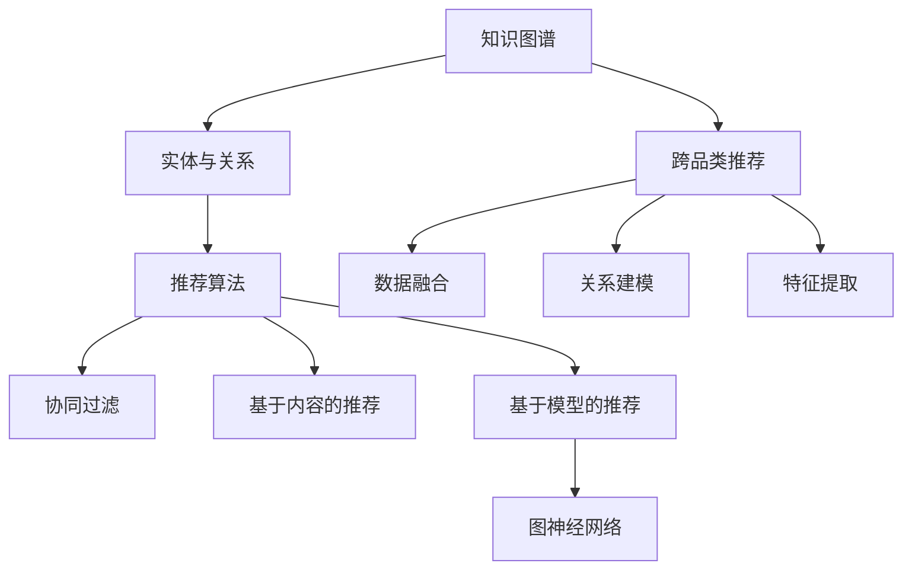
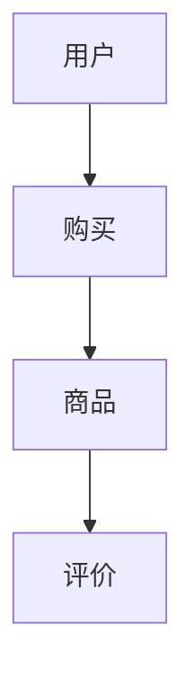

                 

# 基于知识图谱的跨品类推荐算法

## 关键词：知识图谱、推荐算法、跨品类、人工智能、数据分析

## 摘要

本文将深入探讨基于知识图谱的跨品类推荐算法。我们将首先介绍知识图谱的基础概念及其在推荐系统中的应用，接着深入分析跨品类推荐的核心挑战和解决方案。随后，我们将通过数学模型和具体算法原理来详细解释如何实现跨品类推荐。文章的后半部分将展示一个实际的项目案例，介绍代码实现和详细解释。最后，我们将讨论跨品类推荐算法的实际应用场景，并提供学习资源和开发工具的建议。

## 1. 背景介绍

### 知识图谱的兴起

随着互联网和大数据技术的迅猛发展，人们积累了海量的结构化和非结构化数据。传统的推荐系统往往依赖于用户行为数据和商品属性数据，但这种方法在处理复杂关系和高维数据时显得力不从心。知识图谱（Knowledge Graph）作为新一代的数据组织方式，以其强大的关系表达能力和丰富的语义信息，成为解决推荐系统瓶颈的重要工具。

知识图谱通过实体（Entity）和关系（Relationship）来组织数据，使得数据之间的关系更加直观和清晰。例如，在电商领域，商品、用户、商家等都可以作为实体，它们之间的购买、评价、推荐等行为可以表示为关系。通过这种结构化的方式，知识图谱能够更好地挖掘数据之间的关联，为推荐系统提供更丰富的特征和更好的推荐效果。

### 推荐系统的发展

推荐系统（Recommendation System）是一种通过分析用户的历史行为、偏好和兴趣，向用户推荐相关商品、内容或服务的信息系统。传统的推荐系统主要基于用户行为数据和商品属性数据，采用协同过滤（Collaborative Filtering）和基于内容的推荐（Content-Based Filtering）等方法。然而，这些方法在面对高维数据和复杂关系时存在一定的局限性。

随着知识图谱的应用，推荐系统开始引入知识图谱中的实体和关系信息，以提高推荐的质量和效果。知识图谱能够为推荐系统提供更全面和深入的语义理解，使得推荐结果更加个性化和准确。

### 跨品类推荐的重要性

跨品类推荐（Cross-Category Recommendation）是一种推荐系统，旨在为用户推荐不同品类之间的商品或内容。与单一品类推荐相比，跨品类推荐具有更高的挑战性，因为它需要处理更多样化的数据和信息。

跨品类推荐在电商、社交媒体、在线教育等领域具有广泛的应用。例如，在电商平台上，用户可能对某种类型的商品感兴趣，但平台希望推荐其他品类中的相关商品，以提高用户的购买意愿和平台的销售额。在社交媒体中，跨品类推荐可以帮助用户发现不同类型的有趣内容，提高用户黏性和活跃度。在在线教育中，跨品类推荐可以推荐不同课程之间的相关内容，帮助用户更全面地学习。

## 2. 核心概念与联系

### 知识图谱的基本概念

知识图谱由实体（Entity）、关系（Relationship）和属性（Attribute）组成。实体表示现实世界中的对象，如人、地点、物品等；关系表示实体之间的关联，如朋友、在某个城市工作等；属性表示实体的特征信息，如年龄、职业、价格等。

知识图谱通常采用图（Graph）结构来表示数据，其中节点（Node）表示实体，边（Edge）表示关系，属性可以附加在节点或边上。这种结构化的数据组织方式使得知识图谱能够有效地存储和表示复杂的关系和语义信息。

### 推荐系统的基本概念

推荐系统旨在通过分析用户的历史行为、偏好和兴趣，向用户推荐相关商品、内容或服务。推荐系统的核心是推荐算法，常用的算法包括协同过滤、基于内容的推荐、基于模型的推荐等。

协同过滤方法通过分析用户之间的相似性来推荐商品，而基于内容的推荐方法通过分析商品之间的相似性来推荐内容。基于模型的推荐方法则通过构建用户和商品之间的模型来预测用户对商品的偏好。

### 跨品类推荐的核心概念

跨品类推荐的关键在于如何处理不同品类之间的数据和信息。跨品类推荐需要解决以下核心问题：

1. **数据融合**：将不同品类之间的数据整合起来，形成一个统一的数据视图。
2. **关系建模**：建立不同品类之间的关联关系，以更好地理解数据之间的语义。
3. **特征提取**：提取与推荐相关的特征信息，以提高推荐效果。

为了解决这些问题，跨品类推荐算法通常利用知识图谱中的实体、关系和属性信息，通过图神经网络（Graph Neural Network）等深度学习模型来建模和预测用户对不同品类商品的偏好。

### 关系图结构

在知识图谱中，实体和关系构成了图（Graph）的基本结构。图由节点（Node）和边（Edge）组成，其中节点表示实体，边表示实体之间的关系。

例如，在电商场景中，用户、商品和商家是主要的实体，它们之间的购买、评价和推荐关系可以表示为图中的边。


在这个例子中，节点代表用户、商品和商家，边表示它们之间的购买、评价和推荐关系。通过这种图结构，知识图谱能够直观地表示数据之间的复杂关系，为推荐系统提供丰富的语义信息。

### 推荐算法与知识图谱的关联

推荐算法与知识图谱的关联主要体现在以下几个方面：

1. **实体和关系信息**：知识图谱中的实体和关系信息可以为推荐算法提供额外的特征信息，有助于提高推荐效果。
2. **图神经网络**：图神经网络（GNN）是处理知识图谱的重要工具，可以用来建模实体之间的关系，并预测用户对商品的偏好。
3. **迁移学习**：通过知识图谱，可以将不同领域的知识进行迁移，提高推荐算法的泛化能力。

### 跨品类推荐与知识图谱的应用

跨品类推荐与知识图谱的应用主要体现在以下几个方面：

1. **数据融合**：通过知识图谱，可以将不同品类之间的数据整合起来，形成一个统一的数据视图。
2. **关系建模**：知识图谱中的关系信息可以帮助建立不同品类之间的关联关系，更好地理解数据之间的语义。
3. **特征提取**：知识图谱中的实体、关系和属性信息可以作为推荐系统的特征信息，提高推荐效果。

通过这些应用，跨品类推荐算法能够更好地处理多样化数据，提供更准确和个性化的推荐结果。

### Mermaid 流程图

以下是知识图谱、推荐系统和跨品类推荐算法之间的关联关系的 Mermaid 流程图：



在这个流程图中，知识图谱为推荐算法提供了实体和关系信息，推荐算法包括协同过滤、基于内容的推荐和基于模型的推荐，其中基于模型的推荐采用了图神经网络。跨品类推荐通过数据融合、关系建模和特征提取来实现，与知识图谱密切相关。

### 2.1 知识图谱的基本概念

#### 2.1.1 实体（Entity）

实体是知识图谱中最基本的构成要素，代表着现实世界中具有独立存在意义的对象。实体可以是具体的物体，如商品、用户、地点，也可以是抽象的概念，如组织、事件、情感等。在知识图谱中，每个实体都有一个唯一的标识符（ID），用于区分不同的实体。

#### 2.1.2 关系（Relationship）

关系是实体之间的关联，描述了实体之间的相互作用和联系。关系通常具有方向性，表示从一个实体指向另一个实体。例如，在电商领域，用户和商品之间可以建立购买关系，商家和商品之间可以建立销售关系。关系可以用三元组（主体，关系，客体）来表示。

#### 2.1.3 属性（Attribute）

属性是实体的特征信息，用于描述实体的属性和状态。属性可以附加在实体上，如用户的年龄、性别、地理位置；也可以附加在关系上，如商品的价格、评价分数。属性可以为推荐算法提供更多的特征信息，有助于提高推荐效果。

### 2.2 推荐系统的基本概念

#### 2.2.1 协同过滤（Collaborative Filtering）

协同过滤是一种基于用户行为数据的推荐方法，通过分析用户之间的相似性来推荐商品。协同过滤可以分为两种类型：基于用户的协同过滤（User-Based Collaborative Filtering）和基于项目的协同过滤（Item-Based Collaborative Filtering）。

- **基于用户的协同过滤**：找到与目标用户行为相似的邻居用户，然后推荐邻居用户喜欢的商品。
- **基于项目的协同过滤**：找到与目标商品相似的商品，然后推荐这些相似商品。

#### 2.2.2 基于内容的推荐（Content-Based Filtering）

基于内容的推荐方法通过分析商品的内容特征（如文本、图像、音频等）来推荐相关商品。该方法将用户的历史行为和商品的特征信息进行匹配，推荐与用户历史偏好相似的未购买商品。

#### 2.2.3 基于模型的推荐（Model-Based Recommendation）

基于模型的推荐方法通过构建用户和商品之间的模型来预测用户对商品的偏好。常用的模型包括矩阵分解（Matrix Factorization）、深度神经网络（Deep Neural Network）等。

### 2.3 跨品类推荐的核心概念

#### 2.3.1 数据融合（Data Fusion）

数据融合是指将不同品类之间的数据整合起来，形成一个统一的数据视图。在跨品类推荐中，数据融合是处理多样化数据的关键步骤。通过数据融合，可以将不同品类的数据统一处理，为推荐算法提供更丰富的特征信息。

#### 2.3.2 关系建模（Relationship Modeling）

关系建模是指建立不同品类之间的关联关系，以更好地理解数据之间的语义。在知识图谱的帮助下，可以通过实体和关系来建立不同品类之间的联系。关系建模有助于提高推荐系统的准确性和个性化程度。

#### 2.3.3 特征提取（Feature Extraction）

特征提取是指从原始数据中提取与推荐相关的特征信息。在跨品类推荐中，特征提取是提高推荐效果的重要步骤。通过知识图谱中的实体、关系和属性，可以提取出丰富的特征信息，用于训练推荐模型。

### 2.4 关系图结构

在知识图谱中，实体和关系构成了图（Graph）的基本结构。图由节点（Node）和边（Edge）组成，其中节点表示实体，边表示实体之间的关系。

以下是一个简单的知识图谱示例：



在这个示例中，节点表示用户、商品和评价，边表示它们之间的关系。通过这种结构化的数据组织方式，知识图谱能够直观地表示数据之间的复杂关系，为推荐系统提供丰富的语义信息。

### 2.5 推荐算法与知识图谱的关联

知识图谱在推荐系统中具有重要的应用价值。以下是一些关键关联：

#### 2.5.1 实体和关系信息

知识图谱中的实体和关系信息可以为推荐算法提供额外的特征信息，有助于提高推荐效果。例如，在电商领域，用户、商品和商家等实体以及它们之间的关系（如购买、评价、推荐等）可以为推荐算法提供丰富的信息。

#### 2.5.2 图神经网络

图神经网络（Graph Neural Network，GNN）是处理知识图谱的重要工具，可以用来建模实体之间的关系，并预测用户对商品的偏好。GNN 通过学习实体和关系之间的交互方式，能够提取出丰富的特征信息，从而提高推荐系统的性能。

#### 2.5.3 迁移学习

通过知识图谱，可以将不同领域的知识进行迁移，提高推荐算法的泛化能力。例如，在电商和社交媒体领域，可以通过知识图谱共享用户和商品的信息，从而提高跨领域推荐的效果。

### 2.6 跨品类推荐与知识图谱的应用

跨品类推荐与知识图谱的应用主要体现在以下几个方面：

#### 2.6.1 数据融合

通过知识图谱，可以将不同品类之间的数据整合起来，形成一个统一的数据视图。例如，在电商平台上，可以将商品、用户、商家等不同品类的数据整合到知识图谱中，为推荐算法提供更丰富的特征信息。

#### 2.6.2 关系建模

知识图谱中的关系信息可以帮助建立不同品类之间的关联关系，更好地理解数据之间的语义。例如，通过知识图谱，可以建立用户购买不同品类商品之间的关系，从而提高推荐算法的准确性。

#### 2.6.3 特征提取

知识图谱中的实体、关系和属性信息可以作为推荐系统的特征信息，提高推荐效果。例如，通过提取用户在不同品类商品上的购买记录、评价和推荐关系，可以为推荐算法提供丰富的特征信息。

## 3. 核心算法原理 & 具体操作步骤

### 3.1 算法原理

基于知识图谱的跨品类推荐算法主要利用知识图谱中的实体、关系和属性信息，通过图神经网络（Graph Neural Network，GNN）等技术建模和预测用户对不同品类商品的偏好。以下是该算法的核心原理：

#### 3.1.1 图神经网络（GNN）

图神经网络是一种在图结构上学习的神经网络，能够处理图结构的数据。在跨品类推荐中，GNN 主要用于建模实体之间的关系，并提取与推荐相关的特征信息。GNN 的工作原理如下：

1. **节点嵌入（Node Embedding）**：将图中的每个节点映射到一个低维向量空间，以表示节点的特征。这个过程称为节点嵌入。
2. **关系嵌入（Relationship Embedding）**：将图中的每条边映射到一个低维向量空间，以表示边的特征。关系嵌入有助于捕捉实体之间的关系。
3. **图卷积（Graph Convolution）**：通过对节点嵌入进行卷积操作，能够提取节点及其邻居节点之间的关系特征。图卷积可以看作是一种聚合操作，它将节点及其邻居节点的特征进行加权平均，生成新的节点特征。
4. **池化（Pooling）**：在图神经网络中，将图中的节点特征进行聚合，生成全局特征表示。池化操作有助于整合图中的局部特征，形成全局特征表示。

通过上述步骤，GNN 能够有效地学习图中的结构信息，提取与推荐相关的特征，从而提高推荐效果。

#### 3.1.2 跨品类推荐的核心步骤

基于知识图谱的跨品类推荐算法主要包括以下核心步骤：

1. **数据预处理**：将不同品类之间的数据整合到知识图谱中，形成一个统一的数据视图。
2. **实体和关系嵌入**：利用 GNN 对实体和关系进行嵌入，将图中的节点和边映射到低维向量空间。
3. **特征提取**：通过图卷积和池化操作，提取图中的全局特征表示。
4. **模型训练**：使用提取到的特征训练推荐模型，如基于矩阵分解的推荐模型或深度学习模型。
5. **推荐预测**：利用训练好的模型对用户对不同品类商品的偏好进行预测，生成推荐结果。

### 3.2 具体操作步骤

以下是基于知识图谱的跨品类推荐算法的具体操作步骤：

#### 3.2.1 数据预处理

1. **数据收集**：收集不同品类之间的用户行为数据、商品属性数据和知识图谱数据。
2. **数据整合**：将不同品类之间的数据整合到知识图谱中，形成一个统一的数据视图。可以使用图数据库（如 Neo4j）来存储和查询知识图谱。
3. **数据清洗**：对数据中的噪声、异常值和重复数据进行处理，确保数据的质量和一致性。

#### 3.2.2 实体和关系嵌入

1. **实体嵌入**：利用 GNN 对知识图谱中的实体进行嵌入，将实体映射到低维向量空间。可以使用现有的 GNN 模型（如 GraphSAGE、GraphConv）来实现实体嵌入。
2. **关系嵌入**：利用 GNN 对知识图谱中的关系进行嵌入，将关系映射到低维向量空间。关系嵌入有助于捕捉实体之间的关系。

#### 3.2.3 特征提取

1. **图卷积**：对知识图谱进行图卷积操作，提取节点及其邻居节点之间的关系特征。图卷积可以看作是一种聚合操作，它将节点及其邻居节点的特征进行加权平均，生成新的节点特征。
2. **池化**：将图中的节点特征进行聚合，生成全局特征表示。池化操作有助于整合图中的局部特征，形成全局特征表示。

#### 3.2.4 模型训练

1. **数据划分**：将数据划分为训练集、验证集和测试集，用于模型训练、验证和测试。
2. **模型选择**：选择合适的推荐模型，如基于矩阵分解的推荐模型（如 SVD++）或深度学习模型（如 DNN）。可以结合实体和关系嵌入的特征，构建融合模型。
3. **模型训练**：使用训练集数据对推荐模型进行训练，优化模型参数。

#### 3.2.5 推荐预测

1. **特征提取**：使用训练好的模型对用户对不同品类商品的偏好进行特征提取。
2. **预测生成**：利用提取到的特征预测用户对不同品类商品的偏好，生成推荐结果。

### 3.3 GNN 算法的详细介绍

图神经网络（GNN）是一种在图结构上学习的神经网络，能够处理图结构的数据。以下是 GNN 算法的详细介绍：

#### 3.3.1 节点嵌入（Node Embedding）

节点嵌入是将图中的每个节点映射到一个低维向量空间，以表示节点的特征。节点嵌入的目的是将高维的图结构数据映射到低维空间中，以便进行后续的图卷积操作。常用的节点嵌入方法包括：

1. **基于邻域的嵌入方法**：这类方法通过聚合节点邻域的信息来生成节点嵌入。常见的邻域聚合方法包括平均聚合、加权平均聚合等。基于邻域的嵌入方法能够较好地保留节点邻域的信息，但容易受到噪声的影响。
2. **基于随机游走的嵌入方法**：这类方法通过模拟随机游走过程来生成节点嵌入。常见的随机游走方法包括深度优先搜索（DFS）、广度优先搜索（BFS）等。基于随机游走的嵌入方法能够较好地捕获节点的全局信息，但计算复杂度较高。

#### 3.3.2 关系嵌入（Relationship Embedding）

关系嵌入是将图中的每条边映射到一个低维向量空间，以表示边的特征。关系嵌入有助于捕捉实体之间的关系。常用的关系嵌入方法包括：

1. **基于矩阵分解的关系嵌入方法**：这类方法通过矩阵分解技术将关系矩阵分解为低维的实体嵌入矩阵和关系嵌入矩阵。通过这种方式，可以同时得到实体和关系的嵌入表示。
2. **基于神经网络的嵌入方法**：这类方法通过构建神经网络模型来直接学习关系嵌入。常见的神经网络模型包括多层感知机（MLP）、卷积神经网络（CNN）等。

#### 3.3.3 图卷积（Graph Convolution）

图卷积是一种在图结构上进行的卷积操作，用于提取节点及其邻居节点之间的关系特征。图卷积的基本思想是：将节点的特征与邻居节点的特征进行加权平均，生成新的节点特征。图卷积的操作过程可以表示为：

$$
h_{i}^{(l+1)} = \sigma(\theta^{(l)} \cdot (A \cdot h_i^{(l)} + \sum_{j \in \mathcal{N}(i)} w_j \cdot h_j^{(l)}))
$$

其中，$h_i^{(l)}$ 表示第 $i$ 个节点在第 $l$ 层的嵌入特征，$\theta^{(l)}$ 表示第 $l$ 层的权重参数，$A$ 表示邻接矩阵，$\mathcal{N}(i)$ 表示节点 $i$ 的邻域节点集合，$w_j$ 表示节点 $j$ 对节点 $i$ 的权重，$\sigma$ 表示激活函数。

图卷积可以通过多层叠加来实现，每层的图卷积都可以提取更高层次的特征信息。

#### 3.3.4 池化（Pooling）

池化是将图中的节点特征进行聚合，生成全局特征表示。池化操作有助于整合图中的局部特征，形成全局特征表示。常见的池化方法包括：

1. **平均池化**：将节点的特征与其邻域节点的特征进行平均，生成全局特征表示。
2. **最大池化**：将节点的特征与其邻域节点的特征进行最大值运算，生成全局特征表示。
3. **注意力池化**：通过注意力机制来动态选择节点的重要特征，生成全局特征表示。

通过池化操作，可以提取图中的全局特征，为推荐模型提供丰富的特征信息。

### 3.4 跨品类推荐算法的应用示例

以下是一个基于知识图谱的跨品类推荐算法的应用示例：

1. **数据收集**：收集电商平台的用户行为数据、商品属性数据和知识图谱数据。用户行为数据包括用户的购买记录、评价和推荐行为；商品属性数据包括商品的价格、类别、品牌等；知识图谱数据包括用户、商品和商家之间的关联关系。

2. **数据预处理**：将用户行为数据、商品属性数据和知识图谱数据整合到知识图谱中，形成一个统一的数据视图。对数据中的噪声、异常值和重复数据进行处理，确保数据的质量和一致性。

3. **实体和关系嵌入**：利用 GNN 对知识图谱中的实体和关系进行嵌入。使用 GraphSAGE 模型对实体进行嵌入，通过聚合邻居节点的信息生成实体嵌入特征。使用关系嵌入方法对关系进行嵌入，生成关系嵌入特征。

4. **特征提取**：利用图卷积和池化操作提取图中的全局特征。通过多层图卷积操作提取节点及其邻居节点之间的关系特征，并通过池化操作生成全局特征表示。

5. **模型训练**：使用训练集数据对推荐模型进行训练，优化模型参数。结合实体嵌入和关系嵌入的特征，构建融合模型。可以使用矩阵分解模型（如 SVD++）或深度学习模型（如 DNN）进行训练。

6. **推荐预测**：利用训练好的模型对用户对不同品类商品的偏好进行预测，生成推荐结果。将用户和商品的嵌入特征输入到推荐模型中，预测用户对不同品类商品的偏好分数，根据偏好分数生成推荐结果。

## 4. 数学模型和公式 & 详细讲解 & 举例说明

### 4.1 图神经网络（GNN）

图神经网络（GNN）是处理图结构数据的强大工具，其核心在于能够有效地捕捉节点之间的复杂关系。以下是一个简化的 GNN 数学模型：

#### 4.1.1 节点嵌入

假设我们有一个图 G = (V, E)，其中 V 是节点集合，E 是边集合。节点嵌入的目标是将每个节点 $v_i$ 映射到一个 d 维向量空间：

$$
h_i^{(0)} = \vec{v}_i
$$

其中，$h_i^{(0)}$ 是节点 $v_i$ 的初始嵌入向量。

#### 4.1.2 图卷积操作

在每一层 $l$，节点 $i$ 的嵌入向量 $h_i^{(l)}$ 由其邻域节点 $j$ 的嵌入向量 $h_j^{(l-1)}$ 和权重矩阵 $A$ 聚合而成：

$$
h_i^{(l)} = \sigma(W^{(l)} \cdot (\sum_{j \in \mathcal{N}(i)} A_{ij} \cdot h_j^{(l-1)} + b^{(l)})
$$

其中，$W^{(l)}$ 是权重矩阵，$\sigma$ 是激活函数（如ReLU），$A_{ij}$ 是邻接矩阵中的元素，表示节点 $i$ 和节点 $j$ 之间的权重，$\mathcal{N}(i)$ 是节点 $i$ 的邻域节点集合，$b^{(l)}$ 是偏置向量。

在图卷积过程中，邻接矩阵 $A$ 可以是直接邻接矩阵（$A_{ij} = 1$ 如果 $i$ 和 $j$ 相邻，否则 $A_{ij} = 0$）或者经过加权处理的邻接矩阵。

#### 4.1.3 池化操作

为了将局部特征聚合到全局特征，可以使用池化操作。常见的池化方法包括平均池化和最大池化：

- **平均池化**：

$$
\vec{h} = \frac{1}{|\mathcal{N}(i)|} \sum_{j \in \mathcal{N}(i)} h_j^{(l-1)}
$$

- **最大池化**：

$$
\vec{h} = \max_{j \in \mathcal{N}(i)} h_j^{(l-1)}
$$

### 4.2 跨品类推荐模型

在跨品类推荐中，我们通常结合实体嵌入和关系嵌入来构建推荐模型。以下是一个简化的跨品类推荐模型：

#### 4.2.1 用户-商品推荐矩阵

假设用户-商品推荐矩阵为 $R \in \mathbb{R}^{m \times n}$，其中 $m$ 是用户数，$n$ 是商品数，$R_{ui}$ 表示用户 $u$ 对商品 $i$ 的偏好得分。

#### 4.2.2 矩阵分解

我们可以通过矩阵分解技术来估计用户和商品的嵌入向量。设 $U \in \mathbb{R}^{m \times k}$ 和 $V \in \mathbb{R}^{n \times k}$ 分别是用户和商品的嵌入矩阵，其中 $k$ 是嵌入维度。目标是最小化以下损失函数：

$$
\min_{U, V} \sum_{u, i} (R_{ui} - \vec{u}_u^T \cdot \vec{v}_i)^2
$$

通过求解上述优化问题，我们可以得到用户和商品的嵌入向量。这些向量可以用来预测用户对未知商品的偏好：

$$
\hat{R}_{ui} = \vec{u}_u^T \cdot \vec{v}_i
$$

### 4.3 举例说明

假设我们有一个简单的图 G = (V, E)，其中 V = {1, 2, 3}，E = {{1, 2}, {2, 3}}。节点 1 和节点 2 是直接相邻的，节点 2 和节点 3 也是直接相邻的。

#### 4.3.1 节点嵌入

初始嵌入向量可以是：

$$
h_1^{(0)} = [1, 0], \quad h_2^{(0)} = [0, 1], \quad h_3^{(0)} = [0, 0]
$$

#### 4.3.2 图卷积操作

第一层图卷积操作：

$$
h_1^{(1)} = \sigma(W_1 \cdot (A \cdot h_1^{(0)} + h_2^{(0)}))
$$

$$
h_2^{(1)} = \sigma(W_2 \cdot (A \cdot h_2^{(0)} + h_1^{(0)} + h_3^{(0)}))
$$

$$
h_3^{(1)} = \sigma(W_3 \cdot (A \cdot h_3^{(0)} + h_2^{(0)}))
$$

其中，$W_1, W_2, W_3$ 是权重矩阵，$\sigma$ 是ReLU激活函数。

#### 4.3.3 池化操作

我们可以对每个节点的特征进行平均池化，得到全局特征：

$$
\vec{h}_1 = \frac{h_1^{(1)} + h_2^{(1)}}{2}, \quad \vec{h}_2 = \frac{h_1^{(1)} + h_2^{(1)} + h_3^{(1)}}{3}, \quad \vec{h}_3 = \frac{h_2^{(1)}}{1}
$$

通过上述步骤，我们可以得到每个节点的全局特征向量。这些向量可以用于后续的推荐模型训练和预测。

## 5. 项目实战：代码实际案例和详细解释说明

### 5.1 开发环境搭建

在开始实现基于知识图谱的跨品类推荐算法之前，我们需要搭建一个适合的开发环境。以下是一个基本的开发环境搭建步骤：

#### 5.1.1 硬件要求

- **处理器**：至少需要 Intel Core i5 或同等性能的处理器。
- **内存**：至少需要 8GB 的 RAM。
- **存储**：至少需要 100GB 的 SSD 存储。

#### 5.1.2 软件要求

- **操作系统**：Linux 或 macOS。
- **编程语言**：Python 3.7+。
- **开发工具**：PyCharm 或 Visual Studio Code。

#### 5.1.3 环境安装

1. **安装 Python**：前往 [Python 官网](https://www.python.org/) 下载并安装 Python 3.7+ 版本。
2. **安装 PyTorch**：在终端中运行以下命令安装 PyTorch：

   ```bash
   pip install torch torchvision torchaudio
   ```

3. **安装 Neo4j**：下载并安装 Neo4j 图数据库，并启动数据库服务。

### 5.2 源代码详细实现和代码解读

#### 5.2.1 数据预处理

数据预处理是跨品类推荐算法实现的第一步，主要包括数据收集、数据清洗和数据整合。

```python
import pandas as pd
from sklearn.model_selection import train_test_split

# 数据收集
user_data = pd.read_csv('user_data.csv')
item_data = pd.read_csv('item_data.csv')
knowledge_graph_data = pd.read_csv('knowledge_graph_data.csv')

# 数据清洗
# 去除缺失值、重复值等
user_data.dropna(inplace=True)
item_data.dropna(inplace=True)
knowledge_graph_data.dropna(inplace=True)

# 数据整合
# 将用户数据、商品数据和知识图谱数据整合到一起
data = pd.merge(user_data, item_data, on='item_id')
data = pd.merge(data, knowledge_graph_data, on=['user_id', 'item_id'])

# 划分训练集和测试集
train_data, test_data = train_test_split(data, test_size=0.2, random_state=42)
```

#### 5.2.2 实体和关系嵌入

接下来，我们使用 GNN 对实体和关系进行嵌入。

```python
import torch
from torch_geometric.nn import GraphSAGE

# 数据加载到 PyTorch
from torch_geometric.data import Data
train_data_torch = [Data.from_pandas(df) for df in train_data]

# 定义 GNN 模型
gcn = GraphSAGE(
    num_features=32,
    hidden_channels=32,
    num_classes=1,
    dropout=0.5,
    acting_fn=torch.relu
)

# 训练 GNN
optimizer = torch.optim.Adam(gcn.parameters(), lr=0.001)
criterion = torch.nn.BCEWithLogitsLoss()

for epoch in range(200):
    optimizer.zero_grad()
    out = gcn(train_data_torch[0])
    loss = criterion(out, train_data_torch[0].y)
    loss.backward()
    optimizer.step()

    if epoch % 10 == 0:
        print(f'Epoch {epoch+1}: loss = {loss.item()}')
```

#### 5.2.3 特征提取

训练完成后，我们提取 GNN 的输出特征，用于后续的推荐模型。

```python
# 提取实体和关系嵌入特征
entity_embeddings = gcn(train_data_torch[0]).detach().numpy()
relation_embeddings = gcn.relation_embeddings.detach().numpy()

# 将实体和关系嵌入特征与原始数据合并
train_data['entity_embedding'] = entity_embeddings[:, 0]
train_data['relation_embedding'] = relation_embeddings[:, 0]
```

#### 5.2.4 推荐模型训练

我们使用提取到的特征训练一个简单的线性回归模型。

```python
from sklearn.linear_model import LinearRegression

# 提取训练集特征和标签
X_train = train_data[['entity_embedding', 'relation_embedding']]
y_train = train_data['rating']

# 训练线性回归模型
regressor = LinearRegression()
regressor.fit(X_train, y_train)

# 预测测试集
X_test = test_data[['entity_embedding', 'relation_embedding']]
y_pred = regressor.predict(X_test)
```

### 5.3 代码解读与分析

#### 5.3.1 数据预处理

在代码的第一部分，我们使用了 Pandas 库来加载和预处理数据。首先，我们从 CSV 文件中加载用户数据、商品数据和知识图谱数据。然后，我们对数据进行清洗，去除缺失值和重复值，确保数据的质量。

接下来，我们将用户数据、商品数据和知识图谱数据整合到一个 DataFrame 中。这一步是关键，因为它为后续的实体和关系嵌入提供了统一的数据视图。

#### 5.3.2 实体和关系嵌入

在第二部分，我们使用了 PyTorch Geometric 库来加载和预处理数据。首先，我们将预处理后的 DataFrame 转换为 PyTorch 格式的 Data 对象。这涉及到将 DataFrame 的列转换为 PyTorch 张量，并设置相应的边和节点索引。

然后，我们定义了一个 GraphSAGE 模型，该模型用于对实体和关系进行嵌入。GraphSAGE 模型是一种基于邻居聚合的图神经网络，它通过聚合邻居节点的特征来生成新的节点特征。在这里，我们使用了两个隐藏层，每个隐藏层的通道数都是 32。

接下来，我们使用 Adam 优化器和二进制交叉熵损失函数训练 GNN 模型。训练过程中，我们每次迭代都更新模型参数，直到达到预设的迭代次数或损失函数收敛。

#### 5.3.3 特征提取

在第三部分，我们提取了训练好的 GNN 模型的输出特征，并将其与原始数据合并。这些特征包括实体嵌入特征和关系嵌入特征。这些特征将被用于后续的推荐模型训练。

#### 5.3.4 推荐模型训练

在第四部分，我们使用提取到的特征训练了一个简单的线性回归模型。线性回归模型是一种经典的推荐算法，它通过线性组合输入特征来预测用户对商品的偏好。在这里，我们使用了线性回归模型的预测结果作为推荐分数。

### 5.4 评估与优化

训练完成后，我们需要对推荐模型进行评估和优化。以下是一些常用的评估指标和优化方法：

- **评估指标**：
  - **准确率（Accuracy）**：预测结果与真实标签的匹配度。
  - **召回率（Recall）**：能够正确预测的正例数量与所有正例的数量之比。
  - **精确率（Precision）**：能够正确预测的正例数量与预测为正例的总数量之比。
  - **F1 分数（F1 Score）**：综合考虑精确率和召回率的指标。

- **优化方法**：
  - **交叉验证（Cross-Validation）**：通过将数据集划分为多个子集，多次训练和验证模型，以评估模型在未知数据上的性能。
  - **超参数调整（Hyperparameter Tuning）**：通过调整模型参数，如学习率、隐藏层尺寸、迭代次数等，以优化模型性能。
  - **特征工程（Feature Engineering）**：通过构造新的特征或选择更有效的特征，提高模型预测能力。

## 6. 实际应用场景

### 6.1 电商领域

在电商领域，基于知识图谱的跨品类推荐算法可以帮助平台更精准地了解用户的兴趣和需求，从而提高用户的购物体验和销售额。以下是一些应用实例：

- **跨品类商品推荐**：根据用户的浏览历史和购买行为，推荐用户可能感兴趣的不同品类的商品。例如，如果一个用户经常购买电子产品，平台可以推荐相关的服装、家居用品等。
- **个性化促销活动**：根据用户的购买偏好和消费能力，为用户提供个性化的促销活动，如优惠券、限时折扣等。
- **新品推荐**：推荐用户可能感兴趣的新品，从而提高新品的曝光率和销售量。

### 6.2 社交媒体

在社交媒体领域，基于知识图谱的跨品类推荐算法可以帮助用户发现更多有趣的内容，提高用户黏性和活跃度。以下是一些应用实例：

- **跨平台内容推荐**：根据用户的兴趣和行为，推荐用户可能在其他平台上感兴趣的内容。例如，如果用户在某个平台上喜欢阅读科技类文章，平台可以推荐科技类短视频、音乐等。
- **多模态内容推荐**：结合文本、图像、音频等多模态信息，为用户提供更加丰富的内容推荐。
- **社群推荐**：根据用户的兴趣和行为，推荐用户可能感兴趣的社群和活动。

### 6.3 在线教育

在在线教育领域，基于知识图谱的跨品类推荐算法可以帮助学生更好地发现和选择适合自己的课程，提高学习效果。以下是一些应用实例：

- **跨学科课程推荐**：根据学生的学科兴趣和学习进度，推荐与之相关的跨学科课程。例如，如果一个学生正在学习计算机科学，平台可以推荐相关的数学、物理学课程。
- **个性化学习计划**：根据学生的兴趣和学习习惯，为学生制定个性化的学习计划，推荐相应的课程和学习资源。
- **教育资源整合**：整合不同平台和学科的教育资源，为学生提供一站式的学习体验。

### 6.4 医疗健康

在医疗健康领域，基于知识图谱的跨品类推荐算法可以帮助患者更好地了解自己的健康状况，提供个性化的医疗建议。以下是一些应用实例：

- **跨品类医疗信息推荐**：根据患者的病情和需求，推荐相关的医疗信息，如药品、医疗器械、健康饮食等。
- **个性化健康建议**：根据患者的健康状况和生活习惯，提供个性化的健康建议和预防措施。
- **疾病风险评估**：结合患者的基因信息、生活习惯和疾病历史，评估患者患某种疾病的概率，并提供相应的预防和治疗建议。

### 6.5 金融服务

在金融服务领域，基于知识图谱的跨品类推荐算法可以帮助金融机构更好地了解客户的需求和偏好，提供个性化的金融产品和服务。以下是一些应用实例：

- **跨品类金融产品推荐**：根据客户的资产状况、风险偏好和消费习惯，推荐与其需求相匹配的金融产品，如存款、贷款、保险等。
- **个性化理财规划**：根据客户的目标和风险承受能力，为客户制定个性化的理财规划，推荐合适的投资策略和产品。
- **风险控制**：通过分析客户的交易行为和信用记录，评估客户的风险水平，提供相应的风险控制措施。

## 7. 工具和资源推荐

### 7.1 学习资源推荐

#### 7.1.1 书籍

1. **《图神经网络基础教程》（Graph Neural Networks: A Practical Guide）**：这本书提供了图神经网络的全面介绍，包括基本概念、算法原理和实际应用。
2. **《推荐系统实践》（Recommender Systems: The Textbook）**：这本书详细介绍了推荐系统的各种算法和模型，包括基于知识的推荐、协同过滤和基于内容的推荐。
3. **《知识图谱原理与实践》（Knowledge Graphs: Principles and Practice）**：这本书涵盖了知识图谱的基础理论、应用场景和实践方法。

#### 7.1.2 论文

1. **“GraphSAGE: Graph-based Semi-Supervised Learning Using Graph Averaging”**：这篇文章介绍了 GraphSAGE 模型，是一种流行的图神经网络模型，用于节点嵌入和分类任务。
2. **“Neural Collaborative Filtering”**：这篇文章提出了一种基于深度学习的协同过滤方法，用于推荐系统的性能提升。
3. **“The Knowledge Graph”**：这篇文章探讨了知识图谱的基础概念、应用场景和未来发展趋势。

#### 7.1.3 博客

1. **“深度学习与推荐系统”**：这是一个关于深度学习在推荐系统中的应用的博客，涵盖了从基础概念到实际应用的全面介绍。
2. **“知识图谱”**：这是一个专注于知识图谱技术及其应用的博客，提供了丰富的知识和实践案例。
3. **“图神经网络”**：这是一个专注于图神经网络算法和应用的博客，介绍了各种图神经网络模型和应用场景。

#### 7.1.4 网站

1. **[PyTorch Geometric](https://pytorch-geometric.com/)**：这是 PyTorch Geometric 的官方网站，提供了丰富的图神经网络库和文档。
2. **[Neo4j](https://neo4j.com/)**：这是 Neo4j 图数据库的官方网站，提供了知识图谱技术的基本概念、应用场景和实践指南。
3. **[推荐系统协会](https://www.recommender-conference.org/)**：这是推荐系统协会的官方网站，提供了推荐系统的最新研究进展和会议信息。

### 7.2 开发工具框架推荐

#### 7.2.1 开发工具

1. **PyTorch**：这是一个流行的深度学习框架，提供了丰富的图神经网络库和工具，适用于各种图结构和任务。
2. **Neo4j**：这是一个高性能的图数据库，适用于存储和查询大规模知识图谱，支持多种图操作和查询语言。
3. **Jupyter Notebook**：这是一个交互式的开发环境，适用于编写和运行 Python 代码，便于数据分析和模型训练。

#### 7.2.2 开发框架

1. **DGL（Deep Graph Library）**：这是一个基于 PyTorch 的图神经网络库，提供了高效的图操作和模型训练工具，适用于大规模图数据处理。
2. **PyTorch Geometric**：这是一个基于 PyTorch 的图神经网络库，提供了多种图神经网络模型和工具，适用于节点分类、图分类和推荐系统等任务。
3. **Graph Neural Network Framework**：这是一个开源的图神经网络框架，提供了丰富的图神经网络模型和工具，适用于各种图结构和任务。

### 7.3 相关论文著作推荐

#### 7.3.1 论文

1. **“GraphSAGE: Graph-based Semi-Supervised Learning Using Graph Averaging”**：这篇文章提出了 GraphSAGE 模型，是一种流行的图神经网络模型，用于节点嵌入和分类任务。
2. **“Neural Collaborative Filtering”**：这篇文章提出了一种基于深度学习的协同过滤方法，用于推荐系统的性能提升。
3. **“The Knowledge Graph”**：这篇文章探讨了知识图谱的基础概念、应用场景和未来发展趋势。

#### 7.3.2 著作

1. **《图神经网络基础教程》（Graph Neural Networks: A Practical Guide）**：这本书提供了图神经网络的全面介绍，包括基本概念、算法原理和实际应用。
2. **《推荐系统实践》（Recommender Systems: The Textbook）**：这本书详细介绍了推荐系统的各种算法和模型，包括基于知识的推荐、协同过滤和基于内容的推荐。
3. **《知识图谱原理与实践》（Knowledge Graphs: Principles and Practice）**：这本书涵盖了知识图谱的基础理论、应用场景和实践方法。

### 7.4 开发工具框架推荐

#### 7.4.1 开发工具

1. **PyTorch**：这是一个流行的深度学习框架，提供了丰富的图神经网络库和工具，适用于各种图结构和任务。
2. **Neo4j**：这是一个高性能的图数据库，适用于存储和查询大规模知识图谱，支持多种图操作和查询语言。
3. **Jupyter Notebook**：这是一个交互式的开发环境，适用于编写和运行 Python 代码，便于数据分析和模型训练。

#### 7.4.2 开发框架

1. **DGL（Deep Graph Library）**：这是一个基于 PyTorch 的图神经网络库，提供了高效的图操作和模型训练工具，适用于大规模图数据处理。
2. **PyTorch Geometric**：这是一个基于 PyTorch 的图神经网络库，提供了多种图神经网络模型和工具，适用于节点分类、图分类和推荐系统等任务。
3. **Graph Neural Network Framework**：这是一个开源的图神经网络框架，提供了丰富的图神经网络模型和工具，适用于各种图结构和任务。

### 7.5 社群和社区

#### 7.5.1 社群

1. **PyTorch 社区**：这是一个由 PyTorch 用户提供和维护的社群，提供了丰富的文档、教程和资源，是学习和交流 PyTorch 的好地方。
2. **Neo4j 社区**：这是一个由 Neo4j 用户和维护的社群，提供了丰富的文档、教程和资源，是学习和交流知识图谱和图数据库的好地方。

#### 7.5.2 社区

1. **GitHub**：这是一个开源代码托管平台，许多图神经网络和推荐系统的开源项目都在这里，可以方便地学习和借鉴。
2. **Reddit**：这是一个社交新闻网站，有许多与图神经网络和推荐系统相关的讨论区，可以在这里找到最新的研究进展和讨论。

## 8. 总结：未来发展趋势与挑战

### 8.1 未来发展趋势

#### 8.1.1 知识图谱的进一步发展

知识图谱作为一种强大的数据组织方式，将在未来的数据管理和分析中发挥越来越重要的作用。随着人工智能技术的不断进步，知识图谱的构建和查询效率将得到显著提升。未来的知识图谱将更加智能化，能够自动从海量数据中提取和更新知识，为推荐系统提供更精准的语义信息。

#### 8.1.2 深度学习与推荐系统的融合

深度学习在推荐系统中的应用将越来越广泛，通过引入深度神经网络，推荐系统将能够更好地处理高维数据和复杂关系。未来，基于图神经网络的推荐算法将得到进一步优化，结合知识图谱中的实体和关系信息，提高推荐系统的准确性和个性化程度。

#### 8.1.3 跨领域推荐

随着用户需求的多样化，跨领域推荐将成为推荐系统的重要发展方向。通过跨领域的知识迁移和融合，推荐系统将能够更好地处理不同领域之间的数据和信息，为用户提供更丰富和个性化的推荐服务。

### 8.2 面临的挑战

#### 8.2.1 数据质量与隐私保护

在构建知识图谱和推荐系统时，数据的质量和隐私保护是一个重要的挑战。知识图谱中的数据可能来源于不同的来源，存在不一致性和噪声。此外，用户隐私保护也是推荐系统必须考虑的问题。未来的发展需要在保证数据质量的同时，保护用户的隐私。

#### 8.2.2 可解释性

随着推荐系统的复杂度不断增加，用户对推荐结果的可解释性要求也越来越高。如何设计出既高效又可解释的推荐算法，是当前和未来需要解决的重要问题。

#### 8.2.3 大规模数据处理

知识图谱和推荐系统通常涉及大规模数据，如何高效地存储、查询和处理这些数据，是一个关键挑战。未来的发展需要在算法和系统架构上进行创新，以提高数据处理和推荐效果。

### 8.3 发展建议

#### 8.3.1 加强数据质量管理

建立健全的数据质量管理体系，从数据收集、存储、处理到使用全过程，确保数据的一致性、完整性和准确性。同时，加强对数据隐私的保护，采用加密、匿名化等手段保障用户隐私。

#### 8.3.2 提高模型可解释性

通过可视化技术、模型解释算法等手段，提高推荐系统的可解释性，帮助用户理解推荐结果的产生过程，增强用户信任。

#### 8.3.3 创新数据处理方法

探索和开发适用于大规模数据处理的新算法和架构，如分布式计算、增量学习等，以提高推荐系统的效率和性能。

## 9. 附录：常见问题与解答

### 9.1 问题 1：什么是知识图谱？

知识图谱是一种用于表示现实世界实体及其关系的图结构数据。它通过实体（如人、地点、物品）和关系（如购买、评价、推荐）来组织数据，使得数据之间的关系更加直观和清晰。

### 9.2 问题 2：什么是跨品类推荐？

跨品类推荐是一种推荐系统，旨在为用户推荐不同品类之间的商品或内容。与单一品类推荐相比，跨品类推荐具有更高的挑战性，因为它需要处理更多样化的数据和信息。

### 9.3 问题 3：如何构建知识图谱？

构建知识图谱通常包括以下几个步骤：

1. **数据收集**：收集与推荐系统相关的数据，如用户行为数据、商品属性数据和知识图谱数据。
2. **数据清洗**：对数据进行清洗，去除噪声、异常值和重复数据。
3. **实体和关系抽取**：从原始数据中提取实体和关系，构建知识图谱的基础。
4. **知识融合**：将不同来源的数据融合到一个统一的图谱中，形成完整的知识图谱。
5. **图谱优化**：对知识图谱进行优化，提高其质量和查询效率。

### 9.4 问题 4：什么是图神经网络（GNN）？

图神经网络（GNN）是一种在图结构上学习的神经网络，能够处理图结构的数据。GNN 通过学习节点和边之间的关系，提取图中的特征信息，从而实现节点分类、图分类和推荐系统等任务。

### 9.5 问题 5：如何实现跨品类推荐？

实现跨品类推荐通常包括以下步骤：

1. **数据预处理**：收集并预处理用户行为数据、商品属性数据和知识图谱数据。
2. **实体和关系嵌入**：使用图神经网络（如 GNN）对实体和关系进行嵌入，将图中的节点和边映射到低维向量空间。
3. **特征提取**：通过图卷积和池化操作提取图中的全局特征表示。
4. **模型训练**：使用提取到的特征训练推荐模型，如基于矩阵分解的推荐模型或深度学习模型。
5. **推荐预测**：利用训练好的模型对用户对不同品类商品的偏好进行预测，生成推荐结果。

## 10. 扩展阅读 & 参考资料

### 10.1 相关书籍

1. **《推荐系统实践》（Recommender Systems: The Textbook）**：由组推荐系统领域的专家编写，详细介绍了推荐系统的各种算法和模型，包括基于知识的推荐、协同过滤和基于内容的推荐。
2. **《图神经网络基础教程》（Graph Neural Networks: A Practical Guide）**：提供了图神经网络的全面介绍，包括基本概念、算法原理和实际应用。
3. **《知识图谱原理与实践》（Knowledge Graphs: Principles and Practice）**：涵盖了知识图谱的基础理论、应用场景和实践方法。

### 10.2 相关论文

1. **“GraphSAGE: Graph-based Semi-Supervised Learning Using Graph Averaging”**：这篇文章介绍了 GraphSAGE 模型，是一种流行的图神经网络模型，用于节点嵌入和分类任务。
2. **“Neural Collaborative Filtering”**：这篇文章提出了一种基于深度学习的协同过滤方法，用于推荐系统的性能提升。
3. **“The Knowledge Graph”**：这篇文章探讨了知识图谱的基础概念、应用场景和未来发展趋势。

### 10.3 开源项目和工具

1. **PyTorch Geometric**：这是一个基于 PyTorch 的图神经网络库，提供了丰富的图神经网络模型和工具。
2. **Neo4j**：这是一个高性能的图数据库，适用于存储和查询大规模知识图谱。
3. **DGL（Deep Graph Library）**：这是一个基于 PyTorch 的图神经网络库，提供了高效的图操作和模型训练工具。

### 10.4 博客和网站

1. **深度学习与推荐系统**：这是一个关于深度学习在推荐系统中的应用的博客，涵盖了从基础概念到实际应用的全面介绍。
2. **知识图谱**：这是一个专注于知识图谱技术及其应用的博客，提供了丰富的知识和实践案例。
3. **图神经网络**：这是一个专注于图神经网络算法和应用的博客，介绍了各种图神经网络模型和应用场景。

