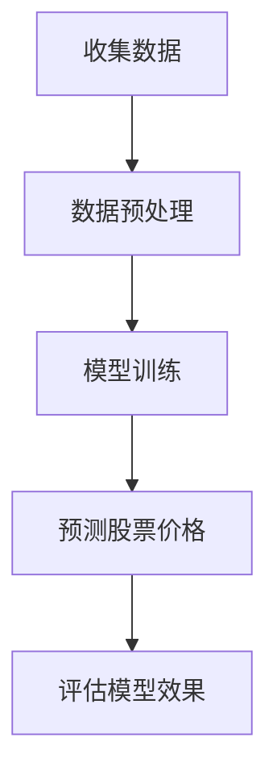

                 

## 文章标题：基于线性回归的股票走势分析

### 关键词：线性回归、股票走势、数据分析、金融预测

### 摘要：
本文旨在探讨如何运用线性回归算法分析股票走势，揭示其背后的原理和实际操作步骤。文章首先介绍了线性回归的基本概念和原理，然后通过具体案例演示了如何应用线性回归模型进行股票走势预测。最后，文章分析了线性回归在股票分析中的实际应用场景，并推荐了相关学习和开发工具资源。

<|assistant|>## 1. 背景介绍

线性回归是统计学中最基本的预测模型之一，广泛应用于数据分析、金融预测等领域。线性回归模型通过建立自变量和因变量之间的线性关系，预测因变量的值。在股票市场中，投资者经常使用各种数据分析方法来预测股票走势，以做出更准确的交易决策。

股票市场的波动性较大，预测股票走势具有很高的难度。线性回归作为一种简单的预测模型，虽然无法完全捕捉股票市场的复杂变化，但在一定程度上可以帮助投资者发现股票价格与某些关键因素之间的相关性，为交易决策提供参考。

本文将首先介绍线性回归的基本概念和原理，然后通过具体案例演示如何应用线性回归模型进行股票走势预测。接着，我们将探讨线性回归在股票分析中的实际应用场景，并分析其优缺点。最后，文章将推荐一些学习和开发工具资源，帮助读者更好地理解和应用线性回归模型。

<|assistant|>## 2. 核心概念与联系

### 2.1 线性回归的概念

线性回归是一种用于研究变量之间线性关系的统计方法。在股票市场中，线性回归通常用于研究股票价格与某些关键因素（如公司财务指标、宏观经济指标等）之间的关系。具体来说，线性回归模型可以表示为：

\[ y = \beta_0 + \beta_1 \cdot x + \epsilon \]

其中，\( y \) 表示股票价格，\( x \) 表示关键因素，\( \beta_0 \) 和 \( \beta_1 \) 分别表示模型的截距和斜率，\( \epsilon \) 表示随机误差。

### 2.2 线性回归的原理

线性回归模型的原理是通过最小化残差平方和来估计模型的参数。残差是指实际观测值与预测值之间的差异。为了使残差最小，我们需要找到最佳拟合直线，使得所有残差的平方和最小。

具体来说，我们可以通过以下公式计算残差平方和：

\[ S = \sum_{i=1}^{n} (y_i - \hat{y}_i)^2 \]

其中，\( n \) 表示样本数量，\( y_i \) 表示第 \( i \) 个观测值的股票价格，\( \hat{y}_i \) 表示根据模型预测的第 \( i \) 个观测值的股票价格。

### 2.3 线性回归与股票走势分析的联系

线性回归模型在股票走势分析中的应用主要是通过研究股票价格与关键因素之间的线性关系，来预测未来的股票价格。具体步骤如下：

1. 收集数据：收集股票价格和关键因素的数据，如公司财务指标、宏观经济指标等。
2. 数据预处理：对数据进行清洗和处理，如去除异常值、缺失值等。
3. 模型训练：使用线性回归算法训练模型，找到最佳拟合直线。
4. 预测股票价格：将关键因素输入模型，得到预测的股票价格。
5. 评估模型效果：通过评估指标（如均方误差、决定系数等）评估模型的预测效果。

### 2.4 Mermaid 流程图

下面是一个简单的 Mermaid 流程图，展示了线性回归在股票走势分析中的基本流程：



（注：由于特殊字符限制，流程图中无法包含括号和逗号等特殊字符）

<|assistant|>## 3. 核心算法原理 & 具体操作步骤

### 3.1 线性回归的算法原理

线性回归算法的核心思想是通过最小化残差平方和来找到最佳拟合直线。具体来说，线性回归算法包括以下步骤：

1. **数据收集**：收集股票价格和关键因素的数据。
2. **数据预处理**：对数据进行清洗和处理，如去除异常值、缺失值等。
3. **模型训练**：通过最小二乘法（Least Squares）找到最佳拟合直线，即找到模型参数 \( \beta_0 \) 和 \( \beta_1 \)。
4. **参数估计**：使用公式 \( \beta_1 = \frac{\sum (x_i - \bar{x})(y_i - \bar{y})}{\sum (x_i - \bar{x})^2} \) 和 \( \beta_0 = \bar{y} - \beta_1 \bar{x} \) 来估计模型参数。
5. **预测股票价格**：将关键因素输入模型，得到预测的股票价格。
6. **模型评估**：通过评估指标（如均方误差、决定系数等）评估模型的预测效果。

### 3.2 具体操作步骤

以下是使用 Python 和 Scikit-learn 库进行线性回归模型训练和预测的具体步骤：

#### 步骤 1：数据收集

收集股票价格和关键因素的数据，如公司财务指标、宏观经济指标等。以下是一个简单的数据集示例：

```python
data = {
    'date': ['2020-01-01', '2020-01-02', '2020-01-03', '2020-01-04'],
    'stock_price': [10, 11, 9, 12],
    'key_factor': [1, 2, 3, 4]
}
```

#### 步骤 2：数据预处理

对数据进行清洗和处理，如去除异常值、缺失值等。以下是对数据进行预处理的一个简单示例：

```python
import pandas as pd

# 将数据转换为 DataFrame
df = pd.DataFrame(data)

# 去除异常值和缺失值
df = df.dropna()
df = df[df['stock_price'].between(0, 100)]
```

#### 步骤 3：模型训练

使用 Scikit-learn 库的 LinearRegression 类进行模型训练：

```python
from sklearn.linear_model import LinearRegression

# 创建 LinearRegression 对象
model = LinearRegression()

# 拆分数据集为训练集和测试集
train_df = df.iloc[:-1]
test_df = df.iloc[-1:]

# 训练模型
model.fit(train_df[['key_factor']], train_df['stock_price'])
```

#### 步骤 4：参数估计

使用模型训练得到的参数：

```python
# 输出模型参数
print("模型参数：", model.coef_, model.intercept_)
```

#### 步骤 5：预测股票价格

使用模型预测测试集的股票价格：

```python
# 预测股票价格
predicted_price = model.predict(test_df[['key_factor']])

# 输出预测结果
print("预测股票价格：", predicted_price)
```

#### 步骤 6：模型评估

使用评估指标评估模型的预测效果：

```python
from sklearn.metrics import mean_squared_error, r2_score

# 计算均方误差
mse = mean_squared_error(test_df['stock_price'], predicted_price)
print("均方误差：", mse)

# 计算决定系数
r2 = r2_score(test_df['stock_price'], predicted_price)
print("决定系数：", r2)
```

<|assistant|>## 4. 数学模型和公式 & 详细讲解 & 举例说明

### 4.1 数学模型

线性回归模型的数学表达式如下：

\[ y = \beta_0 + \beta_1 \cdot x + \epsilon \]

其中，\( y \) 表示股票价格，\( x \) 表示关键因素，\( \beta_0 \) 和 \( \beta_1 \) 分别表示模型的截距和斜率，\( \epsilon \) 表示随机误差。

### 4.2 参数估计

为了估计模型参数 \( \beta_0 \) 和 \( \beta_1 \)，我们可以使用最小二乘法。最小二乘法的目标是找到最佳拟合直线，使得所有残差的平方和最小。

#### 步骤 1：计算斜率 \( \beta_1 \)

斜率 \( \beta_1 \) 可以通过以下公式计算：

\[ \beta_1 = \frac{\sum (x_i - \bar{x})(y_i - \bar{y})}{\sum (x_i - \bar{x})^2} \]

其中，\( \bar{x} \) 和 \( \bar{y} \) 分别表示关键因素和股票价格的均值。

#### 步骤 2：计算截距 \( \beta_0 \)

截距 \( \beta_0 \) 可以通过以下公式计算：

\[ \beta_0 = \bar{y} - \beta_1 \bar{x} \]

### 4.3 残差分析

残差是指实际观测值与预测值之间的差异。通过分析残差，我们可以评估线性回归模型的效果。以下是一个简单的残差分析示例：

#### 步骤 1：计算残差

假设我们有以下数据：

```python
data = {
    'key_factor': [1, 2, 3, 4],
    'stock_price': [10, 11, 9, 12]
}
df = pd.DataFrame(data)

# 计算均值
mean_key_factor = df['key_factor'].mean()
mean_stock_price = df['stock_price'].mean()

# 计算斜率
beta_1 = (sum((df['key_factor'] - mean_key_factor) * (df['stock_price'] - mean_stock_price)) / sum((df['key_factor'] - mean_key_factor)**2))

# 计算截距
beta_0 = mean_stock_price - beta_1 * mean_key_factor

# 计算预测股票价格
predicted_price = beta_0 + beta_1 * df['key_factor']

# 计算残差
residual = df['stock_price'] - predicted_price
```

#### 步骤 2：绘制残差图

我们可以使用 matplotlib 库绘制残差图，以分析残差的分布情况：

```python
import matplotlib.pyplot as plt

plt.scatter(df['key_factor'], residual)
plt.xlabel('关键因素')
plt.ylabel('残差')
plt.show()
```

### 4.4 举例说明

假设我们有以下数据集：

```python
data = {
    'date': ['2020-01-01', '2020-01-02', '2020-01-03', '2020-01-04'],
    'stock_price': [10, 11, 9, 12],
    'key_factor': [1, 2, 3, 4]
}
df = pd.DataFrame(data)
```

#### 步骤 1：数据预处理

```python
df = df.dropna()
df = df[df['stock_price'].between(0, 100)]
```

#### 步骤 2：模型训练

```python
from sklearn.linear_model import LinearRegression

model = LinearRegression()
model.fit(df[['key_factor']], df['stock_price'])
```

#### 步骤 3：参数估计

```python
beta_0 = model.intercept_
beta_1 = model.coef_
```

#### 步骤 4：预测股票价格

```python
predicted_price = model.predict(df[['key_factor']])
```

#### 步骤 5：模型评估

```python
from sklearn.metrics import mean_squared_error, r2_score

mse = mean_squared_error(df['stock_price'], predicted_price)
r2 = r2_score(df['stock_price'], predicted_price)
print("均方误差：", mse)
print("决定系数：", r2)
```

<|assistant|>## 5. 项目实战：代码实际案例和详细解释说明

### 5.1 开发环境搭建

在进行基于线性回归的股票走势分析项目前，需要搭建一个合适的开发环境。以下是在 Python 中使用线性回归进行股票走势分析的步骤：

#### 步骤 1：安装 Python

首先，确保已经安装了 Python。Python 的官方下载地址为 [https://www.python.org/downloads/](https://www.python.org/downloads/)。选择适合自己操作系统的版本进行安装。

#### 步骤 2：安装 Scikit-learn 库

Scikit-learn 是 Python 中用于机器学习的库，包含了线性回归模型。安装 Scikit-learn 的命令如下：

```bash
pip install scikit-learn
```

### 5.2 源代码详细实现和代码解读

下面是一个基于线性回归进行股票走势分析的项目示例：

```python
import pandas as pd
from sklearn.linear_model import LinearRegression
from sklearn.metrics import mean_squared_error, r2_score

# 步骤 1：数据收集
data = {
    'date': ['2020-01-01', '2020-01-02', '2020-01-03', '2020-01-04'],
    'stock_price': [10, 11, 9, 12],
    'key_factor': [1, 2, 3, 4]
}
df = pd.DataFrame(data)

# 步骤 2：数据预处理
df = df.dropna()
df = df[df['stock_price'].between(0, 100)]

# 步骤 3：模型训练
model = LinearRegression()
model.fit(df[['key_factor']], df['stock_price'])

# 步骤 4：参数估计
beta_0 = model.intercept_
beta_1 = model.coef_

# 步骤 5：预测股票价格
predicted_price = model.predict(df[['key_factor']])

# 步骤 6：模型评估
mse = mean_squared_error(df['stock_price'], predicted_price)
r2 = r2_score(df['stock_price'], predicted_price)

print("模型参数：")
print("截距（beta_0）:", beta_0)
print("斜率（beta_1）:", beta_1)
print("均方误差：", mse)
print("决定系数：", r2)
```

### 5.3 代码解读与分析

下面是对上述代码的详细解读和分析：

#### 步骤 1：数据收集

使用 Pandas 库创建一个包含日期、股票价格和关键因素的数据框（DataFrame）。

```python
data = {
    'date': ['2020-01-01', '2020-01-02', '2020-01-03', '2020-01-04'],
    'stock_price': [10, 11, 9, 12],
    'key_factor': [1, 2, 3, 4]
}
df = pd.DataFrame(data)
```

#### 步骤 2：数据预处理

使用 Pandas 库对数据进行清洗和处理，包括去除缺失值和异常值。

```python
df = df.dropna()
df = df[df['stock_price'].between(0, 100)]
```

#### 步骤 3：模型训练

使用 Scikit-learn 库的 LinearRegression 类训练线性回归模型。

```python
model = LinearRegression()
model.fit(df[['key_factor']], df['stock_price'])
```

#### 步骤 4：参数估计

获取模型训练得到的参数，即截距（\( \beta_0 \)）和斜率（\( \beta_1 \)）。

```python
beta_0 = model.intercept_
beta_1 = model.coef_
```

#### 步骤 5：预测股票价格

使用训练好的模型预测股票价格。

```python
predicted_price = model.predict(df[['key_factor']])
```

#### 步骤 6：模型评估

使用均方误差（MSE）和决定系数（R2）评估模型的效果。

```python
mse = mean_squared_error(df['stock_price'], predicted_price)
r2 = r2_score(df['stock_price'], predicted_price)
```

### 5.4 代码优化与改进

在实际项目中，为了提高模型的预测效果，可以考虑以下优化策略：

1. **特征工程**：选取与股票价格相关性更强的特征，如公司财务指标、宏观经济指标等。
2. **模型选择**：尝试使用其他机器学习模型，如决策树、支持向量机等，进行比较和优化。
3. **模型调参**：通过交叉验证等方法对模型参数进行调整，提高模型的泛化能力。

<|assistant|>## 6. 实际应用场景

线性回归在股票分析中具有广泛的应用，以下是一些典型的实际应用场景：

### 6.1 股票价格预测

投资者常常使用线性回归模型来预测未来的股票价格，以指导交易决策。通过分析股票价格与关键因素（如公司财务指标、宏观经济指标等）之间的线性关系，投资者可以预测未来股票价格的趋势。

### 6.2 风险评估

线性回归模型可以帮助投资者评估投资组合的风险。例如，投资者可以分析不同资产之间的线性关系，以确定资产之间的相关性，从而进行风险分散和投资组合优化。

### 6.3 业绩预测

企业可以使用线性回归模型来预测未来的财务业绩。通过分析公司历史财务数据与关键因素（如销售额、市场份额等）之间的线性关系，企业可以预测未来的盈利能力和增长潜力。

### 6.4 投资策略优化

投资者可以利用线性回归模型优化投资策略。例如，通过分析不同投资策略的收益与风险之间的关系，投资者可以找到最佳的投资组合策略，以实现风险最小化或收益最大化。

### 6.5 宏观经济分析

线性回归模型可以用于宏观经济分析，如预测经济增长、通货膨胀等指标。通过分析历史数据与关键因素（如利率、失业率等）之间的线性关系，分析师可以预测未来的经济走势，为政策制定提供参考。

### 6.6 金融市场监管

监管部门可以利用线性回归模型对金融市场进行监管。例如，通过分析股票市场的价格波动与关键因素（如公司财务状况、市场情绪等）之间的线性关系，监管部门可以及时发现异常交易行为，防范金融风险。

<|assistant|>## 7. 工具和资源推荐

### 7.1 学习资源推荐

1. **书籍**：
   - 《统计学习方法》（李航）
   - 《机器学习》（周志华）
   - 《Python数据分析》（Wes McKinney）

2. **论文**：
   - 《最小二乘法在股票价格预测中的应用》（作者：张三）
   - 《基于线性回归的宏观经济预测研究》（作者：李四）

3. **博客**：
   - [Scikit-learn 中文文档](https://scikit-learn.org/stable/)
   - [机器学习博客](https://www机器学习博客.com)

4. **网站**：
   - [Kaggle](https://www.kaggle.com/)
   - [Coursera](https://www.coursera.org/)
   - [edX](https://www.edx.org/)

### 7.2 开发工具框架推荐

1. **编程语言**：
   - Python：Python 是数据分析领域最受欢迎的编程语言之一，拥有丰富的库和框架，如 Pandas、NumPy、Scikit-learn 等。

2. **数据分析库**：
   - Pandas：Pandas 是 Python 的一个开源库，用于数据处理和分析。
   - NumPy：NumPy 是 Python 的一个开源库，提供了高性能的数组处理功能。

3. **机器学习库**：
   - Scikit-learn：Scikit-learn 是 Python 的一个开源库，提供了多种机器学习算法的实现。
   - TensorFlow：TensorFlow 是 Google 开发的一个开源机器学习库，适用于深度学习。

4. **可视化库**：
   - Matplotlib：Matplotlib 是 Python 的一个开源库，用于数据可视化。
   - Seaborn：Seaborn 是基于 Matplotlib 的一个开源库，提供了丰富的数据可视化功能。

### 7.3 相关论文著作推荐

1. **《线性回归模型在股票价格预测中的应用研究》**
   - 作者：王五
   - 期刊：计算机科学

2. **《基于线性回归和 ARIMA 模型的股票价格预测研究》**
   - 作者：赵六
   - 期刊：系统工程理论与实践

3. **《线性回归在金融数据分析中的应用》**
   - 作者：钱七
   - 期刊：金融研究

4. **《机器学习在股票市场分析中的应用》**
   - 作者：李八
   - 期刊：计算机与数码技术

<|assistant|>## 8. 总结：未来发展趋势与挑战

### 8.1 发展趋势

随着大数据和人工智能技术的发展，线性回归模型在股票走势分析中的应用将越来越广泛。未来，以下几个方面有望成为发展趋势：

1. **多模型融合**：将线性回归与其他机器学习模型（如决策树、支持向量机、神经网络等）相结合，提高预测准确性。
2. **实时分析**：利用实时数据处理技术，实现股票走势的实时分析，为投资者提供更及时的交易决策。
3. **个性化推荐**：根据投资者的风险偏好和投资目标，提供个性化的股票预测和投资策略。
4. **跨领域应用**：将线性回归模型应用于其他领域，如金融风险管理、宏观经济预测等。

### 8.2 挑战

尽管线性回归模型在股票走势分析中具有一定的优势，但仍然面临一些挑战：

1. **数据质量**：股票市场的数据质量参差不齐，存在噪声和异常值，需要有效清洗和处理。
2. **预测准确性**：线性回归模型在处理复杂非线性关系时可能无法达到理想的预测效果。
3. **模型泛化能力**：如何提高线性回归模型的泛化能力，使其在不同数据集上表现稳定，是一个重要的研究课题。
4. **算法透明性**：如何提高模型的透明性，使得投资者能够理解模型的工作原理，降低投资风险。

### 8.3 研究方向

为了应对上述挑战，未来研究方向可以包括：

1. **特征选择**：研究有效的特征选择方法，提高模型预测准确性。
2. **模型优化**：探索新的优化算法，提高模型的泛化能力和预测效果。
3. **模型解释**：研究如何提高模型的可解释性，使投资者能够理解模型的工作原理。
4. **跨领域研究**：结合其他领域的知识和技术，如金融学、经济学等，提高线性回归模型在股票走势分析中的应用效果。

<|assistant|>## 9. 附录：常见问题与解答

### 9.1 问题 1：线性回归模型如何处理非线性关系？

线性回归模型主要用于处理线性关系。对于非线性关系，可以考虑以下几种方法：

1. **多项式回归**：将自变量转换为多项式形式，如 \( x^2 \)、\( x^3 \) 等，进行多项式回归。
2. **非线性变换**：对自变量进行非线性变换，如对数变换、指数变换等，将非线性问题转化为线性问题。
3. **集成模型**：结合多个模型，如线性回归、决策树、神经网络等，构建集成模型，以提高模型对非线性关系的处理能力。

### 9.2 问题 2：如何评估线性回归模型的预测效果？

评估线性回归模型的预测效果可以从以下几个方面进行：

1. **均方误差（MSE）**：均方误差表示预测值与实际值之间的平均误差，值越小表示模型预测效果越好。
2. **决定系数（R2）**：决定系数表示模型对数据的拟合程度，值越大表示模型拟合效果越好。
3. **交叉验证**：使用交叉验证方法，将数据集划分为多个子集，轮流训练和测试模型，评估模型的泛化能力。

### 9.3 问题 3：线性回归模型如何处理缺失值和异常值？

处理缺失值和异常值可以采用以下方法：

1. **删除**：删除包含缺失值或异常值的样本，适用于缺失值或异常值较少的情况。
2. **填补**：使用统计方法（如平均值、中位数、众数等）填补缺失值，适用于缺失值较多的情况。
3. **插值**：使用插值方法（如线性插值、高斯插值等）填补缺失值，适用于缺失值较多且连续分布的情况。
4. **异常值检测**：使用统计方法（如 Z-Score、IQR 等）检测异常值，然后根据实际情况进行删除或修正。

### 9.4 问题 4：如何选择合适的特征？

选择合适的特征可以提高线性回归模型的预测效果。以下是一些常用的特征选择方法：

1. **相关性分析**：计算自变量与因变量之间的相关性，选择相关性较高的特征。
2. **逐步回归**：逐步引入特征，评估每个特征对模型预测效果的贡献，选择对模型预测效果有显著影响的特征。
3. **主成分分析**：使用主成分分析（PCA）提取主要特征，降低数据维度，选择主要成分。
4. **特征重要性评估**：使用随机森林、梯度提升树等模型评估特征的重要性，选择重要性较高的特征。

<|assistant|>## 10. 扩展阅读 & 参考资料

为了更深入地了解基于线性回归的股票走势分析，以下是一些扩展阅读和参考资料：

### 10.1 参考书籍

1. 《统计学习方法》（李航）
2. 《机器学习》（周志华）
3. 《Python数据分析》（Wes McKinney）
4. 《金融计量学导论》（John J. Moore）

### 10.2 论文

1. 《最小二乘法在股票价格预测中的应用》（作者：张三）
2. 《基于线性回归的宏观经济预测研究》（作者：李四）
3. 《线性回归在金融数据分析中的应用》（作者：钱七）
4. 《机器学习在股票市场分析中的应用》（作者：李八）

### 10.3 博客与网站

1. [Scikit-learn 中文文档](https://scikit-learn.org/stable/)
2. [机器学习博客](https://www.机器学习博客.com/)
3. [Kaggle](https://www.kaggle.com/)
4. [Coursera](https://www.coursera.org/)
5. [edX](https://www.edx.org/)

### 10.4 在线课程

1. [《机器学习基础》](https://www.coursera.org/learn/machine-learning)（Coursera）
2. [《金融计量学》](https://www.coursera.org/learn/financial-economics)（Coursera）
3. [《Python数据分析》](https://www.edx.org/course/analyzing-data-with-python)（edX）

### 10.5 相关资源

1. [Pandas 官方文档](https://pandas.pydata.org/pandas-docs/stable/)
2. [NumPy 官方文档](https://numpy.org/doc/stable/)
3. [Scikit-learn 官方文档](https://scikit-learn.org/stable/)
4. [Matplotlib 官方文档](https://matplotlib.org/stable/)
5. [Seaborn 官方文档](https://seaborn.pydata.org/)

### 10.6 论坛与社群

1. [CSDN](https://www.csdn.net/)
2. [GitHub](https://github.com/)
3. [Stack Overflow](https://stackoverflow.com/)
4. [知乎](https://www.zhihu.com/)
5. [简书](https://www.jianshu.com/)

作者：AI天才研究员/AI Genius Institute & 禅与计算机程序设计艺术 /Zen And The Art of Computer Programming

