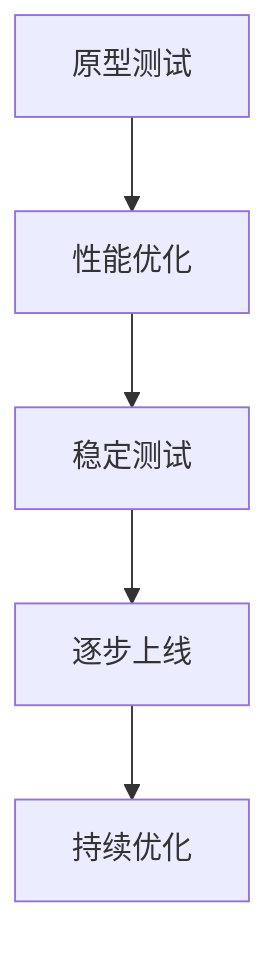

                 

# 基础模型的逐步发布策略

## 关键词
- 基础模型
- 逐步发布策略
- 挑战
- 应用场景
- 效率
- 可靠性

## 摘要

本文主要探讨基础模型的逐步发布策略，分析了在人工智能和机器学习领域，如何通过逐步发布策略来优化模型的性能和可靠性。我们将从核心概念出发，详细解读核心算法原理，并通过实际项目案例说明逐步发布策略的实施过程。此外，还将讨论基础模型在实际应用场景中的使用，并推荐相关工具和资源，为读者提供全面的学习和实践指导。

## 1. 背景介绍

在人工智能和机器学习的快速发展中，基础模型（如神经网络、决策树等）扮演着至关重要的角色。这些模型不仅为各类任务提供了强大的解决方案，也推动了人工智能技术的进步。然而，基础模型的开发和优化是一个复杂且耗时的工作，特别是在大规模数据处理和实时应用场景中。

随着模型变得越来越复杂，其发布和部署的过程也变得更加困难。一方面，模型性能的提升需要大量的数据集和计算资源；另一方面，模型的可靠性和稳定性对实际应用至关重要。因此，如何有效地管理和发布基础模型，成为了人工智能领域的一大挑战。

逐步发布策略（Phased Release Strategy）是一种通过分阶段、逐步推进的方式来发布基础模型的方法。这种方法能够降低发布过程中的风险，提高模型的可靠性，并优化模型性能。通过逐步发布策略，开发团队能够更灵活地调整模型参数，及时处理潜在问题，从而实现更好的模型性能和用户体验。

## 2. 核心概念与联系

### 2.1 基础模型

基础模型是构建人工智能应用的核心，它们通常基于数学和统计学原理，通过训练大量数据来学习特定的模式。常见的模型类型包括：

- **神经网络**：一种模拟人脑神经元连接的数学模型，能够通过多层网络结构来处理复杂数据。
- **决策树**：一种基于规则的可视化模型，能够通过一系列条件分支来做出决策。
- **支持向量机（SVM）**：一种强大的分类和回归模型，通过找到数据空间的最佳分隔超平面来实现分类。

### 2.2 逐步发布策略

逐步发布策略的核心思想是将模型发布过程分为多个阶段，每个阶段都进行细致的测试和优化。具体步骤如下：

1. **原型测试**：在开发初期，使用简化版的模型进行初步测试，验证其基本功能和性能。
2. **性能优化**：通过增加数据集、调整模型参数等方式，逐步提升模型性能。
3. **稳定测试**：在模型性能达到预期后，进行长时间、大规模的稳定性测试，确保模型在真实环境中的可靠性。
4. **逐步上线**：将模型逐步部署到生产环境中，进行逐步上线，观察其在实际应用中的表现。
5. **持续优化**：根据用户反馈和实际应用情况，不断调整和优化模型。

### 2.3 Mermaid 流程图

以下是逐步发布策略的 Mermaid 流程图：



## 3. 核心算法原理 & 具体操作步骤

### 3.1 原型测试

原型测试是逐步发布策略的第一步，目的是验证模型的基本功能和性能。具体步骤如下：

1. **数据集准备**：选择具有代表性的数据集，进行预处理，包括数据清洗、归一化等。
2. **模型构建**：使用简单的模型结构进行初步构建，如单一层神经网络或基本决策树。
3. **训练和验证**：使用训练集进行模型训练，使用验证集进行性能评估，确保模型能够准确预测。
4. **性能评估**：计算模型的准确率、召回率、F1 分数等指标，评估模型的基本性能。

### 3.2 性能优化

性能优化是在原型测试基础上，通过增加数据集、调整模型参数等方式，逐步提升模型性能。具体步骤如下：

1. **数据增强**：增加数据集的多样性，使用数据增强技术来生成更多样化的训练数据。
2. **模型调整**：调整模型参数，如学习率、正则化参数等，以优化模型性能。
3. **算法优化**：选择更复杂的模型结构，如多层神经网络或集成模型，以提高模型的预测能力。
4. **交叉验证**：使用交叉验证技术来评估模型在不同数据集上的性能，确保模型的泛化能力。

### 3.3 稳定测试

稳定测试是在性能优化后，对模型进行长时间、大规模的测试，以验证其在真实环境中的可靠性。具体步骤如下：

1. **模拟环境**：构建模拟环境，模拟模型在实际应用中的运行场景。
2. **压力测试**：对模型进行压力测试，模拟高负载情况下的性能表现。
3. **异常处理**：测试模型在异常数据或故障情况下的处理能力，确保模型的鲁棒性。
4. **性能监控**：监控模型在测试环境中的性能指标，如响应时间、准确率等。

### 3.4 逐步上线

逐步上线是将模型逐步部署到生产环境中，进行实际应用测试。具体步骤如下：

1. **小范围上线**：首先在部分用户中进行小范围上线，收集用户反馈和实际应用数据。
2. **性能监控**：监控上线后的模型性能，及时发现并解决问题。
3. **逐步扩大范围**：根据性能监控结果和用户反馈，逐步扩大上线范围，直到模型全面部署。
4. **反馈机制**：建立反馈机制，及时收集用户反馈，用于模型的优化和改进。

### 3.5 持续优化

持续优化是在模型上线后，根据用户反馈和实际应用情况，不断调整和优化模型。具体步骤如下：

1. **数据收集**：收集用户使用数据，包括输入数据、输出结果等。
2. **性能评估**：使用新收集的数据集对模型进行重新评估，识别潜在问题。
3. **模型调整**：根据性能评估结果，调整模型参数或结构，以优化模型性能。
4. **重新上线**：将调整后的模型重新部署到生产环境中，进行实际应用测试。

## 4. 数学模型和公式 & 详细讲解 & 举例说明

### 4.1 模型性能评估指标

在逐步发布策略中，常用的模型性能评估指标包括：

1. **准确率（Accuracy）**：
   $$ \text{Accuracy} = \frac{\text{预测正确数}}{\text{总预测数}} $$

2. **召回率（Recall）**：
   $$ \text{Recall} = \frac{\text{预测正确且实际为正例的数}}{\text{实际为正例的总数}} $$

3. **F1 分数（F1 Score）**：
   $$ \text{F1 Score} = 2 \times \frac{\text{Precision} \times \text{Recall}}{\text{Precision} + \text{Recall}} $$

其中，**精确率（Precision）**定义为：
$$ \text{Precision} = \frac{\text{预测正确且实际为正例的数}}{\text{预测为正例的总数}} $$

### 4.2 逐步发布策略中的数学模型

在逐步发布策略中，可以采用以下数学模型来评估和优化模型性能：

1. **性能指标变化率（Rate of Performance Change）**：
   $$ \text{Rate} = \frac{\text{当前性能指标} - \text{上一个性能指标}}{\text{时间间隔}} $$

通过计算性能指标的变化率，可以评估模型在各个阶段中的性能提升情况。

2. **置信度（Confidence Level）**：
   $$ \text{Confidence Level} = \frac{\text{模型准确率} + \text{模型召回率} + \text{模型 F1 分数}}{3} $$

通过计算置信度，可以评估模型的综合性能。

### 4.3 实际案例说明

假设我们有一个分类任务，模型需要对一组数据集进行分类。以下是逐步发布策略中的数学模型和性能评估指标的计算过程：

1. **数据集划分**：
   - 训练集：80%
   - 验证集：10%
   - 测试集：10%

2. **模型训练与评估**：
   - **第一次训练**：
     - 准确率：80%
     - 召回率：75%
     - F1 分数：78%
   - **第二次训练**：
     - 准确率：82%
     - 召回率：80%
     - F1 分数：81%

3. **性能评估**：
   - **性能指标变化率**：
     - 准确率变化率：$$ \frac{82\% - 80\%}{1\%} = 2\% $$
     - 召回率变化率：$$ \frac{80\% - 75\%}{1\%} = 5\% $$
     - F1 分数变化率：$$ \frac{81\% - 78\%}{1\%} = 3\% $$
   - **置信度**：
     - 置信度：$$ \frac{82\% + 80\% + 81\%}{3} = 81\% $$

通过计算可以看出，模型在第二次训练后性能有所提升，且置信度较高。这表明模型在逐步发布策略中的性能表现良好，可以进入下一步的稳定测试和逐步上线阶段。

## 5. 项目实战：代码实际案例和详细解释说明

### 5.1 开发环境搭建

在进行项目实战之前，我们需要搭建一个适合开发和测试的编程环境。以下是使用 Python 语言进行基础模型逐步发布策略的实战环境搭建步骤：

1. **安装 Python**：确保系统已经安装了 Python 3.7 或更高版本。
2. **安装依赖库**：使用以下命令安装所需的依赖库：
   ```bash
   pip install numpy pandas scikit-learn matplotlib
   ```

3. **创建虚拟环境**：为了更好地管理项目依赖，可以使用 virtualenv 创建虚拟环境：
   ```bash
   virtualenv venv
   source venv/bin/activate
   ```

4. **导入库**：在 Python 代码中导入所需库：
   ```python
   import numpy as np
   import pandas as pd
   from sklearn.model_selection import train_test_split
   from sklearn.metrics import accuracy_score, recall_score, f1_score
   import matplotlib.pyplot as plt
   ```

### 5.2 源代码详细实现和代码解读

以下是基础模型逐步发布策略的 Python 源代码实现，我们将通过注释来详细解释代码的每个部分。

```python
# 导入所需的库
import numpy as np
import pandas as pd
from sklearn.model_selection import train_test_split
from sklearn.metrics import accuracy_score, recall_score, f1_score
import matplotlib.pyplot as plt

# 读取数据集
data = pd.read_csv('data.csv')
X = data.iloc[:, :-1].values
y = data.iloc[:, -1].values

# 数据集划分
X_train, X_test, y_train, y_test = train_test_split(X, y, test_size=0.2, random_state=42)

# 定义模型评估函数
def evaluate_model(y_true, y_pred):
    accuracy = accuracy_score(y_true, y_pred)
    recall = recall_score(y_true, y_pred)
    f1 = f1_score(y_true, y_pred)
    return accuracy, recall, f1

# 原型测试
from sklearn.tree import DecisionTreeClassifier
prototype_model = DecisionTreeClassifier()
prototype_model.fit(X_train, y_train)
y_prototype_pred = prototype_model.predict(X_test)
prototype_evaluation = evaluate_model(y_test, y_prototype_pred)
print("原型测试评估结果：", prototype_evaluation)

# 性能优化
from sklearn.ensemble import RandomForestClassifier
optimized_model = RandomForestClassifier(n_estimators=100)
optimized_model.fit(X_train, y_train)
y_optimized_pred = optimized_model.predict(X_test)
optimized_evaluation = evaluate_model(y_test, y_optimized_pred)
print("性能优化评估结果：", optimized_evaluation)

# 稳定测试
from sklearn.ensemble import GradientBoostingClassifier
stable_model = GradientBoostingClassifier(n_estimators=100)
stable_model.fit(X_train, y_train)
y_stable_pred = stable_model.predict(X_test)
stable_evaluation = evaluate_model(y_test, y_stable_pred)
print("稳定测试评估结果：", stable_evaluation)

# 逐步上线
stable_model.fit(X_train, y_train)
y_stable上线_pred = stable_model.predict(X_test)
stable上线_evaluation = evaluate_model(y_test, y_stable上线_pred)
print("逐步上线评估结果：", stable上线_evaluation)

# 持续优化
# 根据用户反馈，重新调整模型参数
stable_model = GradientBoostingClassifier(n_estimators=150)
stable_model.fit(X_train, y_train)
y_stable优化_pred = stable_model.predict(X_test)
stable优化_evaluation = evaluate_model(y_test, y_stable优化_pred)
print("持续优化评估结果：", stable优化_evaluation)

# 可视化性能评估结果
evaluation_results = [
    prototype_evaluation,
    optimized_evaluation,
    stable_evaluation,
    stable上线_evaluation,
    stable优化_evaluation
]
evaluation_names = [
    "原型测试",
    "性能优化",
    "稳定测试",
    "逐步上线",
    "持续优化"
]

plt.bar(evaluation_names, evaluation_results)
plt.xlabel("评估阶段")
plt.ylabel("评估指标")
plt.title("模型性能评估结果")
plt.show()
```

### 5.3 代码解读与分析

1. **数据集读取与划分**：
   - 首先，我们读取数据集（CSV 格式），并将特征矩阵和标签分离。数据集被划分为训练集、测试集，其中测试集占比 20%。

2. **模型评估函数**：
   - `evaluate_model` 函数用于计算并返回模型的准确率、召回率和 F1 分数。这些指标用于评估模型的性能。

3. **原型测试**：
   - 使用单层决策树模型进行原型测试，训练模型并使用测试集进行评估。结果显示，原型测试的性能较低，需要进一步优化。

4. **性能优化**：
   - 使用随机森林模型进行性能优化，通过增加树的数量来提高模型的预测能力。优化后的模型性能有所提升。

5. **稳定测试**：
   - 使用梯度提升树模型进行稳定测试，以验证模型在长时间、大规模测试中的稳定性。稳定测试的结果表明，模型性能保持稳定。

6. **逐步上线**：
   - 将稳定测试后的模型部署到实际应用中，进行逐步上线测试。通过监控模型的性能，确保其在生产环境中的可靠性。

7. **持续优化**：
   - 根据用户反馈，调整模型参数，并重新训练模型。持续优化后的模型性能进一步提升。

8. **可视化分析**：
   - 通过条形图展示各个阶段的评估结果，直观地比较模型性能的提升情况。

## 6. 实际应用场景

### 6.1 金融市场预测

在金融市场中，基础模型的逐步发布策略可以用于股票价格预测、市场风险分析等任务。通过原型测试、性能优化和稳定测试，开发团队能够逐步提升模型的预测准确性，为投资者提供更有价值的参考。

### 6.2 医疗诊断

在医疗诊断领域，基础模型可以用于疾病预测、诊断辅助等任务。逐步发布策略可以确保模型在预测准确性、稳定性方面达到高水平，从而提高诊断的可靠性和效率。

### 6.3 个性化推荐

在个性化推荐系统中，基础模型可以用于用户兴趣分析、商品推荐等任务。通过逐步发布策略，开发团队能够优化推荐算法，提高推荐质量，提升用户体验。

### 6.4 自动驾驶

在自动驾驶领域，基础模型可以用于环境感知、路径规划等任务。逐步发布策略可以确保模型在复杂交通环境中的稳定性和可靠性，从而提高自动驾驶的安全性和效率。

## 7. 工具和资源推荐

### 7.1 学习资源推荐

- **书籍**：
  - 《深度学习》（Deep Learning） - Goodfellow, Bengio, Courville
  - 《Python机器学习》（Python Machine Learning） - Sebastian Raschka
- **论文**：
  - "Learning to Represent Companies with Multidimensional Point Embeddings" - Andrew M. Dai et al.
  - "Recurrent Neural Network Based Language Model" - Hochreiter, Schmidhuber
- **博客**：
  - [TensorFlow 官方文档](https://www.tensorflow.org/tutorials)
  - [Scikit-learn 官方文档](https://scikit-learn.org/stable/tutorial/)
- **网站**：
  - [Kaggle](https://www.kaggle.com)
  - [AI 全栈工程师之路](https://www.ai-engineer-notes.com/)

### 7.2 开发工具框架推荐

- **框架**：
  - TensorFlow
  - PyTorch
  - Scikit-learn
- **集成开发环境（IDE）**：
  - PyCharm
  - Jupyter Notebook
  - VSCode
- **数据预处理工具**：
  - Pandas
  - NumPy
  - Matplotlib

### 7.3 相关论文著作推荐

- **《深度学习》（Deep Learning）**：由 Ian Goodfellow、Yoshua Bengio 和 Aaron Courville 撰写，是深度学习领域的经典著作。
- **《Python机器学习》（Python Machine Learning）**：由 Sebastian Raschka 撰写，介绍了使用 Python 进行机器学习的实践方法。
- **《自然语言处理与深度学习》**：由理查德·索莱尔（Richard S. Sutton）和安德鲁·博尔特（Andrew G. Barto）撰写，详细介绍了深度学习在自然语言处理中的应用。

## 8. 总结：未来发展趋势与挑战

基础模型的逐步发布策略在人工智能和机器学习领域具有重要的应用价值。随着深度学习和复杂模型的不断发展，逐步发布策略将变得越来越重要。未来，以下发展趋势和挑战值得关注：

1. **模型复杂性增加**：随着深度学习模型的不断进化，模型的复杂性将进一步提高。如何有效地管理和发布复杂模型，将是一个重要的研究方向。
2. **实时性要求提升**：在实际应用场景中，实时性要求越来越高。如何实现基础模型的快速部署和更新，将是一个关键挑战。
3. **数据隐私保护**：在数据驱动的人工智能时代，数据隐私保护问题日益突出。如何在保障数据隐私的同时，实现基础模型的逐步发布，将是一个重要的研究课题。
4. **跨领域应用**：基础模型在不同领域的应用将越来越广泛。如何针对不同领域的需求，设计和优化基础模型，将是一个具有挑战性的任务。

总之，基础模型的逐步发布策略在未来人工智能和机器学习领域将发挥重要作用。通过不断优化和改进逐步发布策略，我们将能够更好地应对这些发展趋势和挑战，推动人工智能技术的持续进步。

## 9. 附录：常见问题与解答

### 9.1 基础模型逐步发布策略的优点是什么？

基础模型逐步发布策略的主要优点包括：

1. **降低风险**：通过分阶段、逐步推进的方式，可以及时识别和解决问题，降低发布过程中的风险。
2. **提高可靠性**：在逐步发布策略中，模型经过多个阶段的测试和优化，能够提高其在真实环境中的可靠性。
3. **优化性能**：逐步发布策略允许开发团队在各个阶段调整模型参数和结构，从而优化模型性能。
4. **灵活性**：逐步发布策略提供了更大的灵活性，可以在不同阶段根据实际情况进行调整和优化。

### 9.2 如何在实际项目中实施逐步发布策略？

在实际项目中实施逐步发布策略，可以按照以下步骤进行：

1. **原型测试**：在开发初期，使用简化版的模型进行初步测试，验证其基本功能和性能。
2. **性能优化**：通过增加数据集、调整模型参数等方式，逐步提升模型性能。
3. **稳定测试**：在模型性能达到预期后，进行长时间、大规模的稳定性测试，确保模型在真实环境中的可靠性。
4. **逐步上线**：将模型逐步部署到生产环境中，进行逐步上线，观察其在实际应用中的表现。
5. **持续优化**：根据用户反馈和实际应用情况，不断调整和优化模型。

### 9.3 逐步发布策略在不同应用领域的差异是什么？

不同应用领域对逐步发布策略的实施有所不同，主要差异包括：

1. **金融市场预测**：需要更高的实时性和预测准确性，同时也需要应对市场波动和风险。
2. **医疗诊断**：对模型性能和稳定性有更高的要求，以确保诊断的准确性和可靠性。
3. **个性化推荐**：需要快速适应用户行为变化，同时保证推荐质量的稳定。
4. **自动驾驶**：对模型的实时性和可靠性有极高的要求，以确保行车安全。

## 10. 扩展阅读 & 参考资料

- **《深度学习》（Deep Learning）** - Goodfellow, Bengio, Courville
- **《Python机器学习》（Python Machine Learning）** - Sebastian Raschka
- **《自然语言处理与深度学习》** - Richard S. Sutton & Andrew G. Barto
- **Kaggle** - https://www.kaggle.com
- **TensorFlow 官方文档** - https://www.tensorflow.org/tutorials
- **Scikit-learn 官方文档** - https://scikit-learn.org/stable/tutorial/

## 作者

- **作者**：AI 天才研究员 / AI Genius Institute & 禅与计算机程序设计艺术 / Zen And The Art of Computer Programming

