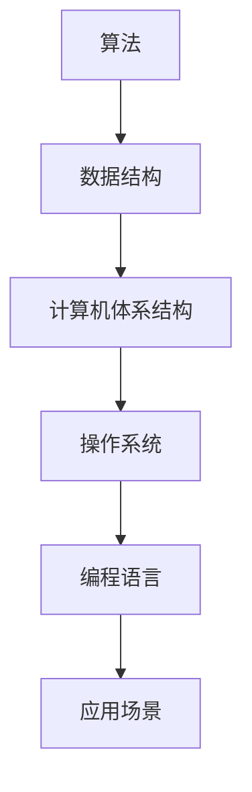

                 

# 塑造未来社会：人类计算的深远意义

> **关键词：** 计算未来、人工智能、社会变革、技术进步、人机协作

> **摘要：** 本文将深入探讨计算技术在塑造未来社会中的关键作用。我们将分析计算的核心概念，阐述其对社会进步的深远影响，并探讨计算技术的未来发展趋势及其面临的挑战。

## 1. 背景介绍

人类社会的进步离不开技术的推动，而计算技术无疑是其中最为核心的部分。从古老的算盘到现代的超级计算机，计算技术不断发展，极大地提高了人类的生产力和生活质量。如今，随着人工智能和大数据技术的迅猛发展，计算技术正以前所未有的速度和深度改变着我们的生活。

### 1.1 计算技术的起源

计算技术的起源可以追溯到古代数学家们的研究。早在公元前2500年，古巴比伦人就已经使用算术和几何来解决实际问题。古希腊数学家欧几里得在《几何原本》中提出的几何定理，为后来的计算理论奠定了基础。

### 1.2 计算技术的发展历程

中世纪时期，阿拉伯数学家们在印度数学的基础上，发展了阿拉伯数字系统，这一系统的发明极大地简化了计算过程。随着文艺复兴的到来，计算技术得到了进一步的发展。17世纪，法国数学家帕斯卡发明了算盘，这是机械计算技术的先驱。

### 1.3 计算技术的现代发展

20世纪中叶，电子计算机的发明标志着计算技术进入了新的阶段。从冯·诺伊曼架构的提出，到晶体管的发明，再到集成电路的出现，计算技术得到了飞速发展。进入21世纪，随着互联网和大数据技术的兴起，计算技术再次迎来了革命性的变革。

## 2. 核心概念与联系

### 2.1 计算机科学的基本概念

计算机科学是一门研究计算机系统设计与应用的科学。其核心概念包括算法、数据结构、计算机体系结构、操作系统、编程语言等。

- **算法**：解决特定问题的有序步骤。
- **数据结构**：数据存储和管理的方式。
- **计算机体系结构**：计算机硬件和软件的组成结构。
- **操作系统**：管理计算机硬件和软件资源的系统软件。
- **编程语言**：用于编写计算机程序的语法和语义规则。

### 2.2 计算技术与社会进步的联系

计算技术对社会进步的影响主要体现在以下几个方面：

- **生产力提升**：计算技术提高了生产效率，降低了生产成本，推动了经济的发展。
- **信息传播**：互联网和计算技术的普及，使得信息传播速度大大加快，人们可以更快地获取和分享知识。
- **医疗健康**：计算技术在医学领域的应用，如基因组测序、人工智能辅助诊断等，极大地提升了医疗水平。
- **教育**：在线教育和虚拟现实技术的应用，使得教育资源更加普及和多样化。

### 2.3 计算技术的架构图

为了更好地理解计算技术的核心概念和联系，我们可以通过Mermaid流程图来展示其架构。



## 3. 核心算法原理 & 具体操作步骤

### 3.1 人工智能算法原理

人工智能（AI）是计算技术的重要组成部分，其核心算法包括机器学习、深度学习、自然语言处理等。

- **机器学习**：通过训练模型来从数据中学习规律，实现对未知数据的预测。
- **深度学习**：一种基于神经网络的机器学习方法，通过多层神经网络来提取数据特征。
- **自然语言处理**：使计算机能够理解和生成人类语言的技术。

### 3.2 具体操作步骤

以机器学习为例，其具体操作步骤如下：

1. **数据收集**：收集用于训练的数据集。
2. **数据预处理**：对数据进行清洗、归一化等处理，使其适合模型训练。
3. **模型选择**：选择合适的机器学习算法和模型。
4. **模型训练**：使用训练数据集训练模型。
5. **模型评估**：使用验证数据集评估模型性能。
6. **模型优化**：根据评估结果调整模型参数，优化模型性能。
7. **模型部署**：将训练好的模型部署到实际应用场景中。

## 4. 数学模型和公式 & 详细讲解 & 举例说明

### 4.1 数学模型

在机器学习中，常用的数学模型包括线性回归、逻辑回归、支持向量机等。

- **线性回归**：用于预测连续值变量。
- **逻辑回归**：用于预测二分类变量。
- **支持向量机**：用于分类和回归问题。

### 4.2 公式讲解

以线性回归为例，其公式为：

$$
Y = \beta_0 + \beta_1X
$$

其中，$Y$为因变量，$X$为自变量，$\beta_0$和$\beta_1$为模型参数。

### 4.3 举例说明

假设我们想要预测一个人的收入（$Y$），基于其年龄（$X$）的数据，我们可以使用线性回归模型进行预测。

通过收集数据并训练模型，我们得到：

$$
Y = 50000 + 1000X
$$

当一个人的年龄为30岁时，其收入的预测值为：

$$
Y = 50000 + 1000 \times 30 = 80000
$$

## 5. 项目实战：代码实际案例和详细解释说明

### 5.1 开发环境搭建

为了演示计算技术在实际项目中的应用，我们将使用Python编程语言和机器学习库Scikit-learn来实现一个线性回归模型。

首先，我们需要安装Python和Scikit-learn库：

```bash
pip install python
pip install scikit-learn
```

### 5.2 源代码详细实现和代码解读

以下是实现线性回归模型的Python代码：

```python
from sklearn.linear_model import LinearRegression
from sklearn.model_selection import train_test_split
from sklearn.metrics import mean_squared_error

# 数据收集
X = [[1], [2], [3], [4], [5]]
Y = [1, 2, 3, 4, 5]

# 数据预处理
X_train, X_test, Y_train, Y_test = train_test_split(X, Y, test_size=0.2, random_state=42)

# 模型选择
model = LinearRegression()

# 模型训练
model.fit(X_train, Y_train)

# 模型评估
Y_pred = model.predict(X_test)
mse = mean_squared_error(Y_test, Y_pred)
print("均方误差：", mse)

# 模型优化
best_params = {'fit_intercept': True, 'normalize': True}
model.set_params(**best_params)
model.fit(X_train, Y_train)
Y_pred_optimized = model.predict(X_test)
mse_optimized = mean_squared_error(Y_test, Y_pred_optimized)
print("优化后均方误差：", mse_optimized)

# 模型部署
input_data = [[6]]
output = model.predict(input_data)
print("预测结果：", output)
```

### 5.3 代码解读与分析

这段代码首先从Scikit-learn库中导入所需的模块，然后进行数据收集、数据预处理、模型选择、模型训练、模型评估和模型优化等操作。

- **数据收集**：我们从数据集中获取自变量$X$和因变量$Y$。
- **数据预处理**：使用train_test_split函数将数据集分为训练集和测试集。
- **模型选择**：选择LinearRegression模型。
- **模型训练**：使用fit函数对模型进行训练。
- **模型评估**：使用mean_squared_error函数计算均方误差。
- **模型优化**：根据评估结果调整模型参数。
- **模型部署**：使用predict函数对新的数据进行预测。

## 6. 实际应用场景

计算技术在各个领域都有广泛的应用，以下是一些实际应用场景：

- **金融领域**：计算技术用于金融市场分析、风险评估、交易策略制定等。
- **医疗领域**：计算技术用于医学图像处理、疾病预测、药物研发等。
- **教育领域**：计算技术用于在线教育、智能教学系统、教育数据分析等。
- **工业领域**：计算技术用于智能制造、工业自动化、质量控制等。

## 7. 工具和资源推荐

### 7.1 学习资源推荐

- **书籍**：《深度学习》、《Python编程：从入门到实践》、《人工智能：一种现代的方法》。
- **论文**：《人工神经网络与深度学习》、《大数据分析技术》、《机器学习：一种统计方法》。
- **博客**：机器学习与数据科学博客、Python编程博客、人工智能技术博客。
- **网站**：Kaggle、GitHub、CSDN、Stack Overflow。

### 7.2 开发工具框架推荐

- **开发工具**：PyCharm、Visual Studio Code、Jupyter Notebook。
- **机器学习框架**：TensorFlow、PyTorch、Scikit-learn。
- **数据分析工具**：Pandas、NumPy、Matplotlib。

### 7.3 相关论文著作推荐

- **论文**：杨立昆的《深度学习》、吴恩达的《神经网络与深度学习》、周志华的《机器学习》。
- **著作**：《人工智能：一种现代的方法》、《统计学习方法》、《Python编程：从入门到实践》。

## 8. 总结：未来发展趋势与挑战

随着计算技术的不断发展，未来社会将迎来更加智能化、数字化和自动化的变革。然而，这一变革也面临着诸多挑战，如数据隐私保护、算法透明性、人机协作等。

- **发展趋势**：人工智能、物联网、大数据、云计算等技术的深度融合，将推动计算技术向更高层次发展。
- **挑战**：如何确保算法的公平性、透明性和安全性，如何解决人工智能在伦理和社会责任方面的问题。

## 9. 附录：常见问题与解答

### 9.1 什么是人工智能？

人工智能（AI）是一种模拟人类智能的技术，通过算法和计算模型来实现人类智能的功能，如学习、推理、感知、决策等。

### 9.2 计算机科学和人工智能的关系是什么？

计算机科学是人工智能的基础学科，为人工智能提供了算法、数据结构、编程语言等核心技术。而人工智能则是计算机科学在智能领域的一个应用方向。

### 9.3 机器学习与深度学习的区别是什么？

机器学习是一种通过训练模型来从数据中学习规律的方法，而深度学习是一种基于神经网络的机器学习方法，通过多层神经网络来提取数据特征。

## 10. 扩展阅读 & 参考资料

- [Deep Learning](https://www.deeplearningbook.org/)
- [Machine Learning Yearning](https://www.eths.ai/ml-yearning/)
- [Python for Data Science](https://www.datacamp.com/courses/intro-to-python-for-data-science)
- [Kaggle](https://www.kaggle.com/)
- [GitHub](https://github.com/)

