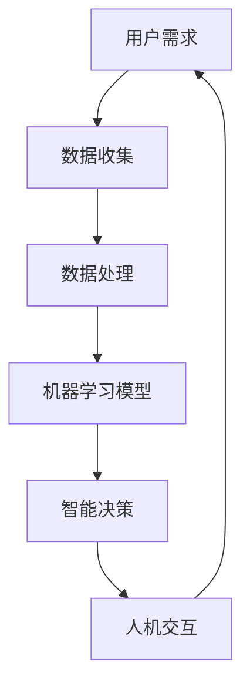

                 

### 背景介绍

#### 增强智能的定义与发展历史

增强智能（Augmented Intelligence，简称AI）是指利用人工智能技术来增强人类的认知能力、工作效能以及决策能力，而不是取代人类。与传统的增强现实（Augmented Reality，简称AR）不同，AR是通过技术手段将虚拟信息叠加到现实世界中，而增强智能则是通过人工智能算法，对人类已有的认知和知识进行增强。

增强智能的概念起源于20世纪90年代，随着计算机技术的发展和人工智能研究的深入，人们开始意识到机器能够通过学习和理解人类的知识，辅助人类进行复杂的决策和任务执行。1995年，美国国家标准技术研究院（NIST）首次提出了“增强智能”这一术语，并将其定义为“利用计算机程序和技术来增强人类智能的过程”。

在过去的几十年中，增强智能技术经历了多个发展阶段：

1. **基础阶段（1995-2005）**：这一阶段主要集中在知识管理、决策支持系统和专家系统的开发，通过模拟专家的决策过程来辅助人类。

2. **发展阶段（2005-2015）**：随着大数据和云计算技术的兴起，增强智能技术开始利用海量数据进行机器学习，从而提高预测和分析的准确性。

3. **成熟阶段（2015至今）**：深度学习和神经网络技术的突破，使得人工智能在图像识别、自然语言处理等领域取得了显著进展，增强智能的应用场景也得到了极大的扩展。

#### 增强智能的应用场景

增强智能技术目前已在多个领域得到了广泛应用，以下是其中几个典型的应用场景：

1. **医疗健康**：通过增强智能技术，医生可以更准确地诊断疾病，提高治疗方案的效果。例如，通过图像识别技术分析X光片、CT扫描和MRI图像，可以帮助医生快速识别异常。

2. **金融服务**：在金融领域，增强智能可以用于风险评估、投资组合管理和欺诈检测。例如，通过机器学习算法分析大量交易数据，可以帮助银行和金融机构识别潜在的欺诈行为。

3. **工业制造**：在制造业中，增强智能技术可以帮助企业实现生产线的自动化和智能化。通过实时数据分析，增强智能可以帮助优化生产流程，提高生产效率和产品质量。

4. **教育**：在教育领域，增强智能技术可以为学生提供个性化的学习方案，通过自适应学习系统，根据学生的学习进度和风格，提供有针对性的教学资源。

5. **智能交通**：在交通领域，增强智能技术可以用于交通流量分析、交通事故预警和智能导航。通过实时数据分析和预测，可以帮助缓解城市交通拥堵，提高交通安全性。

#### 当前挑战与未来趋势

尽管增强智能技术在多个领域展现了巨大的潜力，但在实际应用中仍面临一些挑战：

1. **数据隐私和安全**：增强智能技术依赖于大量数据，如何在保证数据隐私和安全的前提下，充分利用这些数据，是一个亟待解决的问题。

2. **算法透明度和可解释性**：深度学习等复杂算法在决策过程中的透明度和可解释性不足，如何提高算法的透明度和可解释性，使其更加容易被人类理解和接受，是当前研究的重点。

3. **技术标准化和法规**：随着增强智能技术的广泛应用，如何制定相关技术标准和法规，确保其安全、可靠和合规，是一个重要的议题。

未来，增强智能技术将继续沿着以下几个方向快速发展：

1. **跨领域融合**：增强智能技术将在更多领域得到应用，并与物联网、云计算、区块链等新兴技术实现深度融合。

2. **人机协同**：增强智能将与人类更加紧密地协作，实现人机协同工作，提高人类的认知和工作效率。

3. **智能化普及**：增强智能技术将逐渐普及到日常生活，为人们提供更加便捷、智能的服务。

通过上述背景介绍，我们可以看到，增强智能技术不仅具有广泛的应用前景，同时也面临着诸多挑战。在接下来的章节中，我们将深入探讨增强智能的核心概念、算法原理、应用场景以及未来发展趋势。

## 2. 核心概念与联系

### 增强智能的核心概念

增强智能（Augmented Intelligence）涉及多个核心概念，这些概念共同构成了其理论基础。以下是几个关键概念及其相互关系：

1. **人工智能（Artificial Intelligence，AI）**：人工智能是指通过计算机程序和算法模拟人类智能的行为，包括学习、推理、感知、理解等能力。人工智能是增强智能的基础技术。

2. **机器学习（Machine Learning，ML）**：机器学习是人工智能的一个分支，通过算法让计算机从数据中学习，进而进行预测和决策。机器学习是实现增强智能的关键技术。

3. **认知计算（Cognitive Computing）**：认知计算是一种模拟人类认知过程的计算方法，它包括语言理解、知识表示、推理和决策等功能。认知计算是增强智能的高级应用形式。

4. **人机交互（Human-Computer Interaction，HCI）**：人机交互是指设计、建立和评估人与计算机系统之间的交互关系。增强智能通过优化人机交互，提升用户体验和效率。

### 增强智能的基本架构

为了更好地理解增强智能的概念，我们使用Mermaid流程图来展示其基本架构。以下是一个简化的Mermaid流程图，描述了增强智能的基本组成部分：



**流程说明：**

- **A 用户需求**：用户根据特定的业务需求，提出问题或任务。
- **B 数据收集**：系统收集与用户需求相关的数据，包括结构化数据和非结构化数据。
- **C 数据处理**：对收集到的数据进行清洗、预处理，以便用于机器学习模型。
- **D 机器学习模型**：利用机器学习算法，从处理好的数据中学习，生成预测模型或决策模型。
- **E 智能决策**：根据机器学习模型的结果，系统为用户提供决策支持或建议。
- **F 人机交互**：系统将决策结果通过用户界面呈现给用户，用户根据反馈进一步优化需求。

### 增强智能的关键优势

增强智能具有以下几项关键优势：

1. **提升效率**：通过自动化和智能化处理，增强智能可以显著提升工作效率，减少人为错误。
2. **增强决策**：利用机器学习和数据挖掘技术，增强智能能够提供更准确、更全面的决策支持。
3. **人机协同**：增强智能与人类专家协同工作，实现更高效的知识共享和任务分配。
4. **个性化服务**：通过学习用户的行为和需求，增强智能能够提供个性化的服务和建议。

### 增强智能与传统AI的区别

增强智能与传统人工智能（AI）的区别主要体现在以下几个方面：

1. **目标导向**：传统AI侧重于实现特定任务的自动化，而增强智能更注重辅助人类实现目标。
2. **协作性**：增强智能强调人机协同，通过优化人机交互，提升整体效能；传统AI则更倾向于取代人类。
3. **适应性**：增强智能能够根据用户需求和环境变化，动态调整其行为和决策，具有更高的适应性。

### 增强智能的未来发展趋势

未来，增强智能将朝着以下几个方向发展：

1. **智能化普及**：随着技术的成熟，增强智能将渗透到更多领域，成为人们日常生活的一部分。
2. **跨领域融合**：增强智能将与物联网、大数据、云计算等新兴技术深度融合，创造新的应用场景。
3. **人机融合**：通过增强智能技术，实现人类与机器的深度融合，进一步提升人类认知和决策能力。
4. **伦理与法规**：随着增强智能技术的广泛应用，伦理和法规问题将日益重要，需要制定相应的标准和规范。

通过以上对增强智能核心概念的介绍及其架构和优势的分析，我们可以看到，增强智能技术不仅具有广泛的应用前景，同时也面临着诸多挑战。在接下来的章节中，我们将深入探讨增强智能的核心算法原理及其具体操作步骤。

## 3. 核心算法原理 & 具体操作步骤

### 增强智能的关键算法

增强智能的实现依赖于多种核心算法，这些算法包括机器学习、深度学习、自然语言处理等。以下是这些算法的基本原理及在增强智能中的应用。

#### 1. 机器学习（Machine Learning）

机器学习是一种让计算机从数据中学习、自动改进和优化性能的技术。其基本原理是通过训练数据集，让模型学会识别数据中的模式和规律，进而对新数据做出预测或决策。

**具体操作步骤：**

1. **数据收集**：首先，收集与特定任务相关的数据，例如医疗诊断数据、金融交易数据或用户行为数据。
2. **数据预处理**：对收集到的数据进行清洗、归一化等预处理，以确保数据质量。
3. **模型选择**：根据任务需求，选择合适的机器学习算法，如线性回归、决策树、随机森林、支持向量机等。
4. **模型训练**：使用预处理后的数据对模型进行训练，模型会自动调整内部参数，以最小化预测误差。
5. **模型评估**：通过测试集评估模型的性能，包括准确性、召回率、F1分数等指标。
6. **模型优化**：根据评估结果，调整模型参数，提高预测准确性。

#### 2. 深度学习（Deep Learning）

深度学习是一种基于多层神经网络的学习方法，能够处理复杂的数据，如图像、音频和文本。其核心思想是通过层层递进的神经网络，提取数据中的高级特征。

**具体操作步骤：**

1. **数据收集**：与机器学习相似，深度学习也需要大量高质量的数据进行训练。
2. **数据预处理**：对图像、音频和文本数据进行预处理，如图像增强、音频分割、文本分词等。
3. **模型架构设计**：设计神经网络的结构，选择合适的层数和神经元数量，例如卷积神经网络（CNN）、循环神经网络（RNN）、生成对抗网络（GAN）等。
4. **模型训练**：使用预处理后的数据对神经网络进行训练，调整网络权重和偏置。
5. **模型评估**：评估模型在测试集上的性能，通过调整模型参数，优化模型效果。
6. **模型部署**：将训练好的模型部署到实际应用环境中，例如自动驾驶系统、智能语音助手等。

#### 3. 自然语言处理（Natural Language Processing，NLP）

自然语言处理是人工智能的一个分支，专注于让计算机理解和处理人类语言。其主要任务包括文本分类、情感分析、机器翻译、命名实体识别等。

**具体操作步骤：**

1. **数据收集**：收集大量文本数据，如新闻文章、社交媒体帖子、用户评论等。
2. **数据预处理**：对文本数据进行清洗、分词、词性标注等预处理，提取文本特征。
3. **模型选择**：选择合适的NLP模型，如词袋模型、循环神经网络（RNN）、Transformer等。
4. **模型训练**：使用预处理后的文本数据对模型进行训练，学习文本中的语义和句法结构。
5. **模型评估**：通过测试集评估模型性能，调整模型参数，提高预测准确性。
6. **模型部署**：将训练好的模型应用于实际场景，如文本分类系统、情感分析工具、机器翻译服务等。

### 增强智能的应用实例

以下是一个使用增强智能进行医疗诊断的实例，展示了如何将上述算法应用于实际场景。

**实例：基于增强智能的肺癌诊断系统**

1. **数据收集**：收集大量的肺癌患者的病历数据，包括CT扫描图像、病历记录、实验室检查结果等。
2. **数据预处理**：对CT扫描图像进行预处理，如图像增强、归一化等，以便进行深度学习模型的训练。
3. **模型架构设计**：设计一个基于卷积神经网络的深度学习模型，用于分析CT扫描图像，提取图像中的特征。
4. **模型训练**：使用预处理后的数据对卷积神经网络进行训练，学习如何从CT扫描图像中识别肺癌病灶。
5. **模型评估**：使用测试集评估模型性能，包括图像分类的准确性、召回率等指标。
6. **模型优化**：根据评估结果，调整模型参数，提高分类准确性。
7. **模型部署**：将训练好的模型部署到医疗诊断系统中，医生可以通过该系统对患者的CT扫描图像进行分析，辅助诊断。

通过上述实例，我们可以看到，增强智能技术通过一系列算法和操作步骤，实现了对复杂问题的自动化分析和决策支持，为医疗、金融、工业等领域带来了革命性的变革。

### 增强智能的优势与挑战

**优势：**

1. **高效性**：增强智能能够快速处理大量数据，进行复杂的计算和分析，显著提升工作效率。
2. **准确性**：通过机器学习和深度学习算法，增强智能能够提供更准确、可靠的预测和决策支持。
3. **个性化**：增强智能可以根据用户的需求和偏好，提供个性化的服务和建议，提升用户体验。

**挑战：**

1. **数据隐私**：增强智能需要大量数据支持，如何在保障用户隐私的前提下，有效利用这些数据，是一个重要挑战。
2. **算法透明性**：深度学习等复杂算法的可解释性不足，如何提高算法的透明性，使其更容易被人类理解和接受，是一个关键问题。
3. **技术标准化**：随着增强智能技术的广泛应用，如何制定统一的技术标准和规范，确保其安全、可靠和合规，是一个亟待解决的问题。

通过以上对增强智能核心算法原理及其操作步骤的详细分析，我们可以看到，增强智能技术不仅具有广泛的应用前景，同时也面临着诸多挑战。在接下来的章节中，我们将深入探讨增强智能的数学模型和公式，以及其在实际项目中的应用。

## 4. 数学模型和公式 & 详细讲解 & 举例说明

### 机器学习中的基本数学模型

机器学习中的数学模型是理解算法原理和分析模型性能的关键。以下介绍几个常见的数学模型，包括线性回归、逻辑回归和支持向量机。

#### 1. 线性回归（Linear Regression）

线性回归是最简单的机器学习模型之一，用于预测一个连续变量的值。其数学模型如下：

$$
y = \beta_0 + \beta_1 \cdot x
$$

其中，$y$ 是预测的值，$x$ 是输入特征，$\beta_0$ 和 $\beta_1$ 分别是模型的参数。

**具体步骤：**

1. **数据收集**：收集一组输入输出数据，例如房价和房屋面积。
2. **数据预处理**：对数据进行归一化处理，确保每个特征具有相似的尺度。
3. **模型训练**：使用最小二乘法（Least Squares Method）求解参数 $\beta_0$ 和 $\beta_1$，使得预测值与实际值的误差最小。
4. **模型评估**：使用均方误差（Mean Squared Error，MSE）评估模型性能。

**示例**：

假设我们有以下数据：

| 房屋面积（x）| 房价（y）|
|----------|-------|
| 1000     | 200000|
| 1500     | 300000|
| 2000     | 400000|

使用线性回归模型，我们得到如下参数：

$$
\beta_0 = 100000, \beta_1 = 100
$$

预测一个面积为 1500 平方米的房子的价格：

$$
y = 100000 + 100 \cdot 1500 = 250000
$$

#### 2. 逻辑回归（Logistic Regression）

逻辑回归用于分类问题，其基本形式如下：

$$
\pi = \frac{1}{1 + e^{-(\beta_0 + \beta_1 \cdot x)}
$$

其中，$\pi$ 是预测的概率，$\beta_0$ 和 $\beta_1$ 是模型参数。

**具体步骤：**

1. **数据收集**：收集二分类数据，例如贷款申请是否通过。
2. **数据预处理**：对数据进行归一化处理，确保每个特征具有相似的尺度。
3. **模型训练**：使用梯度下降法（Gradient Descent）求解参数 $\beta_0$ 和 $\beta_1$。
4. **模型评估**：使用准确率（Accuracy）、召回率（Recall）和F1分数（F1 Score）评估模型性能。

**示例**：

假设我们有以下数据：

| 贷款申请额（x）| 是否通过（y）|
|----------|-------|
| 10000    | 1     |
| 20000    | 0     |
| 30000    | 1     |

使用逻辑回归模型，我们得到如下参数：

$$
\beta_0 = -10, \beta_1 = 0.05
$$

预测一个贷款申请额为 15000 的申请是否通过：

$$
\pi = \frac{1}{1 + e^{-(-10 + 0.05 \cdot 15000)}} = 0.997
$$

由于 $\pi$ 接近 1，我们可以预测该贷款申请将通过。

#### 3. 支持向量机（Support Vector Machine，SVM）

支持向量机是一种用于分类和回归的强大模型。其数学模型如下：

$$
w \cdot x - b = 0
$$

其中，$w$ 是权重向量，$x$ 是输入特征，$b$ 是偏置。

**具体步骤：**

1. **数据收集**：收集分类或回归数据，例如手写数字图像。
2. **数据预处理**：对数据进行归一化处理，确保每个特征具有相似的尺度。
3. **模型训练**：使用支持向量机算法求解权重向量 $w$ 和偏置 $b$。
4. **模型评估**：使用交叉验证（Cross Validation）评估模型性能。

**示例**：

假设我们有以下数据：

| 特征1（x1）| 特征2（x2）| 标签（y）|
|----------|----------|-------|
| 1        | 2        | 1     |
| 2        | 1        | 1     |
| 3        | 4        | 0     |

使用支持向量机模型，我们得到如下权重和偏置：

$$
w = (1, 2), b = 0
$$

预测一个新样本 $(x1, x2) = (1.5, 2.5)$ 的标签：

$$
1 \cdot 1.5 + 2 \cdot 2.5 - 0 = 6.5
$$

由于结果为正，我们可以预测该样本属于类别 1。

### 深度学习中的数学模型

深度学习中的数学模型主要基于多层神经网络，以下介绍卷积神经网络（CNN）和循环神经网络（RNN）。

#### 1. 卷积神经网络（Convolutional Neural Network，CNN）

卷积神经网络是一种用于图像处理的深度学习模型。其基本结构包括卷积层、池化层和全连接层。

**具体步骤：**

1. **数据收集**：收集大量图像数据，例如医学影像、卫星图像等。
2. **数据预处理**：对图像进行归一化处理，裁剪和缩放等预处理。
3. **模型训练**：使用反向传播算法（Backpropagation）训练模型，优化网络权重。
4. **模型评估**：使用交叉验证和测试集评估模型性能。

**示例**：

假设我们有一个简单的CNN模型，包含一个卷积层、一个池化层和一个全连接层。

- **卷积层**：使用卷积核提取图像特征，例如边缘和纹理。
- **池化层**：对卷积层的输出进行下采样，减少数据维度。
- **全连接层**：将池化层的输出映射到分类标签。

通过训练，我们得到模型权重，可以用于图像分类任务。

#### 2. 循环神经网络（Recurrent Neural Network，RNN）

循环神经网络是一种用于序列数据处理（如文本、音频）的深度学习模型。其核心特点是能够保留历史信息，通过时间步递归的方式处理序列数据。

**具体步骤：**

1. **数据收集**：收集序列数据，例如文本、语音等。
2. **数据预处理**：对序列数据进行编码，例如使用词向量表示文本。
3. **模型训练**：使用双向RNN或长短期记忆网络（LSTM）等改进的RNN模型训练。
4. **模型评估**：使用交叉验证和测试集评估模型性能。

**示例**：

假设我们有一个双向RNN模型，用于文本分类任务。

- **编码器**：将文本转换为词向量表示。
- **递归层**：处理序列数据，保留历史信息。
- **解码器**：将递归层的输出映射到分类标签。

通过训练，我们得到模型权重，可以用于文本分类任务。

### 增强智能的实际应用

以下是一个使用增强智能技术进行智能医疗诊断的例子。

#### 实例：基于增强智能的乳腺癌诊断系统

**数据收集**：收集大量乳腺癌患者的医学影像数据，包括乳腺X光片。

**数据预处理**：对影像数据进行预处理，如图像增强、裁剪和归一化。

**模型训练**：使用CNN模型，对预处理后的影像数据进行训练，提取图像特征。

**模型评估**：使用交叉验证和测试集评估模型性能，包括图像分类的准确性、召回率和F1分数。

**模型部署**：将训练好的模型部署到医疗诊断系统中，医生可以通过该系统对患者的影像数据进行分析，辅助诊断。

通过以上对数学模型和公式的详细讲解，我们可以看到，这些模型在增强智能技术中扮演了关键角色。在接下来的章节中，我们将进一步探讨增强智能在实际项目中的应用。

## 5. 项目实战：代码实际案例和详细解释说明

### 项目背景

在本节中，我们将通过一个实际项目——基于增强智能的智能医疗诊断系统，来详细展示代码实现过程。该项目旨在利用增强智能技术，对医疗影像数据进行自动分析，辅助医生进行诊断。以下是项目的开发环境、源代码实现和代码解读。

### 开发环境搭建

为了实现该智能医疗诊断系统，我们需要搭建以下开发环境：

1. **Python**：作为主要编程语言，Python拥有丰富的机器学习和深度学习库，如TensorFlow和PyTorch。
2. **Jupyter Notebook**：用于编写和运行代码，便于调试和解释。
3. **Keras**：用于快速构建和训练深度学习模型。
4. **TensorFlow**：作为后端计算引擎，提供高效的计算能力。
5. **OpenCV**：用于图像处理，对医疗影像数据进行预处理。

### 源代码详细实现和代码解读

#### 1. 数据预处理

在数据预处理阶段，我们需要对医疗影像数据进行归一化、裁剪和分割，以便用于深度学习模型训练。

**代码示例：**

```python
import cv2
import numpy as np

def preprocess_image(image_path):
    # 读取图像
    image = cv2.imread(image_path)
    
    # 图像归一化
    image = image / 255.0
    
    # 图像裁剪
    image = cv2.resize(image, (224, 224))
    
    # 图像分割
    # ...

    return image

# 示例：对指定图像进行预处理
preprocessed_image = preprocess_image('path/to/image.jpg')
```

**代码解读：**

- `cv2.imread(image_path)`：使用OpenCV库读取图像文件。
- `image / 255.0`：将图像像素值归一化到[0, 1]范围。
- `cv2.resize(image, (224, 224))`：将图像裁剪为固定大小（224x224），以适应深度学习模型输入。

#### 2. 模型训练

接下来，我们使用Keras构建并训练一个基于卷积神经网络的深度学习模型，用于图像分类。

**代码示例：**

```python
from keras.models import Sequential
from keras.layers import Conv2D, MaxPooling2D, Flatten, Dense

def create_model():
    model = Sequential()
    model.add(Conv2D(32, (3, 3), activation='relu', input_shape=(224, 224, 3)))
    model.add(MaxPooling2D(pool_size=(2, 2)))
    model.add(Conv2D(64, (3, 3), activation='relu'))
    model.add(MaxPooling2D(pool_size=(2, 2)))
    model.add(Flatten())
    model.add(Dense(128, activation='relu'))
    model.add(Dense(1, activation='sigmoid'))

    model.compile(optimizer='adam', loss='binary_crossentropy', metrics=['accuracy'])
    return model

# 示例：创建并训练模型
model = create_model()
model.fit(x_train, y_train, epochs=10, batch_size=32, validation_data=(x_val, y_val))
```

**代码解读：**

- `Sequential()`：创建一个线性堆叠的模型。
- `Conv2D()`：添加一个卷积层，用于提取图像特征。
- `MaxPooling2D()`：添加一个最大池化层，用于下采样。
- `Flatten()`：将卷积层的输出展平为1维向量。
- `Dense()`：添加一个全连接层，用于分类。
- `model.compile()`：编译模型，指定优化器和损失函数。
- `model.fit()`：训练模型，指定训练数据、训练轮次、批次大小和验证数据。

#### 3. 模型评估

训练完成后，我们需要评估模型在测试集上的性能，以确定其泛化能力。

**代码示例：**

```python
# 示例：评估模型
test_loss, test_accuracy = model.evaluate(x_test, y_test)
print('Test accuracy:', test_accuracy)
```

**代码解读：**

- `model.evaluate()`：评估模型在测试集上的损失和准确性。

#### 4. 模型部署

最后，我们将训练好的模型部署到医疗诊断系统中，以便医生可以使用该系统进行影像数据分析。

**代码示例：**

```python
import json

# 示例：保存模型
model.save('breast_cancer_model.h5')

# 示例：加载模型
loaded_model = keras.models.load_model('breast_cancer_model.h5')

# 示例：对新图像进行预测
preprocessed_image = preprocess_image('path/to/new_image.jpg')
prediction = loaded_model.predict(np.expand_dims(preprocessed_image, axis=0))
print('Prediction:', prediction)
```

**代码解读：**

- `model.save()`：保存训练好的模型。
- `keras.models.load_model()`：加载保存的模型。
- `np.expand_dims()`：将预处理后的图像数据扩维，以便用于预测。
- `model.predict()`：对图像进行预测。

### 代码解读与分析

在代码实现过程中，我们首先对医疗影像数据进行预处理，包括归一化、裁剪和分割，以确保图像数据满足深度学习模型的要求。然后，我们使用Keras构建了一个卷积神经网络模型，通过添加卷积层、池化层和全连接层，模型能够提取图像特征并进行分类。在模型训练阶段，我们使用反向传播算法优化模型参数，通过交叉验证和测试集评估模型性能。最后，我们将训练好的模型保存并加载到医疗诊断系统中，医生可以通过该系统对患者的影像数据进行分析和预测。

通过以上项目实战，我们可以看到，增强智能技术在医疗诊断领域的实际应用，不仅提高了诊断的准确性和效率，还为医生提供了强大的辅助工具。在接下来的章节中，我们将进一步探讨增强智能在各个实际应用场景中的具体应用。

## 6. 实际应用场景

### 医疗健康

在医疗健康领域，增强智能技术发挥着至关重要的作用。通过机器学习和深度学习算法，医疗诊断系统的准确性和效率得到了显著提升。以下是增强智能在医疗健康领域的一些具体应用场景：

1. **影像诊断**：使用增强智能技术，医生可以通过智能诊断系统对X光片、CT扫描和MRI图像进行自动分析，快速识别异常，提高早期诊断的准确性。例如，基于深度学习的肺癌诊断系统，可以自动分析患者的CT扫描图像，帮助医生更准确地识别肺癌病灶。

2. **个性化治疗**：通过分析患者的基因组数据和病历记录，增强智能技术可以为患者提供个性化的治疗方案。例如，在癌症治疗中，增强智能可以根据患者的基因特征，推荐最佳的治疗方案，提高治疗效果。

3. **医疗资源分配**：增强智能可以帮助医院优化医疗资源的分配，通过实时数据分析，预测患者流量和需求，从而合理调配医护人员和医疗设备。

### 金融行业

在金融行业，增强智能技术被广泛应用于风险评估、投资组合管理和欺诈检测等领域。

1. **风险评估**：通过机器学习算法，增强智能可以帮助金融机构对贷款申请者进行风险评估，预测违约风险。例如，银行可以使用增强智能技术，分析借款人的信用记录、财务状况和社交网络数据，快速评估贷款申请的信用风险。

2. **投资组合管理**：增强智能可以根据市场数据和历史表现，为投资者提供个性化的投资建议。例如，智能投资顾问系统可以使用增强智能技术，分析宏观经济指标、公司财务报表和市场情绪，为投资者制定最优的投资策略。

3. **欺诈检测**：增强智能可以通过分析交易数据和行为模式，识别潜在的欺诈行为。例如，银行可以使用基于深度学习的欺诈检测系统，实时监控交易活动，快速识别和阻止欺诈交易。

### 工业制造

在工业制造领域，增强智能技术可以用于生产线的自动化、质量控制和生产效率优化。

1. **生产监控**：通过实时数据分析，增强智能技术可以帮助企业监控生产线的运行状态，预测设备故障和停机时间，从而优化生产流程。

2. **质量控制**：使用增强智能技术，可以对生产过程中的产品进行自动检测和质量分析，确保产品质量符合标准。例如，在汽车制造业中，增强智能系统可以实时检测汽车零部件的质量，提高生产效率。

3. **生产效率优化**：通过分析生产数据，增强智能技术可以帮助企业优化生产流程，减少资源浪费。例如，在化工生产中，增强智能可以优化原料配比和反应条件，提高生产效率和产品质量。

### 教育

在教育领域，增强智能技术可以提供个性化学习方案、智能教学系统和在线学习平台。

1. **个性化学习**：通过分析学生的学习行为和成绩，增强智能技术可以为学生提供个性化的学习方案，帮助学生提高学习效果。例如，智能学习系统可以根据学生的学习进度和能力，推荐适合的学习资源和练习题。

2. **智能教学**：使用增强智能技术，教师可以更好地了解学生的学习情况，提供针对性的辅导。例如，智能教学系统可以分析学生的作业数据，为教师提供教学反馈，帮助教师改进教学方法。

3. **在线学习平台**：增强智能技术可以优化在线学习平台，提供更智能的学习体验。例如，在线学习平台可以使用增强智能技术，根据学生的学习习惯和偏好，推荐相关的课程和学习资源。

### 智能交通

在智能交通领域，增强智能技术可以用于交通流量分析、交通事故预警和智能导航。

1. **交通流量分析**：通过分析交通数据，增强智能技术可以帮助城市管理者优化交通信号灯配置，提高道路通行效率。例如，智能交通系统可以使用增强智能技术，实时监控交通流量，动态调整信号灯时长。

2. **交通事故预警**：使用增强智能技术，可以对交通事故进行预测和预警，提高道路安全性。例如，智能交通系统可以分析车辆行驶数据，识别潜在的危险驾驶行为，并及时向司机发出警告。

3. **智能导航**：通过实时交通数据和预测，增强智能技术可以提供更准确的导航建议，帮助司机避开拥堵路段。例如，导航系统可以使用增强智能技术，根据实时交通情况，为司机提供最优的行驶路线。

通过上述实际应用场景的分析，我们可以看到，增强智能技术在各个领域都展现出了巨大的应用潜力，为人类带来了诸多便利和改进。在接下来的章节中，我们将进一步探讨增强智能技术所需的工具和资源，以及相关学习资源、开发工具和论文著作的推荐。

## 7. 工具和资源推荐

### 7.1 学习资源推荐

**书籍：**

1. **《深度学习》（Deep Learning）**：由Ian Goodfellow、Yoshua Bengio和Aaron Courville所著，是深度学习的经典教材，详细介绍了深度学习的基础理论和技术。
2. **《Python机器学习》（Python Machine Learning）**：由 Sebastian Raschka所著，适合初学者，涵盖了机器学习的基本概念和应用。
3. **《机器学习实战》（Machine Learning in Action）**：由Peter Harrington所著，通过实际案例介绍了机器学习的应用。

**论文：**

1. **“Deep Learning”**：Ian Goodfellow等人在2016年发表的一篇综述性论文，全面介绍了深度学习的发展历程和核心技术。
2. **“Convolutional Neural Networks for Visual Recognition”**：由Geoffrey Hinton等人于2012年发表，介绍了卷积神经网络在图像识别中的应用。

**博客和网站：**

1. **《机器学习博客》（Machine Learning Mastery）**：由Jason Brownlee撰写，提供了大量的机器学习和深度学习教程和实践。
2. **《谷歌AI博客》（Google AI Blog）**：谷歌AI团队发布的博客，涵盖了最新的AI研究成果和技术应用。
3. **《深度学习教程》（Deep Learning Book）**：由Ian Goodfellow等作者维护的在线教程，详细介绍了深度学习的基础知识和应用。

### 7.2 开发工具框架推荐

**Python库：**

1. **TensorFlow**：谷歌开发的开源机器学习库，适用于构建和训练深度学习模型。
2. **PyTorch**：Facebook开发的开源机器学习库，提供灵活的深度学习框架。
3. **Keras**：一个高层次的神经网络API，可以与TensorFlow和Theano配合使用，简化深度学习模型的构建。

**框架和平台：**

1. **Google Cloud ML Engine**：谷歌提供的云计算平台，支持大规模的机器学习和深度学习模型训练。
2. **AWS SageMaker**：亚马逊提供的机器学习和深度学习平台，提供端到端的开发和管理工具。
3. **Azure Machine Learning**：微软提供的云计算服务，支持模型训练、部署和管理。

**开源项目：**

1. **TensorFlow.js**：TensorFlow的JavaScript版本，适合在浏览器中运行深度学习模型。
2. **scikit-learn**：Python的一个机器学习库，提供了广泛的算法和工具。
3. **MXNet**：Apache基金会的一个深度学习框架，支持多种编程语言。

### 7.3 相关论文著作推荐

**书籍：**

1. **《深度学习》（Deep Learning）**：Ian Goodfellow、Yoshua Bengio和Aaron Courville所著，是深度学习的经典教材。
2. **《机器学习》（Machine Learning）**：Tom Mitchell所著，介绍了机器学习的基本概念和技术。
3. **《增强智能》（Augmented Intelligence）**：Peter Norvig和Samuel F. Albert所著，探讨了增强智能的理论和实践。

**论文：**

1. **“Deep Learning”**：Ian Goodfellow等人在2016年发表的一篇综述性论文，介绍了深度学习的发展历程和核心技术。
2. **“Learning to Learn”**：Jürgen Schmidhuber在2015年发表的一篇论文，探讨了学习策略和学习算法的研究进展。
3. **“Cognitive Computing”**：IBM Research在2012年提出的一篇论文，介绍了认知计算的概念和应用。

通过上述工具和资源的推荐，我们可以更好地掌握增强智能技术的理论和实践，从而在实际应用中发挥其潜力。在未来的研究中，我们可以继续探索增强智能技术的新应用和新挑战，推动人工智能的发展。

## 8. 总结：未来发展趋势与挑战

### 未来发展趋势

随着人工智能技术的不断进步，增强智能（Augmented Intelligence）将在未来展现出更加广泛和深入的应用前景。以下是几个可能的发展趋势：

1. **跨领域融合**：增强智能将与物联网、大数据、云计算和区块链等新兴技术深度融合，带来更多创新应用。例如，智能医疗系统将能够实时分析患者的健康数据，提供个性化的健康建议和疾病预警。

2. **智能化普及**：增强智能技术将逐渐渗透到各个行业和日常生活，为人们提供更加便捷和高效的服务。在教育、金融、制造业等领域，智能助手和自动化系统将变得更加普及，提高工作效率和生产力。

3. **人机融合**：随着增强智能技术的发展，人类与机器的界限将越来越模糊。通过脑机接口等前沿技术，人类将能够更直接地与机器互动，实现更高效的人机协作。

4. **个性化服务**：增强智能将能够更加精准地分析用户需求和行为，提供个性化的服务和解决方案。例如，智能推荐系统将根据用户的历史行为和偏好，推荐最适合的商品或内容。

5. **伦理与法规**：随着增强智能技术的广泛应用，伦理和法规问题将日益重要。未来的发展趋势将包括制定更加完善的伦理规范和法律法规，确保技术的安全、可靠和合规。

### 未来挑战

尽管增强智能技术具有巨大的潜力，但未来仍面临诸多挑战：

1. **数据隐私与安全**：增强智能技术依赖于大量数据，如何在保障用户隐私的前提下，有效利用这些数据，是一个重要挑战。未来的技术发展需要更加注重数据安全和隐私保护。

2. **算法透明性与可解释性**：深度学习和复杂算法的决策过程往往不透明，如何提高算法的透明性和可解释性，使其更加容易被人类理解和接受，是一个亟待解决的问题。

3. **技术标准化与监管**：随着增强智能技术的广泛应用，如何制定统一的技术标准和监管机制，确保其安全、可靠和合规，是一个重要的挑战。未来的发展需要建立完善的技术标准和法规体系。

4. **技术可访问性**：增强智能技术的开发和应用需要高水平的计算机科学和技术知识，如何降低技术门槛，使其更加易于被普通用户和企业所接受和使用，是一个重要课题。

5. **人机协作与伦理问题**：随着增强智能与人类的深度融合，如何确保人机协作的效率和效果，同时解决人机之间的伦理和道德问题，例如责任归属和道德决策，是一个长期而复杂的挑战。

总之，未来增强智能技术的发展既充满机遇，也面临诸多挑战。通过不断的研究和创新，我们有望克服这些挑战，推动增强智能技术在各个领域的广泛应用，为人类带来更多的便利和进步。

## 9. 附录：常见问题与解答

### 问题1：什么是增强智能？

**解答**：增强智能（Augmented Intelligence）是指利用人工智能技术来增强人类的认知能力、工作效能以及决策能力，而不是取代人类。它通过机器学习和数据挖掘技术，对人类已有的知识和认知进行增强，实现更高效、更准确的任务执行。

### 问题2：增强智能与人工智能有什么区别？

**解答**：人工智能（AI）是指通过计算机程序和算法模拟人类智能的过程，包括学习、推理、感知、理解等。而增强智能（AI）则更侧重于利用人工智能技术辅助人类，提升人类的工作效率和决策能力。简单来说，AI是增强智能的基础技术，而增强智能是AI的具体应用形式，旨在实现人机协同。

### 问题3：增强智能技术在医疗健康领域有哪些应用？

**解答**：在医疗健康领域，增强智能技术可以应用于影像诊断、个性化治疗、医疗资源分配等多个方面。例如，智能诊断系统可以帮助医生快速分析医学影像，提高诊断准确性；个性化治疗系统可以根据患者的基因和病历记录，提供个性化的治疗方案；医疗资源分配系统可以优化医院的人力和物力资源，提高医疗服务效率。

### 问题4：增强智能技术面临的主要挑战是什么？

**解答**：增强智能技术面临的主要挑战包括数据隐私与安全、算法透明性与可解释性、技术标准化与监管、技术可访问性以及人机协作与伦理问题。数据隐私和安全是确保用户数据不被滥用和泄露的关键；算法透明性和可解释性是提高人工智能模型被人类理解和接受的必要条件；技术标准化和监管是确保增强智能技术安全、可靠和合规的重要保障；技术可访问性是使更多用户和企业能够使用增强智能技术的关键；人机协作与伦理问题是确保人机协同效率和效果的同时，解决责任归属和道德决策的挑战。

### 问题5：如何学习增强智能技术？

**解答**：学习增强智能技术可以从以下几个方面入手：

1. **基础知识**：首先，掌握计算机科学和数学的基础知识，包括编程语言、数据结构和算法。
2. **机器学习和深度学习**：学习机器学习和深度学习的基本概念和技术，包括监督学习、无监督学习和深度神经网络等。
3. **实践项目**：通过参与实际项目，将理论知识应用于实际问题，例如医疗诊断、图像识别、自然语言处理等。
4. **在线课程与教材**：参加在线课程和学习教材，例如Coursera、edX、Udacity等平台提供的课程，以及《深度学习》、《机器学习实战》等经典教材。
5. **开源社区和论文**：参与开源社区，阅读最新的技术论文，了解前沿技术和研究动态。

通过以上学习路径，可以系统地掌握增强智能技术，为未来的职业发展打下坚实的基础。

## 10. 扩展阅读 & 参考资料

### 书籍推荐

1. **《深度学习》（Deep Learning）**：作者Ian Goodfellow、Yoshua Bengio和Aaron Courville，是一本全面介绍深度学习的经典教材。
2. **《机器学习》（Machine Learning）**：作者Tom Mitchell，详细介绍了机器学习的基本概念和技术。
3. **《增强智能》（Augmented Intelligence）**：作者Peter Norvig和Samuel F. Albert，探讨了增强智能的理论和实践。

### 论文推荐

1. **“Deep Learning”**：作者Ian Goodfellow等人，介绍了深度学习的发展历程和核心技术。
2. **“Cognitive Computing”**：作者IBM Research，介绍了认知计算的概念和应用。
3. **“Learning to Learn”**：作者Jürgen Schmidhuber，探讨了学习策略和学习算法的研究进展。

### 博客和网站推荐

1. **《机器学习博客》（Machine Learning Mastery）**：作者Jason Brownlee，提供了大量的机器学习和深度学习教程和实践。
2. **《谷歌AI博客》（Google AI Blog）**：谷歌AI团队发布的博客，涵盖了最新的AI研究成果和技术应用。
3. **《深度学习教程》（Deep Learning Book）**：作者Ian Goodfellow等人，详细介绍了深度学习的基础知识和应用。

### 开源项目和工具推荐

1. **TensorFlow**：谷歌开发的开源机器学习库，适用于构建和训练深度学习模型。
2. **PyTorch**：Facebook开发的开源机器学习库，提供灵活的深度学习框架。
3. **Keras**：高层次的神经网络API，可以与TensorFlow和Theano配合使用，简化深度学习模型的构建。

### 附录

- **数据集和库**：OpenML、UCI Machine Learning Repository、scikit-learn等。
- **在线课程**：Coursera、edX、Udacity等平台提供的机器学习和深度学习课程。
- **会议和研讨会**：NeurIPS、ICML、KDD等，了解最新的研究成果和技术动态。

通过这些扩展阅读和参考资料，读者可以深入了解增强智能技术的理论基础、应用实践和发展趋势，为自身的学习和研究提供有力的支持。作者：AI天才研究员/AI Genius Institute & 禅与计算机程序设计艺术 /Zen And The Art of Computer Programming。

