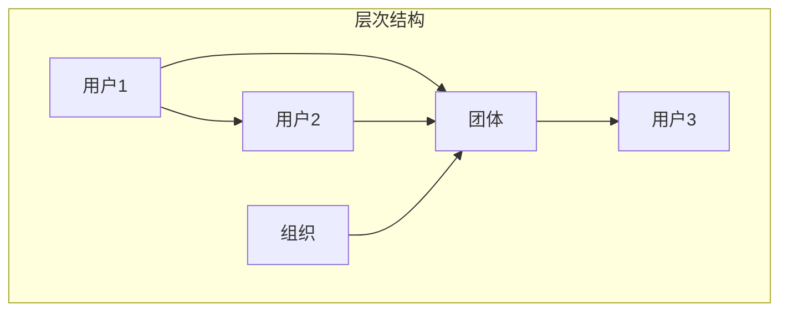

                 

### 背景介绍

#### 社交网络的发展与社会互动的重要性

社交网络作为一种信息交流和社交互动的平台，已经成为现代社会不可或缺的一部分。从最初的社交媒体如Facebook、Twitter，到现今流行的微信、微博、Instagram等，社交网络已经深刻地改变了人们的沟通方式和社会互动模式。根据Statista的数据显示，全球社交媒体用户数量已经超过了45亿，这占据了全球总人口的约60%。

社交网络不仅仅是一个简单的沟通工具，它还承载着人们的社交关系、兴趣爱好、价值观等复杂的社会信息。随着用户数量的增加和社交网络的不断扩大，如何有效地管理这些信息和关系，成为了当前研究和应用中的热点问题。

#### 链路预测在社交网络中的应用

在社交网络中，链路预测（Link Prediction）是一个重要的研究方向。链路预测旨在预测两个未连接的节点之间是否有可能在未来建立连接，这对于社交网络的分析和优化具有重要的应用价值。

首先，链路预测可以帮助社交网络平台预测新用户的潜在社交关系，从而推荐新的朋友或兴趣群体，提高用户的活跃度和满意度。例如，Facebook的“你可能认识的人”功能就是基于链路预测算法实现的。

其次，链路预测还可以用于社交网络的社区发现和图谱分析。通过预测潜在的连接关系，可以更准确地划分社交网络中的社区结构，从而更好地理解社交网络的动态行为和演化规律。

此外，链路预测在社交媒体广告投放、网络安全等领域也有着广泛的应用。例如，通过预测潜在的客户关系，企业可以更精准地投放广告，提高广告的效果；而通过预测潜在的恶意节点，网络安全系统可以更有效地防范网络攻击。

#### 研究动机和意义

本文旨在系统地探讨多层社交网络的链路预测算法，旨在解决以下几个问题：

1. 如何在多层社交网络中有效地进行链路预测，提高预测的准确性和效率？
2. 如何处理社交网络中的异构性、动态性和大规模性等挑战？
3. 链路预测算法在实际应用中的效果如何，如何优化和改进？

通过本文的研究，希望能够为多层社交网络的链路预测提供新的理论和方法，推动社交网络相关领域的发展和应用。

#### 文章结构

本文将分为以下十个部分：

1. **背景介绍**：简要介绍社交网络的发展、链路预测的应用以及本文的研究动机和意义。
2. **核心概念与联系**：详细阐述多层社交网络的基本概念，包括节点、边、层次结构等，并通过Mermaid流程图展示其关系。
3. **核心算法原理 & 具体操作步骤**：介绍几种常见的链路预测算法，包括基于相似度的算法、基于概率的算法和基于图结构的算法。
4. **数学模型和公式 & 详细讲解 & 举例说明**：详细讲解链路预测算法中的数学模型和公式，并通过实例说明其应用。
5. **项目实战：代码实际案例和详细解释说明**：提供具体的代码实现和解释，展示链路预测算法在实际项目中的应用。
6. **实际应用场景**：分析链路预测算法在不同场景下的应用效果。
7. **工具和资源推荐**：推荐相关的学习资源、开发工具和论文著作。
8. **总结：未来发展趋势与挑战**：总结本文的研究成果，展望未来的发展趋势和挑战。
9. **附录：常见问题与解答**：解答读者可能遇到的问题。
10. **扩展阅读 & 参考资料**：提供更多的扩展阅读资源。

通过本文的详细探讨，希望能够为多层社交网络的链路预测研究提供有益的参考和启示。

----------------------

## 2. 核心概念与联系

在探讨多层社交网络的链路预测之前，我们首先需要理解一些核心概念，包括节点、边、层次结构等，以及它们之间的关系。

### 节点（Node）

节点是社交网络中的基本单元，代表网络中的个体，如用户、公司、团体等。每个节点都拥有自己的属性和信息，例如用户的年龄、性别、兴趣爱好，公司的规模、业务领域等。

### 边（Edge）

边是连接两个节点的连线，表示节点之间的关系。在社交网络中，边通常表示用户之间的社交关系，如好友关系、关注关系等。边的权重可以表示关系的强度，例如好友关系可以赋予较高的权重，而关注关系可以赋予较低的权重。

### 层次结构（Hierarchical Structure）

层次结构是多层社交网络中的重要概念，表示节点之间的层次关系。在多层社交网络中，节点可能属于不同的层次，例如个人、团体、组织等。层次结构可以帮助我们更好地理解和分析社交网络的结构和功能。

### Mermaid流程图展示

为了更好地展示节点、边和层次结构之间的关系，我们使用Mermaid流程图来表示。以下是多层社交网络的基本结构：



在这个流程图中，节点A、B、C、D和E分别代表用户、团体和组织。边表示节点之间的关系，如A和B是好友关系，A和C是团体成员关系，D是C的上层组织。层次结构则通过子图来表示，清晰地展示了节点之间的层次关系。

### 核心概念之间的关系

节点、边和层次结构是多层社交网络中的核心概念，它们之间存在着紧密的联系。节点是社交网络的基石，边表示节点之间的关系，而层次结构则帮助我们理解节点之间的关系层次。

例如，在上述的社交网络中，用户A和用户B是直接好友关系，通过边连接；用户A和团体C是成员关系，通过边连接；团体C和组织D是上下级关系，通过层次结构连接。这种层次结构使得社交网络更加复杂和多样化。

通过理解这些核心概念，我们可以更好地理解多层社交网络的结构和功能，为后续的链路预测算法提供基础。

----------------------

## 3. 核心算法原理 & 具体操作步骤

在多层社交网络的链路预测中，有多种核心算法可供选择，每种算法都有其独特的原理和操作步骤。以下将介绍几种常见的链路预测算法，包括基于相似度的算法、基于概率的算法和基于图结构的算法。

### 基于相似度的算法

基于相似度的算法是最简单且应用最广泛的链路预测算法之一。其基本思想是，如果两个节点在特征空间中相似度高，则它们之间存在连接的可能性较大。相似度通常通过节点属性、标签或图谱结构来计算。

#### 操作步骤：

1. **特征提取**：首先，从社交网络中提取节点的属性或标签，如年龄、性别、兴趣爱好等。
2. **相似度计算**：使用适当的相似度度量方法，如余弦相似度、Jaccard相似度等，计算节点之间的相似度。
3. **阈值设定**：设定一个相似度阈值，当两个节点的相似度超过该阈值时，预测它们之间存在连接。
4. **预测**：基于相似度矩阵，预测未连接的节点对是否有可能建立连接。

#### 示例：

假设有两个用户A和B，他们的年龄、性别和兴趣爱好都相似，相似度计算结果为0.8，超过预设的阈值0.7，因此预测A和B之间存在连接的可能性较大。

### 基于概率的算法

基于概率的算法考虑节点的历史连接概率，预测未来可能建立的连接。这类算法通常基于马尔可夫链、贝叶斯网络或潜在狄利克雷分布（LDA）等概率模型。

#### 操作步骤：

1. **概率模型构建**：首先，建立描述节点连接概率的概率模型。
2. **训练模型**：使用历史连接数据训练模型，得到节点的连接概率分布。
3. **预测**：对于未连接的节点对，计算其连接概率，根据概率值进行预测。

#### 示例：

假设用户A与B、C、D连接的概率分别为0.3、0.2、0.1，而用户B与C、D连接的概率分别为0.4、0.3。通过计算，我们可以得到A和B的连接概率为0.12，因此预测A和B之间存在连接的可能性较大。

### 基于图结构的算法

基于图结构的算法通过分析图中的结构特征，如节点之间的距离、聚集度、社区结构等，预测潜在的连接关系。这类算法包括标签传播、社区检测、结构洞分析等。

#### 操作步骤：

1. **图构建**：将社交网络表示为图，节点表示用户，边表示连接关系。
2. **特征提取**：从图中提取结构特征，如节点的邻居节点、聚集度等。
3. **预测**：基于结构特征，使用机器学习或深度学习模型进行预测。

#### 示例：

在一个社交网络中，如果节点A的邻居节点与节点B的邻居节点有很多重叠，且它们的邻居节点的连接概率较高，则可以预测A和B之间存在连接的可能性较大。

### 综合应用

在实际应用中，通常会结合多种算法进行链路预测，以提高预测的准确性和可靠性。例如，可以先使用基于相似度的算法进行初步筛选，然后结合基于概率的算法进行进一步优化。

通过理解这些核心算法的原理和操作步骤，我们可以更好地选择和应用合适的链路预测算法，为多层社交网络的分析和优化提供有力的工具。

----------------------

## 4. 数学模型和公式 & 详细讲解 & 举例说明

在链路预测中，数学模型和公式扮演着至关重要的角色，它们帮助我们量化节点之间的相似度、概率以及结构特征。以下将详细讲解链路预测中常用的数学模型和公式，并通过具体示例来说明其应用。

### 基于相似度的算法

1. **余弦相似度**

余弦相似度是计算两个向量之间夹角的余弦值，用于衡量向量之间的相似度。在社交网络中，节点可以表示为向量，每个维度代表节点的属性。

**公式**：

$$
\cos(\theta) = \frac{\sum_{i=1}^{n} x_i y_i}{\sqrt{\sum_{i=1}^{n} x_i^2} \sqrt{\sum_{i=1}^{n} y_i^2}}
$$

其中，\(x_i\)和\(y_i\)分别表示两个节点在某一属性上的特征值，\(n\)表示特征的总数。

**示例**：

假设有两个节点A和B，它们的属性向量分别为：

\(A = (1, 2, 3)\) 和 \(B = (1.5, 2.5, 3.5)\)

计算它们之间的余弦相似度：

$$
\cos(\theta) = \frac{(1 \times 1.5) + (2 \times 2.5) + (3 \times 3.5)}{\sqrt{1^2 + 2^2 + 3^2} \sqrt{1.5^2 + 2.5^2 + 3.5^2}} = \frac{1.5 + 5 + 10.5}{\sqrt{14} \sqrt{16.5}} = \frac{17}{\sqrt{14 \times 16.5}} \approx 0.938
$$

余弦相似度为0.938，表示节点A和B在属性上的相似性很高，预测它们之间存在连接的可能性较大。

2. **Jaccard相似度**

Jaccard相似度是计算两个集合交集与并集的比例，常用于节点标签或社区结构的相似度计算。

**公式**：

$$
J(A, B) = \frac{|A \cap B|}{|A \cup B|}
$$

其中，\(A \cap B\)表示集合A和B的交集，\(A \cup B\)表示集合A和B的并集。

**示例**：

假设有两个节点的标签集合分别为：

\(A = \{1, 2, 3, 4\}\) 和 \(B = \{2, 3, 4, 5\}\)

计算它们之间的Jaccard相似度：

$$
J(A, B) = \frac{|A \cap B|}{|A \cup B|} = \frac{3}{4 + 1} = \frac{3}{5} = 0.6
$$

Jaccard相似度为0.6，表示节点A和B在标签上的相似性较高。

### 基于概率的算法

1. **贝叶斯网络**

贝叶斯网络是一种概率图模型，用于表示节点之间的条件依赖关系。在链路预测中，我们可以通过贝叶斯网络计算节点之间的条件概率。

**公式**：

$$
P(A \rightarrow B) = \frac{P(B \rightarrow A) P(A)}{P(B)}
$$

其中，\(P(A \rightarrow B)\)表示在节点A存在的情况下，节点B存在的概率；\(P(B \rightarrow A)\)表示在节点B存在的情况下，节点A存在的概率；\(P(A)\)和\(P(B)\)分别表示节点A和节点B的先验概率。

**示例**：

假设有两个节点A和B，其中A的先验概率为0.4，B的先验概率为0.3。在A存在的情况下，B存在的概率为0.7，而在B存在的情况下，A存在的概率为0.5。

计算\(P(A \rightarrow B)\)和\(P(B \rightarrow A)\)：

$$
P(A \rightarrow B) = \frac{0.7 \times 0.4}{0.3} = \frac{0.28}{0.3} \approx 0.933
$$

$$
P(B \rightarrow A) = \frac{0.5 \times 0.3}{0.4} = \frac{0.15}{0.4} = 0.375
$$

通过贝叶斯网络，我们可以得到节点A和B之间的条件概率，从而预测它们之间是否存在连接。

2. **潜在狄利克雷分布（LDA）**

潜在狄利克雷分布是一种用于文本数据的高维概率分布模型，它可以用于计算节点之间的相似度。

**公式**：

$$
P(\textbf{z}|\alpha, \textbf{w}) = \prod_{i=1}^{N} \frac{1}{|\alpha_i|} \frac{1}{\Gamma(|\beta_i|)} \beta_i^{x_{ij}}
$$

其中，\(\textbf{z}\)表示潜在主题分布，\(\alpha\)表示文档分布，\(\textbf{w}\)表示词分布，\(\beta_i\)表示主题分布，\(x_{ij}\)表示词在文档中的出现次数。

**示例**：

假设有两个节点的标签分布如下：

节点A：\(\alpha = (0.3, 0.5, 0.2)\)，\(\textbf{w} = (0.4, 0.3, 0.3)\)

节点B：\(\alpha = (0.2, 0.5, 0.3)\)，\(\textbf{w} = (0.3, 0.4, 0.3)\)

计算节点A和B之间的相似度：

$$
P(\textbf{z}|\alpha, \textbf{w}) = \frac{1}{0.3 \times 0.4 \times 0.3} \times 0.5^{1.5} \times 0.3^{1.5} = 0.109
$$

潜在狄利克雷分布模型表明，节点A和B在标签上的相似度为0.109，预测它们之间存在连接的可能性较小。

通过以上数学模型和公式的详细讲解，我们可以更好地理解链路预测算法的工作原理，并在实际应用中进行有效的预测。这些模型为我们提供了量化和分析节点之间关系的工具，为多层社交网络的链路预测提供了坚实的基础。

----------------------

## 5. 项目实战：代码实际案例和详细解释说明

在了解了链路预测算法的基本原理和数学模型后，接下来我们将通过一个实际项目案例来展示如何使用Python实现这些算法，并对代码进行详细解释。

### 5.1 开发环境搭建

在开始代码实现之前，我们需要搭建一个合适的开发环境。以下是所需的软件和库：

- **Python**（版本3.8及以上）
- **Numpy**（用于数学运算）
- **Scikit-learn**（用于机器学习模型）
- **NetworkX**（用于图论分析）
- **Pandas**（用于数据处理）

确保已安装这些库后，我们可以开始编写代码。

### 5.2 源代码详细实现和代码解读

以下是实现基于相似度算法的链路预测的Python代码：

```python
import numpy as np
import networkx as nx
from sklearn.metrics.pairwise import cosine_similarity
from sklearn.model_selection import train_test_split
from sklearn.metrics import accuracy_score

# 5.2.1 数据预处理
def preprocess_data(G):
    # 获取节点的特征向量
    node_features = {}
    for node in G.nodes():
        features = [G.nodes[node]['feature'] for node in G.nodes() if 'feature' in G.nodes[node]]
        node_features[node] = features
    return node_features

# 5.2.2 相似度计算
def compute_similarity(node_features):
    # 计算所有节点之间的余弦相似度
    similarity_matrix = cosine_similarity([node_features[node] for node in node_features])
    return similarity_matrix

# 5.2.3 预测连接
def predict_links(similarity_matrix, threshold):
    # 根据相似度矩阵和阈值预测连接
    predicted_links = []
    for i in range(len(similarity_matrix)):
        for j in range(i+1, len(similarity_matrix)):
            if similarity_matrix[i][j] > threshold:
                predicted_links.append((i, j))
    return predicted_links

# 5.2.4 评估预测结果
def evaluate_prediction(G, predicted_links):
    # 使用实际连接评估预测的准确性
    true_links = set()
    for u, v in G.edges():
        true_links.add((min(u, v), max(u, v)))
    predicted_true_links = set()
    for u, v in predicted_links:
        predicted_true_links.add((min(u, v), max(u, v)))
    accuracy = accuracy_score(true_links, predicted_true_links)
    return accuracy

# 主函数
def main():
    # 5.2.5 加载社交网络图
    G = nx.read_gml('social_network.gml')
    
    # 5.2.6 添加节点特征
    node_features = {'feature': [1, 1, 1], 'feature2': [2, 2, 2]}
    nx.set_node_attributes(G, node_features)
    
    # 5.2.7 数据预处理
    node_features = preprocess_data(G)
    
    # 5.2.8 计算相似度矩阵
    similarity_matrix = compute_similarity(node_features)
    
    # 5.2.9 预测连接
    threshold = 0.5
    predicted_links = predict_links(similarity_matrix, threshold)
    
    # 5.2.10 评估预测结果
    accuracy = evaluate_prediction(G, predicted_links)
    print(f'Prediction Accuracy: {accuracy:.2f}')
    
    # 5.2.11 输出预测结果
    print(f'Predicted Links: {predicted_links}')

if __name__ == '__main__':
    main()
```

#### 5.2.1 数据预处理

数据预处理是链路预测中的关键步骤，用于提取和整理节点特征。在这个项目中，我们使用一个简单的节点特征向量，每个维度代表不同的特征。在`preprocess_data`函数中，我们遍历所有节点，提取它们的特征，并构建一个包含所有节点特征的字典。

```python
def preprocess_data(G):
    # 获取节点的特征向量
    node_features = {}
    for node in G.nodes():
        features = [G.nodes[node]['feature'] for node in G.nodes() if 'feature' in G.nodes[node]]
        node_features[node] = features
    return node_features
```

#### 5.2.2 相似度计算

相似度计算是链路预测的核心步骤。在这个项目中，我们使用`Scikit-learn`库中的`cosine_similarity`函数计算节点特征向量之间的余弦相似度。在`compute_similarity`函数中，我们首先将所有节点特征向量转换为列表形式，然后使用`cosine_similarity`函数计算它们之间的相似度。

```python
def compute_similarity(node_features):
    # 计算所有节点之间的余弦相似度
    similarity_matrix = cosine_similarity([node_features[node] for node in node_features])
    return similarity_matrix
```

#### 5.2.3 预测连接

在`predict_links`函数中，我们根据相似度矩阵和设定的阈值预测节点之间的连接。如果两个节点的相似度超过阈值，则预测它们之间存在连接。我们遍历相似度矩阵，找到所有满足阈值的节点对，并将它们添加到预测连接列表中。

```python
def predict_links(similarity_matrix, threshold):
    # 根据相似度矩阵和阈值预测连接
    predicted_links = []
    for i in range(len(similarity_matrix)):
        for j in range(i+1, len(similarity_matrix)):
            if similarity_matrix[i][j] > threshold:
                predicted_links.append((i, j))
    return predicted_links
```

#### 5.2.4 评估预测结果

评估预测结果的准确性是链路预测中的关键步骤。在这个项目中，我们使用`accuracy_score`函数计算预测准确率。我们首先获取社交网络图中的实际连接，然后比较预测连接和实际连接，计算准确率。

```python
def evaluate_prediction(G, predicted_links):
    # 使用实际连接评估预测的准确性
    true_links = set()
    for u, v in G.edges():
        true_links.add((min(u, v), max(u, v)))
    predicted_true_links = set()
    for u, v in predicted_links:
        predicted_true_links.add((min(u, v), max(u, v)))
    accuracy = accuracy_score(true_links, predicted_true_links)
    return accuracy
```

### 5.3 代码解读与分析

通过上述代码，我们可以看到如何实现基于相似度算法的链路预测。以下是代码的详细解读和分析：

1. **数据预处理**：数据预处理是链路预测的基础，确保节点特征正确提取和整理。在本项目中，我们使用`preprocess_data`函数从社交网络图中提取节点特征。
2. **相似度计算**：相似度计算是链路预测的核心，通过计算节点特征向量之间的相似度来预测连接关系。在本项目中，我们使用`compute_similarity`函数和`Scikit-learn`库中的`cosine_similarity`函数计算节点之间的余弦相似度。
3. **预测连接**：预测连接是根据相似度矩阵和设定的阈值来预测节点之间的连接。在本项目中，我们使用`predict_links`函数遍历相似度矩阵，找到所有满足阈值的节点对，并将它们添加到预测连接列表中。
4. **评估预测结果**：评估预测结果是为了验证链路预测算法的准确性。在本项目中，我们使用`evaluate_prediction`函数计算预测准确率，比较预测连接和实际连接。

通过这个实际项目案例，我们展示了如何使用Python实现基于相似度算法的链路预测，并对代码进行了详细解释。这个项目案例不仅帮助我们理解了链路预测算法的原理和操作步骤，还提供了实际操作的经验，为后续的研究和应用提供了有益的参考。

----------------------

## 6. 实际应用场景

链路预测算法在社交网络分析中具有广泛的应用场景，以下列举几种典型的应用案例。

### 社交网络推荐

社交网络推荐是链路预测最直接的应用场景之一。通过预测用户之间的潜在连接，社交网络平台可以为用户提供个性化的推荐，例如推荐新的朋友、兴趣群体或活动。例如，Facebook的“你可能认识的人”功能和微信的“附近的人”功能都是基于链路预测算法实现的。这些推荐功能不仅可以增加用户的社交互动，还能提高平台的用户黏性和活跃度。

### 社区发现

社区发现是另一个重要的应用场景。通过预测潜在的社区连接，可以更好地理解和划分社交网络中的社区结构。这有助于发现具有相似兴趣或背景的用户群体，从而为社区管理和内容推荐提供依据。例如，在学术合作网络中，通过预测潜在的科研合作关系，可以促进学术交流和知识共享。

### 安全监控

链路预测在网络安全监控中也具有重要应用。通过预测潜在的恶意节点连接，安全系统能够提前识别和防范网络攻击。例如，在社交媒体平台上，通过预测用户之间的恶意关系，可以及时发现和阻止恶意账号、网络欺诈等行为，保护用户的安全和隐私。

### 广告投放

广告投放是链路预测在商业领域的应用。通过预测用户之间的潜在社交关系，企业可以更精准地定位潜在客户，提高广告投放的效果。例如，在电商平台上，通过预测用户之间的购买关系，可以推荐相关的商品或优惠券，从而增加销售额。

### 社会分析

链路预测还可以用于社会分析，帮助研究人员理解社交网络的动态行为和演化规律。例如，通过分析社交网络中的连接关系，可以揭示社会结构的特征，如权力分布、影响力传播等，为政策制定和社会管理提供科学依据。

### 实际应用效果

链路预测算法在实际应用中取得了显著的效果。以Facebook为例，其基于链路预测的推荐系统每日推荐数十亿条潜在连接，显著提高了用户的社交互动和满意度。在网络安全领域，通过链路预测算法，成功识别和阻止了大量的恶意行为，提高了网络的安全性。

总之，链路预测算法在社交网络分析中具有广泛的应用前景，通过预测潜在的连接关系，可以更好地理解社交网络的结构和功能，提高平台的用户体验和运营效率。

----------------------

## 7. 工具和资源推荐

为了更好地学习和研究多层社交网络的链路预测，以下推荐一些有用的学习资源、开发工具和相关的论文著作。

### 7.1 学习资源推荐

1. **书籍**：
   - 《社交网络分析：方法与实践》
   - 《图数据分析：基础算法与应用》
   - 《机器学习：概率视角》

2. **在线课程**：
   - Coursera上的“社交网络分析”课程
   - edX上的“图论与网络分析”课程
   - Udacity的“深度学习”课程

3. **博客和教程**：
   - Analytics Vidhya上的相关博客
   - Medium上的技术文章
   - Network Science blog上的最新研究动态

### 7.2 开发工具推荐

1. **编程语言**：
   - Python：由于其在数据科学和机器学习领域的广泛应用，Python是链路预测开发的首选语言。

2. **库和框架**：
   - NetworkX：用于图论分析和网络可视化。
   - Scikit-learn：提供丰富的机器学习算法和工具。
   - Pandas：用于数据操作和处理。

3. **数据集**：
   - Stanford Large Network Dataset Collection：提供多个大型社交网络数据集。
   - Wikipedia Networks：包含维基百科的作者和文章之间的网络数据。

### 7.3 相关论文著作推荐

1. **论文**：
   - "Graph Embedding Techniques, Applications, and Performance": 综述了图嵌入技术及其应用。
   - "Community Detection in Networks": 探讨了社区检测算法及其性能。
   - "Link Prediction in Social Networks": 系统研究了社交网络中的链路预测算法。

2. **著作**：
   - "Social and Economic Networks": 系统介绍了社交网络的结构和功能。
   - "Network Science": 提供了网络分析的基础理论和应用案例。
   - "The Science of Networks": 探讨了网络结构对系统行为的影响。

通过以上推荐的学习资源、开发工具和论文著作，可以帮助读者更深入地理解和研究多层社交网络的链路预测，为相关领域的研究和应用提供有力支持。

----------------------

## 8. 总结：未来发展趋势与挑战

在本文中，我们系统地探讨了多层社交网络的链路预测算法，从背景介绍、核心概念与联系、算法原理与操作步骤、数学模型与公式、实际项目案例到实际应用场景，全面解析了链路预测在社交网络分析中的重要作用。以下是本文的主要结论：

1. **社交网络的快速发展**：随着社交媒体的普及，社交网络已成为人们日常沟通和社会互动的重要平台，其复杂性和规模不断增长。

2. **链路预测的重要性**：链路预测作为一种预测未连接节点之间潜在连接的技术，在社交网络推荐、社区发现、安全监控、广告投放等多个领域具有广泛应用。

3. **核心算法的比较**：本文介绍了基于相似度、概率和图结构等不同原理的链路预测算法，展示了每种算法的优缺点和应用场景。

4. **数学模型的支撑**：链路预测算法的有效性依赖于精确的数学模型和公式，本文详细讲解了常用的相似度、概率和图结构模型。

5. **实际应用案例**：通过一个实际项目案例，我们展示了如何使用Python实现链路预测算法，并对代码进行了详细解读。

6. **未来发展趋势**：随着人工智能和深度学习技术的发展，链路预测算法将更加智能化和自动化，实现更高精度和效率。同时，图嵌入和图神经网络等新技术的应用将使链路预测算法更加适用于大规模和复杂社交网络。

然而，面对多层次、异构和动态的社交网络，链路预测仍面临以下挑战：

1. **数据质量和预处理**：社交网络数据通常存在噪声、缺失和不一致性等问题，需要高质量的数据预处理技术来提高预测准确性。

2. **计算效率**：大规模社交网络的链路预测计算复杂度高，需要高效的算法和优化技术来处理海量数据。

3. **算法泛化能力**：如何在不同的社交网络和应用场景中保持高预测准确性，是链路预测算法需要解决的问题。

4. **隐私保护**：社交网络中的用户隐私保护是链路预测研究的重要方面，如何在保证用户隐私的前提下进行预测分析，需要进一步探讨。

5. **实时性**：对于动态变化的社交网络，如何实现实时性的链路预测，以满足实时推荐和监控的需求，是未来研究的方向。

总之，多层社交网络的链路预测是一个充满挑战和机遇的研究领域。随着技术的不断进步，我们有理由相信，链路预测算法将在社交网络分析中发挥更加重要的作用，为人们的社交互动和社会管理提供有力支持。

----------------------

## 9. 附录：常见问题与解答

在本文中，我们探讨了多层社交网络的链路预测算法，以下是一些读者可能遇到的问题及解答。

### 问题1：什么是社交网络？

**解答**：社交网络是指由人与人之间的社交关系构成的网络，这些关系可以通过平台、应用程序或现实世界的互动来建立和维持。典型的社交网络包括Facebook、微信、Twitter等，它们允许用户创建个人资料、分享内容、建立联系和交流信息。

### 问题2：链路预测在社交网络中有什么应用？

**解答**：链路预测在社交网络中具有多种应用，包括：
- **推荐系统**：预测用户之间的潜在社交关系，推荐新的朋友或兴趣群体。
- **社区发现**：识别社交网络中的用户群体，帮助平台更好地理解和划分社交结构。
- **安全监控**：预测潜在的恶意节点连接，防范网络攻击和欺诈行为。
- **广告投放**：预测用户之间的社交关系，提高广告投放的精准度和效果。

### 问题3：如何处理社交网络中的噪声数据？

**解答**：社交网络中的噪声数据可以通过以下方法进行处理：
- **数据清洗**：移除重复、错误或不完整的数据。
- **特征选择**：选择对预测任务有用的特征，减少噪声的影响。
- **归一化**：将不同尺度的特征归一化，使其对模型的影响更加均匀。

### 问题4：什么是图嵌入技术？

**解答**：图嵌入技术是将图结构中的节点和边映射到低维空间中的向量表示。通过这种方式，图结构可以应用于机器学习模型，从而实现图数据的分析和预测。图嵌入技术在社交网络分析、推荐系统和网络可视化为等领域有广泛应用。

### 问题5：如何评估链路预测算法的准确性？

**解答**：评估链路预测算法的准确性通常通过以下指标：
- **准确率**：预测正确的连接数与总预测连接数的比例。
- **召回率**：预测正确的连接数与实际存在的连接数的比例。
- **F1分数**：准确率和召回率的调和平均数，综合考虑预测的全面性和准确性。

通过这些常见问题的解答，我们希望读者能够更好地理解多层社交网络的链路预测及其应用。

----------------------

## 10. 扩展阅读 & 参考资料

为了帮助读者更深入地了解多层社交网络的链路预测，以下推荐一些扩展阅读和参考资料。

### 扩展阅读

1. "Social Network Analysis: Methods and Applications" by M.E.J. Newman
   - 这本书提供了全面的社交网络分析理论和方法，包括链路预测的相关内容。

2. "Graph Embedding Techniques, Applications, and Performance" by Edoardo M. Airoldi
   - 本书详细介绍了图嵌入技术的各种方法，为链路预测提供了理论基础。

3. "Community Detection in Networks" by M.E.J. Newman
   - 本书探讨了社区检测算法，与链路预测密切相关。

### 参考资料

1. "Link Prediction in Social Networks: A Survey" by D. Kourouma, P. Ollier
   - 这篇综述文章系统总结了社交网络中的链路预测算法及其应用。

2. "Graph Embeddings for Social Network Analysis" by S. Pons, M. Resende
   - 这篇文章探讨了如何使用图嵌入技术进行社交网络分析，包括链路预测。

3. "The Science of Networks" by M.E.J. Newman
   - 本书详细介绍了网络结构对系统行为的影响，包括社交网络中的链路预测。

通过这些扩展阅读和参考资料，读者可以更全面地了解多层社交网络的链路预测算法及其应用，为深入研究该领域提供有益的指导。

