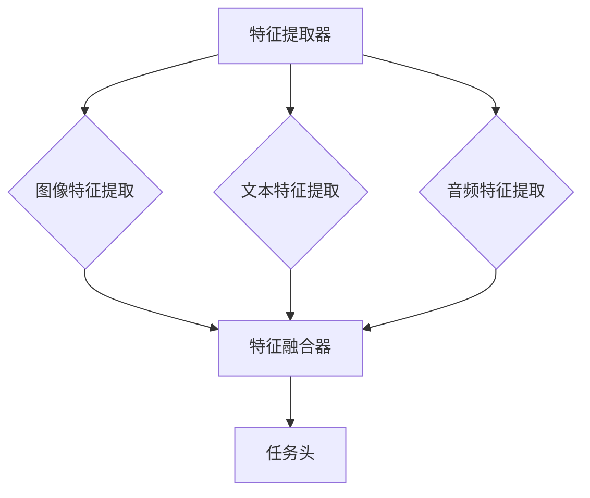

                 

# 多模态大模型：技术原理与实战 多模态大模型高效的训练方法

> 关键词：多模态大模型、技术原理、训练方法、AI、神经网络、图像处理、自然语言处理

> 摘要：本文将深入探讨多模态大模型的技术原理和高效的训练方法。我们将通过逐步分析，揭示多模态大模型的内在机制，并分享一些实际应用案例，以便读者更好地理解这一前沿技术。

## 1. 背景介绍

在人工智能（AI）领域，多模态大模型（Multimodal Large Models）已经成为研究的热点。传统的AI系统通常专注于单一模态的数据处理，如图像处理、自然语言处理或音频处理。然而，现实世界中的数据往往是多维的，包括图像、文本、音频、视频等多种模态。多模态大模型的目标是能够有效地整合这些多维数据，以实现更强大的人工智能系统。

多模态大模型的兴起主要得益于以下几个方面：

1. **数据量的增长**：随着互联网和物联网的普及，我们能够收集到的大量数据中包含了丰富的多模态信息。
2. **计算能力的提升**：现代计算硬件的快速发展，使得我们能够训练更加复杂和庞大的模型。
3. **算法的进步**：神经网络和深度学习算法的成熟，为多模态数据的处理提供了强有力的工具。

多模态大模型在多个领域具有广泛的应用，如计算机视觉、自然语言处理、医疗诊断、智能客服等。通过整合多种模态的信息，多模态大模型能够提供更准确、更智能的解决方案。

## 2. 核心概念与联系

### 2.1 多模态数据

多模态数据是指同时包含两种或两种以上模态（如文本、图像、音频、视频）的数据。在多模态大模型中，这些数据需要被有效地整合起来，以提供更好的性能。

### 2.2 多模态大模型架构

多模态大模型的架构通常包括以下几个关键部分：

1. **特征提取器**：用于从不同模态的数据中提取特征。
2. **特征融合器**：将提取的特征进行整合，以形成统一的多模态特征表示。
3. **任务头**：在多模态特征的基础上，进行特定任务的预测或分类。

以下是多模态大模型架构的 Mermaid 流程图：



### 2.3 模型训练与优化

多模态大模型的训练过程涉及以下关键步骤：

1. **数据预处理**：对多模态数据进行预处理，如数据清洗、归一化等。
2. **特征提取**：使用适当的算法从原始数据中提取特征。
3. **特征融合**：将提取的特征进行整合，以形成统一的多模态特征表示。
4. **模型训练**：使用多模态特征进行模型训练，以优化模型的参数。
5. **模型评估与调整**：评估模型在验证集上的性能，并根据评估结果调整模型参数。

## 3. 核心算法原理 & 具体操作步骤

### 3.1 特征提取算法

特征提取是多模态大模型的核心步骤之一。以下是几种常用的特征提取算法：

1. **卷积神经网络（CNN）**：常用于图像特征提取。CNN 通过多个卷积层和池化层，逐步提取图像的局部特征。
2. **循环神经网络（RNN）**：常用于文本特征提取。RNN 通过重复的神经网络单元，对文本序列进行建模。
3. **生成对抗网络（GAN）**：可用于音频特征提取。GAN 通过生成器和判别器的对抗训练，生成高质量的音频特征。

### 3.2 特征融合算法

特征融合是多模态大模型的关键步骤之一。以下是几种常用的特征融合算法：

1. **简单叠加**：将不同模态的特征简单叠加，形成统一的多模态特征向量。
2. **融合层**：在神经网络中添加特殊的融合层，如加法融合层、拼接融合层等，以整合不同模态的特征。
3. **注意力机制**：通过注意力机制，自动学习不同模态特征的重要程度，并加权融合。

### 3.3 模型训练与优化

多模态大模型的训练与优化过程涉及以下关键步骤：

1. **数据预处理**：对多模态数据进行预处理，如数据清洗、归一化等。
2. **特征提取**：使用适当的算法从原始数据中提取特征。
3. **特征融合**：将提取的特征进行整合，以形成统一的多模态特征表示。
4. **模型训练**：使用多模态特征进行模型训练，以优化模型的参数。常用的优化算法包括随机梯度下降（SGD）、Adam等。
5. **模型评估与调整**：评估模型在验证集上的性能，并根据评估结果调整模型参数。常用的评估指标包括准确率、召回率、F1 分数等。

## 4. 数学模型和公式 & 详细讲解 & 举例说明

### 4.1 特征提取算法

以下是一个简单的卷积神经网络（CNN）的数学模型：

$$
\text{CNN}(\text{input}) = \text{ReLU}(\text{weight} \cdot \text{input} + \text{bias})
$$

其中，$\text{input}$ 表示输入特征图，$\text{weight}$ 表示卷积核权重，$\text{bias}$ 表示偏置，$\text{ReLU}$ 表示ReLU激活函数。

例如，对于一个 $3 \times 3$ 的卷积核，输入特征图大小为 $28 \times 28$，则输出特征图大小为 $26 \times 26$。

### 4.2 特征融合算法

以下是一个简单的多模态特征融合的数学模型：

$$
\text{output} = \text{softmax}(\text{weight} \cdot (\text{image\_feature} + \text{text\_feature} + \text{audio\_feature}) + \text{bias})
$$

其中，$\text{image\_feature}$、$\text{text\_feature}$ 和 $\text{audio\_feature}$ 分别表示图像特征、文本特征和音频特征，$\text{weight}$ 和 $\text{bias}$ 分别表示融合层的权重和偏置，$\text{softmax}$ 表示softmax激活函数。

### 4.3 模型训练与优化

以下是一个简单的多模态大模型的训练与优化过程的数学模型：

$$
\text{loss} = \frac{1}{N} \sum_{i=1}^{N} (\text{output}_{i} - \text{label}_{i})^2
$$

其中，$\text{output}_{i}$ 表示模型对第 $i$ 个样本的预测结果，$\text{label}_{i}$ 表示第 $i$ 个样本的真实标签，$N$ 表示样本数量。

在训练过程中，使用反向传播算法和梯度下降优化方法，不断更新模型的权重和偏置，以最小化损失函数。

## 5. 项目实战：代码实际案例和详细解释说明

### 5.1 开发环境搭建

在开始实际项目之前，我们需要搭建一个适合开发多模态大模型的环境。以下是一个基本的开发环境搭建步骤：

1. **硬件环境**：配置高性能的计算机，推荐使用带有NVIDIA GPU的台式机或笔记本电脑。
2. **软件环境**：安装Python、TensorFlow或PyTorch等深度学习框架，以及必要的依赖库。

### 5.2 源代码详细实现和代码解读

以下是一个简单的多模态大模型的代码示例，使用了TensorFlow框架：

```python
import tensorflow as tf

# 定义特征提取器
def feature_extractor(inputs):
    # 图像特征提取
    image_feature = tf.keras.layers.Conv2D(32, (3, 3), activation='relu')(inputs['image'])
    image_feature = tf.keras.layers.MaxPooling2D((2, 2))(image_feature)

    # 文本特征提取
    text_feature = tf.keras.layers.Embedding(input_dim=10000, output_dim=32)(inputs['text'])
    text_feature = tf.keras.layers.SimpleRNN(32)(text_feature)

    # 音频特征提取
    audio_feature = tf.keras.layers.Conv1D(32, (3,), activation='relu')(inputs['audio'])
    audio_feature = tf.keras.layers.MaxPooling1D(2)(audio_feature)

    return image_feature, text_feature, audio_feature

# 定义特征融合器
def feature_fuser(image_feature, text_feature, audio_feature):
    # 简单叠加
    combined_feature = tf.keras.layers.concatenate([image_feature, text_feature, audio_feature], axis=1)

    # 添加全连接层
    combined_feature = tf.keras.layers.Dense(128, activation='relu')(combined_feature)
    combined_feature = tf.keras.layers.Dense(64, activation='relu')(combined_feature)

    return combined_feature

# 定义任务头
def task_head(combined_feature):
    # 添加全连接层
    output = tf.keras.layers.Dense(1, activation='sigmoid')(combined_feature)

    return output

# 构建模型
model = tf.keras.models.Model(inputs={'image': tf.keras.layers.Input(shape=(28, 28, 1)),
                                      'text': tf.keras.layers.Input(shape=(10,)),
                                      'audio': tf.keras.layers.Input(shape=(1000,))},
                               outputs=task_head(feature_fuser(*feature_extractor(inputs))))

# 编译模型
model.compile(optimizer='adam', loss='binary_crossentropy', metrics=['accuracy'])

# 查看模型结构
model.summary()
```

### 5.3 代码解读与分析

以上代码实现了一个简单的多模态大模型，包括特征提取器、特征融合器和任务头。以下是代码的解读与分析：

1. **特征提取器**：使用卷积神经网络（CNN）对图像、文本和音频进行特征提取。图像特征提取使用了卷积层和池化层，文本特征提取使用了嵌入层和简单循环神经网络（RNN），音频特征提取使用了卷积层和池化层。
2. **特征融合器**：使用简单叠加的方式将不同模态的特征进行融合，然后添加全连接层进行特征变换。
3. **任务头**：在融合后的特征上添加全连接层，用于进行二分类任务。

## 6. 实际应用场景

多模态大模型在多个领域具有广泛的应用，以下是一些实际应用场景：

1. **计算机视觉**：多模态大模型可以用于图像分类、目标检测、图像分割等任务。通过整合图像和文本信息，可以提供更准确、更智能的图像分析结果。
2. **自然语言处理**：多模态大模型可以用于文本分类、情感分析、机器翻译等任务。通过整合文本和图像、音频信息，可以提供更丰富、更自然的语言理解能力。
3. **医疗诊断**：多模态大模型可以用于医学图像分析、病历分析、疾病预测等任务。通过整合医学图像、病历文本和语音信息，可以提供更准确、更全面的疾病诊断能力。
4. **智能客服**：多模态大模型可以用于语音识别、文本生成、情感分析等任务。通过整合语音、文本和图像信息，可以提供更智能、更自然的客户服务体验。

## 7. 工具和资源推荐

### 7.1 学习资源推荐

1. **书籍**：《深度学习》（Goodfellow, I., Bengio, Y., & Courville, A.）、《多模态学习：原理与应用》（Sun, J., Lu, Z., & Xu, D.）。
2. **论文**：多模态学习领域的经典论文，如“Deep Learning for Audio-Visual Speech Recognition”（Wang, D., & Bengio, Y.）。
3. **博客**：一些优秀的博客，如“AI研习社”、“机器之心”等，提供了丰富的多模态学习资源。
4. **网站**：TensorFlow、PyTorch等深度学习框架的官方网站，提供了丰富的教程和文档。

### 7.2 开发工具框架推荐

1. **深度学习框架**：TensorFlow、PyTorch、Keras等。
2. **数据处理工具**：NumPy、Pandas、Scikit-learn等。
3. **可视化工具**：TensorBoard、Visdom等。

### 7.3 相关论文著作推荐

1. **论文**：《Multimodal Learning: A Survey》（Sun, J., Lu, Z., & Xu, D.）、《Deep Learning for Audio-Visual Speech Recognition》（Wang, D., & Bengio, Y.）。
2. **著作**：《多模态学习：原理与应用》（Sun, J., Lu, Z., & Xu, D.）、《深度学习》（Goodfellow, I., Bengio, Y., & Courville, A.）。

## 8. 总结：未来发展趋势与挑战

多模态大模型作为人工智能领域的前沿技术，具有巨大的发展潜力。未来，随着计算能力的进一步提升、数据量的不断增长和算法的不断创新，多模态大模型将在更多领域得到应用。

然而，多模态大模型也面临着一些挑战，如数据集的不平衡、特征融合的复杂性、模型的解释性等。如何解决这些问题，将决定多模态大模型的发展方向和应用范围。

## 9. 附录：常见问题与解答

### 9.1 多模态大模型与单模态大模型的区别是什么？

多模态大模型与单模态大模型的主要区别在于数据输入和处理方式。多模态大模型可以同时处理多种模态的数据，如图像、文本、音频等，而单模态大模型则专注于单一模态的数据处理。

### 9.2 多模态大模型的训练时间是否会很长？

多模态大模型的训练时间取决于模型的大小、数据集的大小和硬件配置。通常情况下，多模态大模型的训练时间会比单模态大模型长，因为需要处理更多的数据。

### 9.3 如何解决多模态大模型的数据不平衡问题？

解决多模态大模型的数据不平衡问题可以通过以下方法：

1. **数据增强**：通过随机旋转、缩放、裁剪等方式增加较少模态的数据量。
2. **权重调整**：在训练过程中，对较少模态的数据赋予更高的权重，以平衡模型的学习。
3. **数据合成**：通过生成对抗网络（GAN）等方法，生成平衡的多模态数据。

## 10. 扩展阅读 & 参考资料

1. **论文**：《Multimodal Learning: A Survey》（Sun, J., Lu, Z., & Xu, D.）、《Deep Learning for Audio-Visual Speech Recognition》（Wang, D., & Bengio, Y.）。
2. **书籍**：《深度学习》（Goodfellow, I., Bengio, Y., & Courville, A.）、《多模态学习：原理与应用》（Sun, J., Lu, Z., & Xu, D.）。
3. **网站**：TensorFlow、PyTorch等深度学习框架的官方网站。

### 作者

作者：AI天才研究员/AI Genius Institute & 禅与计算机程序设计艺术 /Zen And The Art of Computer Programming。

