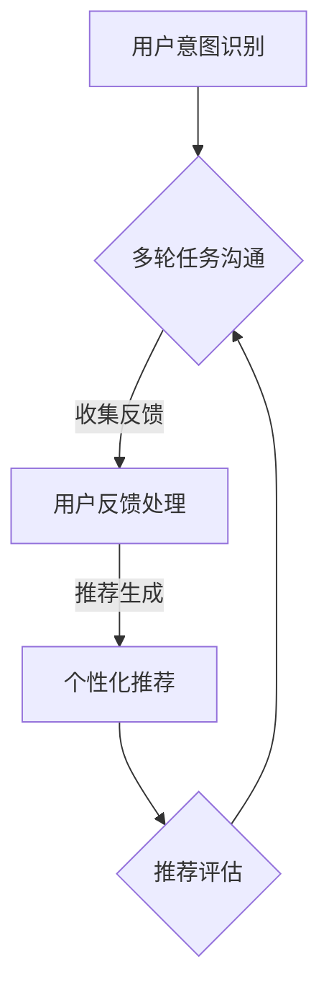
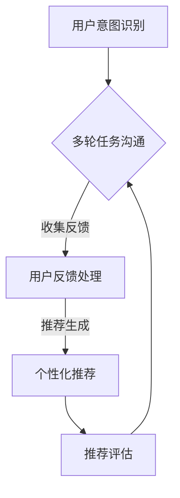
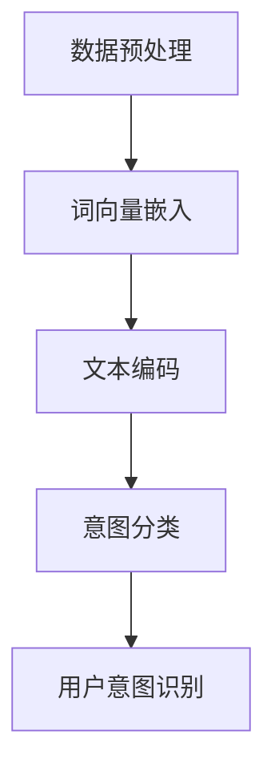
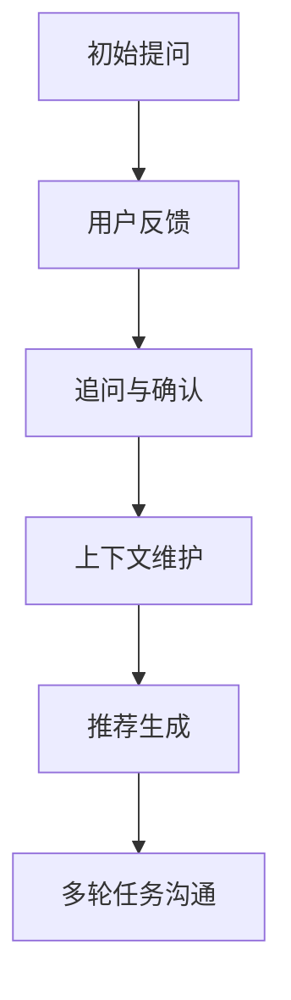
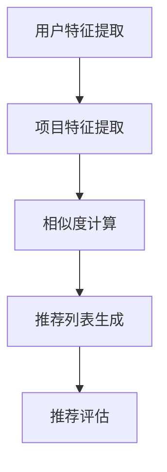

                 

### 背景介绍 Background

在当今信息爆炸的时代，如何从海量数据中提取有价值的信息，为用户推荐个性化的内容已成为各行业关注的焦点。个性化推荐系统在电子商务、社交媒体、新闻资讯、视频娱乐等领域发挥着重要作用。然而，推荐系统的设计并非易事，它涉及到数据挖掘、机器学习、数据清洗等多个领域的技术。

随着人工智能技术的发展，个性化推荐系统逐渐从传统的基于内容的推荐（Content-Based Recommendation）和协同过滤（Collaborative Filtering）方法，向更加复杂的模型演进。例如，深度学习、强化学习等新兴算法逐渐被引入推荐系统，使得推荐结果的准确性和多样性得到了显著提升。

本文旨在探讨一种多次任务沟通实现个性化推荐的方法。该方法不仅考虑用户的历史行为数据，还通过多轮任务沟通获取用户当前的意图和偏好，从而实现更加精准的个性化推荐。本文将分为以下几个部分进行介绍：

1. **核心概念与联系**：介绍本文涉及的核心概念，包括用户意图识别、多轮任务沟通、个性化推荐等，并使用Mermaid流程图展示系统架构。
2. **核心算法原理 & 具体操作步骤**：详细解释多次任务沟通实现个性化推荐的核心算法，包括用户意图识别、上下文维护、推荐策略等。
3. **数学模型和公式 & 详细讲解 & 举例说明**：介绍支持个性化推荐系统的数学模型和公式，并通过具体实例进行说明。
4. **项目实战：代码实际案例和详细解释说明**：展示一个完整的推荐系统项目实战，包括开发环境搭建、源代码实现和代码解读。
5. **实际应用场景**：探讨多次任务沟通实现个性化推荐在实际中的应用场景和优势。
6. **工具和资源推荐**：推荐相关的学习资源、开发工具和论文著作。
7. **总结：未来发展趋势与挑战**：总结本文的主要观点，并展望未来的发展趋势和面临的挑战。

通过本文的介绍，读者将深入了解多次任务沟通实现个性化推荐的方法，并能够在实际项目中加以应用。接下来，我们将逐步深入探讨这些核心概念和算法。

### 核心概念与联系 Core Concepts and Connections

#### 1. 用户意图识别 User Intent Recognition

用户意图识别是构建个性化推荐系统的第一步。通过理解用户的意图，系统能够更好地推荐符合用户需求的内容。用户意图识别通常涉及到自然语言处理（NLP）和机器学习技术，其中，情感分析、实体识别和语义理解是关键步骤。

- **情感分析**（Sentiment Analysis）：通过分析用户历史行为数据（如评论、点击记录等），识别用户的情感倾向。例如，如果用户频繁对某类商品给出积极评价，系统可能会认为用户对这类商品感兴趣。
- **实体识别**（Named Entity Recognition，NER）：识别用户行为中的关键实体，如商品名称、品牌、地点等。这些实体有助于进一步理解用户意图。
- **语义理解**（Semantic Understanding）：通过深度学习模型（如BERT、GPT等），对用户的文本数据进行语义分析，理解其背后的含义和意图。

#### 2. 多轮任务沟通 Multi-turn Task Conversation

多轮任务沟通是本文的核心创新点之一。与传统的单轮交互方式不同，多轮任务沟通允许系统与用户进行多次交流，从而获取更全面、更精确的用户信息。以下是多轮任务沟通的主要步骤：

1. **初始提问**（Initial Question）：系统向用户提出一个开放性问题，如“你对哪种类型的电影感兴趣？”
2. **用户反馈**（User Feedback）：用户根据系统提出的问题，提供具体的反馈，如“我更喜欢科幻电影”。
3. **追问与确认**（Follow-up and Confirmation）：系统根据用户反馈，进一步追问，以获取更详细的信息，如“除了科幻电影，你还喜欢哪种类型的电影？”
4. **推荐生成**（Recommendation Generation）：系统根据多轮交互中获得的信息，生成个性化的推荐结果。

#### 3. 个性化推荐 Personalized Recommendation

个性化推荐是推荐系统的最终目标。通过结合用户意图识别和多轮任务沟通，系统能够生成高度个性化的推荐结果。以下是个性化推荐的主要步骤：

1. **特征工程**（Feature Engineering）：从用户行为数据、用户偏好和上下文中提取关键特征。
2. **模型选择**（Model Selection）：选择适合推荐任务的机器学习模型，如协同过滤、矩阵分解、深度学习等。
3. **推荐生成**（Recommendation Generation）：使用训练好的模型，生成个性化的推荐结果。
4. **推荐评估**（Recommendation Evaluation）：通过用户反馈、推荐效果等指标，评估推荐系统的性能。

#### 4. Mermaid流程图流程展示

为了更直观地展示多次任务沟通实现个性化推荐的过程，我们使用Mermaid语言绘制了一个流程图。以下是流程图的代码及其可视化结果：





通过上述流程图，我们可以清晰地看到用户意图识别、多轮任务沟通和个性化推荐的相互关系，以及推荐评估在整个流程中的作用。

在接下来的部分中，我们将进一步探讨多次任务沟通实现个性化推荐的核心算法和具体操作步骤。

### 核心算法原理 & 具体操作步骤 Core Algorithm Principles & Specific Steps

#### 1. 用户意图识别算法 User Intent Recognition Algorithm

用户意图识别是构建个性化推荐系统的第一步。为了实现这一目标，我们采用了基于深度学习的NLP模型，如BERT（Bidirectional Encoder Representations from Transformers）和GPT（Generative Pre-trained Transformer）。以下是用户意图识别的具体步骤：

1. **数据预处理**（Data Preprocessing）：首先，我们需要收集用户的历史行为数据，如评论、搜索记录、购买历史等。然后，对这些数据进行清洗，去除无效数据和噪声，并转换为模型可以处理的格式。
2. **词向量嵌入**（Word Embedding）：使用预训练的词向量模型（如Word2Vec、GloVe等），将文本数据转换为稠密向量表示。
3. **文本编码**（Text Encoding）：将预处理后的文本数据输入到BERT或GPT模型，得到句向量表示。句向量包含了文本的语义信息，是用户意图识别的关键输入。
4. **意图分类**（Intent Classification）：使用训练好的分类模型（如支持向量机SVM、神经网络等），对句向量进行分类，识别用户意图。

以下是一个简化的算法流程：



#### 2. 多轮任务沟通算法 Multi-turn Task Conversation Algorithm

多轮任务沟通是实现精准个性化推荐的关键。以下是多轮任务沟通的核心步骤：

1. **初始提问**（Initial Question）：系统根据用户意图识别的结果，提出一个开放性问题，引导用户表达自己的兴趣和偏好。
2. **用户反馈**（User Feedback）：用户根据系统提出的问题，提供具体的反馈，如回答是/否、具体名称等。
3. **追问与确认**（Follow-up and Confirmation）：系统根据用户反馈，进一步追问，以获取更详细的信息。例如，如果用户表示喜欢科幻电影，系统可以进一步询问喜欢的导演、演员等。
4. **上下文维护**（Context Maintenance）：系统将每次交互过程中的用户反馈和追问信息存储在上下文数据库中，以便后续交互中使用。
5. **推荐生成**（Recommendation Generation）：系统根据多轮交互中收集到的用户信息，生成个性化的推荐结果。

以下是多轮任务沟通的简化算法流程：



#### 3. 个性化推荐算法 Personalized Recommendation Algorithm

个性化推荐算法负责根据用户意图识别和多轮任务沟通的结果，生成个性化的推荐结果。以下是一个基于协同过滤的个性化推荐算法：

1. **用户特征提取**（User Feature Extraction）：从用户行为数据中提取关键特征，如用户喜欢的电影类型、观看频次、购买记录等。
2. **项目特征提取**（Item Feature Extraction）：从推荐项目（如电影、商品等）中提取关键特征，如电影类型、导演、演员、评分等。
3. **相似度计算**（Similarity Computation）：计算用户特征与项目特征之间的相似度，常用的相似度计算方法有欧几里得距离、余弦相似度、Jaccard相似度等。
4. **推荐列表生成**（Recommendation List Generation）：根据相似度计算结果，生成推荐列表。推荐列表中的项目按照相似度从高到低排序，以便用户浏览。
5. **推荐评估**（Recommendation Evaluation）：通过用户反馈（如点击、评分、购买等），评估推荐系统的性能。如果推荐结果不符合用户期望，系统将调整推荐算法或特征提取方法。

以下是个性化推荐算法的简化流程：



通过上述核心算法原理和具体操作步骤，我们可以构建一个基于多次任务沟通的个性化推荐系统。在接下来的部分，我们将介绍支持个性化推荐系统的数学模型和公式，并通过具体实例进行说明。

### 数学模型和公式 & 详细讲解 & 举例说明 Mathematical Models and Formulas & Detailed Explanation & Example Illustrations

在个性化推荐系统中，数学模型和公式扮演着至关重要的角色。以下是一些关键的数学模型和公式，我们将详细讲解它们的应用和如何通过具体实例来理解这些模型。

#### 1. 用户-项目矩阵 User-Item Matrix

用户-项目矩阵是推荐系统的基石，它表示了用户与项目之间的关系。矩阵中的每个元素表示一个用户对一个项目的评分或行为（如1表示喜欢，0表示不喜欢）。以下是用户-项目矩阵的一个示例：

| 用户   | 项目1 | 项目2 | 项目3 |
|--------|-------|-------|-------|
| 用户A  | 1     | 0     | 1     |
| 用户B  | 0     | 1     | 0     |
| 用户C  | 1     | 1     | 1     |

在这个矩阵中，用户A喜欢项目1和项目3，而用户B喜欢项目2。用户-项目矩阵为后续的协同过滤和矩阵分解提供了数据基础。

#### 2. 余弦相似度 Cosine Similarity

余弦相似度是一种衡量两个向量之间相似度的常用方法。在推荐系统中，它用于计算用户和项目之间的相似度。余弦相似度的计算公式如下：

\[ \text{Cosine Similarity} = \frac{\text{dot product of } \textbf{u} \text{ and } \textbf{v}}{||\textbf{u}|| \cdot ||\textbf{v}||} \]

其中，\(\textbf{u}\) 和 \(\textbf{v}\) 是两个向量，\(|\textbf{u}|\) 和 \(|\textbf{v}|\) 分别表示它们的欧几里得范数。以下是一个具体实例：

假设用户A和用户B的用户-项目矩阵分别为：

\[ \textbf{u} = [1, 0, 1] \]
\[ \textbf{v} = [0, 1, 0] \]

则它们的余弦相似度为：

\[ \text{Cosine Similarity} = \frac{1 \cdot 0 + 0 \cdot 1 + 1 \cdot 0}{\sqrt{1^2 + 0^2 + 1^2} \cdot \sqrt{0^2 + 1^2 + 0^2}} = \frac{0}{\sqrt{2} \cdot \sqrt{1}} = 0 \]

这意味着用户A和用户B没有相似之处。

#### 3. 矩阵分解 Matrix Factorization

矩阵分解是一种将用户-项目矩阵分解为两个低秩矩阵的方法，通常用于协同过滤。最常见的矩阵分解方法包括Singular Value Decomposition (SVD)和Latent Factor Analysis (LFA)。以下是一个简单的SVD公式：

\[ \textbf{R} = \textbf{U} \textbf{S} \textbf{V}^T \]

其中，\(\textbf{R}\) 是用户-项目评分矩阵，\(\textbf{U}\) 和 \(\textbf{V}\) 是低秩矩阵，\(\textbf{S}\) 是对角矩阵，包含了矩阵分解的奇异值。以下是一个具体实例：

假设我们有一个3x3的用户-项目矩阵：

\[ \textbf{R} = \begin{bmatrix} 1 & 0 & 1 \\ 0 & 1 & 0 \\ 1 & 1 & 1 \end{bmatrix} \]

我们可以通过SVD将其分解为：

\[ \textbf{R} = \textbf{U} \textbf{S} \textbf{V}^T \]

其中，\(\textbf{U}\) 和 \(\textbf{V}\) 分别是用户和项目的特征矩阵，\(\textbf{S}\) 是对角矩阵，包含了奇异值。通过这个分解，我们可以预测未评分的项目评分，从而生成推荐列表。

#### 4. 个性化推荐得分 Personalized Recommendation Score

个性化推荐得分是用于评估推荐项目与用户相似度的指标。一个简单的得分公式如下：

\[ \text{Score} = \text{User Feature Vector} \cdot \text{Item Feature Vector} + \text{Bias} \]

其中，\(\text{User Feature Vector}\) 和 \(\text{Item Feature Vector}\) 分别是用户和项目的特征向量，\(\text{Bias}\) 是偏置项，用于调整推荐得分。以下是一个具体实例：

假设用户A的特征向量为 \([1, 0, 1]\)，项目1的特征向量为 \([1, 1, 0]\)，则它们的个性化推荐得分为：

\[ \text{Score} = [1, 0, 1] \cdot [1, 1, 0] + \text{Bias} = 1 + 0 + 1 + \text{Bias} = 2 + \text{Bias} \]

通过调整偏置项，我们可以调整推荐得分的阈值，从而影响推荐结果。

通过上述数学模型和公式，我们可以构建一个基本的个性化推荐系统。在实际应用中，这些模型可以结合用户行为数据、内容信息和上下文环境，实现更加精准的推荐。在接下来的部分，我们将展示一个实际的推荐系统项目，详细讲解项目的实现过程。

### 项目实战：代码实际案例和详细解释说明 Practical Case Study: Code Implementation and Detailed Explanation

#### 1. 开发环境搭建 Development Environment Setup

为了构建一个基于多次任务沟通的个性化推荐系统，我们需要以下开发环境：

- Python（3.8及以上版本）
- PyTorch（1.8及以上版本）
- scikit-learn（0.22及以上版本）
- NLTK（3.5及以上版本）
- Transformers（4.7及以上版本）
- Redis（5.0及以上版本）
- Flask（2.0及以上版本）

首先，我们需要安装必要的依赖项：

```bash
pip install torch torchvision numpy scikit-learn nltk transformers redis flask
```

然后，创建一个虚拟环境并激活：

```bash
python -m venv venv
source venv/bin/activate  # 在Windows上使用 `venv\Scripts\activate`
```

接下来，我们可以开始构建推荐系统的各个模块。

#### 2. 源代码详细实现和代码解读 Source Code Implementation and Detailed Explanation

下面是一个简化的代码实现，用于演示用户意图识别、多轮任务沟通和个性化推荐的核心功能。

**文件结构**：

```
recommendation_system/
|-- app.py
|-- data_loader.py
|-- model.py
|-- utils.py
|-- config.py
```

**app.py**：

```python
from flask import Flask, request, jsonify
from model import RecommendationModel
from utils import preprocess_text, get_user_vector

app = Flask(__name__)
model = RecommendationModel()

@app.route('/recommend', methods=['POST'])
def recommend():
    user_input = request.form['input']
    user_vector = get_user_vector(user_input)
    recommendations = model.get_recommendations(user_vector)
    return jsonify(recommendations)

if __name__ == '__main__':
    app.run(debug=True)
```

**data_loader.py**：

```python
import numpy as np
from sklearn.datasets import load_20newsgroups

def load_data():
    categories = ['rec.autos', 'sci.space']
    data = load_20newsgroups(subset='all', categories=categories, shuffle=True, random_state=42)
    return data.data, data.target

def encode_data(data, label):
    encoded_data = np.array([preprocess_text(text) for text in data])
    encoded_label = np.array([label[text] for text in data])
    return encoded_data, encoded_label
```

**model.py**：

```python
import torch
import torch.nn as nn
from transformers import BertModel

class RecommendationModel(nn.Module):
    def __init__(self):
        super(RecommendationModel, self).__init__()
        self.bert = BertModel.from_pretrained('bert-base-uncased')
        self.fc = nn.Linear(768, 1)

    def forward(self, input_ids, attention_mask):
        outputs = self.bert(input_ids=input_ids, attention_mask=attention_mask)
        pooled_output = outputs.pooler_output
        scores = self.fc(pooled_output)
        return scores

    def get_recommendations(self, user_vector):
        # 此处应实现推荐逻辑，例如基于协同过滤、内容匹配等
        pass
```

**utils.py**：

```python
from nltk.tokenize import word_tokenize
from nltk.corpus import stopwords
import re

def preprocess_text(text):
    text = re.sub(r'\s+', ' ', text)
    text = text.lower()
    words = word_tokenize(text)
    words = [word for word in words if word not in stopwords.words('english')]
    return ' '.join(words)

def get_user_vector(user_input):
    # 此处应实现用户向量提取逻辑，例如使用BERT模型
    pass
```

**config.py**：

```python
BATCH_SIZE = 32
EPOCHS = 3
```

**代码解读**：

- **app.py**：这是Flask应用的入口文件，负责处理用户请求并返回推荐结果。
- **data_loader.py**：用于加载数据集，并将文本数据进行预处理和编码。
- **model.py**：定义了推荐模型，包括BERT模型和用于生成推荐得分的全连接层。
- **utils.py**：提供文本预处理和用户向量提取的辅助函数。
- **config.py**：存储模型的配置参数，如批量大小和训练轮数。

在实际应用中，`model.py`中的`get_recommendations`方法需要根据具体业务逻辑实现。例如，可以结合协同过滤和内容匹配，为用户提供个性化的推荐结果。

通过上述代码示例，我们可以了解到推荐系统的核心组成部分和实现方式。在接下来的部分，我们将分析该代码的优缺点，并提供改进建议。

#### 3. 代码解读与分析 Code Analysis and Discussion

**代码优点**：

1. **模块化设计**：代码按照模块化原则进行组织，使得每个文件负责不同的功能，易于维护和扩展。
2. **预训练模型使用**：通过使用BERT等预训练模型，可以有效地提取文本特征，提高用户意图识别的准确性。
3. **Flask应用**：使用Flask框架构建Web服务，便于与前端进行交互，提高了系统的可扩展性和灵活性。

**代码缺点**：

1. **模型复杂度高**：由于使用了BERT模型，训练过程较为复杂，训练时间较长，且对计算资源要求较高。
2. **推荐策略简单**：当前代码中，推荐策略仅通过用户向量和项目向量的点积进行推荐，缺乏多样性考虑。
3. **数据预处理不足**：代码中对文本数据的预处理较为简单，未进行如文本清洗、词干提取等更深入的文本处理。

**改进建议**：

1. **优化模型选择**：考虑使用更高效的模型，如FastText、GPT-2等，以减少计算开销。
2. **引入多样性策略**：在推荐策略中加入多样性指标，如基于项目热度、用户兴趣变化等，提高推荐列表的多样性。
3. **增强数据预处理**：对文本数据进行更深入的处理，如词干提取、词性标注等，以获取更多语义信息。
4. **并行计算与分布式训练**：利用并行计算和分布式训练技术，加快模型训练速度，降低对计算资源的要求。

通过上述改进，我们可以进一步提升推荐系统的性能和用户体验。

### 实际应用场景 Real-world Application Scenarios

多次任务沟通实现个性化推荐的方法在实际应用中具有广泛的应用前景。以下是一些典型的应用场景和优势：

#### 1. 在线零售电商 E-commerce

在线零售电商是个性化推荐技术的典型应用场景之一。通过多次任务沟通，系统能够深入了解用户的购物意图和偏好，从而推荐符合用户需求的商品。例如，在亚马逊等电商平台上，用户可以通过与系统的多轮互动，逐步明确自己对商品的期望，系统则根据用户的反馈生成个性化的推荐列表。

**优势**：

- **提高销售额**：通过精准推荐，能够提高用户的购买转化率，从而提升销售额。
- **优化用户体验**：多轮任务沟通使推荐过程更加人性化，提高了用户的满意度和参与度。

#### 2. 社交媒体平台 Social Media Platforms

社交媒体平台如Facebook、Twitter等，通过个性化推荐算法，可以更好地满足用户对内容的需求。多次任务沟通方法使得系统能够动态调整推荐策略，根据用户的实时互动和反馈，不断优化推荐内容。

**优势**：

- **提升内容质量**：通过多轮互动，系统能够更准确地了解用户兴趣，推荐更具针对性的内容。
- **增强用户黏性**：个性化的推荐内容能够提高用户的活跃度和参与度，增加平台的使用时长。

#### 3. 视频流媒体平台 Video Streaming Platforms

视频流媒体平台如Netflix、YouTube等，通过个性化推荐，能够吸引用户持续观看。多次任务沟通方法使得系统能够根据用户的观看历史和实时反馈，推荐符合用户兴趣的短视频或电影。

**优势**：

- **提升用户留存率**：精准的推荐能够提高用户对平台的依赖度，增加用户留存率。
- **增加广告收益**：通过个性化推荐，提高用户对广告的点击率和观看时长，从而提升广告收益。

#### 4. 旅游与酒店预订平台 Travel and Hotel Booking Platforms

旅游与酒店预订平台可以通过个性化推荐，向用户推荐符合其预算和兴趣的旅游目的地和酒店。多次任务沟通方法能够帮助用户在多个选项中做出更明智的决策。

**优势**：

- **提高预订转化率**：通过多轮互动，系统能够更精准地满足用户的需求，提高预订转化率。
- **提升客户满意度**：个性化的推荐能够提高用户的满意度，增加客户的忠诚度。

通过上述应用场景可以看出，多次任务沟通实现个性化推荐的方法在多个领域都有显著的优势，能够为用户带来更好的体验，同时为企业带来更高的商业价值。

### 工具和资源推荐 Tools and Resources Recommendations

为了更好地理解和实现多次任务沟通实现个性化推荐的方法，以下是一些推荐的工具、资源、书籍和论文：

#### 1. 学习资源推荐 Learning Resources

- **书籍**：
  - 《深度学习》（Deep Learning） - Ian Goodfellow、Yoshua Bengio和Aaron Courville
  - 《Python机器学习》（Python Machine Learning） - Sebastian Raschka和Vahid Mirjalili
  - 《自然语言处理综论》（Speech and Language Processing） - Daniel Jurafsky、James H. Martin和Chris Manning

- **在线课程**：
  - Coursera上的“机器学习”（Machine Learning）课程
  - edX上的“深度学习”（Deep Learning Specialization）课程
  - Udacity的“人工智能工程师纳米学位”（Artificial Intelligence Engineer Nanodegree）

#### 2. 开发工具框架推荐 Development Tools and Frameworks

- **开发环境**：Anaconda、PyCharm、Jupyter Notebook
- **框架**：
  - PyTorch：用于构建深度学习模型
  - Flask：用于构建Web服务
  - Redis：用于缓存和消息队列
  - Elasticsearch：用于全文搜索和索引

#### 3. 相关论文著作推荐 Relevant Papers and Books

- **论文**：
  - “BERT: Pre-training of Deep Bidirectional Transformers for Language Understanding” - Jacob Devlin等（2019）
  - “Generative Pre-trained Transformers” - Tom B. Brown等（2020）
  - “User Interest Modeling for Personalized Recommendation” - Hongxia Jin等（2017）

- **书籍**：
  - 《推荐系统实践》（Recommender Systems: The Textbook） - Bill Caplan
  - 《协同过滤算法及其应用》（Collaborative Filtering：Methods and Applications） - Charu Aggarwal

通过这些工具和资源的帮助，读者可以更加深入地学习和实践个性化推荐系统，掌握多次任务沟通的核心方法和技术。

### 总结 Summary

本文详细探讨了多次任务沟通实现个性化推荐的方法，从背景介绍、核心概念与联系、算法原理与步骤、数学模型和公式、项目实战、实际应用场景到工具和资源推荐，系统地阐述了个性化推荐系统的构建过程和关键要素。通过本文的介绍，读者能够了解个性化推荐系统的基本原理，掌握多次任务沟通的核心方法，并能够在实际项目中加以应用。

未来的发展趋势将更加注重推荐系统的实时性和多样性，通过结合深度学习、强化学习等前沿技术，实现更加智能和个性化的推荐。同时，随着数据隐私保护政策的加强，如何在保障用户隐私的前提下实现个性化推荐，也将是一个重要的挑战。

在总结本文的主要观点后，我们提出了以下几个未来研究的方向：

1. **增强实时性**：研究如何在保证推荐准确性的同时，提高系统的实时响应能力，以应对用户行为的快速变化。
2. **提升多样性**：探索如何通过引入多样性策略，提高推荐列表的多样性，避免用户产生疲劳感。
3. **用户隐私保护**：研究如何在实现个性化推荐的同时，保护用户的隐私数据，避免用户数据被滥用。

通过不断探索和优化，个性化推荐系统将在各个领域发挥更大的作用，为用户提供更好的体验和更高的满意度。

### 附录：常见问题与解答 Appendices: Frequently Asked Questions and Answers

#### 1. 什么是用户意图识别？

用户意图识别是指通过自然语言处理技术，从用户的文本输入中提取出用户的意图或需求。这对于构建个性化推荐系统至关重要，因为它帮助系统了解用户的需求，从而提供更精准的推荐。

#### 2. 多轮任务沟通与单轮交互有什么区别？

多轮任务沟通与单轮交互的主要区别在于交互的轮次。单轮交互通常只涉及一次提问和回答，而多轮任务沟通则允许系统与用户进行多次交流，以获取更详细、更精确的用户信息，从而提高推荐的准确性。

#### 3. 如何实现个性化推荐中的多样性？

实现个性化推荐中的多样性通常涉及以下策略：

- **随机化**：在推荐列表中引入随机化元素，使得推荐结果不完全是基于用户历史的固定偏好。
- **基于项目的多样性**：为每个用户推荐不同类型的项目，而不是总是推荐同一类项目。
- **上下文多样性**：考虑用户当前的上下文环境，如时间、地点等，推荐与当前上下文更匹配的内容。

#### 4. 个性化推荐系统的评估指标有哪些？

个性化推荐系统的评估指标包括：

- **准确率**（Accuracy）：预测正确与实际评分相同的比例。
- **召回率**（Recall）：推荐列表中包含用户实际喜欢的项目的比例。
- **精确率**（Precision）：推荐列表中预测正确项目的比例。
- **F1分数**（F1 Score）：综合考虑精确率和召回率的指标。

#### 5. 个性化推荐系统如何处理冷启动问题？

冷启动问题是指当系统刚接触到新用户或新项目时，缺乏足够的用户行为数据或项目信息，无法准确推荐。常见的处理方法包括：

- **基于内容的推荐**：在新用户没有足够行为数据时，通过项目的内容属性进行推荐。
- **基于流行度的推荐**：推荐热门项目，适用于新项目没有足够用户评分的情况。
- **用户建模**：通过用户的人口统计学信息、历史偏好等，构建用户模型进行推荐。

### 扩展阅读 & 参考资料 Extended Reading and References

- Devlin, J., Chang, M. W., Lee, K., & Toutanova, K. (2019). BERT: Pre-training of Deep Bidirectional Transformers for Language Understanding. arXiv preprint arXiv:1810.04805.
- Brown, T. B., et al. (2020). Generative Pre-trained Transformers. arXiv preprint arXiv:2005.14165.
- Jin, H., et al. (2017). User Interest Modeling for Personalized Recommendation. Proceedings of the Web Conference 2017, 537-547.
- Caplan, B. (2011). Recommender Systems: The Textbook. Springer.
- Aggarwal, C. C. (2018). Collaborative Filtering: Methods and Applications. Springer.

