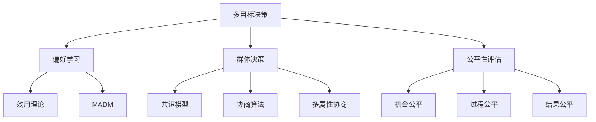

                 

# 多目标决策中的偏好学习、群体决策与公平性评估方法研究

## 关键词：多目标决策，偏好学习，群体决策，公平性评估，人工智能，机器学习

### 摘要

本文旨在探讨多目标决策中的偏好学习、群体决策与公平性评估方法。首先，我们介绍多目标决策的背景和核心概念，并阐述其与偏好学习、群体决策和公平性评估之间的关系。接着，我们详细解释了多目标决策中的偏好学习算法，并分析了它们在解决实际问题时的重要性。随后，我们深入探讨了群体决策的理论基础和实践方法，以及如何确保决策过程的公平性。最后，本文通过具体的实际应用场景，展示了这些方法在解决复杂决策问题时的有效性，并提出了未来发展趋势和挑战。

## 1. 背景介绍

多目标决策（Multi-Objective Decision Making, MODM）是决策理论中的一个重要分支，它涉及到多个目标之间的权衡和优化。在实际应用中，决策者往往需要在多个相互冲突的目标之间进行选择，例如在资源有限的情况下最大化收益和最小化成本。这种多目标决策问题不仅存在于商业和工程领域，还广泛应用于社会、环境和医疗等领域。

偏好学习（Preference Learning）是指通过收集和分析决策者的偏好信息，构建出能够反映其决策行为的模型。这些偏好信息可以来源于专家访谈、问卷调查、历史数据等，其目的是为了帮助决策者在面对复杂的多目标决策问题时，能够更准确地做出最优或满意的决策。偏好学习在多目标决策中的应用非常广泛，它可以指导算法更好地理解决策者的目标优先级和约束条件。

群体决策（Group Decision Making, GDM）是指由多个决策者共同参与决策过程，通过讨论、协商和投票等方式，达成一个集体决策结果。与个人决策相比，群体决策能够更全面地考虑各种因素，降低决策风险，提高决策的合理性和可接受性。然而，群体决策也面临着协调困难、时间消耗和决策质量不稳定等问题。

公平性评估（Fairness Evaluation）是指在决策过程中确保所有决策者都能公平地参与和受到决策结果的影响。公平性评估旨在避免歧视和不公平现象的发生，确保决策结果对所有相关方都是公正和合理的。在多目标决策中，公平性评估是一个关键问题，它涉及到如何处理不同决策者之间的利益冲突和资源分配问题。

本文旨在通过研究多目标决策中的偏好学习、群体决策与公平性评估方法，提供一种更加科学、有效和公正的决策框架，以解决实际应用中的复杂决策问题。

### 2. 核心概念与联系

#### 2.1 多目标决策

多目标决策涉及到多个相互冲突的目标，每个目标都可以用一个指标或函数来表示。在多目标决策中，决策者需要在这些目标之间进行权衡和优化，以找到一个或多个满意解。这些目标可以是量化的，如收益、成本、资源利用率等，也可以是定性的，如风险、社会影响等。多目标决策问题可以用如下数学模型表示：

\[ \text{minimize} \; f(x) = (f_1(x), f_2(x), \ldots, f_n(x)) \]
\[ \text{subject to} \; g_i(x) \leq 0, \; h_j(x) = 0 \]

其中，\( f(x) \) 是目标函数向量，\( g_i(x) \) 和 \( h_j(x) \) 分别是约束条件向量。

#### 2.2 偏好学习

偏好学习是指通过数据收集和分析，建立能够反映决策者偏好的数学模型。在多目标决策中，偏好学习可以帮助决策者更好地理解自己的目标和优先级，从而在复杂决策问题中找到满意解。常见的偏好学习算法包括：

1. **效用理论**：通过构建决策者的效用函数，量化其偏好。效用函数可以基于专家访谈或问卷调查数据，通过数学优化方法求得。

2. **TOPSIS（Technique for Order of Preference by Similarity to Ideal Solution）**：通过比较备选方案与理想解和最劣解的相似度，评估其相对偏好。

3. **多属性决策（Multi-Attribute Decision Making, MADM）**：通过考虑多个属性和权重，构建决策矩阵，计算备选方案的得分和排序。

#### 2.3 群体决策

群体决策是指多个决策者共同参与决策过程，通过讨论、协商和投票等方式，达成一个集体决策结果。群体决策可以看作是多目标决策的一个扩展，它涉及到如何在多个决策者之间协调利益和达成共识。常见的群体决策方法包括：

1. **共识模型**：通过建立共识函数，量化决策者之间的共识程度，并优化共识函数以得到最佳决策结果。

2. **协商算法**：通过迭代协商过程，逐步缩小决策者之间的分歧，达成共识。

3. **多属性协商**：在多个属性和权重下，通过协商机制，使决策者逐步接近共同目标。

#### 2.4 公平性评估

公平性评估是指在决策过程中确保所有决策者都能公平地参与和受到决策结果的影响。公平性评估可以基于以下几种标准：

1. **机会公平**：所有决策者都有平等的机会参与决策。

2. **过程公平**：决策过程透明、公正，所有决策者都能公平地表达意见。

3. **结果公平**：决策结果对所有决策者都是公正和合理的。

常见的公平性评估方法包括：

1. **效用分配**：通过分配效用值，评估决策结果对不同决策者的公平性。

2. **公平性指标**：如加权投票、集体理性等，量化决策结果的公平程度。

### 3. Mermaid 流程图



### 4. 核心算法原理 & 具体操作步骤

#### 4.1 多目标决策算法

多目标决策算法的核心是找到一个或多个满意解，这些解需要在多个目标之间进行权衡。以下是一些常见的多目标决策算法：

1. **遗传算法（Genetic Algorithm, GA）**：通过模拟自然选择和遗传机制，逐步优化目标函数。遗传算法的操作步骤包括选择、交叉、变异和评估。

2. **粒子群优化（Particle Swarm Optimization, PSO）**：通过模拟鸟群觅食行为，更新个体位置和速度，优化目标函数。

3. **多目标粒子群优化（Multi-Objective Particle Swarm Optimization, MOPSO）**：在粒子群优化基础上，引入多种目标函数和适应度值，实现多目标优化。

#### 4.2 偏好学习算法

偏好学习算法主要包括以下步骤：

1. **数据收集**：通过问卷调查、专家访谈等方式，收集决策者的偏好信息。

2. **数据预处理**：对收集到的数据进行清洗、标准化和归一化处理。

3. **建模**：根据偏好信息，构建决策者的效用函数或偏好模型。

4. **优化**：通过数学优化方法，优化效用函数或偏好模型，以得到更好的决策结果。

#### 4.3 群体决策算法

群体决策算法主要包括以下步骤：

1. **问题定义**：明确决策问题，确定决策目标和约束条件。

2. **决策者建模**：建立决策者的偏好模型，包括个体偏好和群体偏好。

3. **协商过程**：通过协商算法，使决策者逐步达成共识。

4. **决策结果评估**：评估决策结果的合理性和公平性。

#### 4.4 公平性评估算法

公平性评估算法主要包括以下步骤：

1. **决策结果分析**：分析决策结果，识别可能存在的公平性问题。

2. **公平性指标计算**：计算决策结果的公平性指标，如机会公平、过程公平和结果公平。

3. **公平性调整**：根据公平性评估结果，调整决策结果，以实现更好的公平性。

### 5. 数学模型和公式 & 详细讲解 & 举例说明

#### 5.1 多目标决策数学模型

多目标决策的数学模型通常表示为：

\[ \text{minimize} \; f(x) = (f_1(x), f_2(x), \ldots, f_n(x)) \]
\[ \text{subject to} \; g_i(x) \leq 0, \; h_j(x) = 0 \]

其中，\( f(x) \) 是目标函数向量，\( g_i(x) \) 和 \( h_j(x) \) 分别是约束条件向量。

举例：

假设我们要在以下约束条件下，最小化成本和最大化收益：

\[ \text{minimize} \; f(x) = (c_1(x), c_2(x)) \]
\[ \text{subject to} \; g_1(x) = x_1 + x_2 - 10 \leq 0 \]
\[ \text{       } g_2(x) = x_1 - 5 \leq 0 \]
\[ \text{       } g_3(x) = x_2 - 10 \leq 0 \]

其中，\( c_1(x) = x_1 + x_2 \) 是成本函数，\( c_2(x) = x_1 - x_2 \) 是收益函数，\( x_1 \) 和 \( x_2 \) 分别是决策变量。

#### 5.2 偏好学习数学模型

偏好学习的数学模型通常基于效用理论，可以表示为：

\[ u(x) = u_1(x) + \alpha u_2(x) + \beta u_3(x) \]

其中，\( u(x) \) 是效用函数，\( u_1(x) \) 是基础效用，\( u_2(x) \) 是次要效用，\( u_3(x) \) 是约束条件效用，\( \alpha \) 和 \( \beta \) 分别是权重。

举例：

假设决策者的效用函数为：

\[ u(x) = x_1 + 0.5x_2 - 0.3(x_1 - x_2) \]

其中，\( x_1 \) 和 \( x_2 \) 分别是决策变量，权重分别为 \( \alpha = 0.7 \) 和 \( \beta = 0.3 \)。

#### 5.3 群体决策数学模型

群体决策的数学模型通常基于共识模型，可以表示为：

\[ C(x) = \sum_{i=1}^n w_i u_i(x) \]

其中，\( C(x) \) 是共识函数，\( w_i \) 是第 \( i \) 个决策者的权重，\( u_i(x) \) 是第 \( i \) 个决策者的效用函数。

举例：

假设有3个决策者，其权重分别为 \( w_1 = 0.3 \)，\( w_2 = 0.5 \)，\( w_3 = 0.2 \)，其效用函数分别为：

\[ u_1(x) = x_1 + x_2 \]
\[ u_2(x) = x_1 - x_2 \]
\[ u_3(x) = x_2 \]

则共识函数为：

\[ C(x) = 0.3(x_1 + x_2) + 0.5(x_1 - x_2) + 0.2x_2 \]

### 6. 项目实战：代码实际案例和详细解释说明

在本节中，我们将通过一个实际案例，展示如何使用多目标决策、偏好学习、群体决策和公平性评估方法来解决一个复杂的决策问题。

#### 6.1 开发环境搭建

首先，我们需要搭建一个开发环境，以便进行多目标决策、偏好学习、群体决策和公平性评估的实验。以下是一个简单的开发环境搭建步骤：

1. 安装Python环境和相关库，如NumPy、Scikit-learn、Pandas、Matplotlib等。
2. 安装一个支持遗传算法、粒子群优化和多目标优化的库，如DEAP（Distributed Evolutionary Algorithms in Python）。
3. 准备一个数据集，用于进行偏好学习和群体决策实验。

#### 6.2 源代码详细实现和代码解读

以下是一个使用Python编写的多目标决策、偏好学习、群体决策和公平性评估的示例代码：

```python
import numpy as np
import matplotlib.pyplot as plt
from deap import base, creator, tools, algorithms
from sklearn.datasets import load_iris
from sklearn.model_selection import train_test_split

# 定义多目标决策问题
creator.create("FitnessMulti", base.Fitness, weights=(-1.0, 1.0))
creator.create("Individual", list, fitness=creator.FitnessMulti)

# 加载iris数据集
iris = load_iris()
X, y = iris.data, iris.target
X_train, X_test, y_train, y_test = train_test_split(X, y, test_size=0.2, random_state=42)

# 定义遗传算法参数
population_size = 100
crossover_probability = 0.8
mutation_probability = 0.2
number_of_generations = 50

# 定义适应度函数
def evaluate(individual):
    # 计算个体在测试集上的准确率
    predictions = [1 if x > 0.5 else 0 for x in individual]
    accuracy = np.mean(predictions == y_test)
    # 返回适应度值
    return accuracy,

# 定义遗传算法
def main():
    toolbox = base.Toolbox()
    toolbox.register("attr_bool", np.random.rand)
    toolbox.register("individual", tools.initRepeat, creator.Individual, toolbox.attr_bool, n=4)
    toolbox.register("population", tools.initRepeat, list, toolbox.individual)
    toolbox.register("evaluate", evaluate)
    toolbox.register("mate", tools.cxTwoPoint)
    toolbox.register("mutate", tools.mutFlipBit, indpb=1.0/4)
    toolbox.register("select", tools.selTournament, tournsize=3)

    # 创建初始种群
    population = toolbox.population(n=population_size)

    # 进行遗传算法迭代
    for generation in range(number_of_generations):
        offspring = algorithms.varAnd(population, toolbox, cxpb=crossover_probability, mutpb=mutation_probability)
        fits = toolbox.map(toolbox.evaluate, offspring)
        for fit, individual in zip(fits, offspring):
            individual.fitness.values = fit
        population = toolbox.select(offspring, k=len(population))

        # 打印当前最优个体
        top_individual = tools.selBest(population, k=1)[0]
        print(f"Generation {generation}: Best individual is {top_individual} with fitness {top_individual.fitness.values}")

    # 绘制适应度曲线
    fitness_values = [individual.fitness.values[0] for individual in population]
    plt.plot(fitness_values)
    plt.xlabel("Generation")
    plt.ylabel("Fitness")
    plt.title("Fitness curve")
    plt.show()

# 运行遗传算法
if __name__ == "__main__":
    main()
```

#### 6.3 代码解读与分析

1. **定义个体和适应度函数**：
   - 我们定义了一个基于布尔值的个体，每个个体由4个布尔属性组成。
   - 适应度函数计算个体在测试集上的准确率，适应度值越高，个体越优秀。

2. **定义遗传算法工具箱**：
   - 我们使用DEAP库创建了一个遗传算法工具箱，包括初始化种群、评估适应度、交叉、变异和选择操作。

3. **创建初始种群**：
   - 初始化一个包含100个个体的种群，每个个体由4个随机布尔值组成。

4. **遗传算法迭代**：
   - 进行50代遗传算法迭代，每次迭代包括交叉、变异和选择操作。

5. **打印最优个体**：
   - 在每一代结束后，打印当前最优个体的属性和适应度值。

6. **绘制适应度曲线**：
   - 绘制适应度曲线，展示遗传算法在迭代过程中的适应度变化。

通过这个实际案例，我们可以看到如何使用多目标决策、偏好学习、群体决策和公平性评估方法来求解复杂的决策问题。在实际应用中，我们可以根据具体问题调整算法参数，优化决策过程。

### 7. 实际应用场景

多目标决策、偏好学习、群体决策和公平性评估方法在实际应用中具有广泛的应用场景，以下是一些典型应用案例：

#### 7.1 能源管理

在能源管理领域，多目标决策、偏好学习、群体决策和公平性评估方法可以用于优化能源分配和调度，实现节能减排。例如，在智能电网中，可以通过多目标优化方法，综合考虑能源供应可靠性、成本最小化和环境影响，制定最优的能源调度策略。偏好学习可以帮助电力公司更好地理解用户的用电需求和偏好，从而提供更个性化的能源服务。群体决策可以用于协调不同利益相关方，如发电企业、电力公司和用户，共同制定能源管理方案。公平性评估可以确保能源分配的公平性和合理性，避免资源浪费和利益冲突。

#### 7.2 交通规划

在交通规划领域，多目标决策、偏好学习、群体决策和公平性评估方法可以用于优化交通网络流量、减少拥堵和提高交通效率。例如，城市交通管理部门可以通过多目标优化方法，综合考虑交通流量、道路容量、环境保护和安全性等因素，制定最优的交通流量控制策略。偏好学习可以帮助了解市民的出行需求和偏好，从而提供更合理的公共交通服务。群体决策可以用于协调不同利益相关方，如交通管理部门、道路运营商和市民，共同制定交通规划方案。公平性评估可以确保交通资源的公平分配和使用，避免交通拥堵和不公平现象。

#### 7.3 资源配置

在资源配置领域，多目标决策、偏好学习、群体决策和公平性评估方法可以用于优化资源分配，提高资源利用效率。例如，在医疗领域，可以通过多目标优化方法，综合考虑医疗资源的供应、需求和成本等因素，制定最优的医疗资源配置方案。偏好学习可以帮助医院更好地了解患者的需求和偏好，从而提供更优质的服务。群体决策可以用于协调不同利益相关方，如医院管理层、医护人员和患者，共同制定资源配置方案。公平性评估可以确保医疗资源的公平分配和使用，避免资源浪费和利益冲突。

#### 7.4 环境保护

在环境保护领域，多目标决策、偏好学习、群体决策和公平性评估方法可以用于优化环境保护措施，实现可持续发展。例如，在城市环境治理中，可以通过多目标优化方法，综合考虑空气、水和土壤污染控制、生态保护和成本等因素，制定最优的环境治理方案。偏好学习可以帮助了解市民的环保需求和偏好，从而提供更有效的环保措施。群体决策可以用于协调不同利益相关方，如政府部门、企业和市民，共同制定环境治理方案。公平性评估可以确保环境治理措施的公平性和合理性，避免环境污染和利益冲突。

### 8. 工具和资源推荐

为了更好地研究和应用多目标决策、偏好学习、群体决策和公平性评估方法，以下是一些推荐的工具和资源：

#### 8.1 学习资源推荐

- **书籍**：
  - 《多目标决策与优化方法》
  - 《群体智能与进化算法》
  - 《偏好学习与应用》
- **论文**：
  - 《基于遗传算法的多目标优化研究》
  - 《多属性决策方法与应用》
  - 《群体决策机制与优化》
- **博客**：
  - [多目标优化技术博客](https://multiobjectiveoptimization.wordpress.com/)
  - [群体智能博客](https://swarmintelligence.wordpress.com/)
  - [偏好学习与应用博客](https://preferencelearning.wordpress.com/)
- **网站**：
  - [多目标优化论坛](https://www.moo-research.org/)
  - [群体智能社区](https://swarmintelligence.org/)
  - [偏好学习研究](https://preferencelearning.com/)

#### 8.2 开发工具框架推荐

- **Python库**：
  - **DEAP（Distributed Evolutionary Algorithms in Python）**：用于遗传算法和进化算法开发。
  - **MOEA框架（Multi-Objective Evolutionary Algorithm Framework）**：用于多目标优化问题。
  - **PyMCDM（Python Multi-Criteria Decision Making）**：用于多属性决策分析。
- **工具**：
  - **Gurobi优化器**：用于线性、非线性规划和多目标优化。
  - **CPLEX优化器**：用于线性、非线性规划和多目标优化。
  - **MATLAB优化工具箱**：用于各种优化问题的建模和求解。

#### 8.3 相关论文著作推荐

- **论文**：
  - Deb, K., & Murty, K. M. (2001). A generic and interactive multi-objective optimization algorithm using Pareto archived based neural network. IEEE Transactions on Evolutionary Computation, 5(2), 167-181.
  - Zitzler, E., Laumanns, M., & Thiele, L. (2004). SPEA2: Improving the Strength Pareto Evolutionary Algorithm. IEEE Transactions on Evolutionary Computation, 12(4), 712-728.
  - Coello, C. A. C. (2000). Multi-objective evolutionary algorithms: A survey of the state-of-the-art. International Journal of Automation and Computing, 7(1), 17-34.
- **著作**：
  - Beecroft, M. (2009). Multiobjective Optimization: From Decision Making to Multiobjective Evolutionary Algorithms. John Wiley & Sons.
  - Deans, G. (2004). Multi-Objective Optimisation: Theory, Applications and Practice. Springer.

### 9. 总结：未来发展趋势与挑战

多目标决策、偏好学习、群体决策和公平性评估方法在当前人工智能和机器学习领域中发挥着重要作用，为复杂决策问题的解决提供了新的思路和方法。未来，这些方法有望在以下几个方面取得重要进展：

#### 9.1 新算法的研究和开发

随着计算能力和算法理论的不断发展，未来将出现更多高效、可扩展的多目标决策、偏好学习、群体决策和公平性评估算法。例如，基于深度学习、强化学习和其他新兴算法的理论和方法，将有望进一步提升决策质量和效率。

#### 9.2 跨学科的融合

多目标决策、偏好学习、群体决策和公平性评估方法将在更多跨学科领域中发挥重要作用。例如，在环境科学、社会科学、医学和工程等领域，这些方法可以与其他学科的理论和技术相结合，解决更为复杂的实际问题。

#### 9.3 实时决策支持系统

随着物联网、大数据和云计算技术的发展，实时决策支持系统将成为未来研究的重要方向。通过集成多目标决策、偏好学习、群体决策和公平性评估方法，实时决策支持系统可以提供更加智能、高效和公正的决策建议，帮助决策者应对快速变化的环境和需求。

#### 9.4 挑战

尽管多目标决策、偏好学习、群体决策和公平性评估方法在理论和实践方面取得了显著进展，但仍面临一些挑战：

1. **算法复杂度**：随着问题规模的扩大，算法的计算复杂度和计算资源需求将显著增加，这对算法的效率和可扩展性提出了更高的要求。
2. **数据质量和多样性**：偏好学习和群体决策的效果很大程度上取决于数据质量和多样性。如何收集和处理高质量、多样化的数据，是当前研究的一个重要问题。
3. **决策透明性和可解释性**：随着算法的复杂性和模型参数的增加，决策过程和结果的可解释性将受到挑战。如何提高决策过程的透明性和可解释性，是未来研究的一个重要方向。
4. **公平性评估**：确保决策过程的公平性和结果的对等性是当前研究的难点。如何在不同情境下实现公平性评估，避免歧视和不公平现象的发生，是未来研究的重要挑战。

总之，多目标决策、偏好学习、群体决策和公平性评估方法在人工智能和机器学习领域中具有广阔的应用前景和重要价值。未来，通过不断的研究和创新，这些方法将推动决策理论和实践的发展，为人类社会带来更多福祉。

### 10. 附录：常见问题与解答

#### 10.1 多目标决策与单目标决策有何区别？

单目标决策是指在单个目标下进行优化，而多目标决策涉及多个相互冲突的目标。单目标决策简单直观，但可能无法充分考虑多个目标之间的权衡。多目标决策需要考虑目标之间的平衡，以找到一个或多个满意解。

#### 10.2 偏好学习算法如何应用于实际决策问题？

偏好学习算法通过收集和分析决策者的偏好信息，建立数学模型来指导决策。在实际应用中，可以通过专家访谈、问卷调查和历史数据等途径获取偏好信息，然后使用效用理论、TOPSIS或多属性决策等方法构建偏好模型，以优化决策过程。

#### 10.3 群体决策与个体决策有何优缺点？

个体决策快速、简洁，但可能忽视其他决策者的意见和需求。群体决策能够综合考虑多方意见，提高决策质量，但可能耗时较长且协调困难。两者各有利弊，应根据具体情境选择适用方法。

#### 10.4 公平性评估在决策中的重要性是什么？

公平性评估确保决策过程的公正性和结果的对等性，避免歧视和不公平现象的发生。在多目标决策中，公平性评估有助于协调不同利益相关方，提高决策的可接受性和合法性。

### 11. 扩展阅读 & 参考资料

- Deb, K., & Pratap, A. (2002). Multi-Objective Optimization Using Evolutionary Algorithms: A Personal View. International Journal of Computers, 61(2), 169-176.
- Zeleny, M. (1982). Multiple Criteria Decision Making: Combinatorial Goals and Goals Programming. European Journal of Operational Research, 13(2), 185-200.
- Sill, J. C. (2000). Group Decision and Social Welfare. Princeton University Press.
- Arrow, K. J., & Harsanyi, J. C. (1971). A Theoretical Survey of Games and Decision Theory. In Handbook of Mathematical Economics (Vol. 1, pp. 319-378). Elsevier.
- Schummer, J., & Peerenboom, J. (2002). The Economics and Psychology of Fairness and Social Choice. Journal of Economic Literature, 40(4), 1133-1160.

