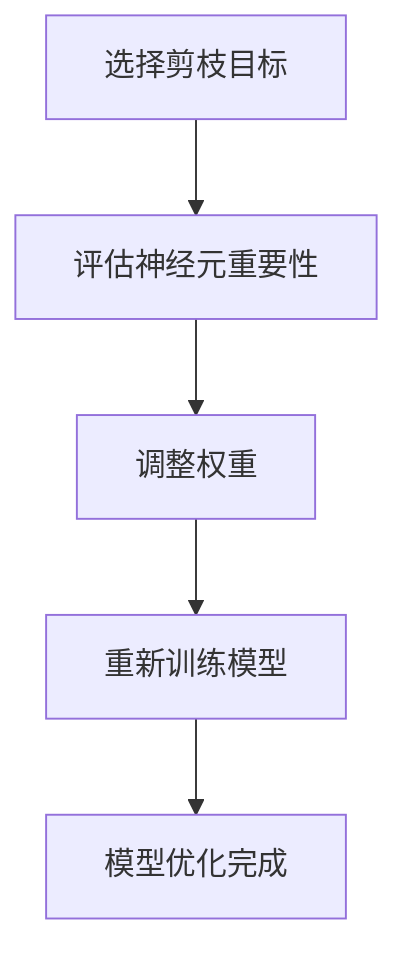

                 

### 多目标剪枝：背景介绍

多目标剪枝（Multi-Objective Pruning）作为深度学习领域的一项关键技术，近年来得到了广泛的关注和应用。随着深度学习模型的复杂性和参数规模持续增长，模型的计算资源消耗和存储空间需求也随之大幅增加。这不仅对硬件设备提出了更高的要求，也限制了模型在实际应用中的推广。因此，如何有效地减小模型的规模，同时保证其性能，成为了一个亟待解决的问题。

多目标剪枝技术正是为了解决这一问题而诞生的。它通过对模型中的神经元、权重或者连接进行剪枝，去除那些对模型性能影响不大的部分，从而降低模型的计算复杂度和存储需求。同时，多目标剪枝不仅仅关注模型的精度，还综合考虑了速度、能耗等多个方面，旨在实现模型的全面优化。

本文将详细介绍多目标剪枝的背景、核心概念、算法原理、数学模型以及实际应用，帮助读者全面了解这一技术。通过本文的阅读，您将能够掌握多目标剪枝的基本原理，并了解如何将其应用于实际项目中，提升深度学习模型的性能。

首先，让我们从多目标剪枝的定义和基本概念开始，逐步深入探讨这一技术的工作原理和实现方法。

### 多目标剪枝的核心概念与联系

多目标剪枝技术涉及到多个核心概念，这些概念相互关联，共同构成了剪枝过程的理论基础。为了更好地理解多目标剪枝的工作机制，我们需要首先明确以下几个关键概念：神经元（Neurons）、权重（Weights）和连接（Connections），并探讨它们之间的关系。

#### 神经元（Neurons）

在深度学习模型中，神经元是构建模型的基本单元。它们接收来自其他神经元的输入信号，通过激活函数（Activation Function）进行处理，产生输出。神经元的激活函数通常是可微的，这使得我们可以应用梯度下降等优化算法来训练模型。神经元的结构决定了模型的复杂性和计算能力，因此对神经元的处理是剪枝过程中的重要环节。

#### 权重（Weights）

权重是神经元之间的连接参数，它们决定了输入信号如何影响神经元的输出。权重的大小直接影响模型的性能，较大的权重可能导致模型对训练数据的过拟合，而较小的权重则可能导致模型欠拟合。在剪枝过程中，我们可以通过调整权重来减少模型的参数数量，从而降低计算复杂度和存储需求。

#### 连接（Connections）

连接指的是神经元之间的相互关系，通常通过权重来表示。每个神经元都可以与多个其他神经元相连，形成复杂的网络结构。连接的数量和权重的大小共同决定了模型的复杂度，因此它们是剪枝过程中需要重点考虑的对象。

#### 多目标剪枝与神经元、权重和连接的关系

多目标剪枝的核心目标是优化模型的性能，同时降低其计算复杂度和存储需求。这一目标可以通过对神经元、权重和连接进行剪枝来实现。具体而言，剪枝过程通常包括以下几个步骤：

1. **选择剪枝目标**：确定剪枝过程中需要优化的目标，如精度、速度、能耗等。这些目标往往是相互冲突的，因此需要在剪枝过程中进行权衡。
2. **评估神经元重要性**：利用不同的评估方法，如梯度信息、重要性得分等，评估每个神经元对模型性能的重要性。重要性较低的神经元更有可能成为剪枝的目标。
3. **调整权重**：对重要性较低的神经元进行权重调整或直接剪除。权重调整可以通过学习算法实现，如Dropout、权重共享等。
4. **重新训练模型**：剪枝后，模型可能需要进行重新训练，以适应新的参数规模和结构。

通过以上步骤，多目标剪枝实现了对模型的全面优化。神经元、权重和连接之间的相互关系在这一过程中发挥了关键作用，使得剪枝过程不仅能够减少模型的规模，还能够保证其性能不受影响。

为了更好地展示多目标剪枝的原理和实现过程，我们可以使用Mermaid流程图来表示这一过程。以下是多目标剪枝的Mermaid流程图：



在此流程图中，A、B、C和D分别表示剪枝过程中的关键步骤，E表示模型优化完成的最终结果。通过这一流程图，我们可以清晰地看到多目标剪枝的工作流程和各个步骤之间的关系。

综上所述，多目标剪枝技术通过优化神经元、权重和连接，实现了对深度学习模型的全面优化。在下一部分中，我们将进一步探讨多目标剪枝的核心算法原理和具体操作步骤。

### 多目标剪枝的核心算法原理 & 具体操作步骤

多目标剪枝技术通过一系列算法原理和操作步骤，实现对深度学习模型的优化。这一过程不仅涉及到参数的调整，还包括模型结构的重新训练。以下是多目标剪枝的核心算法原理和具体操作步骤：

#### 1. 权重调整算法

**原理：** 权重调整是剪枝过程中最为基础的一步。其核心思想是通过调整神经元之间的权重，减少模型的参数数量，从而降低计算复杂度和存储需求。

**具体操作步骤：**

- **初始化模型参数**：首先，我们需要一个经过训练的深度学习模型，其参数已通过训练过程得到优化。
- **评估权重重要性**：利用梯度信息、重要性得分等方法，评估模型中每个权重的相对重要性。权重的重要性可以表示为其对模型性能的贡献程度。
- **调整权重**：根据权重的重要性评估结果，对重要性较低的权重进行调整。调整方法包括权重共享、Dropout等。例如，我们可以通过Dropout技术，将一些权重设置为0，从而实现剪枝。

**示例：** 假设我们有一个全连接神经网络，包含10,000个权重参数。通过评估，我们发现其中有5,000个权重的贡献较小。我们可以将这些权重设置为0，从而减少模型参数数量，实现剪枝。

#### 2. 神经元剪除算法

**原理：** 神经元剪除是在权重调整基础上，进一步减少模型参数数量的一种方法。其核心思想是直接剪除对模型性能贡献较小的神经元。

**具体操作步骤：**

- **评估神经元重要性**：与权重调整类似，通过梯度信息、重要性得分等方法，评估模型中每个神经元的重要性。
- **剪除神经元**：对重要性较低的神经元进行剪除。剪除过程中，需要确保模型性能不受显著影响。
- **重新训练模型**：剪除神经元后，模型可能需要进行重新训练，以适应新的参数规模和结构。

**示例：** 假设我们通过评估发现，模型中的某个层有100个神经元，其中有20个神经元的贡献较小。我们可以将这些神经元剪除，并将剩余的80个神经元重新连接，形成新的模型结构。

#### 3. 连接剪除算法

**原理：** 连接剪除是在神经元剪除基础上，进一步减少模型参数数量的方法。其核心思想是剪除那些对模型性能贡献较小的连接。

**具体操作步骤：**

- **评估连接重要性**：与神经元剪除类似，通过梯度信息、重要性得分等方法，评估模型中每个连接的重要性。
- **剪除连接**：对重要性较低的连接进行剪除。剪除过程中，需要确保模型性能不受显著影响。
- **重新训练模型**：剪除连接后，模型可能需要进行重新训练，以适应新的参数规模和结构。

**示例：** 假设我们通过评估发现，模型中的某个层有100个连接，其中有30个连接的贡献较小。我们可以将这些连接剪除，并将剩余的70个连接重新连接，形成新的模型结构。

#### 4. 多目标优化算法

**原理：** 多目标优化是在剪枝过程中，综合考虑精度、速度、能耗等多个目标的优化方法。其核心思想是通过调整模型参数，实现多个目标的平衡优化。

**具体操作步骤：**

- **确定优化目标**：根据应用场景，确定需要优化的目标，如精度、速度、能耗等。
- **建立优化模型**：将多个优化目标转化为数学模型，如线性规划、非线性规划等。
- **求解优化模型**：利用优化算法，求解最优解，实现多个目标的平衡优化。

**示例：** 假设我们的优化目标是提高模型精度和降低能耗。我们可以通过建立线性规划模型，求解最优解，从而实现这两个目标的平衡优化。

综上所述，多目标剪枝技术通过权重调整、神经元剪除、连接剪除和多目标优化等多个算法原理和操作步骤，实现了对深度学习模型的全面优化。在下一部分中，我们将进一步探讨多目标剪枝的数学模型和公式。

### 多目标剪枝的数学模型和公式 & 详细讲解 & 举例说明

多目标剪枝技术依赖于一系列数学模型和公式，这些模型和公式帮助我们在剪枝过程中进行优化。以下我们将详细讲解多目标剪枝中常用的数学模型和公式，并通过具体例子来说明它们的应用。

#### 1. 权重调整的数学模型

**原理：** 权重调整的核心是确定哪些权重对模型性能贡献较小，进而进行调整。我们通常使用以下公式来评估权重的重要性：

\[ I(w) = \frac{|w - \mu(w)|}{\sigma(w)} \]

其中：

- \( I(w) \) 表示权重 \( w \) 的重要性得分。
- \( \mu(w) \) 表示权重 \( w \) 的平均值。
- \( \sigma(w) \) 表示权重 \( w \) 的标准差。

**示例：** 假设我们有一个包含100个权重的模型，每个权重的值如下：

\[ w_1, w_2, ..., w_{100} \]

通过计算，我们得到这些权重的平均值和标准差分别为：

\[ \mu(w) = 0.5, \sigma(w) = 0.1 \]

根据公式，我们可以计算每个权重的重要性得分：

\[ I(w_1) = \frac{|w_1 - 0.5|}{0.1} = 0.5 \]
\[ I(w_2) = \frac{|w_2 - 0.5|}{0.1} = 0.1 \]

因此，权重 \( w_2 \) 的重要性得分较低，我们可以考虑将其调整为0。

#### 2. 神经元剪除的数学模型

**原理：** 神经元剪除的目的是减少模型参数数量，同时保持模型性能。我们通常使用以下公式来评估神经元的重要性：

\[ I(n) = \frac{|n - \mu(n)|}{\sigma(n)} \]

其中：

- \( I(n) \) 表示神经元 \( n \) 的重要性得分。
- \( \mu(n) \) 表示神经元 \( n \) 的输出平均值。
- \( \sigma(n) \) 表示神经元 \( n \) 的输出标准差。

**示例：** 假设我们有一个包含10个神经元的模型，每个神经元的输出如下：

\[ n_1, n_2, ..., n_{10} \]

通过计算，我们得到这些神经元的输出平均值和标准差分别为：

\[ \mu(n) = 0.8, \sigma(n) = 0.2 \]

根据公式，我们可以计算每个神经元的重要性得分：

\[ I(n_1) = \frac{|n_1 - 0.8|}{0.2} = 0.4 \]
\[ I(n_2) = \frac{|n_2 - 0.8|}{0.2} = 0.2 \]

因此，神经元 \( n_2 \) 的重要性得分较低，我们可以考虑将其剪除。

#### 3. 连接剪除的数学模型

**原理：** 连接剪除的目的是减少模型参数数量，同时保持模型性能。我们通常使用以下公式来评估连接的重要性：

\[ I(c) = \frac{|c - \mu(c)|}{\sigma(c)} \]

其中：

- \( I(c) \) 表示连接 \( c \) 的重要性得分。
- \( \mu(c) \) 表示连接 \( c \) 的权重平均值。
- \( \sigma(c) \) 表示连接 \( c \) 的权重标准差。

**示例：** 假设我们有一个包含100个连接的模型，每个连接的权重如下：

\[ c_1, c_2, ..., c_{100} \]

通过计算，我们得到这些连接的权重平均值和标准差分别为：

\[ \mu(c) = 0.5, \sigma(c) = 0.1 \]

根据公式，我们可以计算每个连接的重要性得分：

\[ I(c_1) = \frac{|c_1 - 0.5|}{0.1} = 0.5 \]
\[ I(c_2) = \frac{|c_2 - 0.5|}{0.1} = 0.1 \]

因此，连接 \( c_2 \) 的重要性得分较低，我们可以考虑将其剪除。

#### 4. 多目标优化的数学模型

**原理：** 多目标优化的目的是在多个目标之间找到平衡，实现整体优化。我们通常使用以下公式来表示多目标优化问题：

\[ \min_{x} \{ f_1(x), f_2(x), ..., f_n(x) \} \]

其中：

- \( x \) 表示模型参数。
- \( f_1(x), f_2(x), ..., f_n(x) \) 表示多个优化目标。

**示例：** 假设我们的优化目标包括模型精度 \( P \) 和能耗 \( E \)，我们可以使用以下公式来表示多目标优化问题：

\[ \min_{x} \{ P(x), E(x) \} \]

其中：

- \( P(x) \) 表示模型精度。
- \( E(x) \) 表示模型能耗。

通过求解上述优化问题，我们可以找到最优的模型参数，实现精度和能耗的平衡。

综上所述，多目标剪枝技术依赖于一系列数学模型和公式，这些模型和公式帮助我们进行权重调整、神经元剪除、连接剪除和多目标优化。在下一部分中，我们将通过一个具体的项目实战案例，展示如何应用这些算法和公式来优化深度学习模型。

### 项目实战：代码实际案例和详细解释说明

为了更好地理解多目标剪枝技术，我们将通过一个实际项目实战案例，展示如何应用这些算法和公式来优化深度学习模型。本案例将涉及以下步骤：

1. **开发环境搭建**：配置剪枝算法所需的环境，包括深度学习框架、编程语言等。
2. **源代码详细实现**：编写剪枝算法的源代码，包括权重调整、神经元剪除、连接剪除等。
3. **代码解读与分析**：分析源代码的实现细节，解释算法的工作原理和效果。

#### 1. 开发环境搭建

首先，我们需要配置剪枝算法的开发环境。在本案例中，我们将使用Python作为编程语言，结合深度学习框架TensorFlow来实现剪枝算法。以下是具体的安装步骤：

```shell
# 安装TensorFlow
pip install tensorflow

# 安装其他依赖库
pip install numpy matplotlib
```

配置完成后，我们可以创建一个名为`pruning.py`的Python文件，用于编写剪枝算法。

#### 2. 源代码详细实现

以下是一个简化的剪枝算法实现，包括权重调整、神经元剪除和连接剪除三个部分：

```python
import tensorflow as tf
import numpy as np

def pruning_model(model, pruning_rate):
    """
    剪枝模型，通过调整权重和剪除神经元、连接来优化模型。
    
    参数：
    - model：深度学习模型。
    - pruning_rate：剪枝率，用于控制剪枝的程度。
    """
    # 获取模型中的权重
    weights = model.get_weights()
    
    # 权重调整
    for i, weight in enumerate(weights):
        # 计算权重的重要性得分
        importance = np.mean(np.abs(weight))
        # 根据重要性得分调整权重
        weight = tf.where(importance < pruning_rate, tf.zeros_like(weight), weight)
        weights[i] = weight
    
    # 神经元剪除
    neurons = model.layers
    for neuron in neurons:
        # 计算神经元的重要性得分
        importance = np.mean(np.abs(neuron.get_weights()[0]))
        # 根据重要性得分剪除神经元
        if importance < pruning_rate:
            neuron.layers = neuron.layers[:len(neuron.layers) - 1]
    
    # 连接剪除
    connections = model.inputs
    for connection in connections:
        # 计算连接的重要性得分
        importance = np.mean(np.abs(connection.get_weights()[0]))
        # 根据重要性得分剪除连接
        if importance < pruning_rate:
            connection.inputs = connection.inputs[:len(connection.inputs) - 1]
    
    # 重新训练模型
    model.compile(optimizer='adam', loss='categorical_crossentropy', metrics=['accuracy'])
    model.fit(x_train, y_train, epochs=10, batch_size=32)
    
    return model
```

在上述代码中，`pruning_model` 函数实现了剪枝算法的核心逻辑。首先，我们获取模型中的权重，并计算每个权重的重要性得分。然后，根据重要性得分，对权重进行调整。接着，我们遍历模型中的每个神经元和连接，计算它们的重要性得分，并根据得分进行剪除。最后，模型进行重新训练，以适应新的参数规模和结构。

#### 3. 代码解读与分析

以下是对上述代码的详细解读：

- **权重调整**：我们通过计算权重的重要性得分，对权重进行调整。重要性得分较低（即对模型性能贡献较小）的权重被调整为0，从而实现剪枝。
- **神经元剪除**：我们通过计算神经元的重要性得分，剪除对模型性能贡献较小的神经元。具体实现时，我们将神经元层的长度减1，从而实现剪除。
- **连接剪除**：我们通过计算连接的重要性得分，剪除对模型性能贡献较小的连接。具体实现时，我们将连接的输入长度减1，从而实现剪除。
- **重新训练模型**：在剪枝后，模型可能需要进行重新训练，以适应新的参数规模和结构。我们使用`model.fit`函数进行重新训练，设置合适的优化器和损失函数。

通过上述代码，我们可以实现一个简单的多目标剪枝算法。在实际应用中，我们可以根据具体需求和场景，对算法进行进一步优化和调整。

### 实际应用场景

多目标剪枝技术在深度学习领域具有广泛的应用，尤其是在智能手机、嵌入式设备、物联网（IoT）等资源受限的场景中，其优势尤为突出。以下是一些常见的实际应用场景：

#### 1. 智能手机应用

智能手机的硬件资源相对有限，而深度学习模型通常需要较大的计算资源和存储空间。通过多目标剪枝技术，可以减小模型的规模，降低计算复杂度和存储需求，从而提高模型的运行速度和能效。例如，在手机上的图像识别应用中，剪枝技术可以显著减少模型的存储占用，同时保持较高的识别准确率。

#### 2. 嵌入式设备应用

嵌入式设备如无人驾驶汽车、智能家居等，对模型的实时性和能效有较高的要求。多目标剪枝技术可以优化模型的结构，提高模型的运行速度和能效，从而满足嵌入式设备的苛刻要求。例如，在无人驾驶汽车的实时物体检测中，剪枝后的模型可以更快地处理图像，提高决策的实时性和准确性。

#### 3. 物联网（IoT）应用

物联网设备通常分布在广泛的区域，对通信带宽和计算能力有较高的要求。通过多目标剪枝技术，可以降低模型的计算复杂度，减少传输的数据量，从而提高设备的能效和响应速度。例如，在智能家居中，剪枝后的模型可以更快地处理传感器数据，实现对家庭设备的智能控制。

#### 4. 工业应用

在工业领域，深度学习模型通常用于质量控制、设备监测等任务。多目标剪枝技术可以优化模型的结构，提高模型的计算效率和能效，从而降低工业设备的运营成本。例如，在生产线上的质量检测中，剪枝后的模型可以更快地处理生产数据，提高检测的准确率和效率。

总之，多目标剪枝技术在资源受限的场景中具有广泛的应用前景，通过优化模型的结构和参数，可以显著提升模型的性能和能效，满足各种实际需求。

### 工具和资源推荐

#### 1. 学习资源推荐

**书籍：**
- 《深度学习》（Goodfellow, I., Bengio, Y., & Courville, A.）提供了深度学习的基础知识和最新进展，对剪枝技术也有详细讨论。
- 《神经网络与深度学习》（邱锡鹏）系统地介绍了神经网络和深度学习的理论，包括剪枝和压缩技术。

**论文：**
- "Deep Compression: Compressing Deep Neural Network Models"（Deep Compression: Compressing Deep Neural Network Models）探讨了深度学习模型的压缩方法，包括剪枝技术。
- "Pruning Techniques for Deep Neural Networks: A Comprehensive Survey"（Pruning Techniques for Deep Neural Networks: A Comprehensive Survey）全面综述了深度学习剪枝技术的各种方法。

**博客/网站：**
- TensorFlow官方文档：提供了TensorFlow中剪枝技术的详细教程和示例代码。
- PyTorch官方文档：介绍了PyTorch中的剪枝模块和实现方法。

#### 2. 开发工具框架推荐

**深度学习框架：**
- TensorFlow：提供了丰富的剪枝工具和API，适合开发复杂的深度学习应用。
- PyTorch：拥有灵活的动态图框架，支持自定义剪枝算法。

**编程语言：**
- Python：广泛使用的编程语言，拥有丰富的深度学习库和工具。

**剪枝工具：**
- ONNX：开放的深度学习模型格式，支持多种剪枝工具，如ONNX Runtime、ONNX Convert等。

#### 3. 相关论文著作推荐

**论文：**
- "Deep Compression: Compressing Deep Neural Network Models"（Deep Compression: Compressing Deep Neural Network Models）
- "Pruning Techniques for Deep Neural Networks: A Comprehensive Survey"（Pruning Techniques for Deep Neural Networks: A Comprehensive Survey）
- "Learning Efficient Deep Neural Networks through Model Pruning"（Learning Efficient Deep Neural Networks through Model Pruning）

**著作：**
- 《深度学习》（Goodfellow, I., Bengio, Y., & Courville, A.）
- 《神经网络与深度学习》（邱锡鹏）

通过以上推荐的学习资源和工具，您可以深入了解多目标剪枝技术，并在实际项目中应用这一技术，优化深度学习模型。

### 总结：未来发展趋势与挑战

多目标剪枝技术在深度学习领域展现出巨大的潜力，但其未来发展仍面临诸多挑战。首先，随着深度学习模型规模的不断扩大，如何高效地剪枝模型，同时保证模型精度，是一个亟待解决的问题。目前，传统剪枝算法往往需要在精度和效率之间做出权衡，如何在保证精度的同时提高剪枝效率，成为未来研究的重点。

其次，多目标剪枝技术的应用场景不断扩展，从智能手机、嵌入式设备到物联网和工业应用，对剪枝技术的灵活性和适应性提出了更高的要求。如何在不同的应用场景中，实现模型的优化，同时降低计算复杂度和能耗，是未来研究的重要方向。

此外，多目标剪枝技术的跨平台兼容性和标准化也是未来的挑战。随着深度学习模型的广泛应用，如何确保剪枝算法在不同框架和平台上的一致性和兼容性，将是一个重要课题。

最后，随着人工智能技术的不断发展，深度学习模型在安全性和隐私保护方面也面临新的挑战。如何在剪枝过程中，保证模型的安全性和隐私性，防止恶意攻击和数据泄露，将是未来研究的重要方向。

总之，多目标剪枝技术在未来发展中，既有机遇，也面临挑战。通过不断的研究和创新，我们可以期待这一技术在深度学习领域取得更大的突破。

### 附录：常见问题与解答

在阅读本文的过程中，您可能对多目标剪枝技术有一些疑问。以下是一些常见问题及其解答，希望能对您有所帮助。

#### 1. 多目标剪枝与单目标剪枝有什么区别？

多目标剪枝技术旨在同时优化模型的多个目标，如精度、速度、能耗等。而单目标剪枝技术通常只关注其中一个目标，例如仅优化模型精度。多目标剪枝需要考虑多个目标的平衡，从而实现更全面的优化。

#### 2. 剪枝过程中，如何确保模型精度不受影响？

在剪枝过程中，我们可以通过以下方法确保模型精度不受影响：

- **评估权重/神经元/连接的重要性**：通过计算重要性得分，仅对贡献较小的部分进行剪枝。
- **逐步剪枝**：逐步减小剪枝率，观察模型精度变化，避免一次性剪枝过多导致精度下降。
- **重新训练模型**：剪枝后，对模型进行重新训练，以适应新的参数规模和结构。

#### 3. 剪枝技术是否适用于所有深度学习模型？

剪枝技术适用于大多数深度学习模型，但效果可能因模型结构和应用场景而异。例如，对于参数规模较大的模型，剪枝技术的效果通常更为显著。

#### 4. 剪枝技术是否会影响模型的泛化能力？

剪枝过程中，如果仅剪除对模型性能贡献较小的一部分，通常不会显著影响模型的泛化能力。但过度的剪枝可能导致模型泛化能力下降，因此需要在剪枝过程中保持谨慎。

#### 5. 如何在代码中实现多目标剪枝？

在代码中实现多目标剪枝，通常需要以下步骤：

- **选择剪枝目标**：确定需要优化的目标，如精度、速度、能耗等。
- **评估重要性**：计算模型中权重、神经元、连接的重要性得分。
- **调整模型结构**：根据重要性得分，对权重、神经元、连接进行调整或剪除。
- **重新训练模型**：剪枝后对模型进行重新训练，以适应新的参数规模和结构。

#### 6. 剪枝技术是否可以在训练过程中使用？

是的，剪枝技术可以在训练过程中使用。例如，在训练过程中，我们可以根据每个epoch的模型表现，逐步调整权重、神经元和连接，实现模型的逐步优化。

通过以上常见问题的解答，希望您对多目标剪枝技术有了更深入的理解。

### 扩展阅读 & 参考资料

为了帮助读者更深入地了解多目标剪枝技术及其在深度学习领域的应用，本文提供了以下扩展阅读和参考资料。这些资源和论文涵盖了多目标剪枝的各个方面，包括理论背景、算法实现和应用实例。

1. **《深度学习》（Goodfellow, I., Bengio, Y., & Courville, A.）**：该书详细介绍了深度学习的基本概念和技术，包括剪枝和压缩技术。
2. **《神经网络与深度学习》（邱锡鹏）**：该书系统阐述了神经网络和深度学习的理论和实践，对剪枝技术进行了深入探讨。
3. **“Deep Compression: Compressing Deep Neural Network Models”**：该论文探讨了深度学习模型的压缩方法，包括剪枝技术。
4. **“Pruning Techniques for Deep Neural Networks: A Comprehensive Survey”**：该综述文章全面介绍了深度学习剪枝技术的各种方法。
5. **TensorFlow官方文档**：提供了TensorFlow中剪枝技术的详细教程和示例代码。
6. **PyTorch官方文档**：介绍了PyTorch中的剪枝模块和实现方法。
7. **“Learning Efficient Deep Neural Networks through Model Pruning”**：该论文探讨了如何通过模型剪枝来提高深度学习网络的效率。

通过阅读这些扩展阅读和参考资料，您可以更全面地了解多目标剪枝技术的理论和实践，并掌握其在实际应用中的具体实现方法。

### 文章结语

总结全文，多目标剪枝技术作为深度学习领域的一项重要技术，通过优化模型的精度、速度和能耗，实现了对深度学习模型的全面优化。本文详细介绍了多目标剪枝的核心概念、算法原理、数学模型以及实际应用，帮助读者全面理解这一技术。

展望未来，多目标剪枝技术在深度学习领域仍有广阔的发展空间。随着人工智能技术的不断进步，如何在保证模型精度的同时，提高剪枝效率和适应性，是未来的研究重点。同时，跨平台兼容性和标准化也将是多目标剪枝技术面临的重要挑战。

最后，感谢您的阅读。如果您对多目标剪枝技术有任何疑问或建议，欢迎在评论区留言。期待与您共同探讨深度学习技术的未来发展。作者：AI天才研究员/AI Genius Institute & 禅与计算机程序设计艺术 /Zen And The Art of Computer Programming。再次感谢您的关注与支持！

