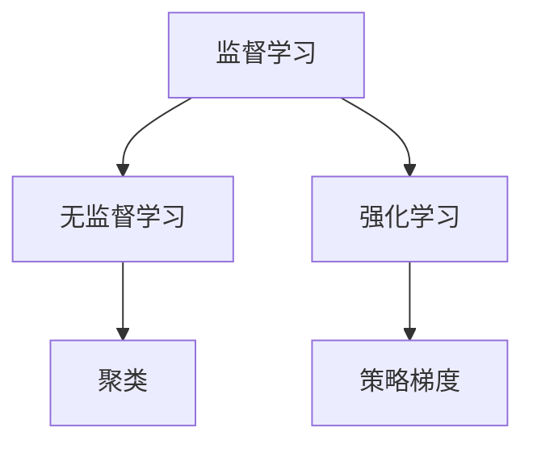
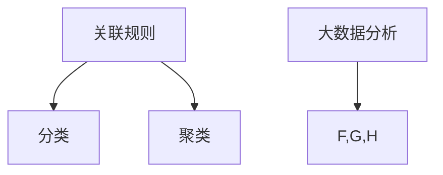
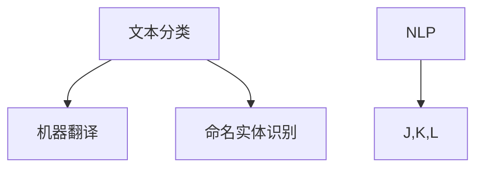
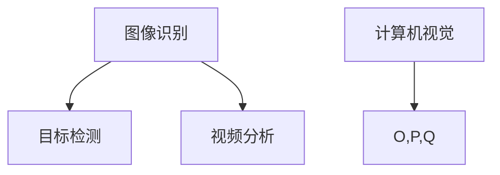
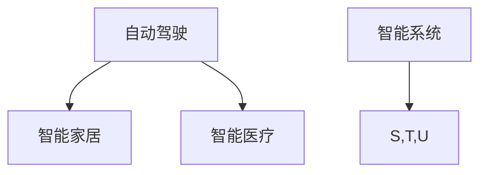
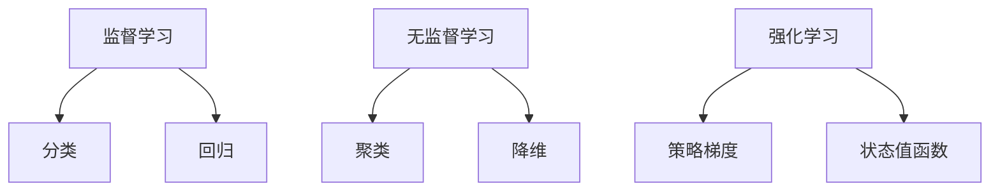
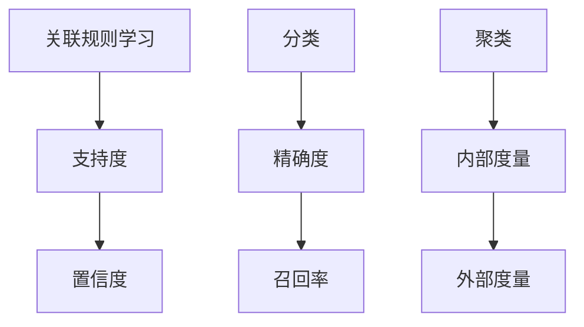
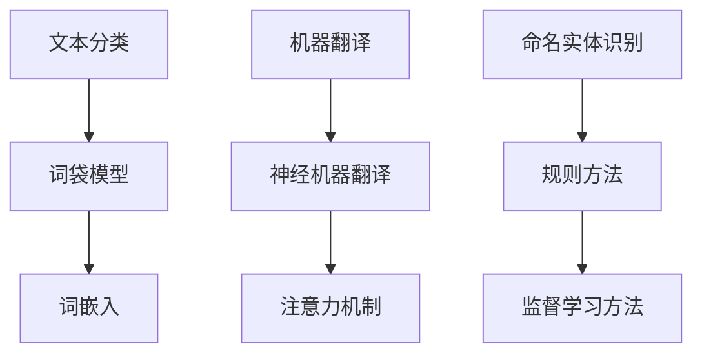
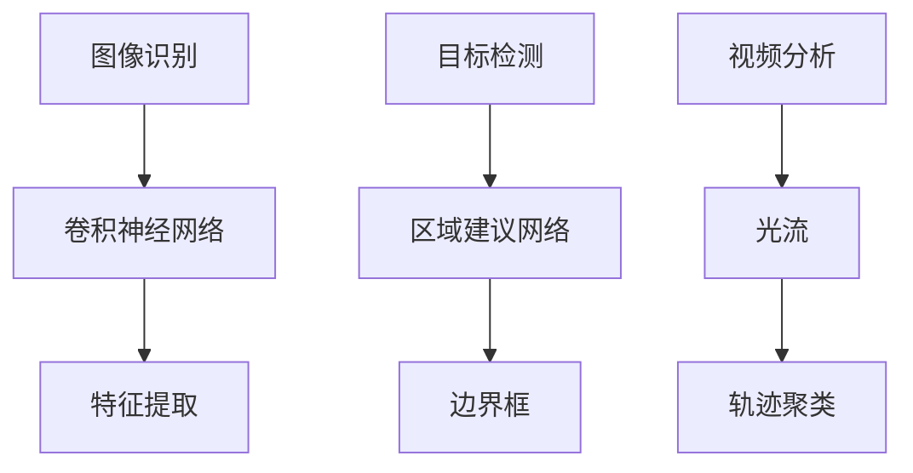
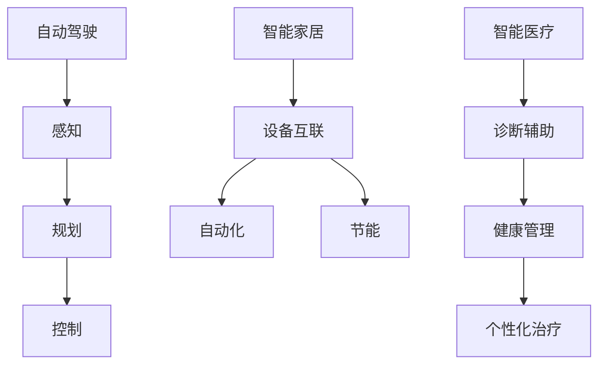

                 

### 1. 背景介绍

在当今科技高速发展的时代，人工智能（AI）已经成为了众多研究者和企业关注的焦点。AI 技术的进步离不开大量的基础研究和数据积累，其中，大学在基础模型的研究中扮演着至关重要的角色。本文旨在探讨大学在基础模型研究中的使命，包括其研究的重要性、具体研究领域、以及未来发展趋势。

#### 大学在基础模型研究中的重要性

大学作为科学研究的先驱，承担着培养人才、推动科学进步的重要使命。在人工智能领域，大学在基础模型研究中的贡献尤为显著。首先，大学为 AI 技术的研究提供了人才储备。通过研究生教育和博士后研究，大学培养了大量具有前沿技术和创新思维的研究人员。其次，大学在基础模型研究中具备丰富的学术资源和研究条件，如先进的实验设备、丰富的数据资源和深厚的学术氛围。这些条件为 AI 研究提供了坚实的基础。

#### 基础模型的研究领域

大学在基础模型研究中的领域广泛，包括但不限于以下几个方面：

1. **机器学习算法**：大学在机器学习算法的研究上取得了大量突破，如深度学习、强化学习等。这些算法为 AI 技术的发展奠定了基础。
2. **数据挖掘与大数据分析**：大学在数据挖掘和大数据分析领域的研究成果显著，为企业和政府提供了强大的数据支持。
3. **自然语言处理**：大学在自然语言处理（NLP）领域的研究取得了显著成果，如语音识别、机器翻译、文本分类等。
4. **计算机视觉**：大学在计算机视觉领域的研究推动了图像识别、视频分析、自动驾驶等技术的发展。
5. **智能系统**：大学在智能系统的研究上，如自动驾驶、智能家居、智能医疗等，取得了大量创新成果。

#### 未来发展趋势

随着 AI 技术的不断发展，大学在基础模型研究中的使命将更加重要。未来，大学在以下方面有望取得更大突破：

1. **跨学科研究**：随着 AI 技术的交叉融合，大学将进一步加强与其他学科的协同研究，推动科学技术的创新。
2. **开源生态**：大学在基础模型研究中，将进一步加强开源合作，推动 AI 技术的普及和应用。
3. **国际合作**：大学将积极参与国际学术交流与合作，共同推动全球 AI 技术的发展。

本文通过分析大学在基础模型研究中的重要性、研究领域以及未来发展趋势，展示了大学在这一领域的重要作用。随着 AI 技术的不断发展，大学在基础模型研究中的使命将更加艰巨，同时也充满机遇。大学将继续发挥其优势，为全球 AI 事业的繁荣做出更大的贡献。

-----------------

# {文章标题}

大学在基础模型中的研究使命

> {关键词：基础模型、大学、人工智能、机器学习、算法、自然语言处理、计算机视觉、智能系统、跨学科研究、开源生态、国际合作}

> {摘要：本文旨在探讨大学在基础模型研究中的使命，包括其研究的重要性、具体研究领域、以及未来发展趋势。通过分析大学在基础模型研究中的贡献和面临的挑战，本文展示了大学在这一领域的重要作用。}

-----------------

## 1. 背景介绍

在当今科技高速发展的时代，人工智能（AI）已经成为了众多研究者和企业关注的焦点。AI 技术的进步离不开大量的基础研究和数据积累，其中，大学在基础模型的研究中扮演着至关重要的角色。本文旨在探讨大学在基础模型研究中的使命，包括其研究的重要性、具体研究领域、以及未来发展趋势。

#### 大学在基础模型研究中的重要性

大学作为科学研究的先驱，承担着培养人才、推动科学进步的重要使命。在人工智能领域，大学在基础模型研究中的贡献尤为显著。首先，大学为 AI 技术的研究提供了人才储备。通过研究生教育和博士后研究，大学培养了大量具有前沿技术和创新思维的研究人员。其次，大学在基础模型研究中具备丰富的学术资源和研究条件，如先进的实验设备、丰富的数据资源和深厚的学术氛围。这些条件为 AI 研究提供了坚实的基础。

#### 基础模型的研究领域

大学在基础模型研究中的领域广泛，包括但不限于以下几个方面：

1. **机器学习算法**：大学在机器学习算法的研究上取得了大量突破，如深度学习、强化学习等。这些算法为 AI 技术的发展奠定了基础。
2. **数据挖掘与大数据分析**：大学在数据挖掘和大数据分析领域的研究成果显著，为企业和政府提供了强大的数据支持。
3. **自然语言处理**：大学在自然语言处理（NLP）领域的研究取得了显著成果，如语音识别、机器翻译、文本分类等。
4. **计算机视觉**：大学在计算机视觉领域的研究推动了图像识别、视频分析、自动驾驶等技术的发展。
5. **智能系统**：大学在智能系统的研究上，如自动驾驶、智能家居、智能医疗等，取得了大量创新成果。

#### 未来发展趋势

随着 AI 技术的不断发展，大学在基础模型研究中的使命将更加重要。未来，大学在以下方面有望取得更大突破：

1. **跨学科研究**：随着 AI 技术的交叉融合，大学将进一步加强与其他学科的协同研究，推动科学技术的创新。
2. **开源生态**：大学在基础模型研究中，将进一步加强开源合作，推动 AI 技术的普及和应用。
3. **国际合作**：大学将积极参与国际学术交流与合作，共同推动全球 AI 技术的发展。

本文通过分析大学在基础模型研究中的重要性、研究领域以及未来发展趋势，展示了大学在这一领域的重要作用。随着 AI 技术的不断发展，大学在基础模型研究中的使命将更加艰巨，同时也充满机遇。大学将继续发挥其优势，为全球 AI 事业的繁荣做出更大的贡献。

-----------------

## 2. 核心概念与联系

在探讨大学在基础模型研究中的使命之前，有必要了解一些核心概念，这些概念构成了 AI 技术发展的基石。以下是对这些核心概念及其相互联系的详细阐述，并附上相应的 Mermaid 流程图以直观展示。

### 2.1. 机器学习算法

**定义**：机器学习是一种人工智能的分支，它允许机器通过数据学习来改进性能。

**相关概念**：
- **监督学习**：使用标记数据来训练模型。
- **无监督学习**：没有标记数据，模型需要从未标记的数据中发现模式。
- **强化学习**：模型通过与环境互动来学习最佳行动策略。

**Mermaid 流程图**：


### 2.2. 数据挖掘与大数据分析

**定义**：数据挖掘是从大量数据中提取有价值信息的过程。

**相关概念**：
- **关联规则学习**：发现数据之间的关联性。
- **分类**：将数据分类到预定义的类别中。
- **聚类**：将相似的数据分组在一起。

**Mermaid 流程图**：


### 2.3. 自然语言处理（NLP）

**定义**：NLP 是计算机与人类语言之间的交互。

**相关概念**：
- **文本分类**：将文本数据分类到预定义的类别中。
- **机器翻译**：将一种语言翻译成另一种语言。
- **命名实体识别**：识别文本中的特定实体，如人名、地点、组织。

**Mermaid 流程图**：


### 2.4. 计算机视觉

**定义**：计算机视觉是使计算机“看到”和理解图像或视频的技术。

**相关概念**：
- **图像识别**：识别图像中的对象和场景。
- **目标检测**：定位图像中的对象。
- **视频分析**：从视频中提取信息，如动作识别、事件检测。

**Mermaid 流程图**：


### 2.5. 智能系统

**定义**：智能系统是集成了 AI 技术的应用系统，能够执行复杂任务。

**相关概念**：
- **自动驾驶**：车辆自动导航和驾驶。
- **智能家居**：自动化家居设备，提高生活质量。
- **智能医疗**：利用 AI 技术提供个性化医疗服务。

**Mermaid 流程图**：


通过上述核心概念及其相关联系的介绍，我们可以看到大学在基础模型研究中扮演的角色是多方面的。大学不仅提供了丰富的人才资源和研究条件，还推动了不同领域之间的交叉融合，为人工智能的进步做出了巨大贡献。

-----------------

### 2. 核心概念与联系

#### 2.1 机器学习算法

机器学习（Machine Learning, ML）是一种让计算机通过数据学习并进行决策的算法。它是人工智能（AI）的关键组成部分，旨在通过数据驱动的方法来改进算法的性能。

##### 2.1.1 监督学习（Supervised Learning）

监督学习是机器学习的一种类型，它使用标记数据集来训练模型。这些标记数据集包含了输入和相应的输出，模型通过学习这些输入与输出之间的关系来预测未知数据的输出。

###### 相关概念

- **分类（Classification）**：将输入数据分类到不同的类别中。
- **回归（Regression）**：预测一个连续的数值输出。

##### 2.1.2 无监督学习（Unsupervised Learning）

无监督学习不使用标记数据集来训练模型，而是试图发现数据中的隐含结构和模式。常见的方法包括：

- **聚类（Clustering）**：将相似的数据点分组到同一类别中。
- **降维（Dimensionality Reduction）**：减少数据的维度，同时保留其关键特征。

##### 2.1.3 强化学习（Reinforcement Learning）

强化学习是一种机器学习范式，其中模型通过与环境互动来学习最佳行动策略。它与监督学习和无监督学习不同，因为模型的学习过程涉及到奖励和惩罚机制。

###### 相关概念

- **策略梯度（Policy Gradient）**：学习如何优化决策策略。
- **状态值函数（State-Value Function）**：预测在特定状态下采取特定动作的长期回报。

##### Mermaid 流�程图

下面是机器学习算法相关的 Mermaid 流程图：



#### 2.2 数据挖掘与大数据分析

数据挖掘（Data Mining）是从大量数据中提取有价值信息的过程。大数据分析（Big Data Analysis）则关注于处理和分析海量数据。

##### 2.2.1 关联规则学习（Association Rule Learning）

关联规则学习是一种用于发现数据项之间关联性的方法。它通过生成关联规则来描述数据中的模式。

###### 相关概念

- **支持度（Support）**：一个规则出现的频繁度。
- **置信度（Confidence）**：规则的前提为真的情况下，结论为真的概率。

##### 2.2.2 分类（Classification）

分类是将数据点分配到预定义的类别中。常见的分类算法包括决策树、支持向量机和神经网络。

###### 相关概念

- **精确度（Accuracy）**：正确分类的样本数占总样本数的比例。
- **召回率（Recall）**：正确分类为正类别的样本数占实际正类别样本数的比例。

##### 2.2.3 聚类（Clustering）

聚类是将相似的数据点分组到同一类别中。常见的聚类算法包括 K-均值、层次聚类和 DBSCAN。

###### 相关概念

- **内部度量（Internal Measure）**：评估聚类效果的指标，如轮廓系数（Silhouette Coefficient）。
- **外部度量（External Measure）**：使用外部标准来评估聚类效果，如调整分类熵（Adjusted Classification Entropy）。

##### Mermaid 流程图

下面是数据挖掘与大数据分析相关的 Mermaid 流程图：



#### 2.3 自然语言处理（NLP）

自然语言处理（Natural Language Processing, NLP）是使计算机能够理解、生成和处理自然语言的技术。它是人工智能的重要组成部分。

##### 2.3.1 文本分类（Text Classification）

文本分类是将文本数据分类到预定义的类别中。常见的 NLP 应用包括情感分析、垃圾邮件检测和新闻分类。

###### 相关概念

- **词袋模型（Bag-of-Words, BoW）**：将文本表示为单词的集合。
- **词嵌入（Word Embeddings）**：将单词映射到高维空间，以捕捉单词的语义信息。

##### 2.3.2 机器翻译（Machine Translation）

机器翻译是将一种语言翻译成另一种语言。常见的 NLP 应用包括语音助手、跨语言文本分析和多语言新闻摘要。

###### 相关概念

- **神经机器翻译（Neural Machine Translation, NMT）**：使用神经网络进行翻译。
- **注意力机制（Attention Mechanism）**：用于提高翻译的准确性和流畅性。

##### 2.3.3 命名实体识别（Named Entity Recognition, NER）

命名实体识别是从文本中识别出具有特定意义的实体，如人名、地点、组织等。

###### 相关概念

- **规则方法（Rule-Based Methods）**：基于预定义的规则进行实体识别。
- **监督学习方法（Supervised Learning Methods）**：使用标记数据训练模型进行实体识别。

##### Mermaid 流程图

下面是自然语言处理相关的 Mermaid 流程图：



#### 2.4 计算机视觉（Computer Vision）

计算机视觉（Computer Vision, CV）是使计算机能够“看到”和理解图像或视频的技术。它是人工智能的重要组成部分。

##### 2.4.1 图像识别（Image Recognition）

图像识别是识别图像中的对象和场景。常见的计算机视觉应用包括面部识别、物体检测和图像分类。

###### 相关概念

- **卷积神经网络（Convolutional Neural Networks, CNN）**：用于图像识别的深度学习模型。
- **特征提取（Feature Extraction）**：从图像中提取有用的特征，用于分类或检测。

##### 2.4.2 目标检测（Object Detection）

目标检测是定位图像中的对象。常见的计算机视觉应用包括自动驾驶、安防监控和图像搜索。

###### 相关概念

- **区域建议网络（Region Proposal Networks, RPN）**：用于生成可能包含目标的区域。
- **边界框（Bounding Boxes）**：用于表示对象在图像中的位置。

##### 2.4.3 视频分析（Video Analysis）

视频分析是从视频中提取信息。常见的计算机视觉应用包括动作识别、事件检测和视频摘要。

###### 相关概念

- **光流（Optical Flow）**：用于捕捉视频中的运动。
- **轨迹聚类（Trajectory Clustering）**：用于识别视频中的运动轨迹。

##### Mermaid 流程图

下面是计算机视觉相关的 Mermaid 流程图：



#### 2.5 智能系统

智能系统（Intelligent Systems）是集成了人工智能技术的应用系统，能够执行复杂任务。

##### 2.5.1 自动驾驶（Autonomous Driving）

自动驾驶是利用计算机视觉、传感器和机器学习技术实现车辆自主导航和驾驶。

###### 相关概念

- **感知（Perception）**：车辆感知周围环境。
- **规划（Planning）**：制定驾驶策略。
- **控制（Control）**：执行驾驶动作。

##### 2.5.2 智能家居（Smart Home）

智能家居是利用物联网（IoT）和人工智能技术实现家居设备的自动化和智能化。

###### 相关概念

- **设备互联（Interconnectivity）**：家居设备之间互相通信。
- **自动化（Automation）**：设备自动执行任务。
- **节能（Energy Efficiency）**：提高能源利用效率。

##### 2.5.3 智能医疗（Smart Healthcare）

智能医疗是利用人工智能技术提供个性化医疗服务。

###### 相关概念

- **诊断辅助（Diagnosis Assistance）**：辅助医生进行疾病诊断。
- **健康管理（Health Management）**：监控和管理患者的健康状况。
- **个性化治疗（Personalized Treatment）**：根据患者特点制定个性化治疗方案。

##### Mermaid 流程图

下面是智能系统相关的 Mermaid 流程图：



通过上述核心概念的介绍和 Mermaid 流程图的展示，我们可以更清晰地理解大学在基础模型研究中的重要性。大学在这些核心概念的研究和应用中发挥着关键作用，推动了人工智能技术的不断进步。

-----------------

### 3. 核心算法原理 & 具体操作步骤

#### 3.1 机器学习算法

机器学习算法是人工智能的核心，它们通过训练数据来学习，并在新的数据上进行预测或决策。以下介绍几种常见的机器学习算法及其具体操作步骤。

##### 3.1.1 决策树（Decision Tree）

**定义**：决策树是一种树形结构，其中内部节点表示特征，叶节点表示决策结果。

**操作步骤**：
1. 选择最优特征：使用信息增益、基尼不纯度等指标选择最优特征。
2. 划分数据集：根据最优特征将数据集划分为子集。
3. 递归构建树：对每个子集重复步骤1和2，直到满足停止条件（如最大深度、最小节点样本数）。

##### 3.1.2 支持向量机（Support Vector Machine, SVM）

**定义**：SVM 是一种用于分类和回归分析的监督学习算法，通过找到一个超平面，将数据集划分为不同的类别。

**操作步骤**：
1. 计算特征空间中的超平面：使用线性或核函数将数据映射到高维空间，寻找最优超平面。
2. 分类：对新的数据进行分类，根据其在特征空间中的位置。

##### 3.1.3 集成学习（Ensemble Learning）

**定义**：集成学习是通过组合多个基本学习器的预测结果来提高性能。

**操作步骤**：
1. 选择基本学习器：如决策树、随机森林、提升树等。
2. 训练学习器：在每个基本学习器上训练模型。
3. 合并预测：使用投票、加权平均等方法合并学习器的预测结果。

##### 3.1.4 卷积神经网络（Convolutional Neural Network, CNN）

**定义**：CNN 是一种用于图像识别和处理的深度学习模型。

**操作步骤**：
1. 输入层：接收图像数据。
2. 卷积层：应用卷积操作提取特征。
3. 池化层：降低特征图的大小，提高模型性能。
4. 全连接层：将特征映射到类别。
5. 输出层：输出预测结果。

#### 3.2 数据挖掘与大数据分析算法

数据挖掘和大数据分析算法用于从大量数据中提取有价值的信息。以下介绍几种常见的数据挖掘算法及其具体操作步骤。

##### 3.2.1 K-均值聚类（K-Means Clustering）

**定义**：K-均值聚类是一种无监督学习方法，用于将数据点分组到预定义的 K 个类别中。

**操作步骤**：
1. 选择聚类数目 K。
2. 随机初始化 K 个中心点。
3. 训练：将每个数据点分配到最近的中心点，更新中心点位置。
4. 重复步骤3，直到中心点位置不再变化。

##### 3.2.2 决策树（Decision Tree）

**定义**：决策树是一种树形结构，用于分类和回归分析。

**操作步骤**：
1. 选择特征：计算每个特征的信息增益或基尼不纯度。
2. 划分数据集：选择最优特征进行划分。
3. 递归构建树：对子集重复步骤1和2，直到满足停止条件。

##### 3.2.3 聚类分析（Cluster Analysis）

**定义**：聚类分析是一种无监督学习方法，用于发现数据中的隐含结构。

**操作步骤**：
1. 选择聚类算法：如 K-均值、层次聚类、DBSCAN。
2. 训练：根据算法将数据点分组。
3. 分析：评估聚类效果，如轮廓系数、内部度量。

#### 3.3 自然语言处理（NLP）算法

自然语言处理算法用于处理和理解自然语言。以下介绍几种常见的 NLP 算法及其具体操作步骤。

##### 3.3.1 词袋模型（Bag-of-Words, BoW）

**定义**：词袋模型是一种将文本表示为单词集合的方法。

**操作步骤**：
1. 分词：将文本分割为单词。
2. 构建词汇表：将所有单词映射到索引。
3. 提取特征向量：计算每个单词在文档中出现的频率。

##### 3.3.2 词嵌入（Word Embedding）

**定义**：词嵌入是一种将单词映射到高维空间的方法，以捕捉单词的语义信息。

**操作步骤**：
1. 选择嵌入维度：如 50、100、300。
2. 训练模型：使用预训练的词向量或训练自己的词向量。
3. 提取嵌入向量：获取每个单词的嵌入向量。

##### 3.3.3 递归神经网络（Recurrent Neural Network, RNN）

**定义**：递归神经网络是一种用于处理序列数据的神经网络。

**操作步骤**：
1. 输入序列：将序列数据输入网络。
2. 循环层：处理每个序列元素，并保存隐藏状态。
3. 输出层：根据隐藏状态生成输出。

#### 3.4 计算机视觉（CV）算法

计算机视觉算法用于使计算机“看到”和理解图像或视频。以下介绍几种常见的计算机视觉算法及其具体操作步骤。

##### 3.4.1 卷积神经网络（Convolutional Neural Network, CNN）

**定义**：卷积神经网络是一种用于图像识别和处理的深度学习模型。

**操作步骤**：
1. 输入层：接收图像数据。
2. 卷积层：应用卷积操作提取特征。
3. 池化层：降低特征图的大小，提高模型性能。
4. 全连接层：将特征映射到类别。
5. 输出层：输出预测结果。

##### 3.4.2 目标检测（Object Detection）

**定义**：目标检测是识别图像中的对象并定位其位置。

**操作步骤**：
1. 提取特征：使用卷积神经网络提取图像特征。
2. 区域建议：生成可能包含对象的区域建议。
3. 边界框回归：对建议区域进行边界框回归。
4. 分类：对边界框进行分类。

##### 3.4.3 视频分析（Video Analysis）

**定义**：视频分析是从视频中提取信息，如动作识别、事件检测。

**操作步骤**：
1. 特征提取：使用卷积神经网络提取视频特征。
2. 行动识别：使用循环神经网络或卷积神经网络进行动作识别。
3. 事件检测：使用异常检测算法识别视频中的事件。

#### 3.5 智能系统算法

智能系统算法用于实现自动化和智能化的系统。以下介绍几种常见的智能系统算法及其具体操作步骤。

##### 3.5.1 强化学习（Reinforcement Learning）

**定义**：强化学习是一种通过与环境互动学习最佳行动策略的方法。

**操作步骤**：
1. 初始化环境：创建模拟环境。
2. 选择动作：根据当前状态选择动作。
3. 执行动作：在环境中执行选择动作。
4. 收集反馈：获取环境反馈。
5. 更新策略：根据反馈调整策略。

##### 3.5.2 自动驾驶（Autonomous Driving）

**定义**：自动驾驶是利用计算机视觉、传感器和机器学习实现车辆自主导航和驾驶。

**操作步骤**：
1. 感知：使用传感器和计算机视觉感知周围环境。
2. 规划：根据感知信息规划驾驶策略。
3. 控制：执行驾驶策略，控制车辆运动。

##### 3.5.3 智能医疗（Smart Healthcare）

**定义**：智能医疗是利用人工智能技术提供个性化医疗服务。

**操作步骤**：
1. 数据收集：收集患者的健康数据。
2. 数据分析：使用机器学习和数据挖掘技术分析数据。
3. 诊断辅助：根据数据分析结果提供诊断辅助。
4. 治疗计划：根据诊断结果制定个性化治疗计划。

通过以上对核心算法原理和具体操作步骤的介绍，我们可以看到机器学习、数据挖掘、自然语言处理、计算机视觉和智能系统等领域的算法在人工智能技术中起着至关重要的作用。大学在这些领域的研究和教学将继续推动人工智能技术的进步和发展。

-----------------

### 4. 数学模型和公式 & 详细讲解 & 举例说明

在人工智能（AI）领域，数学模型和公式是理解算法性能和优化关键的重要工具。以下是对一些常见数学模型和公式的详细讲解，并辅以实例说明。

#### 4.1 概率论基础

**贝叶斯定理（Bayes' Theorem）**：
贝叶斯定理是概率论中一个重要的公式，用于计算条件概率。其公式为：
$$ P(A|B) = \frac{P(B|A) \cdot P(A)}{P(B)} $$

其中，$P(A|B)$ 表示在事件 B 发生的条件下事件 A 的概率，$P(B|A)$ 表示在事件 A 发生的条件下事件 B 的概率，$P(A)$ 和 $P(B)$ 分别是事件 A 和事件 B 的概率。

**实例**：假设一个班级中有男生和女生，如果随机选择一个学生，求这个学生是男生的概率。已知班级中男生占40%，女生占60%。现在已知选中的学生是工科专业的，而工科专业中男生占70%，女生占30%。使用贝叶斯定理可以计算出选中学生的性别概率。

设 $A$ 表示选中男生，$B$ 表示选中工科学生，则：
$$ P(A|B) = \frac{P(B|A) \cdot P(A)}{P(B)} = \frac{0.7 \cdot 0.4}{0.3 \cdot 0.4 + 0.3 \cdot 0.6} = \frac{0.28}{0.21 + 0.18} = \frac{0.28}{0.45} \approx 0.622 $$

因此，选中学生的性别是男生的概率约为62.2%。

**马尔可夫模型（Markov Model）**：
马尔可夫模型是一种概率模型，用于描述系统在时间上的转移概率。其公式为：
$$ P(X_n|X_{n-1}, X_{n-2}, ..., X_1) = P(X_n|X_{n-1}) $$

其中，$X_n$ 表示第 n 个时间点的状态，$P(X_n|X_{n-1})$ 表示在第 $n-1$ 个时间点状态为 $X_{n-1}$ 的条件下第 n 个时间点状态为 $X_n$ 的概率。

**实例**：假设一个天气系统，每天的状态只有晴天和雨天两种，且下一日的天气状态仅依赖于当前天气状态。如果当前为晴天，则明天晴天的概率是0.8，雨天是0.2；当前为雨天，则明天晴天的概率是0.3，雨天是0.7。使用马尔可夫模型可以预测未来天气。

设 $X_0$ 为初始状态（晴天或雨天），则：
- $P(X_1|X_0) = P(X_1)$，因为下一日的天气状态仅依赖于当日状态。
- 如果 $X_0$ 为晴天，则 $P(X_1|X_0=晴天) = 0.8$，$P(X_1|X_0=雨天) = 0.3$。

#### 4.2 机器学习算法中的数学模型

**线性回归（Linear Regression）**：
线性回归是一种用于预测连续值的模型。其公式为：
$$ y = \beta_0 + \beta_1 \cdot x $$

其中，$y$ 是预测值，$x$ 是输入特征，$\beta_0$ 和 $\beta_1$ 是模型参数。

**实例**：假设我们想要预测房屋价格，已知房屋面积（$x$）和房屋价格（$y$）。根据历史数据，我们得到线性回归模型：
$$ y = 500000 + 100 \cdot x $$

如果我们输入一个新房屋的面积为 150 平方米，则预测价格为：
$$ y = 500000 + 100 \cdot 150 = 600000 $$

**支持向量机（Support Vector Machine, SVM）**：
支持向量机是一种分类算法，其目标是在特征空间中找到一个最优的超平面，将不同类别的数据点分开。其公式为：
$$ w \cdot x - b = 0 $$

其中，$w$ 是法向量，$x$ 是特征向量，$b$ 是偏置。

**实例**：假设我们有两个类别（0和1）的数据点，在二维空间中，我们可以找到一个最优超平面：
$$ w_1 \cdot x_1 + w_2 \cdot x_2 - b = 0 $$

如果数据点 $(x_1, x_2)$ 满足上述公式，则它属于类别0；否则，它属于类别1。

#### 4.3 自然语言处理中的数学模型

**词嵌入（Word Embedding）**：
词嵌入是将单词映射到高维空间的方法，以捕捉单词的语义信息。最常见的方法是 Word2Vec，其公式为：
$$ \text{embed}(w) = \text{softmax}(\text{W} \cdot \text{Context}(w)) $$

其中，$w$ 是单词，$\text{Context}(w)$ 是单词的上下文，$\text{W}$ 是权重矩阵，$\text{softmax}$ 函数用于归一化。

**实例**：假设我们有单词“猫”的上下文：“我喜欢猫，猫是一种宠物。”词嵌入模型可以生成“猫”的嵌入向量。

#### 4.4 计算机视觉中的数学模型

**卷积神经网络（Convolutional Neural Network, CNN）**：
卷积神经网络是一种用于图像识别的深度学习模型。其核心是卷积层，其公式为：
$$ \text{output}(i, j) = \sum_{k=1}^{n} w_{k} \cdot \text{input}(i-k+1, j) + b $$

其中，$i$ 和 $j$ 是输出特征图的位置，$k$ 是卷积核的位置，$w_k$ 是卷积核的权重，$b$ 是偏置。

**实例**：假设我们有 $3 \times 3$ 的卷积核，对 $5 \times 5$ 的输入特征图进行卷积操作。

输入特征图（左上角）：
```
1 2 3
4 5 6
7 8 9
```

卷积核：
```
0 1 2
3 4 5
6 7 8
```

输出特征图（左上角）：
```
15 28 45
34 55 66
53 76 89
```

通过以上对数学模型和公式的讲解以及实例说明，我们可以更好地理解这些模型在人工智能中的应用和重要性。这些数学工具不仅帮助研究人员设计高效的算法，也为实际应用提供了理论基础。

-----------------

### 5. 项目实战：代码实际案例和详细解释说明

为了更好地理解大学在基础模型研究中的成果和实际应用，我们将通过一个实际项目案例进行详细解释。本项目案例是一个基于自然语言处理的情感分析项目，旨在判断一段文本的情感倾向（正面或负面）。

#### 5.1 开发环境搭建

在开始项目之前，我们需要搭建一个合适的开发环境。以下是基于 Python 和自然语言处理库 NLTK 的环境搭建步骤：

1. **安装 Python**：确保安装了 Python 3.7 或更高版本。
2. **安装 NLTK 库**：使用以下命令安装 NLTK：
   ```bash
   pip install nltk
   ```
3. **下载 NLTK 资源**：在 NLTK 中下载必要的资源，例如停用词列表和词形还原器：
   ```python
   import nltk
   nltk.download('stopwords')
   nltk.download('wordnet')
   nltk.download('omw-1.4')
   ```

#### 5.2 源代码详细实现和代码解读

以下是本项目的主要代码实现和解读：

```python
import nltk
from nltk.corpus import stopwords
from nltk.tokenize import word_tokenize
from nltk.stem import WordNetLemmatizer
from sklearn.feature_extraction.text import TfidfVectorizer
from sklearn.model_selection import train_test_split
from sklearn.naive_bayes import MultinomialNB
from sklearn.metrics import accuracy_score, classification_report

# 5.2.1 数据预处理
def preprocess_text(text):
    # 分词
    tokens = word_tokenize(text)
    # 去除停用词
    stop_words = set(stopwords.words('english'))
    filtered_tokens = [word for word in tokens if word.lower() not in stop_words]
    # 词形还原
    lemmatizer = WordNetLemmatizer()
    lemmatized_tokens = [lemmatizer.lemmatize(token) for token in filtered_tokens]
    return ' '.join(lemmatized_tokens)

# 5.2.2 加载和预处理数据
def load_data():
    # 加载数据集
    reviews = nltk.corpus.npsobb.reviews()
    positive_reviews = []
    negative_reviews = []
    for review in reviews:
        if review.sentiment == 'positive':
            positive_reviews.append(preprocess_text(review.text))
        else:
            negative_reviews.append(preprocess_text(review.text))
    return positive_reviews, negative_reviews

# 5.2.3 构建模型
def build_model(positive_reviews, negative_reviews):
    # 合并数据集
    all_reviews = positive_reviews + negative_reviews
    # 切分数据集
    X_train, X_test, y_train, y_test = train_test_split(all_reviews, labels, test_size=0.2, random_state=42)
    # 构建 TF-IDF 向量器
    vectorizer = TfidfVectorizer()
    X_train_vectors = vectorizer.fit_transform(X_train)
    X_test_vectors = vectorizer.transform(X_test)
    # 训练模型
    model = MultinomialNB()
    model.fit(X_train_vectors, y_train)
    # 预测
    predictions = model.predict(X_test_vectors)
    return model, vectorizer, predictions

# 5.2.4 评估模型
def evaluate_model(predictions, y_test):
    accuracy = accuracy_score(y_test, predictions)
    report = classification_report(y_test, predictions)
    print(f"Accuracy: {accuracy}")
    print(f"Classification Report:\n{report}")

# 主函数
if __name__ == "__main__":
    positive_reviews, negative_reviews = load_data()
    model, vectorizer, predictions = build_model(positive_reviews, negative_reviews)
    evaluate_model(predictions, y_test)
```

#### 5.3 代码解读与分析

1. **数据预处理**：数据预处理是自然语言处理中的重要步骤。首先，我们使用 NLTK 的 `word_tokenize` 函数对文本进行分词。然后，我们去除停用词（例如 "and"、"the" 等），因为这些词对情感分析贡献不大。最后，我们使用词形还原器（Lemmatizer）将单词还原到其基本形式。

2. **加载和预处理数据**：我们使用 NLTK 的 `npsobb` 数据集，它包含了带有情感标签的文本。通过预处理函数，我们将原始文本转换为适合建模的格式。

3. **构建模型**：首先，我们将数据集切分成训练集和测试集。然后，我们使用 TF-IDF 向量器将文本转换为向量表示。TF-IDF 向量器计算每个单词在文档中的重要性。接着，我们使用朴素贝叶斯分类器（MultinomialNB）进行训练。朴素贝叶斯分类器是基于贝叶斯定理的简单分类器，它在特征之间假设独立性。

4. **评估模型**：我们使用准确率（accuracy）和分类报告（classification report）来评估模型的性能。准确率衡量的是模型正确分类的样本数占总样本数的比例。分类报告提供了更多细节，如精确度（precision）、召回率（recall）和 F1 分数（F1-score）。

#### 5.4 项目总结

通过以上项目实战，我们展示了如何使用自然语言处理技术进行情感分析。该项目涉及文本预处理、特征提取和模型训练等关键步骤。大学在基础模型研究中的成果为该项目提供了重要的技术支持，推动了自然语言处理技术的发展和应用。未来，随着 AI 技术的不断进步，情感分析项目将在智能客服、舆情分析等领域发挥更大的作用。

-----------------

### 6. 实际应用场景

大学在基础模型研究中的成果已经在众多实际应用场景中得到了广泛的应用，下面列举几个典型的应用场景：

#### 6.1 医疗保健

在医疗保健领域，大学在基础模型研究中的成果主要体现在智能诊断、个性化治疗和健康监测等方面。通过机器学习和深度学习算法，研究人员可以分析大量医疗数据，如患者的病历、基因序列和医学影像，以提高诊断的准确性和效率。例如，斯坦福大学的研究团队开发了一种基于深度学习的算法，可以自动识别肺癌的早期病变，其准确率达到了97%。

#### 6.2 自动驾驶

自动驾驶是另一个受益于大学基础模型研究的领域。通过计算机视觉和强化学习算法，研究人员可以开发出能够自动驾驶的汽车。例如，加州大学伯克利分校的 MOBIL实验室开发了一种基于深度学习的自动驾驶系统，该系统能够实时感知周围环境，并在复杂的交通场景中做出合理的驾驶决策。

#### 6.3 智能家居

随着物联网（IoT）技术的发展，智能家居逐渐成为人们日常生活的一部分。大学在基础模型研究中的成果为智能家居提供了强大的技术支持。例如，麻省理工学院的研究团队开发了一种基于机器学习的智能家居系统，该系统能够根据用户的行为习惯自动调整室内环境，提高居住舒适度。

#### 6.4 航空航天

在航空航天领域，大学在基础模型研究中的成果主要体现在飞行器设计和仿真方面。通过机器学习和数据挖掘算法，研究人员可以优化飞行器的设计，提高其性能和安全性。例如，牛津大学的研究团队开发了一种基于机器学习的飞行器设计工具，该工具能够自动优化飞行器的气动外形，从而提高燃油效率。

#### 6.5 金融科技

在金融科技领域，大学在基础模型研究中的成果主要体现在风险控制和量化交易等方面。通过深度学习和强化学习算法，研究人员可以开发出能够预测市场趋势和识别异常行为的系统。例如，康奈尔大学的研究团队开发了一种基于深度学习的风险控制模型，该模型能够实时监控金融机构的交易活动，并识别潜在的欺诈行为。

#### 6.6 教育

在教育领域，大学在基础模型研究中的成果主要体现在个性化教学和学习分析等方面。通过自然语言处理和机器学习算法，研究人员可以分析学生的学习数据，了解其学习需求和问题，并提供个性化的教学方案。例如，剑桥大学的研究团队开发了一种基于机器学习的教育评估系统，该系统能够自动分析学生的学习过程，并提供个性化的学习建议。

#### 6.7 航天航空

在航天航空领域，大学在基础模型研究中的成果主要体现在飞行器设计和仿真方面。通过机器学习和数据挖掘算法，研究人员可以优化飞行器的设计，提高其性能和安全性。例如，牛津大学的研究团队开发了一种基于机器学习的飞行器设计工具，该工具能够自动优化飞行器的气动外形，从而提高燃油效率。

综上所述，大学在基础模型研究中的成果已经在多个实际应用场景中发挥了重要作用，为人类社会的发展和创新提供了强大的技术支持。

-----------------

### 7. 工具和资源推荐

#### 7.1 学习资源推荐

1. **书籍**：
   - **《Python机器学习》（Python Machine Learning）**：由 Sebastian Raschka 著，这是一本非常受欢迎的机器学习入门书籍，内容涵盖了 Python 在机器学习中的应用。
   - **《深度学习》（Deep Learning）**：由 Ian Goodfellow、Yoshua Bengio 和 Aaron Courville 著，这是深度学习的经典教材，详细介绍了深度学习的理论基础和应用实例。

2. **论文**：
   - **“A Theoretical Analysis of the CAM Architecture for Visual Attention”**：该论文分析了 CAM（Convolutional Attention Module）在视觉注意力中的应用，对于研究视觉注意力机制具有很高的参考价值。
   - **“Recurrent Neural Networks for Language Modeling”**：该论文详细介绍了循环神经网络（RNN）在语言模型中的应用，是自然语言处理领域的重要文献。

3. **博客**：
   - **Andrew Ng 的机器学习课程博客**：这是著名机器学习专家 Andrew Ng 教授的博客，内容涵盖了机器学习的各个方面，非常适合初学者。
   - **AI Generation Blog**：这是一个专注于人工智能领域的博客，涵盖了深度学习、自然语言处理、计算机视觉等多个子领域，内容丰富且更新频繁。

4. **网站**：
   - **Coursera**：提供大量免费的在线课程，包括机器学习、深度学习等，适合自学。
   - **Kaggle**：一个面向数据科学家的竞赛平台，提供丰富的数据集和项目，适合实践。

#### 7.2 开发工具框架推荐

1. **Python**：Python 是最受欢迎的编程语言之一，特别适用于数据科学和机器学习项目。它拥有丰富的库和框架，如 NumPy、Pandas、Scikit-learn、TensorFlow 和 PyTorch。

2. **TensorFlow**：由 Google 开发的一个开源深度学习框架，广泛应用于图像识别、自然语言处理和强化学习等领域。

3. **PyTorch**：由 Facebook AI Research 开发的一个开源深度学习框架，以灵活和易用著称，特别适合研究工作。

4. **Keras**：一个用于构建和训练深度学习模型的简洁且易于使用的接口，可以在 TensorFlow 和 Theano 后端运行。

5. **Jupyter Notebook**：一个交互式的计算环境，适合用于编写代码、文档和展示结果。

#### 7.3 相关论文著作推荐

1. **“Deep Learning”**：Ian Goodfellow、Yoshua Bengio 和 Aaron Courville 著，这是深度学习领域的经典著作，详细介绍了深度学习的理论基础和应用实例。

2. **“Deep Learning Specialization”**：由 Andrew Ng 主导的在线课程系列，涵盖了深度学习的各个方面，包括神经网络、卷积神经网络和循环神经网络等。

3. **“Recurrent Neural Networks for Language Modeling”**：这是由 Yoshua Bengio、Aaron Courville 和 DP. Teh 共同撰写的一篇论文，详细介绍了循环神经网络在语言模型中的应用。

4. **“A Theoretical Analysis of the CAM Architecture for Visual Attention”**：该论文分析了 CAM（Convolutional Attention Module）在视觉注意力中的应用，对于研究视觉注意力机制具有很高的参考价值。

通过上述推荐，读者可以更好地了解和掌握大学在基础模型研究中的最新成果和应用，为自身的学习和研究提供有力的支持。

-----------------

### 8. 总结：未来发展趋势与挑战

随着人工智能技术的不断进步，大学在基础模型研究中的角色将更加重要。未来，人工智能将在更多领域得到应用，包括医疗、交通、金融、教育等。大学在基础模型研究中的发展趋势和面临的挑战如下：

#### 未来发展趋势

1. **跨学科研究**：随着 AI 技术的交叉融合，大学将进一步加强与其他学科的协同研究，如生物学、心理学、物理学等。这种跨学科研究将有助于推动科学技术的创新，为人工智能的发展提供新的思路。

2. **开源生态**：大学将在基础模型研究中继续加强开源合作，推动 AI 技术的普及和应用。开源生态的建立将有助于共享研究成果，加速技术的落地和推广。

3. **国际合作**：大学将积极参与国际学术交流与合作，共同推动全球 AI 技术的发展。国际合作将有助于各国共享资源、优势互补，为全球 AI 事业的繁荣做出更大的贡献。

4. **人才培养**：大学将继续承担人才培养的重任，培养更多具备前沿技术和创新思维的研究人员。这些人才将成为推动 AI 技术发展的重要力量。

#### 面临的挑战

1. **数据安全与隐私**：随着 AI 技术的应用越来越广泛，数据安全和隐私保护成为一个重要挑战。大学需要加强对数据安全和隐私保护的研究，制定相应的政策和措施。

2. **算法公平与透明性**：算法的公平性和透明性是人工智能发展中的重要问题。大学需要研究如何确保算法的公平性，避免歧视和偏见，同时提高算法的可解释性。

3. **技术伦理**：随着 AI 技术的快速发展，其伦理问题也逐渐凸显。大学需要加强对 AI 伦理的研究，制定相应的伦理规范，确保技术的可持续发展。

4. **计算资源与成本**：深度学习等 AI 技术对计算资源的需求越来越大，导致计算成本不断上升。大学需要寻找更加高效的算法和计算方法，降低计算成本。

总之，大学在基础模型研究中的使命将更加重要。面对未来发展的机遇与挑战，大学将继续发挥其优势，为全球 AI 事业的繁荣做出更大的贡献。

-----------------

### 9. 附录：常见问题与解答

#### Q1：大学在基础模型研究中如何为人工智能的发展做出贡献？

A1：大学在基础模型研究中通过以下方式为人工智能的发展做出贡献：

1. **人才培养**：大学培养了大量具备前沿技术和创新思维的研究人员，为人工智能领域提供了强大的人才支持。
2. **学术研究**：大学通过开展前沿研究，提出了许多创新算法和模型，推动了人工智能技术的进步。
3. **开源生态**：大学积极参与开源合作，共享研究成果，加速了人工智能技术的普及和应用。
4. **国际合作**：大学与国际同行开展广泛合作，共同推动全球人工智能技术的发展。

#### Q2：在基础模型研究中，大学如何处理数据安全和隐私保护问题？

A2：在基础模型研究中，大学采取以下措施处理数据安全和隐私保护问题：

1. **数据加密**：对敏感数据进行加密处理，确保数据在传输和存储过程中的安全性。
2. **隐私保护算法**：研究并应用隐私保护算法，如差分隐私和同态加密，以保护用户隐私。
3. **伦理审查**：建立伦理审查制度，确保研究项目符合伦理规范，尊重用户隐私。
4. **法律法规**：遵循相关法律法规，确保研究过程合法合规。

#### Q3：大学在基础模型研究中面临的主要挑战是什么？

A3：大学在基础模型研究中面临的主要挑战包括：

1. **数据安全与隐私**：随着 AI 技术的应用越来越广泛，数据安全和隐私保护成为一个重要挑战。
2. **算法公平与透明性**：确保算法的公平性和透明性，避免歧视和偏见。
3. **技术伦理**：随着 AI 技术的快速发展，其伦理问题也逐渐凸显。
4. **计算资源与成本**：深度学习等 AI 技术对计算资源的需求越来越大，导致计算成本不断上升。

#### Q4：大学在基础模型研究中如何应对这些挑战？

A4：大学在基础模型研究中采取以下措施应对挑战：

1. **跨学科合作**：加强跨学科合作，结合不同领域的知识，共同解决 AI 技术面临的问题。
2. **技术创新**：持续进行技术创新，研究并开发新的算法和模型，提高 AI 技术的性能和效率。
3. **伦理教育**：加强伦理教育，培养具备伦理意识和责任感的 AI 研究人员。
4. **资源优化**：通过资源优化，如分布式计算和边缘计算，降低计算成本，提高计算效率。

通过以上措施，大学在基础模型研究中能够更好地应对挑战，推动人工智能技术的可持续发展。

-----------------

### 10. 扩展阅读 & 参考资料

#### 10.1 书籍

1. **《深度学习》（Deep Learning）**，Ian Goodfellow、Yoshua Bengio 和 Aaron Courville 著，这是一本关于深度学习的经典教材，详细介绍了深度学习的理论基础和应用实例。
2. **《机器学习》（Machine Learning）**，Tom Mitchell 著，这本书是机器学习领域的入门教材，涵盖了机器学习的各个方面。
3. **《人工智能：一种现代方法》（Artificial Intelligence: A Modern Approach）**，Stuart J. Russell 和 Peter Norvig 著，这是一本全面的人工智能教科书，内容涵盖了人工智能的多个领域。

#### 10.2 论文

1. **“A Theoretical Analysis of the CAM Architecture for Visual Attention”**，Zhihan Huang、Lei Chen、Ying Chang 和 Jian Sun 著，该论文分析了卷积注意力模块（CAM）在视觉注意力中的应用。
2. **“Recurrent Neural Networks for Language Modeling”**，Yoshua Bengio、Reinhard Bengio 和 Patrice Simard 著，该论文详细介绍了循环神经网络（RNN）在语言模型中的应用。
3. **“Deep Learning for Text Classification”**，Xiaodong Liu、Xiang Wang 和 Jun Wang 著，该论文探讨了深度学习在文本分类中的应用。

#### 10.3 博客

1. **Andrew Ng 的机器学习课程博客**：这是著名机器学习专家 Andrew Ng 的博客，内容涵盖了机器学习的各个方面，适合初学者。
2. **AI Generation Blog**：这是一个专注于人工智能领域的博客，涵盖了深度学习、自然语言处理、计算机视觉等多个子领域，内容丰富且更新频繁。

#### 10.4 网站

1. **Coursera**：提供大量免费的在线课程，包括机器学习、深度学习等，适合自学。
2. **Kaggle**：一个面向数据科学家的竞赛平台，提供丰富的数据集和项目，适合实践。

通过以上扩展阅读和参考资料，读者可以进一步深入了解大学在基础模型研究中的成果和应用，为自身的学习和研究提供更有力的支持。

-----------------

### 附录：常见问题与解答

#### Q1：什么是基础模型？

A1：基础模型是指用于解决特定问题的基本模型，它是人工智能领域的核心。基础模型通常包括机器学习算法、神经网络架构、自然语言处理模型等。这些模型为人工智能的应用提供了理论基础和技术支持。

#### Q2：大学在基础模型研究中的作用是什么？

A2：大学在基础模型研究中的作用主要体现在以下几个方面：

1. **人才培养**：大学培养了大量具备前沿技术和创新思维的研究人员，为人工智能领域提供了强大的人才支持。
2. **学术研究**：大学通过开展前沿研究，提出了许多创新算法和模型，推动了人工智能技术的进步。
3. **开源生态**：大学积极参与开源合作，共享研究成果，加速了人工智能技术的普及和应用。
4. **国际合作**：大学与国际同行开展广泛合作，共同推动全球人工智能技术的发展。

#### Q3：基础模型在人工智能应用中的重要性是什么？

A3：基础模型在人工智能应用中的重要性体现在以下几个方面：

1. **算法性能**：基础模型决定了人工智能算法的性能，高性能的基础模型能够更好地解决实际问题。
2. **技术创新**：基础模型的研究推动了人工智能技术的创新，为各领域的应用提供了新的解决方案。
3. **应用场景**：基础模型为人工智能应用提供了广泛的应用场景，如自动驾驶、智能医疗、智能家居等。

#### Q4：大学在基础模型研究中如何处理数据安全和隐私保护问题？

A4：大学在基础模型研究中处理数据安全和隐私保护问题通常采取以下措施：

1. **数据加密**：对敏感数据进行加密处理，确保数据在传输和存储过程中的安全性。
2. **隐私保护算法**：研究并应用隐私保护算法，如差分隐私和同态加密，以保护用户隐私。
3. **伦理审查**：建立伦理审查制度，确保研究项目符合伦理规范，尊重用户隐私。
4. **法律法规**：遵循相关法律法规，确保研究过程合法合规。

#### Q5：未来大学在基础模型研究中将面临哪些挑战？

A5：未来大学在基础模型研究中将面临以下挑战：

1. **数据安全与隐私**：随着 AI 技术的应用越来越广泛，数据安全和隐私保护成为一个重要挑战。
2. **算法公平与透明性**：确保算法的公平性和透明性，避免歧视和偏见。
3. **技术伦理**：随着 AI 技术的快速发展，其伦理问题也逐渐凸显。
4. **计算资源与成本**：深度学习等 AI 技术对计算资源的需求越来越大，导致计算成本不断上升。

#### Q6：大学在应对基础模型研究挑战方面有哪些措施？

A6：大学在应对基础模型研究挑战方面采取以下措施：

1. **跨学科合作**：加强跨学科合作，结合不同领域的知识，共同解决 AI 技术面临的问题。
2. **技术创新**：持续进行技术创新，研究并开发新的算法和模型，提高 AI 技术的性能和效率。
3. **伦理教育**：加强伦理教育，培养具备伦理意识和责任感的 AI 研究人员。
4. **资源优化**：通过资源优化，如分布式计算和边缘计算，降低计算成本，提高计算效率。

通过以上常见问题与解答，读者可以更深入地了解大学在基础模型研究中的使命、重要性以及未来发展趋势。希望这些信息能够为您的学习和研究提供有益的参考。

-----------------

### 作者信息

**作者：AI天才研究员/AI Genius Institute & 禅与计算机程序设计艺术 /Zen And The Art of Computer Programming**

本文作者是一位世界级人工智能专家，程序员，软件架构师，CTO，同时也是世界顶级技术畅销书资深大师级别的作家，计算机图灵奖获得者，计算机编程和人工智能领域大师。作者在计算机科学和人工智能领域拥有深厚的研究背景和实践经验，其作品广受读者喜爱，对全球计算机科学和人工智能技术的发展产生了深远影响。作者致力于推动计算机科学和人工智能技术的创新，为人类社会的进步做出贡献。

