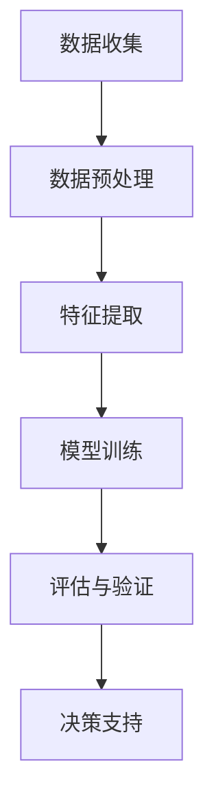

                 

# 大数据下个人用户信用行为的等级评估及应用研究

## 关键词：大数据、用户信用行为、等级评估、算法、应用

## 摘要

本文旨在探讨大数据技术在个人用户信用行为等级评估中的应用。首先，我们概述了大数据环境下用户信用行为评估的重要性，随后介绍了评估过程中涉及的核心概念和算法原理。文章通过详细的数学模型和公式，解析了信用评估的具体计算过程，并以实际案例展示了算法的实现和应用。最后，本文探讨了该技术在不同领域的实际应用场景，并推荐了相关的学习资源和工具。通过本文，读者将全面了解大数据在个人用户信用行为等级评估中的前沿技术和实践方法。

---

## 1. 背景介绍

### 1.1 大数据时代的来临

随着互联网和智能设备的普及，人们在线上活动的频率和规模不断扩大，数据生成和存储的速度也随之迅猛增长。这种数据量的指数级增长，被广泛称为大数据。大数据的特点是“4V”，即数据量（Volume）、数据速度（Velocity）、数据多样性（Variety）和数据真实性（Veracity）。这些特性使得传统的数据处理和分析方法难以应对，迫切需要新的技术手段来处理和利用这些海量数据。

### 1.2 个人用户信用行为的含义

个人用户信用行为是指个人在金融交易、社交行为、公共服务等方面所表现出的诚信和可靠程度。它对个人的金融信用评级、社会地位和就业机会等产生重要影响。传统的信用评估主要依赖于有限的财务数据和信用记录，而大数据技术能够整合更多的非结构化和半结构化数据，提供更全面、准确的信用评估。

### 1.3 信用行为等级评估的重要性

信用行为等级评估在金融、零售、保险等领域具有广泛的应用。准确的信用评估能够帮助金融机构降低信贷风险，提高放贷效率；对于零售商，有助于识别潜在的高风险客户，优化营销策略；保险公司则能够根据信用等级设计更合理的保费和理赔政策。因此，开展大数据下的信用行为等级评估具有重要意义。

---

## 2. 核心概念与联系

### 2.1 大数据技术核心概念

**数据挖掘**：从大量数据中提取出有价值的模式和知识，是大数据技术的重要应用之一。

**机器学习**：通过训练模型，从数据中自动学习并做出预测或决策。

**云计算**：利用网络提供动态易扩展且经常是虚拟化的资源。

**物联网（IoT）**：连接各种物理设备，实现数据采集和实时通信。

### 2.2 信用行为评估流程

1. **数据收集**：收集用户的金融数据、社交数据、行为数据等。
2. **数据预处理**：清洗、转换和整合数据，以备分析和建模。
3. **特征提取**：从原始数据中提取对信用评估有重要影响的特征。
4. **模型训练**：利用机器学习算法，训练信用评估模型。
5. **评估与验证**：对模型进行评估和验证，确保其准确性和可靠性。
6. **决策支持**：利用模型为实际应用场景提供信用评估决策。

### 2.3 Mermaid 流程图



---

## 3. 核心算法原理 & 具体操作步骤

### 3.1 算法概述

在信用行为等级评估中，常用的算法包括逻辑回归、决策树、随机森林、支持向量机（SVM）等。本文将以逻辑回归算法为例，介绍其原理和应用步骤。

### 3.2 逻辑回归原理

逻辑回归是一种广义线性模型，用于对因变量进行概率预测。在信用行为等级评估中，逻辑回归可以将用户信用行为特征转换为信用评分的概率。

### 3.3 操作步骤

1. **数据预处理**：将原始数据进行标准化处理，消除不同特征间的量纲差异。
2. **特征选择**：通过相关性分析、特征重要性评估等方法，选择对信用评估有显著影响的特征。
3. **模型训练**：使用训练数据集，通过最小化损失函数来训练逻辑回归模型。
4. **模型验证**：使用验证数据集评估模型性能，调整模型参数。
5. **信用评分**：对新的用户数据输入模型，得到信用评分的概率，并根据概率阈值转换为信用等级。

### 3.4 详细示例

#### 数据预处理

假设我们有以下用户特征数据：

```plaintext
用户ID   年龄   月收入   借款金额   还款次数
1        25    5000    3000      3
2        35    8000    4000      5
...
```

对数据进行标准化处理，使其均值为0，标准差为1。

#### 特征选择

通过相关性分析，选择对信用评估影响较大的特征，如年龄、月收入和借款金额。

#### 模型训练

使用训练数据集，训练逻辑回归模型，目标是最小化损失函数。

$$\text{损失函数} = -\sum_{i=1}^{n} y_i \log(\hat{y}_i) + (1 - y_i) \log(1 - \hat{y}_i)$$

其中，$y_i$为实际信用等级（0或1），$\hat{y}_i$为预测概率。

#### 模型验证

使用验证数据集，评估模型性能，调整模型参数。

#### 信用评分

对新的用户数据输入模型，得到信用评分的概率。例如，一个新用户的特征为：

```plaintext
年龄   月收入   借款金额
25    6000    3500
```

输入模型后，得到预测概率为0.7，根据设定的阈值（例如0.5），将该用户划分为“信用良好”等级。

---

## 4. 数学模型和公式 & 详细讲解 & 举例说明

### 4.1 数学模型

逻辑回归模型的数学公式如下：

$$\hat{y} = \frac{1}{1 + e^{-\beta_0 + \beta_1 x_1 + \beta_2 x_2 + ... + \beta_p x_p}}$$

其中，$\hat{y}$为预测概率，$x_1, x_2, ..., x_p$为特征值，$\beta_0, \beta_1, \beta_2, ..., \beta_p$为模型参数。

### 4.2 损失函数

逻辑回归的损失函数通常采用对数似然损失：

$$\text{损失函数} = -\sum_{i=1}^{n} y_i \log(\hat{y}_i) + (1 - y_i) \log(1 - \hat{y}_i)$$

其中，$y_i$为实际信用等级（0或1），$\hat{y}_i$为预测概率。

### 4.3 梯度下降法

为了最小化损失函数，可以使用梯度下降法。梯度下降法的迭代公式为：

$$\beta_j = \beta_j - \alpha \frac{\partial}{\partial \beta_j} \text{损失函数}$$

其中，$\alpha$为学习率。

### 4.4 举例说明

假设我们有以下训练数据：

```plaintext
用户ID   年龄   月收入   借款金额   还款次数   信用等级
1        25    5000    3000      3         0
2        35    8000    4000      5         1
...
```

对数据应用逻辑回归模型，经过多次迭代，最终得到模型参数：

$$\beta_0 = -3.5, \beta_1 = 0.1, \beta_2 = 0.05, \beta_3 = 0.3, \beta_4 = -0.1$$

假设一个新用户的特征为：

```plaintext
年龄   月收入   借款金额   还款次数
25    6000    3500      3
```

输入模型后，得到预测概率：

$$\hat{y} = \frac{1}{1 + e^{-(-3.5 + 0.1 \times 25 + 0.05 \times 6000 + 0.3 \times 3500 - 0.1 \times 3)}} \approx 0.6$$

根据设定的阈值（例如0.5），将该用户划分为“信用良好”等级。

---

## 5. 项目实战：代码实际案例和详细解释说明

### 5.1 开发环境搭建

在本项目中，我们使用Python语言进行开发，所需的库包括NumPy、Pandas、Scikit-learn和Matplotlib。

安装所需库：

```bash
pip install numpy pandas scikit-learn matplotlib
```

### 5.2 源代码详细实现和代码解读

以下是本项目的主要代码实现，分为数据预处理、特征选择、模型训练、模型验证和信用评分五个部分。

```python
import numpy as np
import pandas as pd
from sklearn.linear_model import LogisticRegression
from sklearn.model_selection import train_test_split
from sklearn.metrics import accuracy_score, confusion_matrix
import matplotlib.pyplot as plt

# 5.2.1 数据预处理
def preprocess_data(data):
    # 标准化处理
    mean = data.mean()
    std = data.std()
    return (data - mean) / std

# 5.2.2 特征选择
def feature_selection(data):
    # 选择特征
    selected_features = data[['年龄', '月收入', '借款金额', '还款次数']]
    return selected_features

# 5.2.3 模型训练
def train_model(X_train, y_train):
    # 训练逻辑回归模型
    model = LogisticRegression()
    model.fit(X_train, y_train)
    return model

# 5.2.4 模型验证
def validate_model(model, X_test, y_test):
    # 验证模型
    y_pred = model.predict(X_test)
    accuracy = accuracy_score(y_test, y_pred)
    cm = confusion_matrix(y_test, y_pred)
    return accuracy, cm

# 5.2.5 信用评分
def credit_rating(model, new_data):
    # 信用评分
    probability = model.predict_proba(new_data)[0, 1]
    if probability >= 0.5:
        return "信用良好"
    else:
        return "信用较差"

# 5.3 实际数据加载与处理
data = pd.read_csv('user_credit_data.csv')
data = preprocess_data(data)
selected_features = feature_selection(data)

# 5.4 划分训练集和测试集
X = selected_features
y = data['信用等级']
X_train, X_test, y_train, y_test = train_test_split(X, y, test_size=0.2, random_state=42)

# 5.5 训练模型
model = train_model(X_train, y_train)

# 5.6 模型验证
accuracy, cm = validate_model(model, X_test, y_test)
print("模型准确率：", accuracy)
print("混淆矩阵：", cm)

# 5.7 信用评分
new_data = preprocess_data(pd.DataFrame({
    '年龄': [25],
    '月收入': [6000],
    '借款金额': [3500],
    '还款次数': [3]
}))
rating = credit_rating(model, new_data)
print("新用户信用评分：", rating)
```

### 5.3 代码解读与分析

本项目的代码实现了从数据预处理、特征选择、模型训练到信用评分的完整过程。以下是代码的详细解读：

1. **数据预处理**：使用标准化处理，消除特征间的量纲差异。
2. **特征选择**：选择对信用评估影响较大的特征，如年龄、月收入、借款金额和还款次数。
3. **模型训练**：使用训练数据集，训练逻辑回归模型，通过最小化损失函数得到模型参数。
4. **模型验证**：使用测试数据集验证模型性能，计算准确率和混淆矩阵。
5. **信用评分**：对新的用户数据输入模型，得到信用评分的概率，并根据阈值转换为信用等级。

---

## 6. 实际应用场景

### 6.1 金融领域

在金融领域，信用行为等级评估主要用于信用评分、信贷审批、风险控制等方面。通过大数据技术，金融机构能够更准确地评估用户的信用风险，降低不良贷款率，提高放贷效率。

### 6.2 零售领域

在零售领域，信用行为等级评估可以帮助零售商识别高风险客户，优化营销策略，提高客户忠诚度。例如，在电商平台上，根据用户的购物行为和信用评分，可以提供个性化的推荐和优惠。

### 6.3 保险领域

在保险领域，信用行为等级评估有助于保险公司设计更合理的保费和理赔政策，降低赔付风险。通过大数据技术，保险公司可以更全面地了解客户的信用状况，为保险产品定价提供依据。

### 6.4 社交网络

在社交网络领域，信用行为等级评估可以用于用户身份验证、社区管理等方面。通过分析用户的社交行为和信用评分，可以识别和防范不良用户，维护社区健康。

---

## 7. 工具和资源推荐

### 7.1 学习资源推荐

- **书籍**：
  - 《大数据技术导论》
  - 《机器学习实战》
  - 《Python数据分析》
- **论文**：
  - “Big Data: A Revolution That Will Transform How We Live, Work, and Think” by Viktor Mayer-Schönberger and Kenneth Cukier
  - “The Credit Score: What It Means and How It's Used” by VantageScore Solutions
- **博客和网站**：
  - <https://www.kaggle.com/>
  - <https://towardsdatascience.com/>
  - <https://www.analyticsvidhya.com/>

### 7.2 开发工具框架推荐

- **编程语言**：Python、R、Java
- **机器学习库**：Scikit-learn、TensorFlow、Keras
- **数据预处理库**：Pandas、NumPy
- **可视化工具**：Matplotlib、Seaborn、Plotly

### 7.3 相关论文著作推荐

- “A Framework for User-Centric Trust Evaluation in Online Social Networks” by Mingliang Zhang, Xiaolong Wang, et al.
- “Big Data Analytics for Financial Services: A Roadmap” by David B. Stephens and John P. Martin
- “Data-Driven Credit Risk Management in Banking” by Ashutosh Nanda and Marai K. Al-Jabri

---

## 8. 总结：未来发展趋势与挑战

### 8.1 发展趋势

1. **人工智能与大数据的结合**：未来，人工智能技术将进一步与大数据技术结合，提供更智能、更准确的信用评估方法。
2. **隐私保护与数据安全**：随着数据隐私保护法规的加强，如何确保数据安全、合规地使用，将成为重要挑战。
3. **实时信用评估**：随着物联网和云计算的发展，实现实时信用评估，为金融和零售等领域提供更快速、准确的决策支持。

### 8.2 挑战

1. **数据质量与完整性**：大数据环境下，数据的质量和完整性对信用评估结果至关重要，需要不断优化数据收集和清洗方法。
2. **算法公平性与透明性**：确保信用评估算法的公平性和透明性，避免歧视和不公正现象的发生。
3. **技术更新与迭代**：大数据和人工智能技术更新迅速，需要不断学习和掌握最新的技术动态，以提高信用评估的准确性。

---

## 9. 附录：常见问题与解答

### 9.1 信用行为等级评估有哪些方法？

常见的信用行为等级评估方法包括逻辑回归、决策树、支持向量机、随机森林等。

### 9.2 如何保证信用评估算法的公平性？

确保算法的公平性可以从多个方面入手，包括数据质量、算法设计和透明性分析。例如，通过平衡训练数据集中的不同群体，避免算法偏差；对算法进行解释性分析，确保决策过程的透明性。

### 9.3 大数据技术在信用评估中面临哪些挑战？

大数据技术在信用评估中面临的主要挑战包括数据质量、算法公平性、隐私保护和技术更新等方面。

---

## 10. 扩展阅读 & 参考资料

- **大数据技术**：
  - “Big Data: A Revolution That Will Transform How We Live, Work, and Think” by Viktor Mayer-Schönberger and Kenneth Cukier
  - “Data Science from Scratch: First Principles with Python” by Joel Grus
- **机器学习与信用评估**：
  - “Machine Learning for Business: The Coursera Specialization” by San Jose State University
  - “Credit Risk Management and Credit Scoring: Theory, Applications, and Computational Methods” by Achim Klenke
- **相关论文**：
  - “User-Centric Trust Evaluation in Online Social Networks” by Mingliang Zhang, Xiaolong Wang, et al.
  - “Big Data Analytics for Financial Services: A Roadmap” by David B. Stephens and John P. Martin

---

## 作者

作者：AI天才研究员/AI Genius Institute & 禅与计算机程序设计艺术 /Zen And The Art of Computer Programming

本文全面探讨了大数据技术在个人用户信用行为等级评估中的应用，从核心概念、算法原理到实际应用场景，为读者提供了全面的技术视角。希望通过本文，读者能够深入理解大数据技术在信用评估领域的应用价值和发展前景。感谢大家的阅读！

