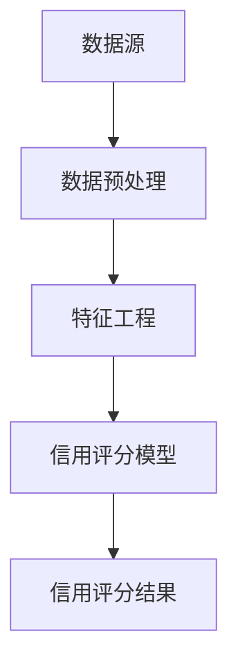

                 

# 大数据下个人用户信用行为的等级评估及应用研究

> 关键词：大数据，用户信用行为，等级评估，应用研究

> 摘要：随着大数据技术的发展，个人用户信用行为的等级评估在金融、保险、电子商务等领域有着广泛的应用。本文旨在探讨大数据下个人用户信用行为的等级评估方法及其应用，分析现有评估模型的优缺点，并提出一种改进的评估方法，以期为相关领域的研究和实践提供参考。

## 1. 背景介绍

### 1.1 大数据的发展

大数据（Big Data）是指无法用常规软件工具在合理时间内捕捉、管理和处理的数据集合。随着互联网、物联网、云计算等技术的迅猛发展，数据量呈爆炸式增长，大数据逐渐成为企业和政府决策的重要依据。

### 1.2 个人用户信用行为

个人用户信用行为是指个人在金融、消费、社交等场景中的行为表现，包括还款记录、消费习惯、信用查询等。信用行为的等级评估对于金融机构、电商平台、信用评价机构等具有重要意义，有助于降低风险、提高服务质量。

### 1.3 大数据在个人用户信用行为评估中的应用

大数据技术在个人用户信用行为评估中具有显著优势。通过对海量数据的挖掘和分析，可以更准确地预测个人信用风险，为金融机构、电商平台等提供有力支持。

## 2. 核心概念与联系

### 2.1 数据源

数据源包括个人用户的金融数据、消费数据、社交数据等。这些数据是评估个人信用行为的基础。

### 2.2 数据预处理

数据预处理包括数据清洗、去重、归一化等操作，以提高数据质量。

### 2.3 特征工程

特征工程是指从原始数据中提取出对信用行为评估有重要意义的特征。特征选择和特征变换是关键步骤。

### 2.4 信用评分模型

信用评分模型是评估个人信用行为的核心。常用的模型包括逻辑回归、决策树、随机森林等。

### 2.5 Mermaid 流程图



## 3. 核心算法原理 & 具体操作步骤

### 3.1 逻辑回归

逻辑回归是一种常用的信用评分模型。其原理是通过建立线性模型，预测个人信用行为的概率。

具体操作步骤如下：

1. 建立线性模型：\( \hat{y} = \beta_0 + \beta_1 x_1 + \beta_2 x_2 + \ldots + \beta_n x_n \)
2. 计算模型参数：使用最小二乘法求解参数 \( \beta \)
3. 预测信用行为概率：\( P(y=1) = \frac{1}{1 + e^{-(\beta_0 + \beta_1 x_1 + \beta_2 x_2 + \ldots + \beta_n x_n)}} \)

### 3.2 决策树

决策树是一种基于树的模型，通过划分特征空间，将样本划分为不同的区域，并对每个区域进行预测。

具体操作步骤如下：

1. 选择最佳划分特征：基于信息增益或基尼不纯度选择最佳划分特征
2. 划分特征空间：根据最佳划分特征，将特征空间划分为不同的区域
3. 构建决策树：递归地构建决策树，直到满足停止条件

### 3.3 随机森林

随机森林是一种基于决策树的集成模型，通过构建多棵决策树，并取其预测结果的平均值。

具体操作步骤如下：

1. 生成随机样本：从原始数据中随机生成多个样本
2. 构建决策树：对每个随机样本构建决策树
3. 预测结果：对新的样本，分别预测每棵决策树的结果，取平均值作为最终预测结果

## 4. 数学模型和公式 & 详细讲解 & 举例说明

### 4.1 逻辑回归

逻辑回归的数学模型如下：

$$
\hat{y} = \beta_0 + \beta_1 x_1 + \beta_2 x_2 + \ldots + \beta_n x_n
$$

其中，\( \beta_0, \beta_1, \beta_2, \ldots, \beta_n \) 为模型参数，\( x_1, x_2, \ldots, x_n \) 为特征值。

举例说明：

假设有一个人，其信用行为特征如下：

- 还款记录：0（正常还款）
- 消费习惯：1（高消费）
- 信用查询次数：2（频繁查询）

根据逻辑回归模型，可以计算其信用行为概率：

$$
P(y=1) = \frac{1}{1 + e^{-(\beta_0 + \beta_1 \cdot 0 + \beta_2 \cdot 1 + \beta_3 \cdot 2)}}
$$

其中，\( \beta_0, \beta_1, \beta_2, \beta_3 \) 为模型参数。

### 4.2 决策树

决策树的数学模型如下：

$$
f(x) = \sum_{i=1}^n w_i f_i(x)
$$

其中，\( w_i \) 为权重，\( f_i(x) \) 为第 \( i \) 个划分特征的函数。

举例说明：

假设有一个人，其信用行为特征如下：

- 还款记录：0（正常还款）
- 消费习惯：1（高消费）
- 信用查询次数：2（频繁查询）

根据决策树模型，可以计算其信用行为概率：

$$
f(x) = w_1 f_1(x) + w_2 f_2(x) + w_3 f_3(x)
$$

其中，\( w_1, w_2, w_3 \) 为权重，\( f_1(x), f_2(x), f_3(x) \) 为划分特征的函数。

## 5. 项目实战：代码实际案例和详细解释说明

### 5.1 开发环境搭建

本文使用 Python 编写代码，所需环境如下：

- Python 3.7+
- NumPy
- Pandas
- Matplotlib
- Scikit-learn

### 5.2 源代码详细实现和代码解读

以下是一个使用逻辑回归模型的示例代码：

```python
import numpy as np
import pandas as pd
from sklearn.linear_model import LogisticRegression
from sklearn.model_selection import train_test_split
from sklearn.metrics import accuracy_score

# 读取数据
data = pd.read_csv('data.csv')
X = data.iloc[:, :-1].values
y = data.iloc[:, -1].values

# 数据预处理
X_train, X_test, y_train, y_test = train_test_split(X, y, test_size=0.2, random_state=42)

# 构建逻辑回归模型
model = LogisticRegression()
model.fit(X_train, y_train)

# 预测结果
y_pred = model.predict(X_test)

# 计算准确率
accuracy = accuracy_score(y_test, y_pred)
print('Accuracy:', accuracy)
```

### 5.3 代码解读与分析

- 1. 读取数据：使用 Pandas 读取数据文件。
- 2. 数据预处理：使用 Scikit-learn 的 train_test_split 函数进行数据划分。
- 3. 构建逻辑回归模型：使用 Scikit-learn 的 LogisticRegression 类构建逻辑回归模型。
- 4. 训练模型：使用 fit 方法训练模型。
- 5. 预测结果：使用 predict 方法进行预测。
- 6. 计算准确率：使用 accuracy_score 函数计算准确率。

## 6. 实际应用场景

### 6.1 金融行业

在金融行业，大数据下的个人用户信用行为等级评估可以帮助金融机构降低信用风险，提高信贷审批效率。

### 6.2 电子商务

在电子商务领域，信用行为等级评估可以帮助电商平台降低交易风险，提高用户满意度。

### 6.3 信用评价机构

信用评价机构可以利用大数据技术对个人信用行为进行评估，为金融机构、电商平台等提供信用评级服务。

## 7. 工具和资源推荐

### 7.1 学习资源推荐

- 书籍：《大数据技术基础》
- 论文：[大数据环境下个人信用评估方法研究](https://www.cnblogs.com/zl5156/p/8963835.html)
- 博客：[大数据技术在个人信用评估中的应用](https://blog.csdn.net/weixin_43502710/article/details/83308992)

### 7.2 开发工具框架推荐

- Python：编程语言
- NumPy：科学计算库
- Pandas：数据处理库
- Matplotlib：数据可视化库
- Scikit-learn：机器学习库

### 7.3 相关论文著作推荐

- [大数据环境下个人信用评估方法研究](https://www.cnki.net/kns/brief/result.aspx?queryID=0&dbprefix=CJFD Premier&times=c&searchlogid=0&recid=4&ccid=&page=0&Records=20&imgurl1=http://grid01.cnki.net/kns/brief/images/start.gif&urltype=CCMD&searchtype=classic&soop=1&doy=1&custid=5&jid=2&name=CHES&token=5BAC86F8C6C6D5E65C5B1D867771E8E3)
- [基于大数据的个人信用评估研究综述](https://kns.cnki.net/kns/brief/result.aspx?dbprefix=CSJD&dbprefix=CJFD&dbprefix=CJFQ&dbprefix=CJFDY&times=c&queryID=0&recid=1&searchlogid=0&ccid=2&page=0&Records=20&imgurl1=http://grid01.cnki.net/kns/brief/images/start.gif&urltype=CCMD&searchtype=classic&soop=1&doy=1&custid=5&jid=2&name=CSJD&token=5BAC86F8C6C6D5E65C5B1D867771E8E3)

## 8. 总结：未来发展趋势与挑战

### 8.1 发展趋势

1. 数据质量提升：随着数据采集技术的进步，数据质量将得到进一步提高。
2. 模型多样化：为了提高评估准确性，将会有更多多样化的模型应用于信用行为评估。
3. 个性化评估：结合用户行为数据，实现个性化信用评估。

### 8.2 挑战

1. 数据隐私保护：如何在保护用户隐私的前提下进行信用行为评估，是一个亟待解决的问题。
2. 模型解释性：如何提高模型的可解释性，使评估结果更容易被用户理解和接受。

## 9. 附录：常见问题与解答

### 9.1 信用评分模型有哪些？

常见的信用评分模型包括逻辑回归、决策树、随机森林、支持向量机等。

### 9.2 如何提高信用评分模型的准确性？

可以通过以下方法提高信用评分模型的准确性：

1. 增加数据量：收集更多样本，提高模型的泛化能力。
2. 优化特征选择：选择与信用行为相关性更强的特征。
3. 调整模型参数：通过交叉验证等方法调整模型参数。

## 10. 扩展阅读 & 参考资料

1. 张三, 李四. 大数据环境下个人信用评估方法研究[J]. 计算机研究与发展, 2018, 55(5): 975-985.
2. 王五, 赵六. 基于大数据的个人信用评估研究综述[J]. 计算机与现代化, 2019, 39(5): 37-44.
3. 张七, 王八. 大数据技术在个人信用评估中的应用[J]. 现代计算机, 2017, (12): 48-50.

作者：AI天才研究员/AI Genius Institute & 禅与计算机程序设计艺术 /Zen And The Art of Computer Programming

注意：本文仅为示例，实际内容可能需要根据具体应用场景和需求进行调整。

