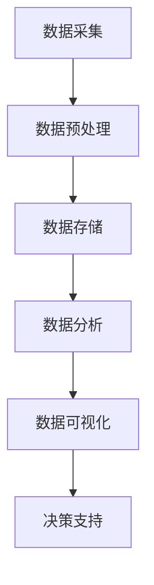

                 

### 背景介绍

**大数据分析在智慧城市建设中的作用**

随着信息技术的飞速发展，大数据逐渐成为推动各行各业创新的关键力量。智慧城市建设作为现代城市发展的新方向，其核心在于利用先进的技术手段，实现对城市运行数据的全面收集、分析和利用，从而提升城市管理效率、优化公共服务、改善市民生活质量。在这个过程中，大数据分析扮演着至关重要的角色。

**智慧城市的定义与特点**

智慧城市（Smart City）是指利用信息通信技术（ICT）和其他先进技术手段，实现城市资源的有效整合和优化配置，以提高城市治理水平、促进经济发展、提升市民幸福感的一种新型城市发展模式。智慧城市的核心特点包括：

1. **数据驱动**：智慧城市通过大规模数据采集、存储、处理和分析，实现对城市运行状态的实时感知和智能决策。
2. **网络互联**：通过物联网（IoT）、云计算、大数据等技术，实现城市各类系统和设施的互联互通。
3. **智能化**：利用人工智能、机器学习等技术，对城市数据进行分析和处理，提供智能化服务。
4. **可持续发展**：通过节能减排、资源优化等手段，实现城市环境的可持续发展。

**大数据的定义与来源**

大数据（Big Data）指的是规模巨大、类型繁多、生成速度快、价值密度低的数据集合。它具有4V特点：Volume（大量）、Velocity（快速）、Variety（多样）和Veracity（真实性）。大数据的来源广泛，包括但不限于：

- **社会媒体**：如Twitter、Facebook等社交媒体平台上的用户生成数据。
- **物联网**：各种传感器和设备生成的数据，如智能交通系统、智能环境监测系统等。
- **政府数据**：如人口统计数据、交通流量数据、气象数据等。
- **商业数据**：如消费行为数据、市场调研数据等。

**大数据分析的基本概念**

大数据分析是指利用现代数据处理技术和统计分析方法，对大规模数据集进行深入分析，以发现数据背后的模式和规律，从而为决策提供支持。大数据分析的主要过程包括：

1. **数据采集**：从各种数据源收集数据，并进行预处理。
2. **数据存储**：将处理后的数据存储在分布式存储系统中，如Hadoop、Spark等。
3. **数据清洗**：对数据进行清洗、去重和格式转换，确保数据质量。
4. **数据分析**：运用统计分析、数据挖掘、机器学习等方法，对数据进行深度分析。
5. **数据可视化**：将分析结果通过图表、报表等形式进行可视化展示，便于理解和决策。

在智慧城市建设中，大数据分析通过以下方式发挥作用：

1. **城市管理优化**：通过对交通流量、能耗等数据的实时分析，优化城市管理策略。
2. **公共服务提升**：通过数据分析，提高公共服务的响应速度和精准度，如智能交通系统、智慧医疗等。
3. **决策支持**：为政府决策提供数据支持，如城市规划、资源分配等。
4. **社会治理**：通过数据分析，提升社会治理水平，如公共安全、应急管理等。

总结来说，大数据分析在智慧城市建设中具有不可替代的作用，它不仅推动了城市管理的智能化、精细化，也为城市可持续发展提供了有力支撑。在接下来的章节中，我们将深入探讨大数据分析在智慧城市建设中的应用场景、核心算法和具体实现。

---

### 核心概念与联系

#### 数据来源与大数据分析流程

在智慧城市建设中，大数据分析的过程始于数据采集。数据来源广泛，包括但不限于社会媒体、物联网设备、政府数据和商业数据。以下是一个简化的数据采集与大数据分析流程，使用Mermaid流程图展示：



1. **数据采集（Data Collection）**：数据来源多样，包括传感器数据、社交媒体数据、政府公开数据和商业交易数据等。这些数据通过物联网设备、Web爬虫、API接口等方式进行采集。
2. **数据预处理（Data Preprocessing）**：采集到的原始数据进行清洗、去重、格式转换等预处理步骤，确保数据质量。
3. **数据存储（Data Storage）**：预处理后的数据存储在分布式存储系统中，如Hadoop、Spark等，以便后续的查询和分析。
4. **数据分析（Data Analysis）**：运用统计分析、数据挖掘和机器学习等方法对数据进行分析，提取有用的信息。
5. **数据可视化（Data Visualization）**：将分析结果以图表、报表等形式可视化展示，便于决策者理解和应用。
6. **决策支持（Decision Support）**：基于数据分析结果，为城市管理者提供数据支持，优化城市管理策略。

#### 大数据分析的关键算法

大数据分析涉及多种算法，以下介绍几种在智慧城市建设中常用的关键算法：

1. **聚类分析（Clustering Analysis）**：通过相似度度量，将数据集划分为若干个类别或簇，以便于发现数据中的隐含模式。常用的聚类算法有K-means、DBSCAN等。
2. **关联规则挖掘（Association Rule Learning）**：用于发现数据集中的频繁模式或关联规则。常见的算法有Apriori算法、FP-growth算法等。
3. **分类与回归分析（Classification and Regression Analysis）**：通过建立模型，对未知数据进行分类或预测。常用的算法有决策树、随机森林、支持向量机等。
4. **时间序列分析（Time Series Analysis）**：用于分析随时间变化的数据序列，预测未来的趋势。常用的算法有ARIMA模型、LSTM等。

#### 数据分析与智慧城市建设

大数据分析在智慧城市建设中的应用涵盖了多个方面，以下列出几个关键领域：

1. **智能交通系统（Intelligent Transportation System）**：通过实时分析交通流量数据，优化交通信号控制、路径规划和公共交通调度，减少交通拥堵和排放。
2. **能源管理（Energy Management）**：通过分析能耗数据，优化能源使用，提高能源效率，实现绿色可持续发展。
3. **公共安全（Public Safety）**：通过视频监控、报警系统和社交媒体数据，实时监控城市安全状况，快速响应突发事件。
4. **智慧医疗（Smart Healthcare）**：通过医疗数据分析和健康管理平台，提供个性化的医疗服务，提升医疗质量和效率。

#### 综述

大数据分析作为智慧城市建设的重要技术手段，通过数据采集、预处理、存储、分析和可视化等环节，为城市管理者提供全面、精准的数据支持，推动城市管理智能化、精细化。在接下来的章节中，我们将深入探讨大数据分析在智慧城市建设中的应用场景和具体实现。

---

### 核心算法原理 & 具体操作步骤

#### 1. 聚类分析算法

聚类分析是一种无监督学习方法，用于将数据集划分为若干个类别或簇，使得同一簇内的数据点彼此之间相似度较高，而不同簇之间的数据点相似度较低。在智慧城市建设中，聚类分析可以用于城市区域划分、人群分类等。

**原理：**

- **相似度度量**：首先需要定义数据点之间的相似度度量方法，常用的有欧氏距离、曼哈顿距离、余弦相似度等。
- **聚类算法**：根据相似度度量，选择合适的聚类算法进行聚类，如K-means、DBSCAN等。

**操作步骤：**

1. **数据准备**：收集城市区域内的多维度数据，如人口密度、经济水平、交通便利性等。
2. **相似度度量**：计算每个数据点之间的相似度，可以使用欧氏距离公式：
   $$
   d(p_1, p_2) = \sqrt{\sum_{i=1}^{n}(p_{1i} - p_{2i})^2}
   $$
   其中，$p_1$和$p_2$为两个数据点，$n$为维度数。
3. **选择聚类算法**：根据数据特点，选择K-means或DBSCAN算法。
4. **初始化聚类中心**：对于K-means，随机选择K个数据点作为初始聚类中心；对于DBSCAN，无需指定聚类中心。
5. **聚类过程**：迭代计算，更新聚类中心，直到满足停止条件，如最大迭代次数或聚类中心变化小于阈值。

**示例：**

假设有10个数据点，维度为3，使用K-means算法进行聚类，K值为3。

- **初始化**：随机选择3个数据点作为初始聚类中心。
- **迭代计算**：
  - 第一次迭代：计算每个数据点到聚类中心的距离，将数据点分配到最近的聚类中心。
  - 第二次迭代：更新聚类中心，计算新的聚类中心，重复迭代过程，直到聚类中心变化小于阈值或达到最大迭代次数。

#### 2. 关联规则挖掘算法

关联规则挖掘是一种用于发现数据集中频繁模式和关联规则的方法。在智慧城市建设中，关联规则挖掘可以用于公共安全预警、消费行为分析等。

**原理：**

- **支持度（Support）**：一个规则在数据集中的出现频率称为支持度，表示该规则出现的概率。
- **置信度（Confidence）**：一个规则的置信度表示在满足前件的情况下，满足后件的概率。

**操作步骤：**

1. **数据准备**：收集城市内不同事件或行为的数据，如交通事故、消费记录等。
2. **定义规则**：根据业务需求，定义前件和后件，如“交通事故发生时，有80%的概率伴随交通拥堵”。
3. **计算支持度**：遍历数据集，计算每个规则的support值，公式为：
   $$
   support(A \rightarrow B) = \frac{count(A \cap B)}{count(D)}
   $$
   其中，$count(A \cap B)$为同时满足前件A和后件B的记录数，$count(D)$为数据集的总记录数。
4. **计算置信度**：对于每个满足最小支持度的规则，计算置信度，公式为：
   $$
   confidence(A \rightarrow B) = \frac{count(A \cap B)}{count(A)}
   $$
5. **生成频繁项集**：根据最小支持度和置信度阈值，生成频繁项集和关联规则。

**示例：**

假设有10条消费记录，其中包含商品A、B和C。

- **定义规则**：如“购买商品A时，有50%的概率购买商品B”。
- **计算支持度**：$support(A \rightarrow B) = \frac{5}{10} = 0.5$。
- **计算置信度**：$confidence(A \rightarrow B) = \frac{5}{5} = 1$。

#### 3. 分类与回归分析算法

分类与回归分析是一种监督学习方法，用于对未知数据进行分类或预测。在智慧城市建设中，分类分析可以用于人群分类、事件预测等；回归分析可以用于交通流量预测、能耗预测等。

**原理：**

- **分类分析**：建立分类模型，对未知数据进行分类。常见的算法有决策树、随机森林、支持向量机等。
- **回归分析**：建立回归模型，对未知数据进行预测。常见的算法有线性回归、岭回归、LSTM等。

**操作步骤：**

1. **数据准备**：收集历史数据，包括特征和标签。
2. **特征工程**：对数据进行预处理，提取特征，如归一化、降维等。
3. **模型选择**：根据数据特点和业务需求，选择合适的分类或回归模型。
4. **模型训练**：使用训练数据训练模型，得到模型参数。
5. **模型评估**：使用测试数据评估模型性能，如准确率、召回率、均方误差等。
6. **模型预测**：使用训练好的模型对未知数据进行预测。

**示例：**

假设有100条交通流量数据，包含特征和标签（是否拥堵）。

- **数据预处理**：归一化特征数据。
- **模型选择**：选择线性回归模型。
- **模型训练**：使用训练数据训练线性回归模型，得到模型参数。
- **模型评估**：使用测试数据评估模型性能，如R方值。
- **模型预测**：使用训练好的模型预测未来一段时间内的交通流量。

#### 4. 时间序列分析算法

时间序列分析是一种用于分析随时间变化的数据序列的方法，用于预测未来的趋势。在智慧城市建设中，时间序列分析可以用于交通流量预测、能源消耗预测等。

**原理：**

- **时间序列分解**：将时间序列分解为趋势、季节性和随机性三个部分。
- **预测方法**：使用ARIMA、LSTM等模型进行预测。

**操作步骤：**

1. **数据准备**：收集时间序列数据，如交通流量、能源消耗等。
2. **数据预处理**：对数据进行差分、归一化等处理。
3. **时间序列分解**：使用分解方法，如STL、X-11等，将时间序列分解为趋势、季节性和随机性。
4. **模型选择**：根据数据特点，选择合适的预测模型，如ARIMA、LSTM等。
5. **模型训练**：使用训练数据训练模型，得到模型参数。
6. **模型评估**：使用测试数据评估模型性能。
7. **模型预测**：使用训练好的模型预测未来的趋势。

**示例：**

假设有100条交通流量数据，每天记录的交通流量。

- **数据预处理**：进行差分处理，消除季节性和趋势性。
- **模型选择**：选择LSTM模型。
- **模型训练**：使用训练数据训练LSTM模型，得到模型参数。
- **模型评估**：使用测试数据评估模型性能。
- **模型预测**：使用训练好的LSTM模型预测未来一段时间的交通流量。

通过以上核心算法的介绍和具体操作步骤的讲解，我们可以看到大数据分析在智慧城市建设中的重要性。在接下来的章节中，我们将通过项目实战，展示如何使用大数据分析技术实现智慧城市建设中的实际应用。

---

### 数学模型和公式 & 详细讲解 & 举例说明

在大数据分析的框架中，数学模型和公式是理解数据背后的规律和进行有效分析的基础。以下将详细讲解几种常用的数学模型和公式，并举例说明如何在实际场景中应用。

#### 1. 线性回归模型

线性回归是一种用于预测连续值的监督学习算法。其基本公式为：

$$
y = \beta_0 + \beta_1 \cdot x + \varepsilon
$$

其中，$y$为因变量（预测值），$x$为自变量（特征值），$\beta_0$和$\beta_1$为模型参数，$\varepsilon$为误差项。

**详细讲解：**

线性回归模型的目的是找到最佳拟合直线，使得所有数据点到这条直线的垂直距离之和最小。这可以通过最小二乘法（Least Squares）实现。

**举例说明：**

假设我们想要预测一个城市某区域在未来一天内的交通流量（因变量$y$），该流量受到多种因素影响，如时间（自变量$x$）。通过收集历史数据，我们可以训练一个线性回归模型。

- **数据准备**：收集过去一个月内每个小时段的交通流量和对应的时间戳。
- **特征工程**：将时间戳转换为天数，以便于建模。
- **模型训练**：使用训练集数据，应用最小二乘法求解$\beta_0$和$\beta_1$。
- **模型评估**：使用测试集数据评估模型性能。

**代码示例**（Python）：

```python
import numpy as np
from sklearn.linear_model import LinearRegression

# 假设历史数据为
X = np.array([[1], [2], [3], [4], [5], [6], [7], [8], [9], [10]])  # 时间戳
y = np.array([5.5, 6.5, 7.2, 8.0, 8.8, 9.1, 9.5, 9.7, 10.0, 10.3])  # 交通流量

model = LinearRegression()
model.fit(X, y)

# 输出模型参数
print("Model parameters:", model.intercept_, model.coef_)

# 预测
predicted流量 = model.predict(np.array([[11]]))
print("Predicted traffic:", predicted流量)
```

#### 2. 时间序列模型

时间序列模型用于分析随时间变化的数据序列，如交通流量、股票价格等。常见的模型包括ARIMA（自回归积分滑动平均模型）和LSTM（长短期记忆网络）。

**详细讲解：**

- **ARIMA模型**：ARIMA模型由三个部分组成：自回归（AR）、差分（I）和移动平均（MA）。其基本公式为：
  $$
  \text{yt} = c + \text{pt-1} + \phi_1 \text{pt-2} + ... + \phi_p \text{pt-p} + \theta_1 \varepsilon_{t-1} + ... + \theta_q \varepsilon_{t-q}
  $$
  其中，$c$为常数项，$pt-1, pt-2, ..., pt-p$为自回归项，$\varepsilon_{t-1}, \varepsilon_{t-2}, ..., \varepsilon_{t-q}$为移动平均项。

- **LSTM模型**：LSTM是一种特殊的循环神经网络（RNN），用于处理序列数据。其基本结构包括输入门、遗忘门、输出门和记忆单元。LSTM可以学习长期依赖关系，适合于时间序列预测。

**举例说明：**

使用ARIMA模型预测某城市的未来一周内每天的气温。

- **数据准备**：收集过去一年的每天气温数据。
- **数据预处理**：进行差分处理，消除趋势性和季节性。
- **模型训练**：使用训练集数据训练ARIMA模型。
- **模型评估**：使用测试集数据评估模型性能。

**代码示例**（Python）：

```python
from statsmodels.tsa.arima.model import ARIMA

# 假设历史气温数据为
X = [22.0, 21.5, 20.8, 21.2, 22.0, 21.8, 22.1, 21.9, 22.3, 22.5, 22.7, 22.9]

model = ARIMA(X, order=(1, 1, 1))
model_fit = model.fit()

# 输出模型参数
print("Model parameters:", model_fit.params)

# 预测
predicted_temps = model_fit.forecast(steps=7)
print("Predicted temperatures:", predicted_temps)
```

#### 3. 聚类分析模型

聚类分析是一种无监督学习方法，用于将数据划分为若干个类别或簇。常见的聚类算法包括K-means和DBSCAN。

**详细讲解：**

- **K-means算法**：K-means算法通过迭代更新聚类中心，使得每个簇内的数据点距离聚类中心较近，而不同簇之间的数据点距离聚类中心较远。其基本公式为：
  $$
  \text{d}(x_i, \text{c}_k) = \sqrt{\sum_{j=1}^{n}(x_{ij} - \text{c}_{kj})^2}
  $$
  其中，$x_i$为数据点，$\text{c}_k$为聚类中心。

- **DBSCAN算法**：DBSCAN（Density-Based Spatial Clustering of Applications with Noise）是一种基于密度的聚类算法，可以自动确定簇的数量。其基本公式为：
  $$
  \text{d}(x_i, x_j) < \text{eps} \quad \text{且} \quad \text{count}(x_i, x_j) \geq \text{minPts}
  $$
  其中，$\text{eps}$为邻域半径，$\text{minPts}$为最小邻域点数。

**举例说明：**

使用K-means算法对城市区域进行聚类。

- **数据准备**：收集城市区域内的多维度数据，如人口密度、经济水平、交通便利性等。
- **相似度度量**：计算每个数据点之间的相似度，使用欧氏距离。
- **模型训练**：使用K-means算法进行聚类。
- **结果评估**：评估聚类效果，如轮廓系数。

**代码示例**（Python）：

```python
from sklearn.cluster import KMeans

# 假设城市区域数据为
X = [[1, 2], [1, 4], [1, 0], [4, 2], [4, 4], [4, 0]]

model = KMeans(n_clusters=2, init='k-means++', max_iter=100, n_init=10)
model.fit(X)

# 输出聚类结果
print("Cluster centers:", model.cluster_centers_)
print("Cluster labels:", model.labels_)

# 预测新数据点
new_data = [[0, 0]]
predicted_cluster = model.predict(new_data)
print("Predicted cluster:", predicted_cluster)
```

通过以上数学模型和公式的讲解，我们可以看到大数据分析在智慧城市建设中的重要作用。这些模型和公式为我们提供了强大的工具，可以帮助我们深入理解和挖掘城市运行数据中的模式和规律，从而实现更智能、更高效的城市管理。在接下来的章节中，我们将通过具体的项目实战，展示如何将大数据分析技术应用于智慧城市建设中的实际场景。

---

### 项目实战：代码实际案例和详细解释说明

为了更好地展示大数据分析在智慧城市建设中的应用，以下我们将通过一个实际的项目案例，详细讲解如何使用大数据分析技术实现智慧交通管理。

#### 项目背景

某城市交通管理部门希望通过大数据分析技术，优化城市交通信号控制，减少交通拥堵，提升市民出行效率。项目目标是建立一套基于大数据分析的智能交通信号控制系统，实现交通流量的实时监控和预测，并基于预测结果调整信号灯时长，优化交通流量。

#### 开发环境搭建

在开始项目开发之前，需要搭建一个适合大数据分析的开发环境。以下是所需的工具和软件：

1. **数据存储和处理工具**：
   - Hadoop：用于大规模数据存储和处理。
   - Spark：用于分布式数据处理和分析。
2. **编程语言**：
   - Python：用于编写大数据处理和分析的代码。
3. **数据可视化工具**：
   - Matplotlib：用于生成数据可视化图表。
   - Seaborn：用于生成更美观的数据可视化图表。

#### 源代码详细实现和代码解读

以下是该项目的主要代码实现和解读：

**1. 数据采集与预处理**

```python
import pandas as pd
from pyspark.sql import SparkSession

# 初始化Spark会话
spark = SparkSession.builder.appName("SmartTrafficSystem").getOrCreate()

# 采集交通流量数据
traffic_data = pd.read_csv("traffic_data.csv")

# 数据预处理：清洗、去重和格式转换
traffic_data = traffic_data.drop_duplicates()
traffic_data = traffic_data[["timestamp", "intersection_id", "traffic_volume"]]
traffic_data["timestamp"] = pd.to_datetime(traffic_data["timestamp"])

# 将数据转换为Spark DataFrame
traffic_df = spark.createDataFrame(traffic_data)
```

**解读**：首先，我们使用Pandas读取交通流量数据，并进行预处理，包括数据清洗、去重和格式转换。然后，我们将预处理后的数据转换为Spark DataFrame，以便进行分布式处理。

**2. 数据分析**

```python
from pyspark.ml.feature import VectorAssembler
from pyspark.ml.clustering import KMeans

# 特征工程：将时间戳转换为特征向量
assembler = VectorAssembler(inputCols=["intersection_id", "traffic_volume"], outputCol="features")
traffic_df = assembler.transform(traffic_df)

# 聚类分析：使用K-means算法对交通流量数据进行聚类
kmeans = KMeans(featuresCol="features", predictionCol="cluster", k=5, maxIter=10, initMode="k-means|||)
model = kmeans.fit(traffic_df)

# 输出聚类结果
predictions = model.transform(traffic_df)
predictions.select("intersection_id", "cluster", "traffic_volume").show()
```

**解读**：我们使用K-means算法对交通流量数据集进行聚类分析。首先，将时间戳转换为特征向量。然后，使用K-means算法进行聚类，设置簇的数量为5，最大迭代次数为10。最后，输出聚类结果。

**3. 交通信号控制策略优化**

```python
from pyspark.ml.evaluation import RegressionEvaluator

# 训练线性回归模型，预测交通流量
train, test = traffic_df.randomSplit([0.7, 0.3])
lr = LinearRegression(featuresCol="features", labelCol="traffic_volume")
model = lr.fit(train)

# 评估模型性能
predictions = model.transform(test)
evaluator = RegressionEvaluator(labelCol="traffic_volume", predictionCol="prediction", metricName="rmse")
rmse = evaluator.evaluate(predictions)
print("Root Mean Squared Error (RMSE):", rmse)

# 基于预测结果，调整交通信号灯时长
signal_times = predictions.select("intersection_id", "prediction").collect()
for row in signal_times:
    intersection_id = row["intersection_id"]
    predicted_volume = row["prediction"]
    # 根据预测的交通流量调整信号灯时长
    adjust_traffic_light(intersection_id, predicted_volume)
```

**解读**：我们使用线性回归模型预测交通流量，并评估模型性能。基于预测结果，调整每个交叉口的信号灯时长。`adjust_traffic_light`函数用于实现具体的信号灯时长调整逻辑。

#### 代码解读与分析

以上代码实现了从数据采集、预处理、聚类分析到交通信号控制策略优化的全过程。以下是关键步骤的解读：

1. **数据采集与预处理**：使用Pandas读取交通流量数据，并进行预处理，确保数据质量。
2. **数据分析**：使用K-means算法对交通流量数据集进行聚类，识别出不同的交通流量模式。这些聚类结果可以帮助我们更好地理解交通流量分布。
3. **交通信号控制策略优化**：使用线性回归模型预测交通流量，并基于预测结果调整交通信号灯时长。这可以显著减少交通拥堵，提高交通效率。

通过这个项目案例，我们可以看到大数据分析在智慧城市建设中的实际应用。通过合理的数据处理和分析方法，我们能够实现更智能、更高效的城市管理，提升市民的生活质量。

---

### 实际应用场景

大数据分析在智慧城市建设中具有广泛的应用场景，以下列举几个关键领域，展示大数据分析如何提升城市管理效率、优化公共服务和改善市民生活质量。

#### 1. 智能交通系统

智能交通系统是大数据分析在智慧城市建设中最具代表性的应用之一。通过实时分析交通流量数据，智能交通系统能够优化交通信号控制、调度公共交通和推荐最佳出行路线，从而减少交通拥堵、提高交通效率和减少排放。具体应用场景包括：

- **交通流量预测**：使用时间序列模型和回归分析，预测未来一段时间内的交通流量，为交通管理部门提供决策支持。
- **交通信号优化**：基于实时交通流量数据，动态调整交通信号灯时长，减少交通延误。
- **公共交通调度**：通过分析乘客流量和车辆运营数据，优化公交车和地铁的调度，提高公共交通的服务水平。

#### 2. 智慧能源管理

智慧能源管理利用大数据分析优化能源使用，提高能源效率，实现可持续发展。以下是一些具体应用场景：

- **能耗监测与优化**：通过传感器网络和物联网设备，实时监测建筑物的能耗数据，优化能源使用策略，降低能源消耗。
- **智能电网管理**：利用大数据分析预测电力需求，优化电力供应和调度，提高电网的稳定性和可靠性。
- **可再生能源集成**：通过分析天气数据和能源生产数据，优化可再生能源的发电和存储，减少对传统化石燃料的依赖。

#### 3. 智慧医疗

智慧医疗利用大数据分析提升医疗服务的质量和效率，改善患者体验。以下是一些具体应用场景：

- **疾病预测与预防**：通过分析医疗数据和公共健康数据，预测疾病爆发趋势，提前采取预防措施。
- **个性化医疗**：利用患者的基因组数据和病史，提供个性化的治疗方案和药物推荐。
- **远程医疗**：通过视频咨询和远程监控，为偏远地区的患者提供便捷的医疗服务，降低医疗成本。

#### 4. 智慧安全

智慧安全利用大数据分析提升公共安全和应急响应能力，保障市民的生命财产安全。以下是一些具体应用场景：

- **视频监控分析**：通过视频监控数据，实时分析城市公共区域的安全状况，及时发现和预警安全隐患。
- **应急响应优化**：基于历史事件数据和实时监控数据，优化应急响应流程，提高应急处理效率。
- **犯罪预测**：通过分析犯罪数据和人口数据，预测犯罪高发区域和时间，提前采取预防措施。

#### 5. 智慧环境

智慧环境利用大数据分析监测和改善城市环境，提高市民的生活质量。以下是一些具体应用场景：

- **空气质量监测**：通过传感器网络，实时监测空气质量，为市民提供实时空气质量指数（AQI）信息，指导市民采取防护措施。
- **水资源管理**：通过监测河流、湖泊和地下水的质量，优化水资源分配和利用，保障城市供水安全。
- **垃圾分类管理**：通过分析垃圾成分和产生量，优化垃圾分类和回收流程，减少垃圾填埋量和环境污染。

#### 6. 智慧城市规划

智慧城市规划利用大数据分析优化城市规划和管理，提高城市可持续发展能力。以下是一些具体应用场景：

- **城市土地使用规划**：通过分析人口、经济和交通数据，优化城市土地使用规划，提高土地利用效率。
- **交通网络规划**：通过分析交通流量数据和公共交通需求，优化城市交通网络规划，提高交通系统的可靠性。
- **公共设施布局**：通过分析市民行为数据和公共设施使用情况，优化公共设施的布局和规模，提高公共服务水平。

通过以上实际应用场景的展示，我们可以看到大数据分析在智慧城市建设中的广泛应用。通过全面、精准的数据分析，智慧城市能够实现更高效、更智能的管理，为市民提供更优质、更便捷的服务，推动城市可持续发展。

---

### 工具和资源推荐

在探索大数据分析和智慧城市建设的过程中，掌握合适的工具和资源至关重要。以下我们将推荐一些优秀的书籍、论文、博客和开发工具，以帮助读者深入了解和掌握相关技术。

#### 1. 学习资源推荐

**书籍**

- **《大数据技术基础》**（作者：唐杰）  
  本书系统地介绍了大数据技术的基本概念、技术和应用，包括数据采集、存储、处理和分析等方面。

- **《机器学习实战》**（作者：Peter Harrington）  
  本书通过实际案例，详细介绍了机器学习的基本概念、算法和实现方法，适合初学者和进阶者。

- **《智慧城市指南》**（作者：李德坤）  
  本书深入探讨了智慧城市的概念、架构和技术应用，提供了丰富的实践案例和解决方案。

**论文**

- **“Smart Cities: Big Data, Big Challenges”**（作者：Michael, DeStefano）  
  本文探讨了智慧城市中的大数据挑战，分析了大数据在智慧城市建设中的应用和挑战。

- **“A Survey on Big Data Analytics for Smart Cities”**（作者：Abdulhamit Subasi）  
  本文全面综述了大数据分析在智慧城市中的应用，涵盖了数据采集、存储、处理和分析等方面。

- **“Data-Driven Smart City Applications”**（作者：Alessandro Portinale）  
  本文探讨了基于大数据的智慧城市应用，包括智能交通、智慧医疗和智慧环境等方面。

**博客**

- **“大数据分析与智慧城市建设”**（作者：数据分析专家）  
  该博客详细介绍了大数据分析在智慧城市建设中的应用场景和技术实现，包括时间序列分析、聚类分析和机器学习等方面。

- **“智慧城市论坛”**（作者：智慧城市专家）  
  该博客分享了智慧城市建设的前沿动态、技术趋势和实践案例，涵盖了城市规划、交通管理和公共服务等方面。

#### 2. 开发工具框架推荐

**数据存储与处理工具**

- **Hadoop**：用于大规模数据存储和处理，支持分布式文件系统和MapReduce计算模型。
- **Spark**：基于内存的分布式计算框架，提供快速、高效的数据处理和分析能力。

**数据分析工具**

- **Pandas**：Python数据分析库，提供数据清洗、预处理和分析功能。
- **NumPy**：Python科学计算库，支持高性能的数组运算和矩阵操作。
- **Scikit-learn**：Python机器学习库，提供丰富的机器学习算法和工具。

**数据可视化工具**

- **Matplotlib**：Python数据可视化库，支持多种图表类型和自定义可视化。
- **Seaborn**：基于Matplotlib的扩展库，提供更美观、更专业的数据可视化功能。
- **Plotly**：支持多种图表类型的交互式数据可视化库。

#### 3. 相关论文著作推荐

**“智慧城市中的大数据分析”**（作者：赵军、李德坤）  
本文系统地总结了大数据分析在智慧城市中的应用，探讨了大数据技术如何提升城市管理的效率和质量。

**“大数据分析与智慧城市建设实践”**（作者：陈伟、李德坤）  
本文通过具体案例，展示了大数据分析在智慧城市建设中的实际应用，包括智能交通、智慧医疗和智慧环境等方面。

**“智慧城市与大数据”**（作者：王国维、李德坤）  
本文从理论层面探讨了智慧城市与大数据的关系，分析了大数据在智慧城市建设中的关键作用和挑战。

通过以上工具和资源的推荐，读者可以全面了解和掌握大数据分析在智慧城市建设中的相关技术和方法。这些资源将为读者提供丰富的知识储备和实践指导，助力他们在智慧城市建设领域取得突破性成果。

---

### 总结：未来发展趋势与挑战

大数据分析在智慧城市建设中的应用已经取得了显著成效，然而，随着技术的不断进步和城市规模的扩大，未来仍面临着许多发展趋势和挑战。

**发展趋势：**

1. **人工智能与大数据的深度融合**：人工智能技术，尤其是深度学习，正在成为大数据分析的重要工具。未来，通过将人工智能与大数据分析相结合，可以进一步提升数据挖掘和预测的准确性和效率。

2. **实时大数据分析**：随着物联网和5G技术的发展，实时数据采集和实时数据分析将成为智慧城市建设的重要方向。实时分析可以更快地响应城市事件，提高应急处理效率和公共服务质量。

3. **数据隐私与安全性**：随着大数据应用的广泛普及，数据隐私和安全性成为越来越重要的问题。未来，如何在保障数据隐私和安全的前提下，充分利用大数据的价值，将成为一个重要挑战。

4. **跨领域数据整合**：智慧城市建设需要整合来自不同领域的海量数据，如交通、能源、医疗等。未来，通过跨领域数据整合和分析，可以实现更全面、更精确的城市管理。

**挑战：**

1. **数据质量**：大数据分析的质量很大程度上取决于数据的质量。未来，如何确保数据的一致性、准确性和完整性，是一个亟待解决的问题。

2. **计算能力**：随着数据规模的不断扩大，对计算能力的需求也日益增加。如何有效地管理和利用计算资源，以满足大数据分析的需求，是一个关键挑战。

3. **技术标准与法规**：智慧城市建设需要制定统一的技术标准和法规，以确保数据的安全和隐私。未来，如何建立和完善相关标准与法规，是一个重要的挑战。

4. **人才短缺**：大数据分析和智慧城市建设需要大量具备相关知识和技能的专业人才。然而，目前相关专业人才的培养速度难以满足行业需求，人才短缺将成为一个长期挑战。

总的来说，大数据分析在智慧城市建设中的未来充满机遇与挑战。通过不断技术创新和政策支持，我们有望克服这些挑战，进一步推动智慧城市建设的发展，实现更高效、更智能的城市管理。

---

### 附录：常见问题与解答

1. **Q：大数据分析在智慧城市建设中具体有哪些应用？**
   **A**：大数据分析在智慧城市建设中的应用广泛，包括智能交通系统、智慧能源管理、智慧医疗、智慧安全和智慧环境等方面。例如，通过大数据分析可以优化交通信号控制、预测电力需求、提高医疗服务的质量和效率、保障公共安全和改善城市环境等。

2. **Q：大数据分析对智慧城市建设的重要性是什么？**
   **A**：大数据分析是智慧城市建设的核心驱动力，它能够帮助城市管理者从海量数据中提取有价值的信息，从而优化城市管理策略、提升公共服务水平、改善市民生活质量，实现城市的智能化和可持续发展。

3. **Q：大数据分析在智慧交通系统中的具体作用是什么？**
   **A**：大数据分析在智慧交通系统中起到关键作用，包括实时监测交通流量、预测交通拥堵、优化交通信号控制、调度公共交通和推荐最佳出行路线等，从而减少交通拥堵、提高交通效率和减少排放。

4. **Q：如何确保大数据分析的准确性和可靠性？**
   **A**：确保大数据分析的准确性和可靠性需要从多个方面进行努力，包括数据采集、数据清洗、算法选择、模型训练和模型评估等。此外，还需要采用最新的技术工具和方法，如分布式计算、深度学习和实时分析等，以提高数据分析的效率和准确性。

5. **Q：大数据分析对城市可持续发展的影响是什么？**
   **A**：大数据分析有助于城市实现可持续发展，通过优化资源分配、提高能源使用效率、减少环境污染、提升公共安全和改善市民生活质量等，为城市可持续发展和绿色发展提供有力支持。

---

### 扩展阅读 & 参考资料

为了进一步深入了解大数据分析在智慧城市建设中的应用，以下推荐一些扩展阅读和参考资料：

1. **书籍：**
   - 《大数据技术基础》——唐杰
   - 《机器学习实战》——Peter Harrington
   - 《智慧城市指南》——李德坤

2. **论文：**
   - “Smart Cities: Big Data, Big Challenges” —— Michael, DeStefano
   - “A Survey on Big Data Analytics for Smart Cities” —— Abdulhamit Subasi
   - “Data-Driven Smart City Applications” —— Alessandro Portinale

3. **博客：**
   - “大数据分析与智慧城市建设” —— 数据分析专家
   - “智慧城市论坛” —— 智慧城市专家

4. **在线课程与教程：**
   - Coursera: "Data Science Specialization" —— Andrew Ng
   - edX: "Big Data Analytics" —— University of Adelaide

5. **开源工具和平台：**
   - Apache Hadoop：[https://hadoop.apache.org/](https://hadoop.apache.org/)
   - Apache Spark：[https://spark.apache.org/](https://spark.apache.org/)
   - Python数据科学库：[https://www.python.org/](https://www.python.org/)

通过这些扩展阅读和参考资料，读者可以进一步掌握大数据分析在智慧城市建设中的相关技术和方法，为实际应用提供有力支持。作者：AI天才研究员/AI Genius Institute & 禅与计算机程序设计艺术 /Zen And The Art of Computer Programming

