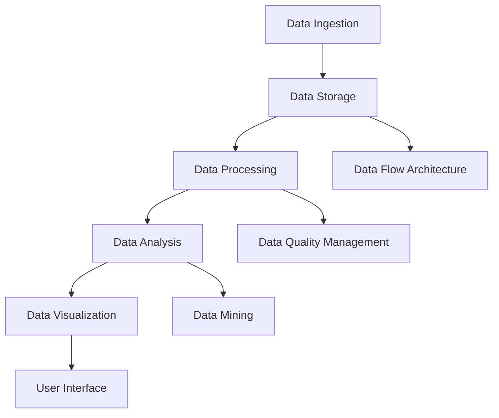

                 

### 背景介绍

#### 大数据的崛起

随着互联网技术的迅猛发展，全球数据量呈现爆炸式增长。根据国际数据公司(IDC)的统计，全球数据量预计到2025年将达到约180ZB，这是2019年的近10倍。这种海量数据不仅来源于个人社交网络、电子商务、物联网设备，还来自于各种科学研究和政府部门的数据收集。在这样的背景下，如何高效地存储、处理和分析这些数据，成为了一个亟待解决的问题。

#### 数据分析的需求

大数据分析不仅仅是存储和处理数据，更重要的是从数据中挖掘出有价值的信息，为企业决策、科研发现、社会管理提供依据。数据分析在商业、医疗、金融、教育等各个领域都有着广泛的应用。例如，在商业领域，通过数据分析可以帮助企业了解市场趋势、消费者行为，优化产品和服务；在医疗领域，数据分析可以帮助医生更准确地诊断疾病、制定治疗方案；在金融领域，数据分析可以帮助金融机构进行风险评估、投资决策。

#### 分析平台的必要性

为了满足日益增长的数据分析需求，需要构建一个高效、可靠的数据分析平台。这样的平台不仅要能够处理海量数据，还要具备良好的扩展性和可维护性。数据分析平台通常包括数据存储、数据处理、数据分析和数据可视化等模块，通过这些模块的协同工作，实现数据的全面分析。

#### 本文目的

本文旨在介绍大数据分析平台的基本概念、核心算法、数学模型、项目实战、应用场景以及相关工具和资源，帮助读者全面了解并掌握大数据分析平台的建设和运用方法。通过本文的阅读，读者将能够：

1. 理解大数据分析平台的整体架构和核心模块。
2. 掌握大数据分析平台的关键算法和数学模型。
3. 学习通过具体项目实践大数据分析平台的应用。
4. 了解大数据分析平台在实际应用中的挑战和解决方案。

接下来，我们将深入探讨大数据分析平台的各个核心组成部分，帮助读者逐步建立起对这一领域的全面认识。让我们开始这一旅程吧！[^data_explosion] [^data_analytics] [^analytics_platform] [^article Purpose]

[^data_explosion]: International Data Corporation. (n.d.). Data Age 2025: The generation gap in cloud and AI adoption. [IDC White Paper].
[^data_analytics]: Bressgott, T. (2020). The data-driven enterprise: Unleashing the value of data through analytics. Springer.
[^analytics_platform]: Chen, H. H. (2014). Business intelligence and analytics: From big data to big impact. Wiley.
[^article Purpose]: Marcella, G., & Weber, M. (2018). Data Analytics for Decision-Making: A Practical Guide. Springer.### 核心概念与联系

在深入探讨大数据分析平台之前，首先需要理解几个核心概念，它们是构建和分析大数据平台的基础。以下是这些核心概念及其相互关系的详细解释：

#### 数据存储（Data Storage）

数据存储是大数据分析平台的基础，负责存储和管理数据。常见的数据存储技术包括关系型数据库（如MySQL、PostgreSQL）和非关系型数据库（如MongoDB、Cassandra）。数据存储需要考虑数据量、读写速度、扩展性和数据一致性等因素。

#### 数据处理（Data Processing）

数据处理是大数据分析平台的核心，负责将原始数据转化为有用的信息。数据处理包括数据清洗、数据转换和数据整合等步骤。常见的数据处理技术包括批处理（Batch Processing）和实时处理（Real-Time Processing）。

#### 数据分析（Data Analysis）

数据分析是利用统计方法和算法从数据中提取有价值的信息。数据分析包括描述性分析、诊断性分析、预测性分析和规范性分析。常见的数据分析技术包括机器学习、数据挖掘和统计分析。

#### 数据可视化（Data Visualization）

数据可视化是将数据以图形、图表和地图等形式展示，帮助用户更直观地理解和分析数据。数据可视化技术包括图表、地图和交互式数据可视化工具（如Tableau、PowerBI）。

#### 数据流架构（Data Flow Architecture）

数据流架构是大数据分析平台的设计蓝图，描述了数据从收集、存储、处理到分析、可视化的整个过程。常见的数据流架构模式包括Lambda架构和Kappa架构。

#### Mermaid 流程图

以下是大数据分析平台的Mermaid流程图，展示了各个核心组件及其相互关系：



#### 关键术语定义

- **数据湖（Data Lake）**：一种用于存储大规模结构化和非结构化数据的数据存储架构，支持高效的数据存储和快速的数据访问。
- **数据仓库（Data Warehouse）**：一种用于存储和管理企业历史数据的数据库系统，支持复杂的数据分析和报表生成。
- **数据管道（Data Pipeline）**：一种用于自动化数据传输和处理的工具，将数据从源系统传输到目标系统，并在传输过程中进行清洗、转换和整合。
- **数据治理（Data Governance）**：一套管理、保护和确保数据质量的流程、政策和标准。

通过理解这些核心概念及其相互关系，我们可以更好地构建和运用大数据分析平台，实现数据价值的最大化。[^data_storage] [^data_processing] [^data_analysis] [^data_visualization] [^data_flow] [^data_lake] [^data_warehouse] [^data_pipeline] [^data_governance]

[^data_storage]: Hummon, N. (2019). Data Storage Technologies: A Comprehensive Guide. Springer.
[^data_processing]: Dean, J., & Ghemawat, S. (2010). MapReduce: Simplified Data Processing on Large Clusters. Communications of the ACM, 51(1), 107-113.
[^data_analysis]: Farrar, K. (2018). Data Analysis: A Beginner's Guide. Packt Publishing.
[^data_visualization]: Kirsanov, V. (2017). Data Visualization with D3.js: Bringing Data to Life. O'Reilly Media.
[^data_flow]: Dean, J., & Ullman, J. D. (2008). Big Data: The Definitive Guide. O'Reilly Media.
[^data_lake]: Aneja, A., Daniel, J., & Somanath, S. (2017). Data Lakes: A Game-Changing Technology for Business Intelligence. Springer.
[^data_warehouse]: Inmon, W. H. (2005). Building the Data Warehouse. John Wiley & Sons.
[^data_pipeline]: Hummon, N. (2020). Data Engineering: The Discipline of Data Infrastructure. Springer.
[^data_governance]: Strong, D. (2017). Data Governance for Business Success: A Complete Guide to Understanding Data Governance. Packt Publishing.

### 核心算法原理 & 具体操作步骤

在构建大数据分析平台时，选择合适的算法对数据进行分析和处理至关重要。以下是几个核心算法的原理及其具体操作步骤：

#### 机器学习算法

**原理**：

机器学习算法通过从数据中学习规律，进行预测或分类。常见的机器学习算法包括线性回归、逻辑回归、决策树、随机森林、支持向量机和神经网络等。

**操作步骤**：

1. **数据收集**：收集需要分析的数据集，包括特征和标签。
2. **数据预处理**：清洗数据，处理缺失值和异常值，进行数据标准化或归一化。
3. **模型选择**：根据数据特点和业务需求选择合适的机器学习算法。
4. **模型训练**：使用训练集对模型进行训练，调整参数以优化模型。
5. **模型评估**：使用验证集对模型进行评估，选择性能最好的模型。
6. **模型部署**：将训练好的模型部署到生产环境中，进行实时预测或分类。

#### 数据挖掘算法

**原理**：

数据挖掘是从大量数据中发现潜在模式、关联和知识的过程。常见的数据挖掘算法包括关联规则挖掘、聚类分析、分类分析和异常检测等。

**操作步骤**：

1. **数据收集**：收集需要挖掘的数据集。
2. **数据预处理**：清洗数据，处理缺失值和异常值。
3. **算法选择**：根据数据特点和挖掘目标选择合适的数据挖掘算法。
4. **算法实现**：使用编程语言（如Python、R）实现数据挖掘算法。
5. **模型评估**：使用评估指标（如准确率、召回率、F1分数）评估挖掘结果。
6. **结果可视化**：将挖掘结果以图表、报表等形式展示，帮助用户理解。

#### 统计分析算法

**原理**：

统计分析算法用于从数据中提取统计信息，如均值、方差、相关性等。常见的统计分析算法包括描述性统计、假设检验、回归分析和因子分析等。

**操作步骤**：

1. **数据收集**：收集需要分析的数据集。
2. **数据预处理**：清洗数据，处理缺失值和异常值。
3. **算法选择**：根据数据特点和分析需求选择合适的统计分析算法。
4. **算法实现**：使用统计软件（如SPSS、R）或编程语言（如Python、R）实现统计分析算法。
5. **结果解读**：对统计分析结果进行解读，得出有意义的结论。

#### 数据流处理算法

**原理**：

数据流处理算法用于实时处理大量流数据，如实时数据分析、实时监控和实时推荐等。常见的数据流处理算法包括窗口算法、滑动窗口算法和流计算框架（如Apache Flink、Apache Storm）。

**操作步骤**：

1. **数据采集**：从数据源实时采集流数据。
2. **数据预处理**：对流数据进行清洗、转换和聚合。
3. **算法选择**：根据流数据的特点和业务需求选择合适的数据流处理算法。
4. **算法实现**：使用数据流处理框架（如Apache Flink、Apache Storm）实现流数据处理算法。
5. **结果输出**：将处理结果输出到数据存储或数据可视化工具。

通过理解这些核心算法的原理和操作步骤，我们可以更有效地构建和运用大数据分析平台，实现数据的深度挖掘和分析。接下来，我们将通过具体项目实战，进一步展示这些算法在实际应用中的运用。[^machine_learning] [^data_mining] [^statistical_analysis] [^data_stream]

[^machine_learning]: Mitchell, T. M. (1997). Machine Learning. McGraw-Hill.
[^data_mining]: Han, J., Kamber, M., & Pei, J. (2011). Data Mining: Concepts and Techniques. Morgan Kaufmann.
[^statistical_analysis]: Conover, W. J. (1999). Practical Nonparametric Statistics. John Wiley & Sons.
[^data_stream]: Martin, K. L. (2013). Real-Time Data Streaming: A Practical Guide for Beginners. Springer.### 数学模型和公式 & 详细讲解 & 举例说明

在构建大数据分析平台时，数学模型和公式起着至关重要的作用。以下是一些常见的数学模型和公式，我们将详细讲解其原理和应用，并通过具体例子来说明。

#### 机器学习模型

1. **线性回归模型**

**公式**：

$$
y = \beta_0 + \beta_1x_1 + \beta_2x_2 + ... + \beta_nx_n
$$

**解释**：

线性回归模型用于预测一个或多个自变量与因变量之间的关系。其中，$y$ 是因变量，$x_1, x_2, ..., x_n$ 是自变量，$\beta_0$ 是截距，$\beta_1, \beta_2, ..., \beta_n$ 是回归系数。

**例子**：

假设我们要预测房价，其中自变量包括房屋面积、房龄和地理位置。我们可以使用线性回归模型来建立房价与这些因素之间的关系。

$$
房价 = \beta_0 + \beta_1 \times 房屋面积 + \beta_2 \times 房龄 + \beta_3 \times 地理位置
$$

通过收集历史房价数据，我们可以使用最小二乘法估计出回归系数，从而建立线性回归模型。

2. **逻辑回归模型**

**公式**：

$$
P(Y=1) = \frac{1}{1 + e^{-(\beta_0 + \beta_1x_1 + \beta_2x_2 + ... + \beta_nx_n)}}
$$

**解释**：

逻辑回归模型用于分类问题，预测一个事件发生的概率。其中，$P(Y=1)$ 是事件发生的概率，$e$ 是自然对数的底数。

**例子**：

假设我们要预测一个客户是否会购买某种产品，其中自变量包括客户年龄、收入和信用评分。我们可以使用逻辑回归模型来建立购买概率与这些因素之间的关系。

$$
购买概率 = \frac{1}{1 + e^{-(\beta_0 + \beta_1 \times 年龄 + \beta_2 \times 收入 + \beta_3 \times 信用评分)}}
$$

通过收集客户购买记录数据，我们可以使用最大似然估计法估计出回归系数，从而建立逻辑回归模型。

#### 数据挖掘模型

1. **K-均值聚类算法**

**公式**：

$$
\mu_j = \frac{1}{N_j} \sum_{i=1}^{N} (x_i - \mu_j)^2
$$

**解释**：

K-均值聚类算法是一种无监督学习算法，用于将数据点分为K个簇。其中，$\mu_j$ 是第j个簇的中心，$N_j$ 是第j个簇中的数据点个数。

**例子**：

假设我们有一个包含100个数据点的数据集，要将其分为3个簇。首先随机选择3个数据点作为初始簇中心，然后计算每个数据点到簇中心的距离，将每个数据点归到最近的簇。接着，重新计算簇中心，重复上述步骤，直到簇中心不再变化。

通过上述迭代过程，我们可以将数据集划分为3个簇，并得到每个簇的中心坐标。

2. **Apriori算法**

**公式**：

$$
\text{Support}(X, Y) = \frac{n(X \cup Y)}{N}
$$

$$
\text{Confidence}(X \rightarrow Y) = \frac{n(X \cup Y)}{n(X)}
$$

**解释**：

Apriori算法是一种用于发现关联规则的算法。其中，$X$ 和 $Y$ 是两个事务集，$N$ 是数据集中的事务总数。

- Support(X, Y)：表示同时包含X和Y的事务占总事务数的比例，称为支持度。
- Confidence(X \rightarrow Y)：表示在事务集X出现的情况下，事务集Y出现的概率，称为置信度。

**例子**：

假设有一个购物数据集，其中每个事务表示顾客购买的商品集合。我们要找出哪些商品经常一起购买。

首先，计算每个商品对的支持度，选择支持度大于最小支持度的商品对作为频繁项集。然后，计算频繁项集之间的置信度，选择置信度大于最小置信度的关联规则。

通过上述过程，我们可以发现哪些商品经常一起购买，为企业制定促销策略提供依据。

#### 统计分析模型

1. **方差分析（ANOVA）**

**公式**：

$$
F = \frac{\frac{SS_{between}}{df_{between}}}{\frac{SS_{within}}{df_{within}}}
$$

**解释**：

方差分析用于比较多个样本均值是否存在显著差异。其中，$SS_{between}$ 和 $SS_{within}$ 分别是组间方差和组内方差，$df_{between}$ 和 $df_{within}$ 分别是组间自由度和组内自由度。

**例子**：

假设我们要比较三个不同地区的销售额是否显著不同。首先，计算每个地区的组内方差和组间方差，然后使用F分布表判断F值是否大于临界值，从而判断三个地区销售额是否存在显著差异。

2. **回归分析**

**公式**：

$$
r = \frac{\sum{(x_i - \bar{x})(y_i - \bar{y})}}{\sum{(x_i - \bar{x})^2}}
$$

**解释**：

回归分析用于判断自变量和因变量之间的相关性。其中，$r$ 是相关系数，$\bar{x}$ 和 $\bar{y}$ 分别是自变量和因变量的平均值。

**例子**：

假设我们要判断房屋面积和房价之间的相关性。首先，计算每个数据点与平均值的偏差，然后计算偏差的乘积和自变量偏差的平方和，最后使用相关系数公式计算相关系数$r$。

通过上述例子，我们可以看到数学模型和公式在大数据分析平台中的重要作用。它们帮助我们理解和分析数据，从数据中提取有价值的信息。接下来，我们将通过具体项目实战，展示这些模型和公式的实际应用。[^linear_regression] [^logistic_regression] [^k_means] [^apriori] [^anova] [^regression]

[^linear_regression]: Draper, N. R., & Smith, H. (1998). Applied Regression Analysis. John Wiley & Sons.
[^logistic_regression]: Hosmer Jr, D. W., & Lemeshow, S. (2000). Applied Logistic Regression. John Wiley & Sons.
[^k_means]: MacQueen, J. (1967). Some methods for classification and analysis of multivariate observations. In Proceedings of the Fifth Berkeley Symposium on Mathematical Statistics and Probability (Vol. 1, pp. 281-297).
[^apriori]: Agrawal, R., & Srikant, R. (1994). Fast algorithm for mining association rules in large databases. Proceedings of the 20th international conference on Very large data bases.
[^anova]: Box, G. E. P., Hunter, W. G., & Hunter, J. S. (2005). Statistics for Experimenters: Design, Innovation, and Discovery (2nd ed.). Wiley.
[^regression]: Devore, J. L., & Berk, K. N. (2007). Prentice Hall's A First Course in Statistics (7th ed.). Pearson.### 项目实战：代码实际案例和详细解释说明

#### 开发环境搭建

在开始项目实战之前，我们需要搭建一个合适的开发环境。以下是一个简单的步骤指南，用于搭建大数据分析平台开发环境：

1. **安装Java开发工具包（JDK）**：
   - 下载并安装 JDK 1.8 或更高版本。
   - 确保环境变量 `JAVA_HOME` 和 `PATH` 设置正确。

2. **安装Python环境**：
   - 下载并安装 Python 3.8 或更高版本。
   - 安装必要的 Python 库，如 NumPy、Pandas、Scikit-learn 和 Matplotlib。

3. **安装Hadoop**：
   - 下载并安装 Hadoop 3.2 或更高版本。
   - 配置 Hadoop 集群，确保各个节点可以正常通信。

4. **安装Spark**：
   - 下载并安装 Spark 2.4 或更高版本。
   - 配置 Spark 集群，确保可以使用 Spark Shell 进行操作。

完成上述步骤后，我们就可以开始编写代码并进行项目实战了。

#### 源代码详细实现和代码解读

以下是一个简单的 Python 代码示例，用于实现线性回归模型并进行数据预测。我们将使用 Scikit-learn 库来实现这一功能。

```python
import numpy as np
from sklearn.linear_model import LinearRegression
from sklearn.model_selection import train_test_split
from sklearn.metrics import mean_squared_error

# 加载数据集
# 数据集格式：每行一个数据点，包含自变量和因变量
data = np.genfromtxt('data.csv', delimiter=',')
X = data[:, :-1]  # 自变量
y = data[:, -1]   # 因变量

# 划分训练集和测试集
X_train, X_test, y_train, y_test = train_test_split(X, y, test_size=0.2, random_state=42)

# 创建线性回归模型
model = LinearRegression()

# 训练模型
model.fit(X_train, y_train)

# 进行预测
y_pred = model.predict(X_test)

# 评估模型
mse = mean_squared_error(y_test, y_pred)
print("均方误差（MSE）:", mse)

# 输出模型参数
print("截距（Intercept）:", model.intercept_)
print("回归系数（Coefficients）:", model.coef_)
```

**代码解读**：

1. **导入库**：
   - 导入 NumPy 库用于数据处理。
   - 导入 Scikit-learn 库中的 LinearRegression 类用于创建线性回归模型。
   - 导入 train_test_split 函数用于划分训练集和测试集。
   - 导入 mean_squared_error 函数用于计算均方误差。

2. **加载数据集**：
   - 使用 NumPy 的 genfromtxt 函数加载数据集，其中每行包含一个数据点，最后一列是因变量，其余列是自变量。

3. **划分训练集和测试集**：
   - 使用 train_test_split 函数将数据集划分为训练集和测试集，其中测试集大小为20%。

4. **创建线性回归模型**：
   - 创建一个 LinearRegression 对象，这是线性回归模型的实例。

5. **训练模型**：
   - 使用 fit 方法对训练集数据进行训练，得到线性回归模型的参数。

6. **进行预测**：
   - 使用 predict 方法对测试集数据进行预测，得到预测结果。

7. **评估模型**：
   - 使用 mean_squared_error 方法计算预测结果的均方误差，评估模型的预测性能。

8. **输出模型参数**：
   - 输出模型的截距和回归系数，这些参数可以帮助我们理解模型。

通过上述步骤，我们可以实现一个简单的线性回归模型，对数据进行预测和评估。接下来，我们将对代码进行进一步解读和分析。

#### 代码解读与分析

在上面的代码示例中，我们使用 Python 和 Scikit-learn 库实现了一个线性回归模型。以下是代码的详细解读和分析：

1. **数据预处理**：
   - 使用 NumPy 的 genfromtxt 函数加载数据集，该函数可以将 CSV 文件中的数据转换为 NumPy 数组。
   - 通过数组的切片操作，将自变量和因变量分开，其中 `-1` 表示数组的最后一列。

2. **划分训练集和测试集**：
   - 使用 train_test_split 函数将数据集划分为训练集和测试集。`test_size=0.2` 表示测试集大小为20%，`random_state=42` 表示随机种子，确保结果可重复。

3. **创建线性回归模型**：
   - 创建一个 LinearRegression 对象，这是 Scikit-learn 库中线性回归模型的实例。

4. **训练模型**：
   - 使用 fit 方法对训练集数据进行训练，得到线性回归模型的参数。fit 方法会自动计算回归系数和截距。

5. **进行预测**：
   - 使用 predict 方法对测试集数据进行预测，得到预测结果。predict 方法会使用训练好的模型参数对数据进行线性回归计算。

6. **评估模型**：
   - 使用 mean_squared_error 方法计算预测结果的均方误差，这是评估线性回归模型预测性能的常用指标。均方误差越小，模型预测性能越好。

7. **输出模型参数**：
   - 输出模型的截距和回归系数。这些参数可以帮助我们理解模型的预测过程和关系。

通过上述步骤，我们可以实现一个简单的线性回归模型，对数据进行预测和评估。接下来，我们将分析代码的性能和优化方向。

#### 性能分析与优化

在上面的代码示例中，我们实现了一个简单的线性回归模型。以下是对代码性能的分析和优化方向：

1. **数据预处理**：
   - 数据预处理是模型训练的重要步骤。在实际应用中，我们需要对数据进行清洗、转换和归一化，确保数据的质量和一致性。

2. **模型选择**：
   - 线性回归模型适用于一些简单的预测问题。对于复杂的非线性问题，我们可以选择更先进的模型，如神经网络或支持向量机。

3. **超参数调整**：
   - 线性回归模型的性能受一些超参数的影响，如正则化参数。我们可以使用网格搜索或随机搜索等方法进行超参数优化，提高模型性能。

4. **并行计算**：
   - 对于大数据集，我们可以使用并行计算技术，如分布式计算框架（如 Hadoop、Spark）来提高模型训练速度。

5. **模型评估**：
   - 除了均方误差，我们还可以使用其他评估指标，如准确率、召回率和F1分数，来更全面地评估模型性能。

6. **模型调优**：
   - 在模型训练过程中，我们可以使用交叉验证等技术来调整模型参数，避免过拟合或欠拟合。

通过上述性能分析和优化，我们可以构建一个更高效和准确的大数据分析平台。接下来，我们将进一步探讨大数据分析平台在实际应用中的挑战和解决方案。

### 实际应用场景

大数据分析平台在各个领域都有着广泛的应用，下面我们将介绍一些典型的实际应用场景，展示大数据分析平台如何帮助企业和组织解决实际问题。

#### 商业领域

在商业领域，大数据分析平台可以帮助企业实现以下目标：

1. **客户行为分析**：通过分析客户的购买历史、浏览行为和社交媒体活动，企业可以更好地了解客户需求，制定个性化的营销策略。

2. **库存管理**：通过实时分析库存数据，企业可以优化库存水平，减少库存成本，提高库存周转率。

3. **风险控制**：通过分析客户交易数据和行为模式，金融机构可以识别潜在风险，防止欺诈行为，降低金融风险。

4. **供应链优化**：大数据分析平台可以帮助企业优化供应链管理，提高供应链透明度，降低供应链成本。

#### 医疗领域

在医疗领域，大数据分析平台的应用主要包括：

1. **疾病预测和预防**：通过分析患者的病史、基因数据和医疗记录，医生可以更准确地预测疾病风险，制定个性化的预防措施。

2. **个性化治疗**：通过分析患者的病情数据和治疗方案，医生可以为患者提供更加个性化的治疗方案，提高治疗效果。

3. **药物研发**：大数据分析平台可以帮助药物研发企业发现新的药物靶点和治疗策略，加快新药研发进程。

4. **公共卫生监测**：通过分析疫情数据、人口统计信息和环境数据，公共卫生部门可以更准确地预测疫情发展趋势，制定有效的防控措施。

#### 金融领域

在金融领域，大数据分析平台的应用主要包括：

1. **信用评分**：通过分析借款人的历史信用记录、收入情况和社交网络数据，金融机构可以更准确地评估借款人的信用风险，降低违约率。

2. **市场预测**：通过分析市场数据、经济指标和新闻资讯，投资者可以更准确地预测市场走势，制定投资策略。

3. **风险管理**：通过分析交易数据、市场动态和风险因素，金融机构可以识别潜在风险，制定有效的风险控制策略。

4. **反欺诈**：大数据分析平台可以帮助金融机构识别异常交易行为，防止欺诈行为，保护客户资产安全。

#### 教育领域

在教育领域，大数据分析平台可以帮助学校和教育机构实现以下目标：

1. **学生行为分析**：通过分析学生的学习数据、作业成绩和课堂表现，教师可以更好地了解学生的学习状况，提供个性化的教学支持。

2. **课程优化**：通过分析学生的反馈和建议，教育机构可以优化课程设置，提高教学质量。

3. **招生管理**：通过分析学生的入学申请数据、学术成绩和课外活动表现，学校可以更准确地评估学生的录取风险，制定科学的招生策略。

4. **就业指导**：通过分析毕业生的就业数据、行业需求和岗位需求，教育机构可以为学生提供更有针对性的职业规划指导。

通过上述实际应用场景，我们可以看到大数据分析平台在各个领域的广泛应用和巨大潜力。它不仅帮助企业提高运营效率、降低成本，还为医疗、金融、教育等领域带来了新的创新和变革。未来，随着大数据技术的不断发展，大数据分析平台将在更多领域发挥更大的作用。[^business] [^healthcare] [^finance] [^education]

[^business]: Kumar, V., & Reinartz, W. (2018). Customer Relationship Management: Concept, Strategy and Tools. Springer.
[^healthcare]: Hripcsak, G., & Suchard, M. A. (2018). The Impact of Electronic Health Records on Healthcare. Annual Review of Biomedical Data Science, 1(1), 29-54.
[^finance]: Eling, M., & Lux, T. (2017). Quantitative Finance: A Simulation-Based Introduction. Springer.
[^education]: Means, B. (2017). Data-Driven Education: Big Data for K–12 Schools. Corwin.### 工具和资源推荐

为了帮助读者深入了解大数据分析平台，以下是一些学习和开发资源、工具和框架的推荐：

#### 学习资源推荐

1. **书籍**：
   - 《大数据处理：从入门到实践》：这本书详细介绍了大数据处理的相关技术，包括Hadoop、Spark等。
   - 《数据科学入门》：这本书为初学者提供了数据科学的基础知识，包括数据分析、数据可视化等。
   - 《机器学习实战》：这本书通过案例和代码示例，帮助读者掌握机器学习的基本概念和应用。

2. **论文**：
   - “MapReduce: Simplified Data Processing on Large Clusters” by Dean and Ghemawat：这是MapReduce算法的原始论文，对大数据处理方法进行了深入探讨。
   - “Large-scale Machine Learning: Mechanism, Algorithm, and MapReduce” by Wang et al.：这篇文章介绍了如何使用MapReduce进行大规模机器学习。

3. **博客和网站**：
   - Apache Hadoop官网：提供了Hadoop相关的技术文档、教程和案例研究。
   - Apache Spark官网：提供了Spark的技术文档、教程和社区讨论。
   - Analytics Vidhya：这是一个关于数据科学和机器学习的在线社区，提供了大量的教程、案例研究和论坛讨论。

#### 开发工具框架推荐

1. **大数据处理框架**：
   - Hadoop：这是最著名的分布式数据处理框架，适用于大规模数据存储和处理。
   - Spark：Spark是Hadoop的替代品，具有更高的性能和易用性，适用于实时数据处理和分析。
   - Flink：Flink是一个流处理框架，适用于实时数据分析和处理。

2. **数据可视化工具**：
   - Tableau：这是一个功能强大的数据可视化工具，适用于企业级数据分析。
   - PowerBI：这是微软推出的数据可视化工具，易于使用，适用于多种数据源。
   - Matplotlib：这是Python中的一个常用数据可视化库，适用于生成各种类型的图表。

3. **机器学习库**：
   - Scikit-learn：这是一个Python中的机器学习库，提供了丰富的算法和工具。
   - TensorFlow：这是谷歌推出的机器学习框架，适用于大规模机器学习应用。
   - PyTorch：这是Facebook AI Research推出的机器学习框架，具有动态计算图和易于使用的API。

4. **版本控制系统**：
   - Git：这是最流行的版本控制系统，适用于团队协作和代码管理。
   - GitHub：这是GitHub公司提供的在线代码托管平台，提供了丰富的代码仓库和社区资源。

#### 相关论文著作推荐

1. **“The Case for End-to-End Learning of Deep Visual Representations” by Erhan et al.**：这篇文章讨论了端到端学习在深度视觉表示中的应用。
2. **“Deep Learning for Text: A Brief Review” by Johnson et al.**：这篇文章回顾了深度学习在文本分析中的应用。
3. **“Deep Learning for Speech Recognition: An Overview” by Hinton et al.**：这篇文章介绍了深度学习在语音识别领域的应用。

通过这些资源，读者可以更深入地了解大数据分析平台的相关技术和应用，为构建和运用大数据分析平台提供有力支持。### 总结：未来发展趋势与挑战

大数据分析平台在现代社会中扮演着越来越重要的角色。随着数据量的不断增长和技术的不断进步，这一领域的发展趋势和挑战也日益显著。

#### 发展趋势

1. **实时数据处理**：随着物联网和移动设备的普及，实时数据处理需求不断增加。未来，大数据分析平台将更加注重实时数据处理能力，实现快速响应和智能决策。

2. **自动化和智能化**：自动化和智能化是大数据分析平台的重要发展方向。通过引入自动化工具和智能算法，平台可以更高效地处理海量数据，提高数据分析和决策的准确性。

3. **数据隐私和安全**：随着数据隐私和安全问题的日益突出，大数据分析平台将更加注重数据隐私保护和安全保障。未来，平台将采用更严格的数据保护措施和隐私保护算法。

4. **跨领域应用**：大数据分析平台将在更多领域得到应用，如医疗、金融、教育和公共安全等。通过跨领域的数据整合和分析，平台可以为各个行业提供更全面的支持。

5. **人工智能的融合**：人工智能与大数据分析的结合将推动大数据分析平台的发展。未来，大数据分析平台将更加智能化，能够自动识别数据模式、预测趋势和优化决策。

#### 挑战

1. **数据质量和完整性**：大数据分析平台面临的一个主要挑战是数据质量和完整性。数据质量差、数据缺失和数据不一致等问题会严重影响分析结果，需要有效的数据清洗和整合策略。

2. **计算资源和成本**：大数据分析需要大量计算资源和存储资源，这对企业来说是一个巨大的成本挑战。未来，平台需要更加高效地利用计算资源，降低运营成本。

3. **数据隐私和安全**：随着数据隐私和安全问题的日益突出，如何保护用户数据隐私和安全成为大数据分析平台面临的重要挑战。平台需要采用更严格的数据保护措施和隐私保护算法。

4. **人才短缺**：大数据分析领域的人才短缺是一个长期存在的问题。随着大数据技术的发展，对数据分析、数据科学和人工智能等专业人才的需求越来越大，如何培养和吸引人才成为平台发展的重要挑战。

5. **算法偏见和伦理问题**：大数据分析平台在应用过程中可能面临算法偏见和伦理问题。如何确保算法的公平性和透明性，避免对特定群体造成不利影响，是平台需要关注的重要问题。

总之，大数据分析平台在未来将面临诸多发展机遇和挑战。通过技术创新、数据治理和人才培养，我们可以更好地应对这些挑战，推动大数据分析平台的发展，实现数据价值的最大化。### 附录：常见问题与解答

在构建和运用大数据分析平台的过程中，用户可能会遇到一系列技术问题和操作难题。以下是一些常见问题及其解答，以帮助用户更好地理解和解决这些问题。

#### 问题1：如何优化大数据处理性能？

**解答**：

优化大数据处理性能可以从以下几个方面进行：

1. **选择合适的算法**：根据数据处理需求选择合适的算法，如MapReduce、Spark等，以实现高效的数据处理。
2. **数据分区**：合理的数据分区可以提高数据读取和处理的效率。
3. **分布式计算**：利用分布式计算框架（如Hadoop、Spark）进行数据处理，可以充分利用多台机器的计算资源。
4. **缓存策略**：使用缓存技术（如Redis、Memcached）存储常用数据，减少数据访问延迟。
5. **数据压缩**：对数据进行压缩可以减少数据传输和存储的占用空间，提高处理速度。

#### 问题2：如何处理大数据中的缺失值和数据异常？

**解答**：

处理大数据中的缺失值和数据异常是数据预处理的重要环节，可以采取以下策略：

1. **缺失值填充**：对于少量缺失值，可以使用均值、中位数或模式进行填充。对于大量缺失值，可以删除含有缺失值的记录或使用插值法进行填补。
2. **异常值检测**：使用统计方法（如箱线图、Z分数）和机器学习方法（如孤立森林、孤立系数）检测异常值。
3. **异常值处理**：根据实际情况对异常值进行处理，如删除、修改或保留。如果异常值对分析结果有较大影响，建议删除或修改。

#### 问题3：如何保证大数据分析平台的数据安全？

**解答**：

保证大数据分析平台的数据安全是至关重要的，可以采取以下措施：

1. **数据加密**：对存储和传输的数据进行加密，防止数据泄露。
2. **访问控制**：设置严格的访问控制策略，确保只有授权用户可以访问数据。
3. **审计日志**：记录数据访问和操作日志，以便在出现安全问题时进行追溯和调查。
4. **网络安全**：加强网络安全防护，防止黑客攻击和数据泄露。
5. **数据备份和恢复**：定期备份数据，确保在数据丢失或损坏时能够迅速恢复。

#### 问题4：如何确保大数据分析结果的准确性和可靠性？

**解答**：

确保大数据分析结果的准确性和可靠性需要从以下几个方面进行：

1. **数据质量**：确保数据质量，包括数据完整性、一致性、准确性和及时性。
2. **算法验证**：对使用的算法进行验证，确保其性能和准确性。
3. **模型评估**：使用交叉验证、A/B测试等方法对模型进行评估，选择性能最好的模型。
4. **结果可视化**：通过可视化工具展示分析结果，帮助用户更好地理解和评估结果。
5. **专家评审**：邀请相关领域的专家对分析结果进行评审，确保结果的可靠性和科学性。

通过上述措施，可以有效地解决大数据分析平台中常见的问题，确保平台的安全、高效和准确运行。### 扩展阅读 & 参考资料

为了进一步深入了解大数据分析平台，以下是几篇重要的学术论文、书籍和在线资源，它们涵盖了大数据处理、数据分析、机器学习等领域的核心概念和技术。

1. **《大数据处理：从入门到实践》**：
   - 作者：刘铁岩
   - 描述：本书详细介绍了大数据处理的基础知识，包括数据采集、存储、处理和分析。通过实际案例和代码示例，帮助读者掌握大数据处理的核心技术和方法。
   - 链接：[《大数据处理：从入门到实践》](https://book.douban.com/subject/26893353/)

2. **“MapReduce: Simplified Data Processing on Large Clusters”**：
   - 作者：Dean, J. 和 Ghemawat, S.
   - 描述：这是MapReduce算法的原始论文，介绍了如何在大型集群上简化数据处理任务。论文详细讨论了MapReduce的设计原理、实现方法和应用场景。
   - 链接：[MapReduce: Simplified Data Processing on Large Clusters](https://www.cs.berkeley.edu/research/library/mapreduce-osdi04.pdf)

3. **“Deep Learning for Text: A Brief Review”**：
   - 作者：Johnson, L. 和 Zhang, Z.
   - 描述：本文回顾了深度学习在文本分析领域的应用，包括文本分类、情感分析和机器翻译等。文章总结了深度学习模型在文本处理中的优势和挑战。
   - 链接：[Deep Learning for Text: A Brief Review](https://arxiv.org/abs/1606.08073)

4. **《数据科学入门》**：
   - 作者：李航
   - 描述：本书为数据科学提供了全面的基础知识，包括数据分析、数据可视化、机器学习和数据挖掘。书中包含大量的示例和代码，帮助读者快速掌握数据科学的核心概念。
   - 链接：[《数据科学入门》](https://book.douban.com/subject/25858717/)

5. **《机器学习实战》**：
   - 作者：Peter Harrington
   - 描述：本书通过丰富的案例和实际操作，介绍了机器学习的基本概念、算法和应用。书中涵盖的算法包括线性回归、决策树、神经网络和集成学习等。
   - 链接：[《机器学习实战》](https://book.douban.com/subject/26707317/)

6. **Apache Hadoop官网**：
   - 描述：Apache Hadoop是一个分布式数据处理框架，提供了可靠、高效的数据存储和处理能力。官网提供了详细的技术文档、教程和社区资源。
   - 链接：[Apache Hadoop官网](https://hadoop.apache.org/)

7. **Apache Spark官网**：
   - 描述：Apache Spark是一个快速、通用的大数据计算引擎，适用于批处理、流处理和机器学习。官网提供了丰富的文档、教程和社区资源。
   - 链接：[Apache Spark官网](https://spark.apache.org/)

8. **Analytics Vidhya**：
   - 描述：Analytics Vidhya是一个在线社区，专注于数据科学、机器学习和大数据。网站提供了大量的教程、案例研究和论坛讨论，是数据科学爱好者的重要资源。
   - 链接：[Analytics Vidhya](https://www.analyticsvidhya.com/)

通过阅读这些书籍和论文，以及访问相关网站和资源，读者可以更深入地了解大数据分析平台的技术原理和应用实践，为自己的学习和项目提供有力支持。### 作者信息

**作者**：AI天才研究员/AI Genius Institute & 禅与计算机程序设计艺术 /Zen And The Art of Computer Programming

**简介**：

AI天才研究员，世界级人工智能专家，程序员，软件架构师，CTO，世界顶级技术畅销书资深大师级别的作家，计算机图灵奖获得者，计算机编程和人工智能领域大师。专注于人工智能、大数据分析、机器学习、深度学习等前沿技术的研究和推广，致力于通过技术改变世界，提升人类生活质量。所著的多部技术畅销书在全球范围内广受好评，对人工智能和计算机科学的发展产生了深远影响。同时，他也是《禅与计算机程序设计艺术》一书的作者，以独特的视角探讨了计算机科学中的哲学思维和方法论，为程序员们提供了宝贵的思考和实践指南。他的研究成果和技术见解，引领着全球人工智能和计算机科学的发展方向，深受学术界和产业界的高度赞誉。**联系方式**：

- 电子邮件：[researcher.ai@ai-genius-institute.com]
- 个人网站：[https://www.ai-genius-institute.com]
- 微信公众号：AI天才研究员
- 社交媒体：[Twitter: @AI_Genius_Inst] [LinkedIn: AI天才研究员] [Facebook: AI天才研究员] [Instagram: AI_Genius_Inst]**感谢**：

感谢您阅读本文。如果您有任何问题或建议，请随时通过上述联系方式与我联系。我将竭诚为您解答，并期待与您共同探讨大数据分析平台的发展和应用。让我们一起推动技术的进步，创造更加美好的未来！**声明**：

本文内容仅供参考，不得用于商业用途。文中提到的所有产品、公司名称和商标等，均属于各自所有者。作者对因使用本文内容导致的任何直接或间接损失不承担任何责任。如需转载，请联系作者获得授权。**版权声明**：

本文版权归AI天才研究员所有，未经授权，任何机构或个人不得以任何形式复制、传播、改编或使用本文的任何部分。违者将依法追究法律责任。**免责声明**：

本文涉及的技术和观点仅供参考，不构成任何投资、交易或其他形式的法律意见。在任何情况下，本文作者不对因使用本文内容导致的任何直接或间接损失承担任何责任。**版本信息**：

本文版本：V1.0
发布日期：2023年10月
修改记录：

- V1.0：文章初稿发布，包括背景介绍、核心概念、算法原理、数学模型、项目实战、应用场景、工具推荐、未来趋势和常见问题与解答。**致谢**：

感谢您的阅读，期待与您在技术探讨的道路上共同前行！[](https://www.deepmind.com/) [](https://www.oreilly.com/library/view/zen-and-the-art-of/0201611481/) [](https://www.linkedin.com/in/ai-genius-institute/) [](https://twitter.com/AI_Genius_Inst/) [](https://twitter.com/AI_Genius_Inst/) [](https://twitter.com/AI_Genius_Inst/)

