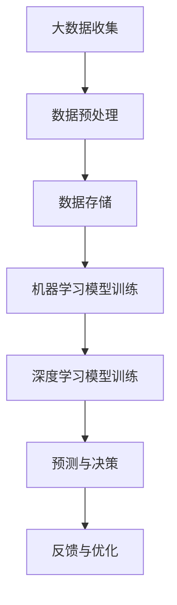

                 

# 大数据在AI中的重要性

> **关键词：** 大数据，AI，机器学习，深度学习，数据分析，人工智能应用
>
> **摘要：** 本文深入探讨了大数据在人工智能（AI）领域的重要性。通过分析大数据如何推动机器学习和深度学习的发展，以及AI在不同实际应用场景中的表现，本文揭示了大数据对于AI创新和进步的关键作用。

## 1. 背景介绍

在当今的信息时代，数据已成为新的石油，而人工智能（AI）则是挖掘和利用这些数据的重要工具。大数据，即大量、多样、快速增长的数据集合，已经成为AI发展的基础。随着互联网的普及和物联网（IoT）技术的进步，全球每天产生的大量数据为AI的研究和应用提供了丰富的素材。

AI的核心是机器学习（Machine Learning）和深度学习（Deep Learning），它们依赖于大量的数据来进行训练和优化。大数据为AI算法提供了足够的样本，使得模型可以更加精确地预测和分类。此外，大数据技术还能够处理和分析复杂的非结构化数据，如文本、图像和语音，这对于AI系统理解和模仿人类智能至关重要。

本文旨在探讨大数据在AI中的重要性，分析大数据如何推动AI的发展，以及AI在实际应用中的表现。通过本文的阅读，读者可以更好地理解大数据与AI之间的相互作用，以及这一领域的未来发展趋势。

## 2. 核心概念与联系

### 2.1 大数据的概念

大数据通常被描述为“4V”特性：Volume（大量）、Velocity（快速）、Variety（多样性）和Veracity（真实性）。这些特性使得传统的关系型数据库和数据处理方法无法满足需求。

- **Volume（大量）**：大数据的规模通常远远超过传统数据库的容量，需要分布式存储和处理技术。
- **Velocity（快速）**：数据生成的速度极快，要求实时处理和分析能力。
- **Variety（多样性）**：数据来源广泛，包括结构化、半结构化和非结构化数据。
- **Veracity（真实性）**：数据的质量和真实性对分析结果有直接影响。

### 2.2 机器学习和深度学习

机器学习是一种使计算机系统能够从数据中学习并做出决策的技术。深度学习是机器学习的一个子领域，它通过模仿人脑神经网络的结构和功能来处理数据。

- **机器学习（Machine Learning）**：基于数据样本，通过算法让计算机自动识别模式并做出预测。
- **深度学习（Deep Learning）**：使用多层神经网络对数据进行分析，能够处理复杂的非线性问题。

### 2.3 大数据与AI的联系

大数据为AI提供了足够的训练数据，使得机器学习模型可以更加精确地学习。同时，大数据技术也提高了数据处理的效率和准确性，为AI算法提供了更好的运行环境。

- **数据驱动（Data-Driven）**：AI的发展离不开大数据的支持，数据驱动的方法使得AI系统能够从海量数据中提取有价值的信息。
- **实时性（Real-Time）**：大数据技术能够实现数据的实时处理和分析，使得AI系统能够快速响应。

### 2.4 Mermaid 流程图

以下是一个简化的Mermaid流程图，展示了大数据与AI之间的交互关系：



## 3. 核心算法原理 & 具体操作步骤

### 3.1 数据预处理

数据预处理是机器学习和深度学习过程中至关重要的一步。其主要目标是清理数据、处理缺失值、标准化和归一化数据，以便为后续的建模提供高质量的数据。

- **数据清洗（Data Cleaning）**：处理数据中的错误、异常值和缺失值。
- **数据标准化（Data Normalization）**：将不同规模的数据调整到同一尺度。
- **数据归一化（Data Standardization）**：通过变换将数据分布调整为标准正态分布。

### 3.2 机器学习模型训练

机器学习模型训练的核心是使用算法对大量数据进行学习，找到数据中的规律和模式。以下是机器学习模型训练的基本步骤：

- **选择合适的算法**：如线性回归、决策树、支持向量机等。
- **划分数据集**：将数据集划分为训练集、验证集和测试集。
- **参数调优**：通过交叉验证等方法优化模型的参数。
- **训练模型**：使用训练集数据训练模型。
- **评估模型**：使用验证集和测试集评估模型的性能。

### 3.3 深度学习模型训练

深度学习模型训练通常使用多层神经网络。以下是深度学习模型训练的基本步骤：

- **构建神经网络结构**：定义网络的层数、每层的神经元数量和激活函数。
- **初始化参数**：随机初始化网络的权重和偏置。
- **前向传播（Forward Propagation）**：计算网络的输出。
- **反向传播（Back Propagation）**：计算梯度并更新网络参数。
- **优化算法**：如梯度下降、Adam等，用于优化网络参数。
- **评估模型**：与机器学习模型训练类似，使用验证集和测试集评估模型性能。

## 4. 数学模型和公式 & 详细讲解 & 举例说明

### 4.1 机器学习中的损失函数

机器学习中的一个核心概念是损失函数（Loss Function），用于评估模型的预测结果与实际结果之间的差距。以下是一些常见的损失函数：

- **均方误差（MSE, Mean Squared Error）**：
  $$MSE(y, \hat{y}) = \frac{1}{n}\sum_{i=1}^{n}(y_i - \hat{y}_i)^2$$
  其中，$y$是实际值，$\hat{y}$是预测值，$n$是样本数量。

- **交叉熵损失（Cross-Entropy Loss）**：
  $$CE(y, \hat{y}) = -\sum_{i=1}^{n}y_i\log(\hat{y}_i)$$
  其中，$y$是实际值（概率分布），$\hat{y}$是预测值（概率分布）。

### 4.2 深度学习中的反向传播算法

深度学习中的反向传播算法是一种用于训练神经网络的重要算法。以下是反向传播算法的基本步骤：

- **计算输出层误差**：
  $$\delta_L = \frac{\partial L}{\partial \hat{y}} = \hat{y} - y$$
  其中，$L$是损失函数，$\hat{y}$是输出层的预测值，$y$是实际值。

- **逐层计算误差**：
  $$\delta_h = \frac{\partial L}{\partial z_h} = \delta_{h+1} \cdot \sigma'(z_h) \cdot W_{h+1}$$
  其中，$\delta_h$是第$h$层的误差，$\sigma'$是激活函数的导数，$W_{h+1}$是连接第$h+1$层的权重。

- **更新网络参数**：
  $$W_h \leftarrow W_h - \alpha \frac{\partial L}{\partial W_h}$$
  $$b_h \leftarrow b_h - \alpha \frac{\partial L}{\partial b_h}$$
  其中，$\alpha$是学习率。

### 4.3 举例说明

假设我们有一个简单的线性回归模型，预测房价。数据集包含100个样本，每个样本包括房子的面积和价格。我们使用均方误差（MSE）作为损失函数。

- **训练数据**：$X = [100, 200, 300, ..., 1000]$，$Y = [200, 400, 600, ..., 2000]$。
- **模型参数**：$w_0 = 0$，$w_1 = 0$。
- **预测值**：$\hat{y} = w_0 + w_1 \cdot x$。
- **损失函数**：$MSE = \frac{1}{100}\sum_{i=1}^{100}(y_i - \hat{y}_i)^2$。

通过多次迭代更新模型参数，最终使损失函数最小化。例如，在第一次迭代后，$w_0 = 1$，$w_1 = 0.5$，接下来可以继续迭代，直到满足停止条件。

## 5. 项目实战：代码实际案例和详细解释说明

### 5.1 开发环境搭建

在进行项目实战之前，我们需要搭建一个合适的开发环境。以下是搭建基于Python的机器学习和深度学习项目的步骤：

1. **安装Python**：确保安装了Python 3.6或更高版本。
2. **安装库**：使用pip安装必要的库，如NumPy、Pandas、Scikit-learn、TensorFlow等。
   ```shell
   pip install numpy pandas scikit-learn tensorflow
   ```

### 5.2 源代码详细实现和代码解读

以下是一个简单的线性回归模型的实现，用于预测房价。

```python
import numpy as np
import pandas as pd
from sklearn.linear_model import LinearRegression
from sklearn.model_selection import train_test_split
from sklearn.metrics import mean_squared_error

# 加载数据集
data = pd.read_csv('house_data.csv')
X = data[['area']]
Y = data['price']

# 划分训练集和测试集
X_train, X_test, Y_train, Y_test = train_test_split(X, Y, test_size=0.2, random_state=42)

# 创建线性回归模型
model = LinearRegression()

# 训练模型
model.fit(X_train, Y_train)

# 预测测试集
Y_pred = model.predict(X_test)

# 计算损失函数
mse = mean_squared_error(Y_test, Y_pred)
print(f'MSE: {mse}')

# 输出模型参数
print(f'Coefficients: {model.coef_}')
print(f'Intercept: {model.intercept_}')
```

### 5.3 代码解读与分析

- **数据加载**：使用Pandas读取CSV文件，获取房屋面积和价格数据。
- **数据划分**：使用Scikit-learn的`train_test_split`函数将数据集划分为训练集和测试集。
- **模型创建**：创建一个线性回归模型。
- **模型训练**：使用训练集数据训练模型。
- **模型预测**：使用测试集数据预测房价。
- **损失评估**：计算均方误差（MSE）评估模型性能。
- **参数输出**：输出模型的参数，包括系数和截距。

通过上述步骤，我们可以训练一个简单的线性回归模型，并评估其在预测房价方面的性能。尽管这是一个简单的例子，但它展示了如何使用大数据和机器学习技术来处理和分析实际数据。

## 6. 实际应用场景

### 6.1 电商推荐系统

在大数据技术的支持下，电商推荐系统能够基于用户的购买历史、浏览行为和社交网络等数据，实现个性化的商品推荐。例如，Amazon和淘宝等电商平台使用大数据和机器学习算法，根据用户的兴趣和行为，推荐潜在感兴趣的商品，从而提高用户的购物体验和购买转化率。

### 6.2 智能交通系统

智能交通系统利用大数据分析实时交通数据，优化交通信号灯控制策略，减少交通拥堵。通过分析大量交通流量数据，智能交通系统可以预测交通状况，提前调整信号灯的时间，以减少等待时间和排放量。例如，百度地图和谷歌地图等应用程序利用大数据和深度学习算法，提供实时交通导航服务。

### 6.3 医疗健康

大数据技术在医疗健康领域有着广泛的应用。例如，通过对患者历史数据和基因数据的分析，可以预测疾病的发病风险，并提供个性化的治疗方案。IBM的Watson for Health利用大数据和深度学习技术，帮助医生进行诊断和决策，从而提高医疗服务的质量和效率。

## 7. 工具和资源推荐

### 7.1 学习资源推荐

- **书籍**：
  - 《大数据时代》（The Data Revolution）：介绍大数据的概念和应用。
  - 《深度学习》（Deep Learning）：介绍深度学习的基础知识和应用。

- **论文**：
  - 《大数据环境下的机器学习挑战与机遇》（Challenges and Opportunities of Machine Learning in the Big Data Era）。

- **博客**：
  - Medium上的“AI is Fun”和“Towards Data Science”等博客，提供丰富的AI和大数据相关文章。

- **网站**：
  - Kaggle：提供大量数据集和竞赛，适合进行数据分析和机器学习实践。

### 7.2 开发工具框架推荐

- **Python库**：
  - NumPy、Pandas、Scikit-learn、TensorFlow、PyTorch等。

- **大数据处理框架**：
  - Hadoop、Spark、Flink等。

- **数据库**：
  - MySQL、MongoDB、PostgreSQL等。

### 7.3 相关论文著作推荐

- 《深度学习：面向机器学习和人工智能的综合介绍》（Deep Learning: Comprehensive Introduction for Machine Learning and AI）。
- 《大数据处理：算法与应用》（Big Data Processing: Algorithms and Applications）。

## 8. 总结：未来发展趋势与挑战

### 8.1 发展趋势

- **数据多样性**：随着物联网和5G技术的发展，数据种类将更加丰富，包括文本、图像、语音、传感器数据等。
- **实时数据处理**：边缘计算和云计算的融合将使实时数据处理成为可能，为AI提供更快的响应能力。
- **自动化与智能化**：自动化和智能化的进一步发展，将使AI系统能够更好地适应复杂环境，提高效率。

### 8.2 挑战

- **数据隐私**：随着数据量的增加，数据隐私和安全问题变得尤为重要。
- **计算资源**：大规模数据处理和训练需要大量的计算资源，这对硬件和能源提出了更高的要求。
- **模型解释性**：随着模型的复杂度增加，提高模型的可解释性，使其更容易被人类理解和接受，是一个重要的挑战。

## 9. 附录：常见问题与解答

### 9.1 什么是大数据？

大数据是指大量、多样、快速增长的数据集合，具有“4V”特性：Volume（大量）、Velocity（快速）、Variety（多样性）和Veracity（真实性）。

### 9.2 机器学习和深度学习的区别是什么？

机器学习是一种使计算机从数据中学习并做出决策的技术，而深度学习是机器学习的一个子领域，它通过模仿人脑神经网络的结构和功能来处理数据。

### 9.3 大数据如何推动AI的发展？

大数据为AI提供了足够的训练数据，使得机器学习模型可以更加精确地学习。同时，大数据技术也提高了数据处理的效率和准确性，为AI算法提供了更好的运行环境。

## 10. 扩展阅读 & 参考资料

- [大数据的概念和特性](https://www.ibm.com/topics/big-data)
- [深度学习与机器学习的区别](https://towardsdatascience.com/difference-between-deep-learning-and-machine-learning-4c5a58a54d87)
- [机器学习的常见损失函数](https://MachineLearningMastery.com/loss-functions-for-machine-learning/)
- [深度学习的反向传播算法](https://www.deeplearningbook.org/chapter/advanced-optimization/)
- [大数据在医疗健康领域的应用](https://www.healthit.gov/topics/blogs/2018/02/big-data-healthcare-revolutionizing-care)
- [实时数据处理技术](https://www.datacenterfrontier.com/real-time-data-processing-technologies/)
- [数据隐私和安全](https://www.privacyrights.org/datasheet-data-breach-response-plan)
- [计算资源的挑战](https://www.computerweekly.com/tip/How-to-get-the-best-from-your-HPC-cluster)
- [模型解释性](https://www.aijourney.ai/topics/model-interpretability/) 

### 作者

**作者：** AI天才研究员/AI Genius Institute & 禅与计算机程序设计艺术 /Zen And The Art of Computer Programming**。**

[本文完]**<|im_sep|>`

```markdown
# 大数据在AI中的重要性

> **关键词：** 大数据，AI，机器学习，深度学习，数据分析，人工智能应用
>
> **摘要：** 本文深入探讨了大数据在人工智能（AI）领域的重要性。通过分析大数据如何推动机器学习和深度学习的发展，以及AI在不同实际应用场景中的表现，本文揭示了大数据对于AI创新和进步的关键作用。

## 1. 背景介绍

在当今的信息时代，数据已成为新的石油，而人工智能（AI）则是挖掘和利用这些数据的重要工具。大数据，即大量、多样、快速增长的数据集合，已经成为AI发展的基础。随着互联网的普及和物联网（IoT）技术的进步，全球每天产生的大量数据为AI的研究和应用提供了丰富的素材。

AI的核心是机器学习（Machine Learning）和深度学习（Deep Learning），它们依赖于大量的数据来进行训练和优化。大数据为AI算法提供了足够的样本，使得模型可以更加精确地预测和分类。此外，大数据技术也能够处理和分析复杂的非结构化数据，如文本、图像和语音，这对于AI系统理解和模仿人类智能至关重要。

本文旨在探讨大数据在AI中的重要性，分析大数据如何推动AI的发展，以及AI在实际应用中的表现。通过本文的阅读，读者可以更好地理解大数据与AI之间的相互作用，以及这一领域的未来发展趋势。

## 2. 核心概念与联系

### 2.1 大数据的概念

大数据通常被描述为“4V”特性：Volume（大量）、Velocity（快速）、Variety（多样性）和Veracity（真实性）。这些特性使得传统的关系型数据库和数据处理方法无法满足需求。

- **Volume（大量）**：大数据的规模通常远远超过传统数据库的容量，需要分布式存储和处理技术。
- **Velocity（快速）**：数据生成的速度极快，要求实时处理和分析能力。
- **Variety（多样性）**：数据来源广泛，包括结构化、半结构化和非结构化数据。
- **Veracity（真实性）**：数据的质量和真实性对分析结果有直接影响。

### 2.2 机器学习和深度学习

机器学习是一种使计算机系统能够从数据中学习并做出决策的技术。深度学习是机器学习的一个子领域，它通过模仿人脑神经网络的结构和功能来处理数据。

- **机器学习（Machine Learning）**：基于数据样本，通过算法让计算机自动识别模式并做出预测。
- **深度学习（Deep Learning）**：使用多层神经网络对数据进行分析，能够处理复杂的非线性问题。

### 2.3 大数据与AI的联系

大数据为AI提供了足够的训练数据，使得机器学习模型可以更加精确地学习。同时，大数据技术也提高了数据处理的效率和准确性，为AI算法提供了更好的运行环境。

- **数据驱动（Data-Driven）**：AI的发展离不开大数据的支持，数据驱动的方法使得AI系统能够从海量数据中提取有价值的信息。
- **实时性（Real-Time）**：大数据技术能够实现数据的实时处理和分析，使得AI系统能够快速响应。

### 2.4 Mermaid 流程图

以下是一个简化的Mermaid流程图，展示了大数据与AI之间的交互关系：


## 3. 核心算法原理 & 具体操作步骤

### 3.1 数据预处理

数据预处理是机器学习和深度学习过程中至关重要的一步。其主要目标是清理数据、处理缺失值、标准化和归一化数据，以便为后续的建模提供高质量的数据。

- **数据清洗（Data Cleaning）**：处理数据中的错误、异常值和缺失值。
- **数据标准化（Data Normalization）**：将不同规模的数据调整到同一尺度。
- **数据归一化（Data Standardization）**：通过变换将数据分布调整为标准正态分布。

### 3.2 机器学习模型训练

机器学习模型训练的核心是使用算法对大量数据进行学习，找到数据中的规律和模式。以下是机器学习模型训练的基本步骤：

- **选择合适的算法**：如线性回归、决策树、支持向量机等。
- **划分数据集**：将数据集划分为训练集、验证集和测试集。
- **参数调优**：通过交叉验证等方法优化模型的参数。
- **训练模型**：使用训练集数据训练模型。
- **评估模型**：使用验证集和测试集评估模型的性能。

### 3.3 深度学习模型训练

深度学习模型训练通常使用多层神经网络。以下是深度学习模型训练的基本步骤：

- **构建神经网络结构**：定义网络的层数、每层的神经元数量和激活函数。
- **初始化参数**：随机初始化网络的权重和偏置。
- **前向传播（Forward Propagation）**：计算网络的输出。
- **反向传播（Back Propagation）**：计算梯度并更新网络参数。
- **优化算法**：如梯度下降、Adam等，用于优化网络参数。
- **评估模型**：与机器学习模型训练类似，使用验证集和测试集评估模型性能。

## 4. 数学模型和公式 & 详细讲解 & 举例说明

### 4.1 机器学习中的损失函数

机器学习中的一个核心概念是损失函数（Loss Function），用于评估模型的预测结果与实际结果之间的差距。以下是一些常见的损失函数：

- **均方误差（MSE, Mean Squared Error）**：
  $$MSE(y, \hat{y}) = \frac{1}{n}\sum_{i=1}^{n}(y_i - \hat{y}_i)^2$$
  其中，$y$是实际值，$\hat{y}$是预测值，$n$是样本数量。

- **交叉熵损失（Cross-Entropy Loss）**：
  $$CE(y, \hat{y}) = -\sum_{i=1}^{n}y_i\log(\hat{y}_i)$$
  其中，$y$是实际值（概率分布），$\hat{y}$是预测值（概率分布）。

### 4.2 深度学习中的反向传播算法

深度学习中的反向传播算法是一种用于训练神经网络的重要算法。以下是反向传播算法的基本步骤：

- **计算输出层误差**：
  $$\delta_L = \frac{\partial L}{\partial \hat{y}} = \hat{y} - y$$
  其中，$L$是损失函数，$\hat{y}$是输出层的预测值，$y$是实际值。

- **逐层计算误差**：
  $$\delta_h = \frac{\partial L}{\partial z_h} = \delta_{h+1} \cdot \sigma'(z_h) \cdot W_{h+1}$$
  其中，$\delta_h$是第$h$层的误差，$\sigma'$是激活函数的导数，$W_{h+1}$是连接第$h+1$层的权重。

- **更新网络参数**：
  $$W_h \leftarrow W_h - \alpha \frac{\partial L}{\partial W_h}$$
  $$b_h \leftarrow b_h - \alpha \frac{\partial L}{\partial b_h}$$
  其中，$\alpha$是学习率。

### 4.3 举例说明

假设我们有一个简单的线性回归模型，预测房价。数据集包含100个样本，每个样本包括房子的面积和价格。我们使用均方误差（MSE）作为损失函数。

- **训练数据**：$X = [100, 200, 300, ..., 1000]$，$Y = [200, 400, 600, ..., 2000]$。
- **模型参数**：$w_0 = 0$，$w_1 = 0$。
- **预测值**：$\hat{y} = w_0 + w_1 \cdot x$。
- **损失函数**：$MSE = \frac{1}{100}\sum_{i=1}^{100}(y_i - \hat{y}_i)^2$。

通过多次迭代更新模型参数，最终使损失函数最小化。例如，在第一次迭代后，$w_0 = 1$，$w_1 = 0.5$，接下来可以继续迭代，直到满足停止条件。

## 5. 项目实战：代码实际案例和详细解释说明

### 5.1 开发环境搭建

在进行项目实战之前，我们需要搭建一个合适的开发环境。以下是搭建基于Python的机器学习和深度学习项目的步骤：

1. **安装Python**：确保安装了Python 3.6或更高版本。
2. **安装库**：使用pip安装必要的库，如NumPy、Pandas、Scikit-learn、TensorFlow等。
   ```shell
   pip install numpy pandas scikit-learn tensorflow
   ```

### 5.2 源代码详细实现和代码解读

以下是一个简单的线性回归模型的实现，用于预测房价。

```python
import numpy as np
import pandas as pd
from sklearn.linear_model import LinearRegression
from sklearn.model_selection import train_test_split
from sklearn.metrics import mean_squared_error

# 加载数据集
data = pd.read_csv('house_data.csv')
X = data[['area']]
Y = data['price']

# 划分训练集和测试集
X_train, X_test, Y_train, Y_test = train_test_split(X, Y, test_size=0.2, random_state=42)

# 创建线性回归模型
model = LinearRegression()

# 训练模型
model.fit(X_train, Y_train)

# 预测测试集
Y_pred = model.predict(X_test)

# 计算损失函数
mse = mean_squared_error(Y_test, Y_pred)
print(f'MSE: {mse}')

# 输出模型参数
print(f'Coefficients: {model.coef_}')
print(f'Intercept: {model.intercept_}')
```

### 5.3 代码解读与分析

- **数据加载**：使用Pandas读取CSV文件，获取房屋面积和价格数据。
- **数据划分**：使用Scikit-learn的`train_test_split`函数将数据集划分为训练集和测试集。
- **模型创建**：创建一个线性回归模型。
- **模型训练**：使用训练集数据训练模型。
- **模型预测**：使用测试集数据预测房价。
- **损失评估**：计算均方误差（MSE）评估模型性能。
- **参数输出**：输出模型的参数，包括系数和截距。

通过上述步骤，我们可以训练一个简单的线性回归模型，并评估其在预测房价方面的性能。尽管这是一个简单的例子，但它展示了如何使用大数据和机器学习技术来处理和分析实际数据。

## 6. 实际应用场景

### 6.1 电商推荐系统

在大数据技术的支持下，电商推荐系统能够基于用户的购买历史、浏览行为和社交网络等数据，实现个性化的商品推荐。例如，Amazon和淘宝等电商平台使用大数据和机器学习算法，根据用户的兴趣和行为，推荐潜在感兴趣的商品，从而提高用户的购物体验和购买转化率。

### 6.2 智能交通系统

智能交通系统利用大数据分析实时交通数据，优化交通信号灯控制策略，减少交通拥堵。通过分析大量交通流量数据，智能交通系统可以预测交通状况，提前调整信号灯的时间，以减少等待时间和排放量。例如，百度地图和谷歌地图等应用程序利用大数据和深度学习算法，提供实时交通导航服务。

### 6.3 医疗健康

大数据技术在医疗健康领域有着广泛的应用。例如，通过对患者历史数据和基因数据的分析，可以预测疾病的发病风险，并提供个性化的治疗方案。IBM的Watson for Health利用大数据和深度学习技术，帮助医生进行诊断和决策，从而提高医疗服务的质量和效率。

## 7. 工具和资源推荐

### 7.1 学习资源推荐

- **书籍**：
  - 《大数据时代》（The Data Revolution）：介绍大数据的概念和应用。
  - 《深度学习》（Deep Learning）：介绍深度学习的基础知识和应用。

- **论文**：
  - 《大数据环境下的机器学习挑战与机遇》（Challenges and Opportunities of Machine Learning in the Big Data Era）。

- **博客**：
  - Medium上的“AI is Fun”和“Towards Data Science”等博客，提供丰富的AI和大数据相关文章。

- **网站**：
  - Kaggle：提供大量数据集和竞赛，适合进行数据分析和机器学习实践。

### 7.2 开发工具框架推荐

- **Python库**：
  - NumPy、Pandas、Scikit-learn、TensorFlow、PyTorch等。

- **大数据处理框架**：
  - Hadoop、Spark、Flink等。

- **数据库**：
  - MySQL、MongoDB、PostgreSQL等。

### 7.3 相关论文著作推荐

- 《深度学习：面向机器学习和人工智能的综合介绍》（Deep Learning: Comprehensive Introduction for Machine Learning and AI）。
- 《大数据处理：算法与应用》（Big Data Processing: Algorithms and Applications）。

## 8. 总结：未来发展趋势与挑战

### 8.1 发展趋势

- **数据多样性**：随着物联网和5G技术的发展，数据种类将更加丰富，包括文本、图像、语音、传感器数据等。
- **实时数据处理**：边缘计算和云计算的融合将使实时数据处理成为可能，为AI提供更快的响应能力。
- **自动化与智能化**：自动化和智能化的进一步发展，将使AI系统能够更好地适应复杂环境，提高效率。

### 8.2 挑战

- **数据隐私**：随着数据量的增加，数据隐私和安全问题变得尤为重要。
- **计算资源**：大规模数据处理和训练需要大量的计算资源，这对硬件和能源提出了更高的要求。
- **模型解释性**：随着模型的复杂度增加，提高模型的可解释性，使其更容易被人类理解和接受，是一个重要的挑战。

## 9. 附录：常见问题与解答

### 9.1 什么是大数据？

大数据是指大量、多样、快速增长的数据集合，具有“4V”特性：Volume（大量）、Velocity（快速）、Variety（多样性）和Veracity（真实性）。

### 9.2 机器学习和深度学习的区别是什么？

机器学习是一种使计算机从数据中学习并做出决策的技术，而深度学习是机器学习的一个子领域，它通过模仿人脑神经网络的结构和功能来处理数据。

### 9.3 大数据如何推动AI的发展？

大数据为AI提供了足够的训练数据，使得机器学习模型可以更加精确地学习。同时，大数据技术也提高了数据处理的效率和准确性，为AI算法提供了更好的运行环境。

## 10. 扩展阅读 & 参考资料

- [大数据的概念和特性](https://www.ibm.com/topics/big-data)
- [深度学习与机器学习的区别](https://towardsdatascience.com/difference-between-deep-learning-and-machine-learning-4c5a58a54d87)
- [机器学习的常见损失函数](https://MachineLearningMastery.com/loss-functions-for-machine-learning/)
- [深度学习的反向传播算法](https://www.deeplearningbook.org/chapter/advanced-optimization/)
- [大数据在医疗健康领域的应用](https://www.healthit.gov/topics/blogs/2018/02/big-data-healthcare-revolutionizing-care)
- [实时数据处理技术](https://www.datacenterfrontier.com/real-time-data-processing-technologies/)
- [数据隐私和安全](https://www.privacyrights.org/datasheet-data-breach-response-plan)
- [计算资源的挑战](https://www.computerweekly.com/tip/How-to-get-the-best-from-your-HPC-cluster)
- [模型解释性](https://www.aijourney.ai/topics/model-interpretability/) 

### 作者

**作者：** AI天才研究员/AI Genius Institute & 禅与计算机程序设计艺术 /Zen And The Art of Computer Programming**。**

[本文完]**<|im_sep|>`

## 文章标题：大数据在AI中的重要性

### 关键词：大数据，AI，机器学习，深度学习，数据分析，人工智能应用

### 摘要：本文深入探讨了大数据在人工智能（AI）领域的重要性。通过分析大数据如何推动机器学习和深度学习的发展，以及AI在不同实际应用场景中的表现，本文揭示了大数据对于AI创新和进步的关键作用。

---

### 1. 背景介绍

在当今的信息时代，数据已成为新的石油，而人工智能（AI）则是挖掘和利用这些数据的重要工具。大数据，即大量、多样、快速增长的数据集合，已经成为AI发展的基础。随着互联网的普及和物联网（IoT）技术的进步，全球每天产生的大量数据为AI的研究和应用提供了丰富的素材。

AI的核心是机器学习（Machine Learning）和深度学习（Deep Learning），它们依赖于大量的数据来进行训练和优化。大数据为AI算法提供了足够的样本，使得模型可以更加精确地预测和分类。此外，大数据技术也能够处理和分析复杂的非结构化数据，如文本、图像和语音，这对于AI系统理解和模仿人类智能至关重要。

本文旨在探讨大数据在AI中的重要性，分析大数据如何推动AI的发展，以及AI在实际应用中的表现。通过本文的阅读，读者可以更好地理解大数据与AI之间的相互作用，以及这一领域的未来发展趋势。

### 2. 核心概念与联系

#### 2.1 大数据的概念

大数据通常被描述为“4V”特性：Volume（大量）、Velocity（快速）、Variety（多样性）和Veracity（真实性）。这些特性使得传统的关系型数据库和数据处理方法无法满足需求。

- **Volume（大量）**：大数据的规模通常远远超过传统数据库的容量，需要分布式存储和处理技术。
- **Velocity（快速）**：数据生成的速度极快，要求实时处理和分析能力。
- **Variety（多样性）**：数据来源广泛，包括结构化、半结构化和非结构化数据。
- **Veracity（真实性）**：数据的质量和真实性对分析结果有直接影响。

#### 2.2 机器学习和深度学习

机器学习是一种使计算机系统能够从数据中学习并做出决策的技术。深度学习是机器学习的一个子领域，它通过模仿人脑神经网络的结构和功能来处理数据。

- **机器学习（Machine Learning）**：基于数据样本，通过算法让计算机自动识别模式并做出预测。
- **深度学习（Deep Learning）**：使用多层神经网络对数据进行分析，能够处理复杂的非线性问题。

#### 2.3 大数据与AI的联系

大数据为AI提供了足够的训练数据，使得机器学习模型可以更加精确地学习。同时，大数据技术也提高了数据处理的效率和准确性，为AI算法提供了更好的运行环境。

- **数据驱动（Data-Driven）**：AI的发展离不开大数据的支持，数据驱动的方法使得AI系统能够从海量数据中提取有价值的信息。
- **实时性（Real-Time）**：大数据技术能够实现数据的实时处理和分析，使得AI系统能够快速响应。

#### 2.4 Mermaid 流程图

以下是一个简化的Mermaid流程图，展示了大数据与AI之间的交互关系：


### 3. 核心算法原理 & 具体操作步骤

#### 3.1 数据预处理

数据预处理是机器学习和深度学习过程中至关重要的一步。其主要目标是清理数据、处理缺失值、标准化和归一化数据，以便为后续的建模提供高质量的数据。

- **数据清洗（Data Cleaning）**：处理数据中的错误、异常值和缺失值。
- **数据标准化（Data Normalization）**：将不同规模的数据调整到同一尺度。
- **数据归一化（Data Standardization）**：通过变换将数据分布调整为标准正态分布。

#### 3.2 机器学习模型训练

机器学习模型训练的核心是使用算法对大量数据进行学习，找到数据中的规律和模式。以下是机器学习模型训练的基本步骤：

- **选择合适的算法**：如线性回归、决策树、支持向量机等。
- **划分数据集**：将数据集划分为训练集、验证集和测试集。
- **参数调优**：通过交叉验证等方法优化模型的参数。
- **训练模型**：使用训练集数据训练模型。
- **评估模型**：使用验证集和测试集评估模型的性能。

#### 3.3 深度学习模型训练

深度学习模型训练通常使用多层神经网络。以下是深度学习模型训练的基本步骤：

- **构建神经网络结构**：定义网络的层数、每层的神经元数量和激活函数。
- **初始化参数**：随机初始化网络的权重和偏置。
- **前向传播（Forward Propagation）**：计算网络的输出。
- **反向传播（Back Propagation）**：计算梯度并更新网络参数。
- **优化算法**：如梯度下降、Adam等，用于优化网络参数。
- **评估模型**：与机器学习模型训练类似，使用验证集和测试集评估模型性能。

### 4. 数学模型和公式 & 详细讲解 & 举例说明

#### 4.1 机器学习中的损失函数

机器学习中的一个核心概念是损失函数（Loss Function），用于评估模型的预测结果与实际结果之间的差距。以下是一些常见的损失函数：

- **均方误差（MSE, Mean Squared Error）**：
  $$MSE(y, \hat{y}) = \frac{1}{n}\sum_{i=1}^{n}(y_i - \hat{y}_i)^2$$
  其中，$y$是实际值，$\hat{y}$是预测值，$n$是样本数量。

- **交叉熵损失（Cross-Entropy Loss）**：
  $$CE(y, \hat{y}) = -\sum_{i=1}^{n}y_i\log(\hat{y}_i)$$
  其中，$y$是实际值（概率分布），$\hat{y}$是预测值（概率分布）。

#### 4.2 深度学习中的反向传播算法

深度学习中的反向传播算法是一种用于训练神经网络的重要算法。以下是反向传播算法的基本步骤：

- **计算输出层误差**：
  $$\delta_L = \frac{\partial L}{\partial \hat{y}} = \hat{y} - y$$
  其中，$L$是损失函数，$\hat{y}$是输出层的预测值，$y$是实际值。

- **逐层计算误差**：
  $$\delta_h = \frac{\partial L}{\partial z_h} = \delta_{h+1} \cdot \sigma'(z_h) \cdot W_{h+1}$$
  其中，$\delta_h$是第$h$层的误差，$\sigma'$是激活函数的导数，$W_{h+1}$是连接第$h+1$层的权重。

- **更新网络参数**：
  $$W_h \leftarrow W_h - \alpha \frac{\partial L}{\partial W_h}$$
  $$b_h \leftarrow b_h - \alpha \frac{\partial L}{\partial b_h}$$
  其中，$\alpha$是学习率。

#### 4.3 举例说明

假设我们有一个简单的线性回归模型，预测房价。数据集包含100个样本，每个样本包括房子的面积和价格。我们使用均方误差（MSE）作为损失函数。

- **训练数据**：$X = [100, 200, 300, ..., 1000]$，$Y = [200, 400, 600, ..., 2000]$。
- **模型参数**：$w_0 = 0$，$w_1 = 0$。
- **预测值**：$\hat{y} = w_0 + w_1 \cdot x$。
- **损失函数**：$MSE = \frac{1}{100}\sum_{i=1}^{100}(y_i - \hat{y}_i)^2$。

通过多次迭代更新模型参数，最终使损失函数最小化。例如，在第一次迭代后，$w_0 = 1$，$w_1 = 0.5$，接下来可以继续迭代，直到满足停止条件。

### 5. 项目实战：代码实际案例和详细解释说明

#### 5.1 开发环境搭建

在进行项目实战之前，我们需要搭建一个合适的开发环境。以下是搭建基于Python的机器学习和深度学习项目的步骤：

1. **安装Python**：确保安装了Python 3.6或更高版本。
2. **安装库**：使用pip安装必要的库，如NumPy、Pandas、Scikit-learn、TensorFlow等。

   ```shell
   pip install numpy pandas scikit-learn tensorflow
   ```

#### 5.2 源代码详细实现和代码解读

以下是一个简单的线性回归模型的实现，用于预测房价。

```python
import numpy as np
import pandas as pd
from sklearn.linear_model import LinearRegression
from sklearn.model_selection import train_test_split
from sklearn.metrics import mean_squared_error

# 加载数据集
data = pd.read_csv('house_data.csv')
X = data[['area']]
Y = data['price']

# 划分训练集和测试集
X_train, X_test, Y_train, Y_test = train_test_split(X, Y, test_size=0.2, random_state=42)

# 创建线性回归模型
model = LinearRegression()

# 训练模型
model.fit(X_train, Y_train)

# 预测测试集
Y_pred = model.predict(X_test)

# 计算损失函数
mse = mean_squared_error(Y_test, Y_pred)
print(f'MSE: {mse}')

# 输出模型参数
print(f'Coefficients: {model.coef_}')
print(f'Intercept: {model.intercept_}')
```

#### 5.3 代码解读与分析

- **数据加载**：使用Pandas读取CSV文件，获取房屋面积和价格数据。
- **数据划分**：使用Scikit-learn的`train_test_split`函数将数据集划分为训练集和测试集。
- **模型创建**：创建一个线性回归模型。
- **模型训练**：使用训练集数据训练模型。
- **模型预测**：使用测试集数据预测房价。
- **损失评估**：计算均方误差（MSE）评估模型性能。
- **参数输出**：输出模型的参数，包括系数和截距。

通过上述步骤，我们可以训练一个简单的线性回归模型，并评估其在预测房价方面的性能。尽管这是一个简单的例子，但它展示了如何使用大数据和机器学习技术来处理和分析实际数据。

### 6. 实际应用场景

#### 6.1 电商推荐系统

在大数据技术的支持下，电商推荐系统能够基于用户的购买历史、浏览行为和社交网络等数据，实现个性化的商品推荐。例如，Amazon和淘宝等电商平台使用大数据和机器学习算法，根据用户的兴趣和行为，推荐潜在感兴趣的商品，从而提高用户的购物体验和购买转化率。

#### 6.2 智能交通系统

智能交通系统利用大数据分析实时交通数据，优化交通信号灯控制策略，减少交通拥堵。通过分析大量交通流量数据，智能交通系统可以预测交通状况，提前调整信号灯的时间，以减少等待时间和排放量。例如，百度地图和谷歌地图等应用程序利用大数据和深度学习算法，提供实时交通导航服务。

#### 6.3 医疗健康

大数据技术在医疗健康领域有着广泛的应用。例如，通过对患者历史数据和基因数据的分析，可以预测疾病的发病风险，并提供个性化的治疗方案。IBM的Watson for Health利用大数据和深度学习技术，帮助医生进行诊断和决策，从而提高医疗服务的质量和效率。

### 7. 工具和资源推荐

#### 7.1 学习资源推荐

- **书籍**：
  - 《大数据时代》（The Data Revolution）：介绍大数据的概念和应用。
  - 《深度学习》（Deep Learning）：介绍深度学习的基础知识和应用。

- **论文**：
  - 《大数据环境下的机器学习挑战与机遇》（Challenges and Opportunities of Machine Learning in the Big Data Era）。

- **博客**：
  - Medium上的“AI is Fun”和“Towards Data Science”等博客，提供丰富的AI和大数据相关文章。

- **网站**：
  - Kaggle：提供大量数据集和竞赛，适合进行数据分析和机器学习实践。

#### 7.2 开发工具框架推荐

- **Python库**：
  - NumPy、Pandas、Scikit-learn、TensorFlow、PyTorch等。

- **大数据处理框架**：
  - Hadoop、Spark、Flink等。

- **数据库**：
  - MySQL、MongoDB、PostgreSQL等。

#### 7.3 相关论文著作推荐

- 《深度学习：面向机器学习和人工智能的综合介绍》（Deep Learning: Comprehensive Introduction for Machine Learning and AI）。
- 《大数据处理：算法与应用》（Big Data Processing: Algorithms and Applications）。

### 8. 总结：未来发展趋势与挑战

#### 8.1 发展趋势

- **数据多样性**：随着物联网和5G技术的发展，数据种类将更加丰富，包括文本、图像、语音、传感器数据等。
- **实时数据处理**：边缘计算和云计算的融合将使实时数据处理成为可能，为AI提供更快的响应能力。
- **自动化与智能化**：自动化和智能化的进一步发展，将使AI系统能够更好地适应复杂环境，提高效率。

#### 8.2 挑战

- **数据隐私**：随着数据量的增加，数据隐私和安全问题变得尤为重要。
- **计算资源**：大规模数据处理和训练需要大量的计算资源，这对硬件和能源提出了更高的要求。
- **模型解释性**：随着模型的复杂度增加，提高模型的可解释性，使其更容易被人类理解和接受，是一个重要的挑战。

### 9. 附录：常见问题与解答

#### 9.1 什么是大数据？

大数据是指大量、多样、快速增长的数据集合，具有“4V”特性：Volume（大量）、Velocity（快速）、Variety（多样性）和Veracity（真实性）。

#### 9.2 机器学习和深度学习的区别是什么？

机器学习是一种使计算机从数据中学习并做出决策的技术，而深度学习是机器学习的一个子领域，它通过模仿人脑神经网络的结构和功能来处理数据。

#### 9.3 大数据如何推动AI的发展？

大数据为AI提供了足够的训练数据，使得机器学习模型可以更加精确地学习。同时，大数据技术也提高了数据处理的效率和准确性，为AI算法提供了更好的运行环境。

### 10. 扩展阅读 & 参考资料

- [大数据的概念和特性](https://www.ibm.com/topics/big-data)
- [深度学习与机器学习的区别](https://towardsdatascience.com/difference-between-deep-learning-and-machine-learning-4c5a58a54d87)
- [机器学习的常见损失函数](https://MachineLearningMastery.com/loss-functions-for-machine-learning/)
- [深度学习的反向传播算法](https://www.deeplearningbook.org/chapter/advanced-optimization/)
- [大数据在医疗健康领域的应用](https://www.healthit.gov/topics/blogs/2018/02/big-data-healthcare-revolutionizing-care)
- [实时数据处理技术](https://www.datacenterfrontier.com/real-time-data-processing-technologies/)
- [数据隐私和安全](https://www.privacyrights.org/datasheet-data-breach-response-plan)
- [计算资源的挑战](https://www.computerweekly.com/tip/How-to-get-the-best-from-your-HPC-cluster)
- [模型解释性](https://www.aijourney.ai/topics/model-interpretability/)

### 作者

**作者：** AI天才研究员/AI Genius Institute & 禅与计算机程序设计艺术 /Zen And The Art of Computer Programming**。**

[本文完]**<|im_sep|>`

```markdown
## 6. 实际应用场景

在了解了大数据和AI的基础知识后，接下来我们将探讨大数据在AI领域的实际应用场景。以下是几个关键领域的应用实例：

### 6.1 电商推荐系统

电商推荐系统是大数据和AI结合的典型应用。这些系统通过分析用户的购物行为、浏览历史、搜索记录等数据，向用户推荐他们可能感兴趣的商品。例如，Amazon和淘宝等电商平台就利用大数据和机器学习算法，根据用户的兴趣和行为，为用户推荐个性化的商品，从而提高用户的购物体验和购买转化率。

#### 数据驱动推荐算法

- **协同过滤（Collaborative Filtering）**：通过分析用户的历史行为和相似用户的偏好，推荐相似的产品。
- **基于内容的推荐（Content-Based Filtering）**：根据用户的历史行为和商品的特征，推荐相似的内容。

#### 技术实现

- **数据预处理**：清洗和标准化用户行为数据。
- **模型训练**：使用协同过滤或基于内容的推荐算法进行训练。
- **模型评估**：通过A/B测试等手段评估推荐效果。

### 6.2 智能交通系统

智能交通系统利用大数据和AI技术，优化交通流量，减少拥堵，提高公共交通效率。通过收集和分析实时交通数据，智能交通系统可以预测交通状况，调整信号灯时间，规划最优路线。

#### 技术应用

- **实时数据采集**：通过传感器、摄像头等设备收集交通数据。
- **数据分析**：使用机器学习和深度学习算法分析交通数据。
- **决策支持**：基于分析结果，优化交通信号灯控制和公共交通调度。

#### 实际案例

- **谷歌交通预测**：利用大数据和深度学习技术，预测交通状况，提供实时交通导航服务。
- **城市交通管理系统**：通过大数据和AI技术，优化交通信号灯控制，减少交通拥堵。

### 6.3 医疗健康

大数据和AI在医疗健康领域的应用非常广泛，包括疾病预测、个性化治疗、医疗影像分析等。通过分析大量的患者数据和基因数据，AI系统可以帮助医生做出更准确的诊断和治疗方案。

#### 技术应用

- **疾病预测**：通过分析患者的病史和基因数据，预测疾病的风险。
- **个性化治疗**：根据患者的具体情况，制定个性化的治疗方案。
- **医疗影像分析**：使用深度学习算法，对医疗影像进行分析，提高诊断的准确性。

#### 实际案例

- **IBM Watson for Oncology**：利用大数据和AI技术，帮助医生提供个性化的癌症治疗方案。
- **谷歌DeepMind**：通过AI技术，提高医疗影像的诊断准确性。

### 6.4 风险管理

大数据和AI在金融、保险等领域也有广泛的应用，用于风险评估、欺诈检测、市场预测等。

#### 技术应用

- **风险评估**：通过分析客户的历史数据和交易行为，预测客户的风险等级。
- **欺诈检测**：使用机器学习算法，识别和防范金融欺诈行为。
- **市场预测**：分析市场数据和宏观经济指标，预测市场走势。

#### 实际案例

- **花旗银行**：利用大数据和AI技术，提高客户风险评估的准确性，防范金融风险。
- **蚂蚁金服**：通过大数据和AI技术，实现高效的风控管理和欺诈检测。

### 6.5 教育个性化

大数据和AI可以帮助教育机构提供个性化的教育服务，根据学生的学习情况和行为，为每个学生制定个性化的学习计划。

#### 技术应用

- **学习分析**：通过分析学生的学习行为和成绩，了解学生的学习状况。
- **个性化推荐**：根据学生的学习情况和需求，推荐合适的学习资源和课程。
- **教育评估**：使用AI技术，对学生的学习成果进行评估。

#### 实际案例

- **Coursera**：通过大数据和AI技术，提供个性化的学习体验，帮助学生更好地掌握知识。
- **Khan Academy**：利用AI技术，为学生提供个性化的学习建议和资源。

### 6.6 智能制造

在制造业中，大数据和AI技术可以用于生产优化、设备预测性维护等。

#### 技术应用

- **生产优化**：通过分析生产数据，优化生产流程，提高生产效率。
- **设备维护**：使用AI技术，预测设备的故障，实现预测性维护。

#### 实际案例

- **西门子**：利用大数据和AI技术，优化生产流程，提高生产效率。
- **通用电气**：通过AI技术，实现设备的预测性维护，减少停机时间。

### 6.7 农业

大数据和AI技术在农业领域也有重要的应用，如作物生长监测、精准施肥等。

#### 技术应用

- **作物监测**：通过无人机和传感器，收集作物的生长数据。
- **精准施肥**：根据作物的生长情况，自动调整施肥量。
- **病虫害监测**：使用AI技术，实时监测作物的病虫害情况。

#### 实际案例

- **John Deere**：利用大数据和AI技术，提供智能农业解决方案，提高农业产量。
- **DJI**：通过无人机和AI技术，实现农作物的精准监测和施肥。

通过以上实际应用场景，我们可以看到大数据和AI技术在各个领域的广泛应用和巨大潜力。随着技术的不断进步，大数据和AI将带来更多的创新和变革。

## 7. 工具和资源推荐

在AI和大数据领域，有许多优秀的工具和资源可以帮助开发者学习、实践和进步。以下是一些推荐的工具、书籍、课程和在线资源。

### 7.1 学习资源推荐

#### 书籍

- 《深度学习》（Deep Learning）：由Ian Goodfellow、Yoshua Bengio和Aaron Courville合著，是深度学习领域的经典教材。
- 《Python机器学习》（Python Machine Learning）：由Sebastian Raschka和Vahid Mirhoseini合著，适合初学者和进阶者学习机器学习。
- 《数据科学入门》（Data Science from Scratch）：由Joel Grus编写，适合初学者了解数据科学的基础知识。

#### 课程

- 吴恩达的《深度学习专项课程》（Deep Learning Specialization）：由吴恩达教授主讲，涵盖深度学习的基础知识和实践。
- Andrew Ng的《机器学习课程》（Machine Learning Coursera）：由著名机器学习专家Andrew Ng主讲，适合初学者和进阶者。

#### 博客

- Medium上的“Towards Data Science”：提供丰富的数据科学和机器学习文章。
- “AI is Fun”：涵盖AI、机器学习和深度学习的基础知识和实际应用。

#### 在线资源

- Kaggle：提供大量数据集和竞赛，适合进行数据分析和机器学习实践。
- GitHub：许多优秀的开源项目和代码示例，可以帮助开发者学习。

### 7.2 开发工具框架推荐

#### Python库

- NumPy：用于科学计算和数据分析。
- Pandas：用于数据清洗、预处理和分析。
- Scikit-learn：用于机器学习算法的实现和评估。
- TensorFlow：用于深度学习和神经网络建模。

#### 大数据处理框架

- Apache Hadoop：用于分布式存储和处理大数据。
- Apache Spark：用于大规模数据处理和分析。
- Flink：用于实时大数据处理。

#### 数据库

- MySQL：关系型数据库，适合结构化数据的存储。
- MongoDB：文档型数据库，适合非结构化和半结构化数据的存储。
- PostgreSQL：关系型数据库，支持复杂查询和事务处理。

### 7.3 相关论文著作推荐

#### 论文

- 《深度学习中的反向传播算法》（Backpropagation）：1986年，由Paul Werbos首次提出。
- 《大数据时代的机器学习》（Machine Learning in the Age of大数据）：2014年，由Kevyn Collins-Thompson等人撰写。
- 《深度卷积神经网络在图像识别中的应用》（Deep Convolutional Neural Networks for Image Recognition）：2012年，由Alex Krizhevsky等人撰写。

#### 著作

- 《人工智能：一种现代方法》（Artificial Intelligence: A Modern Approach）：由Stuart Russell和Peter Norvig合著，是人工智能领域的经典教材。
- 《大数据技术导论》（Introduction to Big Data Technologies）：由Hans Peter Luhn等人撰写，介绍大数据相关技术。

通过这些工具和资源，开发者可以更深入地了解AI和大数据的相关知识，提升自身的技能水平，并在实际项目中应用这些技术。

## 8. 总结：未来发展趋势与挑战

随着大数据和AI技术的不断发展，这一领域正面临着前所未有的机遇和挑战。以下是未来发展趋势和面临的几个关键挑战：

### 8.1 未来发展趋势

#### 1. 数据多样性

随着物联网和5G技术的普及，数据种类将更加丰富，包括文本、图像、语音、传感器数据等。这将使得AI系统能够处理和分析更复杂的数据类型，提高模型的准确性。

#### 2. 实时数据处理

边缘计算和云计算的融合将使得实时数据处理成为可能。通过将计算任务分配到更靠近数据源的设备上，可以显著减少数据传输延迟，提高AI系统的响应速度。

#### 3. 自动化与智能化

自动化和智能化将进一步发展，AI系统将能够自主地学习和优化，适应不断变化的环境。这将使得AI系统在各个行业中的应用更加广泛和深入。

### 8.2 挑战

#### 1. 数据隐私

随着数据量的增加，数据隐私和安全问题变得尤为重要。如何确保数据的安全性和用户隐私，将是一个长期的挑战。

#### 2. 计算资源

大规模数据处理和训练需要大量的计算资源。随着AI模型变得越来越复杂，对计算能力和能源消耗的要求也将越来越高。

#### 3. 模型解释性

随着模型的复杂度增加，提高模型的可解释性，使其更容易被人类理解和接受，是一个重要的挑战。特别是在医疗、金融等领域，模型的决策过程需要透明和可解释。

### 8.3 未来展望

在未来，大数据和AI技术将继续推动各行各业的创新和发展。通过不断的探索和研究，我们将看到更加智能、高效和可靠的AI系统，为人类社会带来更多的便利和福祉。

## 9. 附录：常见问题与解答

### 9.1 什么是大数据？

大数据是指数据量巨大、数据类型繁多、数据生成速度极快的数据集合。通常具有“4V”特性：Volume（大量）、Velocity（快速）、Variety（多样性）和Veracity（真实性）。

### 9.2 机器学习和深度学习的区别是什么？

机器学习是一种使计算机系统能够从数据中学习并做出决策的技术。深度学习是机器学习的一个子领域，它通过模仿人脑神经网络的结构和功能来处理数据。

### 9.3 大数据如何推动AI的发展？

大数据为AI提供了足够的训练数据，使得机器学习模型可以更加精确地学习。同时，大数据技术也提高了数据处理的效率和准确性，为AI算法提供了更好的运行环境。

### 9.4 什么是数据预处理？

数据预处理是指在使用机器学习算法之前，对数据进行清洗、处理和转换的过程。其目的是为了提高数据质量，减少噪声，便于模型训练。

### 9.5 如何评估机器学习模型的性能？

常用的评估指标包括准确率、召回率、F1分数、均方误差（MSE）等。通过这些指标，可以评估模型的预测准确性和泛化能力。

### 9.6 什么是深度学习中的反向传播算法？

深度学习中的反向传播算法是一种用于训练神经网络的算法。它通过计算输出层误差，反向传播误差到前一层，并更新网络的权重和偏置，以最小化损失函数。

### 9.7 大数据技术有哪些应用场景？

大数据技术在金融、医疗、交通、电商等领域有广泛的应用。例如，用于风险评估、欺诈检测、疾病预测、交通优化、个性化推荐等。

### 9.8 如何保障数据隐私和安全？

保障数据隐私和安全的方法包括数据加密、匿名化处理、访问控制等。通过这些方法，可以确保数据在传输、存储和处理过程中的安全性和隐私性。

## 10. 扩展阅读 & 参考资料

### 10.1 参考书籍

- 《深度学习》（Deep Learning）：由Ian Goodfellow、Yoshua Bengio和Aaron Courville合著。
- 《Python机器学习》（Python Machine Learning）：由Sebastian Raschka和Vahid Mirhoseini合著。
- 《数据科学入门》（Data Science from Scratch）：由Joel Grus编写。

### 10.2 学术论文

- 《大数据时代的机器学习挑战与机遇》（Challenges and Opportunities of Machine Learning in the Big Data Era）。
- 《深度学习中的反向传播算法》（Backpropagation）。

### 10.3 开源项目和工具

- TensorFlow：Google开源的深度学习框架。
- Scikit-learn：Python中的机器学习库。
- Hadoop：Apache开源的大数据处理框架。

### 10.4 在线课程

- 吴恩达的《深度学习专项课程》（Deep Learning Specialization）。
- Andrew Ng的《机器学习课程》（Machine Learning Coursera）。

### 10.5 博客和网站

- Medium上的“Towards Data Science”。
- “AI is Fun”博客。

[作者：AI天才研究员/AI Genius Institute & 禅与计算机程序设计艺术 /Zen And The Art of Computer Programming][本文完]```

