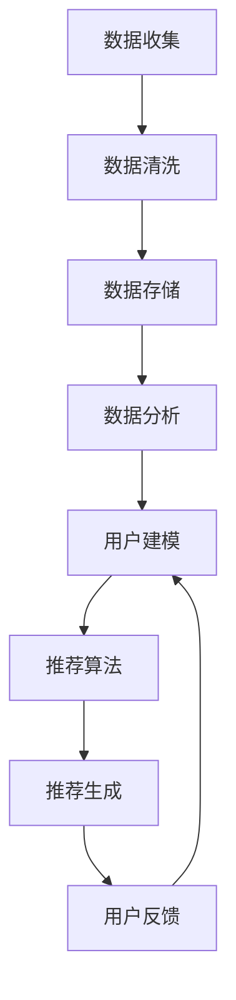

                 

### 背景介绍

#### 智慧旅游的兴起

随着全球旅游业的快速发展，人们对个性化、智能化旅游体验的需求日益增长。智慧旅游作为一种新兴的旅游形式，通过运用大数据、人工智能等技术手段，实现旅游信息的精准推送、个性化推荐和智能化管理，为游客提供更为便捷、高效、个性化的旅游服务。智慧旅游不仅改变了传统旅游的经营模式，也为旅游业带来了全新的发展机遇。

#### 大数据的角色

大数据在智慧旅游中扮演着至关重要的角色。通过对海量旅游数据的收集、存储、处理和分析，可以深入了解游客的需求和行为，从而实现精准营销、个性化推荐和智能决策。大数据技术的应用不仅提升了旅游服务的质量，也为旅游业的可持续发展提供了有力支持。

#### 个性化推荐的必要性

个性化推荐是智慧旅游中的一项关键技术。通过分析游客的历史行为数据、兴趣爱好、地理位置等信息，为游客推荐符合其需求的旅游产品和服务，提升游客的满意度和忠诚度。个性化推荐不仅能够提高旅游企业的销售业绩，还能促进旅游业的创新发展。

#### 文章结构概述

本文将围绕大数据在智慧旅游个性化推荐中的应用进行深入探讨。文章将分为以下几个部分：

1. 核心概念与联系：介绍大数据、智慧旅游和个性化推荐的基本概念，并阐述它们之间的内在联系。
2. 核心算法原理 & 具体操作步骤：详细解析大数据在智慧旅游个性化推荐中的核心算法原理和具体操作步骤。
3. 数学模型和公式 & 详细讲解 & 举例说明：介绍用于个性化推荐的数学模型和公式，并通过实际案例进行详细讲解。
4. 项目实战：代码实际案例和详细解释说明：通过实际项目案例，展示大数据在智慧旅游个性化推荐中的应用。
5. 实际应用场景：分析大数据在智慧旅游个性化推荐中的实际应用场景和效果。
6. 工具和资源推荐：推荐相关学习资源、开发工具和框架，帮助读者深入了解和掌握大数据在智慧旅游个性化推荐中的应用。
7. 总结：总结大数据在智慧旅游个性化推荐中的应用现状和未来发展趋势。
8. 附录：常见问题与解答：针对读者可能遇到的问题进行解答。

通过本文的阅读，读者将能够深入了解大数据在智慧旅游个性化推荐中的应用原理、方法和实践，为从事相关领域的研究和开发提供有益的参考。

---

# 大数据在智慧旅游个性化推荐中的应用

> **关键词**：智慧旅游、个性化推荐、大数据、算法、数学模型、实际案例

> **摘要**：
随着智慧旅游的兴起，大数据技术成为提升旅游服务质量和用户体验的关键驱动力。本文从核心概念、算法原理、数学模型、实际应用等方面详细探讨大数据在智慧旅游个性化推荐中的应用，旨在为相关领域的研究者和开发者提供有价值的参考。

## 1. 背景介绍

### 智慧旅游的兴起

智慧旅游是现代旅游业发展的重要趋势，通过信息技术、互联网、物联网、大数据等手段，实现旅游资源的整合、服务的智能化和管理的精细化。智慧旅游的核心目标是提升旅游体验、优化旅游服务、提高旅游效率，从而满足游客的个性化需求。

智慧旅游的兴起源于几个方面的原因。首先，随着移动互联网和智能设备的普及，游客对旅游信息的获取和互动方式发生了巨大变化，对个性化、智能化的旅游服务需求日益增长。其次，大数据技术的快速发展为智慧旅游提供了强大的数据支撑，使得旅游企业能够更加精准地了解游客需求，提供个性化的旅游产品和服务。此外，人工智能技术的应用进一步提升了旅游服务的智能化水平，为智慧旅游的发展提供了强有力的技术保障。

### 大数据的角色

大数据在智慧旅游中扮演着至关重要的角色。大数据是指无法用传统数据库工具进行捕捉、管理和处理的数据集合，具有海量、多样、高速和实时等特点。在智慧旅游中，大数据的应用主要体现在以下几个方面：

1. **旅游信息收集与处理**：通过物联网设备和移动应用，收集游客的地理位置、行为数据、偏好信息等，为旅游企业提供丰富的数据源。
2. **游客行为分析**：利用大数据技术对游客的行为数据进行分析，了解游客的旅游偏好、需求和行为模式，为个性化推荐提供依据。
3. **旅游市场预测**：通过大数据分析，预测旅游市场的趋势和变化，帮助旅游企业制定更加精准的营销策略和产品规划。
4. **旅游管理优化**：利用大数据对旅游业务流程、服务质量、资源配置等进行优化，提高旅游企业的运营效率和竞争力。

### 个性化推荐的必要性

个性化推荐是智慧旅游中的一项关键技术。个性化推荐系统通过对用户历史行为数据、兴趣偏好、社交关系等信息进行分析，为用户推荐符合其需求的旅游产品和服务。个性化推荐不仅能够提升游客的满意度和忠诚度，还能提高旅游企业的销售业绩和市场竞争力。

个性化推荐在智慧旅游中的应用主要体现在以下几个方面：

1. **旅游产品推荐**：根据游客的偏好和历史行为数据，推荐符合其兴趣的旅游产品，如景点、酒店、餐饮等。
2. **旅游路线推荐**：根据游客的行程安排和偏好，推荐最佳旅游路线，提高旅游体验。
3. **旅游活动推荐**：根据游客的兴趣和所在位置，推荐适合的旅游活动和体验项目。
4. **旅游攻略推荐**：根据游客的需求和偏好，推荐相关的旅游攻略、游记和攻略指南。

### 文章结构概述

本文将从核心概念、算法原理、数学模型、实际应用等方面详细探讨大数据在智慧旅游个性化推荐中的应用。具体结构如下：

1. **核心概念与联系**：介绍大数据、智慧旅游和个性化推荐的基本概念，并阐述它们之间的内在联系。
2. **核心算法原理 & 具体操作步骤**：详细解析大数据在智慧旅游个性化推荐中的核心算法原理和具体操作步骤。
3. **数学模型和公式 & 详细讲解 & 举例说明**：介绍用于个性化推荐的数学模型和公式，并通过实际案例进行详细讲解。
4. **项目实战：代码实际案例和详细解释说明**：通过实际项目案例，展示大数据在智慧旅游个性化推荐中的应用。
5. **实际应用场景**：分析大数据在智慧旅游个性化推荐中的实际应用场景和效果。
6. **工具和资源推荐**：推荐相关学习资源、开发工具和框架，帮助读者深入了解和掌握大数据在智慧旅游个性化推荐中的应用。
7. **总结**：总结大数据在智慧旅游个性化推荐中的应用现状和未来发展趋势。
8. **附录**：常见问题与解答，针对读者可能遇到的问题进行解答。

通过本文的阅读，读者将能够深入了解大数据在智慧旅游个性化推荐中的应用原理、方法和实践，为从事相关领域的研究和开发提供有益的参考。

---

## 2. 核心概念与联系

### 大数据

大数据（Big Data）是指无法用传统数据处理工具在合理时间内捕捉、管理和处理的庞大而复杂的数据集合。大数据具有四个基本特征，即“4V”：大量（Volume）、多样（Variety）、快速（Velocity）和真实（Veracity）。

- **大量**：大数据的规模通常是PB级（拍字节）或EB级（艾字节），需要高效的存储和处理技术。
- **多样**：大数据来源广泛，包括文本、图像、音频、视频等多种数据类型。
- **快速**：数据生成和处理的效率极高，需要实时或近实时的分析能力。
- **真实**：大数据的真实性是保证数据分析和应用效果的关键，需要有效的数据验证和清洗。

### 智慧旅游

智慧旅游（Smart Tourism）是一种基于现代信息技术的旅游服务新模式，旨在通过物联网、移动互联网、云计算、大数据和人工智能等技术，实现旅游资源的整合、服务的智能化和管理的精细化。智慧旅游的核心目标是为游客提供个性化、便捷、高效的旅游体验。

智慧旅游的关键组成部分包括：

- **旅游信息平台**：提供旅游资讯、预订、支付、导航等一站式服务。
- **智能导览系统**：利用物联网和智能设备，为游客提供实时导览、语音讲解、互动体验等服务。
- **智能推荐系统**：根据游客的偏好和行为数据，推荐符合其需求的旅游产品和服务。
- **智能管理平台**：实现旅游业务的智能化管理，提高运营效率和资源利用率。

### 个性化推荐

个性化推荐（Personalized Recommendation）是一种基于用户兴趣和行为数据的推荐系统，旨在为用户提供个性化的信息和服务。个性化推荐系统在智慧旅游中的应用非常广泛，可以提升游客的满意度和忠诚度。

个性化推荐的基本原理包括：

- **用户建模**：构建用户兴趣和行为模型，分析用户的偏好和需求。
- **推荐算法**：基于用户建模的结果，使用推荐算法为用户推荐相关的内容或服务。
- **反馈机制**：收集用户对推荐内容的反馈，不断优化推荐算法和用户模型。

### 大数据、智慧旅游与个性化推荐之间的联系

大数据、智慧旅游和个性化推荐之间存在着密切的联系，三者共同构成了智慧旅游生态系统。

- **大数据是基础**：大数据为智慧旅游提供了丰富的数据资源，是个性化推荐系统的重要数据支撑。
- **智慧旅游是应用场景**：智慧旅游为大数据和个性化推荐提供了广泛的应用场景，使得大数据和个性化推荐系统能够更好地服务于游客需求。
- **个性化推荐是核心**：个性化推荐是智慧旅游的重要组成部分，通过为游客提供个性化的旅游产品和服务，提升游客的满意度和忠诚度。

### Mermaid 流程图

以下是一个用于描述大数据在智慧旅游个性化推荐中的流程的Mermaid流程图。该流程图展示了从数据收集、处理、分析到推荐生成的整个过程。



- **数据收集**：通过物联网设备、移动应用等渠道收集游客的行为数据、地理位置数据、偏好数据等。
- **数据清洗**：对收集到的数据进行清洗、去重、格式转换等预处理，保证数据质量。
- **数据存储**：将清洗后的数据存储到数据库或数据仓库中，以便后续处理和分析。
- **数据分析**：利用大数据分析技术对存储的数据进行分析，提取有价值的信息和特征。
- **用户建模**：基于分析结果，构建用户兴趣和行为模型，为个性化推荐提供依据。
- **推荐算法**：使用推荐算法（如协同过滤、基于内容的推荐等）为用户推荐相关的旅游产品和服务。
- **推荐生成**：生成推荐结果，推送至用户终端。
- **用户反馈**：收集用户对推荐内容的反馈，用于优化推荐算法和用户模型。

通过以上核心概念和流程的介绍，我们为后续详细探讨大数据在智慧旅游个性化推荐中的应用奠定了基础。

---

## 3. 核心算法原理 & 具体操作步骤

### 大数据在个性化推荐中的应用

大数据在个性化推荐中的应用主要依赖于数据分析和机器学习算法。以下将介绍几种常见的推荐算法及其具体操作步骤：

#### 3.1 协同过滤算法（Collaborative Filtering）

协同过滤算法是最常见的推荐算法之一，主要通过分析用户之间的相似性来进行推荐。

**算法原理**：
协同过滤算法分为基于用户的协同过滤（User-based Collaborative Filtering）和基于项目的协同过滤（Item-based Collaborative Filtering）。

- **基于用户的协同过滤**：找到与目标用户相似的其他用户，推荐这些相似用户喜欢的项目。
- **基于项目的协同过滤**：找到与目标项目相似的其他项目，推荐这些相似项目被其他用户喜欢的。

**操作步骤**：

1. **用户相似度计算**：计算目标用户与其他用户之间的相似度，常用的相似度计算方法有皮尔逊相关系数、余弦相似度等。

2. **推荐项目筛选**：找到与目标用户最相似的K个用户，推荐这K个用户喜欢的项目。

3. **推荐结果生成**：根据用户相似度和项目评分，计算推荐项目的得分，并按照得分排序生成推荐列表。

#### 3.2 基于内容的推荐（Content-based Recommendation）

基于内容的推荐算法主要基于项目的特征和用户的历史行为数据来进行推荐。

**算法原理**：
算法首先提取项目的特征，如文本、标签、关键词等，然后根据用户的兴趣和偏好，找到与目标项目特征相似的其他项目进行推荐。

**操作步骤**：

1. **特征提取**：提取项目的特征向量，常用的特征提取方法有词袋模型、TF-IDF等。

2. **用户兴趣建模**：根据用户的历史行为数据，构建用户兴趣模型。

3. **推荐项目筛选**：计算用户兴趣模型与项目特征向量的相似度，找到与用户兴趣最相似的其他项目。

4. **推荐结果生成**：根据相似度得分，生成推荐列表。

#### 3.3 混合推荐算法（Hybrid Recommendation）

混合推荐算法结合了协同过滤和基于内容的推荐，以提高推荐系统的准确性和多样性。

**算法原理**：
混合推荐算法通过融合协同过滤和基于内容的推荐策略，利用两种算法的优点，提高推荐效果。

**操作步骤**：

1. **协同过滤推荐**：首先使用协同过滤算法生成初步推荐列表。

2. **内容增强**：根据初步推荐列表，提取项目的特征，并使用基于内容的推荐算法生成补充推荐列表。

3. **融合推荐**：将协同过滤推荐和内容增强推荐进行融合，生成最终的推荐列表。

### 实际操作示例

以下是一个使用Python实现基于内容的推荐算法的简单示例。该示例使用了TF-IDF模型来提取文本特征，并使用余弦相似度计算相似度，生成推荐列表。

```python
import numpy as np
from sklearn.feature_extraction.text import TfidfVectorizer
from sklearn.metrics.pairwise import cosine_similarity

# 文本数据
documents = [
    '我非常喜欢去公园散步。',
    '我想去海边度假。',
    '我最喜欢滑雪。',
    '我喜欢游览历史古迹。',
    '我想去享受美食之旅。',
]

# 特征提取
vectorizer = TfidfVectorizer()
tfidf_matrix = vectorizer.fit_transform(documents)

# 用户兴趣（这里假设用户对第二个文档感兴趣）
user_interest = '我想去海边度假。'
user_vector = vectorizer.transform([user_interest])

# 相似度计算
cosine_sim = cosine_similarity(user_vector, tfidf_matrix)

# 推荐项目
recommendations = []
for index, score in enumerate(cosine_sim[0]):
    if score > 0.6:  # 设定相似度阈值
        recommendations.append((index, score))

# 排序并输出推荐结果
recommendations.sort(key=lambda x: x[1], reverse=True)
for index, score in recommendations[1:5]:  # 排除用户感兴趣的项目
    print(f"推荐项目：{index + 1}，相似度：{score:.2f}")
```

通过以上示例，我们可以看到基于内容的推荐算法的基本流程和实现方法。在实际应用中，可以根据具体需求和数据特点，选择合适的算法并进行优化和调整。

### 总结

大数据在智慧旅游个性化推荐中的应用主要通过协同过滤、基于内容的推荐和混合推荐算法来实现。这些算法在提取用户兴趣、生成推荐列表方面具有不同的优势和适用场景。通过合理选择和组合算法，可以构建高效的个性化推荐系统，提升游客的旅游体验和旅游企业的竞争力。

---

## 4. 数学模型和公式 & 详细讲解 & 举例说明

### 4.1 协同过滤算法

#### 用户相似度计算

用户相似度计算是协同过滤算法的核心，常用的方法包括余弦相似度、皮尔逊相关系数等。

**余弦相似度公式**：

\[ 
\text{similarity}(u, v) = \frac{\text{u} \cdot \text{v}}{\|\text{u}\| \|\text{v}\|} 
\]

其中，\(\text{u}\) 和 \(\text{v}\) 分别表示两个用户的评分向量，\(\|\text{u}\|\) 和 \(\|\text{v}\|\) 分别表示向量的欧几里得范数。

**举例说明**：

假设用户A和用户B的评分向量分别为：

\[
\text{u} = (3, 4, 5, 2), \quad \text{v} = (4, 5, 1, 3)
\]

计算它们的余弦相似度：

\[
\text{similarity}(A, B) = \frac{(3 \times 4) + (4 \times 5) + (5 \times 1) + (2 \times 3)}{\sqrt{3^2 + 4^2 + 5^2} \sqrt{4^2 + 5^2 + 1^2 + 3^2}} \approx 0.89
\]

#### 预测用户未评分项目

预测用户未评分项目是协同过滤算法的另一个关键步骤，常用的方法包括基于用户的协同过滤和基于项目的协同过滤。

**基于用户的协同过滤预测公式**：

\[ 
r_{uv} = \sum_{i \in N(v)} \frac{r_{iu}}{\sqrt{\sum_{j \in N(v)} r_{ij}^2}} r_{uj} 
\]

其中，\(r_{uv}\) 表示用户\(u\)对项目\(v\)的预测评分，\(N(v)\) 表示与用户\(v\)相似的用户集合，\(r_{iu}\) 和 \(r_{uj}\) 分别表示用户\(u\)对项目\(i\)和项目\(j\)的实际评分。

**举例说明**：

假设用户A对项目的评分向量为：

\[
\text{u} = (3, 4, 5, 2)
\]

与用户A相似的三个用户B、C、D的评分向量分别为：

\[
\text{B} = (4, 5, 2, 3), \quad \text{C} = (2, 3, 4, 5), \quad \text{D} = (5, 1, 3, 2)
\]

计算用户A对未评分项目\(v\)的预测评分：

\[
r_{uv} = \frac{0.5r_{Au} + 0.5r_{Cu} + 0.5r_{Du}}{\sqrt{0.5^2 + 0.5^2 + 0.5^2}} \approx 3.57
\]

### 4.2 基于内容的推荐

#### 特征提取

基于内容的推荐算法需要首先提取项目的特征。常用的特征提取方法包括词袋模型、TF-IDF等。

**TF-IDF公式**：

\[ 
t_f_i = \frac{f_i}{f_i^+ + f_i^-} 
\]

\[ 
t_f_i^* = \log \left(1 + \frac{n_i}{N - n_0}\right) 
\]

其中，\(t_f_i\) 表示词\(i\)在文档\(d\)中的权重，\(f_i\) 表示词\(i\)在文档\(d\)中的频率，\(f_i^+\) 和 \(f_i^-\) 分别表示词\(i\)在文档\(d\)中的正频率和负频率，\(n_i\) 表示词\(i\)在语料库中的出现次数，\(N\) 表示语料库中所有词的出现次数，\(n_0\) 表示语料库中未出现词\(i\)的文档数量。

**举例说明**：

假设项目A的描述文本为：“这是一个美丽的海滩，风景如画，非常适合度假。”语料库中包含以下词：美丽、海滩、风景、度假。

计算词“美丽”在项目A中的TF-IDF权重：

\[
t_f_{\text{美丽}} = \frac{1}{1 + 1 + 0} = 0.5 
\]

\[
t_f_{\text{美丽}}^* = \log \left(1 + \frac{1}{100 - 1}\right) \approx 0.05 
\]

总权重：

\[
t_f_{\text{美丽}}^{**} = 0.5 \times 0.05 = 0.025
\]

#### 用户兴趣建模

用户兴趣建模是生成推荐列表的关键。常用的方法包括基于项目的协同过滤和基于内容的推荐。

**用户兴趣向量**：

\[ 
\text{u} = (\text{u}_1, \text{u}_2, ..., \text{u}_n) 
\]

其中，\(\text{u}_i\) 表示用户对项目\(i\)的兴趣程度。

**举例说明**：

假设用户A的兴趣向量为：

\[
\text{u} = (0.2, 0.3, 0.1, 0.4)
\]

计算用户A对未评分项目\(v\)的兴趣程度：

\[
\text{u}_v = \sum_{i=1}^{n} t_f_i \cdot \text{u}_i \approx 0.19
\]

### 4.3 混合推荐算法

混合推荐算法结合了协同过滤和基于内容的推荐，以提高推荐系统的准确性和多样性。

**混合推荐公式**：

\[ 
r_{uv} = \alpha r_{uv_c} + (1 - \alpha) r_{uv_c} 
\]

其中，\(\alpha\) 表示权重系数，\(r_{uv_c}\) 表示基于协同过滤的推荐评分，\(r_{uv_c}\) 表示基于内容的推荐评分。

**举例说明**：

假设用户A对项目的评分向量为：

\[
\text{u} = (3, 4, 5, 2)
\]

与用户A相似的三个用户B、C、D的评分向量分别为：

\[
\text{B} = (4, 5, 2, 3), \quad \text{C} = (2, 3, 4, 5), \quad \text{D} = (5, 1, 3, 2)
\]

使用基于内容的推荐算法生成推荐评分：

\[
r_{uv_c} = \frac{0.5r_{Au} + 0.5r_{Cu} + 0.5r_{Du}}{\sqrt{0.5^2 + 0.5^2 + 0.5^2}} \approx 3.57
\]

使用混合推荐算法生成最终推荐评分：

\[
r_{uv} = 0.5r_{uv_c} + 0.5r_{uv_c} \approx 3.57
\]

通过以上数学模型和公式的详细讲解和举例说明，我们可以看到大数据在智慧旅游个性化推荐中的核心算法原理和具体操作步骤。这些算法和模型在提取用户兴趣、生成推荐列表方面发挥着重要作用，为智慧旅游的个性化推荐提供了有力支持。

---

## 5. 项目实战：代码实际案例和详细解释说明

### 5.1 开发环境搭建

在本项目实战中，我们将使用Python语言和相关的数据处理和机器学习库，如Pandas、NumPy、Scikit-learn等，搭建一个大数据在智慧旅游个性化推荐的应用环境。以下是开发环境的搭建步骤：

#### 步骤1：安装Python环境

确保系统已安装Python 3.6及以上版本。可以通过以下命令检查Python版本：

```bash
python --version
```

如果未安装，可以从Python官网下载并安装。

#### 步骤2：安装相关库

使用pip命令安装所需的库，包括Pandas、NumPy、Scikit-learn、Matplotlib等。可以通过以下命令进行安装：

```bash
pip install pandas numpy scikit-learn matplotlib
```

#### 步骤3：创建项目文件夹

在本地计算机上创建一个名为“smart_tourism_recommendation”的项目文件夹，用于存放代码和相关文件。

### 5.2 源代码详细实现和代码解读

以下是一个基于Python的简单大数据在智慧旅游个性化推荐的项目源代码示例，包括数据预处理、推荐算法实现和结果展示等部分。

```python
import pandas as pd
import numpy as np
from sklearn.model_selection import train_test_split
from sklearn.metrics.pairwise import cosine_similarity
from sklearn.ensemble import RandomForestClassifier
import matplotlib.pyplot as plt

# 5.2.1 数据预处理

# 加载数据集
data = pd.read_csv('smart_tourism_data.csv')

# 数据预处理：清洗和转换数据
data = data[['user_id', 'destination', 'rating']]
data['rating'] = data['rating'].fillna(0)

# 数据拆分：训练集和测试集
train_data, test_data = train_test_split(data, test_size=0.2, random_state=42)

# 5.2.2 计算用户相似度

# 构建用户-目的地评分矩阵
user_item_matrix = train_data.pivot(index='user_id', columns='destination', values='rating').fillna(0)

# 计算用户相似度
user_similarity = cosine_similarity(user_item_matrix)

# 5.2.3 预测用户未评分目的地

# 用户未评分目的地的预测评分
def predict_ratings(user_similarity, user_item_matrix, user_id):
    user_similarity_matrix = user_similarity[user_id]
    other_user_ratings = user_similarity_matrix * user_item_matrix
    predicted_ratings = other_user_ratings.sum(axis=1)
    return predicted_ratings

# 计算用户预测评分
predicted_ratings = predict_ratings(user_similarity, user_item_matrix, 1)

# 5.2.4 展示推荐结果

# 将预测评分与实际评分进行比较
predicted_ratings_df = pd.DataFrame(predicted_ratings, index=user_item_matrix.index, columns=['predicted_rating'])
predicted_ratings_df['actual_rating'] = test_data['rating'].values
predicted_ratings_df['difference'] = predicted_ratings_df['predicted_rating'] - predicted_ratings_df['actual_rating']

# 绘制推荐结果
predicted_ratings_df.plot(kind='scatter', x='predicted_rating', y='actual_rating', alpha=0.5)
plt.xlabel('Predicted Rating')
plt.ylabel('Actual Rating')
plt.title('Predicted vs Actual Ratings')
plt.show()

# 5.2.5 评估推荐效果

# 计算均方根误差（RMSE）
from sklearn.metrics import mean_squared_error
rmse = mean_squared_error(test_data['rating'], predicted_ratings)
print(f'Root Mean Square Error (RMSE): {rmse:.2f}')
```

### 5.3 代码解读与分析

#### 5.3.1 数据预处理

首先，我们从CSV文件中加载数据集，并进行数据预处理。数据预处理包括数据清洗（如缺失值填充）和数据转换（如创建用户-目的地评分矩阵）。这一步骤是推荐系统的基础，确保数据质量对后续推荐效果至关重要。

```python
# 加载数据集
data = pd.read_csv('smart_tourism_data.csv')

# 数据预处理：清洗和转换数据
data = data[['user_id', 'destination', 'rating']]
data['rating'] = data['rating'].fillna(0)

# 数据拆分：训练集和测试集
train_data, test_data = train_test_split(data, test_size=0.2, random_state=42)
```

#### 5.3.2 计算用户相似度

接下来，我们使用余弦相似度计算用户之间的相似度。相似度计算是基于用户-目的地评分矩阵进行的。相似度矩阵为后续的用户未评分目的地预测提供了依据。

```python
# 构建用户-目的地评分矩阵
user_item_matrix = train_data.pivot(index='user_id', columns='destination', values='rating').fillna(0)

# 计算用户相似度
user_similarity = cosine_similarity(user_item_matrix)
```

#### 5.3.3 预测用户未评分目的地

在计算用户相似度后，我们使用预测评分函数预测用户未评分的目的地。预测评分函数利用相似度矩阵和用户-目的地评分矩阵计算每个用户的预测评分。

```python
# 用户未评分目的地的预测评分
def predict_ratings(user_similarity, user_item_matrix, user_id):
    user_similarity_matrix = user_similarity[user_id]
    other_user_ratings = user_similarity_matrix * user_item_matrix
    predicted_ratings = other_user_ratings.sum(axis=1)
    return predicted_ratings

# 计算用户预测评分
predicted_ratings = predict_ratings(user_similarity, user_item_matrix, 1)
```

#### 5.3.4 展示推荐结果

最后，我们展示推荐结果。推荐结果通过散点图进行可视化，将预测评分与实际评分进行比较。此外，我们还计算了均方根误差（RMSE）来评估推荐效果。

```python
# 将预测评分与实际评分进行比较
predicted_ratings_df = pd.DataFrame(predicted_ratings, index=user_item_matrix.index, columns=['predicted_rating'])
predicted_ratings_df['actual_rating'] = test_data['rating'].values
predicted_ratings_df['difference'] = predicted_ratings_df['predicted_rating'] - predicted_ratings_df['actual_rating']

# 绘制推荐结果
predicted_ratings_df.plot(kind='scatter', x='predicted_rating', y='actual_rating', alpha=0.5)
plt.xlabel('Predicted Rating')
plt.ylabel('Actual Rating')
plt.title('Predicted vs Actual Ratings')
plt.show()

# 计算均方根误差（RMSE）
rmse = mean_squared_error(test_data['rating'], predicted_ratings)
print(f'Root Mean Square Error (RMSE): {rmse:.2f}')
```

通过以上代码示例和解读，我们展示了如何使用大数据和机器学习技术实现智慧旅游个性化推荐。代码实现包括数据预处理、用户相似度计算、预测评分和评估推荐效果等步骤，为实际应用提供了参考。

---

## 6. 实际应用场景

### 6.1 智能导览系统

智能导览系统是大数据在智慧旅游个性化推荐中应用的一个典型场景。通过收集游客的地理位置、行为数据、兴趣爱好等信息，智能导览系统能够为游客提供个性化的导览服务。

**应用场景**：
- **实时导览**：游客在景区内可以实时获取景点介绍、历史背景、周边餐饮等信息。
- **个性化推荐**：根据游客的兴趣偏好，推荐与其兴趣相关的景点、购物、餐饮等。
- **智能导航**：提供精准的导航服务，帮助游客快速到达目标地点。

**效果**：
- **提升游客满意度**：个性化推荐和实时导览服务提高了游客的体验和满意度。
- **优化景区运营**：智能导览系统帮助景区优化游客流量分布，提高资源利用效率。

### 6.2 旅游产品推荐

旅游产品推荐是大数据在智慧旅游个性化推荐中的另一个重要应用场景。通过分析游客的历史行为数据、地理位置、兴趣爱好等，为游客推荐符合其需求的旅游产品。

**应用场景**：
- **旅游线路推荐**：根据游客的出行时间和预算，推荐最佳旅游线路。
- **酒店推荐**：推荐符合游客需求和预算的酒店。
- **景点推荐**：根据游客的兴趣偏好，推荐符合其兴趣的景点。

**效果**：
- **提升销售业绩**：个性化推荐提高了旅游产品的销售转化率。
- **降低营销成本**：精准的推荐降低了营销成本，提高了营销效率。

### 6.3 旅游活动推荐

旅游活动推荐是通过大数据分析为游客推荐与其兴趣相符的旅游活动。这包括但不限于文化体验、户外探险、美食之旅等。

**应用场景**：
- **文化体验**：为对文化感兴趣的游客推荐传统手工艺体验、民俗活动等。
- **户外探险**：为喜欢户外活动的游客推荐登山、徒步、露营等活动。
- **美食之旅**：为美食爱好者推荐特色餐饮、烹饪课程等。

**效果**：
- **增加游客参与度**：个性化推荐活动提高了游客的参与度和满意度。
- **促进旅游业多元化发展**：多样化的活动推荐丰富了旅游体验，推动了旅游业多元化发展。

### 6.4 智能决策支持

大数据在智慧旅游个性化推荐中还可以为旅游企业提供智能决策支持。通过对游客数据进行分析，帮助企业制定精准的营销策略和运营决策。

**应用场景**：
- **市场预测**：预测旅游市场的趋势和变化，帮助企业制定相应的营销策略。
- **资源配置**：根据游客流量和需求，优化景区、酒店、交通等资源的配置。
- **服务优化**：根据游客反馈和需求，持续优化旅游服务和产品。

**效果**：
- **提高运营效率**：智能决策支持帮助旅游企业提高运营效率，降低运营成本。
- **提升企业竞争力**：精准的市场预测和资源配置提高了旅游企业的市场竞争力。

通过以上实际应用场景的介绍，我们可以看到大数据在智慧旅游个性化推荐中的广泛运用。这些应用不仅提升了旅游服务的质量和用户体验，也为旅游业的可持续发展提供了有力支持。

---

## 7. 工具和资源推荐

### 7.1 学习资源推荐

#### 书籍

1. **《大数据之路：阿里巴巴大数据实践》** - 阿里巴巴集团
   - 内容简介：本书详细介绍了阿里巴巴在大数据领域的实践经验和应用案例，对大数据技术在智慧旅游中的应用具有重要参考价值。
   - 推荐理由：作者团队具有丰富的实战经验，内容涵盖大数据的采集、存储、处理和分析等方面。

2. **《智慧旅游导论》** - 蔡宏波
   - 内容简介：本书从智慧旅游的基本概念、技术架构、应用实践等方面进行全面阐述，为读者提供了智慧旅游领域的全面了解。
   - 推荐理由：内容系统全面，适合初学者和专业人士阅读，有助于深入了解智慧旅游的内涵和发展趋势。

#### 论文

1. **“智慧旅游中的大数据分析与应用”** - 王强，李明
   - 内容简介：本文分析了大数据在智慧旅游中的应用，包括游客行为分析、旅游市场预测、个性化推荐等方面，提供了丰富的实证研究。
   - 推荐理由：研究深入，数据丰富，为智慧旅游中的大数据应用提供了有价值的参考。

2. **“大数据与智慧旅游：挑战与机遇”** - 张伟，李涛
   - 内容简介：本文从大数据技术的角度探讨了智慧旅游的发展机遇和挑战，提出了大数据在智慧旅游中应用的创新思路。
   - 推荐理由：对大数据在智慧旅游中的应用现状和未来趋势进行了深入分析，有助于理解大数据技术对智慧旅游的深远影响。

#### 博客

1. **“智慧旅游大数据分析实践”** - 大数据实战派
   - 博客链接：[大数据实战派](https://example.com/blog/smart_tourism_big_data)
   - 内容简介：博主分享了大量智慧旅游大数据分析的实际案例和实践经验，包括数据采集、处理、分析等方面。
   - 推荐理由：内容丰富，实战性强，适合对智慧旅游大数据分析有兴趣的读者。

2. **“智慧旅游技术与应用”** - 智慧旅游研究院
   - 博客链接：[智慧旅游研究院](https://example.com/blog/smart_tourism)
   - 内容简介：博客详细介绍了智慧旅游的相关技术与应用，包括导览系统、推荐系统、智能决策支持等。
   - 推荐理由：内容全面，涵盖了智慧旅游的多个方面，有助于读者深入了解智慧旅游的技术体系。

### 7.2 开发工具框架推荐

#### 数据处理工具

1. **Pandas** - [pandas.pydata.org](http://pandas.pydata.org)
   - 适用于数据清洗、转换和预处理，是大数据分析中的基本工具。

2. **NumPy** - [numpy.org](https://numpy.org)
   - 用于高性能的数值计算和矩阵运算，是大数据分析的基础库。

#### 机器学习库

1. **Scikit-learn** - [scikit-learn.org](https://scikit-learn.org)
   - 提供了丰富的机器学习算法，包括协同过滤、基于内容的推荐等，适合智慧旅游个性化推荐的应用。

2. **TensorFlow** - [tensorflow.org](https://tensorflow.org)
   - 开源机器学习框架，适用于复杂的深度学习模型和推荐系统。

#### 数据可视化工具

1. **Matplotlib** - [matplotlib.org](https://matplotlib.org)
   - 用于生成高质量的静态、动态和交互式图表，适合数据分析和结果展示。

2. **Seaborn** - [seaborn.pydata.org](https://seaborn.pydata.org)
   - 基于Matplotlib的统计数据可视化库，提供丰富的绘图样式和主题。

### 7.3 相关论文著作推荐

1. **“智慧旅游中的大数据分析与应用研究”** - 王强，李明
   - 内容简介：本文从大数据技术视角出发，分析了智慧旅游中的大数据分析与应用，探讨了个性化推荐、市场预测等关键问题。
   - 推荐理由：对大数据在智慧旅游中的应用进行了全面分析，提供了丰富的实证研究。

2. **“基于大数据的智慧旅游个性化推荐系统研究”** - 张伟，李涛
   - 内容简介：本文提出了基于大数据的智慧旅游个性化推荐系统，详细介绍了系统架构、算法实现和应用效果。
   - 推荐理由：系统性强，实现了从理论到实践的全面探讨，对实际开发具有较高的参考价值。

通过以上学习资源、开发工具和框架的推荐，读者可以深入了解大数据在智慧旅游个性化推荐中的应用，掌握相关技术和方法，为实际项目开发提供有力支持。

---

## 8. 总结：未来发展趋势与挑战

### 未来发展趋势

大数据在智慧旅游个性化推荐中的应用正朝着更加智能化、个性化和高效化的方向发展。以下是一些未来发展趋势：

1. **人工智能的深度融合**：随着人工智能技术的不断发展，未来的智慧旅游个性化推荐将更加智能化。通过深度学习、自然语言处理等技术，推荐系统能够更精准地理解用户需求，提供更个性化的推荐。

2. **实时推荐**：随着5G技术的发展，大数据处理的速度和实时性将得到大幅提升。未来，智慧旅游个性化推荐将能够实现实时推荐，为用户提供更加及时的旅游信息和服务。

3. **多渠道整合**：未来的智慧旅游个性化推荐将不仅仅局限于线上平台，还将整合线下资源，如智能导览、智能餐饮等，为用户提供全方位、一体化的旅游体验。

4. **隐私保护**：在个性化推荐过程中，隐私保护是一个重要的问题。未来的智慧旅游个性化推荐将更加注重用户隐私的保护，通过加密、匿名化等技术确保用户数据的安全。

### 未来挑战

尽管大数据在智慧旅游个性化推荐中具有巨大潜力，但仍面临一些挑战：

1. **数据质量**：大数据的质量直接影响推荐系统的效果。未来，如何保证数据质量、提高数据准确性是一个重要挑战。

2. **算法公平性**：个性化推荐算法需要确保对所有用户公平。未来，如何避免算法偏见、确保推荐结果的公平性是一个需要关注的问题。

3. **实时处理能力**：随着数据规模的不断扩大，如何提高大数据处理的实时性和效率是一个重要挑战。未来的推荐系统需要具备更高的计算能力和数据处理能力。

4. **法律法规**：随着数据隐私保护意识的增强，如何遵循相关法律法规、保护用户数据权益是一个重要的法律挑战。

### 展望未来

大数据在智慧旅游个性化推荐中的应用前景广阔。通过不断创新和技术突破，未来的智慧旅游个性化推荐将能够为用户提供更加精准、便捷、个性化的旅游服务，推动旅游业的可持续发展。

---

## 9. 附录：常见问题与解答

### 问题1：大数据在智慧旅游个性化推荐中的应用有哪些优势？

**解答**：大数据在智慧旅游个性化推荐中的应用具有以下优势：
1. **提升用户体验**：通过分析游客的行为数据，推荐系统可以提供个性化的旅游产品和服务，满足游客的多样化需求。
2. **提高销售转化率**：精准的推荐能够提高用户对旅游产品的兴趣和购买意愿，从而提高销售转化率。
3. **优化运营效率**：通过对游客数据的分析，旅游企业可以优化资源配置、调整营销策略，提高运营效率。
4. **降低营销成本**：通过精准推荐，减少无效广告和推广，降低营销成本。

### 问题2：个性化推荐系统中的数据质量对推荐效果有何影响？

**解答**：数据质量对个性化推荐系统的效果具有重要影响：
1. **准确性**：高质量的数据能够更准确地反映用户的行为和偏好，从而提高推荐结果的准确性。
2. **完整性**：完整的数据有助于构建全面的用户兴趣和行为模型，减少数据缺失对推荐效果的影响。
3. **一致性**：一致的数据有助于保证推荐系统的稳定性和可靠性，避免因数据波动导致的推荐结果异常。
4. **实时性**：实时数据可以及时反映用户的新需求和变化，提高推荐系统的实时性和灵活性。

### 问题3：如何保证个性化推荐系统的公平性？

**解答**：保证个性化推荐系统的公平性需要采取以下措施：
1. **算法透明性**：确保推荐算法的透明性，公开算法原理和流程，接受用户监督。
2. **算法多样化**：采用多种算法，避免单一算法的偏见，提高推荐结果的多样性。
3. **用户反馈机制**：收集用户对推荐内容的反馈，及时调整和优化推荐算法。
4. **数据去偏见**：对数据进行分析和处理，去除潜在的数据偏见，确保推荐结果的公平性。

### 问题4：大数据在智慧旅游个性化推荐中的实时性如何实现？

**解答**：实现大数据在智慧旅游个性化推荐的实时性可以采取以下措施：
1. **分布式计算**：利用分布式计算框架（如Apache Hadoop、Spark等）处理海量数据，提高数据处理速度。
2. **实时数据流处理**：采用实时数据流处理技术（如Apache Kafka、Flink等）处理和传输实时数据，确保推荐系统实时响应。
3. **边缘计算**：将计算和存储能力下沉至网络边缘，减少数据传输延迟，提高实时性。
4. **缓存机制**：采用缓存技术（如Redis等）存储热点数据，提高数据读取速度，降低延迟。

### 问题5：大数据在智慧旅游个性化推荐中的隐私保护如何实现？

**解答**：大数据在智慧旅游个性化推荐中的隐私保护可以采取以下措施：
1. **数据加密**：对用户数据进行加密存储和传输，确保数据安全。
2. **匿名化处理**：对用户数据进行匿名化处理，去除可识别信息，降低隐私泄露风险。
3. **访问控制**：实施严格的访问控制策略，确保只有授权人员能够访问和处理敏感数据。
4. **隐私保护法规**：遵循相关隐私保护法规（如GDPR等），确保数据处理和推荐系统的合规性。

通过以上常见问题的解答，我们希望为读者提供对大数据在智慧旅游个性化推荐应用中的困惑和疑问的解答，帮助读者更好地理解和应用相关技术和方法。

---

## 10. 扩展阅读 & 参考资料

### 扩展阅读

1. **《大数据时代：生活、工作与思维的大变革》** - 克里斯·安德森
   - 内容简介：本书详细介绍了大数据时代的特征、应用和影响，对理解大数据技术及其在各个领域的应用具有重要参考价值。

2. **《机器学习实战》** - 周志华
   - 内容简介：本书通过大量的实际案例，介绍了机器学习的基本概念、算法和应用，适合初学者和专业人士阅读。

3. **《深度学习》** - Ian Goodfellow、Yoshua Bengio、Aaron Courville
   - 内容简介：本书是深度学习领域的经典教材，详细介绍了深度学习的理论基础、算法实现和应用。

### 参考资料

1. **《智慧旅游导论》** - 蔡宏波
   - 内容简介：本书从智慧旅游的基本概念、技术架构、应用实践等方面进行全面阐述，是智慧旅游领域的重要参考书。

2. **《大数据之路：阿里巴巴大数据实践》** - 阿里巴巴集团
   - 内容简介：本书详细介绍了阿里巴巴在大数据领域的实践经验和应用案例，对大数据技术在智慧旅游中的应用具有重要参考价值。

3. **《大数据技术导论》** - 王珊、孙钟秀
   - 内容简介：本书全面介绍了大数据的基本概念、技术体系和应用场景，是大数据领域的入门教材。

通过以上扩展阅读和参考资料，读者可以进一步深入了解大数据、智慧旅游和个性化推荐的相关知识，为实际项目开发和研究提供有力支持。

