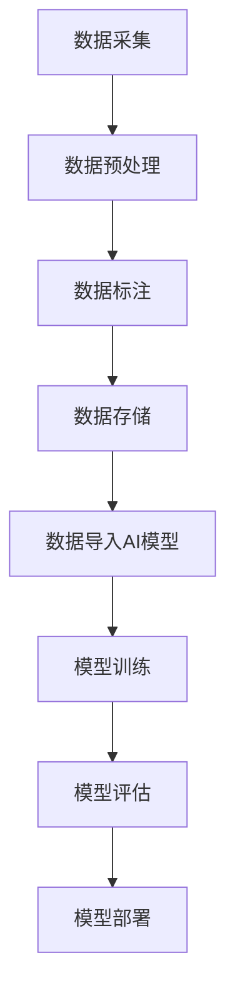

                 

### 大数据对AI学习的影响

> **关键词**: 大数据，AI学习，机器学习，深度学习，数据增强，模型优化

> **摘要**: 本文章深入探讨大数据对人工智能学习，特别是机器学习和深度学习的影响。文章首先介绍了大数据的定义及其在人工智能中的重要性，然后详细分析了大数据对AI学习的各个方面，包括数据质量、数据多样性、计算资源需求等的影响。接着，文章探讨了如何利用大数据来优化AI模型的训练和性能。最后，文章总结了大数据在AI学习中的优势和挑战，并对未来发展趋势进行了展望。

在当今信息爆炸的时代，数据已经成为了新的石油，大数据（Big Data）更是成为了人工智能（AI）领域中不可或缺的资源。大数据不仅规模庞大，还具备高速增长和多样性等特点，这些特性使得大数据在AI学习中扮演着至关重要的角色。本文将逐步分析大数据对AI学习的影响，帮助读者更好地理解大数据与AI之间的紧密联系。

### 背景介绍

#### 大数据的定义

大数据通常指的是那些无法使用常规数据处理工具在合理时间内进行捕获、管理和处理的大量数据。这些数据集通常具有四个V特性：Volume（数据量巨大）、Velocity（数据生成速度快）、Variety（数据类型多样）、Veracity（数据真实性和可靠性高）。

#### 人工智能与大数据的关系

人工智能（AI）是指由计算机系统实现的智能行为，能够模拟、延伸、甚至超越人类智能。机器学习（Machine Learning，ML）和深度学习（Deep Learning，DL）是AI的两个重要分支。ML和DL算法依赖于数据来学习模式和规律，从而进行预测和决策。

在AI领域，数据的质量和数量直接决定了模型的性能和效果。大数据提供了丰富的数据资源，使得AI模型能够从大量的数据中学习到更加精准的规律和模式，从而提高了AI的预测能力和决策质量。

### 核心概念与联系

#### 大数据的V特性与AI学习

1. **数据量（Volume）**: 大数据提供了大量的样本，使得AI模型能够通过大量的数据来学习，从而提高模型的鲁棒性和准确性。
2. **数据生成速度（Velocity）**: 高速生成的数据使得AI模型能够实时更新和适应变化，这对于动态环境中的决策和预测尤为重要。
3. **数据类型（Variety）**: 多样化的数据类型（结构化、半结构化和非结构化数据）使得AI模型能够处理更加复杂和多样化的任务。
4. **数据真实性（Veracity）**: 数据的真实性和可靠性直接影响到AI模型的决策质量，高质量的数据有助于训练出更加可靠的模型。

#### Mermaid流程图（数据输入到AI模型的过程）



### 核心算法原理 & 具体操作步骤

#### 数据预处理

1. **数据清洗**: 去除重复数据、缺失值填充、异常值处理等。
2. **数据转换**: 将数据从一种格式转换为另一种格式，例如将文本数据转换为数值数据。
3. **特征工程**: 提取有用的特征，以增强模型的学习能力。

#### 模型训练

1. **选择合适的模型**: 根据任务需求选择合适的机器学习或深度学习模型。
2. **模型参数调优**: 使用大数据集进行模型参数调优，以优化模型的性能。
3. **交叉验证**: 使用验证集对模型进行评估，以避免过拟合。

#### 模型评估

1. **准确率（Accuracy）**: 模型预测正确的样本数占总样本数的比例。
2. **精确率（Precision）**: 模型预测为正类的样本中，真正类样本的比例。
3. **召回率（Recall）**: 模型预测为正类的样本中，所有正类样本的比例。

### 数学模型和公式 & 详细讲解 & 举例说明

#### 模型损失函数（Loss Function）

假设我们使用的是一个深度神经网络模型，其损失函数可以表示为：

$$
Loss = -\sum_{i=1}^{n} y_i \cdot \log(p_i)
$$

其中，$y_i$ 是第 $i$ 个样本的真实标签，$p_i$ 是模型预测的概率。

#### 举例说明

假设我们有一个二分类问题，需要预测一个邮件是否为垃圾邮件。我们使用一个深度神经网络模型，其输出层有两个神经元，分别表示邮件为正常邮件和垃圾邮件的概率。假设我们有一个样本，其真实标签为“垃圾邮件”，模型预测的概率为 $p = 0.8$。根据上述损失函数，我们可以计算出该样本的损失：

$$
Loss = -1 \cdot \log(0.8) \approx 0.223
$$

损失函数的值越小，表示模型预测越准确。

### 项目实战：代码实际案例和详细解释说明

#### 开发环境搭建

1. 安装Python和相关的机器学习库，如TensorFlow和Keras。
2. 准备一个数据集，用于训练和评估模型。

#### 源代码详细实现和代码解读

```python
import numpy as np
import tensorflow as tf
from tensorflow.keras.models import Sequential
from tensorflow.keras.layers import Dense
from tensorflow.keras.optimizers import Adam

# 数据预处理
# 假设我们已经有一个数据集X和标签y
X_train, y_train = preprocess_data()

# 构建模型
model = Sequential()
model.add(Dense(64, input_dim=X_train.shape[1], activation='relu'))
model.add(Dense(1, activation='sigmoid'))

# 编译模型
model.compile(loss='binary_crossentropy', optimizer=Adam(), metrics=['accuracy'])

# 训练模型
model.fit(X_train, y_train, epochs=10, batch_size=32)

# 评估模型
loss, accuracy = model.evaluate(X_train, y_train)
print(f'Loss: {loss}, Accuracy: {accuracy}')
```

#### 代码解读与分析

- **数据预处理**: 将原始数据集进行清洗、转换和归一化处理，以适应深度学习模型的要求。
- **模型构建**: 使用Sequential模型构建一个简单的深度神经网络，包含一个隐藏层和输出层。
- **模型编译**: 指定损失函数、优化器和评估指标。
- **模型训练**: 使用训练数据集对模型进行训练，指定训练轮数和批量大小。
- **模型评估**: 使用训练数据集对模型进行评估，输出损失和准确率。

### 实际应用场景

大数据在AI学习中的应用场景广泛，以下是一些典型的应用：

1. **金融领域**: 使用大数据进行风险管理、信用评分和投资决策。
2. **医疗领域**: 使用大数据进行疾病诊断、个性化治疗和药物研发。
3. **交通领域**: 使用大数据进行交通流量预测、交通管理和自动驾驶。
4. **零售领域**: 使用大数据进行需求预测、库存管理和个性化推荐。

### 工具和资源推荐

#### 学习资源推荐

- **书籍**:
  - 《深度学习》（Goodfellow, Bengio, Courville）
  - 《Python机器学习》（Cohen, Campolattaro）
  - 《大数据之路：阿里巴巴大数据实践》（涂子沛）

- **论文**:
  - "Deep Learning for Speech Recognition" (DNN-based)
  - "The Unreasonable Effectiveness of Data" (Ian Goodfellow)

- **博客**:
  - [TensorFlow官网博客](https://tensorflow.org/blog/)
  - [Kaggle博客](https://www.kaggle.com/forums/home)

- **网站**:
  - [机器学习社区](https://www.ml-community.org/)
  - [AI学习资源](https://www.ai Playground.com)

#### 开发工具框架推荐

- **深度学习框架**:
  - TensorFlow
  - PyTorch
  - Keras

- **数据预处理工具**:
  - Pandas
  - NumPy
  - Scikit-learn

- **版本控制系统**:
  - Git

#### 相关论文著作推荐

- **《深度学习》（Goodfellow, Bengio, Courville）**: 该书是深度学习领域的经典著作，详细介绍了深度学习的基本原理和应用。
- **《Python机器学习》（Cohen, Campolattaro）**: 该书通过大量的实例和代码，介绍了如何使用Python进行机器学习。
- **《大数据之路：阿里巴巴大数据实践》（涂子沛）**: 该书通过阿里巴巴的实践案例，详细介绍了大数据的原理和应用。

### 总结：未来发展趋势与挑战

大数据对AI学习产生了深远的影响，使得AI模型能够从大量的数据中学习到更加精准的规律和模式。然而，随着数据量的不断增大和数据类型的多样化，AI学习也面临着一系列的挑战：

1. **计算资源需求**: 随着模型复杂度的增加，计算资源的需求也不断上升，对高性能计算和分布式计算提出了更高的要求。
2. **数据隐私和安全**: 在大数据时代，数据隐私和安全成为了重要的议题，如何保护用户数据的安全和隐私成为了一个挑战。
3. **数据质量**: 数据质量直接影响AI模型的性能和效果，如何保证数据的质量和可靠性是一个重要的挑战。

未来，随着计算技术的进步和数据处理算法的优化，大数据对AI学习的影响将更加显著。同时，也需要不断探索如何应对大数据带来的挑战，以充分发挥大数据在AI学习中的潜力。

### 附录：常见问题与解答

**Q**: 大数据如何影响机器学习模型的性能？

**A**: 大数据提供了丰富的训练样本，使得模型能够从更多的数据中学习到更加精准的规律和模式，从而提高了模型的鲁棒性和准确性。

**Q**: 如何处理大数据中的噪声和异常值？

**A**: 可以使用数据清洗技术，如缺失值填充、异常值检测和去除，以提高数据的质量。

**Q**: 大数据对深度学习模型有何影响？

**A**: 大数据使得深度学习模型能够从更多的数据中学习到更加精准的特征，从而提高了模型的性能和效果。

**Q**: 如何利用大数据进行个性化推荐？

**A**: 可以使用协同过滤算法、基于内容的推荐和深度学习等方法，结合用户的历史行为和偏好，进行个性化推荐。

### 扩展阅读 & 参考资料

- [《大数据时代：思维变革与商业价值》](https://www.amazon.com/Big-Data-Transforming-Work-Life/dp/159184864X)
- [《深度学习教程：从理论到实践》](https://www.deeplearning.net/tutorial/)
- [《机器学习实战》](https://www.amazon.com/Machine-Learning-In-Action-Step-By-Step/dp/1491900691)
- [《大数据技术导论》](https://www.amazon.com/Big-Data-Technology-Concepts-Techniques/dp/0133561903)

### 作者信息

**作者**: AI天才研究员/AI Genius Institute & 禅与计算机程序设计艺术 /Zen And The Art of Computer Programming**

