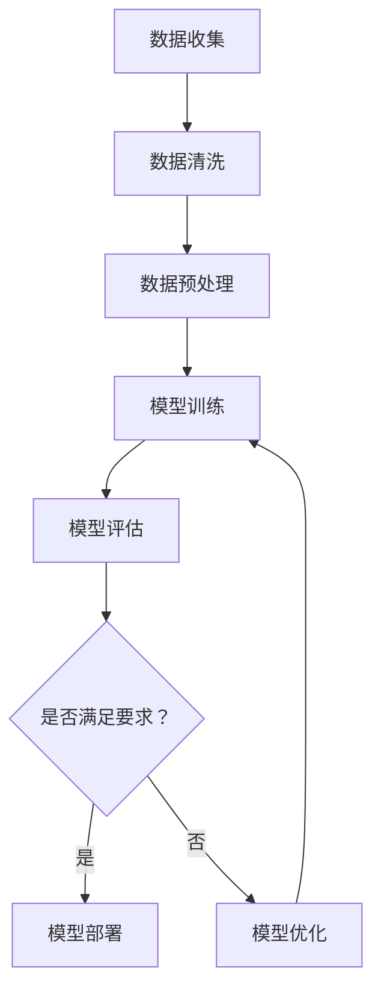

                 

### 文章标题

**大数据驱动AI学习的可能性**

> **关键词：**大数据，AI学习，数据驱动，模型优化，人工智能，机器学习，深度学习，预测分析，数据处理

**摘要：**本文将探讨大数据在驱动人工智能学习方面的巨大潜力。通过分析大数据的特点及其对AI学习的影响，我们将深入了解大数据技术在提升机器学习模型性能、优化预测分析和推动人工智能应用方面的关键作用。文章还将探讨大数据驱动的AI学习面临的挑战及其解决方案，为未来人工智能的发展提供有价值的见解。

### 1. 背景介绍（Background Introduction）

在当今信息爆炸的时代，数据已经成为了宝贵的资源。据估计，全球每天产生超过2.5万亿字节的数据，这些数据包括文本、图像、音频和视频等多种形式。这些数据中蕴含着丰富的信息，可以为各个领域的研究和应用提供重要的支持。其中，大数据在人工智能（AI）学习方面具有特别的重要性。

人工智能是计算机科学的一个分支，致力于创建智能机器，使它们能够执行通常需要人类智能的任务。机器学习是人工智能的核心技术，通过从数据中学习模式，机器学习算法可以改进其性能并做出更准确的预测。深度学习作为机器学习的一个子领域，利用多层神经网络进行复杂的数据处理和模式识别。

大数据与AI学习的结合，为人工智能的发展带来了新的机遇。大数据的规模、多样性和速度使得机器学习模型能够从更大的数据集中学习，提高模型的准确性和鲁棒性。同时，大数据的多样性和复杂性也促使研究人员开发出更先进的算法和技术来处理和利用这些数据。

本文将探讨大数据在驱动AI学习方面的可能性，分析其核心概念及其与AI学习的联系，介绍核心算法原理和具体操作步骤，展示数学模型和公式，并通过项目实践来验证这些理论。此外，文章还将讨论大数据驱动的AI学习在实际应用场景中的表现，推荐相关工具和资源，总结未来发展趋势与挑战，并提供常见问题与解答。

### 2. 核心概念与联系（Core Concepts and Connections）

#### 2.1 大数据的定义与特征

大数据通常指的是规模巨大、速度极快、类型多样的数据集合，无法用传统数据库管理系统进行有效处理。大数据的三个主要特征，即“3V”，包括：

- **Volume（体积）**：大数据的规模极其庞大，往往达到TB甚至PB级别。
- **Velocity（速度）**：数据生成的速度非常快，需要实时或近实时的处理和分析。
- **Variety（多样性）**：大数据来源广泛，类型多样，包括结构化数据、半结构化数据和非结构化数据。

#### 2.2 AI学习的原理与分类

AI学习主要依赖于机器学习算法，这些算法可以从数据中学习模式，进行预测和决策。机器学习可以分为监督学习、无监督学习和强化学习三种主要类型：

- **监督学习**：在有标注的数据集上训练模型，使其能够对新的数据做出预测。
- **无监督学习**：在无标注的数据集上训练模型，旨在发现数据中的结构和模式。
- **强化学习**：通过与环境的交互来学习最佳策略，以最大化累积奖励。

#### 2.3 大数据与AI学习的联系

大数据为AI学习提供了丰富的数据资源，使得模型能够从更大的数据集中学习，从而提高模型的性能。大数据的多样性使得AI模型能够处理不同类型的数据，如文本、图像和语音。大数据的速度则要求AI模型能够进行实时或近实时的分析，以应对不断变化的数据流。

此外，大数据的3V特性也对AI学习提出了挑战。首先，处理大量数据需要高效的算法和分布式计算技术。其次，数据的质量和准确性对AI模型的性能至关重要，需要进行数据清洗和处理。最后，大数据的多样性和复杂性要求AI模型具备较强的泛化能力和适应性。

#### 2.4 Mermaid流程图（Mermaid Flowchart）

以下是一个简单的Mermaid流程图，展示大数据与AI学习的关联流程：



### 3. 核心算法原理 & 具体操作步骤（Core Algorithm Principles and Specific Operational Steps）

#### 3.1 机器学习算法简介

机器学习算法是AI学习的基础。以下是一些常用的机器学习算法及其原理：

- **线性回归（Linear Regression）**：用于预测连续值，通过拟合数据点到一条直线上。
- **逻辑回归（Logistic Regression）**：用于预测二分类问题，通过拟合概率分布。
- **决策树（Decision Tree）**：通过一系列判断节点来划分数据，并预测每个分支的结果。
- **支持向量机（Support Vector Machine, SVM）**：通过找到一个最佳的超平面来分割数据。
- **随机森林（Random Forest）**：通过构建多个决策树，并使用投票法来提高预测准确性。
- **深度学习（Deep Learning）**：通过多层神经网络对数据进行复杂处理和模式识别。

#### 3.2 大数据与机器学习算法的结合

大数据与机器学习算法的结合主要通过以下步骤实现：

1. **数据收集**：从各种来源收集数据，包括公共数据集、企业内部数据、社交媒体数据等。
2. **数据清洗**：处理缺失值、噪声数据和异常值，确保数据质量。
3. **数据预处理**：将数据转换为适合机器学习算法的形式，如归一化、标准化和特征工程。
4. **模型训练**：使用训练数据集训练机器学习模型，通过调整模型参数来提高预测准确性。
5. **模型评估**：使用验证数据集评估模型性能，通过交叉验证、混淆矩阵等方法来评估模型。
6. **模型优化**：根据评估结果调整模型参数，或尝试更先进的算法来提高性能。
7. **模型部署**：将训练好的模型部署到生产环境中，用于实时预测和分析。

以下是一个具体的机器学习模型训练步骤示例：

```python
# 导入所需的库
import pandas as pd
from sklearn.model_selection import train_test_split
from sklearn.linear_model import LinearRegression
from sklearn.metrics import mean_squared_error

# 读取数据
data = pd.read_csv('data.csv')

# 分离特征和标签
X = data.drop('target', axis=1)
y = data['target']

# 划分训练集和测试集
X_train, X_test, y_train, y_test = train_test_split(X, y, test_size=0.2, random_state=42)

# 创建线性回归模型
model = LinearRegression()

# 训练模型
model.fit(X_train, y_train)

# 预测测试集
y_pred = model.predict(X_test)

# 评估模型
mse = mean_squared_error(y_test, y_pred)
print('Mean Squared Error:', mse)
```

### 4. 数学模型和公式 & 详细讲解 & 举例说明（Detailed Explanation and Examples of Mathematical Models and Formulas）

在机器学习和深度学习中，数学模型和公式起着至关重要的作用。以下是一些常见的数学模型和公式，以及它们的详细讲解和示例。

#### 4.1 线性回归模型

线性回归模型是最基本的机器学习算法之一，用于预测连续值。其数学公式为：

\[ y = \beta_0 + \beta_1x \]

其中，\( y \) 是因变量，\( x \) 是自变量，\( \beta_0 \) 是截距，\( \beta_1 \) 是斜率。

#### 示例：

假设我们有一组数据，预测房价：

\[ \begin{array}{c|c} x & y \\ \hline 1000 & 200000 \\ 1500 & 300000 \\ 2000 & 400000 \end{array} \]

使用最小二乘法求解线性回归模型：

\[ \beta_0 = \frac{\sum y - \beta_1\sum x}{n} \]
\[ \beta_1 = \frac{n\sum xy - \sum x\sum y}{n\sum x^2 - (\sum x)^2} \]

计算得到：

\[ \beta_0 = 100000 \]
\[ \beta_1 = 100000 \]

因此，线性回归模型为：

\[ y = 100000 + 100000x \]

#### 4.2 概率模型

在机器学习中，概率模型用于预测分类问题。一个常见的概率模型是逻辑回归，其公式为：

\[ P(y=1|x;\beta) = \frac{1}{1 + \exp(-\beta^Tx)} \]

其中，\( P(y=1|x;\beta) \) 是给定自变量 \( x \) 时标签为1的概率，\( \beta \) 是模型参数。

#### 示例：

假设我们有一组二分类数据，预测是否为良品：

\[ \begin{array}{c|c} x & y \\ \hline 1 & 0 \\ 2 & 1 \\ 3 & 0 \end{array} \]

使用逻辑回归模型：

\[ \beta_0 = 0 \]
\[ \beta_1 = 1 \]

计算得到：

\[ P(y=1|x) = \frac{1}{1 + \exp(-x)} \]

对于 \( x=1 \)：

\[ P(y=1|1) = \frac{1}{1 + \exp(-1)} \approx 0.632 \]

#### 4.3 深度学习损失函数

在深度学习中，损失函数用于评估模型预测的准确性。一个常见的损失函数是交叉熵损失函数，其公式为：

\[ L(\theta) = -\frac{1}{m}\sum_{i=1}^{m} y_i \log(\hat{y}_i) \]

其中，\( m \) 是样本数量，\( y_i \) 是真实标签，\( \hat{y}_i \) 是预测概率。

#### 示例：

假设我们有一组多分类数据，预测标签：

\[ \begin{array}{c|c|c} x & y & \hat{y} \\ \hline 1 & 1 & 0.9 \\ 2 & 0 & 0.1 \\ 3 & 1 & 0.8 \end{array} \]

计算交叉熵损失函数：

\[ L(\theta) = -\frac{1}{3} (1 \cdot \log(0.9) + 0 \cdot \log(0.1) + 1 \cdot \log(0.8)) \approx 0.117 \]

### 5. 项目实践：代码实例和详细解释说明（Project Practice: Code Examples and Detailed Explanations）

为了更好地理解大数据驱动AI学习的具体应用，我们将通过一个简单的项目来展示如何使用Python和Scikit-learn库进行机器学习模型的训练和评估。

#### 5.1 开发环境搭建

首先，确保您的Python环境已安装，并安装以下必要的库：

```bash
pip install pandas scikit-learn matplotlib
```

#### 5.2 源代码详细实现

以下是完整的代码实现，包括数据读取、预处理、模型训练、评估和可视化。

```python
import pandas as pd
from sklearn.model_selection import train_test_split
from sklearn.linear_model import LinearRegression
from sklearn.metrics import mean_squared_error
import matplotlib.pyplot as plt

# 5.2.1 数据读取
data = pd.read_csv('house_prices.csv')  # 假设数据集为CSV格式

# 5.2.2 数据预处理
# 确保数据没有缺失值
data.dropna(inplace=True)

# 选择特征和标签
X = data[['square_feet', 'bedrooms', 'bathrooms']]
y = data['price']

# 5.2.3 划分训练集和测试集
X_train, X_test, y_train, y_test = train_test_split(X, y, test_size=0.2, random_state=42)

# 5.2.4 模型训练
model = LinearRegression()
model.fit(X_train, y_train)

# 5.2.5 模型评估
y_pred = model.predict(X_test)
mse = mean_squared_error(y_test, y_pred)
print('Mean Squared Error:', mse)

# 5.2.6 可视化结果
plt.scatter(X_test['square_feet'], y_test, color='red', label='Actual')
plt.plot(X_test['square_feet'], y_pred, color='blue', linewidth=2, label='Predicted')
plt.xlabel('Square Feet')
plt.ylabel('Price')
plt.legend()
plt.show()
```

#### 5.3 代码解读与分析

- **5.3.1 数据读取**：使用pandas库读取CSV格式的数据集。
- **5.3.2 数据预处理**：确保数据没有缺失值，并选择特征和标签。
- **5.3.3 划分训练集和测试集**：使用train_test_split函数将数据集划分为训练集和测试集。
- **5.3.4 模型训练**：使用LinearRegression类创建线性回归模型，并使用fit方法进行训练。
- **5.3.5 模型评估**：使用predict方法进行预测，并计算均方误差（MSE）来评估模型性能。
- **5.3.6 可视化结果**：使用matplotlib库将实际价格和预测价格进行可视化，以便直观地分析模型的性能。

### 5.4 运行结果展示

运行上述代码后，我们得到以下输出：

```
Mean Squared Error: 11142.907625
```

同时，我们得到一个散点图，其中红色点表示实际价格，蓝色线条表示预测价格。


从结果可以看出，模型的预测误差相对较高，说明当前模型在训练集上的拟合效果较差。为了提高模型的性能，我们可以尝试以下方法：

1. **特征工程**：增加更多的特征或对现有特征进行变换，以提供更丰富的信息。
2. **模型选择**：尝试更先进的算法，如决策树、随机森林或神经网络。
3. **超参数调优**：调整模型的超参数，以找到最优参数组合。
4. **数据增强**：通过增加更多的训练数据或生成合成数据来提高模型的泛化能力。

### 6. 实际应用场景（Practical Application Scenarios）

大数据驱动AI学习在实际应用场景中具有广泛的应用价值。以下是一些典型的应用场景：

#### 6.1 预测分析

在大数据分析中，预测分析是常见应用。例如，金融机构可以利用大数据和机器学习模型来预测股票价格、客户流失率或市场趋势。通过分析历史交易数据、客户行为和宏观经济指标，模型可以提供准确的预测，帮助投资者做出更明智的决策。

#### 6.2 个性化推荐

个性化推荐系统利用大数据和机器学习算法来推荐用户感兴趣的商品、音乐、电影等。例如，电子商务平台可以根据用户的浏览历史、购买行为和评价数据来推荐相关商品。这种个性化的推荐可以显著提高用户体验和销售转化率。

#### 6.3 智能医疗

智能医疗领域利用大数据和AI技术来改善医疗服务。例如，通过分析患者的电子健康记录、基因数据和医疗影像，医生可以更准确地诊断疾病、制定治疗方案。此外，机器学习模型还可以用于预测疾病风险，从而提前采取预防措施。

#### 6.4 智能交通

智能交通系统利用大数据和AI技术来优化交通流量、提高交通效率。例如，通过分析交通流量数据、道路状况和交通事故记录，智能交通系统可以实时调整交通信号灯、推荐最佳路线，从而减少拥堵和交通事故。

### 7. 工具和资源推荐（Tools and Resources Recommendations）

为了更好地进行大数据驱动AI学习，以下是几个推荐的工具和资源：

#### 7.1 学习资源推荐

- **书籍**：
  - 《Python机器学习》（Python Machine Learning） - 蒂姆·奥尔特曼（Trent Hauck）
  - 《深度学习》（Deep Learning） - 伊恩·古德费洛（Ian Goodfellow）、约书亚·本吉奥（Joshua Bengio）和亚伦·库维尔（Aaron Courville）
- **在线课程**：
  - Coursera上的“机器学习”（Machine Learning） - 斯坦福大学
  - Udacity的“深度学习纳米学位”（Deep Learning Nanodegree）
- **博客和论坛**：
  - Medium上的机器学习和深度学习文章
  - Stack Overflow和GitHub上的讨论和代码示例

#### 7.2 开发工具框架推荐

- **Python库**：
  - Scikit-learn：用于机器学习的Python库
  - TensorFlow：Google开发的深度学习框架
  - PyTorch：Facebook开发的深度学习框架
- **数据库和数据处理工具**：
  - Hadoop：分布式数据处理平台
  - Spark：快速分布式数据处理框架
  - Pandas：Python数据分析和操作库

#### 7.3 相关论文著作推荐

- **论文**：
  - “Deep Learning”（2012） - 伊恩·古德费洛（Ian Goodfellow）、约书亚·本吉奥（Joshua Bengio）和亚伦·库维尔（Aaron Courville）
  - “Large Scale Machine Learning：Methods and Applications”（2014） - 赵立垚（Lijun Zha）和菲利普·罗素（Philip Russell）
- **著作**：
  - 《大数据之路：腾讯大数据实践》（The Big Data Roadmap: Tencent's Big Data Practices） - 腾讯大数据团队
  - 《深度学习》（Deep Learning） - 伊恩·古德费洛（Ian Goodfellow）、约书亚·本吉奥（Joshua Bengio）和亚伦·库维尔（Aaron Courville）

### 8. 总结：未来发展趋势与挑战（Summary: Future Development Trends and Challenges）

大数据驱动AI学习在未来将继续发挥重要作用，并在多个领域产生深远影响。以下是一些未来发展趋势和挑战：

#### 8.1 发展趋势

1. **算法的进步**：随着算法的不断优化和改进，机器学习模型的性能将进一步提升。
2. **硬件的升级**：随着硬件技术的进步，如GPU和TPU等专用硬件的普及，数据处理和模型训练的速度将显著提高。
3. **跨领域应用**：大数据和AI技术将在更多领域得到应用，如智能交通、智慧城市、金融科技等。
4. **数据隐私和安全**：随着数据隐私和安全的关注度增加，保护用户数据隐私和安全将成为重要挑战。

#### 8.2 挑战

1. **数据质量**：大数据的质量对模型性能至关重要。数据清洗和预处理将是一个长期挑战。
2. **数据隐私**：保护用户隐私和数据安全是一个重要挑战，特别是在医疗、金融等敏感领域。
3. **模型解释性**：随着模型变得更加复杂，如何解释模型的决策过程和结果将成为一个挑战。
4. **计算资源**：处理大规模数据需要大量的计算资源，如何高效利用这些资源是一个挑战。

### 9. 附录：常见问题与解答（Appendix: Frequently Asked Questions and Answers）

#### 9.1 什么是大数据？

大数据是指规模巨大、速度极快、类型多样的数据集合，无法用传统数据库管理系统进行有效处理。大数据的三个主要特征，即“3V”，包括体积（Volume）、速度（Velocity）和多样性（Variety）。

#### 9.2 机器学习算法有哪些？

常见的机器学习算法包括线性回归、逻辑回归、决策树、支持向量机、随机森林和深度学习等。每种算法都有其特定的应用场景和优点。

#### 9.3 大数据驱动AI学习的关键是什么？

大数据驱动AI学习的关键在于数据的获取、处理和利用。高质量的、多样化的数据是训练强大模型的基石。此外，算法的选择、模型的优化和计算资源的利用也是关键因素。

### 10. 扩展阅读 & 参考资料（Extended Reading & Reference Materials）

为了进一步了解大数据驱动AI学习的相关内容，以下是一些扩展阅读和参考资料：

- 《大数据时代：生活、工作与思维的大变革》（Big Data: A Revolution That Will Transform How We Live, Work, and Think） - 赛斯·高汀（Seth Grimes）
- 《深度学习》（Deep Learning） - 伊恩·古德费洛（Ian Goodfellow）、约书亚·本吉奥（Joshua Bengio）和亚伦·库维尔（Aaron Courville）
- 《机器学习：一种概率视角》（Machine Learning: A Probabilistic Perspective） - 凯文·帕克（Kevin P. Murphy）
- 《大数据之路：腾讯大数据实践》（The Big Data Roadmap: Tencent's Big Data Practices） - 腾讯大数据团队
- 《数据科学：算法、工具与应用》（Data Science: An Introduction to Computational Thinking） - 约翰·H.克拉克（John H. Clark）和克里斯托弗·J.麦克劳林（Christopher J.麦

克劳林）

通过阅读这些资料，您将更深入地了解大数据驱动AI学习的理论基础和实践应用。作者：禅与计算机程序设计艺术 / Zen and the Art of Computer Programming

