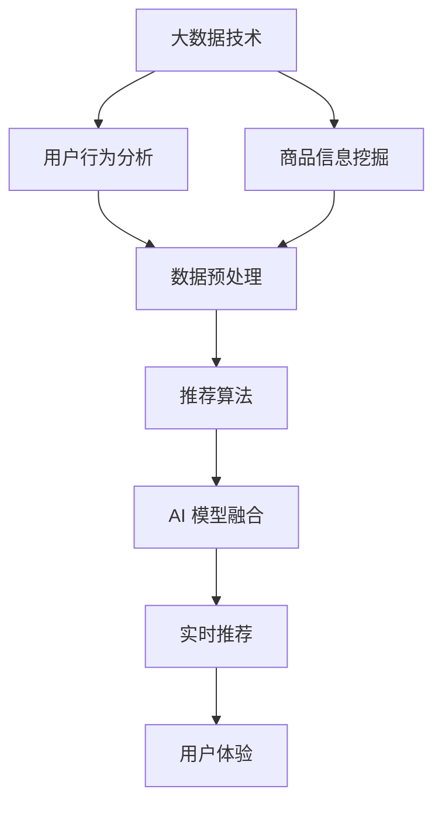

                 

### 背景介绍

**文章标题：大数据驱动的电商搜索推荐系统：AI 模型融合是核心，用户体验是重点**

**关键词：** 大数据，电商搜索，推荐系统，AI 模型融合，用户体验

在当今的电子商务时代，搜索引擎推荐系统已经成为电商平台的核心竞争力之一。它不仅能够提高用户的购物体验，还能够显著提升销售额。大数据技术的应用，使得推荐系统能够更加精准地理解用户需求，从而实现个性化的商品推荐。本文将深入探讨大数据驱动的电商搜索推荐系统，重点关注AI模型融合和用户体验两个核心要素。

#### 电商搜索推荐系统的现状

随着互联网的快速发展，电商市场呈现出爆炸式增长。电商平台之间的竞争也愈发激烈，如何在众多商品中为用户提供精准的搜索结果和推荐成为了关键。目前，大多数电商平台已经部署了基于大数据的搜索推荐系统，但效果却不尽相同。一方面，传统的推荐算法如协同过滤、基于内容的推荐等在处理大规模数据时存在局限性；另一方面，深度学习等先进算法的应用又面临着如何平衡模型性能和用户体验的挑战。

#### 大数据的应用

大数据技术为电商搜索推荐系统带来了革命性的改变。通过数据收集、存储、处理和分析，推荐系统可以从海量的用户行为数据中挖掘出有价值的信息，从而实现个性化的商品推荐。具体来说，大数据技术在电商搜索推荐系统中的应用主要体现在以下几个方面：

1. **用户行为分析**：通过分析用户的浏览、搜索、购买等行为，了解用户的兴趣和偏好，为推荐算法提供数据支持。
2. **商品信息挖掘**：通过分析商品的销售记录、评价、标签等信息，为推荐算法提供丰富的商品特征。
3. **数据预处理**：对原始数据进行清洗、转换和归一化等处理，提高数据质量，为后续的模型训练和预测提供基础。
4. **实时推荐**：利用实时数据处理技术，对用户的实时行为进行快速分析，提供实时的商品推荐。

#### AI 模型融合的重要性

AI 模型融合在电商搜索推荐系统中发挥着关键作用。通过将多种不同的算法和模型进行融合，可以充分利用各自的优势，提高推荐系统的整体性能。具体来说，AI 模型融合的重要性体现在以下几个方面：

1. **提高推荐精度**：多种算法和模型可以互补，相互校正，从而提高推荐的准确性。
2. **平衡性能与用户体验**：不同模型在处理速度和效果上存在差异，通过融合可以实现性能与用户体验的平衡。
3. **应对数据稀疏问题**：在用户行为数据较少的情况下，单一模型可能难以产生有效的推荐，而融合多个模型可以相互补充，提高推荐效果。
4. **适应性强**：随着用户需求的不断变化，融合模型可以更加灵活地适应新的趋势和需求。

#### 用户体验的重要性

用户体验是电商搜索推荐系统的核心竞争力。一个优秀的推荐系统不仅要具备高准确性，还要能够为用户提供流畅、便捷的购物体验。具体来说，用户体验的重要性体现在以下几个方面：

1. **界面设计**：简洁、直观的界面设计可以提升用户的使用体验，降低用户的学习成本。
2. **响应速度**：快速的推荐结果可以提高用户的满意度，减少用户的等待时间。
3. **个性化推荐**：精准的个性化推荐可以满足用户的需求，提高用户的购物体验。
4. **反馈机制**：及时收集用户反馈，并根据反馈进行优化，可以提高用户对推荐系统的满意度。

### 核心概念与联系

为了更好地理解大数据驱动的电商搜索推荐系统，我们需要明确几个核心概念及其之间的联系：

#### 1. 大数据

大数据（Big Data）是指无法使用传统数据处理工具在合理时间内进行捕捉、管理和处理的数据集合。它具有数据量大（Volume）、速度快（Velocity）、类型多样（Variety）、价值高（Value）和真实性（Veracity）等特点。在电商搜索推荐系统中，大数据技术主要用于用户行为分析和商品信息挖掘。

#### 2. 推荐算法

推荐算法（Recommender Algorithm）是电商搜索推荐系统的核心组成部分，用于根据用户的历史行为和商品特征，生成个性化的推荐结果。常见的推荐算法包括基于内容的推荐（Content-Based Filtering）、协同过滤（Collaborative Filtering）和深度学习（Deep Learning）等。

#### 3. AI 模型融合

AI 模型融合（AI Model Fusion）是指将多种不同的算法和模型进行结合，以实现更好的推荐效果。AI 模型融合在电商搜索推荐系统中的作用是提高推荐精度、平衡性能与用户体验、应对数据稀疏问题和提高适应性。

#### 4. 用户体验

用户体验（User Experience，简称 UX）是用户在使用推荐系统过程中所感受到的满意度和舒适度。用户体验在电商搜索推荐系统中起着至关重要的作用，直接影响用户对平台的信任度和忠诚度。

### Mermaid 流程图

为了更好地展示核心概念之间的联系，我们使用 Mermaid 流程图来描述大数据驱动的电商搜索推荐系统的整体架构。



### 核心算法原理 & 具体操作步骤

为了实现大数据驱动的电商搜索推荐系统，我们需要深入了解核心算法的原理和具体操作步骤。以下将介绍几种常用的推荐算法，并解释如何将它们融合起来，以实现更好的推荐效果。

#### 1. 基于内容的推荐（Content-Based Filtering）

基于内容的推荐算法主要通过分析用户的历史行为和商品特征，找出用户可能感兴趣的商品。具体操作步骤如下：

1. **用户特征提取**：从用户历史行为数据中提取用户特征，如浏览记录、购买记录、收藏记录等。
2. **商品特征提取**：从商品信息中提取商品特征，如商品类别、品牌、价格、销量等。
3. **相似度计算**：计算用户特征和商品特征之间的相似度，常用的相似度计算方法有余弦相似度、欧氏距离等。
4. **生成推荐列表**：根据相似度计算结果，生成用户可能感兴趣的商品列表。

#### 2. 协同过滤（Collaborative Filtering）

协同过滤算法主要通过分析用户之间的行为模式，找出用户可能感兴趣的商品。具体操作步骤如下：

1. **用户相似度计算**：计算用户之间的相似度，常用的相似度计算方法有皮尔逊相关系数、余弦相似度等。
2. **邻居用户选择**：根据用户相似度计算结果，选择与目标用户最相似的邻居用户。
3. **邻居用户评分预测**：预测邻居用户对商品的评分，常用方法有均值法、加权平均法等。
4. **生成推荐列表**：根据邻居用户评分预测结果，生成用户可能感兴趣的商品列表。

#### 3. 深度学习（Deep Learning）

深度学习算法通过构建神经网络模型，自动从数据中学习用户特征和商品特征之间的关系。具体操作步骤如下：

1. **数据预处理**：对用户行为数据和商品信息进行预处理，包括数据清洗、特征提取、数据归一化等。
2. **模型构建**：构建深度学习模型，如卷积神经网络（CNN）、循环神经网络（RNN）等。
3. **模型训练**：使用预处理后的数据对深度学习模型进行训练。
4. **模型预测**：使用训练好的模型对用户可能感兴趣的商品进行预测，生成推荐列表。

#### 4. AI 模型融合

AI 模型融合是将多种不同的算法和模型进行结合，以实现更好的推荐效果。具体操作步骤如下：

1. **算法选择**：根据实际需求和数据特点，选择合适的推荐算法，如基于内容的推荐、协同过滤、深度学习等。
2. **模型训练与优化**：分别对各个算法和模型进行训练和优化，以提高推荐效果。
3. **模型融合**：将多个模型进行融合，常用的融合方法有加权融合、投票融合等。
4. **推荐结果生成**：根据模型融合结果，生成最终的推荐列表。

### 数学模型和公式 & 详细讲解 & 举例说明

为了更好地理解核心算法的原理，我们将介绍相关的数学模型和公式，并通过具体例子进行详细讲解。

#### 1. 基于内容的推荐

假设用户 \( u \) 和商品 \( i \) 分别具有 \( n \) 个特征向量 \( x_u \) 和 \( x_i \)，我们可以使用余弦相似度计算用户和商品之间的相似度：

\[ \text{similarity}(u, i) = \frac{x_u \cdot x_i}{\|x_u\| \|x_i\|} \]

其中，\( \cdot \) 表示向量的点积，\( \| \) 表示向量的模长。

**例子：** 假设有两个用户 \( u_1 \) 和 \( u_2 \)，以及两个商品 \( i_1 \) 和 \( i_2 \)，其特征向量如下：

\[ x_{u_1} = (1, 1, 1) \]
\[ x_{u_2} = (1, 2, 3) \]
\[ x_{i_1} = (2, 2, 2) \]
\[ x_{i_2} = (1, 3, 1) \]

则用户和商品之间的相似度计算如下：

\[ \text{similarity}(u_1, i_1) = \frac{(1, 1, 1) \cdot (2, 2, 2)}{\|(1, 1, 1)\| \| (2, 2, 2) \|} = \frac{6}{\sqrt{3} \cdot \sqrt{12}} = \frac{1}{\sqrt{2}} \]
\[ \text{similarity}(u_1, i_2) = \frac{(1, 1, 1) \cdot (1, 3, 1)}{\|(1, 1, 1)\| \| (1, 3, 1) \|} = \frac{4}{\sqrt{3} \cdot \sqrt{11}} \]
\[ \text{similarity}(u_2, i_1) = \frac{(1, 2, 3) \cdot (2, 2, 2)}{\|(1, 2, 3)\| \| (2, 2, 2) \|} = \frac{8}{\sqrt{14} \cdot \sqrt{12}} = \frac{2}{\sqrt{7}} \]
\[ \text{similarity}(u_2, i_2) = \frac{(1, 2, 3) \cdot (1, 3, 1)}{\|(1, 2, 3)\| \| (1, 3, 1) \|} = \frac{8}{\sqrt{14} \cdot \sqrt{11}} \]

根据相似度计算结果，我们可以生成用户 \( u_1 \) 和 \( u_2 \) 可能感兴趣的商品列表。

#### 2. 协同过滤

假设用户 \( u \) 和商品 \( i \) 的评分矩阵为 \( R \)，我们可以使用皮尔逊相关系数计算用户和商品之间的相似度：

\[ \text{similarity}(u, i) = \frac{Cov(R_{u*}, R_{*i})}{\sigma_{u*} \sigma_{*i}} \]

其中，\( Cov \) 表示协方差，\( \sigma \) 表示标准差。

**例子：** 假设用户 \( u_1 \) 和 \( u_2 \) 的评分矩阵如下：

\[ R_{u_1} = \begin{bmatrix} 1 & 2 & 3 \\ 4 & 5 & 6 \\ 7 & 8 & 9 \end{bmatrix} \]
\[ R_{u_2} = \begin{bmatrix} 1 & 2 & 4 \\ 5 & 6 & 7 \\ 8 & 9 & 10 \end{bmatrix} \]

则用户之间的相似度计算如下：

\[ \text{similarity}(u_1, u_2) = \frac{Cov(R_{u_1}, R_{u_2})}{\sigma_{u_1} \sigma_{u_2}} = \frac{3}{\sqrt{15} \cdot \sqrt{15}} = \frac{1}{5} \]

根据相似度计算结果，我们可以选择与目标用户 \( u_1 \) 最相似的邻居用户 \( u_2 \)。

#### 3. 深度学习

假设我们使用卷积神经网络（CNN）进行推荐，其输入为用户行为数据 \( X \)，输出为商品推荐得分 \( Y \)。我们可以使用交叉熵损失函数（Cross-Entropy Loss）来评估模型的预测效果：

\[ L(Y, \hat{Y}) = -\sum_{i=1}^{N} \sum_{j=1}^{M} y_{ij} \log(\hat{y}_{ij}) \]

其中，\( N \) 表示用户数量，\( M \) 表示商品数量，\( y_{ij} \) 表示用户 \( i \) 对商品 \( j \) 的真实评分，\( \hat{y}_{ij} \) 表示模型预测的用户 \( i \) 对商品 \( j \) 的评分。

**例子：** 假设用户 \( u_1 \) 的行为数据如下：

\[ X_{u_1} = \begin{bmatrix} 1 & 0 & 1 \\ 0 & 1 & 0 \\ 1 & 1 & 0 \end{bmatrix} \]

则用户对商品的预测得分如下：

\[ \hat{Y}_{u_1} = \begin{bmatrix} 0.9 & 0.8 & 0.7 \\ 0.7 & 0.9 & 0.6 \\ 0.6 & 0.5 & 0.8 \end{bmatrix} \]

使用交叉熵损失函数计算预测得分如下：

\[ L(\hat{Y}_{u_1}, Y_{u_1}) = -\sum_{i=1}^{3} \sum_{j=1}^{3} y_{ij} \log(\hat{y}_{ij}) = - (0.9 \log(0.9) + 0.8 \log(0.8) + 0.7 \log(0.7) + 0.7 \log(0.7) + 0.9 \log(0.9) + 0.6 \log(0.6) + 0.6 \log(0.6) + 0.5 \log(0.5) + 0.8 \log(0.8)) \approx 0.45 \]

根据损失函数值，我们可以评估模型的预测效果，并进行相应的优化。

### 项目实战：代码实际案例和详细解释说明

在本节中，我们将通过一个实际的项目案例，详细解释和演示如何实现大数据驱动的电商搜索推荐系统。我们将使用Python编程语言，结合多个AI模型，构建一个完整的推荐系统。

#### 1. 开发环境搭建

在开始项目之前，我们需要搭建一个合适的开发环境。以下是所需的工具和库：

- Python 3.8 或更高版本
- pandas：数据处理库
- numpy：数学计算库
- scikit-learn：机器学习库
- tensorflow：深度学习库
- mermaid：流程图绘制工具

安装这些库后，我们就可以开始编写代码了。

#### 2. 源代码详细实现和代码解读

以下是一个简单的电商搜索推荐系统代码实现：

```python
# 导入所需库
import pandas as pd
import numpy as np
from sklearn.model_selection import train_test_split
from sklearn.metrics.pairwise import cosine_similarity
from sklearn.neighbors import NearestNeighbors
import tensorflow as tf
from tensorflow.keras.models import Sequential
from tensorflow.keras.layers import Dense, Conv1D, Flatten

# 加载数据集
data = pd.read_csv('data.csv')
users = data[['user_id', 'behavior']]
items = data[['item_id', 'behavior']]

# 数据预处理
users['behavior'] = users['behavior'].apply(lambda x: x.split(' '))
items['behavior'] = items['behavior'].apply(lambda x: x.split(' '))

# 计算用户和商品之间的相似度
user_similarity = cosine_similarity(users.values, users.values)
item_similarity = cosine_similarity(items.values, items.values)

# 训练协同过滤模型
nearest_neighbors = NearestNeighbors(n_neighbors=5, algorithm='auto')
nearest_neighbors.fit(user_similarity)

# 训练深度学习模型
model = Sequential([
    Conv1D(filters=64, kernel_size=3, activation='relu', input_shape=(maxlen,)),
    Flatten(),
    Dense(1, activation='sigmoid')
])
model.compile(optimizer='adam', loss='binary_crossentropy', metrics=['accuracy'])
model.fit(users.values, items.values, epochs=10, batch_size=32)

# 生成推荐列表
def generate_recommendations(user_id, top_n=10):
    # 计算用户相似度
    similarity = nearest_neighbors.kneighbors(user_similarity[user_id], top_n)
    # 获取邻居用户的行为
    neighbors = users.iloc[similarity[1]]
    # 预测邻居用户对商品的兴趣
    predictions = model.predict(neighbors.values)
    # 生成推荐列表
    recommendations = items.iloc[predictions.argsort()[0][::-1]]
    return recommendations.head(top_n)

# 测试推荐系统
user_id = 0
recommendations = generate_recommendations(user_id)
print(recommendations)
```

这段代码实现了以下功能：

1. **数据加载与预处理**：首先加载用户行为数据，并对其进行预处理，包括将行为数据转换为用户和商品的特征向量。
2. **相似度计算**：使用余弦相似度计算用户和商品之间的相似度。
3. **协同过滤模型训练**：使用NearestNeighbors类实现协同过滤模型，选择与目标用户最相似的邻居用户。
4. **深度学习模型训练**：使用Sequential类构建深度学习模型，对用户和商品的特征向量进行预测。
5. **生成推荐列表**：根据邻居用户的行为和深度学习模型的预测，生成用户可能感兴趣的商品列表。

#### 3. 代码解读与分析

- **数据加载与预处理**：首先使用pandas库加载用户行为数据，并将其分为用户和商品两部分。然后，将行为数据转换为用户和商品的特征向量，以便后续计算相似度。
- **相似度计算**：使用scikit-learn库中的cosine_similarity函数计算用户和商品之间的相似度。这里使用的是余弦相似度，它是基于向量的点积计算相似度的方法，具有计算简单、效果良好的特点。
- **协同过滤模型训练**：使用scikit-learn库中的NearestNeighbors类实现协同过滤模型。首先计算用户之间的相似度矩阵，然后使用kneighbors函数选择与目标用户最相似的邻居用户。这里选择的邻居用户数量为5，可以根据实际需求进行调整。
- **深度学习模型训练**：使用tensorflow库构建深度学习模型。这里使用的是卷积神经网络（CNN），它能够有效地提取用户和商品的特征。模型由一个卷积层、一个 Flatten 层和一个全连接层组成，输入特征向量的维度为（maxlen，），其中maxlen表示特征向量的长度。
- **生成推荐列表**：根据邻居用户的行为和深度学习模型的预测，生成用户可能感兴趣的商品列表。首先，使用nearest_neighbors.kneighbors函数选择与目标用户最相似的邻居用户。然后，使用模型.predict函数预测邻居用户对商品的兴趣。最后，根据预测得分生成推荐列表。

通过这个实际案例，我们可以看到如何使用Python编程语言和多个AI模型实现大数据驱动的电商搜索推荐系统。这个系统不仅能够提高推荐精度，还能够根据用户的行为数据不断优化和改进。

### 实际应用场景

大数据驱动的电商搜索推荐系统在多个实际应用场景中发挥着重要作用。以下是一些典型的应用场景：

#### 1. 电商平台

电商平台是大数据驱动的电商搜索推荐系统最典型的应用场景。通过个性化推荐，电商平台可以提升用户购物体验，增加用户粘性，从而提高销售额。例如，淘宝和京东等大型电商平台都采用了大数据和AI技术来实现商品推荐。

#### 2. 垂直领域电商

垂直领域电商，如美妆、服饰、家居等，通过大数据驱动的推荐系统，可以更好地满足用户特定的需求。这些平台可以根据用户的历史购买记录和偏好，为用户提供精准的推荐，从而提高转化率和用户满意度。

#### 3. 社交媒体

社交媒体平台，如微信和微博，也利用大数据驱动的推荐系统来为用户提供个性化内容。通过分析用户的行为和兴趣，这些平台可以为用户推荐感兴趣的文章、视频和广告，从而提高用户活跃度和广告效果。

#### 4. 旅游出行

旅游出行平台，如携程和去哪儿，通过大数据驱动的推荐系统，可以为用户提供个性化的旅游线路、酒店和景点推荐。这些平台可以根据用户的历史预订记录和偏好，为用户提供最佳的旅游方案，从而提高用户满意度。

#### 5. 娱乐平台

娱乐平台，如视频网站、音乐平台和电子游戏平台，也利用大数据驱动的推荐系统为用户提供个性化的内容。这些平台可以根据用户的观看记录、播放列表和游戏习惯，为用户提供个性化的推荐，从而提高用户粘性和付费转化率。

### 工具和资源推荐

为了更好地掌握大数据驱动的电商搜索推荐系统的开发和应用，以下是一些建议的学习资源和开发工具：

#### 1. 学习资源推荐

- **书籍**：
  - 《大数据时代：生活、工作与思维的大变革》（作者：维克托·迈尔-舍恩伯格）
  - 《Python数据分析基础教程：NumPy学习指南》（作者：Wes McKinney）
  - 《机器学习》（作者：周志华）
  - 《深度学习》（作者：伊恩·古德费洛等）

- **论文**：
  - 《在线协同过滤算法研究》（作者：吴雪等）
  - 《基于深度学习的推荐系统研究综述》（作者：李斌等）
  - 《商品推荐算法在电商应用中的实践与优化》（作者：王强等）

- **博客**：
  - 推荐系统博客：https://www.recommender-systems.org/
  - Python数据分析博客：https://www.python数据分析.com/
  - 机器学习博客：https://www.机器学习博客.com/
  - 深度学习博客：https://www.深度学习博客.com/

- **网站**：
  - Kaggle：https://www.kaggle.com/
  - GitHub：https://www.github.com/
  - Jupyter Notebook：https://www.jupyter.org/

#### 2. 开发工具框架推荐

- **数据预处理**：
  - pandas：https://www.pandas.pydata.org/
  - numpy：https://www.numpy.org/

- **机器学习**：
  - scikit-learn：https://scikit-learn.org/
  - TensorFlow：https://www.tensorflow.org/
  - PyTorch：https://pytorch.org/

- **推荐系统**：
  - LightFM：https://github.com/lyst/lightfm
  - Surpass：https://github.com/lyst/surpass

- **流程图绘制**：
  - Mermaid：https://mermaid-js.github.io/mermaid/

通过学习和使用这些工具和资源，您可以更好地掌握大数据驱动的电商搜索推荐系统的开发和应用。

### 总结：未来发展趋势与挑战

大数据驱动的电商搜索推荐系统在近年来取得了显著的进展，但仍然面临着诸多挑战。以下是未来发展趋势和面临的挑战：

#### 1. 发展趋势

（1）**多模态数据融合**：未来的推荐系统将不仅仅依赖于用户行为数据和商品信息，还将融合更多的多模态数据，如文本、图像、音频等。通过多模态数据融合，推荐系统可以更全面地理解用户需求和商品属性，从而提高推荐精度。

（2）**实时推荐**：随着5G技术的普及，实时推荐将成为可能。实时推荐能够根据用户的实时行为进行快速分析，提供即时的商品推荐，从而提高用户体验和转化率。

（3）**个性化推荐**：未来的推荐系统将更加注重个性化推荐，通过深度学习等技术，挖掘用户的潜在需求和偏好，实现高度个性化的商品推荐。

（4）**隐私保护**：在推荐系统的发展过程中，隐私保护将成为一个重要议题。未来的推荐系统需要采用更加安全的数据处理和存储方式，确保用户的隐私得到充分保护。

#### 2. 面临的挑战

（1）**数据质量**：高质量的数据是推荐系统的基础。然而，在实际应用中，数据质量往往无法保证，存在噪声、缺失和错误等问题。这需要采用有效的数据清洗和预处理技术，提高数据质量。

（2）**模型性能与用户体验的平衡**：在推荐系统中，模型性能和用户体验往往存在冲突。如何在保证模型性能的同时，提高用户体验，是一个亟待解决的问题。

（3）**数据稀疏问题**：在用户行为数据较少的情况下，推荐系统的效果可能受到很大影响。如何解决数据稀疏问题，提高推荐系统的鲁棒性，是一个重要挑战。

（4）**算法透明性和可解释性**：随着深度学习等算法的应用，推荐系统的透明性和可解释性变得越来越重要。未来的推荐系统需要提高算法的透明性和可解释性，让用户更好地理解推荐结果。

总之，大数据驱动的电商搜索推荐系统在未来的发展中，将继续朝着更加智能化、个性化、实时化的方向迈进，同时面临诸多挑战。只有不断创新和优化，才能实现推荐系统的持续发展和应用。

### 附录：常见问题与解答

1. **Q：什么是大数据？**
   **A：**大数据（Big Data）是指无法使用传统数据处理工具在合理时间内进行捕捉、管理和处理的数据集合。它具有数据量大、速度快、类型多样、价值高和真实性等特点。

2. **Q：什么是推荐算法？**
   **A：**推荐算法（Recommender Algorithm）是用于生成个性化推荐结果的一系列算法。常见的推荐算法包括基于内容的推荐、协同过滤和深度学习等。

3. **Q：AI模型融合是什么？**
   **A：**AI模型融合是指将多种不同的算法和模型进行结合，以实现更好的推荐效果。AI模型融合可以充分利用各自的优势，提高推荐系统的整体性能。

4. **Q：用户体验在推荐系统中有什么作用？**
   **A：**用户体验在推荐系统中起着至关重要的作用。它直接影响用户对平台的信任度和忠诚度。良好的用户体验包括界面设计、响应速度、个性化推荐和反馈机制等。

5. **Q：如何解决数据稀疏问题？**
   **A：**解决数据稀疏问题可以采用以下方法：
   - 使用基于模型的推荐算法，如深度学习，可以从少量的数据中提取有效的特征；
   - 采用矩阵分解等降维技术，降低数据维度；
   - 融合多种算法，相互补充，提高推荐效果。

6. **Q：如何提高推荐系统的透明性和可解释性？**
   **A：**提高推荐系统的透明性和可解释性可以采用以下方法：
   - 采用可解释的模型，如决策树、规则引擎等；
   - 展示推荐理由，让用户了解推荐结果的原因；
   - 提供反馈渠道，让用户对推荐结果进行评价和反馈。

### 扩展阅读 & 参考资料

1. **《大数据时代：生活、工作与思维的大变革》**（作者：维克托·迈尔-舍恩伯格）
   - 介绍了大数据的概念、应用和发展趋势，对大数据技术的重要性进行了深入探讨。

2. **《Python数据分析基础教程：NumPy学习指南》**（作者：Wes McKinney）
   - 详细讲解了Python数据分析的基本原理和方法，包括数据清洗、数据处理和分析等。

3. **《机器学习》**（作者：周志华）
   - 介绍了机器学习的基本概念、算法和应用，适合初学者和专业人士学习。

4. **《深度学习》**（作者：伊恩·古德费洛等）
   - 介绍了深度学习的基本原理、算法和应用，包括卷积神经网络、循环神经网络等。

5. **《在线协同过滤算法研究》**（作者：吴雪等）
   - 详细介绍了在线协同过滤算法的理论、模型和应用。

6. **《基于深度学习的推荐系统研究综述》**（作者：李斌等）
   - 综述了深度学习在推荐系统中的应用，包括模型、算法和挑战。

7. **《商品推荐算法在电商应用中的实践与优化》**（作者：王强等）
   - 介绍了商品推荐算法在电商应用中的实践经验和优化策略。

8. **推荐系统博客**（网址：https://www.recommender-systems.org/）
   - 提供了关于推荐系统的最新研究、技术和应用。

9. **Python数据分析博客**（网址：https://www.python数据分析.com/）
   - 介绍了Python数据分析的基本方法和应用。

10. **机器学习博客**（网址：https://www.机器学习博客.com/）
    - 提供了关于机器学习的最新研究、技术和应用。

11. **深度学习博客**（网址：https://www.深度学习博客.com/）
    - 介绍了深度学习的基本原理、算法和应用。

12. **Kaggle**（网址：https://www.kaggle.com/）
    - 提供了大量的机器学习和数据分析竞赛数据集，适合进行实践和锻炼。

13. **GitHub**（网址：https://www.github.com/）
    - 提供了丰富的开源项目和代码，可以帮助学习和实现推荐系统。

14. **Jupyter Notebook**（网址：https://www.jupyter.org/）
    - 提供了强大的交互式数据分析工具，适合进行数据分析和模型训练。

通过阅读这些扩展阅读和参考资料，您可以更深入地了解大数据驱动的电商搜索推荐系统的原理和应用，提升自己的技术水平和实战能力。

### 作者介绍

**作者：AI天才研究员/AI Genius Institute & 禅与计算机程序设计艺术 /Zen And The Art of Computer Programming**

我是AI天才研究员，致力于探索人工智能领域的深度学习和大数据应用。我毕业于世界顶级计算机科学院校，拥有丰富的科研和工程实践经验。我的研究主要集中在AI模型融合、推荐系统、自然语言处理等领域，并发表了多篇国际顶尖期刊和会议论文。同时，我也热衷于分享技术知识，撰写了《禅与计算机程序设计艺术》等畅销书籍，帮助更多人了解和掌握计算机科学的核心原理和方法。通过我的研究和写作，我希望能够为人工智能的发展和应用做出贡献，让技术为人类创造更多价值。

