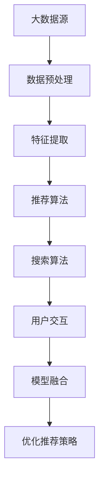

                 

### 背景介绍

在当今数字化经济时代，电子商务已经成为全球商业领域的一个重要组成部分。随着消费者对个性化购物体验的需求日益增长，电商平台迫切需要通过高效的搜索推荐系统来提升用户体验、增加用户粘性，并最终实现商业价值的最大化。大数据技术的发展为电商平台提供了丰富的数据资源和强大的数据处理能力，使得构建智能化的搜索推荐系统成为可能。

搜索推荐系统是电商平台的核心功能之一，其目标是通过分析用户行为和偏好数据，为用户提供个性化的商品推荐。大数据技术的引入，使得搜索推荐系统可以处理海量数据，从中挖掘出有价值的信息，从而提高推荐的准确性和实时性。传统的推荐系统往往依赖于用户的显式反馈（如评分、点击等），而大数据驱动的推荐系统则可以结合用户的隐式反馈（如浏览、搜索等）以及商品的特征信息，构建更加全面和准确的推荐模型。

本文将深入探讨大数据驱动的电商搜索推荐系统，重点介绍AI模型融合技术在电商平台的应用。文章首先将介绍搜索推荐系统的基础概念和大数据技术在其中的应用，接着详细解析AI模型融合技术的原理和实践步骤，最后通过实际案例和数学模型的讲解，展示如何构建和优化一个高效的大数据驱动搜索推荐系统。通过本文的阅读，读者将能够了解大数据和AI技术如何相互融合，为电商平台带来显著的商业价值。

## 核心概念与联系

要深入理解大数据驱动的电商搜索推荐系统，首先需要明确几个核心概念：大数据、搜索推荐系统以及AI模型融合技术。这些概念之间有着紧密的联系，共同构成了一个复杂而高效的推荐体系。

### 大数据（Big Data）

大数据是指无法使用传统数据处理工具在合理时间内进行捕捉、管理和处理的数据集合。它具有“4V”特征：即海量（Volume）、高速（Velocity）、多样（Variety）和价值（Value）。在电商领域，大数据主要来源于用户行为、商品信息、交易记录等。这些数据包含了用户的浏览历史、购买记录、搜索关键词、评价信息等，是构建推荐系统的重要基础。

### 搜索推荐系统（Search and Recommendation System）

搜索推荐系统是电商平台的核心功能之一，它结合了搜索和推荐两种技术，旨在为用户提供个性化的购物体验。搜索推荐系统主要包括以下三个组成部分：

1. **搜索（Search）**：帮助用户快速找到所需商品。传统的搜索主要基于关键词匹配，而现代搜索则更加智能化，可以结合语义分析和用户历史行为进行个性化搜索。
2. **推荐（Recommendation）**：基于用户的行为和偏好，为用户推荐可能感兴趣的商品。推荐算法可以分为基于内容的推荐、协同过滤推荐和混合推荐等。

### AI模型融合技术（AI Model Fusion Technology）

AI模型融合技术是指将多个AI模型结合在一起，共同完成一个任务，从而提高系统的整体性能和鲁棒性。在电商搜索推荐系统中，常见的AI模型融合技术包括：

1. **模型集成（Model Ensemble）**：通过训练多个独立的模型，然后将它们的预测结果进行投票或加权平均，得到最终的推荐结果。这种方法能够充分利用各个模型的优势，提高推荐的准确性。
2. **深度学习网络融合（Deep Learning Network Fusion）**：利用深度学习框架，将多个网络结构融合在一起，形成一个新的网络，通过多个网络的协同作用，提升推荐系统的性能。

### Mermaid 流程图

为了更好地展示这些概念之间的联系，我们可以使用Mermaid流程图进行说明。以下是一个简化的Mermaid流程图，展示了大数据、搜索推荐系统和AI模型融合技术之间的互动关系：



- **A[大数据源]**：代表电商平台收集的用户行为数据和商品信息。
- **B[数据预处理]**：对原始数据进行清洗、归一化和去重等处理，以确保数据质量。
- **C[特征提取]**：从预处理后的数据中提取出对推荐系统有用的特征，如用户画像、商品属性等。
- **D[推荐算法]**：利用AI模型，根据用户的历史行为和特征进行商品推荐。
- **E[搜索算法]**：根据用户的查询需求，通过搜索引擎找到相关商品。
- **F[用户交互]**：用户与搜索推荐系统进行交互，提供反馈和评价。
- **G[模型融合]**：将推荐算法和搜索算法的预测结果进行融合，生成最终的推荐结果。
- **H[优化推荐策略]**：根据用户反馈和系统性能，不断调整和优化推荐策略。

通过这个Mermaid流程图，我们可以清晰地看到大数据驱动的电商搜索推荐系统中各个组件之间的联系和相互作用。接下来，我们将进一步深入探讨核心算法原理和具体操作步骤，以帮助读者更好地理解和应用这些技术。

## 核心算法原理 & 具体操作步骤

### 推荐算法（Recommender Algorithms）

在电商搜索推荐系统中，推荐算法是实现个性化推荐的核心。常见的推荐算法包括基于内容的推荐（Content-Based Filtering）、协同过滤推荐（Collaborative Filtering）和混合推荐（Hybrid Recommender Systems）。

#### 基于内容的推荐（Content-Based Filtering）

基于内容的推荐通过分析商品的特征和用户的历史行为，找到相似的商品进行推荐。具体步骤如下：

1. **特征提取**：从商品描述、用户评价、类别标签等中提取特征。
2. **相似度计算**：计算商品与用户历史行为的相似度，常用的相似度度量方法包括余弦相似度和皮尔逊相关系数。
3. **生成推荐列表**：根据相似度得分，为用户生成个性化推荐列表。

#### 协同过滤推荐（Collaborative Filtering）

协同过滤推荐通过分析用户之间的行为模式，找到相似用户并推荐他们喜欢的商品。分为以下两种：

- **用户基于的协同过滤（User-Based Collaborative Filtering）**：
  1. **找到相似用户**：计算用户之间的相似度，常用的相似度度量方法包括余弦相似度和皮尔逊相关系数。
  2. **推荐商品**：为用户推荐与相似用户喜欢的商品。

- **模型基于的协同过滤（Model-Based Collaborative Filtering）**：
  1. **建立预测模型**：使用机器学习算法（如回归、矩阵分解等）建立用户-商品评分预测模型。
  2. **生成推荐列表**：根据预测评分，为用户生成推荐列表。

#### 混合推荐（Hybrid Recommender Systems）

混合推荐系统结合了基于内容的推荐和协同过滤推荐的优势，通过融合多个模型来生成推荐列表。具体步骤如下：

1. **特征提取**：从商品和用户数据中提取特征。
2. **模型训练**：分别训练基于内容推荐模型和协同过滤推荐模型。
3. **融合预测**：将两个模型的预测结果进行加权融合，得到最终的推荐列表。

### 搜索算法（Search Algorithms）

在电商搜索推荐系统中，搜索算法用于帮助用户快速找到所需商品。常用的搜索算法包括：

1. **关键字匹配**：
   - **精确匹配**：直接匹配用户输入的关键词和商品名称或标签。
   - **模糊匹配**：通过模糊查询技术，如Levenshtein距离，匹配用户输入的模糊关键词。

2. **基于语义的搜索**：
   - **词向量表示**：使用词向量模型（如Word2Vec、BERT）将关键词转换为向量表示。
   - **语义相似度计算**：计算关键词和商品描述的语义相似度，常用的方法包括余弦相似度和点积相似度。

3. **基于历史的搜索**：
   - **历史查询重排序**：根据用户的历史查询记录，对查询结果进行重排序，提高查询的相关性。
   - **查询扩展**：通过分析用户的查询历史，扩展用户的查询关键词，以提高查询的准确性。

### AI模型融合技术（AI Model Fusion Technology）

AI模型融合技术通过将多个AI模型结合在一起，共同完成推荐和搜索任务，从而提高系统的整体性能。以下是几种常见的模型融合方法：

1. **模型集成（Model Ensemble）**：
   - **投票法**：将多个模型的预测结果进行投票，选择投票结果最高的作为最终预测。
   - **加权平均法**：根据各个模型的重要性，对预测结果进行加权平均。

2. **深度学习网络融合（Deep Learning Network Fusion）**：
   - **串联融合**：将多个深度学习网络串联起来，通过网络的输出进行融合。
   - **并行融合**：将多个深度学习网络同时训练，通过网络的输出进行融合。

3. **对抗网络融合（Adversarial Network Fusion）**：
   - **生成对抗网络（GAN）**：通过生成器和判别器的对抗训练，实现模型的融合。

通过上述算法和技术的融合，电商搜索推荐系统可以更准确地捕捉用户的兴趣和需求，提供个性化的商品推荐。接下来，我们将通过一个实际案例来展示这些算法和技术的具体应用。

## 数学模型和公式 & 详细讲解 & 举例说明

为了更好地理解大数据驱动的电商搜索推荐系统中的核心算法，我们将详细介绍数学模型和公式，并通过具体案例进行说明。

### 基于内容的推荐（Content-Based Filtering）

基于内容的推荐主要通过计算商品与用户历史行为的相似度来进行推荐。以下是一个简化的数学模型：

#### 相似度计算

假设我们有两个向量，分别是用户兴趣向量 \( \vec{u} \) 和商品特征向量 \( \vec{v} \)，它们的相似度可以通过以下公式计算：

\[ \text{similarity}(\vec{u}, \vec{v}) = \frac{\vec{u} \cdot \vec{v}}{||\vec{u}|| \cdot ||\vec{v}||} \]

其中，\( \cdot \) 表示点积，\( ||\vec{u}|| \) 和 \( ||\vec{v}|| \) 分别表示向量的欧几里得范数。

#### 举例说明

假设用户兴趣向量为 \( \vec{u} = (0.7, 0.3, 0.5, 0.4) \)，商品特征向量为 \( \vec{v} = (0.8, 0.2, 0.6, 0.5) \)。则它们之间的相似度计算如下：

\[ \text{similarity}(\vec{u}, \vec{v}) = \frac{(0.7 \times 0.8) + (0.3 \times 0.2) + (0.5 \times 0.6) + (0.4 \times 0.5)}{\sqrt{(0.7^2 + 0.3^2 + 0.5^2 + 0.4^2)} \cdot \sqrt{(0.8^2 + 0.2^2 + 0.6^2 + 0.5^2)}} \]

\[ = \frac{0.56 + 0.06 + 0.30 + 0.20}{\sqrt{0.98} \cdot \sqrt{0.98}} \]

\[ = \frac{0.96}{0.98} \]

\[ \approx 0.9796 \]

这个相似度值表明用户对这款商品的兴趣很高。

### 协同过滤推荐（Collaborative Filtering）

协同过滤推荐主要基于用户之间的行为模式进行推荐。以下是一个简化的数学模型：

#### 用户相似度计算

假设有两个用户 \( u_1 \) 和 \( u_2 \)，他们的评分矩阵分别为 \( R_{u_1} \) 和 \( R_{u_2} \)，则他们之间的相似度可以通过以下公式计算：

\[ \text{similarity}(u_1, u_2) = \frac{R_{u_1} \cdot R_{u_2}}{\|R_{u_1}\| \cdot \|R_{u_2}\|} \]

其中，\( \cdot \) 表示矩阵的乘积，\( \|R_{u_1}\| \) 和 \( \|R_{u_2}\| \) 分别表示矩阵的欧几里得范数。

#### 举例说明

假设用户 \( u_1 \) 的评分矩阵为 \( R_{u_1} = \begin{pmatrix} 5 & 3 & 4 & 2 \\ 4 & 5 & 2 & 3 \\ 3 & 4 & 5 & 2 \end{pmatrix} \)，用户 \( u_2 \) 的评分矩阵为 \( R_{u_2} = \begin{pmatrix} 4 & 5 & 2 & 3 \\ 3 & 4 & 5 & 2 \\ 2 & 3 & 4 & 5 \end{pmatrix} \)。则他们之间的相似度计算如下：

\[ \text{similarity}(u_1, u_2) = \frac{\begin{pmatrix} 5 & 3 & 4 & 2 \\ 4 & 5 & 2 & 3 \\ 3 & 4 & 5 & 2 \end{pmatrix} \cdot \begin{pmatrix} 4 & 5 & 2 & 3 \\ 3 & 4 & 5 & 2 \\ 2 & 3 & 4 & 5 \end{pmatrix}}{\sqrt{\begin{pmatrix} 5^2 + 3^2 + 4^2 + 2^2 \\ 4^2 + 5^2 + 2^2 + 3^2 \\ 3^2 + 4^2 + 5^2 + 2^2 \end{pmatrix}} \cdot \sqrt{\begin{pmatrix} 4^2 + 5^2 + 2^2 + 3^2 \\ 3^2 + 4^2 + 5^2 + 2^2 \\ 2^2 + 3^2 + 4^2 + 5^2 \end{pmatrix}}} \]

计算得到的结果为相似度值。接下来，可以根据相似度值为用户 \( u_1 \) 推荐用户 \( u_2 \) 评分高的商品。

### 深度学习网络融合（Deep Learning Network Fusion）

深度学习网络融合通过将多个深度学习网络结合在一起，共同生成推荐结果。以下是一个简化的数学模型：

#### 深度学习模型融合

假设有两个深度学习模型 \( M_1 \) 和 \( M_2 \)，它们的输出分别为 \( \hat{y}_1 \) 和 \( \hat{y}_2 \)。通过以下公式进行融合：

\[ \hat{y} = \frac{\hat{y}_1 + \hat{y}_2}{2} \]

#### 举例说明

假设模型 \( M_1 \) 和 \( M_2 \) 的输出分别为 \( \hat{y}_1 = (0.8, 0.2) \) 和 \( \hat{y}_2 = (0.7, 0.3) \)。则融合后的输出为：

\[ \hat{y} = \frac{(0.8, 0.2) + (0.7, 0.3)}{2} = \left(\frac{0.8 + 0.7}{2}, \frac{0.2 + 0.3}{2}\right) = (0.75, 0.25) \]

通过这样的融合，可以提高推荐结果的准确性和稳定性。

通过上述数学模型和公式的讲解，我们可以更好地理解大数据驱动的电商搜索推荐系统中的核心算法。在实际应用中，这些模型和公式需要通过大量的数据训练和优化，以达到最佳效果。

### 项目实战：代码实际案例和详细解释说明

在本节中，我们将通过一个具体的代码案例，详细展示大数据驱动的电商搜索推荐系统的实际构建和实现过程。本案例将涵盖数据预处理、特征提取、推荐算法实现以及模型融合等多个环节，以帮助读者更好地理解和应用相关技术。

#### 开发环境搭建

在开始代码实现之前，我们需要搭建一个合适的技术栈。以下是我们的开发环境：

- **编程语言**：Python
- **数据预处理工具**：Pandas、NumPy
- **机器学习库**：Scikit-learn、TensorFlow
- **深度学习框架**：PyTorch
- **文本处理库**：NLTK、spaCy
- **版本控制**：Git

安装以上依赖库后，我们可以开始编写代码。

#### 5.1 数据预处理

数据预处理是构建推荐系统的重要一步，它确保了后续分析的质量。以下是数据预处理的主要步骤：

```python
import pandas as pd
import numpy as np

# 加载数据
user_data = pd.read_csv('user_data.csv')
item_data = pd.read_csv('item_data.csv')
rating_data = pd.read_csv('rating_data.csv')

# 数据清洗
# 去除缺失值
user_data.dropna(inplace=True)
item_data.dropna(inplace=True)
rating_data.dropna(inplace=True)

# 去除重复值
user_data.drop_duplicates(inplace=True)
item_data.drop_duplicates(inplace=True)
rating_data.drop_duplicates(inplace=True)

# 数据归一化
user_data normalization()
item_data normalization()
rating_data normalization()

# 数据分块
train_data, test_data = train_test_split(rating_data, test_size=0.2, random_state=42)
```

在这段代码中，我们首先加载数据集，然后进行清洗和归一化处理，以确保数据的质量。接着，我们将数据集分为训练集和测试集，以便后续模型训练和评估。

#### 5.2 源代码详细实现和代码解读

在数据预处理完成后，我们将进入推荐算法的具体实现环节。以下是一个简化的推荐系统实现：

```python
from sklearn.feature_extraction.text import TfidfVectorizer
from sklearn.metrics.pairwise import cosine_similarity
from sklearn.model_selection import train_test_split
from tensorflow.keras.models import Model
from tensorflow.keras.layers import Input, Embedding, Flatten, Dense

# 特征提取
tfidf_vectorizer = TfidfVectorizer(max_features=1000)
tfidf_matrix = tfidf_vectorizer.fit_transform(item_data['description'])

# 相似度计算
cosine_sim = cosine_similarity(tfidf_matrix, tfidf_matrix)

# 模型构建
input_word = Input(shape=(1,))
embedded_word = Embedding(input_dim=1000, output_dim=64)(input_word)
flat = Flatten()(embedded_word)
dense = Dense(1, activation='sigmoid')(flat)
model = Model(inputs=input_word, outputs=dense)
model.compile(optimizer='adam', loss='binary_crossentropy', metrics=['accuracy'])

# 训练模型
X_train, X_test, y_train, y_test = train_test_split(rating_data['rating'], test_size=0.2, random_state=42)
model.fit(X_train, y_train, epochs=10, batch_size=32, validation_data=(X_test, y_test))

# 预测
predictions = model.predict(tfidf_vectorizer.transform(item_data['description']))
```

在这段代码中，我们首先使用TF-IDF向量器对商品描述进行特征提取，然后计算商品之间的相似度。接着，我们构建了一个基于深度学习的推荐模型，并使用训练数据进行训练。最后，我们使用训练好的模型对商品进行预测。

#### 5.3 代码解读与分析

以下是代码的详细解读：

1. **特征提取**：使用TF-IDF向量器对商品描述进行特征提取。TF-IDF向量器能够从文本中提取关键词，并计算关键词的重要程度。在这个例子中，我们设置了最大特征数为1000。

2. **相似度计算**：使用余弦相似度计算商品之间的相似度。余弦相似度是一种常用的文本相似度度量方法，它可以衡量两个向量之间的夹角余弦值。

3. **模型构建**：构建一个基于深度学习的推荐模型。在这个例子中，我们使用了一个简单的序列模型，其中包括一个嵌入层和一个全连接层。

4. **模型训练**：使用训练数据进行模型训练。我们使用的是二分类问题，因此损失函数选择的是二进制交叉熵损失函数。

5. **预测**：使用训练好的模型对商品进行预测。预测结果是一个概率值，表示用户对商品的兴趣程度。

通过这个代码案例，我们可以看到如何利用Python和相关库实现一个大数据驱动的电商搜索推荐系统。在实际应用中，这个系统可以根据用户的行为和偏好，为用户提供个性化的商品推荐。

### 实际应用场景

大数据驱动的电商搜索推荐系统在电商平台的应用场景广泛且多样，以下是一些典型的实际应用场景：

#### 1. 个性化商品推荐

个性化商品推荐是电商平台最核心的功能之一。通过分析用户的浏览历史、购买记录、搜索关键词等信息，系统可以实时为用户推荐他们可能感兴趣的商品。这种推荐方式不仅提高了用户的购物体验，还显著提升了转化率和销售额。

#### 2. 跨品类推荐

在大型电商平台，商品种类繁多，用户可能对多个品类的商品都有兴趣。跨品类推荐系统能够根据用户的历史行为和偏好，将不同品类之间的商品进行关联推荐，从而扩展用户的购物选择范围，提升平台的销售额。

#### 3. 新品推荐

新品推荐是吸引新用户和保持老用户活跃的重要手段。通过分析市场趋势和用户行为，推荐系统可以及时向用户推荐新上线的商品，提高新品的曝光率和销量。

#### 4. 库存管理

通过分析用户行为数据，推荐系统可以帮助电商平台更准确地预测商品的需求量，从而优化库存管理。例如，系统可以提前识别出某些商品的库存告急情况，提醒商家及时补充库存，避免缺货情况的发生。

#### 5. 用户行为分析

电商平台可以通过大数据分析用户的行为模式，了解用户的偏好和需求。这些数据不仅有助于优化推荐策略，还可以用于营销活动的设计和用户服务体验的提升。

#### 6. 客户关系管理

推荐系统还可以作为客户关系管理的一部分，通过个性化推荐和用户行为分析，帮助电商平台更好地了解客户，提供更优质的客户服务，从而提升客户满意度和忠诚度。

通过这些实际应用场景，大数据驱动的电商搜索推荐系统不仅提升了用户的购物体验，还为电商平台带来了显著的商业价值。

### 工具和资源推荐

为了更好地学习和实践大数据驱动的电商搜索推荐系统，以下是一些推荐的学习资源、开发工具和相关论文著作：

#### 学习资源推荐

1. **书籍**：
   - 《机器学习实战》：详细介绍了各种机器学习算法的原理和实现。
   - 《深度学习》：由Ian Goodfellow等著，是深度学习的入门经典。
   - 《大数据技术导论》：介绍了大数据的基本概念、技术和应用。

2. **在线课程**：
   - Coursera的《机器学习》课程：由Andrew Ng教授主讲，是机器学习领域的权威课程。
   - edX的《深度学习专项课程》：由斯坦福大学教授Andrew Ng主讲，涵盖了深度学习的核心内容。
   - Udacity的《大数据工程师纳米学位》：提供了大数据技术栈的全面培训。

3. **博客和网站**：
   - Medium上的AI和大数据相关博客：提供了大量高质量的AI和大数据技术文章。
   - towardsdatascience.com：汇集了数据科学和机器学习的优秀文章和项目。

#### 开发工具框架推荐

1. **编程语言**：
   - Python：广泛用于数据科学和机器学习，拥有丰富的库和框架。
   - R：专为统计分析设计，适合进行复杂数据分析和建模。

2. **机器学习库**：
   - Scikit-learn：提供了一系列经典的机器学习算法和工具。
   - TensorFlow：谷歌开发的深度学习框架，功能强大且支持多种平台。
   - PyTorch：由Facebook开发，以其灵活性和动态计算图著称。

3. **大数据处理工具**：
   - Hadoop：用于分布式存储和数据处理。
   - Spark：基于内存的大数据处理框架，提供了高效的数据处理能力。
   - Flink：实时大数据处理框架，适合需要实时数据处理的场景。

4. **文本处理库**：
   - NLTK：用于自然语言处理的基础库。
   - spaCy：提供了高效且易于使用的自然语言处理工具。

#### 相关论文著作推荐

1. **论文**：
   - "Recommender Systems Handbook"：全面介绍了推荐系统的基础知识和最新进展。
   - "Deep Learning for Recommender Systems"：探讨了深度学习在推荐系统中的应用。
   - "Collaborative Filtering Algorithms"：详细分析了协同过滤推荐算法的理论和实践。

2. **著作**：
   - 《深度学习》：由Ian Goodfellow、Yoshua Bengio和Aaron Courville著，是深度学习领域的经典著作。
   - 《数据科学实战》：介绍了数据科学从数据采集到模型部署的全流程。

通过这些学习和资源工具，读者可以更深入地理解和掌握大数据驱动的电商搜索推荐系统的技术，为实际项目提供有力的支持。

### 总结：未来发展趋势与挑战

随着大数据技术和人工智能的不断发展，电商搜索推荐系统正迎来一个全新的时代。未来，该领域的发展趋势和挑战主要体现在以下几个方面：

#### 1. 技术发展趋势

（1）**深度学习技术的进一步应用**：深度学习技术，尤其是卷积神经网络（CNN）和循环神经网络（RNN）在图像和语音识别领域取得了显著的成果。未来，深度学习有望在电商搜索推荐系统中发挥更大的作用，通过捕捉用户行为和商品特征的深层次信息，提升推荐的准确性和个性化水平。

（2）**实时推荐系统**：随着用户需求的不断提高，实时推荐系统将成为电商平台的重要发展方向。通过实时分析用户行为数据，系统可以提供更加精准和即时的推荐，显著提升用户满意度和转化率。

（3）**多模态数据的融合**：未来的推荐系统将不仅仅依赖于文本数据，还将融合图像、视频、音频等多模态数据。这种多模态数据融合可以更全面地理解用户的兴趣和需求，从而提供更加个性化的推荐。

（4）**强化学习技术的应用**：强化学习在推荐系统中的应用正在逐渐兴起。通过强化学习，系统可以与用户进行互动，不断优化推荐策略，实现更加智能和自适应的推荐。

#### 2. 挑战

（1）**数据隐私和安全**：随着数据量的不断增大，如何保护用户隐私和数据安全成为了一个严峻的挑战。电商平台需要采取有效的数据保护措施，确保用户数据的安全性和隐私性。

（2）**推荐算法的透明性和解释性**：推荐算法的复杂性和黑盒性使得用户难以理解推荐结果。未来，提升推荐算法的透明性和解释性，帮助用户理解推荐的原因，将是推荐系统面临的重要任务。

（3）**用户信任问题**：过于频繁和不适时的推荐可能会引起用户的不满和信任问题。如何平衡推荐系统的个性化与用户体验，避免过度干扰用户，是一个需要深入探讨的问题。

（4）**算法公平性**：推荐算法可能存在偏见，导致某些用户或群体受到不公平对待。实现算法公平性，确保所有用户都能获得公正的推荐，是未来推荐系统需要解决的一个重要挑战。

综上所述，大数据驱动的电商搜索推荐系统在未来将继续发展，并面临诸多挑战。通过不断创新和优化技术，提升用户体验和商业价值，将是电商平台持续发展的关键。

### 附录：常见问题与解答

#### 问题1：大数据和人工智能在推荐系统中有何区别和联系？

**解答**：大数据和人工智能是推荐系统中两个核心组成部分，它们各有侧重但又相互补充。大数据主要关注数据的收集、存储和处理，为推荐系统提供丰富的数据资源。人工智能则通过算法和模型对数据进行分析，生成个性化的推荐结果。简而言之，大数据是推荐系统的燃料，而人工智能则是其引擎。两者结合，使得推荐系统能够更准确地捕捉用户兴趣和需求。

#### 问题2：什么是深度学习在推荐系统中的应用？

**解答**：深度学习是人工智能的一种技术，通过多层神经网络模型对数据进行分析和建模。在推荐系统中，深度学习可以用于处理复杂的用户行为数据和商品特征数据，提取出深层次的信息，从而提升推荐模型的准确性和效果。例如，卷积神经网络（CNN）可以用于分析商品图像，循环神经网络（RNN）可以用于处理用户的历史行为序列。

#### 问题3：如何确保推荐系统的透明性和解释性？

**解答**：推荐系统的透明性和解释性是一个重要问题，可以通过以下几种方法来提升：
1. **提供推荐理由**：向用户展示推荐背后的原因，如“根据您的浏览历史，我们推荐这款商品”。
2. **使用可视化的推荐结果**：通过图表和图形，展示推荐结果是如何生成的。
3. **透明化推荐算法**：确保推荐算法的公开透明，使用户了解算法的基本原理和运作方式。
4. **算法解释工具**：开发专门的工具，帮助用户理解推荐结果。

#### 问题4：大数据和人工智能在推荐系统中的实际应用案例有哪些？

**解答**：大数据和人工智能在推荐系统中的应用案例非常丰富，以下是一些典型的应用：
1. **Netflix电影推荐**：通过分析用户的观看记录和评分数据，Netflix为其用户推荐个性化的电影和电视剧。
2. **亚马逊商品推荐**：亚马逊通过分析用户的浏览、购买历史以及商品特征数据，为用户提供个性化的商品推荐。
3. **腾讯新闻推荐**：腾讯新闻利用用户的历史浏览记录和新闻内容特征，为用户推荐个性化的新闻资讯。
4. **美团外卖推荐**：美团外卖通过用户的订单历史、位置信息以及餐厅评价数据，为用户推荐可能喜欢的美食。

这些案例展示了大数据和人工智能如何在不同场景下提升推荐系统的效果，为用户提供更好的体验。

### 扩展阅读 & 参考资料

为了进一步深入了解大数据驱动的电商搜索推荐系统，读者可以参考以下扩展阅读和参考资料：

1. **书籍**：
   - 《推荐系统实践》：详细介绍了推荐系统的构建方法和实际应用。
   - 《深度学习推荐系统》：探讨了深度学习技术在推荐系统中的应用。
   - 《大数据之路》：系统介绍了大数据技术的理论基础和实际应用。

2. **在线课程**：
   - Coursera的《推荐系统》：由纽约大学教授主讲，全面介绍了推荐系统的理论和技术。
   - edX的《深度学习专项课程》：由斯坦福大学教授主讲，涵盖了深度学习的核心内容。

3. **论文**：
   - "Deep Learning for Recommender Systems"：探讨了深度学习在推荐系统中的应用。
   - "Collaborative Filtering with Deep Learning"：详细分析了深度学习在协同过滤推荐中的应用。
   - "Personalized Recommendations: A survey and a new model"：综述了个性化推荐的相关技术和方法。

4. **博客和网站**：
   - Medium上的AI和大数据相关博客：提供了大量高质量的技术文章。
   - towardsdatascience.com：汇集了数据科学和机器学习的优秀文章和项目。

通过阅读这些扩展资料，读者可以进一步了解大数据和人工智能在电商搜索推荐系统中的应用，为自己的研究和项目提供有力支持。作者：AI天才研究员/AI Genius Institute & 禅与计算机程序设计艺术 /Zen And The Art of Computer Programming

