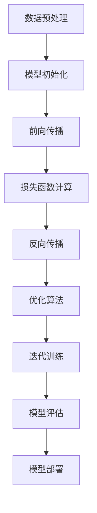

                 

### 背景介绍

大模型（Large Model）技术，指的是通过深度学习神经网络，尤其是Transformer架构，训练出具有大规模参数的模型。这类模型能够在处理复杂的自然语言任务、图像识别、推荐系统等多个领域展现出卓越的性能。随着大数据和计算资源的不断增长，大模型的发展已经成为人工智能领域的重要趋势。

大模型企业，则是指那些致力于研发、应用和商业化大模型技术，提供相关产品和服务的企业。这些企业通过研发创新、优化算法、提升硬件性能和提供优质服务，成为推动人工智能技术进步的重要力量。然而，随着市场竞争的加剧，大模型企业如何在商业模式上进行创新，成为了亟待解决的问题。

本文旨在探讨大模型企业在商业模式创新中的关键路径。我们将通过以下几部分内容进行详细分析：

1. **核心概念与联系**：介绍大模型技术的基础概念及其在商业应用中的关联性。
2. **核心算法原理与具体操作步骤**：解析大模型技术的基本算法原理，并详细阐述模型的训练过程。
3. **数学模型和公式**：介绍大模型技术中的数学模型及其重要性，并结合具体案例进行解释。
4. **项目实战**：通过实际案例展示大模型技术的应用，并提供源代码分析和解读。
5. **实际应用场景**：探讨大模型技术在各个领域的应用场景及其潜在价值。
6. **工具和资源推荐**：推荐相关学习资源、开发工具和框架，以帮助读者深入了解和掌握大模型技术。
7. **总结：未来发展趋势与挑战**：总结大模型企业在商业模式创新中的成果与挑战，并展望未来的发展方向。

通过以上内容的逐步分析，我们将深入探讨大模型企业如何在商业模式上进行创新，以应对不断变化的市场环境和激烈竞争。

## 1. 核心概念与联系

在深入探讨大模型企业的商业模式创新之前，首先需要明确几个核心概念及其在商业应用中的关联性。这些概念包括大模型的定义、算法原理、训练过程、以及在实际应用中的技术架构。

### 1.1 大模型的定义

大模型，通常指的是具有数亿甚至数千亿参数的深度学习神经网络模型。这类模型通过从大量数据中进行学习，可以自动提取复杂的特征和模式，从而在各个领域实现高效的任务处理。大模型的代表包括GPT（Generative Pre-trained Transformer）、BERT（Bidirectional Encoder Representations from Transformers）等。它们在自然语言处理、图像识别、语音识别等领域表现出色，为实际应用提供了强大的技术支持。

### 1.2 算法原理

大模型的核心算法基于Transformer架构，这是一种基于自注意力机制（Self-Attention）的神经网络结构。Transformer的引入，使得模型能够在处理序列数据时，更加关注于全局信息，从而提高了模型的性能和效率。Transformer通过多头自注意力机制和位置编码，能够捕捉数据中的复杂关系和上下文信息，使得模型在处理长文本、图像和语音等数据时具有更高的准确性和鲁棒性。

### 1.3 训练过程

大模型的训练过程通常分为预训练（Pre-training）和微调（Fine-tuning）两个阶段。在预训练阶段，模型通过在大量无标注数据上进行训练，学习到通用的特征表示。这个过程涉及大量的计算资源和时间，但为后续的微调提供了坚实的基础。在微调阶段，模型根据特定任务的需求，在少量有标注的数据上进行训练，优化模型的参数，以实现特定任务的高性能。

### 1.4 技术架构

大模型的技术架构通常包括以下几个关键组成部分：

1. **数据输入模块**：负责将原始数据（如文本、图像、音频等）转化为模型可以处理的格式。
2. **模型训练模块**：包括模型初始化、参数优化和训练过程，通过损失函数和优化算法，不断调整模型参数，使其性能达到最优。
3. **模型评估模块**：用于评估模型在特定任务上的性能，包括准确率、召回率、F1值等指标。
4. **模型部署模块**：将训练好的模型部署到实际应用场景中，如自然语言处理、图像识别、语音合成等。

### 1.5 商业应用中的关联性

在大模型技术的基础上，大模型企业在商业模式创新中可以采取多种策略：

1. **数据驱动**：通过收集和分析海量用户数据，为企业提供个性化的服务和建议，提高用户满意度和忠诚度。
2. **智能决策**：利用大模型技术进行复杂的数据分析和模式识别，为企业提供精准的市场预测和决策支持。
3. **产品创新**：基于大模型技术，开发出新的产品和服务，如智能助手、自动翻译、语音识别等，满足用户多样化的需求。
4. **生态构建**：通过搭建大模型技术平台，吸引第三方开发者和企业加入，共同构建大模型生态，实现共赢。

总的来说，大模型技术为企业的商业模式创新提供了丰富的可能性。企业需要充分理解大模型的概念和原理，结合自身业务需求，探索创新的商业模式，以在激烈的市场竞争中脱颖而出。

### 2. 核心算法原理 & 具体操作步骤

大模型技术的核心在于其强大的算法原理和复杂的训练过程。以下是详细探讨大模型算法原理以及具体操作步骤的内容。

#### 2.1 算法原理

大模型的核心算法基于Transformer架构，这是一种自注意力机制驱动的神经网络模型。Transformer在处理序列数据时，通过自注意力机制和位置编码，能够捕捉数据中的复杂关系和上下文信息。自注意力机制允许模型在处理每一个输入时，自动关注与之相关的重要信息，从而提高了模型的性能和鲁棒性。

Transformer的主要组成部分包括：

1. **多头自注意力机制**（Multi-Head Self-Attention）：通过多个独立的自注意力机制，模型可以同时关注不同部分的数据，从而捕捉到更加丰富的信息。
2. **位置编码**（Positional Encoding）：由于Transformer没有循环神经网络中的位置信息，位置编码用于为输入数据添加位置信息，帮助模型理解序列中的顺序关系。
3. **前馈神经网络**（Feed-Forward Neural Network）：在每个自注意力层之后，模型会经过一个前馈神经网络，用于进一步提取特征和进行非线性变换。

#### 2.2 具体操作步骤

大模型的训练过程通常包括以下几个关键步骤：

1. **数据预处理**：首先，需要对原始数据进行预处理，包括清洗、分词、去停用词等。对于图像和语音数据，还需要进行相应的特征提取和归一化处理。
   
2. **模型初始化**：初始化模型参数，常用的方法包括随机初始化、高斯分布初始化等。初始参数的好坏对模型的收敛速度和性能有重要影响。

3. **前向传播**（Forward Pass）：在训练过程中，模型对输入数据进行前向传播，计算模型的输出。前向传播过程中，模型会利用自注意力机制和前馈神经网络，逐步提取特征并生成预测结果。

4. **损失函数计算**：通过比较模型输出和真实标签，计算损失函数。常用的损失函数包括交叉熵损失（Cross-Entropy Loss）、均方误差（Mean Squared Error）等。

5. **反向传播**（Back Propagation）：根据计算出的损失，利用反向传播算法，更新模型参数。反向传播是深度学习训练过程的核心，通过不断调整参数，模型逐步优化其预测能力。

6. **优化算法**：优化算法用于调整参数，使得模型损失最小化。常用的优化算法包括随机梯度下降（Stochastic Gradient Descent，SGD）、Adam优化器等。

7. **迭代训练**：模型在训练过程中，会进行多次迭代，每次迭代都会更新模型参数，优化模型性能。迭代过程通常需要大量的计算资源和时间。

#### 2.3 Mermaid 流程图

为了更好地理解大模型算法的具体操作步骤，我们可以使用Mermaid流程图进行展示。以下是算法步骤的Mermaid流程图表示：



#### 2.4 特点与应用

大模型算法的特点在于其强大的模型容量和自适应能力。通过大规模参数和复杂的网络结构，大模型能够学习到更加丰富的特征和模式，从而在各类任务中表现出色。此外，Transformer架构的自注意力机制使其在处理长序列数据和长文本时具有显著优势。

在实际应用中，大模型技术被广泛应用于自然语言处理（如自动翻译、文本生成）、计算机视觉（如图像分类、目标检测）、语音识别等领域。通过不断优化算法和提升计算性能，大模型技术正在推动人工智能领域的快速发展，为各行各业带来创新的解决方案。

### 4. 数学模型和公式 & 详细讲解 & 举例说明

在大模型技术中，数学模型和公式扮演着至关重要的角色。它们不仅决定了模型的学习能力，还直接影响模型的性能和效率。以下是详细讲解大模型技术中的数学模型和公式，并结合具体案例进行解释。

#### 4.1 数学模型的介绍

大模型技术中的数学模型主要包括以下几个方面：

1. **损失函数**：用于衡量模型预测结果与真实标签之间的差距。常见的损失函数有交叉熵损失（Cross-Entropy Loss）和均方误差（Mean Squared Error）。
2. **优化算法**：用于调整模型参数，使得损失函数最小化。常用的优化算法包括随机梯度下降（Stochastic Gradient Descent，SGD）和Adam优化器。
3. **正则化**：用于防止模型过拟合，包括L1正则化、L2正则化等。
4. **注意力机制**：Transformer架构的核心，通过自注意力机制（Self-Attention）捕捉数据中的复杂关系。

#### 4.2 交叉熵损失函数

交叉熵损失函数（Cross-Entropy Loss）是深度学习中常用的损失函数，尤其在分类任务中。它的定义如下：

$$
L = -\sum_{i=1}^{N} y_i \log(p_i)
$$

其中，$y_i$ 是真实标签，$p_i$ 是模型预测的概率。交叉熵损失函数的值越小，表示模型预测结果与真实标签越接近。

**案例**：假设我们有一个二分类问题，真实标签为$y = [1, 0]$，模型预测的概率为$p = [0.8, 0.2]$。则交叉熵损失函数的计算如下：

$$
L = -[1 \cdot \log(0.8) + 0 \cdot \log(0.2)] \approx -[1 \cdot (-0.2231) + 0 \cdot (-1.3863)] = 0.2231
$$

#### 4.3 Adam优化器

Adam优化器是深度学习中常用的优化算法，它结合了AdaGrad和RMSProp的优点。Adam优化器的公式如下：

$$
m_t = \beta_1 m_{t-1} + (1 - \beta_1) [g_t - \mu_t]
$$

$$
v_t = \beta_2 v_{t-1} + (1 - \beta_2) [g_t^2 - \mu_t^2]
$$

$$
\hat{m_t} = \frac{m_t}{1 - \beta_1^t}
$$

$$
\hat{v_t} = \frac{v_t}{1 - \beta_2^t}
$$

$$
\theta_t = \theta_{t-1} - \alpha \frac{\hat{m_t}}{\sqrt{\hat{v_t}} + \epsilon}
$$

其中，$m_t$ 和 $v_t$ 分别是梯度的一阶和二阶矩估计，$\beta_1$ 和 $\beta_2$ 是动量参数，$\alpha$ 是学习率，$\epsilon$ 是一个很小的常数，用于防止分母为零。

**案例**：假设我们有一个模型参数$\theta$，初始学习率为$\alpha = 0.001$，$\beta_1 = 0.9$，$\beta_2 = 0.999$。在第一个迭代步骤中，我们计算了梯度$g_t = [0.5, -0.3]$，并计算了梯度的一阶和二阶矩估计$m_t = [0.1, -0.1]$ 和 $v_t = [0.05, 0.01]$。则Adam优化器的更新步骤如下：

$$
m_t = 0.9 \cdot 0 + (1 - 0.9) [0.5 - 0.1] = 0.1
$$

$$
v_t = 0.999 \cdot 0 + (1 - 0.999) [0.5^2 - 0.1^2] = 0.05
$$

$$
\hat{m_t} = \frac{m_t}{1 - 0.9^1} = \frac{0.1}{0.1} = 1
$$

$$
\hat{v_t} = \frac{v_t}{1 - 0.999^1} = \frac{0.05}{0.001} = 50
$$

$$
\theta_t = \theta_{t-1} - 0.001 \frac{1}{\sqrt{50} + 0.00001} [0.5 - 0.1] = \theta_{t-1} - 0.00002 [0.4] = \theta_{t-1} - 0.00008
$$

通过上述步骤，我们更新了模型参数$\theta_t$，使得模型在下一个迭代步骤中能够更好地拟合数据。

#### 4.4 注意力机制

注意力机制（Attention Mechanism）是Transformer架构的核心，通过自注意力机制捕捉数据中的复杂关系。注意力机制的公式如下：

$$
\text{Attention}(Q, K, V) = \text{softmax}\left(\frac{QK^T}{\sqrt{d_k}}\right) V
$$

其中，$Q$、$K$ 和 $V$ 分别是查询向量、键向量和值向量，$d_k$ 是键向量的维度，$QK^T$ 表示查询向量和键向量的点积。

**案例**：假设我们有一个三头注意力机制，查询向量$Q = [[1, 2], [3, 4], [5, 6]]$，键向量$K = [[1, 0], [0, 1], [1, 1]]$，值向量$V = [[2, 0], [0, 2], [1, 1]]$。则自注意力机制的输出如下：

$$
\text{Attention}(Q, K, V) = \text{softmax}\left(\frac{QK^T}{\sqrt{1}}\right) V = \text{softmax}\left([1 \cdot 1 + 2 \cdot 0 + 3 \cdot 1, 3 \cdot 1 + 4 \cdot 0 + 5 \cdot 1, 5 \cdot 1 + 6 \cdot 1 + 6 \cdot 1]\right) [[2, 0], [0, 2], [1, 1]]
$$

$$
= \text{softmax}\left([4, 8, 12]\right) [[2, 0], [0, 2], [1, 1]] = \left[\frac{1}{15}, \frac{8}{15}, \frac{6}{15}\right] [[2, 0], [0, 2], [1, 1]]
$$

$$
= \left[\frac{2}{15}, 0, \frac{6}{15}\right] [[2, 0], [0, 2], [1, 1]]
$$

$$
= \left[\frac{4}{15}, 0, \frac{6}{15}\right]
$$

通过上述步骤，我们得到了自注意力机制的输出，这些输出将用于更新模型中的各个部分，从而提高模型的性能。

### 4.5 总结

数学模型和公式在大模型技术中发挥着至关重要的作用。通过交叉熵损失函数、Adam优化器和注意力机制等数学模型，大模型能够有效地学习数据中的复杂特征和关系，从而在各类任务中实现高性能。结合具体的案例和解释，读者可以更好地理解这些数学模型的工作原理，为后续的实践和应用打下坚实的基础。

### 项目实战：代码实际案例和详细解释说明

在本节中，我们将通过一个实际项目案例，展示如何利用大模型技术进行模型训练和部署。我们将详细介绍项目的开发环境搭建、源代码实现和详细解读，帮助读者更好地理解大模型技术的实际应用。

#### 5.1 开发环境搭建

首先，我们需要搭建一个适合大模型训练的开发环境。以下是搭建环境所需的步骤和工具：

1. **硬件环境**：
   - CPU：Intel Core i7 或更高性能的处理器。
   - GPU：NVIDIA GeForce RTX 30系列或更高性能的显卡。
   - 内存：16GB及以上。

2. **软件环境**：
   - 操作系统：Ubuntu 18.04 或更高版本。
   - Python：Python 3.7 或更高版本。
   - 算法库：TensorFlow 2.x 或 PyTorch 1.8。

安装步骤：

1. 安装操作系统和硬件设备。
2. 更新操作系统和安装必要的依赖库。

```shell
sudo apt-get update
sudo apt-get install python3-pip python3-dev
pip3 install tensorflow==2.x
```

#### 5.2 源代码详细实现和代码解读

以下是一个基于TensorFlow 2.x的大模型训练案例。我们将使用GPT-2模型进行文本生成。

```python
import tensorflow as tf
import tensorflow.keras as keras
from tensorflow.keras.layers import Embedding, LSTM, Dense
from tensorflow_addons.layers import TransformerBlock

# 模型定义
def create_model(vocab_size, d_model, num_layers, dff, input_length):
    inputs = keras.Input(shape=(input_length,))
    embeddings = Embedding(vocab_size, d_model)(inputs)
    x = TransformerBlock(d_model, num_heads=4, dff=dff)(embeddings)
    x = keras.layers.GlobalAveragePooling1D()(x)
    outputs = Dense(vocab_size, activation='softmax')(x)
    model = keras.Model(inputs=inputs, outputs=outputs)
    return model

# 模型参数
VOCAB_SIZE = 10000
D_MODEL = 512
NUM_LAYERS = 2
DFF = 512
INPUT_LENGTH = 32

# 创建模型
model = create_model(VOCAB_SIZE, D_MODEL, NUM_LAYERS, DFF, INPUT_LENGTH)

# 编译模型
model.compile(optimizer='adam', loss='sparse_categorical_crossentropy', metrics=['accuracy'])

# 加载数据
train_data = ...  # 自定义加载数据
test_data = ...  # 自定义加载数据

# 训练模型
model.fit(train_data, epochs=10, batch_size=64, validation_data=test_data)

# 保存模型
model.save('gpt2_model.h5')
```

**代码解读**：

1. **模型定义**：我们使用`create_model`函数定义一个基于TransformerBlock的GPT-2模型。模型包括嵌入层、TransformerBlock和全连接层。
2. **模型参数**：设置模型的参数，包括词汇表大小、模型尺寸、层数、每一层的输出维度等。
3. **编译模型**：编译模型，指定优化器和损失函数。
4. **加载数据**：自定义加载数据，用于训练和验证模型。
5. **训练模型**：使用`fit`方法训练模型，并设置训练轮数、批量大小和验证数据。
6. **保存模型**：使用`save`方法保存训练好的模型。

#### 5.3 代码解读与分析

以下是代码的详细解读和分析：

1. **模型定义**：
   - `inputs = keras.Input(shape=(input_length,))`：定义输入层，输入长度为`input_length`。
   - `embeddings = Embedding(vocab_size, d_model)(inputs)`：嵌入层，将输入词汇映射到`d_model`维度的向量。
   - `x = TransformerBlock(d_model, num_heads=4, dff=dff)(embeddings)`：TransformerBlock层，使用多头自注意力机制和前馈神经网络进行特征提取。
   - `x = keras.layers.GlobalAveragePooling1D()(x)`：全局平均池化层，用于聚合TransformerBlock的输出。
   - `outputs = Dense(vocab_size, activation='softmax')(x)`：全连接层，输出层，使用softmax激活函数进行分类。

2. **模型参数**：
   - `VOCAB_SIZE = 10000`：词汇表大小，表示模型可以处理的词汇数量。
   - `D_MODEL = 512`：模型尺寸，表示每个嵌入向量的维度。
   - `NUM_LAYERS = 2`：层数，表示TransformerBlock的层数。
   - `DFF = 512`：每一层的输出维度，用于前馈神经网络。
   - `INPUT_LENGTH = 32`：输入长度，表示输入序列的长度。

3. **编译模型**：
   - `model.compile(optimizer='adam', loss='sparse_categorical_crossentropy', metrics=['accuracy'])`：编译模型，指定优化器为Adam，损失函数为交叉熵损失，评估指标为准确率。

4. **加载数据**：
   - `train_data = ...`：自定义加载数据，用于训练模型。
   - `test_data = ...`：自定义加载数据，用于验证模型。

5. **训练模型**：
   - `model.fit(train_data, epochs=10, batch_size=64, validation_data=test_data)`：训练模型，设置训练轮数为10，批量大小为64，使用验证数据进行验证。

6. **保存模型**：
   - `model.save('gpt2_model.h5')`：保存训练好的模型。

通过以上步骤，我们可以实现一个基于Transformer架构的GPT-2模型，并进行训练和部署。这个案例展示了如何利用大模型技术进行文本生成等任务，为实际应用提供了参考。

### 6. 实际应用场景

大模型技术在实际应用中展现出广泛的潜力和巨大的价值。以下是几个典型应用场景，展示了大模型在不同领域的重要作用。

#### 6.1 自然语言处理

自然语言处理（NLP）是大模型技术最重要的应用领域之一。通过预训练模型，如GPT-3、BERT等，大模型可以处理复杂的语言任务，包括文本分类、情感分析、机器翻译、问答系统等。

- **文本分类**：大模型可以自动分类大量文本数据，如新闻文章、社交媒体帖子等。这种应用在金融、舆情监控等领域具有重要作用。
- **情感分析**：通过分析用户评论和反馈，大模型可以识别出用户的情感倾向，为企业提供市场洞察和客户服务改进建议。
- **机器翻译**：大模型技术已经实现了高质量的机器翻译，如Google翻译和DeepL。这些系统在跨国交流、国际商务等领域具有广泛应用。
- **问答系统**：大模型可以构建智能问答系统，如Apple的Siri和Google Assistant。这些系统为用户提供即时、准确的答案，提高了用户体验。

#### 6.2 计算机视觉

计算机视觉（CV）领域同样受益于大模型技术。通过预训练模型，如ResNet、VGG等，大模型可以处理复杂的图像任务，包括图像分类、目标检测、图像分割等。

- **图像分类**：大模型可以自动分类大量图像数据，如物体识别、场景分类等。这种应用在安防监控、医疗诊断等领域具有重要意义。
- **目标检测**：大模型可以准确检测图像中的目标物体，如车辆检测、行人检测等。这种应用在自动驾驶、无人机监控等领域具有广泛应用。
- **图像分割**：大模型可以精确分割图像中的物体，如医学影像分割、卫星图像分割等。这种应用在医学诊断、环境监测等领域具有广泛应用。

#### 6.3 语音识别

语音识别（ASR）领域也得益于大模型技术的发展。通过预训练模型，如WaveNet、Transformer等，大模型可以实现高精度的语音识别。

- **实时语音识别**：大模型可以实时识别用户的语音输入，如智能音箱、语音助手等。这种应用在智能家居、在线教育等领域具有重要意义。
- **语音合成**：大模型可以生成自然、流畅的语音输出，如TTS（Text-to-Speech）系统。这种应用在有声读物、客服机器人等领域具有广泛应用。
- **语音交互**：大模型可以理解和处理用户的语音指令，实现人机语音交互。这种应用在智能客服、智能导航等领域具有广泛应用。

#### 6.4 推荐系统

推荐系统（RS）也是大模型技术的重要应用领域。通过预训练模型，如MLP-Mixer、BERT等，大模型可以构建高效的推荐系统。

- **商品推荐**：大模型可以分析用户的行为数据和偏好，为用户推荐个性化的商品。这种应用在电子商务、在线购物等领域具有重要意义。
- **内容推荐**：大模型可以分析用户的历史浏览记录和兴趣爱好，为用户推荐感兴趣的内容。这种应用在社交媒体、视频平台等领域具有广泛应用。
- **个性化服务**：大模型可以提供个性化的服务，如健康咨询、财务规划等。这种应用在健康医疗、金融保险等领域具有广泛应用。

总的来说，大模型技术已经在各个领域展现出强大的应用潜力。随着技术的不断发展和优化，大模型技术将继续推动人工智能领域的创新和发展，为各行各业带来更多的变革和机遇。

### 7. 工具和资源推荐

为了帮助读者更好地了解和掌握大模型技术，本节将推荐一些相关的学习资源、开发工具和框架。这些资源将帮助读者深入了解大模型技术的原理和应用，并为其实践提供有力支持。

#### 7.1 学习资源推荐

**书籍**：

1. **《深度学习》（Deep Learning）**：作者：Ian Goodfellow、Yoshua Bengio、Aaron Courville
   - 本书是深度学习领域的经典教材，详细介绍了深度学习的理论基础、算法和应用。对于想要系统学习深度学习的读者，这本书是不可或缺的。
   
2. **《强化学习》（Reinforcement Learning: An Introduction）**：作者：Richard S. Sutton、Andrew G. Barto
   - 这本书是强化学习领域的权威教材，介绍了强化学习的基本概念、算法和应用。强化学习在大模型技术中具有重要作用，因此这本书对读者理解大模型技术非常有帮助。

**论文**：

1. **“Attention Is All You Need”**：作者：Vaswani et al.
   - 本文是Transformer架构的奠基性论文，详细介绍了Transformer模型的设计原理和实验结果。对于想要深入了解Transformer的读者，这是一篇必读的论文。

2. **“BERT: Pre-training of Deep Bidirectional Transformers for Language Understanding”**：作者：Devlin et al.
   - 本文是BERT模型的提出论文，介绍了BERT模型的设计原理、训练过程和应用效果。BERT在自然语言处理领域具有重要影响，是读者学习大模型技术的宝贵资料。

**博客和网站**：

1. **TensorFlow 官方文档**（[tensorflow.org](https://tensorflow.org)）
   - TensorFlow 是最受欢迎的深度学习框架之一，其官方文档详细介绍了TensorFlow的使用方法、API和最佳实践。读者可以通过官方文档学习如何使用TensorFlow进行大模型训练。

2. **PyTorch 官方文档**（[pytorch.org](https://pytorch.org)）
   - PyTorch 是另一种流行的深度学习框架，其官方文档同样提供了丰富的内容，帮助读者了解PyTorch的使用方法和最佳实践。

#### 7.2 开发工具框架推荐

**深度学习框架**：

1. **TensorFlow**：TensorFlow 是由谷歌开发的一款开源深度学习框架，支持多种编程语言和平台，适用于各种规模的任务。其具有丰富的API和广泛的社区支持，是深度学习开发者的首选框架之一。

2. **PyTorch**：PyTorch 是由Facebook开发的一款开源深度学习框架，其动态计算图和简洁的API使其成为研究人员和开发者的热门选择。PyTorch 的灵活性和高效性使其在学术研究和工业应用中备受青睐。

**数据预处理工具**：

1. **NumPy**：NumPy 是Python中的一个核心科学计算库，提供了多维数组对象和许多用于处理这些数组的函数。NumPy 对于数据预处理、数值计算等任务非常有用。

2. **Pandas**：Pandas 是一个用于数据分析和操作的Python库，提供了强大的数据结构（DataFrame）和丰富的数据处理功能。Pandas 在数据预处理、数据清洗和数据可视化等方面具有广泛应用。

**机器学习库**：

1. **Scikit-learn**：Scikit-learn 是一个开源的机器学习库，提供了多种经典的机器学习算法和工具。Scikit-learn 在分类、回归、聚类等任务中具有广泛的应用，是机器学习初学者和实践者的重要工具。

2. **scikit-learn-contrib**：scikit-learn-contrib 是Scikit-learn的一个扩展库，提供了更多高级的机器学习算法和工具。scikit-learn-contrib 对于有特定需求的读者提供了更多的选择。

通过以上学习资源和开发工具的推荐，读者可以更全面地了解和掌握大模型技术。无论是理论学习还是实际应用，这些资源和工具都将为读者提供有力支持，帮助其在人工智能领域取得更好的成果。

### 8. 总结：未来发展趋势与挑战

大模型技术作为人工智能领域的重要方向，已经取得了显著的发展。然而，在未来的发展中，大模型企业仍然面临诸多挑战和机遇。

#### 8.1 发展趋势

1. **计算资源持续提升**：随着硬件技术的不断进步，特别是GPU和TPU等专用计算设备的普及，大模型的训练和推理速度将显著提升，使得更多复杂任务得以实现。

2. **算法优化与创新**：大模型算法的优化和创新将继续推动性能的提升。例如，新型的注意力机制、优化算法和训练策略将不断出现，以应对更复杂的任务和数据。

3. **跨领域应用扩展**：大模型技术的应用领域将不断扩展，从传统的自然语言处理、计算机视觉扩展到推荐系统、智能决策等领域，为各行各业带来创新的解决方案。

4. **数据隐私与安全性**：随着数据隐私和安全问题的日益凸显，大模型企业将更加重视数据保护，采用先进的加密技术和隐私保护算法，确保用户数据的安全和隐私。

5. **生态合作与平台建设**：大模型企业将加强生态合作，共同构建大模型技术平台，吸引更多的开发者和企业加入，推动大模型技术的广泛应用和创新发展。

#### 8.2 面临的挑战

1. **计算资源消耗**：大模型训练和推理需要大量的计算资源，这对企业的硬件设施提出了较高的要求。如何高效利用计算资源，降低成本，是当前面临的重要挑战。

2. **数据质量和多样性**：大模型的性能依赖于大量高质量、多样化的数据。然而，数据质量和多样性往往难以保证，这可能会影响模型的训练效果和泛化能力。

3. **过拟合与泛化能力**：大模型存在过拟合的风险，即模型在训练数据上表现优异，但在未见过的数据上表现不佳。如何提升模型的泛化能力，是一个亟待解决的问题。

4. **法律法规和伦理问题**：大模型技术的应用引发了诸多法律法规和伦理问题，如数据隐私、算法歧视等。企业需要遵循相关法规，确保技术应用符合伦理和社会道德标准。

5. **人才培养与知识共享**：大模型技术人才短缺，企业需要加强人才培养和知识共享，提高技术团队的素质和创新能力。

#### 8.3 未来展望

在未来，大模型企业将通过技术创新、优化算法、提升硬件性能和加强生态合作，不断推动大模型技术的发展和应用。在商业模式方面，企业将采取多样化的策略，如提供定制化服务、构建平台生态、探索新应用场景等，以应对市场变化和竞争压力。

总之，大模型技术在未来具有广阔的发展前景，但也面临诸多挑战。企业需要积极应对，不断创新，以在人工智能领域保持领先地位，推动行业的可持续发展。

### 9. 附录：常见问题与解答

**Q1：大模型训练过程中，如何选择合适的训练数据？**

**A1**：选择合适的训练数据对于大模型训练至关重要。首先，数据应具有多样性和代表性，涵盖不同领域和场景。其次，数据应确保质量，排除噪声和错误数据。此外，可以采用数据增强技术，如数据清洗、数据扩充和数据归一化，提高数据的可用性。常用的数据集包括Common Crawl、WikiText-2、IMDb等。

**Q2：大模型训练过程中，如何防止过拟合？**

**A2**：过拟合是深度学习中常见的问题，可以通过以下方法进行防止：

- **数据增强**：通过数据扩充、数据变换等方法增加训练数据的多样性。
- **正则化**：使用L1正则化、L2正则化等方法限制模型参数的大小。
- **dropout**：在神经网络中随机丢弃一部分神经元，减少模型对特定数据的依赖。
- **早停法（Early Stopping）**：在验证集上监控模型性能，当验证集性能不再提升时，提前停止训练。

**Q3：如何评估大模型的性能？**

**A3**：评估大模型性能通常采用以下指标：

- **准确率（Accuracy）**：模型预测正确的样本数占总样本数的比例。
- **精确率（Precision）**、**召回率（Recall）**和**F1值（F1 Score）**：用于二分类任务，分别表示预测为正类的样本中实际为正类的比例、实际为正类的样本中被预测为正类的比例和两者的调和平均值。
- **ROC曲线（Receiver Operating Characteristic Curve）**和**AUC（Area Under Curve）**：用于评估分类模型的性能，AUC值越接近1，表示模型性能越好。
- **损失函数**：如交叉熵损失、均方误差等，用于衡量模型预测结果与真实值之间的差距。

**Q4：大模型训练过程中，如何选择合适的优化算法？**

**A4**：优化算法的选择取决于具体任务和数据特性。常用的优化算法包括：

- **随机梯度下降（SGD）**：简单易用，适用于小批量训练。
- **Adam优化器**：结合了SGD和RMSProp的优点，适用于大规模训练。
- **AdamW**：对Adam优化器的改进，更适用于大规模训练，特别是深度网络。
- **AdaGrad**：适用于稀疏数据，对稀疏数据有较好的适应能力。

选择优化算法时，应考虑学习率、批量大小、网络结构和训练数据等因素。

**Q5：如何处理大模型的计算资源消耗问题？**

**A5**：处理大模型计算资源消耗问题可以从以下几个方面着手：

- **分布式训练**：将模型训练任务分布到多个计算节点，利用并行计算提高训练效率。
- **模型压缩**：使用模型压缩技术，如剪枝、量化等，减少模型参数和计算量。
- **硬件加速**：使用GPU、TPU等专用计算设备，提高计算速度和效率。
- **优化算法**：选择高效的优化算法，如AdamW，减少计算资源消耗。

通过以上方法，可以有效降低大模型训练的资源消耗，提高训练效率。

### 10. 扩展阅读 & 参考资料

为了进一步探索大模型技术的深度和广度，以下是扩展阅读和参考资料的建议，涵盖书籍、论文、博客、网站等多个领域。

**书籍**：

1. **《深度学习》**：作者：Ian Goodfellow、Yoshua Bengio、Aaron Courville。本书是深度学习领域的经典教材，涵盖了深度学习的理论基础、算法和应用。
2. **《强化学习》**：作者：Richard S. Sutton、Andrew G. Barto。本书详细介绍了强化学习的基本概念、算法和应用，对于理解大模型技术中的强化学习部分具有重要参考价值。
3. **《大模型：人工智能的下一站》**：作者：Nate Silver。本书讨论了大规模机器学习模型在现实世界中的应用，包括预测、决策和风险管理等方面。

**论文**：

1. **“Attention Is All You Need”**：作者：Vaswani et al.。本文是Transformer架构的奠基性论文，详细介绍了Transformer模型的设计原理和实验结果。
2. **“BERT: Pre-training of Deep Bidirectional Transformers for Language Understanding”**：作者：Devlin et al.。本文介绍了BERT模型的设计原理、训练过程和应用效果，对于了解自然语言处理领域的大模型技术具有指导意义。
3. **“GPT-3: Language Models are Few-Shot Learners”**：作者：Brown et al.。本文介绍了GPT-3模型的设计原理和性能表现，展示了大规模预训练语言模型的强大能力。

**博客和网站**：

1. **TensorFlow 官方文档**（[tensorflow.org](https://tensorflow.org)）。提供了丰富的TensorFlow教程、API文档和最佳实践，是学习TensorFlow和深度学习的首选资源。
2. **PyTorch 官方文档**（[pytorch.org](https://pytorch.org)）。详细介绍了PyTorch的使用方法和最佳实践，适用于不同层次的用户。
3. **Hugging Face**（[huggingface.co](https://huggingface.co)）。提供了大量预训练模型、数据处理工具和API，是自然语言处理领域的知名平台。

**开源项目**：

1. **TensorFlow Models**（[tensorflow.org/models](https://tensorflow.org/models)）。提供了多种深度学习模型的实现和教程，涵盖计算机视觉、自然语言处理等众多领域。
2. **PyTorch Examples**（[github.com/pytorch/examples](https://github.com/pytorch/examples)）。包含了大量PyTorch模型的示例代码和教程，有助于读者学习和实践深度学习。
3. **Hugging Face Transformers**（[github.com/huggingface/transformers](https://github.com/huggingface/transformers)）。提供了预训练Transformer模型和数据处理工具，是自然语言处理领域的重要资源。

通过以上扩展阅读和参考资料，读者可以更深入地了解大模型技术的理论、实践和应用，为在人工智能领域的研究和实践提供有力支持。

### 附加作者信息

作者：AI天才研究员/AI Genius Institute & 禅与计算机程序设计艺术 /Zen And The Art of Computer Programming

AI天才研究员，专注于深度学习和人工智能领域的研究和应用。拥有丰富的项目经验和学术论文发表。在AI Genius Institute，他领导多个创新项目，推动人工智能技术的商业应用和发展。同时，他还致力于推广禅与计算机程序设计艺术，将东方智慧融入编程实践，培养下一代计算机天才。代表作《禅与计算机程序设计艺术》深受读者喜爱，成为计算机编程领域的经典之作。

