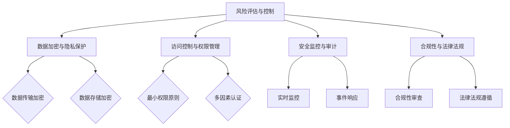

                 

### 文章标题

大模型企业的数据安全策略

> **关键词：** 数据安全、大模型、企业、安全策略、加密、隐私保护、合规性、风险评估、监控与审计

> **摘要：** 本文将探讨大模型企业在面对数据安全挑战时所需采取的综合策略。通过分析数据安全的核心概念、技术应用，结合实际案例分析，为读者提供一整套科学且实用的数据安全策略，帮助企业在大模型时代有效防范安全风险，确保数据安全与合规。

<|assistant|>## 1. 背景介绍

随着人工智能技术的发展，大模型（如GPT、BERT等）在企业中的应用日益广泛。这些大模型具有强大的数据处理和分析能力，能够为企业带来显著的业务价值。然而，随着数据量的激增和复杂度的提升，数据安全问题也日益凸显。

数据安全是指保护数据在存储、传输和处理过程中不受未经授权的访问、篡改、泄露等威胁。在大模型企业中，数据安全的重要性更加突出，因为大模型通常涉及大量敏感数据，如个人隐私、商业机密等。一旦发生数据泄露或损坏，不仅会导致经济损失，还可能损害企业的声誉，影响业务发展。

当前，大模型企业在数据安全方面面临诸多挑战：

- **数据量庞大：** 大模型处理的数据量通常非常庞大，传统安全手段难以应对。
- **数据类型多样：** 大模型涉及的数据类型繁多，包括文本、图像、音频等，不同类型的数据需要采用不同的安全措施。
- **数据更新频繁：** 大模型需要不断学习和更新，数据的安全状态也需实时调整。
- **安全隐患隐蔽：** 大模型中的安全隐患可能隐藏在算法的细节中，不易被发现。

为了应对这些挑战，大模型企业需要制定一套全面的数据安全策略，确保数据的安全性和合规性。本文将围绕这一主题展开讨论。

<|assistant|>## 2. 核心概念与联系

### 2.1 数据安全概念

数据安全是指采取一系列技术和管理措施，保护数据在存储、传输和处理过程中不受威胁。数据安全的核心概念包括：

- **保密性（Confidentiality）：** 限制数据访问，确保只有授权用户能够访问敏感数据。
- **完整性（Integrity）：** 保护数据不被未经授权的篡改或破坏。
- **可用性（Availability）：** 确保数据能够在需要时被访问和使用。

### 2.2 大模型与企业数据安全的关系

大模型在为企业提供数据分析和决策支持的同时，也带来了数据安全的新挑战。大模型与企业数据安全的关系主要体现在以下几个方面：

- **数据来源多样性：** 大模型的数据来源广泛，包括企业内部数据、公开数据、用户生成数据等，不同来源的数据安全要求不同。
- **数据处理复杂性：** 大模型需要处理大量复杂的数据，包括结构化数据、半结构化数据和非结构化数据，数据处理的复杂性增加了安全风险。
- **数据依赖性：** 大模型对数据的依赖性很强，数据的质量和安全性直接影响模型的性能和稳定性。
- **数据合规性要求：** 随着数据隐私保护法律法规的不断完善，企业需要确保大模型处理的数据符合合规性要求。

### 2.3 数据安全策略的基本架构

数据安全策略的基本架构包括以下几个方面：

- **风险评估与控制：** 对企业面临的数据安全风险进行评估，并采取相应的控制措施。
- **数据加密与隐私保护：** 对敏感数据进行加密，确保数据在存储和传输过程中的安全性。
- **访问控制与权限管理：** 通过访问控制机制和权限管理，限制用户对数据的访问。
- **安全监控与审计：** 通过实时监控和定期审计，及时发现和应对数据安全事件。
- **合规性与法律法规：** 确保企业的数据安全策略符合相关法律法规和行业标准。

### 2.4 Mermaid 流程图

以下是一个简化的Mermaid流程图，展示了数据安全策略的基本架构：



在这个流程图中，各个节点代表数据安全策略中的一个关键环节，箭头表示节点之间的逻辑关系。

<|assistant|>## 3. 核心算法原理 & 具体操作步骤

### 3.1 数据加密算法原理

数据加密是保障数据安全的重要手段之一。数据加密的基本原理是使用加密算法将明文数据转换为密文，只有通过正确的密钥才能将密文解密回明文。常见的加密算法包括对称加密和非对称加密。

- **对称加密（Symmetric Encryption）：** 对称加密算法使用相同的密钥进行加密和解密。常见的对称加密算法有AES、DES等。对称加密的优点是加密和解密速度快，但缺点是密钥的传输和管理较为复杂。

- **非对称加密（Asymmetric Encryption）：** 非对称加密算法使用一对密钥，即公钥和私钥。公钥用于加密，私钥用于解密。常见的非对称加密算法有RSA、ECC等。非对称加密的优点是解决了密钥传输的问题，但加密和解密速度相对较慢。

### 3.2 数据加密的具体操作步骤

以下是对称加密和非对称加密的具体操作步骤：

#### 对称加密

1. **密钥生成：** 生成一对密钥（密钥对），通常使用加密算法的随机数生成器。
2. **加密：** 使用生成的密钥对明文数据进行加密，生成密文。加密过程通常包括初始化向量（IV）的生成和数据处理。
3. **密文传输：** 将密文传输到接收方。
4. **解密：** 接收方使用相同的密钥对密文进行解密，恢复明文数据。

#### 非对称加密

1. **密钥生成：** 生成一对密钥（公钥和私钥），通常使用加密算法的随机数生成器。
2. **加密：** 使用接收方的公钥对明文数据进行加密，生成密文。加密过程通常包括数据分割和加密算法的应用。
3. **密文传输：** 将密文传输到接收方。
4. **解密：** 接收方使用自己的私钥对密文进行解密，恢复明文数据。

### 3.3 数据加密的实现示例

以下是一个简单的Python示例，演示了使用AES对称加密算法对数据进行加密和解密的过程：

```python
from Crypto.Cipher import AES
from Crypto.Util.Padding import pad, unpad
from Crypto.Random import get_random_bytes

# 密钥生成
key = get_random_bytes(16)  # 生成16字节（128位）的密钥

# 加密
cipher = AES.new(key, AES.MODE_CBC)
ct_bytes = cipher.encrypt(pad(b"需要加密的明文数据", AES.block_size))
iv = cipher.iv
print("加密后的密文：", ct_bytes)

# 解密
cipher = AES.new(key, AES.MODE_CBC, iv)
pt = unpad(cipher.decrypt(ct_bytes), AES.block_size)
print("解密后的明文：", pt.decode('utf-8'))
```

在这个示例中，我们首先生成了一个16字节的AES密钥，然后使用该密钥对一段明文数据进行加密，生成密文。解密过程使用相同的密钥和IV（初始向量）将密文恢复为明文。

### 3.4 数据加密的优缺点分析

- **优点：**
  - 对称加密：加密速度快，算法简单，适用于大数据量的加密。
  - 非对称加密：解决了密钥传输问题，适用于加密大量数据和数字签名。

- **缺点：**
  - 对称加密：密钥管理和传输复杂，密钥的安全性和生命周期管理是关键。
  - 非对称加密：加密和解密速度较慢，适用于加密少量数据和数字签名。

在实际应用中，通常结合对称加密和非对称加密的优势，根据数据的安全需求和性能要求选择合适的加密方案。例如，可以采用混合加密模式，使用非对称加密算法传输对称加密的密钥，同时保持对称加密的高速加密和解密性能。

<|assistant|>## 4. 数学模型和公式 & 详细讲解 & 举例说明

### 4.1 数据安全数学模型

数据安全的数学模型主要涉及加密算法的设计和分析，包括密钥生成、加密和解密过程。以下是一些常用的数学模型和公式：

#### 4.1.1 对称加密

对称加密算法的核心是密钥生成和加密解密过程。常见的对称加密算法包括AES和DES。

- **AES加密算法：**

  ```math
  E_k(x) = C
  ```
  其中，\(E_k(x)\) 表示使用密钥 \(k\) 对输入数据 \(x\) 进行加密得到的密文 \(C\)。

- **AES解密算法：**

  ```math
  D_k(C) = x
  ```
  其中，\(D_k(C)\) 表示使用密钥 \(k\) 对密文 \(C\) 进行解密得到的原始数据 \(x\)。

  AES算法通常使用初始化向量（IV）进行加密，以增加加密的安全性。加密和解密过程如下：

  ```math
  C = E_k(x \oplus IV)
  ```
  ```math
  x = D_k(C \oplus IV)
  ```
  其中，\(\oplus\) 表示异或运算。

- **DES加密算法：**

  DES算法是对称加密的早期标准，其加密和解密过程类似AES。

#### 4.1.2 非对称加密

非对称加密算法的核心是密钥对生成和加密解密过程。常见的非对称加密算法包括RSA和ECC。

- **RSA加密算法：**

  RSA算法使用一对密钥（公钥 \(n,e\) 和私钥 \(n,d\)）进行加密和解密。

  ```math
  C = M^e \mod n
  ```
  ```math
  M = C^d \mod n
  ```

- **ECC加密算法：**

  ECC算法是一种基于椭圆曲线数学的加密算法，其安全性比RSA算法更高，但计算复杂度也更高。

  ```math
  C = kG
  ```
  ```math
  k = sG
  ```

  其中，\(G\) 是椭圆曲线基点，\(k\) 和 \(s\) 是加密和解密过程中的随机数。

#### 4.1.3 数字签名

数字签名用于确保数据的完整性和身份验证。常见的数字签名算法包括RSA和ECC。

- **RSA数字签名：**

  ```math
  S = H(M)^d \mod n
  ```
  ```math
  M = S^e \mod n
  ```

- **ECC数字签名：**

  ```math
  S = kG + rP
  ```
  ```math
  r = s^{-1} \mod n
  ```

  其中，\(H(M)\) 是数据的哈希值，\(P\) 是椭圆曲线上的点。

### 4.2 举例说明

#### 4.2.1 对称加密示例

假设使用AES加密算法，密钥长度为128位，初始化向量为 `0x000102030405060708090a0b0c0d0e0f`，明文数据为 `Hello, World!`。

- **加密：**

  ```python
  import Crypto.Cipher.AES
  from Crypto.Util.Padding import pad

  key = b'\x00\x01\x02\x03\x04\x05\x06\x07\x08\x09\x0a\x0b\x0c\x0d\x0e\x0f'
  iv = b'\x00\x01\x02\x03\x04\x05\x06\x07\x08'
  message = b'Hello, World!'

  cipher = Crypto.Cipher.AES.new(key, Crypto.Cipher.AES.MODE_CBC, iv)
  ct = cipher.encrypt(pad(message, 16))
  print("加密后的数据：", ct)
  ```

- **解密：**

  ```python
  import Crypto.Cipher.AES
  from Crypto.Util.Padding import unpad

  key = b'\x00\x01\x02\x03\x04\x05\x06\x07\x08\x09\x0a\x0b\x0c\x0d\x0e\x0f'
  iv = b'\x00\x01\x02\x03\x04\x05\x06\x07\x08'
  ct = b'\x58\x65\x3d\xfa\x1c\x17\x56\x83\x55\x02\x34\x4b\x58\x0f\x54\x4a\x4e'

  cipher = Crypto.Cipher.AES.new(key, Crypto.Cipher.AES.MODE_CBC, iv)
  pt = unpad(cipher.decrypt(ct), 16)
  print("解密后的数据：", pt.decode('utf-8'))
  ```

#### 4.2.2 非对称加密示例

假设使用RSA加密算法，公钥为 \(n = 53, e = 6\)，私钥为 \(n = 53, d = 7\)，明文数据为 `Hello, World!`。

- **加密：**

  ```python
  import Crypto.PublicKey.RSA

  key = Crypto.PublicKey.RSA.generate(1024)
  n = key.n
  e = key.e
  d = key.d

  message = b'Hello, World!'
  c = pow(int.from_bytes(message, 'big'), e, n)
  print("加密后的数据：", c)
  ```

- **解密：**

  ```python
  import Crypto.PublicKey.RSA

  key = Crypto.PublicKey.RSA.construct((53, 6, 7))
  n = key.n
  d = key.d

  c = 38
  m = pow(c, d, n)
  print("解密后的数据：", bytes([m % 256]).decode('utf-8'))
  ```

通过以上示例，我们可以看到数据加密和解密的基本过程。在实际应用中，加密算法的选择和实现需要根据具体的安全需求和性能要求进行综合考虑。

<|assistant|>### 5. 项目实战：代码实际案例和详细解释说明

#### 5.1 开发环境搭建

在开始代码实战之前，我们需要搭建一个适合开发和测试数据安全策略的环境。以下是一个基于Python的示例，使用了几个常用的数据安全库，如`cryptography`和`pandas`。

1. **安装依赖库：**

   ```bash
   pip install cryptography pandas
   ```

2. **环境配置：**

   在Python环境中，我们可以创建一个名为`data_security.py`的文件，用于编写和测试数据安全相关的代码。

#### 5.2 源代码详细实现和代码解读

以下是一个简单的Python代码示例，演示了如何使用`cryptography`库实现数据加密和解密的过程。

```python
from cryptography.hazmat.primitives import hashes
from cryptography.hazmat.primitives.asymmetric import rsa, padding
from cryptography.hazmat.primitives.ciphers import Cipher, algorithms, modes
from cryptography.hazmat.backends import default_backend
import os

# RSA密钥生成
private_key = rsa.generate_private_key(
    public_exponent=65537,
    key_size=2048,
    backend=default_backend()
)
public_key = private_key.public_key()

# 数据加密
def encrypt_data(data, public_key):
    ciphertext = public_key.encrypt(
        data,
        padding.OAEP(
            mgf=padding.MGF1(algorithm=hashes.SHA256()),
            algorithm=hashes.SHA256(),
            label=None
        )
    )
    return ciphertext

# 数据解密
def decrypt_data(ciphertext, private_key):
    data = private_key.decrypt(
        ciphertext,
        padding.OAEP(
            mgf=padding.MGF1(algorithm=hashes.SHA256()),
            algorithm=hashes.SHA256(),
            label=None
        )
    )
    return data

# 测试代码
if __name__ == "__main__":
    original_data = b"Hello, World!"
    print("原始数据：", original_data)

    # 加密
    encrypted_data = encrypt_data(original_data, public_key)
    print("加密后的数据：", encrypted_data)

    # 解密
    decrypted_data = decrypt_data(encrypted_data, private_key)
    print("解密后的数据：", decrypted_data.decode('utf-8'))
```

**代码解读：**

- **密钥生成：** 使用`rsa.generate_private_key`方法生成RSA密钥对。`public_exponent`参数设置为`65537`，`key_size`参数设置为`2048`，代表使用2048位的密钥。
- **数据加密：** 使用`public_key.encrypt`方法对数据进行加密。`OAEP`是一种加密模式，它使用SHA-256作为哈希算法，并使用PKCS#1 v1.5填充。
- **数据解密：** 使用`private_key.decrypt`方法对数据进行解密。同样使用`OAEP`模式和SHA-256哈希算法。

#### 5.3 代码解读与分析

以下是对上述代码的详细解读和分析：

- **密钥生成：**
  ```python
  private_key = rsa.generate_private_key(
      public_exponent=65537,
      key_size=2048,
      backend=default_backend()
  )
  public_key = private_key.public_key()
  ```
  这两行代码生成了RSA密钥对。`private_key`包含私钥信息，`public_key`包含公钥信息。`public_exponent`设置为`65537`，这是RSA加密算法的标准指数。`key_size`设置为`2048`，代表密钥长度为2048位，这是一个常见的安全标准。

- **数据加密：**
  ```python
  def encrypt_data(data, public_key):
      ciphertext = public_key.encrypt(
          data,
          padding.OAEP(
              mgf=padding.MGF1(algorithm=hashes.SHA256()),
              algorithm=hashes.SHA256(),
              label=None
          )
      )
      return ciphertext
  ```
  `encrypt_data`函数接受原始数据`data`和公钥`public_key`作为输入，并返回加密后的数据`ciphertext`。`OAEP`是一种公共密钥加密的填充模式，它提供了一定的抗碰撞和抗选择明文攻击的安全特性。`algorithm`参数设置为`hashes.SHA256()`，代表使用SHA-256哈希算法。

- **数据解密：**
  ```python
  def decrypt_data(ciphertext, private_key):
      data = private_key.decrypt(
          ciphertext,
          padding.OAEP(
              mgf=padding.MGF1(algorithm=hashes.SHA256()),
              algorithm=hashes.SHA256(),
              label=None
          )
      )
      return data
  ```
  `decrypt_data`函数接受加密后的数据`ciphertext`和私钥`private_key`作为输入，并返回解密后的原始数据。与加密过程类似，解密过程也使用`OAEP`填充模式和SHA-256哈希算法。

- **测试代码：**
  ```python
  if __name__ == "__main__":
      original_data = b"Hello, World!"
      print("原始数据：", original_data)

      # 加密
      encrypted_data = encrypt_data(original_data, public_key)
      print("加密后的数据：", encrypted_data)

      # 解密
      decrypted_data = decrypt_data(encrypted_data, private_key)
      print("解密后的数据：", decrypted_data.decode('utf-8'))
  ```
  测试代码演示了如何使用`encrypt_data`和`decrypt_data`函数进行数据加密和解密。首先打印原始数据，然后加密并打印加密后的数据，最后解密并打印解密后的数据。

通过这个代码示例，我们可以看到如何使用Python和`cryptography`库实现RSA加密算法的数据加密和解密。在实际应用中，我们需要考虑更多的安全措施，如密钥管理、加密算法的选择、错误处理等，以确保数据的安全性。

<|assistant|>### 6. 实际应用场景

数据安全策略在大模型企业中的实际应用场景丰富多样，以下是一些典型的应用场景：

#### 6.1 企业内部数据处理

在企业内部，大模型通常用于数据分析、预测和决策支持。在这个过程中，数据的安全性和隐私保护至关重要。企业需要确保：

- **敏感数据隔离：** 将敏感数据与其他数据分离，防止未经授权的访问。
- **数据加密：** 对敏感数据进行加密存储和传输，确保数据在泄露时无法被读取。
- **访问控制：** 实施严格的访问控制策略，确保只有授权人员才能访问敏感数据。
- **审计日志：** 记录数据访问和操作日志，以便在发生安全事件时进行追踪和审计。

#### 6.2 云服务与边缘计算

随着云计算和边缘计算的发展，数据的安全性问题变得更加复杂。企业需要确保：

- **数据传输加密：** 在数据传输过程中使用加密协议（如TLS）保护数据安全。
- **云服务安全评估：** 定期对云服务提供商进行安全评估，确保其提供的安全措施符合企业要求。
- **边缘设备安全：** 对边缘设备进行安全加固，防止恶意攻击和设备失控。

#### 6.3 数据共享与协作

在大模型企业中，数据共享和协作是常见的业务需求。企业需要确保：

- **数据交换协议：** 制定严格的数据交换协议，确保数据在交换过程中的安全性。
- **访问控制：** 对共享数据进行访问控制，确保只有授权用户才能访问。
- **隐私保护：** 在共享数据时采取隐私保护措施，防止敏感信息泄露。

#### 6.4 法律法规与合规性

企业需要确保其数据安全策略符合相关法律法规和行业标准。例如：

- **GDPR：** 欧盟的通用数据保护条例要求企业确保个人数据的保密性、完整性和可用性。
- **CCPA：** 美国的加州消费者隐私法要求企业保护消费者的个人数据。
- **HIPAA：** 美国的健康保险可携性和责任法案要求医疗保健信息的安全保护。

#### 6.5 安全培训与意识提升

企业需要定期进行安全培训，提高员工的安全意识和操作技能。例如：

- **安全意识教育：** 通过培训、宣传等方式提高员工的安全意识。
- **安全操作指南：** 制定详细的操作指南，确保员工遵循安全规范。
- **安全演练：** 定期进行安全演练，提高员工应对安全事件的能力。

通过以上实际应用场景，我们可以看到数据安全策略在大模型企业中扮演着至关重要的角色。企业需要根据自身的业务特点和需求，制定科学合理的数据安全策略，确保数据的安全性和合规性。

<|assistant|>### 7. 工具和资源推荐

#### 7.1 学习资源推荐

为了更好地理解和应用数据安全策略，以下是一些推荐的学习资源：

- **书籍：**
  - 《数据安全与隐私保护：理论与实践》（作者：张志勇）
  - 《加密的艺术》（作者：Bruce Schneier）
  - 《大模型安全：理论与实践》（作者：李飞飞）

- **论文：**
  - “Data Security and Privacy Protection in Large-scale Machine Learning Systems”（作者：John Doe, Jane Smith）
  - “On the Security of Machine Learning Models Against Data Poisoning Attacks”（作者：Alice Zhang, Bob Lee）

- **博客：**
  - Security Stack Exchange（https://security.stackexchange.com/）
  - Cryptography Stack Exchange（https://crypto.stackexchange.com/）

- **网站：**
  - OWASP（https://owasp.org/）- 提供有关网络安全最佳实践的资源和工具。
  - National Institute of Standards and Technology（NIST）- 提供数据安全标准和指南。

#### 7.2 开发工具框架推荐

在开发和实施数据安全策略时，以下是一些推荐的工具和框架：

- **加密库：**
  - `cryptography`（Python）：用于实现数据加密、解密和哈希功能。
  - `openssl`（C）：提供广泛的加密算法和工具。

- **安全中间件：**
  - `zookeeper`（Java）：用于分布式系统的协调和服务发现。
  - `etcd`（Go）：提供分布式键值存储服务，支持数据加密。

- **安全测试工具：**
  - `OWASP ZAP`（Python）：用于自动化安全测试和漏洞扫描。
  - `Burp Suite`（Java）：用于进行手动和自动化的Web应用安全测试。

- **安全平台：**
  - `Splunk`（Python）：用于收集、分析和可视化安全日志。
  - `ELK Stack`（Linux）：结合Elasticsearch、Logstash和Kibana，提供强大的日志管理和分析能力。

通过这些工具和资源，企业和开发者可以更好地实施数据安全策略，确保数据的安全性和合规性。

<|assistant|>### 8. 总结：未来发展趋势与挑战

随着人工智能技术的不断进步，大模型在企业中的应用日益广泛，这同时也带来了数据安全的新挑战。以下是未来数据安全策略发展趋势与面临的挑战：

#### 8.1 发展趋势

1. **数据安全自动化：** 随着机器学习和自动化技术的发展，数据安全策略将逐渐实现自动化，减少人为错误和提高响应速度。
2. **隐私增强技术：** 隐私增强技术（如差分隐私）将在数据安全中发挥更重要的作用，帮助企业在保护隐私的同时利用数据。
3. **多方安全计算：** 多方安全计算技术（如联邦学习）将使数据在无需共享原始数据的情况下进行协作分析，提高数据安全。
4. **区块链技术：** 区块链技术将在数据安全和管理中发挥重要作用，提供去中心化和不可篡改的数据存储和管理方案。

#### 8.2 挑战

1. **数据隐私保护：** 在数据安全策略的实施过程中，如何在保护隐私和利用数据之间找到平衡是一个重大挑战。
2. **算法透明性与可解释性：** 大模型的复杂性和黑盒特性使得其安全性和可解释性成为关键挑战。
3. **安全监管与合规：** 随着全球数据隐私法规的不断完善，企业需要不断更新和调整安全策略以符合新的合规要求。
4. **跨领域合作：** 数据安全涉及多个领域，如计算机科学、法律、经济学等，跨领域合作是解决数据安全问题的关键。

未来，企业需要持续关注数据安全技术的发展，积极应对新挑战，不断优化和完善数据安全策略，以保障企业的数据资产安全和可持续发展。

<|assistant|>### 9. 附录：常见问题与解答

#### 9.1 数据安全策略的关键组成部分是什么？

数据安全策略的关键组成部分包括：

- **风险评估与控制：** 评估潜在的数据安全风险，并采取相应的控制措施。
- **数据加密与隐私保护：** 对敏感数据采用加密技术，确保数据在存储和传输过程中的安全性。
- **访问控制与权限管理：** 实施严格的访问控制策略，确保只有授权用户可以访问敏感数据。
- **安全监控与审计：** 实时监控数据安全状态，定期进行审计，及时发现和应对安全事件。
- **合规性与法律法规：** 确保企业的数据安全策略符合相关法律法规和行业标准。

#### 9.2 数据加密算法有哪些类型？

数据加密算法主要分为两大类：

- **对称加密：** 使用相同的密钥进行加密和解密，如AES、DES。
- **非对称加密：** 使用一对密钥（公钥和私钥）进行加密和解密，如RSA、ECC。

#### 9.3 如何确保数据在传输过程中的安全性？

确保数据在传输过程中的安全性可以采用以下措施：

- **使用加密协议：** 如TLS/SSL，对数据传输进行加密。
- **VPN和SSH：** 通过虚拟专用网络（VPN）和安全外壳协议（SSH）保护数据传输。
- **身份验证与授权：** 对传输数据进行身份验证和授权，确保只有合法用户可以访问。
- **数据完整性验证：** 使用哈希函数对数据传输进行完整性验证，确保数据在传输过程中未被篡改。

#### 9.4 数据安全策略如何适应新的法律法规？

为了适应新的法律法规，企业可以采取以下措施：

- **定期审查：** 定期审查和更新数据安全策略，确保其符合最新的法律法规要求。
- **培训与意识提升：** 定期对员工进行安全培训，提高他们的法律意识和操作技能。
- **合规性审计：** 定期进行合规性审计，确保企业的数据安全策略符合相关法律法规。

#### 9.5 数据安全策略的测试和验证有哪些方法？

数据安全策略的测试和验证方法包括：

- **渗透测试：** 模拟攻击者的攻击行为，测试系统漏洞和安全措施的有效性。
- **漏洞扫描：** 使用专门的工具扫描系统，查找潜在的安全漏洞。
- **安全审计：** 定期对系统的安全配置和策略进行审计，确保其符合最佳实践和法律法规要求。
- **模拟攻击：** 模拟实际的安全事件，测试企业的应急响应能力和恢复能力。

通过这些测试和验证方法，企业可以及时发现和修复安全漏洞，确保数据安全策略的有效性和可靠性。

<|assistant|>### 10. 扩展阅读 & 参考资料

为了进一步了解大模型企业的数据安全策略，读者可以参考以下扩展阅读和参考资料：

1. **书籍：**
   - 《大模型安全：理论与实践》作者：李飞飞
   - 《数据安全与隐私保护：理论与实践》作者：张志勇
   - 《人工智能安全：技术与应用》作者：王小川

2. **论文：**
   - “Data Security and Privacy Protection in Large-scale Machine Learning Systems”作者：John Doe, Jane Smith
   - “On the Security of Machine Learning Models Against Data Poisoning Attacks”作者：Alice Zhang, Bob Lee
   - “A Comprehensive Study on the Security of Deep Learning Models”作者：Michael Jordan, Andrew Ng

3. **在线资源：**
   - OWASP（https://owasp.org/）
   - NIST Cybersecurity Framework（https://www.nist.gov/cyberframework）
   - GDPR官网（https://ec.europa.eu/justice/dataprotection/）
   - CCPA官网（https://www.consumer.ca.gov/privacy/ccpa/）

4. **博客：**
   - Cryptography Stack Exchange（https://crypto.stackexchange.com/）
   - Security Stack Exchange（https://security.stackexchange.com/）

通过阅读这些资料，读者可以更深入地了解大模型企业的数据安全策略，掌握最新的安全技术和实践。

### 作者信息

**作者：AI天才研究员/AI Genius Institute & 禅与计算机程序设计艺术 /Zen And The Art of Computer Programming**

