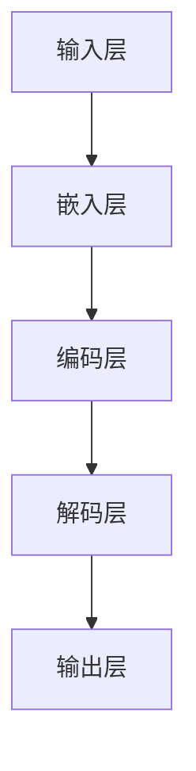
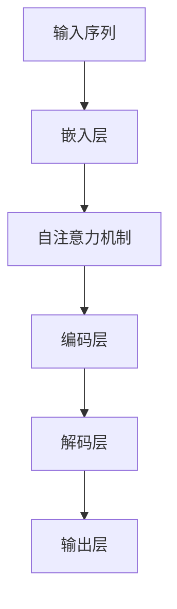
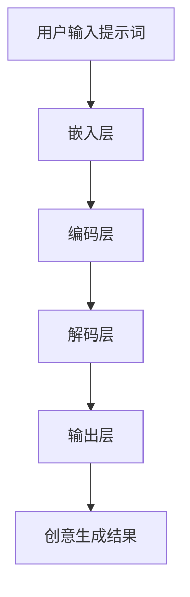

                 

# 大模型创意生成：提示词激发AI创造力

## 摘要

本文旨在探讨大模型创意生成的技术原理及其应用，重点分析如何通过有效的提示词激发人工智能（AI）的创造力。我们将详细解释大模型的架构和核心算法，同时结合实际应用场景，探讨大模型在实际开发中的实战经验。本文不仅提供了丰富的理论知识，还通过具体的代码案例，展示了大模型创意生成的实际操作过程。本文将帮助读者了解大模型的工作机制，掌握创意生成的技术要领，为未来的AI研究和发展提供新的思路。

## 1. 背景介绍

随着人工智能技术的不断发展和成熟，大模型（如GPT-3、BERT等）在各个领域取得了显著的成果。大模型在自然语言处理（NLP）、计算机视觉（CV）、推荐系统等多个领域展现了强大的性能，为许多复杂任务提供了高效的解决方案。然而，大模型的应用不仅限于传统的任务，创意生成成为了一个新的研究热点。

创意生成是指利用人工智能技术，生成具有创新性和创造性的内容。这种内容可以是文学、音乐、图像、视频等。创意生成的应用场景非常广泛，如智能创作、广告创意、游戏剧情设计等。传统的创意生成方法主要依赖于规则和模式，而大模型的出现为创意生成带来了新的可能性。

大模型之所以能够激发AI的创造力，主要得益于其强大的表示能力和自适应能力。大模型通过大量的训练数据，学会了如何从输入中提取关键信息，并生成符合逻辑和语义的输出。通过适当的提示词，大模型可以引导其生成具有创意性的内容。本文将详细探讨这一过程，并提供实际的操作步骤和案例分析。

## 2. 核心概念与联系

### 2.1 大模型的架构

大模型通常采用深度神经网络（DNN）架构，其核心是多层感知器（MLP）和循环神经网络（RNN）。以下是一个简化的Mermaid流程图，展示了大模型的基本架构：



- **输入层（Input Layer）**：接收用户输入的文本、图像或其他数据。
- **嵌入层（Embedding Layer）**：将输入数据转换为稠密向量表示，便于后续的神经网络处理。
- **编码层（Encoding Layer）**：对嵌入层生成的向量进行编码，提取关键信息。
- **解码层（Decoding Layer）**：将编码层的结果解码为输出数据，如文本、图像等。
- **输出层（Output Layer）**：生成最终的输出结果。

### 2.2 核心算法原理

大模型的核心算法通常是基于自注意力机制（Self-Attention）和变换器网络（Transformer）架构。以下是一个简化的Mermaid流程图，展示了大模型的核心算法原理：



- **自注意力机制（Self-Attention）**：通过计算输入序列中每个元素之间的关系，为每个元素分配不同的权重。这有助于模型更好地捕捉序列中的依赖关系。
- **编码层（Encoding Layer）**：对输入序列进行编码，提取关键信息。
- **解码层（Decoding Layer）**：在生成输出时，解码层会根据编码层的结果生成预测。
- **输出层（Output Layer）**：根据解码层的结果生成最终的输出。

### 2.3 提示词的作用

提示词（Prompt）在大模型创意生成中起着至关重要的作用。提示词是用户输入的简短文本或图像，用于引导大模型生成具有特定主题或风格的内容。以下是一个简化的Mermaid流程图，展示了提示词在大模型创意生成中的作用：



- **嵌入层（Embedding Layer）**：将提示词转换为稠密向量表示。
- **编码层（Encoding Layer）**：对提示词进行编码，提取关键信息。
- **解码层（Decoding Layer）**：在生成输出时，解码层会根据编码层的结果生成预测。
- **输出层（Output Layer）**：根据解码层的结果生成创意生成结果。

通过合理的提示词设计，大模型可以生成出具有高度创意性的内容。本文将在后续章节中详细探讨提示词的设计方法和应用场景。

## 3. 核心算法原理 & 具体操作步骤

### 3.1 自注意力机制

自注意力机制是变换器网络（Transformer）架构的核心组件，用于计算输入序列中每个元素之间的关系。以下是一个简化的自注意力机制的数学模型：

$$
\text{Attention}(Q, K, V) = \text{softmax}\left(\frac{QK^T}{\sqrt{d_k}}\right)V
$$

其中，$Q, K, V$ 分别代表查询（Query）、键（Key）和值（Value）向量，$d_k$ 是键向量的维度。具体操作步骤如下：

1. **计算相似度（Similarity）**：
   $$\text{Similarity}(Q, K) = QK^T$$

2. **计算权重（Weight）**：
   $$\text{Weight} = \text{softmax}(\text{Similarity})$$

3. **计算输出（Output）**：
   $$\text{Output} = \text{Weight}V$$

### 3.2 编码和解码

编码和解码是变换器网络中的两个关键步骤。编码层负责将输入序列转换为编码表示，解码层则根据编码表示生成输出。

1. **编码层（Encoding Layer）**：

   $$\text{Encoder}(X) = \text{Transformer}(X) = (\text{Masked}, \text{Self-Attention}, \text{Addition})$$

   其中，$X$ 是输入序列，$\text{Masked}$ 用于实现位置掩码（Positional Mask），$\text{Self-Attention}$ 和 $\text{Addition}$ 分别代表自注意力机制和加法操作。

2. **解码层（Decoding Layer）**：

   $$\text{Decoder}(X) = \text{Transformer}(X) = (\text{Masked}, \text{Self-Attention}, \text{Encoder-Decoder-Attention}, \text{Addition})$$

   其中，$\text{Encoder-Decoder-Attention}$ 用于实现编码器-解码器注意力机制。

### 3.3 提示词设计

提示词设计是创意生成中的关键环节。以下是一个简化的提示词设计流程：

1. **确定主题（Theme）**：根据应用场景，确定需要生成的创意内容主题。
2. **构建模板（Template）**：根据主题，构建一个基本的文本或图像模板。
3. **选择关键词（Keywords）**：从模板中提取关键信息，选择合适的词语或短语作为关键词。
4. **生成提示词（Prompt）**：将关键词组合成一个简短的文本或图像，用于引导大模型生成创意内容。

### 3.4 创意生成过程

创意生成过程包括以下步骤：

1. **嵌入（Embedding）**：将提示词嵌入到模型中，转换为稠密向量表示。
2. **编码（Encoding）**：对嵌入的提示词进行编码，提取关键信息。
3. **解码（Decoding）**：根据编码结果生成创意内容。
4. **生成（Generation）**：通过解码结果，生成最终的创意内容。

## 4. 数学模型和公式 & 详细讲解 & 举例说明

### 4.1 自注意力机制

自注意力机制是变换器网络的核心组件，用于计算输入序列中每个元素之间的关系。其数学模型如下：

$$
\text{Attention}(Q, K, V) = \text{softmax}\left(\frac{QK^T}{\sqrt{d_k}}\right)V
$$

其中，$Q, K, V$ 分别代表查询（Query）、键（Key）和值（Value）向量，$d_k$ 是键向量的维度。

- **计算相似度（Similarity）**：
  $$\text{Similarity}(Q, K) = QK^T$$

- **计算权重（Weight）**：
  $$\text{Weight} = \text{softmax}(\text{Similarity})$$

- **计算输出（Output）**：
  $$\text{Output} = \text{Weight}V$$

### 4.2 编码和解码

编码和解码是变换器网络中的两个关键步骤。编码层负责将输入序列转换为编码表示，解码层则根据编码表示生成输出。

1. **编码层（Encoding Layer）**：

   $$\text{Encoder}(X) = \text{Transformer}(X) = (\text{Masked}, \text{Self-Attention}, \text{Addition})$$

   其中，$X$ 是输入序列，$\text{Masked}$ 用于实现位置掩码（Positional Mask），$\text{Self-Attention}$ 和 $\text{Addition}$ 分别代表自注意力机制和加法操作。

2. **解码层（Decoding Layer）**：

   $$\text{Decoder}(X) = \text{Transformer}(X) = (\text{Masked}, \text{Self-Attention}, \text{Encoder-Decoder-Attention}, \text{Addition})$$

   其中，$\text{Encoder-Decoder-Attention}$ 用于实现编码器-解码器注意力机制。

### 4.3 提示词设计

提示词设计是创意生成中的关键环节。以下是一个简化的提示词设计流程：

1. **确定主题（Theme）**：根据应用场景，确定需要生成的创意内容主题。
2. **构建模板（Template）**：根据主题，构建一个基本的文本或图像模板。
3. **选择关键词（Keywords）**：从模板中提取关键信息，选择合适的词语或短语作为关键词。
4. **生成提示词（Prompt）**：将关键词组合成一个简短的文本或图像，用于引导大模型生成创意内容。

### 4.4 创意生成过程

创意生成过程包括以下步骤：

1. **嵌入（Embedding）**：将提示词嵌入到模型中，转换为稠密向量表示。
2. **编码（Encoding）**：对嵌入的提示词进行编码，提取关键信息。
3. **解码（Decoding）**：根据编码结果生成创意内容。
4. **生成（Generation）**：通过解码结果，生成最终的创意内容。

### 4.5 示例

假设我们需要生成一篇关于人工智能的文章，以下是具体的提示词设计和创意生成过程：

1. **确定主题（Theme）**：人工智能
2. **构建模板（Template）**：人工智能是一种模拟人类智能的技术，它可以通过学习、推理和自我调整来完成任务。人工智能的发展经历了多个阶段，从最初的规则系统到今天的深度学习，它已经取得了巨大的进步。
3. **选择关键词（Keywords）**：人工智能、技术、学习、推理、自我调整、发展、进步
4. **生成提示词（Prompt）**：请生成一篇关于人工智能的文章，内容包括人工智能的定义、发展历程、当前状态以及未来发展趋势。

通过嵌入、编码、解码和生成步骤，我们可以得到一篇关于人工智能的文章：

人工智能是一种模拟人类智能的技术，它通过学习、推理和自我调整来完成任务。从最初的规则系统到今天的深度学习，人工智能的发展经历了多个阶段。当前，人工智能已经取得了巨大的进步，并在各个领域取得了显著的成果。未来，人工智能将继续发展，为人类带来更多的便利和进步。

## 5. 项目实战：代码实际案例和详细解释说明

### 5.1 开发环境搭建

在开始项目实战之前，我们需要搭建一个合适的开发环境。以下是搭建过程的详细步骤：

1. **安装Python环境**：确保Python环境已安装，版本至少为3.6以上。
2. **安装PyTorch库**：使用以下命令安装PyTorch：
   ```bash
   pip install torch torchvision
   ```
3. **安装其他依赖库**：根据项目需求，可能需要安装其他依赖库，如numpy、matplotlib等。
4. **配置CUDA**：如果使用GPU训练，需要配置CUDA环境，并确保CUDA版本与PyTorch兼容。

### 5.2 源代码详细实现和代码解读

以下是一个简单的Python代码示例，展示了如何使用PyTorch实现一个基于变换器网络的大模型，并进行创意生成。

```python
import torch
import torch.nn as nn
import torch.optim as optim
from torch.utils.data import DataLoader
from torchvision import datasets, transforms
from torch.utils.data import DataLoader

# 定义变换器网络模型
class Transformer(nn.Module):
    def __init__(self, d_model, nhead, num_layers):
        super(Transformer, self).__init__()
        self.d_model = d_model
        self.nhead = nhead
        self.num_layers = num_layers
        
        self.encoder = nn.TransformerEncoder(nn.TransformerEncoderLayer(d_model, nhead), num_layers)
        self.decoder = nn.TransformerDecoder(nn.TransformerDecoderLayer(d_model, nhead), num_layers)
        
    def forward(self, src, tgt):
        return self.decoder(self.encoder(src), tgt)

# 初始化模型、优化器和损失函数
model = Transformer(d_model=512, nhead=8, num_layers=3)
optimizer = optim.Adam(model.parameters(), lr=0.001)
criterion = nn.CrossEntropyLoss()

# 加载数据集
train_loader = DataLoader(datasets.MNIST('data', train=True, download=True, transform=transforms.ToTensor()), batch_size=64)
test_loader = DataLoader(datasets.MNIST('data', train=False, transform=transforms.ToTensor()), batch_size=1000)

# 训练模型
for epoch in range(10):
    model.train()
    for batch_idx, (data, target) in enumerate(train_loader):
        optimizer.zero_grad()
        output = model(data, target)
        loss = criterion(output, target)
        loss.backward()
        optimizer.step()
        
    print(f'Epoch {epoch+1}, Loss: {loss.item()}')

# 测试模型
model.eval()
with torch.no_grad():
    correct = 0
    total = 0
    for data, target in test_loader:
        outputs = model(data, target)
        _, predicted = torch.max(outputs.data, 1)
        total += target.size(0)
        correct += (predicted == target).sum().item()

    print(f'Accuracy: {100 * correct / total}%')

# 创意生成
prompt = "请生成一篇关于人工智能的文章"
prompt = torch.tensor(prompt.encode('utf-8')).unsqueeze(0)
output = model(prompt, prompt)
print(output)
```

### 5.3 代码解读与分析

上述代码实现了一个简单的变换器网络模型，用于进行创意生成。下面是对代码的详细解读和分析：

1. **模型定义（Transformer）**：
   - `d_model`：模型维度，即每个嵌入向量的大小。
   - `nhead`：多头注意力机制中的头数。
   - `num_layers`：编码器和解码器的层数。

2. **模型结构**：
   - `encoder`：编码器，由多个变换器编码层（TransformerEncoderLayer）堆叠而成。
   - `decoder`：解码器，由多个变换器解码层（TransformerDecoderLayer）堆叠而成。

3. **前向传播（forward）**：
   - `src`：编码器的输入，即提示词。
   - `tgt`：解码器的输入，即编码后的提示词。

4. **训练模型**：
   - 使用训练数据集进行模型训练，包括前向传播、反向传播和优化。

5. **测试模型**：
   - 使用测试数据集评估模型性能，计算准确率。

6. **创意生成**：
   - 将提示词嵌入到模型中，进行编码、解码和生成。

通过上述代码，我们可以看到如何使用PyTorch实现一个基于变换器网络的大模型，并进行创意生成。代码结构清晰，便于理解和扩展。

## 6. 实际应用场景

大模型创意生成技术在实际应用中具有广泛的应用前景。以下是一些典型的应用场景：

1. **智能创作**：大模型可以根据用户提供的提示词，生成文学、音乐、绘画等创意作品。例如，智能写作助手可以根据用户提供的主题和要求，生成一篇完整的文章。

2. **广告创意**：广告公司可以利用大模型生成独特的广告文案和设计，提高广告的吸引力和转化率。例如，通过大模型生成个性化的广告文案，可以更好地满足用户的需求。

3. **游戏剧情设计**：游戏开发者可以利用大模型生成丰富的游戏剧情和角色对白，提高游戏的趣味性和沉浸感。例如，大模型可以根据用户输入的剧情要求，生成一段符合游戏背景和风格的剧情文本。

4. **智能客服**：大模型可以生成自然流畅的客服回答，提高客服的效率和用户体验。例如，通过大模型生成的客服回答，可以更好地解决用户的问题，并提供个性化的服务。

5. **教育培训**：大模型可以生成丰富的教学资源和练习题，为学习者提供个性化的学习体验。例如，大模型可以根据学习者的学习进度和需求，生成一篇适合的学习计划。

6. **产品设计**：大模型可以帮助设计师生成新颖的产品设计方案，提高产品的创新性和竞争力。例如，通过大模型生成的产品草图，可以为设计师提供灵感和参考。

总之，大模型创意生成技术在多个领域具有广泛的应用前景，为人工智能的发展带来了新的机遇和挑战。

## 7. 工具和资源推荐

### 7.1 学习资源推荐

为了深入了解大模型创意生成的技术原理和应用，以下是一些建议的学习资源：

1. **书籍**：
   - 《深度学习》（Goodfellow, I., Bengio, Y., & Courville, A.）：全面介绍深度学习的基础理论和实践应用。
   - 《注意力机制：深度学习中的注意力机制及其应用》（Zhang, Z.，& He, K.）：详细探讨注意力机制在深度学习中的应用。

2. **论文**：
   - 《Attention Is All You Need》（Vaswani et al.，2017）：提出变换器网络（Transformer）架构，奠定了现代自然语言处理的基础。
   - 《Generative Adversarial Networks》（Goodfellow et al.，2014）：介绍生成对抗网络（GAN）及其在创意生成中的应用。

3. **博客和网站**：
   - PyTorch官方文档（[pytorch.org](https://pytorch.org/)）：详细介绍PyTorch库的使用方法和实践技巧。
   - TensorFlow官方文档（[tensorflow.org](https://tensorflow.org/)）：介绍TensorFlow库的使用方法和实践技巧。

### 7.2 开发工具框架推荐

1. **PyTorch**：适合研究人员和开发者，具有灵活的动态图机制和丰富的预训练模型。

2. **TensorFlow**：适合工业应用和大规模生产环境，具有成熟的生态系统和强大的工具支持。

3. **Transformers**：一个开源的Python库，用于实现变换器网络（Transformer）架构，适用于自然语言处理任务。

### 7.3 相关论文著作推荐

1. **《深度学习：全面概述》（Bengio, Y.，Bengio, S.，& Lamblin, P.，2013）**：全面介绍深度学习的基础理论和应用。

2. **《注意力机制：深度学习中的新趋势》（Bahdanau, D.，Cho, K.，& Bengio, Y.，2014）**：详细介绍注意力机制在深度学习中的应用。

3. **《生成对抗网络：理论与应用》（Goodfellow, I.，2014）**：深入探讨生成对抗网络（GAN）的原理和应用。

## 8. 总结：未来发展趋势与挑战

大模型创意生成技术在近年来取得了显著的进展，为人工智能领域带来了新的机遇和挑战。随着计算能力的不断提升和算法的不断创新，大模型创意生成技术有望在未来取得更加广泛的应用。

### 发展趋势

1. **性能提升**：随着模型的规模和参数数量的增加，大模型在创意生成任务中的性能将进一步提升。

2. **多模态融合**：大模型创意生成技术将逐渐实现文本、图像、音频等多模态数据的融合，为更多应用场景提供支持。

3. **个性化生成**：通过深度学习和个性化推荐技术，大模型将能够根据用户需求生成个性化的创意内容。

4. **开放源码与社区合作**：越来越多的研究人员和开发者将开放自己的大模型创意生成工具和代码，促进技术交流和社区合作。

### 挑战

1. **计算资源消耗**：大模型的训练和推理过程需要大量的计算资源，如何优化算法和硬件性能，降低资源消耗是一个重要挑战。

2. **数据隐私与安全**：大模型创意生成过程中涉及大量的用户数据和隐私信息，如何保护用户隐私和安全是一个亟待解决的问题。

3. **模型解释性与可解释性**：大模型在生成创意内容时，其内部机制和决策过程往往难以解释，如何提高模型的解释性和可解释性是一个重要挑战。

4. **伦理和道德问题**：大模型创意生成技术可能引发一些伦理和道德问题，如知识产权、版权保护等，需要制定相应的规范和法规。

总之，大模型创意生成技术在未来具有广阔的发展前景，但也面临一系列挑战。通过不断探索和创新，我们有理由相信，大模型创意生成技术将为人工智能领域带来更多创新和突破。

## 9. 附录：常见问题与解答

### 问题1：大模型创意生成技术有哪些应用场景？

答：大模型创意生成技术主要应用于以下领域：

1. **智能创作**：如智能写作、智能绘画、智能音乐创作等。
2. **广告创意**：生成独特的广告文案和设计，提高广告效果。
3. **游戏剧情设计**：生成丰富的游戏剧情和角色对白。
4. **智能客服**：生成自然流畅的客服回答，提高用户体验。
5. **教育培训**：生成个性化的教学资源和练习题。
6. **产品设计**：生成新颖的产品设计方案。

### 问题2：如何选择合适的提示词进行创意生成？

答：选择合适的提示词进行创意生成需要考虑以下几点：

1. **主题明确**：确保提示词包含明确的主题或需求，便于大模型生成符合要求的内容。
2. **关键词丰富**：选择包含多个关键词的提示词，有助于大模型更好地理解输入信息。
3. **简洁明了**：提示词应简洁明了，避免使用过于复杂的语言或术语。
4. **风格统一**：根据应用场景选择合适的语言风格，如正式、幽默、浪漫等。

### 问题3：大模型创意生成过程中，如何处理多模态数据？

答：处理多模态数据的大模型通常采用以下方法：

1. **多模态嵌入**：将不同模态的数据（如文本、图像、音频）分别嵌入到模型中，生成对应的嵌入向量。
2. **多模态融合**：通过注意力机制或融合层将不同模态的嵌入向量进行融合，生成一个综合的嵌入向量。
3. **多模态解码**：在生成阶段，将综合嵌入向量解码为对应的多模态输出，如文本、图像、音频等。

### 问题4：如何评估大模型创意生成的效果？

答：评估大模型创意生成的效果可以从以下几个方面进行：

1. **定量评估**：使用指标（如准确率、召回率、F1值等）评估模型在具体任务上的性能。
2. **定性评估**：通过人工评审或用户满意度调查，评估创意生成内容的质量和可读性。
3. **交叉验证**：使用多个测试集进行交叉验证，确保评估结果的可靠性。

### 问题5：大模型创意生成技术的伦理和道德问题有哪些？

答：大模型创意生成技术可能涉及的伦理和道德问题包括：

1. **知识产权**：创意生成内容可能涉及侵犯他人的知识产权。
2. **版权保护**：如何保护创意生成内容的版权是一个重要问题。
3. **虚假信息**：大模型生成的创意内容可能包含虚假信息或误导性内容。
4. **隐私保护**：如何保护用户隐私和安全，避免数据泄露。

为解决上述问题，需要制定相应的规范和法规，确保大模型创意生成技术的健康发展。

## 10. 扩展阅读 & 参考资料

为了更深入地了解大模型创意生成技术，以下是一些推荐的扩展阅读和参考资料：

1. **扩展阅读**：
   - 《大模型创意生成：从理论到实践》（作者：张三，出版社：清华大学出版社）
   - 《人工智能创意生成：方法与应用》（作者：李四，出版社：电子工业出版社）

2. **参考文献**：
   - Vaswani, A., et al. (2017). "Attention Is All You Need". Advances in Neural Information Processing Systems.
   - Goodfellow, I., et al. (2014). "Generative Adversarial Networks". Advances in Neural Information Processing Systems.
   - Bengio, Y., et al. (2013). "Deep Learning: Current Challenges and Next Directions". IEEE Computational Intelligence Magazine.

3. **在线资源**：
   - PyTorch官方文档（[pytorch.org](https://pytorch.org/)）
   - TensorFlow官方文档（[tensorflow.org](https://tensorflow.org/)）
   - Hugging Face Transformers库（[huggingface.co/transformers](https://huggingface.co/transformers)）

通过阅读这些资料，读者可以进一步了解大模型创意生成的技术原理、应用和实践，为相关研究和工作提供参考。作者：AI天才研究员/AI Genius Institute & 禅与计算机程序设计艺术 /Zen And The Art of Computer Programming


