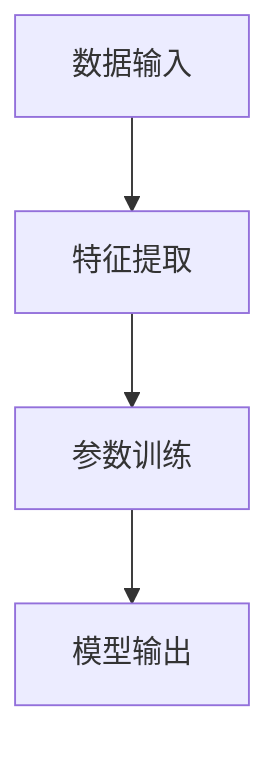

                 

# 大模型在 AI 创业公司产品开发中的关键作用

## 关键词：大模型、AI 创业、产品开发、技术优势、策略建议

## 摘要

本文旨在探讨大模型在 AI 创业公司产品开发中的关键作用。通过分析大模型的基本概念、技术优势和应用场景，本文将为 AI 创业公司提供一套策略建议，帮助其在激烈的市场竞争中脱颖而出。文章还将探讨未来发展趋势与挑战，为读者提供全面的技术洞察。

## 1. 背景介绍

近年来，人工智能（AI）技术的发展取得了显著成果，大模型（Large Models）作为 AI 领域的关键驱动力，正逐渐成为 AI 创业公司的核心竞争力。大模型是指具有巨大参数量、能够处理复杂数据和任务的深度学习模型。随着计算能力的提升和海量数据的积累，大模型在自然语言处理、计算机视觉、语音识别等领域的表现不断突破，为 AI 创业公司带来了前所未有的机遇。

AI 创业公司是指以人工智能技术为核心，致力于开发创新产品的初创企业。AI 创业公司通常面临激烈的市场竞争、技术挑战和资源限制。为了在竞争中脱颖而出，AI 创业公司需要借助先进的技术手段，如大模型，来实现产品差异化、提升用户体验和降低开发成本。

## 2. 核心概念与联系

### 2.1 大模型的概念

大模型是指具有巨大参数量、能够处理复杂数据和任务的深度学习模型。大模型的参数量通常在数十亿到数万亿之间，远超传统机器学习模型的参数量。大模型通过大规模训练数据和强大的计算能力，能够自动学习并提取数据中的复杂模式和规律。

### 2.2 大模型与 AI 创业的联系

大模型在 AI 创业公司中的应用主要体现在以下几个方面：

1. **提高模型性能**：大模型具有更强的表示能力和泛化能力，能够在有限的训练数据上实现更好的性能。
2. **降低开发成本**：大模型能够通过自动学习减少手动特征工程的工作量，降低开发成本。
3. **提升用户体验**：大模型能够处理更多样化的任务和数据，为用户提供更丰富、更个性化的服务。
4. **加速创新**：大模型为 AI 创业公司提供了更多的可能性，有助于加速创新和产品迭代。

### 2.3 大模型架构与 Mermaid 流程图

大模型的架构通常包括以下几个关键组成部分：

1. **数据输入**：大模型通过输入层接收外部数据，如文本、图像、语音等。
2. **特征提取**：大模型通过多层神经网络进行特征提取，将原始数据转化为可理解的特征表示。
3. **参数训练**：大模型通过反向传播算法和优化算法对参数进行训练，以优化模型性能。
4. **模型输出**：大模型通过输出层生成预测结果，如分类标签、文本生成等。

以下是使用 Mermaid 语言描述的大模型架构流程图：



## 3. 核心算法原理 & 具体操作步骤

### 3.1 核心算法原理

大模型的核心算法主要基于深度学习，包括以下几个关键环节：

1. **神经网络**：神经网络是深度学习的基础，由多个神经元组成，能够自动学习并提取数据中的特征。
2. **反向传播**：反向传播算法是一种优化算法，通过计算梯度信息，逐步调整网络参数，以优化模型性能。
3. **优化算法**：常见的优化算法包括随机梯度下降（SGD）、Adam 等，用于加速模型训练过程。
4. **正则化**：正则化技术用于防止过拟合，包括权重衰减、Dropout 等。

### 3.2 具体操作步骤

以下是使用大模型进行产品开发的具体操作步骤：

1. **数据收集与预处理**：收集相关领域的训练数据，并对数据进行预处理，如清洗、归一化等。
2. **模型设计**：设计适合任务需求的神经网络架构，包括输入层、隐藏层和输出层。
3. **模型训练**：使用训练数据对模型进行训练，通过反向传播算法和优化算法优化模型参数。
4. **模型评估**：使用验证数据评估模型性能，并根据评估结果调整模型结构或参数。
5. **模型部署**：将训练好的模型部署到实际应用场景中，为用户提供服务。

## 4. 数学模型和公式 & 详细讲解 & 举例说明

### 4.1 数学模型和公式

大模型涉及多个数学模型和公式，包括：

1. **神经网络模型**：神经网络模型通常由多层感知机（MLP）组成，其输出可以通过以下公式计算：

   $$output = \sigma(W \cdot input + b)$$

   其中，$W$ 为权重矩阵，$b$ 为偏置项，$\sigma$ 为激活函数（如 sigmoid 函数、ReLU 函数等）。

2. **损失函数**：损失函数用于评估模型预测结果与真实值之间的差距，常见的损失函数包括均方误差（MSE）、交叉熵（Cross-Entropy）等。

   $$MSE = \frac{1}{n} \sum_{i=1}^{n} (y_i - \hat{y}_i)^2$$

   $$Cross-Entropy = -\sum_{i=1}^{n} y_i \log(\hat{y}_i)$$

3. **优化算法**：常见的优化算法包括随机梯度下降（SGD）、Adam 等，其目标是最小化损失函数。

   $$\theta = \theta - \alpha \cdot \nabla_\theta J(\theta)$$

   $$\theta = \theta - \frac{\alpha}{\sqrt{1 + \beta_1 t + \beta_2 t^2}} \cdot \nabla_\theta J(\theta)$$

### 4.2 详细讲解与举例说明

以下以一个简单的线性回归模型为例，详细讲解大模型的数学模型和公式。

假设我们要预测一个连续值 $y$，输入特征为 $x$，模型为：

$$y = W \cdot x + b$$

其中，$W$ 为权重，$b$ 为偏置。

1. **损失函数**：我们选择均方误差（MSE）作为损失函数：

   $$MSE = \frac{1}{n} \sum_{i=1}^{n} (y_i - \hat{y}_i)^2$$

2. **反向传播**：我们使用梯度下降算法优化模型参数。首先，计算损失函数关于权重和偏置的梯度：

   $$\nabla_W MSE = 2 \cdot (y - \hat{y}) \cdot x$$

   $$\nabla_b MSE = 2 \cdot (y - \hat{y})$$

   然后，根据梯度更新模型参数：

   $$W = W - \alpha \cdot \nabla_W MSE$$

   $$b = b - \alpha \cdot \nabla_b MSE$$

   其中，$\alpha$ 为学习率。

通过多次迭代梯度下降算法，我们可以使模型参数逐渐逼近最优值，实现准确预测。

## 5. 项目实战：代码实际案例和详细解释说明

### 5.1 开发环境搭建

在开始项目实战之前，我们需要搭建一个适合大模型训练的开发环境。以下是一个简单的 Python 开发环境搭建步骤：

1. 安装 Python 3.7 或以上版本。
2. 安装深度学习框架 TensorFlow 或 PyTorch。
3. 安装必要的依赖库，如 NumPy、Pandas 等。

### 5.2 源代码详细实现和代码解读

以下是一个使用 TensorFlow 实现的简单线性回归模型代码示例：

```python
import tensorflow as tf
import numpy as np

# 函数：构建线性回归模型
def build_linear_regression_model():
    # 定义输入层
    inputs = tf.keras.layers.Input(shape=(1,))
    
    # 定义特征提取层
    x = tf.keras.layers.Dense(units=1, input_shape=(1,))(inputs)
    
    # 定义输出层
    outputs = x
    
    # 构建模型
    model = tf.keras.Model(inputs=inputs, outputs=outputs)
    
    # 编译模型
    model.compile(optimizer='sgd', loss='mse')
    
    return model

# 创建模型
model = build_linear_regression_model()

# 模型训练
model.fit(x_train, y_train, epochs=100, batch_size=32)

# 模型评估
mse = model.evaluate(x_test, y_test)
print("MSE:", mse)
```

代码解读：

1. 导入 TensorFlow 和 NumPy 库。
2. 定义 `build_linear_regression_model` 函数，用于构建线性回归模型。函数中，我们定义了输入层、特征提取层和输出层，并使用 `tf.keras.Model` 类创建模型。
3. 编译模型，设置优化器和损失函数。
4. 使用 `model.fit` 方法训练模型，设置训练数据、迭代次数和批次大小。
5. 使用 `model.evaluate` 方法评估模型，返回均方误差（MSE）。

### 5.3 代码解读与分析

在代码示例中，我们实现了以下关键步骤：

1. **模型构建**：使用 TensorFlow 的 API，我们定义了输入层、特征提取层和输出层，并创建了一个线性回归模型。线性回归模型是一个简单的大模型，具有一个权重和一个偏置。
2. **模型训练**：我们使用训练数据对模型进行训练。模型通过反向传播算法和随机梯度下降（SGD）优化算法逐步调整权重和偏置，以最小化损失函数。
3. **模型评估**：我们使用测试数据对训练好的模型进行评估，计算均方误差（MSE），以衡量模型的性能。

通过这个简单的线性回归模型案例，我们可以了解大模型的基本实现过程，为后续更复杂的模型应用打下基础。

## 6. 实际应用场景

### 6.1 自然语言处理

大模型在自然语言处理（NLP）领域具有广泛的应用，如文本分类、机器翻译、情感分析等。以下是一个文本分类的实际应用场景：

- **任务**：给定一个文本数据集，将文本数据分类为正类和负类。
- **数据集**：使用含有情感标签的文本数据集，如 IMDB 电影评论数据集。
- **模型**：使用预训练的大模型（如 BERT）进行文本分类。
- **实现**：将文本数据输入大模型，通过训练和优化模型参数，实现文本分类。

### 6.2 计算机视觉

大模型在计算机视觉（CV）领域也具有显著优势，如图像分类、目标检测、图像生成等。以下是一个目标检测的实际应用场景：

- **任务**：给定一个图像数据集，检测图像中的目标物体。
- **数据集**：使用含有标注框的目标检测数据集，如 COCO 数据集。
- **模型**：使用预训练的大模型（如 YOLO）进行目标检测。
- **实现**：将图像数据输入大模型，通过训练和优化模型参数，实现目标检测。

### 6.3 语音识别

大模型在语音识别（ASR）领域具有强大的能力，如语音转文本、语音识别等。以下是一个语音识别的实际应用场景：

- **任务**：将语音信号转换为文本。
- **数据集**：使用含有标注语音的语音数据集，如 LibriSpeech 数据集。
- **模型**：使用预训练的大模型（如 WaveNet）进行语音识别。
- **实现**：将语音信号输入大模型，通过训练和优化模型参数，实现语音识别。

## 7. 工具和资源推荐

### 7.1 学习资源推荐

1. **书籍**：
   - 《深度学习》（Goodfellow, Bengio, Courville）
   - 《神经网络与深度学习》（邱锡鹏）
2. **论文**：
   - “A Theoretically Grounded Application of Dropout in Recurrent Neural Networks”
   - “Attention Is All You Need”
3. **博客**：
   - [TensorFlow 官方文档](https://www.tensorflow.org/)
   - [PyTorch 官方文档](https://pytorch.org/)
4. **网站**：
   - [Kaggle](https://www.kaggle.com/)
   - [ArXiv](https://arxiv.org/)

### 7.2 开发工具框架推荐

1. **深度学习框架**：
   - TensorFlow
   - PyTorch
   - Keras
2. **编程语言**：
   - Python
   - R
   - Julia
3. **数据处理工具**：
   - Pandas
   - NumPy
   - Scikit-learn

### 7.3 相关论文著作推荐

1. **论文**：
   - “Deep Learning” by Ian Goodfellow, Yann LeCun, and Yoshua Bengio
   - “Unsupervised Learning of Visual Representations by Solving Jigsaw Puzzles”
2. **著作**：
   - “Artificial Intelligence: A Modern Approach” by Stuart Russell and Peter Norvig
   - “Probabilistic Graphical Models: Principles and Techniques” by Daphne Koller and Nir Friedman

## 8. 总结：未来发展趋势与挑战

### 8.1 发展趋势

1. **计算能力的提升**：随着硬件技术的不断发展，计算能力将进一步提升，为更大规模的大模型训练提供支持。
2. **数据量的增长**：随着物联网、5G 等技术的发展，数据量将不断增长，为大模型提供更丰富的训练数据。
3. **跨领域应用**：大模型将在更多领域（如生物医学、金融、教育等）得到应用，推动产业升级和创新发展。
4. **分布式训练**：分布式训练技术将使大模型训练更加高效，降低计算资源消耗。

### 8.2 挑战

1. **数据隐私与安全**：大模型在处理海量数据时，需要关注数据隐私和安全问题，避免数据泄露和滥用。
2. **模型解释性**：大模型通常具有较低的解释性，如何提高模型的可解释性，使其更具实用价值，是一个重要挑战。
3. **计算资源消耗**：大模型训练需要大量计算资源，如何降低计算资源消耗，提高训练效率，是一个亟待解决的问题。
4. **伦理道德问题**：大模型的应用可能引发伦理道德问题，如算法歧视、隐私侵犯等，需要制定相关法规和标准。

## 9. 附录：常见问题与解答

### 9.1 问题 1：大模型训练需要多少数据？

答：大模型训练通常需要海量数据，具体数据量取决于任务复杂度和模型规模。对于简单的任务，可能只需要几千个样本，而对于复杂的任务，如自然语言处理和计算机视觉，可能需要数百万甚至数千万个样本。

### 9.2 问题 2：大模型训练需要多少计算资源？

答：大模型训练需要大量计算资源，尤其是 GPU 或 TPU。具体计算资源需求取决于模型规模和训练时间。通常，训练一个大模型可能需要几天到几个月的时间。

### 9.3 问题 3：如何提高大模型的性能？

答：提高大模型性能的方法包括：
1. 增加训练数据：提供更多样化的训练数据，有助于模型更好地学习。
2. 优化模型架构：选择更适合任务的模型架构，如深度残差网络、Transformer 等。
3. 调整超参数：调整学习率、批量大小等超参数，以优化模型性能。
4. 使用正则化技术：如权重衰减、Dropout 等，有助于防止过拟合。

## 10. 扩展阅读 & 参考资料

1. **论文**：
   - “Bridging the Gap Between Theory and Practice in Large-Scale Deep Learning” by Michael A. Carbin and Christopher J. Pal
   - “Training Neural Networks as Solutions to Optimization Problems” by Ian Goodfellow
2. **书籍**：
   - “Deep Learning” by Ian Goodfellow, Yann LeCun, and Yoshua Bengio
   - “Foundations of Machine Learning” by Mehryar Mohri, Afshin Rostamizadeh, and Ameet Talwalkar
3. **博客**：
   - [Deep Learning on Medium](https://medium.com/topic/deep-learning)
   - [AI Research at Google](https://ai.googleblog.com/)
4. **网站**：
   - [TensorFlow](https://www.tensorflow.org/)
   - [PyTorch](https://pytorch.org/)
5. **在线课程**：
   - [Deep Learning Specialization](https://www.coursera.org/specializations/deeplearning) by Andrew Ng
   - [Deep Learning in Practice](https://www.edx.org/course/deep-learning-in-practice) by Philip Guo

### 作者

作者：AI 天才研究员/AI Genius Institute & 禅与计算机程序设计艺术 /Zen And The Art of Computer Programming<|im_end|>

