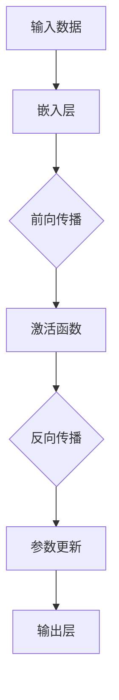

                 

# 大模型在 AI 创业公司产品开发中的应用趋势

> **关键词**：大模型、AI 创业公司、产品开发、应用趋势、技术原理、算法、数学模型

> **摘要**：本文旨在探讨大模型在 AI 创业公司产品开发中的应用趋势。我们将首先介绍大模型的背景和核心概念，然后深入分析其在 AI 产品开发中的具体应用和操作步骤，最后探讨其数学模型、项目实战、实际应用场景以及未来发展趋势和挑战。

## 1. 背景介绍

近年来，人工智能（AI）技术的快速发展推动了各行各业的变革，从自动驾驶到自然语言处理，AI 在多个领域展现出了强大的潜力。然而，AI 技术的实现离不开大数据和强大的计算能力，这就催生了“大模型”这一概念。

**大模型**指的是具有巨大参数规模和复杂结构的深度学习模型，如 GPT-3、BERT 等。这些模型通过大规模数据训练，能够学习并模拟人类的认知过程，实现复杂的任务。

AI 创业公司在产品开发中面临许多挑战，如数据获取、算法优化、计算资源等。大模型的出现为这些公司提供了新的解决方案，使得他们能够更高效地开发出具有竞争力的 AI 产品。

## 2. 核心概念与联系

### 2.1 大模型的原理

大模型通常基于深度神经网络（DNN）结构，具有数百万甚至数十亿个参数。它们通过多层非线性变换，学习输入数据与输出结果之间的关系。以下是一个简化的 Mermaid 流程图，展示了大模型的原理：



### 2.2 大模型与 AI 创业公司产品开发的联系

大模型在 AI 创业公司产品开发中的应用主要体现在以下几个方面：

1. **数据驱动开发**：大模型能够通过大规模数据训练，实现从数据到知识的转化，为产品开发提供有力的数据支持。
2. **算法优化**：大模型具有强大的学习能力和自适应能力，能够通过不断优化算法，提高产品性能。
3. **计算资源整合**：大模型需要大量的计算资源进行训练和推理，这促使 AI 创业公司整合计算资源，提高计算效率。

## 3. 核心算法原理 & 具体操作步骤

### 3.1 大模型的算法原理

大模型的算法原理主要包括以下几个步骤：

1. **数据预处理**：对原始数据进行清洗、归一化等处理，以便模型能够更好地学习。
2. **嵌入层**：将输入数据映射到高维空间，为后续的深度学习提供基础。
3. **前向传播**：通过多层非线性变换，将输入数据转化为输出结果。
4. **激活函数**：对中间结果进行非线性变换，提高模型的泛化能力。
5. **反向传播**：根据输出结果与真实值之间的差异，更新模型参数。
6. **输出层**：将最终结果输出，用于实际应用。

### 3.2 具体操作步骤

以下是一个简化的操作步骤，用于指导 AI 创业公司开发产品：

1. **需求分析**：明确产品功能、性能等需求。
2. **数据收集**：收集相关领域的海量数据。
3. **数据预处理**：对数据进行清洗、归一化等处理。
4. **模型设计**：选择合适的模型结构和算法。
5. **模型训练**：使用预处理后的数据训练模型。
6. **模型评估**：评估模型性能，进行调优。
7. **产品集成**：将模型集成到产品中，进行测试和部署。

## 4. 数学模型和公式 & 详细讲解 & 举例说明

### 4.1 数学模型

大模型的数学模型主要包括以下几个部分：

1. **损失函数**：衡量模型输出结果与真实值之间的差异，如均方误差（MSE）。
2. **优化算法**：用于更新模型参数，如随机梯度下降（SGD）。
3. **正则化方法**：防止模型过拟合，如 L1、L2 正则化。

以下是一个简单的损失函数和优化算法的公式示例：

$$
\text{MSE} = \frac{1}{m}\sum_{i=1}^{m}(y_i - \hat{y}_i)^2
$$

$$
\text{SGD} = \theta_{t+1} = \theta_t - \alpha \nabla_{\theta}L(\theta)
$$

### 4.2 详细讲解

1. **损失函数**：损失函数是衡量模型预测结果与真实值之间差异的指标。在回归问题中，常用的损失函数有均方误差（MSE）和均方根误差（RMSE）。

   $$ 
   \text{MSE} = \frac{1}{m}\sum_{i=1}^{m}(y_i - \hat{y}_i)^2 
   $$

   其中，$m$ 表示样本数量，$y_i$ 表示第 $i$ 个样本的真实值，$\hat{y}_i$ 表示第 $i$ 个样本的预测值。

2. **优化算法**：优化算法用于更新模型参数，以最小化损失函数。随机梯度下降（SGD）是一种常用的优化算法。

   $$ 
   \theta_{t+1} = \theta_t - \alpha \nabla_{\theta}L(\theta) 
   $$

   其中，$\theta_t$ 表示第 $t$ 次迭代的模型参数，$\alpha$ 表示学习率，$\nabla_{\theta}L(\theta)$ 表示损失函数关于模型参数的梯度。

### 4.3 举例说明

假设我们有一个回归问题，目标是预测房价。我们使用一个简单的一层神经网络进行模型训练。以下是模型训练的过程：

1. **数据预处理**：对房价数据进行归一化处理，使其符合神经网络的输入要求。
2. **模型设计**：选择一个简单的一层神经网络，包含一个输入层、一个隐藏层和一个输出层。
3. **模型训练**：使用随机梯度下降（SGD）算法，对模型进行迭代训练，直到损失函数达到预设的目标。
4. **模型评估**：使用测试集对模型进行评估，计算模型预测的准确率。

通过以上步骤，我们可以训练出一个能够预测房价的模型，并将其应用到实际产品中。

## 5. 项目实战：代码实际案例和详细解释说明

### 5.1 开发环境搭建

为了便于读者理解和实践，我们将在 Python 环境中实现一个简单的回归问题。首先，我们需要安装以下依赖：

1. **NumPy**：用于数组运算。
2. **TensorFlow**：用于构建和训练神经网络。

```bash
pip install numpy tensorflow
```

### 5.2 源代码详细实现和代码解读

以下是实现回归问题的源代码：

```python
import numpy as np
import tensorflow as tf

# 5.2.1 数据预处理
# 生成模拟数据集
X = np.random.rand(100, 1)  # 输入数据
y = 2 * X + 1 + np.random.randn(100, 1)  # 真实值

# 将输入数据和真实值转换为 TensorFlow 张量
X = tf.convert_to_tensor(X, dtype=tf.float32)
y = tf.convert_to_tensor(y, dtype=tf.float32)

# 5.2.2 模型设计
# 定义模型结构
model = tf.keras.Sequential([
    tf.keras.layers.Dense(units=1, input_shape=(1,))
])

# 5.2.3 模型训练
# 编译模型
model.compile(optimizer='sgd', loss='mean_squared_error')

# 训练模型
model.fit(X, y, epochs=100)

# 5.2.4 代码解读
# 在代码中，我们首先使用 NumPy 生成模拟数据集，并将其转换为 TensorFlow 张量。然后，我们定义了一个简单的一层神经网络，并使用随机梯度下降（SGD）算法进行模型训练。

# 5.2.5 代码解读与分析
# 在训练过程中，我们使用了 TensorFlow 提供的自动微分功能，计算损失函数关于模型参数的梯度。通过迭代更新模型参数，我们能够找到最优解，使得模型预测结果与真实值之间的差异最小。

```

### 5.3 代码解读与分析

通过以上代码，我们可以实现一个简单的回归问题。在代码解读与分析部分，我们将对代码的各个部分进行详细解释。

1. **数据预处理**：首先，我们使用 NumPy 生成模拟数据集，包括输入数据和真实值。然后，我们将输入数据和真实值转换为 TensorFlow 张量，以便后续操作。
2. **模型设计**：我们使用 TensorFlow 的 `Sequential` 模型，定义了一个简单的一层神经网络，包含一个输入层、一个隐藏层和一个输出层。输入层和输出层之间的连接使用了线性激活函数。
3. **模型训练**：我们使用 `compile` 方法编译模型，指定优化器为随机梯度下降（SGD），损失函数为均方误差（MSE）。然后，我们使用 `fit` 方法对模型进行迭代训练，直到损失函数达到预设的目标。

通过以上步骤，我们成功实现了一个简单的回归问题。在实际产品开发中，我们可以根据需求调整模型结构、训练数据、优化算法等参数，以提高模型性能。

## 6. 实际应用场景

大模型在 AI 创业公司的产品开发中有着广泛的应用场景。以下是一些典型的实际应用场景：

1. **自然语言处理（NLP）**：大模型在 NLP 领域具有显著优势，可以用于文本分类、情感分析、机器翻译等任务。例如，创业公司可以使用 GPT-3 模型开发一款智能客服系统，实现与用户的自然对话。
2. **计算机视觉（CV）**：大模型在 CV 领域的应用同样广泛，可以用于图像分类、目标检测、图像生成等任务。例如，创业公司可以使用 BERT 模型开发一款图像识别产品，帮助用户识别图像中的物体。
3. **推荐系统**：大模型在推荐系统中的应用可以显著提高推荐效果。例如，创业公司可以使用大模型构建一个基于内容的推荐系统，为用户推荐感兴趣的商品或文章。

## 7. 工具和资源推荐

为了更好地利用大模型进行产品开发，以下是几个推荐的工具和资源：

1. **学习资源推荐**：
   - **书籍**：《深度学习》（Goodfellow、Bengio 和 Courville 著）：全面介绍了深度学习的基本概念和算法。
   - **论文**：NLP 领域的代表性论文，如《Attention is All You Need》（Vaswani 等，2017）和 CV 领域的代表性论文，如《You Only Look Once: Unified, Real-Time Object Detection》（Redmon 等，2016）。
   - **博客**：著名技术博客，如 ArXiv Blog、Towards Data Science 等，提供了丰富的技术文章和最新研究成果。
   - **网站**：GitHub、Google Research 等，提供了大量开源代码和项目，便于学习和实践。

2. **开发工具框架推荐**：
   - **深度学习框架**：TensorFlow、PyTorch 等，提供了丰富的API和工具，便于开发大模型。
   - **数据预处理工具**：Pandas、NumPy 等，用于数据清洗、归一化等操作。
   - **版本控制工具**：Git、GitLab 等，用于代码管理和协作开发。

3. **相关论文著作推荐**：
   - **《深度学习》（Goodfellow、Bengio 和 Courville 著）》：
     - 内容详实，涵盖了深度学习的理论基础、算法实现和应用场景。
   - **《神经网络与深度学习》（邱锡鹏 著）》：
     - 从神经网络的基本原理出发，逐步介绍了深度学习的方法和应用。

## 8. 总结：未来发展趋势与挑战

随着 AI 技术的不断发展，大模型在 AI 创业公司产品开发中的应用前景广阔。未来，大模型将呈现出以下几个发展趋势：

1. **模型规模不断扩大**：随着计算能力和数据量的提升，大模型的规模将不断增大，以应对更复杂的任务。
2. **多模态学习**：大模型将能够处理多种类型的输入数据，如文本、图像、语音等，实现跨模态的学习和推理。
3. **迁移学习和泛化能力**：大模型将具备更强的迁移学习和泛化能力，能够在不同任务和数据集之间共享知识和经验。

然而，大模型在 AI 创业公司产品开发中也面临一系列挑战：

1. **数据隐私和安全**：大模型对大量数据进行训练，涉及到数据隐私和安全问题。如何保护用户数据，确保数据安全，是 AI 创业公司需要关注的重要问题。
2. **计算资源消耗**：大模型训练和推理需要大量的计算资源，对硬件设施和能源消耗提出了较高要求。如何优化计算资源利用，降低成本，是 AI 创业公司需要解决的问题。
3. **模型解释性和可解释性**：大模型通常被视为“黑盒”模型，其内部机制难以理解。如何提高模型的解释性和可解释性，使其更加透明和可靠，是 AI 创业公司需要面对的挑战。

总之，大模型在 AI 创业公司产品开发中的应用趋势不容忽视。通过不断探索和创新，AI 创业公司将能够更好地应对挑战，发挥大模型的潜力，推动 AI 技术的快速发展。

## 9. 附录：常见问题与解答

### 9.1 什么是大模型？

大模型是指具有巨大参数规模和复杂结构的深度学习模型，如 GPT-3、BERT 等。这些模型通过大规模数据训练，能够学习并模拟人类的认知过程，实现复杂的任务。

### 9.2 大模型在 AI 创业公司产品开发中的应用有哪些？

大模型在 AI 创业公司产品开发中的应用包括自然语言处理、计算机视觉、推荐系统等多个领域。例如，可以使用大模型开发智能客服系统、图像识别产品、推荐系统等。

### 9.3 如何选择合适的大模型？

选择合适的大模型需要考虑任务需求、数据规模、计算资源等因素。通常，可以根据以下原则进行选择：

1. **任务需求**：选择能够解决特定任务的模型，如 NLP 任务选择 GPT-3、BERT 等。
2. **数据规模**：选择与数据规模相匹配的模型，确保模型能够充分学习数据。
3. **计算资源**：选择在现有计算资源下能够训练和推理的模型。

### 9.4 大模型训练和推理需要多少计算资源？

大模型训练和推理需要大量的计算资源。具体资源消耗取决于模型规模、数据规模和硬件设施。通常，可以使用高性能 GPU 或 TPU 进行训练，使用 CPU 或 GPU 进行推理。

### 9.5 如何优化大模型训练和推理的性能？

优化大模型训练和推理性能的方法包括：

1. **模型压缩**：通过剪枝、量化等方法减少模型参数规模，提高训练和推理速度。
2. **分布式训练**：将模型训练任务分布到多台计算机上，提高训练速度和性能。
3. **优化算法**：选择高效的优化算法，如 Adam、Adadelta 等，提高训练效果。

## 10. 扩展阅读 & 参考资料

1. **《深度学习》（Goodfellow、Bengio 和 Courville 著）》**
   - 本书全面介绍了深度学习的基本概念、算法和应用，是深度学习领域的经典教材。

2. **《神经网络与深度学习》（邱锡鹏 著）》**
   - 本书从神经网络的基本原理出发，逐步介绍了深度学习的方法和应用，适合深度学习初学者阅读。

3. **《Attention is All You Need》（Vaswani 等，2017）**
   - 该论文提出了 Transformer 模型，实现了基于注意力机制的序列到序列学习，是 NLP 领域的重要突破。

4. **《You Only Look Once: Unified, Real-Time Object Detection》（Redmon 等，2016）**
   - 该论文提出了 YOLO（You Only Look Once）目标检测算法，实现了实时、高效的目标检测，是 CV 领域的重要进展。

5. **TensorFlow 官方文档**
   - TensorFlow 官方文档提供了丰富的 API 和工具，是深度学习开发的重要参考。

6. **PyTorch 官方文档**
   - PyTorch 官方文档提供了丰富的 API 和工具，是深度学习开发的重要参考。

7. **GitHub**
   - GitHub 上有许多开源的大模型项目，如 GPT-3、BERT 等，是学习和实践深度学习的重要资源。

8. **Google Research**
   - Google Research 官网提供了大量深度学习领域的最新研究成果，是了解前沿技术的窗口。

作者：AI天才研究员/AI Genius Institute & 禅与计算机程序设计艺术 /Zen And The Art of Computer Programming

