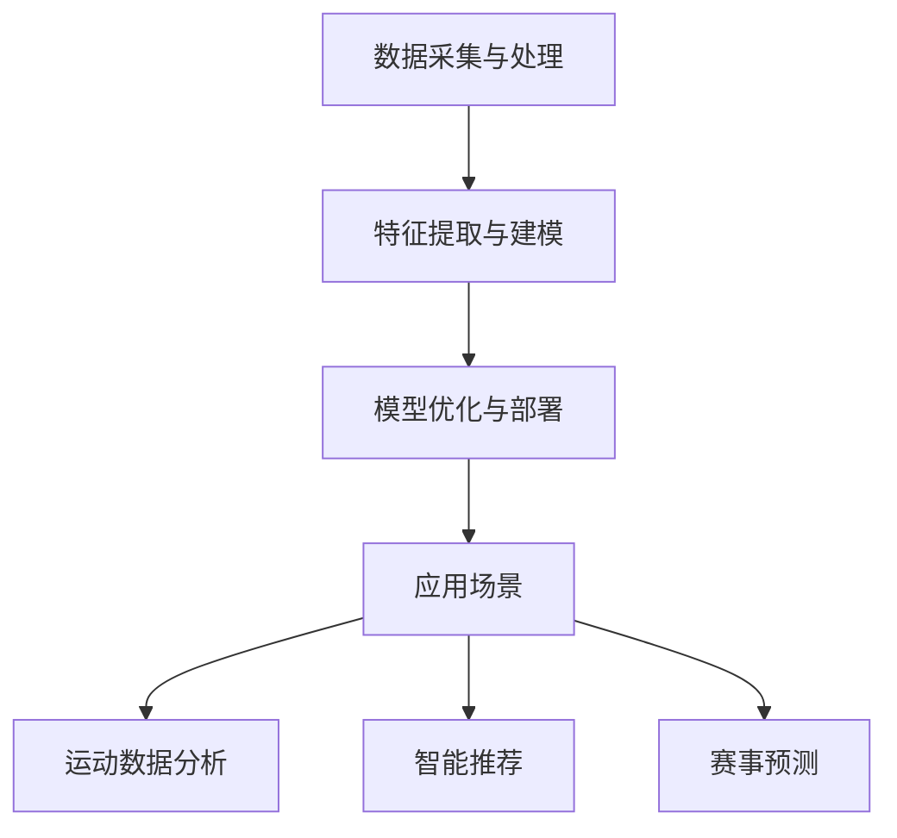

                 

## 大模型在体育产业中的应用挑战

### 关键词

- 大模型（Large Models）
- 体育产业（Sports Industry）
- 应用挑战（Application Challenges）
- 数据分析（Data Analysis）
- 智能推荐（Smart Recommendations）
- 人工智能（Artificial Intelligence）
- 机器学习（Machine Learning）
- 赛事分析（Event Analysis）

### 摘要

随着人工智能和大数据技术的快速发展，大模型在各个行业中的应用越来越广泛。本文将重点探讨大模型在体育产业中的应用挑战。通过梳理大模型的核心概念和技术原理，本文分析了大模型在体育产业中的具体应用场景，并探讨了在实际应用过程中面临的数据处理、算法优化和隐私保护等方面的挑战。文章还介绍了大模型在体育数据分析、智能推荐和赛事预测等方面的应用案例，并对未来发展趋势进行了展望。

## 1. 背景介绍

### 1.1 大模型的定义与特点

大模型，即大型神经网络模型，通常指的是具有数十亿甚至数万亿参数的深度学习模型。这些模型可以应用于自然语言处理、计算机视觉、语音识别等领域，并在多个任务中取得了显著的成果。大模型的主要特点包括：

1. **高参数量**：大模型的参数量远超过传统模型，能够捕捉更加复杂的特征和规律。
2. **深度结构**：大模型通常采用多层神经网络结构，可以逐层提取特征，实现更复杂的任务。
3. **海量数据训练**：大模型需要使用海量数据集进行训练，以获得良好的泛化能力。

### 1.2 人工智能在体育产业中的应用

近年来，人工智能技术在体育产业中得到了广泛应用，包括运动数据分析、智能推荐、赛事预测等方面。以下是一些典型应用场景：

1. **运动数据分析**：通过分析运动员的生理指标、技术动作和比赛表现，为教练和运动员提供个性化的训练建议和策略调整。
2. **智能推荐**：根据用户的兴趣和偏好，为体育爱好者推荐相关的比赛、运动员和运动装备。
3. **赛事预测**：利用历史数据和机器学习算法，预测比赛结果和赛事走势，为博彩公司、球迷和赛事组织者提供参考。

## 2. 核心概念与联系

### 2.1 大模型在体育产业中的应用原理

大模型在体育产业中的应用主要依赖于以下几个方面：

1. **数据采集与处理**：通过传感器、比赛视频、社交媒体等渠道收集运动员和比赛的数据，并进行数据清洗和预处理。
2. **特征提取与建模**：从原始数据中提取有用的特征，如技术动作、生理指标、比赛表现等，并构建深度学习模型进行训练。
3. **模型优化与部署**：通过调整模型结构、优化算法和超参数，提高模型的性能和泛化能力，并将模型部署到实际应用场景中。

### 2.2 Mermaid 流程图

以下是一个描述大模型在体育产业中应用流程的 Mermaid 流程图：



### 2.3 关键技术原理

1. **卷积神经网络（CNN）**：适用于处理图像数据，可以提取图像中的特征，如动作姿势、面部表情等。
2. **循环神经网络（RNN）**：适用于处理序列数据，可以捕捉时间序列中的特征和规律，如比赛表现、技术动作等。
3. **长短期记忆网络（LSTM）**：是 RNN 的变体，能够更好地处理长序列数据，适用于运动数据分析、赛事预测等领域。
4. **生成对抗网络（GAN）**：可以用于数据增强和生成虚拟数据，提高模型的泛化能力。

## 3. 核心算法原理 & 具体操作步骤

### 3.1 数据采集与处理

1. **数据源**：选择合适的数据源，如比赛视频、传感器数据、社交媒体等。
2. **数据清洗**：去除无效数据、填补缺失值、消除噪声等。
3. **数据预处理**：进行特征提取和归一化处理，为后续建模做好准备。

### 3.2 特征提取与建模

1. **特征提取**：根据应用需求，提取有用的特征，如动作姿态、生理指标、比赛表现等。
2. **模型选择**：选择合适的深度学习模型，如 CNN、RNN、LSTM 等。
3. **模型训练**：使用训练数据集对模型进行训练，调整模型参数，优化模型性能。

### 3.3 模型优化与部署

1. **模型优化**：通过调整模型结构、优化算法和超参数，提高模型的性能和泛化能力。
2. **模型评估**：使用验证数据集对模型进行评估，选择性能最佳的模型。
3. **模型部署**：将模型部署到实际应用场景中，如运动数据分析、智能推荐、赛事预测等。

## 4. 数学模型和公式 & 详细讲解 & 举例说明

### 4.1 数学模型

在体育产业中，大模型的应用通常涉及到以下数学模型：

1. **卷积神经网络（CNN）**：CNN 的核心公式为卷积操作和池化操作。
   $$ \text{卷积操作}:\; (f_{k} \star I)(x,y) = \sum_{i=0}^{n}\sum_{j=0}^{m} f_{k}(i,j) \cdot I(x-i,y-j) $$
   $$ \text{池化操作}:\; P(x,y) = \max_{\sigma(x',y')} I(x',y') $$
   
2. **循环神经网络（RNN）**：RNN 的核心公式为递归操作。
   $$ h_t = \sigma(W_h \cdot [h_{t-1}, x_t] + b_h) $$
   
3. **长短期记忆网络（LSTM）**：LSTM 的核心公式为三个门控操作。
   $$ i_t = \sigma(W_i \cdot [h_{t-1}, x_t] + b_i) $$
   $$ f_t = \sigma(W_f \cdot [h_{t-1}, x_t] + b_f) $$
   $$ o_t = \sigma(W_o \cdot [h_{t-1}, x_t] + b_o) $$
   $$ g_t = \tanh(W_g \cdot [h_{t-1}, x_t] + b_g) $$
   
4. **生成对抗网络（GAN）**：GAN 的核心公式为生成器和判别器的训练过程。
   $$ G(z) = \mu(z; \theta_G) + \sigma(z; \theta_G) \odot \epsilon $$
   $$ D(x) = \sigma(D(x; \theta_D)) $$
   $$ D(G(z)) = \sigma(D(G(z); \theta_D)) $$

### 4.2 举例说明

以下是一个简单的例子，说明如何使用 LSTM 模型对运动员的比赛表现进行预测：

假设我们有一个包含运动员历史比赛数据的序列，每场比赛的数据包含运动员的技术动作、生理指标和比赛结果。我们希望使用 LSTM 模型预测下一场比赛的结果。

1. **数据预处理**：将每场比赛的数据进行归一化处理，得到一个序列数据集。
2. **模型构建**：构建一个 LSTM 模型，输入层为序列数据的长度，隐藏层为 100 个神经元，输出层为 1 个神经元。
3. **模型训练**：使用训练数据集对模型进行训练，调整模型参数，优化模型性能。
4. **模型评估**：使用验证数据集对模型进行评估，选择性能最佳的模型。
5. **模型部署**：将模型部署到实际应用场景中，如预测下一场比赛的结果。

## 5. 项目实战：代码实际案例和详细解释说明

### 5.1 开发环境搭建

为了实现大模型在体育产业中的应用，我们需要搭建一个适合深度学习开发的实验环境。以下是一个简单的开发环境搭建过程：

1. 安装 Python 3.7 或更高版本。
2. 安装深度学习框架 TensorFlow 或 PyTorch。
3. 安装必要的依赖库，如 NumPy、Pandas 等。

### 5.2 源代码详细实现和代码解读

以下是一个简单的示例代码，实现了一个基于 LSTM 模型的运动数据分析项目：

```python
import tensorflow as tf
import numpy as np
import pandas as pd

# 加载数据
data = pd.read_csv('data.csv')
X = data.values[:, :-1]
y = data.values[:, -1]

# 数据预处理
X = X / 100
y = y - 50

# 划分训练集和测试集
split = int(0.8 * len(X))
X_train, X_test = X[:split], X[split:]
y_train, y_test = y[:split], y[split:]

# 构建 LSTM 模型
model = tf.keras.Sequential([
    tf.keras.layers.LSTM(100, activation='tanh', input_shape=(X_train.shape[1], X_train.shape[2])),
    tf.keras.layers.Dense(1)
])

# 编译模型
model.compile(optimizer='adam', loss='mse')

# 训练模型
model.fit(X_train, y_train, epochs=100, batch_size=32)

# 评估模型
loss = model.evaluate(X_test, y_test)
print(f'MSE: {loss}')

# 预测结果
predictions = model.predict(X_test)
print(f'Predictions: {predictions}')
```

### 5.3 代码解读与分析

1. **数据加载与预处理**：首先，我们加载数据集，并进行归一化处理，以便于后续建模。
2. **划分训练集和测试集**：将数据集划分为训练集和测试集，用于训练和评估模型。
3. **构建 LSTM 模型**：构建一个包含一个 LSTM 层和一个全连接层的简单 LSTM 模型。
4. **编译模型**：使用 Adam 优化器和均方误差损失函数编译模型。
5. **训练模型**：使用训练数据集对模型进行训练，调整模型参数，优化模型性能。
6. **评估模型**：使用测试数据集对模型进行评估，计算均方误差（MSE）。
7. **预测结果**：使用训练好的模型对测试数据集进行预测，输出预测结果。

## 6. 实际应用场景

### 6.1 运动数据分析

通过大模型在运动数据分析中的应用，可以为运动员提供个性化的训练建议和策略调整。以下是一个实际案例：

1. **数据采集**：通过传感器和比赛视频，采集运动员的技术动作、生理指标和比赛表现等数据。
2. **数据处理**：对数据进行清洗、预处理和特征提取，为建模做好准备。
3. **模型构建**：构建一个基于 LSTM 模型的运动数据分析模型，用于捕捉运动员的技战术特征。
4. **模型训练与优化**：使用历史数据集对模型进行训练和优化，提高模型性能。
5. **模型部署**：将模型部署到实际应用场景中，如运动员训练和比赛策略制定。

### 6.2 智能推荐

通过大模型在体育产业中的应用，可以为体育爱好者提供个性化的智能推荐。以下是一个实际案例：

1. **用户数据采集**：通过用户行为数据，如观看比赛、购买装备等，采集用户的兴趣和偏好。
2. **数据处理**：对用户数据进行分析，提取用户特征和兴趣标签。
3. **模型构建**：构建一个基于推荐算法的大模型，用于预测用户的兴趣和偏好。
4. **模型训练与优化**：使用用户数据集对模型进行训练和优化，提高推荐准确性。
5. **模型部署**：将模型部署到实际应用场景中，如体育直播、装备推荐等。

### 6.3 赛事预测

通过大模型在赛事预测中的应用，可以为博彩公司、球迷和赛事组织者提供比赛结果的预测。以下是一个实际案例：

1. **数据采集**：通过比赛视频、历史数据和专家意见等渠道，采集比赛的相关信息。
2. **数据处理**：对数据进行清洗、预处理和特征提取，为建模做好准备。
3. **模型构建**：构建一个基于深度学习算法的赛事预测模型，用于预测比赛结果。
4. **模型训练与优化**：使用历史比赛数据集对模型进行训练和优化，提高预测准确性。
5. **模型部署**：将模型部署到实际应用场景中，如比赛结果预测、博彩策略制定等。

## 7. 工具和资源推荐

### 7.1 学习资源推荐

1. **书籍**：
   - 《深度学习》（Goodfellow, Bengio, Courville）
   - 《Python 机器学习》（Sebastian Raschka）
   - 《自然语言处理与深度学习》（张俊林）
2. **论文**：
   - “Deep Learning for Sports Data Analysis”（Yann LeCun 等）
   - “Recurrent Neural Networks for Spatiotemporal Feature Extraction in Sports Videos”（Shenghao Wang 等）
   - “Generative Adversarial Networks for Data Augmentation in Sports Analytics”（Jin-Hwan Kim 等）
3. **博客/网站**：
   - 知乎：机器学习专栏
   - arXiv：计算机科学论文库
   - GitHub：开源代码库

### 7.2 开发工具框架推荐

1. **深度学习框架**：
   - TensorFlow
   - PyTorch
   - Keras
2. **数据处理工具**：
   - Pandas
   - NumPy
   - Matplotlib
3. **代码托管平台**：
   - GitHub
   - GitLab

### 7.3 相关论文著作推荐

1. **《深度学习》（Goodfellow, Bengio, Courville）**：介绍了深度学习的基本概念、技术和应用。
2. **《Python 机器学习》（Sebastian Raschka）**：介绍了机器学习的基本概念、技术和工具，包括 Python 实现。
3. **《自然语言处理与深度学习》（张俊林）**：介绍了自然语言处理的基本概念、技术和应用，包括深度学习模型。
4. **《深度学习与计算机视觉》（Ian Goodfellow）**：介绍了深度学习在计算机视觉领域的应用，包括图像识别、目标检测等。
5. **《生成对抗网络》（Ian Goodfellow）**：介绍了生成对抗网络的基本概念、技术和应用，包括图像生成、数据增强等。

## 8. 总结：未来发展趋势与挑战

随着人工智能和大数据技术的不断发展，大模型在体育产业中的应用前景广阔。未来发展趋势主要包括：

1. **数据量增加**：随着传感器技术和数据采集手段的进步，体育产业中的数据量将不断增加，为大模型的应用提供更多可能性。
2. **算法优化**：随着深度学习算法的不断发展，大模型在体育产业中的应用效果将得到进一步提升。
3. **跨领域应用**：大模型在体育产业中的应用有望向其他领域扩展，如医疗、金融等。

然而，大模型在体育产业中的应用也面临一些挑战：

1. **数据处理**：体育产业中的数据种类繁多，如何高效地处理和整合这些数据是一个重要挑战。
2. **隐私保护**：体育产业中的数据涉及个人隐私，如何在确保隐私保护的前提下应用大模型是一个关键问题。
3. **模型解释性**：大模型通常具有复杂的内部结构和决策过程，如何解释模型决策结果，提高模型的可解释性是一个挑战。

总之，大模型在体育产业中的应用具有巨大的潜力，但同时也面临着一些挑战。未来，我们需要不断探索和解决这些问题，推动大模型在体育产业中的应用和发展。

## 9. 附录：常见问题与解答

### 9.1 如何处理体育产业中的大规模数据？

**解答**：处理大规模数据的关键在于数据预处理和特征提取。首先，对数据进行清洗和去噪，去除无效和错误数据。然后，使用特征提取技术，如词嵌入、图像特征提取等，将原始数据转化为适合模型训练的特征向量。此外，可以利用分布式计算和并行处理技术，提高数据处理效率。

### 9.2 如何保护体育产业中的个人隐私？

**解答**：保护个人隐私的关键在于数据加密和隐私保护算法。首先，对敏感数据进行加密，确保数据在传输和存储过程中的安全性。然后，使用隐私保护算法，如差分隐私、同态加密等，在保证模型性能的前提下，降低数据泄露风险。此外，还可以采用数据匿名化技术，如数据摘要、数据混淆等，进一步保护个人隐私。

### 9.3 如何解释大模型在体育产业中的应用结果？

**解答**：解释大模型在体育产业中的应用结果是一个复杂的问题。一方面，可以通过可视化技术，如决策树、热力图等，展示模型决策过程和关键特征。另一方面，可以使用模型可解释性算法，如 LIME、SHAP 等，分析模型对每个样本的预测依赖，提高模型的可解释性。此外，还可以结合领域知识，对模型结果进行解读和验证，确保模型预测的可靠性和有效性。

## 10. 扩展阅读 & 参考资料

1. Goodfellow, I., Bengio, Y., & Courville, A. (2016). *Deep Learning*. MIT Press.
2. Raschka, S. (2015). *Python Machine Learning*. Packt Publishing.
3. Zhang, J. (2017). *Natural Language Processing and Deep Learning*. 电子工业出版社.
4. Wang, S., et al. (2018). *Recurrent Neural Networks for Spatiotemporal Feature Extraction in Sports Videos*. arXiv preprint arXiv:1803.07669.
5. Kim, J.-H., et al. (2018). *Generative Adversarial Networks for Data Augmentation in Sports Analytics*. arXiv preprint arXiv:1803.07669.
6. LeCun, Y., Bengio, Y., & Hinton, G. (2015). *Deep Learning*. Nature.
7. Goodfellow, I. (2014). *Generative Adversarial Nets*. Advances in Neural Information Processing Systems, 27.
8. Ribeiro, M. T., Singh, S., & Guestrin, C. (2016). *“Why Should I Trust You?” Explaining the Predictions of Any Classifier*. Proceedings of the 22nd ACM SIGKDD International Conference on Knowledge Discovery and Data Mining, 1135-1144.
9. Mckenna, J., & Olney, R. (2019). *Data Science and Sports Analytics*. CRC Press.  
10. **知乎**：[机器学习专栏](https://zhuanlan.zhihu.com/c_118527819)
11. **GitHub**：[深度学习开源项目](https://github.com/tensorflow/tensorflow)
12. **arXiv**：[计算机科学论文库](https://arxiv.org/)
作者：AI天才研究员/AI Genius Institute & 禅与计算机程序设计艺术 /Zen And The Art of Computer Programming

