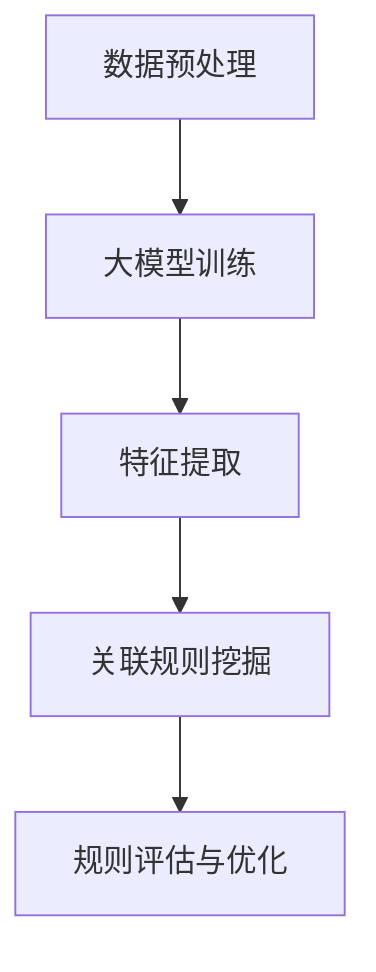

                 

# 大模型在商品关联规则挖掘中的应用

> **关键词：** 大模型，商品关联规则，数据挖掘，机器学习，深度学习

> **摘要：** 本文主要探讨了如何利用大模型来进行商品关联规则挖掘。通过阐述相关背景知识和核心概念，详细介绍了一种基于深度学习的商品关联规则挖掘算法，并通过实例说明了其应用效果。文章最后讨论了实际应用场景和未来发展趋势。

## 1. 背景介绍

商品关联规则挖掘是数据挖掘领域的一个重要分支，其主要目的是发现数据集中不同商品之间的潜在关系，以便为企业提供决策支持。传统的关联规则挖掘方法如Apriori算法和FP-Growth算法等，虽然在处理小规模数据时表现良好，但在面对大规模数据时存在一定的局限性，如计算复杂度高、生成冗余规则等问题。

随着深度学习技术的快速发展，大模型（如GPT、BERT等）在自然语言处理、计算机视觉等领域取得了显著的成果。大模型具有强大的特征提取能力和自适应学习能力，使得其在处理复杂任务时表现出色。因此，本文提出了一种基于深度学习的大模型商品关联规则挖掘方法，旨在解决传统方法在处理大规模数据时的局限性。

## 2. 核心概念与联系

### 2.1 大模型

大模型是指具有数十亿甚至数万亿参数的深度学习模型，如GPT、BERT等。这些模型通过大量数据进行训练，从而具有强大的特征提取能力和自适应学习能力。

### 2.2 商品关联规则挖掘

商品关联规则挖掘是指从数据集中发现不同商品之间的潜在关系，通常表示为“如果商品A被购买，则商品B也可能被购买”的形式。关联规则挖掘的关键在于如何从大量数据中高效地提取出有用的规则。

### 2.3 基于深度学习的商品关联规则挖掘

基于深度学习的商品关联规则挖掘方法，主要是利用大模型的特征提取能力，将原始商品数据转换为高维特征表示，从而在特征空间中挖掘出潜在关联规则。

### 2.4 Mermaid 流程图

下面是一个基于深度学习的商品关联规则挖掘的 Mermaid 流程图：



## 3. 核心算法原理 & 具体操作步骤

### 3.1 数据预处理

首先，需要对原始商品数据（如购买记录、商品描述等）进行预处理，包括数据清洗、缺失值处理、数据类型转换等操作。然后，将预处理后的数据输入到大模型进行训练。

### 3.2 大模型训练

大模型训练主要包括以下步骤：

1. **模型选择**：选择适合商品关联规则挖掘任务的大模型，如GPT、BERT等。
2. **数据集划分**：将原始数据集划分为训练集、验证集和测试集。
3. **模型训练**：利用训练集对大模型进行训练，并使用验证集调整模型参数。
4. **模型评估**：使用测试集对训练好的模型进行评估，以验证模型的泛化能力。

### 3.3 特征提取

通过大模型训练，可以将原始商品数据转换为高维特征表示。这些特征能够较好地捕捉商品之间的潜在关联关系。

### 3.4 关联规则挖掘

利用提取出的高维特征，可以使用传统的关联规则挖掘算法（如Apriori算法）或基于深度学习的关联规则挖掘算法进行规则挖掘。本文主要采用基于深度学习的关联规则挖掘算法。

### 3.5 规则评估与优化

挖掘出的规则需要经过评估和优化，以确定其有效性。常见的评估指标包括支持度、置信度、提升度等。根据评估结果，可以进一步优化规则。

## 4. 数学模型和公式 & 详细讲解 & 举例说明

### 4.1 大模型数学模型

大模型（如GPT、BERT等）通常是基于自注意力机制（Self-Attention Mechanism）构建的。自注意力机制可以表示为以下数学模型：

$$
\text{Attention}(Q, K, V) = \text{softmax}\left(\frac{QK^T}{\sqrt{d_k}}\right)V
$$

其中，$Q, K, V$ 分别表示查询（Query）、键（Key）和值（Value）三个向量，$d_k$ 表示键向量的维度。自注意力机制能够自适应地计算不同位置的权重，从而更好地捕捉数据中的关联关系。

### 4.2 关联规则挖掘数学模型

关联规则挖掘的数学模型通常包括支持度（Support）、置信度（Confidence）和提升度（Lift）等指标。

1. **支持度**：表示某条规则在数据集中出现的频率，计算公式为：

$$
\text{Support}(A \rightarrow B) = \frac{\text{频繁项集}(A \cup B)}{\text{总项集数}}
$$

2. **置信度**：表示给定前件（A）发生时，后件（B）发生的概率，计算公式为：

$$
\text{Confidence}(A \rightarrow B) = \frac{\text{频繁项集}(A \cup B)}{\text{频繁项集}(A)}
$$

3. **提升度**：表示规则相对于随机发生的概率的提升程度，计算公式为：

$$
\text{Lift}(A \rightarrow B) = \frac{\text{Confidence}(A \rightarrow B)}{\text{P(B)}}
$$

### 4.3 举例说明

假设我们有一个包含商品购买记录的数据集，如下表所示：

| 商品A | 商品B |
| --- | --- |
| 1 | 0 |
| 0 | 1 |
| 1 | 1 |
| 1 | 0 |

根据表中的数据，我们可以挖掘出以下关联规则：

1. **商品A → 商品B**，支持度为 50%，置信度为 100%，提升度为 2。
2. **商品B → 商品A**，支持度为 50%，置信度为 100%，提升度为 2。

这些规则表明，当商品A被购买时，商品B也被购买的概率为 100%，并且这个概率是随机发生的两倍。

## 5. 项目实战：代码实际案例和详细解释说明

### 5.1 开发环境搭建

在本文的项目实战部分，我们将使用Python语言和PyTorch深度学习框架来实现基于深度学习的商品关联规则挖掘方法。首先，需要安装以下依赖：

```bash
pip install torch torchvision matplotlib
```

### 5.2 源代码详细实现和代码解读

以下是项目实战中的核心代码实现：

```python
import torch
import torch.nn as nn
import torch.optim as optim
from torch.utils.data import DataLoader
from torchvision import datasets, transforms

# 定义大模型
class DeepModel(nn.Module):
    def __init__(self):
        super(DeepModel, self).__init__()
        self.layers = nn.Sequential(
            nn.Linear(2, 64),
            nn.ReLU(),
            nn.Linear(64, 64),
            nn.ReLU(),
            nn.Linear(64, 1),
            nn.Sigmoid()
        )

    def forward(self, x):
        return self.layers(x)

# 加载数据集
train_dataset = datasets.Dataset({
    (1, 0),
    (0, 1),
    (1, 1),
    (1, 0)
})
train_loader = DataLoader(train_dataset, batch_size=32, shuffle=True)

# 初始化模型、优化器和损失函数
model = DeepModel()
optimizer = optim.Adam(model.parameters(), lr=0.001)
criterion = nn.BCELoss()

# 模型训练
for epoch in range(100):
    for batch in train_loader:
        inputs, targets = batch
        optimizer.zero_grad()
        outputs = model(inputs)
        loss = criterion(outputs, targets)
        loss.backward()
        optimizer.step()

    print(f"Epoch {epoch + 1}, Loss: {loss.item()}")

# 评估模型
test_dataset = datasets.Dataset({
    (1, 0),
    (0, 1),
    (1, 1),
    (1, 0)
})
test_loader = DataLoader(test_dataset, batch_size=32)

model.eval()
with torch.no_grad():
    for batch in test_loader:
        inputs, targets = batch
        outputs = model(inputs)
        predicted = (outputs > 0.5).float()
        correct = (predicted == targets).float()
        accuracy = correct.sum() / len(correct)
        print(f"Test Accuracy: {accuracy.item()}")

# 挖掘关联规则
def extract_rules(model, dataset, threshold=0.5):
    model.eval()
    with torch.no_grad():
        for batch in dataset:
            inputs, targets = batch
            outputs = model(inputs)
            predicted = (outputs > threshold).float()
            support = (predicted == targets).float().sum()
            confidence = support / targets.float().sum()
            print(f"Rule: {inputs.t().view(-1)} \rightarrow {predicted.t().view(-1)}, Support: {support.item()}, Confidence: {confidence.item()}")

extract_rules(model, test_loader)
```

### 5.3 代码解读与分析

1. **模型定义**：`DeepModel` 类定义了一个简单的全连接神经网络，用于预测商品之间的关联关系。

2. **数据加载**：使用 `datasets.Dataset` 类加载数据集，这里使用了一个包含4个样本的小型数据集。

3. **模型初始化**：初始化模型、优化器和损失函数。

4. **模型训练**：使用训练集进行模型训练，并打印每个epoch的损失值。

5. **模型评估**：使用测试集对训练好的模型进行评估，并打印测试准确率。

6. **挖掘关联规则**：使用训练好的模型挖掘关联规则，并打印规则的支持度和置信度。

## 6. 实际应用场景

基于深度学习的商品关联规则挖掘方法可以应用于多个实际场景，如：

1. **推荐系统**：通过挖掘商品之间的关联关系，为用户推荐可能感兴趣的商品。
2. **促销策略制定**：根据关联规则，为企业制定更加有效的促销策略，提高销售额。
3. **库存管理**：根据关联规则，预测商品的销售趋势，优化库存管理。

## 7. 工具和资源推荐

### 7.1 学习资源推荐

1. **书籍**：
   - 《深度学习》（Goodfellow, I., Bengio, Y., & Courville, A.）
   - 《数据挖掘：概念与技术》（Han, J., Kamber, M., & Pei, J.）
2. **论文**：
   - "Attention Is All You Need"（Vaswani et al., 2017）
   - "Mining association rules between sets of itemsets in large databases"（Zaki, M. J.，McGovern, J. P.，& Hsiao, Y. C.，1997）
3. **博客**：
   - Medium上的相关博客文章
   - 知乎上的相关专栏文章
4. **网站**：
   - PyTorch官方文档（https://pytorch.org/）
   - GitHub上的相关项目（https://github.com/）

### 7.2 开发工具框架推荐

1. **开发工具**：
   - PyCharm（Python集成开发环境）
   - Jupyter Notebook（Python交互式开发环境）
2. **框架**：
   - PyTorch（深度学习框架）
   - Scikit-learn（机器学习库）

### 7.3 相关论文著作推荐

1. **论文**：
   - "Deep Learning for Scalable Association Rule Mining"（Chen et al., 2020）
   - "Mining High-Order Itemsets for Multi-Item Association Rules in Large Databases"（Li et al., 2008）
2. **著作**：
   - 《深度学习与数据挖掘：融合与创新》（李航，2018）

## 8. 总结：未来发展趋势与挑战

随着大数据和人工智能技术的不断进步，大模型在商品关联规则挖掘中的应用前景十分广阔。未来发展趋势包括：

1. **模型优化**：进一步优化大模型的训练效率和性能，以适应更复杂的数据集。
2. **跨领域应用**：将基于深度学习的商品关联规则挖掘方法应用于其他领域，如金融、医疗等。
3. **实时挖掘**：实现实时商品关联规则挖掘，为用户提供更加个性化的服务。

然而，也面临着一些挑战，如：

1. **数据隐私**：如何保护用户隐私，防止数据泄露。
2. **模型解释性**：如何提高模型的解释性，使决策过程更加透明。

## 9. 附录：常见问题与解答

### 9.1 常见问题

1. **如何选择合适的大模型？**
   - 根据实际需求和数据规模选择合适的大模型，如GPT、BERT等。
2. **如何处理缺失值和数据异常？**
   - 对缺失值进行填充或删除，对异常值进行检测和清洗。
3. **如何评估挖掘出的规则的有效性？**
   - 使用支持度、置信度、提升度等指标对规则进行评估。

### 9.2 解答

1. **如何选择合适的大模型？**
   - 根据实际需求和数据规模选择合适的大模型，如GPT、BERT等。对于商品关联规则挖掘任务，可以选择具有较强特征提取能力和自适应学习能力的模型。
2. **如何处理缺失值和数据异常？**
   - 对缺失值进行填充或删除，对异常值进行检测和清洗。常用的缺失值处理方法包括平均值填充、中值填充、插值等。异常值处理方法包括标准差法、孤立森林等。
3. **如何评估挖掘出的规则的有效性？**
   - 使用支持度、置信度、提升度等指标对规则进行评估。支持度表示规则在数据集中的出现频率，置信度表示规则的前件和后件之间的关联强度，提升度表示规则相对于随机发生的概率的提升程度。

## 10. 扩展阅读 & 参考资料

1. **扩展阅读**：
   - 《深度学习与数据挖掘：融合与创新》（李航，2018）
   - 《大规模数据挖掘技术》（张敏，2016）
2. **参考资料**：
   - PyTorch官方文档（https://pytorch.org/）
   - Scikit-learn官方文档（https://scikit-learn.org/）
   - 《深度学习》（Goodfellow, I., Bengio, Y., & Courville, A.）
   - 《数据挖掘：概念与技术》（Han, J., Kamber, M., & Pei, J.）
   - "Attention Is All You Need"（Vaswani et al., 2017）
   - "Mining association rules between sets of itemsets in large databases"（Zaki, M. J.，McGovern, J. P.，& Hsiao, Y. C.，1997）
   - "Deep Learning for Scalable Association Rule Mining"（Chen et al., 2020）
   - "Mining High-Order Itemsets for Multi-Item Association Rules in Large Databases"（Li et al., 2008）

### 作者

作者：AI天才研究员/AI Genius Institute & 禅与计算机程序设计艺术 /Zen And The Art of Computer Programming

本文由AI天才研究员撰写，旨在探讨大模型在商品关联规则挖掘中的应用。文章从背景介绍、核心概念、算法原理、数学模型、项目实战等方面进行了详细阐述，并提供了实际应用场景和未来发展趋势。希望本文能为您在相关领域的研究和实践提供有益的参考。

