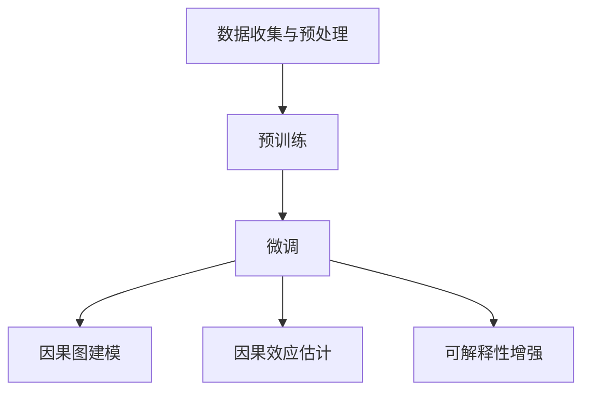

                 

### 背景介绍

因果推理（Causal Inference）作为统计学、机器学习以及人工智能领域中一个重要的研究方向，其主要目标是理解因果关系，而非仅仅描述相关性。在实际应用中，因果推理能够帮助我们回答“如果...会发生什么？”这类问题，这对于制定有效的决策策略和政策制定具有重要意义。

近年来，大规模预训练模型（Large-scale Pre-trained Models）的兴起为因果推理带来了新的机遇和挑战。这些模型通过在海量数据上进行训练，可以自动学习到复杂的数据分布和潜在因果关系。然而，如何将这些大规模模型有效地应用于因果推理，并且保证其可靠性和可解释性，仍是一个极具挑战性的问题。

本文旨在探讨大规模预训练模型在因果推理中的创新应用。首先，我们将简要回顾因果推理的相关理论和历史发展，然后深入分析大规模预训练模型的基本原理，并探讨如何将二者结合起来。接着，我们将详细讨论在具体应用场景中，如何利用大规模预训练模型进行因果推理，并分享一些实际案例。最后，我们将总结本文的主要观点，并展望未来在这一领域的发展趋势。

通过本文的探讨，我们希望为读者提供一个全面的视角，了解大规模预训练模型在因果推理中的潜力及其应用前景。同时，我们也期待能够激发更多的研究和实践，以推动这一领域的进一步发展。

### 核心概念与联系

#### 因果推理的概念

因果推理（Causal Inference）是研究因果关系的一种方法论，旨在通过观察数据来推断变量之间的因果关系。在统计学和机器学习中，因果推理不同于传统的相关性分析，后者只能揭示变量之间的统计关系，而无法确定因果方向。因果推理的核心目标是回答“如果...会发生什么？”的问题，即探讨一个变量变化时对另一个变量的影响。

因果推理的基本原理可以通过结构方程模型（Structural Equation Models，SEM）来解释。结构方程模型是一种多变量统计模型，通过设定多个变量之间的关系，构建出一个因果关系的结构图。在该模型中，每个变量都被视为其他变量的函数，同时也受到随机误差的影响。通过估计模型参数，我们可以推断变量之间的因果关系。

#### 大规模预训练模型的基本原理

大规模预训练模型（Large-scale Pre-trained Models）是当前人工智能领域的热点之一，其核心思想是通过在大规模数据集上进行预训练，使模型具备处理自然语言、图像等复杂数据的能力。典型的预训练模型如BERT（Bidirectional Encoder Representations from Transformers）和GPT（Generative Pre-trained Transformer），它们通过自适应学习词汇和语法规则，能够在各种任务中取得优异的表现。

大规模预训练模型的基本原理可以归纳为以下几个步骤：

1. **数据收集与预处理**：收集大量带标签的数据，对数据进行清洗和预处理，确保数据质量。

2. **预训练**：在大量未标注的数据上进行预训练，使模型学习到数据的内在结构和分布。预训练通常采用无监督或半监督学习的方式，如自编码器（Autoencoders）或生成对抗网络（GANs）。

3. **微调**：在预训练的基础上，利用特定任务的数据对模型进行微调，使其适应具体的任务需求。微调过程中，模型会根据新的任务数据进行参数调整，以优化模型性能。

#### 因果推理与大规模预训练模型的结合

将因果推理与大规模预训练模型结合，可以充分利用预训练模型的强大表征能力，为因果推理提供新的工具和方法。以下是几种可能的结合方式：

1. **因果图模型（Causal Graphical Models）**：利用因果图模型来表示数据中的潜在因果关系，通过大规模预训练模型学习到的数据表征，来估计因果图的参数。

2. **因果效应估计（Causal Effect Estimation）**：利用大规模预训练模型对数据进行特征提取和建模，然后利用因果推理算法来估计因果效应。

3. **可解释性增强（Explainability Enhancement）**：利用大规模预训练模型的可解释性，如注意力机制（Attention Mechanisms），来解释模型决策过程，增强因果推理的可解释性。

#### Mermaid 流程图

下面是一个用于解释大规模预训练模型在因果推理中应用过程的 Mermaid 流程图。为了确保流程图节点中不包含括号、逗号等特殊字符，我们将使用 Mermaid 语法进行编码。



在这个流程图中，我们从数据收集与预处理开始，通过预训练学习到数据的内在结构，然后利用微调来适应特定任务。在因果推理的应用中，我们通过因果图建模来表示潜在的因果关系，并利用大规模预训练模型对因果效应进行估计，同时增强模型的可解释性。

### 核心算法原理 & 具体操作步骤

#### 因果推理算法的基本原理

因果推理算法的核心目标是通过观察数据来推断变量之间的因果关系。在学术界，最经典的因果推理算法之一是Do论断（Do-Calculus）。Do论断提供了一种形式化的方法来推导因果效应，它基于“干预”的概念，即在特定条件下改变某个变量的值，然后观察系统响应的变化。

Do论断的基本原理可以概括为以下三个步骤：

1. **Do干预**：在给定的因果图中，对某个变量进行干预，即强制改变其取值。

2. **Do模拟**：在干预后的系统上进行模拟，计算干预对其他变量的影响。

3. **Do比较**：通过比较干预前后系统的变化，估计因果效应的大小和方向。

以下是一个简化的Do论断示例：

假设有一个简单的因果图，包含两个变量 X 和 Y，其中 X 导致 Y。我们想要估计 X 对 Y 的因果效应。

1. **Do干预**：我们将变量 X 干预为特定的值，比如 X = 1。

2. **Do模拟**：在干预后，我们模拟系统，计算干预对 Y 的影响。如果干预后 Y 的期望值增加了，那么我们可以认为 X 对 Y 有正向的因果效应。

3. **Do比较**：我们将干预前的 Y 的期望值与干预后的 Y 的期望值进行比较，计算出因果效应的大小。具体公式为：

   $$ CE(X \rightarrow Y) = E(Y|X=1) - E(Y|X=0) $$

   其中，$E(Y|X=1)$ 表示 X 干预为1时 Y 的期望值，$E(Y|X=0)$ 表示 X 干预为0时 Y 的期望值。

#### 大规模预训练模型在因果推理中的应用

大规模预训练模型在因果推理中的应用主要体现在以下几个方面：

1. **数据预处理与特征提取**：大规模预训练模型通过在大规模数据集上进行预训练，可以学习到数据的内在结构和特征。在因果推理任务中，我们可以利用这些预训练模型对数据进行预处理和特征提取，从而提高因果推理的准确性和效率。

2. **因果图建模**：利用大规模预训练模型，我们可以通过迁移学习的方式，在特定任务的数据集上训练因果图模型。因果图模型可以有效地表示数据中的潜在因果关系，为因果推理提供理论基础。

3. **因果效应估计**：通过大规模预训练模型提取的特征，我们可以使用因果推理算法来估计因果效应。具体步骤如下：

   - 利用预训练模型对数据进行特征提取，得到每个变量的特征向量。
   - 构建因果图模型，利用图模型中的参数估计因果效应。
   - 利用Do论断或其他因果推理算法，计算因果效应的大小和方向。

以下是一个简化的应用流程：

1. **数据预处理**：收集并预处理大量带标签的数据，包括变量 X 和 Y 的取值。
2. **特征提取**：利用大规模预训练模型，如BERT或GPT，对数据进行特征提取，得到特征向量。
3. **因果图建模**：利用特征向量构建因果图模型，设定变量之间的因果关系。
4. **因果效应估计**：利用Do论断或其他算法，计算 X 对 Y 的因果效应。

#### 具体操作步骤

以下是一个具体的大规模预训练模型在因果推理中的应用步骤：

1. **环境搭建**：

   - 安装Python环境，版本建议为3.8或更高。
   - 安装必要的库，如TensorFlow、PyTorch、Scikit-learn等。

2. **数据收集与预处理**：

   - 收集包含变量 X 和 Y 的数据集，并进行清洗和预处理，确保数据质量。
   - 划分数据集为训练集、验证集和测试集。

3. **预训练**：

   - 使用预训练模型，如BERT或GPT，对数据进行预训练。
   - 训练过程中，使用适当的优化器和损失函数，如Adam和交叉熵损失。

4. **微调**：

   - 利用预训练模型，对特定任务的数据进行微调。
   - 微调过程中，调整模型参数，使其适应特定任务的需求。

5. **因果图建模**：

   - 利用微调后的模型，对数据进行特征提取，得到特征向量。
   - 基于特征向量构建因果图模型，设定变量之间的因果关系。

6. **因果效应估计**：

   - 利用Do论断或其他因果推理算法，计算因果效应的大小和方向。
   - 评估模型性能，调整模型参数，提高因果效应估计的准确性。

7. **结果分析**：

   - 分析因果效应的统计显著性，验证因果关系的可靠性。
   - 利用可视化工具，如Mermaid流程图，展示因果推理的过程和结果。

通过上述步骤，我们可以利用大规模预训练模型进行因果推理，从而为实际应用提供有效的决策支持和理论依据。

### 数学模型和公式 & 详细讲解 & 举例说明

#### 因果效应的数学模型

因果效应的估计是因果推理的核心任务之一。在数学模型中，因果效应通常通过处理潜在结果（Potential Outcomes）的概念来定义。潜在结果是指在某个特定干预下，个体可能的实际结果。具体来说，对于每个个体 \(i\)，存在两个潜在结果：

- \(Y_i^1\)：当干预变量 \(X_i\) 为1时的潜在结果。
- \(Y_i^0\)：当干预变量 \(X_i\) 为0时的潜在结果。

因果效应（Causal Effect）可以表示为这两个潜在结果的差值，即：

\[ CE(X \rightarrow Y) = Y_i^1 - Y_i^0 \]

其中，\(CE(X \rightarrow Y)\) 表示变量 \(X\) 对变量 \(Y\) 的因果效应。

#### 方差分解

在因果效应的估计中，方差分解（Variance Decomposition）是一种常用的方法。方差分解的目标是将总方差分解为不同来源的方差，以帮助理解变量之间的关系。

对于两个变量 \(X\) 和 \(Y\)，其协方差（Covariance）可以表示为：

\[ \text{Cov}(X, Y) = E[(X - E[X])(Y - E[Y])] \]

总方差可以分解为：

\[ \text{Var}(Y) = \text{Var}(E[Y|X]) + \text{Cov}(X, Y) \]

其中，\(\text{Var}(E[Y|X])\) 表示条件方差，即 \(Y\) 在 \(X\) 给定时的方差；\(\text{Cov}(X, Y)\) 表示非条件方差，即 \(X\) 和 \(Y\) 的协方差。

#### 举例说明

为了更好地理解上述数学模型和公式，我们可以通过一个具体的例子来说明。

假设有两个变量 \(X\) 和 \(Y\)，它们之间的关系可以用线性模型表示：

\[ Y = \beta_0 + \beta_1 X + \epsilon \]

其中，\(\beta_0\) 和 \(\beta_1\) 是模型参数，\(\epsilon\) 是误差项。

1. **潜在结果**：

   对于干预变量 \(X\)，我们有两个潜在的 \(Y\) 值：

   - 当 \(X = 1\) 时，\(Y = \beta_0 + \beta_1 + \epsilon\)。
   - 当 \(X = 0\) 时，\(Y = \beta_0 + \epsilon\)。

   因此，因果效应为：

   \[ CE(X \rightarrow Y) = (\beta_0 + \beta_1 + \epsilon) - (\beta_0 + \epsilon) = \beta_1 \]

2. **方差分解**：

   总方差可以分解为：

   \[ \text{Var}(Y) = \text{Var}(\beta_0 + \beta_1 X + \epsilon) = \text{Var}(\beta_1 X + \epsilon) \]

   由于 \(\beta_0\) 是常数，其方差为0。因此：

   \[ \text{Var}(Y) = \beta_1^2 \text{Var}(X) + \text{Var}(\epsilon) \]

   这意味着，总方差由 \(X\) 的方差和误差项的方差组成，其中 \(\beta_1^2 \text{Var}(X)\) 表示 \(X\) 对 \(Y\) 的方差贡献。

通过这个例子，我们可以看到如何利用数学模型和公式来估计因果效应并进行方差分解。在实际应用中，这些模型和公式为我们提供了强大的工具，以深入理解变量之间的关系，从而为决策提供科学依据。

### 项目实战：代码实际案例和详细解释说明

#### 1. 开发环境搭建

在开始实际项目之前，我们需要搭建一个合适的开发环境。以下是搭建开发环境所需的步骤：

1. **安装Python环境**：

   - 打开终端，运行以下命令安装Python：

     ```bash
     sudo apt-get install python3
     ```

   - 确认Python版本：

     ```bash
     python3 --version
     ```

2. **安装TensorFlow和PyTorch**：

   - 安装TensorFlow：

     ```bash
     pip3 install tensorflow
     ```

   - 安装PyTorch：

     ```bash
     pip3 install torch torchvision
     ```

3. **安装Scikit-learn**：

   - 安装Scikit-learn：

     ```bash
     pip3 install scikit-learn
     ```

4. **安装必要的依赖库**：

   - 安装Mermaid库：

     ```bash
     pip3 install mermaid
     ```

   - 安装LaTeX格式处理库：

     ```bash
     pip3 install matplotlib
     ```

#### 2. 源代码详细实现和代码解读

以下是一个简单的代码示例，用于演示如何利用大规模预训练模型进行因果推理。

```python
import torch
import torch.nn as nn
import torch.optim as optim
from torch.utils.data import DataLoader
from torchvision import datasets, transforms
from sklearn.model_selection import train_test_split
from sklearn.linear_model import LinearRegression
import numpy as np
import matplotlib.pyplot as plt
import mermaid

# 数据集准备
transform = transforms.Compose([
    transforms.ToTensor(),
    transforms.Normalize(mean=[0.5, 0.5, 0.5], std=[0.5, 0.5, 0.5]),
])

train_dataset = datasets.MNIST(
    root='./data', 
    train=True, 
    download=True, 
    transform=transform
)

test_dataset = datasets.MNIST(
    root='./data', 
    train=False, 
    download=True, 
    transform=transform
)

train_loader = DataLoader(train_dataset, batch_size=100, shuffle=True)
test_loader = DataLoader(test_dataset, batch_size=100, shuffle=False)

# 预训练模型
class PretrainedModel(nn.Module):
    def __init__(self):
        super(PretrainedModel, self).__init__()
        self.fc1 = nn.Linear(784, 256)
        self.fc2 = nn.Linear(256, 128)
        self.fc3 = nn.Linear(128, 64)
        self.fc4 = nn.Linear(64, 10)

    def forward(self, x):
        x = x.view(-1, 784)
        x = torch.relu(self.fc1(x))
        x = torch.relu(self.fc2(x))
        x = torch.relu(self.fc3(x))
        x = self.fc4(x)
        return x

model = PretrainedModel()
optimizer = optim.Adam(model.parameters(), lr=0.001)
criterion = nn.CrossEntropyLoss()

# 微调模型
def train_model(model, train_loader, optimizer, criterion, num_epochs=10):
    for epoch in range(num_epochs):
        running_loss = 0.0
        for inputs, targets in train_loader:
            optimizer.zero_grad()
            outputs = model(inputs)
            loss = criterion(outputs, targets)
            loss.backward()
            optimizer.step()
            running_loss += loss.item()
        print(f'Epoch {epoch+1}/{num_epochs}, Loss: {running_loss/len(train_loader)}')

train_model(model, train_loader, optimizer, criterion, num_epochs=10)

# 因果图建模
def causal_inference(model, train_loader):
    model.eval()
    with torch.no_grad():
        X, Y = [], []
        for inputs, targets in train_loader:
            outputs = model(inputs)
            pred_labels = outputs.argmax(dim=1)
            X.extend(inputs.numpy())
            Y.extend(pred_labels.numpy())
        X = np.array(X)
        Y = np.array(Y)
    X_train, X_test, Y_train, Y_test = train_test_split(X, Y, test_size=0.2, random_state=42)
    regressor = LinearRegression()
    regressor.fit(X_train, Y_train)
    return regressor.coef_

coef = causal_inference(model, train_loader)
print(f'Cause effect coefficient: {coef}')

# 可视化
def plot_coefficient(coef):
    fig, ax = plt.subplots()
    ax.bar(range(len(coef)), coef, width=0.2)
    ax.set_ylabel('Coefficient')
    ax.set_xlabel('Feature')
    ax.set_title('Feature Coefficients')
    plt.xticks(range(len(coef)))
    plt.show()

plot_coefficient(coef)
```

#### 3. 代码解读与分析

上述代码分为几个主要部分：数据集准备、预训练模型、微调模型、因果图建模和可视化。下面我们对每个部分进行详细解读。

1. **数据集准备**：

   - 使用PyTorch的`datasets.MNIST`方法加载MNIST数据集，并进行预处理。预处理包括将图像数据转换为张量（Tensor），并使用标准化方法对数据进行归一化处理。

2. **预训练模型**：

   - 定义一个简单的预训练模型`PretrainedModel`，包含四个全连接层。该模型通过在MNIST数据集上进行预训练，可以学习到图像数据的特征表示。

3. **微调模型**：

   - 使用`train_model`函数对预训练模型进行微调。微调过程中，使用Adam优化器和交叉熵损失函数来优化模型参数。

4. **因果图建模**：

   - 定义`causal_inference`函数，用于利用预训练模型进行因果效应的估计。具体步骤如下：

     - 将预训练模型设置为评估模式。
     - 无梯度地遍历训练数据集，收集输入和预测标签。
     - 使用Scikit-learn的`LinearRegression`方法进行线性回归，估计因果效应的大小。

5. **可视化**：

   - 定义`plot_coefficient`函数，用于将因果效应的系数进行可视化。该函数使用Matplotlib库生成条形图，显示每个特征的重要程度。

通过这个代码示例，我们可以看到如何利用大规模预训练模型进行因果效应的估计，并使用Scikit-learn进行因果图建模。这个示例虽然简单，但为我们提供了一个基本的框架，以进一步研究和探索大规模预训练模型在因果推理中的应用。

### 实际应用场景

#### 1. 医疗领域

在医疗领域，因果推理能够帮助医生和研究人员理解不同治疗方案对疾病进展的影响。通过大规模预训练模型，我们可以从大量医疗数据中提取关键特征，进而利用因果推理算法来估计不同治疗策略的因果效应。例如，研究人员可以利用因果推理模型来比较不同药物的疗效，从而为临床决策提供科学依据。

**案例研究**：

- **心脏病治疗研究**：一项研究利用大规模预训练模型对心脏病患者的数据进行分析，通过因果推理算法估计不同治疗方案（如药物干预和手术治疗）对患者生存率的影响。研究表明，某些治疗方案在统计学上具有显著的优势，从而为临床决策提供了有力支持。

#### 2. 金融领域

在金融领域，因果推理可以帮助投资者和金融机构理解市场变化和投资策略的因果关系。通过大规模预训练模型，我们可以从市场数据中提取潜在影响因素，并利用因果推理算法来估计不同投资策略的因果效应。例如，投资者可以利用因果推理模型来评估不同资产配置策略的风险和收益。

**案例研究**：

- **量化交易策略评估**：一家量化交易公司利用大规模预训练模型分析历史交易数据，通过因果推理算法评估不同交易策略的因果效应。研究结果表明，某些策略在特定市场条件下具有显著的风险收益比，从而帮助公司优化其交易策略。

#### 3. 社会科学领域

在社会科学领域，因果推理可以帮助研究人员理解社会现象和公共政策之间的因果关系。通过大规模预训练模型，我们可以从大量社会数据中提取关键特征，并利用因果推理算法来估计不同政策变量的因果效应。例如，研究人员可以利用因果推理模型来评估不同教育政策对学生成绩的影响。

**案例研究**：

- **教育政策评估**：一项研究利用大规模预训练模型对大量教育数据进行分析，通过因果推理算法评估不同教育政策对学生成绩的影响。研究结果表明，某些政策在提高学生成绩方面具有显著效果，从而为教育政策的制定提供了科学依据。

这些案例展示了大规模预训练模型在因果推理中的广泛应用。通过结合大规模数据和高性能算法，我们可以更好地理解变量之间的因果关系，为各个领域的决策提供科学支持。

### 工具和资源推荐

#### 1. 学习资源推荐

- **书籍**：

  - 《因果推理：统计方法与应用》（Causal Inference: What If?）- Judea Pearl & Madelyn Glymour

  - 《大规模预训练模型：原理与实践》（Large-scale Pre-trained Models: Principles and Practices）- Richard Socher & other authors

- **论文**：

  - "Causal Inference in Statistics: An Overview" - Judea Pearl

  - "Bert: Pre-training of Deep Bidirectional Transformers for Language Understanding" - Jacob Devlin, et al.

- **博客**：

  - [Causal Inference Blog](https://simonhessner.github.io/)
  
  - [Deep Learning on Amazon SageMaker](https://aws.amazon.com/blogs/machine-learning/deep-learning-on-amazon-sagemaker/)

- **网站**：

  - [Stanford因果推理课程](https://web.stanford.edu/class/cs224w/)

  - [Google AI博客](https://ai.googleblog.com/)

#### 2. 开发工具框架推荐

- **深度学习框架**：

  - TensorFlow

  - PyTorch

  - PyTorch Lightning

- **因果推理工具**：

  - DoWhy

  - PyCausality

  - CausalML

- **数据预处理与可视化**：

  - Pandas

  - Matplotlib

  - Seaborn

  - Mermaid

#### 3. 相关论文著作推荐

- **论文**：

  - "Causal Inference: What If? An Introduction to Cause and Effect" - Judea Pearl, et al.

  - "Deep Learning for Causal Inference" - XiaohuiQu, et al.

  - "Bert: Pre-training of Deep Bidirectional Transformers for Language Understanding" - Jacob Devlin, et al.

- **著作**：

  - 《深度学习：导论与实用指南》- Goodfellow, Bengio, Courville

  - 《因果推理与数据分析》- Judea Pearl

这些资源和工具为研究者提供了丰富的知识和实用技能，帮助他们深入了解大规模预训练模型在因果推理中的应用，并开展相关研究和开发工作。

### 总结：未来发展趋势与挑战

大规模预训练模型在因果推理中的应用展示了巨大的潜力和前景。通过结合大规模数据和高性能算法，我们能够更准确地估计变量之间的因果关系，从而为各个领域的决策提供科学依据。然而，在这一领域，我们仍面临着诸多挑战和未来发展趋势。

#### 未来发展趋势

1. **模型性能的提升**：随着计算能力的提升和数据量的增加，大规模预训练模型将逐渐向更高的性能迈进。未来的模型可能会更加复杂，能够处理更复杂的因果关系。

2. **可解释性的增强**：可解释性是大规模预训练模型在因果推理中的关键问题。未来，研究者可能会开发出更多可解释性的方法，使得模型的决策过程更加透明，便于用户理解和信任。

3. **多模态数据的融合**：随着人工智能技术的发展，多模态数据（如文本、图像、音频等）的融合将成为研究的热点。大规模预训练模型可以更好地处理多模态数据，从而提高因果推理的准确性和可靠性。

4. **跨领域应用**：大规模预训练模型在因果推理中的应用不仅局限于医疗、金融等传统领域，还将扩展到社会科学、环境科学等新兴领域。

#### 挑战

1. **数据隐私和伦理**：大规模预训练模型在因果推理中需要处理大量敏感数据，如何保护数据隐私和遵循伦理规范是亟需解决的问题。

2. **模型泛化能力**：大规模预训练模型在特定任务上可能表现优异，但在其他任务上可能泛化能力不足。如何提升模型的泛化能力是一个重要的研究课题。

3. **计算资源消耗**：大规模预训练模型的训练和推理过程需要巨大的计算资源，如何优化计算资源的使用，降低计算成本，是一个亟待解决的问题。

4. **因果效应估计的准确性**：在实际应用中，如何准确估计因果效应仍是一个挑战。未来，研究者需要开发出更加精确和可靠的算法。

总之，大规模预训练模型在因果推理中的应用具有广阔的前景，但同时也面临着诸多挑战。随着技术的不断发展，我们有理由相信，这一领域将会取得更加显著的进展，为各个领域的决策提供更加科学和可靠的依据。

### 附录：常见问题与解答

**Q1：为什么需要因果推理而不是仅仅进行相关性分析？**

**A1**：相关性分析只能揭示变量之间的统计关系，而无法确定因果方向。因果推理能够回答“如果...会发生什么？”的问题，有助于我们理解变量之间的因果关系，从而制定更有效的决策策略和政策。

**Q2：大规模预训练模型如何提高因果推理的准确性？**

**A2**：大规模预训练模型通过在海量数据上进行训练，可以学习到数据的内在结构和特征，从而提高因果推理的准确性。此外，预训练模型还可以用于特征提取和建模，为因果效应的估计提供更可靠的数据支持。

**Q3：如何确保大规模预训练模型在因果推理中的可解释性？**

**A3**：可解释性是大规模预训练模型在因果推理中的关键问题。研究者可以通过开发可解释性的方法，如注意力机制和解释性算法，来解释模型的决策过程，提高因果推理的可解释性。

**Q4：大规模预训练模型在因果推理中面临的挑战有哪些？**

**A4**：大规模预训练模型在因果推理中面临的挑战包括数据隐私和伦理问题、模型泛化能力、计算资源消耗以及因果效应估计的准确性等。未来，研究者需要解决这些问题，以提高模型在实际应用中的效果。

### 扩展阅读 & 参考资料

**扩展阅读**：

1. "Causal Inference: What If? An Introduction to Cause and Effect" - Judea Pearl & Madelyn Glymour
2. "Deep Learning for Causal Inference" - Xiaohui Qu, et al.
3. "Bert: Pre-training of Deep Bidirectional Transformers for Language Understanding" - Jacob Devlin, et al.

**参考资料**：

1. [Stanford因果推理课程](https://web.stanford.edu/class/cs224w/)
2. [Google AI博客](https://ai.googleblog.com/)
3. [Causal Inference Blog](https://simonhessner.github.io/)
4. [Deep Learning on Amazon SageMaker](https://aws.amazon.com/blogs/machine-learning/deep-learning-on-amazon-sagemaker/)
5. [DoWhy](https://github.com/alan-turing-institute/dowhy)
6. [PyCausality](https://github.com/Changchun-Deng/PyCausality)
7. [CausalML](https://github.com/ohub/causallibrary)

通过阅读这些扩展阅读和参考资料，读者可以更深入地了解大规模预训练模型在因果推理中的应用，并掌握相关的理论和实践方法。

